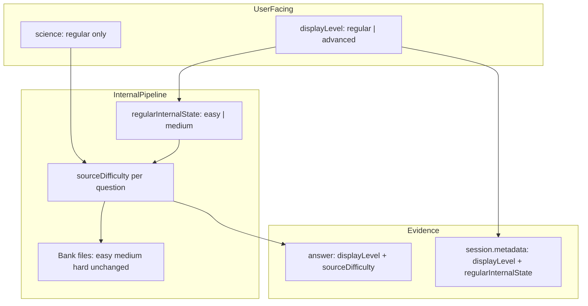
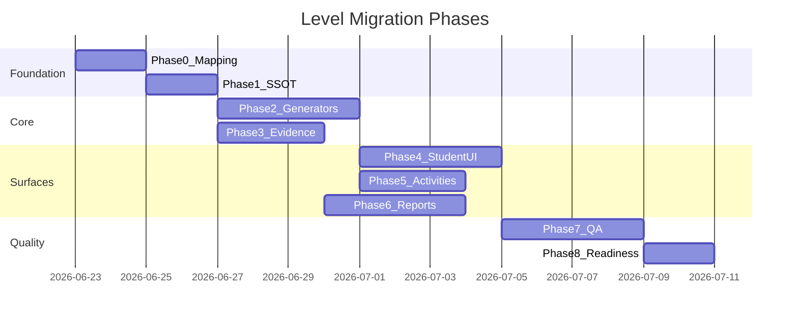

# תוכנית עבודה: מעבר מ-3 רמות ל-2 רמות (רגיל / מתקדם)

---

## 1. Executive Summary

המערכת עוברת מ-**3 רמות תצוגה** (קל / בינוני / קשה) ל-**2 רמות תצוגה** (רגיל / מתקדם), תוך **שמירה מלאה** של `easy | medium | hard` פנימית בבנקים, ב-evidence, ובדוחות פנימיים.

| displayLevel (UI) | sourceDifficulty (פנימי) | הערות |
|---|---|---|
| `regular` | `easy` + `medium` | adaptive פנימי easy↔medium |
| `advanced` | `hard` | ללא adaptive |
| `regular` (מדעים בלבד) | `easy` + `medium` + `hard` | אין מתקדם במדעים |

**גישת יישום:** שכבת mapping בלבד (Option A) — **לא** migration DB כבד, **לא** שינוי קבצי בנק, **לא** איחוד/מחיקת נושאים.

**מנגנון adaptive קיים לשימוש חוזר:** [`pages/learning/science-master.js`](pages/learning/science-master.js) כבר מיישם `applyAdaptiveDifficulty()` עם streaks (3 הצלחות → עלייה, 2 טעויות → ירידה) על `ADAPTIVE_LEVEL_ORDER`. יש לחלץ/לכלל ל-module משותף.

**מנוע אבחון:** [`utils/diagnostic-engine-v2/run-diagnostic-engine-v2.js`](utils/diagnostic-engine-v2/run-diagnostic-engine-v2.js) **לא** תלוי ב-3 רמות — רק selection, next-step, reports, activities, UI.

**סיכון עיקרי:** איבוד `sourceDifficulty` ב-evidence / localStorage / session resume → פגיעה בדוחות ו-progression. **חובה** Phase 3 לפני UI.

---

## 2. החלטות מאושרות

- `regular` = easy + medium (לא ערבוב אקראי — adaptive פנימי)
- `advanced` = hard בלבד
- מדעים: **רגיל בלבד**, פנימית easy+medium+hard
- בנקים נשארים easy/medium/hard — **אפס שינוי בקבצי שאלות**
- evidence/sessions: שני שדות — `displayLevel` + `sourceDifficulty`
- פעילויות קיימות: DB enum ישן נשאר; mapper בקריאה/תצוגה
- next-step: progression חיצוני regular→advanced; פנימי easy↔medium
- כישלון במתקדם: לא "פער יסוד" — המלצה לחזור לרגיל / "אתגר גבוה"
- QA inventory: thresholds יעודכנו ל-regular/advanced (לא 50/40/30 per easy/medium/hard)

---

## 3. מה לא עושים (Out of Scope)

- לא משנים/משכתבים בנקי שאלות
- לא מאחדים, מוחקים, מסתירים, או משנים שמות נושאים
- לא מוסיפים שאלות
- לא משנים ספרים / תוכן לימודי מעבר לרמות
- לא commit/push במסגרת תכנון זה
- לא nightly מלא אלא אם Phase 8 מחליטה אחרת

---

## 4. ארכיטקטורת רמות חדשה

### 4.1 SSOT חדש — [`lib/learning/display-level.js`](lib/learning/display-level.js) (Phase 1)

```javascript
// displayLevel: "regular" | "advanced"
// sourceDifficulty: "easy" | "medium" | "hard"

displayLevelToSourceDifficulties(displayLevel, subjectId)
// regular + non-science → ["easy","medium"]
// advanced → ["hard"]
// regular + science → ["easy","medium","hard"]

sourceDifficultyToDisplayLevel(sourceDifficulty)
// easy|medium → regular; hard → advanced

displayLevelLabelHe(displayLevel) // "רגיל" | "מתקדם"

isDisplayLevelAllowedForSubject(displayLevel, subjectId)
// science: only regular

normalizeLegacyLevelToDisplayLevel(legacy) // easy/medium/mixed→regular, hard→advanced

// backward compat for session resume / old localStorage
resolveSessionLevels({ level, displayLevel, sourceDifficulty, subjectId })
```

### 4.2 שני מישורים נפרדים



### 4.3 Adaptive בתוך "רגיל" — המלצת יישום

**Module חדש:** [`lib/learning/regular-internal-adaptive.js`](lib/learning/regular-internal-adaptive.js)

מבוסס על [`science-master.js`](pages/learning/science-master.js) lines 435-440, 1545-1577:

| פרמטר | ערך מוצע | הערה |
|---|---|---|
| `INTERNAL_ORDER` | `["easy","medium"]` | רק בתוך regular |
| `startState` | `"easy"` | תמיד |
| `advanceStreak` | 3 תשובות נכונות רצופות | כמו science |
| `dropStreak` | 2 טעויות רצופות | כמו science |
| `weights` (אופציונלי) | easy:0.8→0.3, medium:0.2→0.7 | לגenerators פרוצדורליים |

**שתי נקודות אינטגרציה:**

1. **Static banks** (עברית/אנגלית/מולדת/מדעים): לפני filter — `pickSourceDifficulty(state)` → filter ב-array
2. **Procedural** (מתמטיקה/גאומטריה): `pickSourceDifficulty(state)` → `getLevelConfig(grade, sourceDifficulty)` → `generateQuestion`

**אחרי כל תשובה:** `updateRegularInternalState(state, isCorrect)` → שמירה ב-session ref + localStorage snapshot.

**לא adaptive:** `advanced` (hard only), `mistakes`/`graded` modes (כמו science היום).

### 4.4 "מתקדם" — context בדוחות

- evidence: `displayLevel: "advanced"`, `sourceDifficulty: "hard"`
- next-step: כישלון במתקדם → step `"suggest_return_to_regular"` (חדש) במקום `drop_one_level` / `repeated_struggle` שמנוסח כפער
- copy guard: [`utils/parent-report-language/engine-decision-parent-copy-he.js`](utils/parent-report-language/engine-decision-parent-copy-he.js) — rule חדש `advanced_struggle_not_fundamental`

---

## 5. קבצים ומסכים — רשימה מלאה

### Phase 1 — תשתית
| קובץ | פעולה |
|---|---|
| [`lib/learning/display-level.js`](lib/learning/display-level.js) | **חדש** — SSOT |
| [`lib/learning/regular-internal-adaptive.js`](lib/learning/regular-internal-adaptive.js) | **חדש** — adaptive |
| [`scripts/tests/display-level-selftest.mjs`](scripts/tests/display-level-selftest.mjs) | **חדש** — unit tests |

### Phase 2 — Generators / Selection
| קובץ | פעולה |
|---|---|
| [`utils/math-question-generator.js`](utils/math-question-generator.js) | wrapper: displayLevel → sourceDifficulty pick |
| [`utils/geometry-question-generator.js`](utils/geometry-question-generator.js) | idem |
| [`utils/hebrew-question-generator.js`](utils/hebrew-question-generator.js) | `getQuestionsForGradeAndLevel` → accept array / pick |
| [`utils/english-question-generator.js`](utils/english-question-generator.js) | `ENGLISH_LEVELS` mapping |
| [`utils/science-questions.js`](utils/science-questions.js) / science filter | regular = all difficulties |
| [`utils/moledet-geography-question-generator.js`](utils/moledet-geography-question-generator.js) | idem |
| [`lib/classroom-activities/generate-activity-questions-client.js`](lib/classroom-activities/generate-activity-questions-client.js) | `normalizeActivityDifficulty` → displayLevel |
| [`lib/classroom-activities/classroom-activities-shared.server.js`](lib/classroom-activities/classroom-activities-shared.server.js) | mapper read/write, DB enum unchanged |

**Constants (labels only, keys internal):**
- [`utils/math-constants.js`](utils/math-constants.js) — `DISPLAY_LEVELS` UI object
- [`utils/geometry-constants.js`](utils/geometry-constants.js)
- [`utils/hebrew-constants.js`](utils/hebrew-constants.js)
- [`utils/moledet-geography-constants.js`](utils/moledet-geography-constants.js)
- [`pages/learning/science-master.js`](pages/learning/science-master.js) — `LEVELS` → regular only UI

### Phase 3 — Sessions / Evidence
| קובץ | פעולה |
|---|---|
| [`pages/api/learning/session/start.js`](pages/api/learning/session/start.js) | `metadata.displayLevel`, `metadata.regularInternalState` |
| [`pages/api/learning/answer.js`](pages/api/learning/answer.js) | payload: `displayLevel`, `sourceDifficulty` |
| [`utils/diagnostic-evidence.js`](utils/diagnostic-evidence.js) | `level` → split; keep `questionLevel` = sourceDifficulty |
| [`lib/parent-server/report-data-aggregate.server.js`](lib/parent-server/report-data-aggregate.server.js) | aggregate by displayLevel; preserve sourceDifficulty breakdown internal |
| localStorage snapshots בכל master | resume compat |

### Phase 4 — UI תלמיד (6 מקצועות)
| קובץ | פעולה |
|---|---|
| [`pages/learning/math-master.js`](pages/learning/math-master.js) | 2 buttons; adaptive ref; remove קל/בינוני/קשה |
| [`pages/learning/geometry-master.js`](pages/learning/geometry-master.js) | idem |
| [`pages/learning/hebrew-master.js`](pages/learning/hebrew-master.js) | idem |
| [`pages/learning/english-master.js`](pages/learning/english-master.js) | idem; G1-G2: regular only (no advanced if no hard pool — verify) |
| [`pages/learning/science-master.js`](pages/learning/science-master.js) | **רגיל בלבד**; hide level picker; internal adaptive on all 3 |
| [`pages/learning/moledet-geography-master.js`](pages/learning/moledet-geography-master.js) | idem |
| [`pages/learning/curriculum.js`](pages/learning/curriculum.js) | level labels in curriculum view |
| [`pages/learning/parent-report.js`](pages/learning/parent-report.js) | student-facing report if any level text |

### Phase 5 — פעילויות הורה/מורה
| קובץ | פעולה |
|---|---|
| [`components/parent/AssignActivityModal.js`](components/parent/AssignActivityModal.js) | radio: רגיל/מתקדם; science: רגיל only |
| [`components/parent/ParentSentActivitiesPanel.jsx`](components/parent/ParentSentActivitiesPanel.jsx) | display mapper |
| [`lib/parent-server/parent-activity.server.js`](lib/parent-server/parent-activity.server.js) | write displayLevel; map to DB enum |
| [`lib/teacher-server/teacher-activities.server.js`](lib/teacher-server/teacher-activities.server.js) | idem |
| [`pages/teacher/students/activities/new.js`](pages/teacher/students/activities/new.js) | UI labels |
| [`pages/teacher/class/[classId]/activities/new.js`](pages/teacher/class/[classId]/activities/new.js) | idem |
| [`pages/api/teacher/activities/index.js`](pages/api/teacher/activities/index.js) | API validation |
| Activity monitor / result modals | grep `difficulty` → update |

### Phase 6 — דוחות הורים
| קובץ | פעולה |
|---|---|
| [`utils/parent-report-language/parent-report-display-labels.he.js`](utils/parent-report-language/parent-report-display-labels.he.js) | `PARENT_REPORT_LEVEL_LABELS_HE`: regular/advanced |
| [`utils/parent-report-v2.js`](utils/parent-report-v2.js) | aggregation, dominant displayLevel |
| [`utils/parent-report-language/parent-facing-normalize-he.js`](utils/parent-report-language/parent-facing-normalize-he.js) | remove medium→בינוני replacements for level context |
| [`utils/parent-report-language/forbidden-terms.js`](utils/parent-report-language/forbidden-terms.js) | add קל/בינוני/קשה as forbidden in parent copy |
| [`utils/parent-report-language/subject-withhold-summary-he.js`](utils/parent-report-language/subject-withhold-summary-he.js) | level wording |
| [`utils/topic-next-step-engine.js`](utils/topic-next-step-engine.js) | dual progression (see §7) |
| parentReportTruth snapshots / [`scripts/launch-readiness/`](scripts/launch-readiness/) | update expected labels |

### Phase 7 — QA
| קובץ | פעולה |
|---|---|
| [`scripts/qa-question-inventory-matrix.mjs`](scripts/qa-question-inventory-matrix.mjs) | columns: regular/advanced |
| [`scripts/lib/qa-inventory-professional.mjs`](scripts/lib/qa-inventory-professional.mjs) | thresholds per displayLevel |
| [`scripts/tests/parent-report-display-labels-selftest.mjs`](scripts/tests/parent-report-display-labels-selftest.mjs) | new labels |
| [`scripts/tests/hebrew-copy-delta-gate-*.mjs`](scripts/tests/) | forbidden old terms |
| [`scripts/tests/student-activities-unit.mjs`](scripts/tests/student-activities-unit.mjs) | activity mapper |
| Visual QA scripts / virtual students | level personas |
| [`scripts/truth-gates/gate-registry.mjs`](scripts/truth-gates/gate-registry.mjs) | if level-sensitive |

### Phase 8 — Admin (minimal)
| קובץ | פעולה |
|---|---|
| [`pages/admin/analytics.js`](pages/admin/analytics.js) | filters: show displayLevel; keep sourceDifficulty in debug |
| QA preview pages (if any) | internal debug only — OK to show easy/medium/hard |

---

## 6. השפעה לפי מקצוע

| מקצוע | UI | Selection | Adaptive | הערות |
|---|---|---|---|---|
| **מתמטיקה** | רגיל/מתקדם | regular→easy+medium, advanced→hard | easy↔medium in regular | procedural via levelConfig |
| **גאומטריה** | idem | idem | idem | 12 regular-thin + 14 advanced-thin cells — no bank change |
| **עברית** | idem | static filter array | idem | `augmentThinHebrewPool` cross-level stays internal |
| **אנגלית** | idem | idem | idem | phonics/translation: mapping only; G1-G2 verify advanced availability |
| **מדעים** | **רגיל בלבד** | regular→easy+medium+hard | existing science adaptive → extend to all 3 internal | hides advanced; avoids 32 thin advanced cells |
| **מולדת** | idem | idem | idem | launch G2-G6 static counts OK |

---

## 7. השפעה על מנוע / Next-Step

[`utils/topic-next-step-engine.js`](utils/topic-next-step-engine.js) — `LEVEL_ORDER = ["easy","medium","hard"]` (line 95)

### שינוי מבני

```javascript
const DISPLAY_LEVEL_ORDER = ["regular", "advanced"];
const INTERNAL_DIFFICULTY_ORDER = ["easy", "medium"]; // within regular only
const SOURCE_DIFFICULTY_ORDER = ["easy", "medium", "hard"]; // evidence only
```

### החלטות progression (מוצע — לאישור בעלים)

| שאלה | המלצה |
|---|---|
| מתי regular→advanced? | accuracy ≥75%, ≥20 שאלות ב-regular, ≥60% medium-sourced, stability/confidence כמו `advanceLevelAccMin` היום |
| לפי זמן? | לא primary; responseMs רק כ-signal ל-adaptive פנימי |
| easy חזק + medium חלש? | נשאר regular; next-step `"maintain_regular_strengthen_medium"` |
| advanced failure? | `"suggest_return_to_regular"` — לא `drop_one_level` / לא grade drop |
| science | progression רק regular; אין advanced track |

### rules לעדכן
- `highVolumeStrong` + `advance_one_level` → `advance_to_advanced`
- `repeatedStruggle` at advanced → `suggest_return_to_regular` (לא drop to medium)
- `repeatedStruggle` at regular + mostly easy evidence → `"maintain_regular"` (internal already drops)
- `levelLabel` in trace → `displayLevelLabelHe`

**Diagnostic core:** ללא שינוי — skill/subskill/mistake patterns.

---

## 8. השפעה על דוח הורה

### מה ההורה רואה
- רגיל / מתקדם (או "תרגול רגיל" / "אתגר מתקדם" — **copy לאישור בעלים**)
- מדעים: תמיד "רגיל" / "תרגול במדעים" — בלי mention מתקדם

### מה נשמר פנימית
- כל answer: `{ displayLevel, sourceDifficulty }`
- aggregation: dominant `displayLevel` לתצוגה; breakdown easy/medium/hard **פנימי בלבד** (לא ב-PDF)

### נקודות בדיקה
1. [`parent-report-display-labels.he.js`](utils/parent-report-language/parent-report-display-labels.he.js) lines 91-93 — **החלפה**
2. `formatParentReportLevelHe` — map via displayLevel
3. `parentReportTruth` snapshots — regenerate expected strings
4. copy guard — אסור קל/בינוני/קשה ב-output להורה
5. advanced failure narrative — rule חדש ב-engine-decision-parent-copy
6. science — אין שורת "מתקדם" בדוח
7. דוח מפורט — breakdown פנימי ב-JSON/debug; UI מציג רק regular/advanced

---

## 9. השפעה על פעילויות הורה/מורה

### DB (ללא migration)
- `difficulty_level`: `easy|medium|hard|mixed` — **נשאר**
- כתיבה חדשה: `regular`→store `mixed` (or `medium` + flag); `advanced`→`hard`
- קריאה: mapper → display

### Backward compat
| stored | displayed | generator pulls |
|---|---|---|
| easy | רגיל | easy+medium (adaptive) |
| medium | רגיל | easy+medium |
| mixed | רגיל | easy+medium |
| hard | מתקדם | hard |

### flows לבדוק
- draft → active → student attempt → submit → evidence → parent report
- preview modal in AssignActivityModal
- teacher monitor + export labels
- resume in-progress activity

---

## 10. Copy בעברית — מיפוי (grep targets)

**אסור ב-UI הורה/ילד/מורה:** קל, בינוני, קשה, easy, medium, hard, difficulty

**קבצים עם מופעים ידועים (לא exhaustive — Phase 0 grep מלא):**

| אזור | קבצים |
|---|---|
| Student masters | 6 × `*-master.js`, `curriculum.js` |
| Parent activity | `AssignActivityModal.js` (lines 335-348) |
| Teacher | `pages/teacher/**/activities/new.js`, `pages/api/teacher/activities/index.js` |
| Reports | `parent-report-display-labels.he.js`, `parent-facing-normalize-he.js`, `subject-withhold-summary-he.js`, `topic-next-step-engine.js` (Hebrew copy builders) |
| Constants | `*-constants.js` LEVELS.name fields |

**Phase 0 deliverable:** `reports/level-migration-copy-inventory.json` — grep output לכל term.

**הערה:** `parent-facing-normalize-he.js` line 267-268 (`medium→בינוני`) — להסיר/להגביל להקשר non-level.

---

## 11. QA — תוכנית בדיקות

### עדכון tests
- `display-level-selftest.mjs` (חדש)
- `parent-report-display-labels-selftest.mjs`
- `student-activities-unit.mjs`
- `qa-question-inventory-matrix.mjs` + professional thresholds
- activity generator tests
- copy guard / hebrew-copy-delta-gate
- parentReportTruth / copilot-truth-audit

### סדר הרצה אחרי ביצוע

1. `node scripts/tests/display-level-selftest.mjs`
2. Unit: mapper + adaptive state machine
3. Per-subject generator probe:
   - regular → only easy/medium (science: all 3)
   - advanced → only hard
4. Evidence round-trip: answer API → diagnostic-evidence → aggregate
5. Activity E2E: create regular/advanced/science → submit
6. Parent report: no old terms; sourceDifficulty preserved in raw
7. Visual QA: screenshots 6 subjects + parent + teacher
8. Smoke six subjects (virtual student if available)
9. `npm run qa:question-inventory-matrix` — new thresholds
10. daily-gate / truth-gates — confirm no new blockers
11. **החלטה:** nightly מלא רק אם visual/truth regressions

### Inventory thresholds חדשים (מוצע)
| displayLevel | min per topic cell |
|---|---|
| regular (non-science) | easy+medium combined ≥ 16 (same as today easy+medium sum) |
| advanced | hard ≥ 16 |
| science regular | easy+medium+hard ≥ 16 |

---

## 12. סיכונים

| סיכון | חומרה | mitigation |
|---|---|---|
| איבוד sourceDifficulty ב-resume | גבוה | Phase 3 לפני UI; compat layer for old snapshots |
| regular = random easy+medium | בינוני | enforce adaptive module; test streak behavior |
| advanced failure → "פער יסוד" | גבוה | new next-step rule + copy guard |
| science shows מתקדם | בינוני | `isDisplayLevelAllowedForSubject` in every UI entry |
| old activities break | גבוה | read mapper; never reject old enum |
| procedural math wrong config | בינוני | per-question sourceDifficulty pick before getLevelConfig |
| QA inventory false flags | נמוך | re-aggregate columns before gate |
| English G1-G2 no hard | נמוך | hide advanced if pool empty (optional guard) |

---

## 13. תוכנית ביצוע לפי Phases



### Phase 0 — מיפוי (2 ימים)
- Grep מלא: קל/בינוני/קשה/easy/medium/hard/difficulty
- רשימת snapshots/truth fixtures
- אישור thresholds inventory
- **Output:** `reports/level-migration-impact.json`

### Phase 1 — SSOT (2 ימים)
- `display-level.js` + `regular-internal-adaptive.js`
- Unit tests green

### Phase 2 — Generators (4 ימים)
- כל 6 generators + activity client
- Probe script: 100 samples per subject×displayLevel

### Phase 3 — Evidence (3 ימים, parallel with Phase 2 after Phase 1)
- session/answer API
- diagnostic-evidence
- aggregate server
- Old snapshot compat

### Phase 4 — Student UI (4 ימים)
- 6 masters + curriculum
- Science regular-only
- localStorage resume

### Phase 5 — Activities (3 ימים)
- Parent + teacher flows
- Backward compat verified

### Phase 6 — Reports (4 ימים)
- Labels, next-step, copy guards
- parentReportTruth regen
- Advanced failure narrative

### Phase 7 — QA (4 ימים)
- Update all tests listed in §11
- Visual QA pass
- Six-subject smoke

### Phase 8 — Readiness (2 ימים)
- Owner screenshot review
- daily-gate READY
- Closure report

**תלות קריטית:** Phase 3 ≥ Phase 2 start (evidence schema before wide UI); Phase 6 after Phase 3.

---

## 14. Definition of Done

### UI
- [ ] אין קל/בינוני/קשה בילד/הורה/מורה
- [ ] רגיל/מתקדם בכל מקצוע חוץ ממדעים
- [ ] מדעים: רגיל בלבד

### בנקים
- [ ] zero diff in question bank files
- [ ] difficulty in banks unchanged

### Selection
- [ ] regular → easy+medium (adaptive)
- [ ] advanced → hard
- [ ] science regular → easy+medium+hard

### Evidence
- [ ] displayLevel + sourceDifficulty on every answer
- [ ] resume sessions preserve both
- [ ] no data loss in aggregate

### דוח הורה
- [ ] parent sees regular/advanced only
- [ ] advanced failure not framed as fundamental gap
- [ ] science shows regular only

### פעילויות
- [ ] new: regular/advanced; science regular only
- [ ] old activities display correctly
- [ ] easy/medium/mixed→רגיל, hard→מתקדם

### QA
- [ ] all mapping tests pass
- [ ] generator probes pass
- [ ] parent report truth pass
- [ ] visual QA pass
- [ ] no daily-gate blocker
- [ ] copy inventory clean

---

## 15. אישורי בעלים לפני קוד

1. **Copy סופי:** "רגיל/מתקדם" vs "תרגול רגיל/אתגר מתקדם" בדוח
2. **Progression thresholds:** מתי ממליצים advanced (§7 table)
3. **Activity DB mapping:** `regular`→`mixed` vs `medium` — preferred `mixed`
4. **English G1-G2:** להסתיר מתקדם אם אין hard pool?
5. **Inventory thresholds:** combined regular min 16 — approve
6. **Science adaptive:** להמשיך streak-based (3 up / 2 down) על easy→medium→hard?
7. **Nightly:** full rerun required for launch sign-off? (yes/no)

---

## 16. Phase 0 — פקודות מיפוי (read-only, לפני קוד)

```bash
# Copy inventory
rg -n "קל|בינוני|קשה" pages components lib utils --glob "*.{js,jsx,mjs}"
rg -n "\\beasy\\b|\\bmedium\\b|\\bhard\\b|difficulty" pages components lib --glob "*.{js,jsx}"

# Level constants
rg -n "LEVELS|LEVEL_ORDER|DIFFICULTY" utils pages lib

# Evidence path
rg -n "metadata\\.level|questionLevel|sourceDifficulty" pages/api utils lib
```

**Expected count:** ~40-60 production files (excluding tests/scripts/admin-debug).
