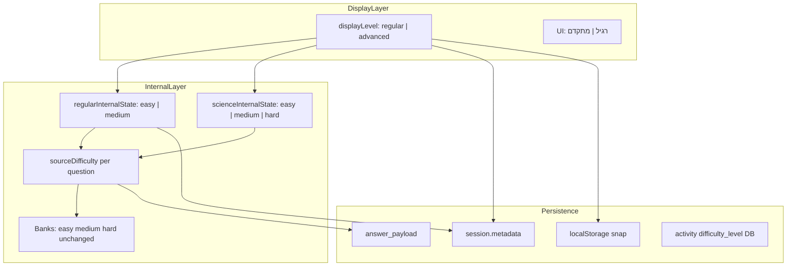

# Plan V2 — מעבר מ-3 רמות ל-2 רמות (רגיל / מתקדם)

**סטטוס:** מסמך סופי לאישור בעלים — **לא לבצע קוד עד אישור.**

---

## 1. Executive Summary

הפרויקט משנה **רק** את שכבת התצוגה, המיפוי, בחירת השאלות, ה-evidence, הדוחות וה-UI סביב רמות קושי. **אין** שינוי בבנקי שאלות, בנושאים, בתוכן לימודי, ב-DB schema, או ב-migration.

| מה המשתמש רואה | `displayLevel` | מה המערכת שואבת (`sourceDifficulty`) |
|---|---|---|
| רגיל | `regular` | `easy` + `medium` (adaptive פנימי) |
| מתקדם | `advanced` | `hard` בלבד |
| רגיל (מדעים בלבד) | `regular` | `easy` + `medium` + `hard` |

**עקרון מנחה:** שני שדות בכל evidence — `displayLevel` (מה נבחר/מוצג) + `sourceDifficulty` (מה השאלה באמת הייתה).

**גישת יישום:** שכבת mapping (Option A) — SSOT חדש, mappers, adaptive module משותף, תיקון באג קיים (`mixed`→`medium` בפעילויות).

**היקף:** ~55–70 קבצי production + ~25 קבצי QA/tests. 8 phases, ~25 ימי עבודה משוערים.

**סיכון #1:** איבוד `sourceDifficulty` ב-resume / aggregate — Phase 3 חובה לפני Phase 4.

**סיכון #2:** `normalizeActivityDifficulty` ב-[`generate-activity-questions-client.js`](lib/classroom-activities/generate-activity-questions-client.js) שורה 205 — היום `mixed`→`medium` בלבד. **חייב** להשתנות ל-easy+medium (ומדעים: easy+medium+hard).

---

## 2. החלטות בעלים סופיות

| # | החלטה | סטטוס |
|---|---|---|
| 1 | UI: רגיל / מתקדם במקום קל / בינוני / קשה | **סופי** |
| 2 | `regular` = easy + medium; `advanced` = hard | **סופי** |
| 3 | בנקים: zero change — easy/medium/hard נשאר | **סופי** |
| 4 | evidence: `displayLevel` + `sourceDifficulty` בכל מקום רלוונטי | **סופי** |
| 5 | רגיל = adaptive פנימי (לא ערבוב אקראי) | **סופי** |
| 6 | מתקדם = hard; כישלון ≠ פער יסוד אוטומטי | **סופי** |
| 7 | מדעים: regular-only; פנימית easy+medium+hard | **סופי** |
| 8 | פעילויות: DB enum ישן; mapper read/write; mixed/regular → easy+medium | **סופי** |
| 9 | כתיבה חדשה: `regular`→`mixed`, `advanced`→`hard` | **סופי (מומלץ)** |
| 10 | פרויקט = רמות בלבד — לא נושאים/שאלות/ספרים/משחקים | **סופי** |
| 11 | English G1–G2: **הסתר מתקדם** (ראה §8) | **מומלץ — לאישור** |
| 12 | Science adaptive: streak 3↑ / 2↓ על easy→medium→hard | **מומלץ — לאישור** |
| 13 | Progression regular→advanced: ≥75% acc, ≥20 שאלות, ≥60% medium-sourced | **מומלץ — לאישור** |
| 14 | Copy בדוח: "רגיל/מתקדם" vs "תרגול רגיל/אתגר מתקדם" | **לאישור copy** |
| 15 | Nightly מלא לפני launch signoff | **לאישור** |

---

## 3. מה לא עושים

- לא משנים `difficulty` / `levelKey` בקבצי בנק שאלות
- לא מוחקים / מוסיפים / מאחדים / מסתירים / משנים שמות נושאים
- לא משנים ספרים, משחקים, prototypes, arcade
- לא DB migration / ALTER TABLE / enum change
- לא commit / push / Phase 0 בפועל עד אישור V2
- נושא דל שמתגלה במיפוי → **רק** רישום ב-`level-migration-impact.json`, לא טיפול

---

## 4. ארכיטקטורת רמות חדשה

### 4.1 שני מישורים



### 4.2 SSOT — [`lib/learning/display-level.js`](lib/learning/display-level.js) (חדש)

```javascript
// Types
// displayLevel: "regular" | "advanced"
// sourceDifficulty: "easy" | "medium" | "hard"

displayLevelToSourceDifficulties(displayLevel, subjectId)
sourceDifficultyToDisplayLevel(sourceDifficulty)
displayLevelLabelHe(displayLevel)           // "רגיל" | "מתקדם"
isDisplayLevelAllowedForSubject(displayLevel, subjectId)
isAdvancedAvailableForSubjectGrade(subjectId, gradeKey, topicKey?)  // English G1-G2
normalizeLegacyLevelToDisplayLevel(legacy)  // easy|medium|mixed→regular; hard→advanced
displayLevelToActivityDbEnum(displayLevel)    // regular→mixed; advanced→hard
activityDbEnumToDisplayLevel(dbEnum)        // inverse + mixed→regular
resolveSessionLevels({ level, displayLevel, sourceDifficulty, regularInternalState, subjectId })
```

### 4.3 Modules adaptive (חדשים)

| Module | שימוש |
|---|---|
| [`lib/learning/regular-internal-adaptive.js`](lib/learning/regular-internal-adaptive.js) | regular בכל מקצוע **חוץ ממדעים** — `INTERNAL_ORDER = ["easy","medium"]` |
| [`lib/learning/science-internal-adaptive.js`](lib/learning/science-internal-adaptive.js) | מדעים regular-only — `INTERNAL_ORDER = ["easy","medium","hard"]` — refactor מ-[`science-master.js`](pages/learning/science-master.js) |

**מקור קיים:** [`science-master.js`](pages/learning/science-master.js):
- `ADAPTIVE_LEVEL_ORDER = ["easy","medium","hard"]` (שורה 227)
- `stepAdaptiveLevel()` (435–440)
- `applyAdaptiveDifficulty()` (1545–1577): 3 הצלחות → +1, 2 טעויות → −1
- לא פעיל ב-`mistakes` / `graded` modes

---

## 5. displayLevel / sourceDifficulty — איפה נשמרים

### 5.1 טבלת שמירה מלאה

| שכבה | שדות חדשים | שדות legacy (compat) | קובץ/מיקום |
|---|---|---|---|
| **UI state (React)** | `displayLevel`, `regularInternalStateRef` | `level` (deprecated, mapped on read) | כל `*-master.js` |
| **Session start API** | `metadata.displayLevel`, `metadata.regularInternalState` | `metadata.level` = displayLevel for old readers | [`session/start.js`](pages/api/learning/session/start.js) |
| **Answer API payload** | `clientMeta.displayLevel`, `clientMeta.sourceDifficulty` | `clientMeta.level` = sourceDifficulty (transitional) | [`answer.js`](pages/api/learning/answer.js) |
| **answer_payload (DB)** | `displayLevel`, `sourceDifficulty` top-level | `questionEngine.difficulty` unchanged | insertAnswerRow |
| **diagnostic-evidence** | `displayLevel`, `sourceDifficulty` | `level`, `questionLevel` = sourceDifficulty | [`diagnostic-evidence.js`](utils/diagnostic-evidence.js) |
| **diagnosticMetadata** | `displayLevel`, `sourceDifficulty` | `difficulty`/`difficultyDepth` from question engine | [`diagnostic-canonical-metadata.js`](lib/learning/diagnostic-canonical-metadata.js) |
| **localStorage snap** | `displayLevel`, `regularInternalState`, `correctStreak`, `wrongStreak` | `level` mapped via `resolveSessionLevels` | `STORAGE_KEY` per master |
| **learning profile progress** | same as snap | `key = ${displayLevel}_${topic}` replaces `${level}_${topic}` for scores | math-master scores key |
| **Activity DB** | — (no schema change) | `difficulty_level`: easy/medium/hard/mixed | Supabase tables |
| **Activity play metadata** | `displayLevel` in snapshot | maps from `difficulty_level` | [`assigned-activity-play-metadata.server.js`](lib/classroom-activities/assigned-activity-play-metadata.server.js) |
| **Aggregate (parent report)** | `dominantDisplayLevel` per row | internal `_sourceDifficultyBreakdown` (not in PDF) | [`report-data-aggregate.server.js`](lib/parent-server/report-data-aggregate.server.js) |
| **Mistakes localStorage** | `sourceDifficulty` per mistake event | existing `level` field → sourceDifficulty | `mleo_mistakes` per subject |
| **parentReportTruth snapshots** | expected regular/advanced strings | regenerate all fixtures | `scripts/launch-readiness/` |

### 5.2 כלל שדות

```javascript
// Per answer (required)
{
  displayLevel: "regular" | "advanced",
  sourceDifficulty: "easy" | "medium" | "hard",
}

// Per session (required when displayLevel === "regular")
{
  displayLevel: "regular" | "advanced",
  regularInternalState: "easy" | "medium",           // non-science
  // OR scienceInternalState: "easy" | "medium" | "hard"  // science
}
```

### 5.3 Backward compat — קריאת נתונים ישנים

| נתון ישן | displayLevel | sourceDifficulty | regularInternalState |
|---|---|---|---|
| `level: "easy"` | regular | easy | easy |
| `level: "medium"` | regular | medium | medium |
| `level: "hard"` | advanced | hard | — |
| `level: "mixed"` | regular | easy (start) | easy |
| activity `easy` | regular | per-question | adaptive |
| activity `mixed` | regular | per-question | adaptive |
| activity `hard` | advanced | hard | — |

---

## 6. Adaptive בתוך רגיל — פירוט מלא

### 6.1 אלגוריתם (מבוסס science-master, מכלל ל-regular-internal-adaptive)

| פרמטר | ערך | הערה |
|---|---|---|
| `startState` | `"easy"` | תמיד בתחילת סשן regular |
| `advanceStreak` | 3 תשובות נכונות רצופות | ↑ רמה פנימית |
| `dropStreak` | 2 תשובות שגויות רצופות | ↓ רמה פנימית |
| `INTERNAL_ORDER` (רגיל) | `["easy","medium"]` | לא יורד מתחת easy, לא עולה מעל medium |
| `INTERNAL_ORDER` (מדעים) | `["easy","medium","hard"]` | science-internal-adaptive |
| modes ללא adaptive | `mistakes`, `graded`, `parent_assigned` fixed level | כמו science היום |

**לא** משתמשים ב-weighted random כ-primary — streak-based step (כמו science) הוא SSOT. Weighted selection רק כ-fallback אם pool ריק ב-level הנוכחי.

### 6.2 איפה נשמר regularInternalState

1. **React ref** (runtime): `regularInternalStateRef` + `correctStreakRef` + `wrongStreakRef`
2. **localStorage snap** (resume): בכל master, יחד עם `displayLevel`
3. **session metadata** (server): ב-`startLearningSession` payload → `metadata.regularInternalState`
4. **clientMeta per answer**: `regularInternalState` at time of question (optional audit)

### 6.3 איך מתעדכן

```
onAnswer(isCorrect):
  if displayLevel !== "regular" → skip adaptive
  if mode in NO_ADAPTIVE_MODES → skip
  update streaks
  if correctStreak >= 3 → stepInternal(+1); reset correctStreak
  if wrongStreak >= 2 → stepInternal(-1); reset wrongStreak
  pick next question using current internal state
  persist to ref + debounced localStorage snap
```

### 6.4 לפי מקצוע

| מקצוע | displayLevel UI | internal adaptive | question pick |
|---|---|---|---|
| **מתמטיקה** | regular/advanced | easy↔medium | `pickInternalState()` → `getLevelConfig(grade, state)` → `generateQuestion` |
| **גאומטריה** | idem | idem | idem |
| **עברית** | idem | idem | `getQuestionsForGradeAndLevel(grade, state, topic)` — filter static bank |
| **אנגלית** | idem (G1-G2: regular only) | idem | `ENGLISH_LEVELS[state]` config |
| **מדעים** | **regular only** (no picker) | easy↔medium↔hard | filter `QUESTIONS` by `levelKey === state`; existing retry queue unchanged |
| **מולדת** | regular/advanced | easy↔medium | static bank filter |

**Procedural (math/geometry):** `sourceDifficulty` = `regularInternalState` at generation time; question object gets `assignedLevel: sourceDifficulty`, `displayLevel: "regular"`.

**Static banks:** filter by single `sourceDifficulty`; if pool empty at current state, step down once then cross-level fallback (existing `augmentThinHebrewPool` stays — internal only).

### 6.5 Resume session

**Flow:**
1. Load localStorage snap / learning profile
2. `resolveSessionLevels(snap)` → displayLevel + regularInternalState
3. If old snap has only `level: "medium"` → displayLevel=regular, internalState=medium
4. If old snap has `level: "hard"` → displayLevel=advanced, no internal state
5. Restore streak counters from snap if present; else reset to 0
6. Session start sends resolved values to server metadata
7. **Answers before migration** in DB: backfill displayLevel via `sourceDifficultyToDisplayLevel(questionLevel)` at aggregate read time only — no DB rewrite

---

## 7. מתקדם — התנהגות וכישלון

### 7.1 Selection
- `displayLevel === "advanced"` → **only** `sourceDifficulty === "hard"`
- No internal adaptive — fixed hard band
- Same streak/retry logic as today for wrong answers

### 7.2 כישלון במתקדם — דוחות ו-next-step

**כלל:** advanced struggle ≠ fundamental gap.

| Today (to replace) | V2 behavior |
|---|---|
| `repeatedStruggle && li >= 1` → `drop_one_level_topic_only` | If `displayLevel === "advanced"` → **`suggest_return_to_regular`** |
| Copy: "הורדת רמת קושי" | Copy: "האתגר היה גבוה — מומלץ לחזור לתרגול רגיל" |
| `drop_one_grade_topic_only` at advanced | **Never** — no grade drop from advanced failure alone |

**New next-step steps** in [`topic-next-step-engine.js`](utils/topic-next-step-engine.js):
- `suggest_return_to_regular` — advanced failure, recommend regular
- `advance_to_advanced` — replaces `advance_one_level` / `advance_level` at regular mastery
- `maintain_regular_strengthen_medium` — strong on easy, weak on medium

**Copy guard** in [`engine-decision-parent-copy-he.js`](utils/parent-report-language/engine-decision-parent-copy-he.js):
- Rule `advanced_struggle_not_fundamental`: block phrases like "פער יסודי", "חוסר הבנה בסיסית" when `displayLevel === "advanced"` && acc < threshold
- Allow: "רמת אתגר גבוהה", "מומלץ תרגול רגיל"

**Evidence context:** aggregate tags advanced sessions with `challengeContext: "high"` for narrative — not stored in DB schema, computed at report time from `displayLevel`.

---

## 8. מדעים regular-only — פירוט מלא

### 8.1 כלל
- `displayLevel` תמיד `"regular"` במדעים
- Selection: easy + medium + hard (full pool)
- Internal adaptive: easy → medium → hard (science-internal-adaptive)
- **אין** `advanced` בשום surface

### 8.2 Enforcement checklist

| Surface | Enforcement | File |
|---|---|---|
| Student UI — level picker | **Hide entirely**; no regular/advanced toggle | [`science-master.js`](pages/learning/science-master.js) |
| Student UI — force displayLevel | `useState("regular")` fixed; remove `scienceLevelKeysForGradeKey` UI map | science-master.js |
| Student — G1-G2 | Today only easy in UI; V2: regular pulls all 3 internally, adaptive may step through medium/hard | science-master.js |
| Parent AssignActivityModal | Only "רגיל" radio; no advanced option when subject=science | [`AssignActivityModal.js`](components/parent/AssignActivityModal.js) |
| Teacher activity new | Same | `pages/teacher/**/activities/new.js` |
| Activity generator | `resolveActivitySourceDifficulties("mixed", "science")` → all 3 | [`generate-activity-questions-client.js`](lib/classroom-activities/generate-activity-questions-client.js) |
| Activity DB write | always `mixed` for new science activities | parent/teacher server |
| Report labels | Never show "מתקדם" for science rows | [`parent-report-display-labels.he.js`](utils/parent-report-language/parent-report-display-labels.he.js) |
| Report aggregation | science rows: `displayLevel = "regular"` always | [`report-data-aggregate.server.js`](lib/parent-server/report-data-aggregate.server.js) |
| next-step engine | No `advance_to_advanced` for science | topic-next-step-engine.js |
| Evidence | `displayLevel: "regular"` always; `sourceDifficulty` per question | diagnostic-evidence.js |
| QA inventory matrix | science columns: `regular` only; no `advanced` column | qa-question-inventory-matrix.mjs |
| QA probes | science never probed as advanced | generator probe script |
| parentReportTruth | science fixtures: no advanced strings | launch-readiness snapshots |
| copy guard | forbid "מתקדם" adjacent to "מדעים" | forbidden-terms.js |
| curriculum.js | science: no level choice display | curriculum.js |
| `isDisplayLevelAllowedForSubject` | `(advanced, science) → false` | display-level.js |

### 8.3 טקסטים קיימים במדעים
[`science-master.js`](pages/learning/science-master.js) lines 140–144: `LEVELS` עם קל/בינוני/קשה — **יוסר מ-UI**; internal keys remain. `currentLevelLabel` in insights → hidden from student or shows "רגיל" only.

---

## 9. השפעה לפי מקצוע

| מקצוע | UI | Generator pull | Adaptive | Thin pool notes |
|---|---|---|---|---|
| מתמטיקה | רגיל/מתקדם | regular: E+M; adv: H | easy↔medium | 0 regular-thin, 0 advanced-thin |
| גאומטריה | idem | idem | idem | 12+14 thin cells — **document only** |
| עברית | idem | idem | idem | 8+13 thin — document only |
| אנגלית | G3–G6: רגיל/מתקדם; **G1–G2: רגיל only** | idem | idem | 5+10 thin; G1-G2 no advanced UI |
| מדעים | **רגיל only** | regular: E+M+H | easy↔medium↔hard | avoids 32 thin advanced cells |
| מולדת | רגיל/מתקדם | idem | idem | G2-G6 OK |

---

## 10. השפעה על בחירת שאלות / Generators

### 10.1 כלל selection

```
resolveQuestionSelection(displayLevel, subjectId, regularInternalState):
  if subjectId === "science":
    return pickFromDifficulties(["easy","medium","hard"], scienceInternalState)
  if displayLevel === "advanced":
    return pickFromDifficulties(["hard"])
  return pickFromDifficulties(["easy","medium"], regularInternalState)
```

### 10.2 קבצים

| Generator | שינוי נדרש |
|---|---|
| [`utils/math-question-generator.js`](utils/math-question-generator.js) | Entry accepts `displayLevel` + `sourceDifficulty`; config from sourceDifficulty |
| [`utils/geometry-question-generator.js`](utils/geometry-question-generator.js) | idem |
| [`utils/hebrew-question-generator.js`](utils/hebrew-question-generator.js) | `getQuestionsForGradeAndLevel(grade, levelKey, topic)` — caller passes picked sourceDifficulty |
| [`utils/english-question-generator.js`](utils/english-question-generator.js) | `ENGLISH_LEVELS` keys unchanged; wrapper maps displayLevel |
| Science filter in [`science-master.js`](pages/learning/science-master.js) | Filter all 3; tag `sourceDifficulty` on question |
| [`utils/moledet-geography-question-generator.js`](utils/moledet-geography-question-generator.js) | idem hebrew pattern |
| [`lib/classroom-activities/generate-activity-questions-client.js`](lib/classroom-activities/generate-activity-questions-client.js) | **Critical:** new `resolveActivitySourceDifficulties()`; remove `mixed→medium` |

### 10.3 באג קיים — mixed בפעילויות

```javascript
// TODAY (WRONG for V2):
mixed → medium only  // line 205

// V2:
mixed → ["easy","medium"]  // non-science
mixed → ["easy","medium","hard"]  // science
// + adaptive per question OR round-robin weighted by activity progress
```

For fixed-count activities (10 questions): distribute ~70% easy / ~30% medium at start, shift ratio via adaptive state machine across the activity.

### 10.4 English G1–G2 — המלצה

**מצב היום:** [`english-master.js`](pages/learning/english-master.js) line 157–161 — G1-G2: `["easy","medium"]` only in UI; hard excluded by owner policy.

**המלצה V2:** **הסתיר מתקדם** ב-G1-G2 (regular only), באותו אופן כמו מדעים:
- `isAdvancedAvailableForSubjectGrade("english", "g1"|"g2") → false`
- UI: כפתור רגיל בלבד
- פעילויות הורה/מורה: רגיל בלבד
- **סיבה:** advanced=hard only; ב-G1-G2 אין hard ב-UI היום; חלק מה-topics דלים ב-hard (5+10 thin cells במאגר)
- **סיכון אם מציגים מתקדם:** pool ריק / fallback שגוי → broken activity
- **סיכון אם מסתירים:** UX שונה מ-G3+ — mitigated by label "רגיל" same as other single-level case (science)
- **השלכה:** English G1-G2 treated like science for displayLevel purposes only; internal still adaptive easy↔medium

---

## 11. השפעה על sessions / answers / evidence / resume

### 11.1 session/start.js
- Accept `displayLevel` in body (new) + legacy `level`
- Persist: `metadata.displayLevel`, `metadata.regularInternalState`, `metadata.level` = displayLevel (compat)

### 11.2 answer.js
- Accept `clientMeta.displayLevel`, `clientMeta.sourceDifficulty`
- Add to `answerPayload` top-level
- Pass to `buildDiagnosticCanonicalMetadata`

### 11.3 diagnostic-evidence.js
- `level` → prefer `displayLevel` for aggregation keys
- `questionLevel` → always `sourceDifficulty`
- New fields: `displayLevel`, `sourceDifficulty` explicit

### 11.4 Masters — session start payload (pattern from math-master)
```javascript
// buildSessionStartPayload() — all masters
{
  level: displayLevel,           // compat: server sees displayLevel
  displayLevel,
  regularInternalState,
  clientMeta: { source: "*-master", version: "level-v2", ... }
}

// per answer clientMeta
{
  displayLevel,
  sourceDifficulty: question.sourceDifficulty ?? question.levelKey,
  regularInternalState: regularInternalStateRef.current,
}
```

### 11.5 Resume
- Extend snap schema in all 6 masters (grep: `snap.level` — 6 files)
- `resolveSessionLevels()` on load
- Scores key migration: `${displayLevel}_${topic}` with fallback read `${oldLevel}_${topic}`

---

## 12. השפעה על דוחות הורים

### 12.1 Labels
[`parent-report-display-labels.he.js`](utils/parent-report-language/parent-report-display-labels.he.js) lines 90–99:
```javascript
// V2:
PARENT_REPORT_LEVEL_LABELS_HE = {
  regular: "רגיל",      // or "תרגול רגיל" — owner copy
  advanced: "מתקדם",    // or "אתגר מתקדם"
  // legacy keys mapped at read time, never shown:
  easy: "רגיל", medium: "רגיל", hard: "מתקדם",
}
```

### 12.2 Aggregation
- Parent-facing row: `dominantDisplayLevel`
- Internal debug/admin: `_sourceDifficultyBreakdown: { easy: N, medium: M, hard: H }`
- Science: force `displayLevelLabel = "רגיל"`

### 12.3 נקודות בדיקה
1. `formatParentReportLevelHe` — map legacy + new keys
2. [`parent-report-v2.js`](utils/parent-report-v2.js) lines 513, 711 — level display
3. [`parent-facing-normalize-he.js`](utils/parent-report-language/parent-facing-normalize-he.js) — remove `medium→בינוני` for level context (lines 267–268)
4. [`forbidden-terms.js`](utils/parent-report-language/forbidden-terms.js) — add קל/בינוני/קשה
5. [`subject-withhold-summary-he.js`](utils/parent-report-language/subject-withhold-summary-he.js) — level wording
6. [`components/parent-report-detailed-surface.jsx`](components/parent-report-detailed-surface.jsx) — level display
7. parentReportTruth / copilot-truth — regenerate
8. PDF export [`teacher-activity-report-pdf.js`](lib/teacher-portal/teacher-activity-report-pdf.js)

---

## 13. השפעה על פעילויות הורה/מורה

### 13.1 DB — ללא שינוי
- `difficulty_level`: `easy | medium | hard | mixed` — **unchanged**

### 13.2 Read mapping (display)
| DB | UI label | Generator |
|---|---|---|
| easy | רגיל | easy+medium adaptive |
| medium | רגיל | easy+medium adaptive |
| mixed | רגיל | easy+medium adaptive |
| hard | מתקדם | hard only |

### 13.3 Write mapping (new activities)
| UI choice | DB store |
|---|---|
| regular | `mixed` |
| advanced | `hard` |
| regular (science) | `mixed` |

### 13.4 קבצים
- [`components/parent/AssignActivityModal.js`](components/parent/AssignActivityModal.js) — lines 67, 335–348
- [`lib/parent-server/parent-activity.server.js`](lib/parent-server/parent-activity.server.js)
- [`lib/teacher-server/teacher-activities.server.js`](lib/teacher-server/teacher-activities.server.js)
- [`lib/classroom-activities/classroom-activities-shared.server.js`](lib/classroom-activities/classroom-activities-shared.server.js) — `DIFFICULTY_LEVELS` unchanged; add mapper fns
- [`components/teacher-portal/TeacherStudentIndividualActivitiesPanel.jsx`](components/teacher-portal/TeacherStudentIndividualActivitiesPanel.jsx)
- [`pages/teacher/students/activities/new.js`](pages/teacher/students/activities/new.js)
- [`pages/teacher/class/[classId]/activities/new.js`](pages/teacher/class/[classId]/activities/new.js)
- [`pages/api/teacher/activities/index.js`](pages/api/teacher/activities/index.js)
- [`lib/classroom-activities/assigned-activity-play-metadata.server.js`](lib/classroom-activities/assigned-activity-play-metadata.server.js)
- [`lib/teacher-portal/teacher-activity-report-export.js`](lib/teacher-portal/teacher-activity-report-export.js)

### 13.5 Flows to verify
draft → active → student play → submit → evidence → parent report → teacher export

---

## 14. השפעה על UI תלמיד / הורה / מורה / admin

### 14.1 Student (6 masters + curriculum)
| File | Change |
|---|---|
| [`pages/learning/math-master.js`](pages/learning/math-master.js) | 2-level picker; adaptive refs; remove קל/בינוני/קשה |
| [`pages/learning/geometry-master.js`](pages/learning/geometry-master.js) | idem |
| [`pages/learning/hebrew-master.js`](pages/learning/hebrew-master.js) | idem |
| [`pages/learning/english-master.js`](pages/learning/english-master.js) | idem; G1-G2 regular only |
| [`pages/learning/science-master.js`](pages/learning/science-master.js) | regular only; no picker |
| [`pages/learning/moledet-geography-master.js`](pages/learning/moledet-geography-master.js) | 2-level picker |
| [`pages/learning/curriculum.js`](pages/learning/curriculum.js) | level labels |
| [`pages/learning/parent-report.js`](pages/learning/parent-report.js) | if student-facing level text |

**Out of scope:** solo-games, educational-games, prototypes, arcade — unless they expose קל/בינוני/קשה in student learning path (grep in Phase 0).

### 14.2 Parent
- AssignActivityModal, ParentSentActivitiesPanel, parent dashboard activity results

### 14.3 Teacher
- Activity creation, monitor, export, pending page if level labels

### 14.4 Admin
- [`pages/admin/analytics.js`](pages/admin/analytics.js) — displayLevel filter; sourceDifficulty in debug panel only

---

## 15. כל הקבצים והמסכים — רשימה מלאה

### 15.1 חדשים (4)
- `lib/learning/display-level.js`
- `lib/learning/regular-internal-adaptive.js`
- `lib/learning/science-internal-adaptive.js`
- `scripts/tests/display-level-selftest.mjs`

### 15.2 תשתית / generators (12)
- `utils/math-question-generator.js`
- `utils/geometry-question-generator.js`
- `utils/hebrew-question-generator.js`
- `utils/english-question-generator.js`
- `utils/moledet-geography-question-generator.js`
- `utils/math-constants.js`
- `utils/geometry-constants.js`
- `utils/hebrew-constants.js`
- `utils/moledet-geography-constants.js`
- `lib/classroom-activities/generate-activity-questions-client.js`
- `lib/classroom-activities/classroom-activities-shared.server.js`
- `lib/learning/question-metadata-normalizer.js`

### 15.3 API / evidence (6)
- `pages/api/learning/session/start.js`
- `pages/api/learning/answer.js`
- `utils/diagnostic-evidence.js`
- `lib/learning/diagnostic-canonical-metadata.js`
- `lib/parent-server/report-data-aggregate.server.js`
- `lib/classroom-activities/assigned-activity-play-metadata.server.js`

### 15.4 Student UI (8)
- 6 × `pages/learning/*-master.js`
- `pages/learning/curriculum.js`
- `pages/learning/parent-report.js`

### 15.5 Parent / teacher activities (10)
- `components/parent/AssignActivityModal.js`
- `components/parent/ParentSentActivitiesPanel.jsx`
- `lib/parent-server/parent-activity.server.js`
- `lib/teacher-server/teacher-activities.server.js`
- `pages/teacher/students/activities/new.js`
- `pages/teacher/class/[classId]/activities/new.js`
- `pages/api/teacher/activities/index.js`
- `components/teacher-portal/TeacherStudentIndividualActivitiesPanel.jsx`
- `lib/teacher-portal/teacher-activity-report-pdf.js`
- `lib/teacher-portal/teacher-activity-report-export.js`

### 15.6 Reports / next-step (8)
- `utils/parent-report-v2.js`
- `utils/topic-next-step-engine.js`
- `utils/parent-report-language/parent-report-display-labels.he.js`
- `utils/parent-report-language/parent-facing-normalize-he.js`
- `utils/parent-report-language/forbidden-terms.js`
- `utils/parent-report-language/subject-withhold-summary-he.js`
- `utils/parent-report-language/engine-decision-parent-copy-he.js`
- `components/parent-report-detailed-surface.jsx`

### 15.7 QA / tests (~25)
- `scripts/tests/display-level-selftest.mjs` (new)
- `scripts/tests/parent-report-display-labels-selftest.mjs`
- `scripts/tests/student-activities-unit.mjs`
- `scripts/tests/hebrew-copy-delta-gate-probe.mjs`
- `scripts/tests/hebrew-copy-delta-gate-smoke.mjs`
- `scripts/qa-question-inventory-matrix.mjs`
- `scripts/lib/qa-inventory-professional.mjs`
- `scripts/parent-activity-grade-evidence-selftest.mjs`
- `scripts/truth-gates/gate-registry.mjs`
- `scripts/truth-gates/lib/live-parent-activity-flow.mjs`
- `scripts/launch-readiness/lib/copilot-truth-audit.mjs`
- `scripts/launch-readiness/lib/parent-recommendation-audit.mjs`
- `tests/learning/phase4-aggregate-filter.test.mjs`
- `tests/learning/parent-report-mixed-evidence-fixture.test.mjs`
- `tests/learning/parent-activity-learning-credit.test.mjs`
- `tests/parent-server/parent-assigned-activities.test.mjs`
- `tests/truth-gates/parent-activity-truth-contract.test.mjs`
- `tests/classroom-activities/assigned-activity-play-metadata.test.mjs`
- `tests/classroom-activities/assigned-activity-snapshot.test.mjs`
- `scripts/qa/lib/mass-virtual-students/parent-activity-seeder.mjs`
- Visual QA / virtual student configs
- `scripts/tests/question-metadata-coverage-audit.mjs`

**Phase 0 grep** יאמת רשימה סופית + `reports/level-migration-copy-inventory.json`.

---

## 16. כל הבדיקות שצריך לעדכן

| Test file | What changes |
|---|---|
| `display-level-selftest.mjs` | **New** — all mapper fns + science/english exceptions |
| `regular-internal-adaptive-selftest.mjs` | **New** — streak up/down, boundaries |
| `parent-report-display-labels-selftest.mjs` | regular/advanced labels; legacy mapping |
| `student-activities-unit.mjs` | mixed→E+M; science→E+M+H |
| `parent-assigned-activities.test.mjs` | create regular/advanced; science regular |
| `assigned-activity-play-metadata.test.mjs` | displayLevel in snapshot |
| `parent-report-mixed-evidence-fixture.test.mjs` | sourceDifficulty preserved |
| `phase4-aggregate-filter.test.mjs` | aggregate by displayLevel |
| `parent-activity-truth-contract.test.mjs` | truth strings |
| `hebrew-copy-delta-gate-*.mjs` | forbid קל/בינוני/קשה in user UI |
| `qa-question-inventory-matrix.mjs` | regular/advanced columns |
| `qa-inventory-professional.mjs` | thresholds: regular≥16, advanced≥16, science regular only |
| `question-metadata-coverage-audit.mjs` | sourceDifficulty field check |
| `parent-activity-grade-evidence-selftest.mjs` | evidence round-trip |
| Generator probe script (new) | 100× per subject×displayLevel |

---

## 17. QA plan אחרי ביצוע

### 17.1 סדר הרצה

1. **Unit:** `display-level-selftest` + adaptive selftest
2. **Mapper integration:** legacy easy/medium/hard/mixed → correct display + source arrays
3. **Generator probes:** per subject × displayLevel (see §17.2)
4. **Evidence round-trip:** session start → answer → diagnostic-evidence → aggregate → report row
5. **Activity E2E:** create regular, advanced, science regular → student play → submit
6. **Backward compat:** open old activity (easy, mixed, hard) → verify display + question pull
7. **Parent report:** generate report — no קל/בינוני/קשה; science no מתקדם
8. **Advanced failure narrative:** fixture with low acc at advanced → `suggest_return_to_regular` copy
9. **Resume:** start regular → answer 5 → reload → verify displayLevel + internalState + streaks
10. **Visual QA:** screenshots all 6 subjects + parent modal + teacher create
11. **Copy inventory gate:** grep clean for user-facing paths
12. **Inventory matrix:** `npm run qa:question-inventory-matrix`
13. **Truth gates / daily-gate:** no new blockers
14. **Nightly (if approved):** full v14 simulation

### 17.2 Generator probe matrix

| Subject | regular samples | advanced samples | science |
|---|---|---|---|
| math | only easy+medium tags | only hard | N/A |
| geometry | idem | idem | N/A |
| hebrew | idem | idem | N/A |
| english G1-G2 | easy+medium only | **skip** | N/A |
| english G3-G6 | idem | hard only | N/A |
| science | easy+medium+hard | **skip** | regular only |
| moledet | easy+medium | hard | N/A |

### 17.3 Inventory thresholds (V2)

| Column | Rule |
|---|---|
| regular (non-science) | count(easy)+count(medium) ≥ 16 per cell |
| advanced | count(hard) ≥ 16 per cell |
| science | count(easy)+count(medium)+count(hard) ≥ 16; **no advanced column** |

---

## 18. סיכונים ופתרונות

| # | סיכון | חומרה | Mitigation |
|---|---|---|---|
| 1 | איבוד sourceDifficulty ב-resume | **Critical** | Phase 3 before UI; `resolveSessionLevels`; per-answer sourceDifficulty |
| 2 | mixed→medium persists in activities | **Critical** | Fix `normalizeActivityDifficulty` first in Phase 2 |
| 3 | regular = random mix | High | Enforce adaptive module; unit tests for streak |
| 4 | advanced failure → "פער יסוד" | High | New next-step rule + copy guard |
| 5 | science shows מתקדם | Medium | `isDisplayLevelAllowedForSubject` at every entry |
| 6 | old activities break | High | Read mapper; never reject legacy enum |
| 7 | procedural wrong config | Medium | pick sourceDifficulty before getLevelConfig |
| 8 | English G1-G2 empty advanced | Medium | Hide advanced (recommended) |
| 9 | scores key change loses history | Low | Fallback read `${oldLevel}_${topic}` |
| 10 | parentReportTruth mass regen | Medium | Batch regen in Phase 6; review diff |
| 11 | QA inventory false positives | Low | Re-aggregate before gate |
| 12 | thin topics surfaced | Low | Document in impact.json; out of scope |

---

## 19. Definition of Done

### UI
- [ ] אין קל/בינוני/קשה לילד/הורה/מורה
- [ ] רגיל/מתקדם בכל מקצוע (except exceptions)
- [ ] מדעים: רגיל בלבד
- [ ] English G1-G2: רגיל בלבד (if approved)

### בנקים
- [ ] `git diff` on question bank files = empty
- [ ] easy/medium/hard unchanged in banks

### בחירת שאלות
- [ ] regular → easy+medium (adaptive, starts easy)
- [ ] advanced → hard only
- [ ] science regular → easy+medium+hard
- [ ] mixed/regular activities → NOT medium-only

### Evidence
- [ ] displayLevel on every new answer
- [ ] sourceDifficulty on every new answer
- [ ] resume preserves both + regularInternalState
- [ ] aggregate preserves sourceDifficulty internally

### דוחות הורים
- [ ] parent sees רגיל/מתקדם only
- [ ] no קל/בינוני/קשה in parent PDF/screen
- [ ] science: no מתקדם
- [ ] advanced failure: "אתגר גבוה" not "פער יסוד"

### פעילויות
- [ ] new: regular/advanced; science regular only
- [ ] old easy/medium/mixed display as רגיל
- [ ] old hard displays as מתקדם
- [ ] old activities play correctly

### QA
- [ ] mapping tests pass
- [ ] generator probes pass
- [ ] evidence round-trip passes
- [ ] parent report truth passes
- [ ] activity E2E passes
- [ ] Visual QA passes
- [ ] copy inventory clean
- [ ] no daily-gate blocker
- [ ] nightly decision documented

---

## 20. מה דורש אישור בעלים נוסף לפני קוד

| # | נושא | ברירת מחדל מומלצת | השפעה |
|---|---|---|---|
| 1 | **Copy סופי בדוח** | "רגיל" / "מתקדם" (קצר) | parent-report-display-labels.he.js |
| 2 | **English G1-G2** | הסתר מתקדם (regular only) | same pattern as science |
| 3 | **Science adaptive streaks** | 3↑ / 2↓ on easy→medium→hard | science-internal-adaptive.js |
| 4 | **Progression to advanced** | ≥75% acc, ≥20q, ≥60% medium | topic-next-step-engine.js |
| 5 | **Activity DB write** | regular→`mixed`, advanced→`hard` | parent/teacher server |
| 6 | **Inventory thresholds** | regular combined ≥16; advanced hard ≥16 | QA matrix |
| 7 | **Nightly full run** | Required before launch signoff | Phase 8 |
| 8 | **Approval of Plan V2** | Sign-off on this document | Start Phase 0 |

**לאחר אישור 1–8:** מתחילים Phase 0 (grep/read-only) → Phase 1 (SSOT) → ...

---

## Appendix A — תוכנית ביצוע (Phases)

| Phase | ימים | Deliverable |
|---|---|---|
| **0 — Mapping** | 2 | `level-migration-impact.json`, copy inventory, file list verified |
| **1 — SSOT** | 2 | display-level.js, adaptive modules, unit tests green |
| **2 — Generators** | 4 | 6 generators + activity client fixed; probe script |
| **3 — Evidence** | 3 | session/answer API, diagnostic-evidence, resume compat |
| **4 — Student UI** | 4 | 6 masters, curriculum, science + english G1-G2 |
| **5 — Activities** | 3 | parent/teacher flows, backward compat |
| **6 — Reports** | 4 | labels, next-step, copy guards, truth regen |
| **7 — QA** | 4 | all tests, visual QA, smoke |
| **8 — Readiness** | 2 | owner screenshots, daily-gate, closure report |

**Critical path:** 0 → 1 → (2 ∥ 3) → 4 → 7 → 8; Phase 6 after Phase 3.

---

## Appendix B — Phase 0 commands (read-only, post-approval)

```bash
rg -n "קל|בינוני|קשה" pages components lib utils --glob "*.{js,jsx,mjs}"
rg -n "\beasy\b|\bmedium\b|\bhard\b|difficulty" pages components lib --glob "*.{js,jsx}"
rg -n "LEVELS|LEVEL_ORDER|DIFFICULTY" utils pages lib
rg -n "metadata\.level|questionLevel|sourceDifficulty|displayLevel" pages/api utils lib
```

Output: `reports/level-migration-impact.json` + `reports/level-migration-copy-inventory.json`

---

*Plan V2 — 2026-06-23 — Ready for owner approval*
