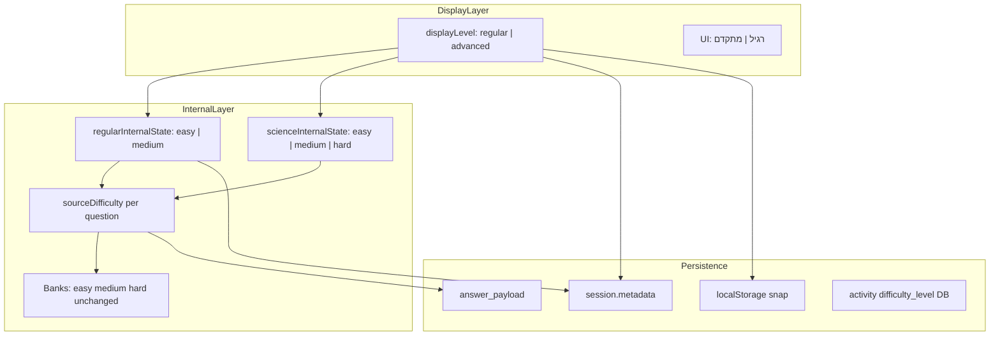

# Plan Final — מעבר מ-3 רמות ל-2 רמות (רגיל / מתקדם)

> **התוכנית הקובעת היחידה.**
>
> **סטטוס:** `locked-pending-owner-signoff` — ממתין לאישור בעלים אחד (§20) לפני Phase 0.
>
> **לא לבצע קוד עד אישור Plan Final.**

---

## 1. Executive Summary

הפרויקט משנה **רק** שכבת תצוגה, מיפוי, בחירת שאלות, evidence, דוחות, פעילויות ו-UI סביב רמות — **לכל 8 מקצועות ההשקה**.

| מה המשתמש רואה | `displayLevel` | `sourceDifficulty` (פנימי) |
|---|---|---|
| רגיל | `regular` | `easy` + `medium` — adaptive פנימי |
| מתקדם | `advanced` | `hard` בלבד |
| רגיל (מדעים בלבד) | `regular` | `easy` + `medium` + `hard` — adaptive פנימי |

**Copy סופי בכל UI ודוחות:** **רגיל** / **מתקדם** (לא "תרגול רגיל", לא "אתגר מתקדם").

**גישה:** mapping בלבד — SSOT חדש, mappers, adaptive modules, עדכון מנוע המלצות קיים (לא מנוע חדש).

**חריג יחיד:** מדעים = רגיל בלבד. **כל שאר 7 המקצועות** — רגיל + מתקדם, **כולל אנגלית א׳–ב׳, מולדת, גיאוגרפיה והיסטוריה**. לא מסתירים רמות או נושאים בגלל כמות שאלות.

**היקף:** ~60–75 קבצי production + ~25 QA/tests. 8 phases.

**באג קритי לתיקון:** [`generate-activity-questions-client.js`](lib/classroom-activities/generate-activity-questions-client.js) שורה 205 — `mixed→medium` חייב להפוך ל-mapping החדש.

### 1.1 רשימת 8 מקצועות ההשקה (מוצריים)

| # | מקצוע | UI | הערת יישום |
|---|---|---|---|
| 1 | מתמטיקה | רגיל/מתקדם | generator ייעודי |
| 2 | גיאומטריה | רגיל/מתקדם | generator ייעודי |
| 3 | עברית | רגיל/מתקדם | generator ייעודי |
| 4 | אנגלית | רגיל/מתקדם (כולל א׳–ב׳) | generator ייעודי |
| 5 | מדעים | **רגיל בלבד** | bank-based selection; adaptive easy/medium/hard |
| 6 | מולדת | רגיל/מתקדם | shared internal layer עם גיאוגרפיה — **נבדק בנפרד ב-QA/UX** |
| 7 | גיאוגרפיה | רגיל/מתקדם | shared internal layer עם מולדet — **נבדק בנפרד ב-QA/UX** |
| 8 | היסטוריה | רגיל/מתקדם | bank-based selection — **חלק מלא מ-8 מקצועות ההשקה** |

> **הבהרת shared internal:** מולדת וגיאוגרפיה חולקים [`moledet-geography-master.js`](pages/learning/moledet-geography-master.js) + [`moledet-geography-question-generator.js`](utils/moledet-geography-question-generator.js) + subject id פנימי `moledet_geography`. **לא** ליצור duplication מלאכותי או לשנות subject IDs. מבחינת תצוגה, QA, דוחות והשקה — הם **2 מקצועות מוצריים נפרדים**.

---

## 2. החלטות בעלים סופיות

כל הסעיפים הבאים **סגורים**. אין שאלות פתוחות.

1. **UI הרמות באתר** מתעדכן ל־רגיל/מתקדם בכל המקומות הרלוונטיים. כל המקצועות מציגים רגיל/מתקדם, **למעט מדעים שמציג רגיל בלבד** (במקום קל / בינוני / קשה).
2. **רגיל** = `easy` + `medium` — adaptive פנימי, לא ערבוב אקראי.
3. **מתקדם** = `hard` בלבד.
4. **מדעים** = רגיל בלבד; פנימית `easy` + `medium` + `hard`; adaptive easy→medium→hard.
5. **אנגלית א׳–ב׳:** רגיל / מתקדם — **לא** מסתירים מתקדם.
6. **מולדת, גיאוגרפיה, היסטוריה:** רגיל / מתקדם — כמו שאר המקצועות (אין חריג מוצרי מעבר לתיעוד shared internal).
7. **לא מסתירים** רמות, נושאים, או מתקדם בגלל מעט שאלות. תאים דלים → רישום בדוח מיפוי/QA בלבד.
8. **בנקי שאלות:** zero change — `easy`/`medium`/`hard` נשארים בבנק.
9. **DB schema:** לא משתנה. אין migration.
10. **פעילויות חדשות:** `regular`→`mixed`, `advanced`→`hard`, מדעים `regular`→`mixed`.
11. **`mixed`/`regular`:** לא מושך `medium` בלבד — `easy+medium` (מדעים: `easy+medium+hard`).
12. **Evidence:** `displayLevel` + `sourceDifficulty` בכל תשובה/session/resume/aggregate.
13. **מנוע המלצות:** עדכון [`topic-next-step-engine.js`](utils/topic-next-step-engine.js) הקיים — progression `רגיל→מתקדם`; לא בונים מנוע חדש.
14. **Adaptive פנימי:** 3 תשובות נכונות רצופות → עלייה; 2 טעויות רצופות → ירידה.
15. **המלצה למתקדם:** רק אחרי הצלחה יציבה ברגיל **כולל** הצלחה בשאלות `medium` פנימיות. קבועים: accuracy ≥75%, ≥20 שאלות ברגיל, ≥60% מהראיות מ-`medium`.
16. **כישלון במתקדם:** לא "פער יסוד"; ניסוח "אתגר גבוה" + המלצה לחזור לרגיל; אין grade drop מ-advanced בלבד.
17. **Copy:** רגיל / מתקדם בלבד. בדוח — ניסוח הסברי סביב כישלון במתקדם מותר ("האתגר היה גבוה"), שם הרמה נשאר "מתקדם".
18. **סגירת פרויקט:** nightly full / בדיקה רחבה מלאה **חובה** לפני אישור סגירה — **לפי 8 מקצועות** (§17, §19).
19. **Scope:** רמות בלבד — לא נושאים, לא שאלות, לא ספרים, לא משחקים.

---

## 3. מה לא עושים

- לא משנים `difficulty` / `levelKey` בקבצי בנק שאלות
- לא מוסיפים / מוחקים / מאחדים / מסתירים / משנים שמות נושאים
- לא משנים ספרים, משחקים, prototypes, arcade, תוכן לימודי
- לא DB migration / ALTER TABLE / enum change
- לא מסתירים מתקדם בגלל מעט שאלות (כולל אנגלית א׳–ב׳, מולדת, גיאוגרפיה, היסטוריה)
- לא יוצרים קבצי generator כפולים רק כדי להגיע ל-8 נתיבים פיזיים
- נושא/תא דל → רישום ב-`level-migration-impact.json` בלבד

**הפרויקט =** איחוד רמות / מיפוי / תצוגה / שמירת מקור קושי / דוחות / פעילויות סביב רמות.

---

## 4. ארכיטקטורת רמות חדשה

### 4.1 שני מישורים



### 4.2 SSOT — [`lib/learning/display-level.js`](lib/learning/display-level.js) (חדש)

```javascript
displayLevelToSourceDifficulties(displayLevel, subjectId)
sourceDifficultyToDisplayLevel(sourceDifficulty)
displayLevelLabelHe(displayLevel)              // "רגיל" | "מתקדם"
isDisplayLevelAllowedForSubject(displayLevel, subjectId)  // science: advanced=false
normalizeLegacyLevelToDisplayLevel(legacy)
displayLevelToActivityDbEnum(displayLevel)       // regular→mixed; advanced→hard
activityDbEnumToDisplayLevel(dbEnum)
resolveActivitySourceDifficulties(dbEnum, subjectId)  // mixed mapping — NOT medium-only
resolveSessionLevels({ level, displayLevel, sourceDifficulty, regularInternalState, subjectId })
```

**אין** `isAdvancedAvailableForSubjectGrade` — לא מסתירים מתקדם לפי grade/topic.

### 4.3 Modules adaptive (חדשים)

| Module | שימוש |
|---|---|
| [`lib/learning/regular-internal-adaptive.js`](lib/learning/regular-internal-adaptive.js) | regular בכל מקצוע **חוץ ממדעים** — `["easy","medium"]` |
| [`lib/learning/science-internal-adaptive.js`](lib/learning/science-internal-adaptive.js) | מדעים — `["easy","medium","hard"]` — refactor מ-[`science-master.js`](pages/learning/science-master.js) |

**מקור:** `applyAdaptiveDifficulty()` — 3↑ / 2↓; לא פעיל ב-`mistakes`/`graded`.

---

## 5. displayLevel / sourceDifficulty — איפה נשמרים

| שכבה | שדות חדשים | legacy compat | מיקום |
|---|---|---|---|
| React state/refs | `displayLevel`, `regularInternalStateRef`, streaks | `level` → mapped on read | 8 × launch `*-master.js` |
| Session start | `metadata.displayLevel`, `metadata.regularInternalState` | `metadata.level` = displayLevel | [`session/start.js`](pages/api/learning/session/start.js) |
| Answer payload | `displayLevel`, `sourceDifficulty` | `clientMeta.level` = sourceDifficulty | [`answer.js`](pages/api/learning/answer.js) |
| answer_payload DB | top-level both fields | `questionEngine.difficulty` unchanged | insertAnswerRow |
| diagnostic-evidence | both explicit | `questionLevel` = sourceDifficulty | [`diagnostic-evidence.js`](utils/diagnostic-evidence.js) |
| diagnosticMetadata | both | engine fields unchanged | [`diagnostic-canonical-metadata.js`](lib/learning/diagnostic-canonical-metadata.js) |
| localStorage snap | both + streaks + internalState | `snap.level` via `resolveSessionLevels` | per-master `STORAGE_KEY` |
| learning profile / scores | `${displayLevel}_${topic}` | fallback `${oldLevel}_${topic}` | math-master etc. |
| Activity DB | — | `difficulty_level` enum unchanged | Supabase |
| Activity play metadata | `displayLevel` | from DB mapper | [`assigned-activity-play-metadata.server.js`](lib/classroom-activities/assigned-activity-play-metadata.server.js) |
| Parent aggregate | `dominantDisplayLevel` | `_sourceDifficultyBreakdown` internal | [`report-data-aggregate.server.js`](lib/parent-server/report-data-aggregate.server.js) |
| Mistakes events | `sourceDifficulty` | `level` → sourceDifficulty | `mleo_mistakes` |
| parentReportTruth | regular/advanced strings | regenerate fixtures | launch-readiness |

**Per answer (חובה):**
```javascript
{ displayLevel: "regular"|"advanced", sourceDifficulty: "easy"|"medium"|"hard" }
```

**Per session regular (חובה):**
```javascript
{ displayLevel: "regular", regularInternalState: "easy"|"medium" }
// science: scienceInternalState: "easy"|"medium"|"hard"
```

---

## 6. Adaptive בתוך רגיל — פירוט מלא

### 6.1 אלגוריתם (סגור)

| פרמטר | ערך |
|---|---|
| `startState` | `"easy"` |
| `advanceStreak` | 3 תשובות נכונות רצופות |
| `dropStreak` | 2 תשובות שגויות רצופות |
| `INTERNAL_ORDER` (רגיל) | `["easy","medium"]` |
| `INTERNAL_ORDER` (מדעים) | `["easy","medium","hard"]` |
| modes ללא adaptive | `mistakes`, `graded`, assigned fixed |

Streak-based step הוא SSOT. Weighted fallback רק אם pool ריק ב-level הנוכחי.

### 6.2 איפה נשמר `regularInternalState`

1. React ref — runtime
2. localStorage snap — resume
3. session metadata — server
4. clientMeta per answer — audit (optional)

### 6.3 עדכון

```
onAnswer(isCorrect):
  if displayLevel !== "regular" → skip
  if mode in NO_ADAPTIVE_MODES → skip
  update streaks
  if correctStreak >= 3 → stepInternal(+1)
  if wrongStreak >= 2 → stepInternal(-1)
  pick question at current internal state
  tag sourceDifficulty on question
  persist ref + localStorage
```

### 6.4 לפי מקצוע (8 מקצועות)

| מקצוע | UI | Adaptive | Pick |
|---|---|---|---|
| מתמטיקה | רגיל/מתקדם | easy↔medium | `getLevelConfig(grade, state)` → generate |
| גאומטריה | idem | idem | idem |
| עברית | idem | idem | static filter by state |
| **אנגלית (כולל א׳–ב׳)** | **רגיל/מתקדם** | easy↔medium | `ENGLISH_LEVELS[state]`; advanced=hard |
| **מדעים** | **רגיל בלבד** | easy↔medium↔hard | filter all 3 by internal state |
| **מולדת** | רגיל/מתקדם | easy↔medium | shared moledet-geography generator; strand=moledet |
| **גיאוגרפיה** | רגיל/מתקדם | easy↔medium | shared moledet-geography generator; strand=geography |
| **היסטוריה** | רגיל/מתקדם | easy↔medium | bank filter by state |

### 6.5 Resume

1. Load snap → `resolveSessionLevels()`
2. Old `level:"easy"|"medium"` → regular + matching internalState
3. Old `level:"hard"` → advanced
4. Restore streaks or reset to 0
5. DB answers pre-migration: backfill displayLevel at aggregate **read** only

---

## 7. מתקדם — התנהגות, המלצות, כישלון

### 7.1 Selection
- `advanced` → `hard` only. ללא adaptive.

### 7.2 מנוע המלצות — עדכון קיים (לא חדש)

[`topic-next-step-engine.js`](utils/topic-next-step-engine.js):

**Progression חיצוני (במקום easy→medium→hard):**
```
רגיל → מתקדם
```

**Progression פנימי (בתוך regular בלבד):**
```
easy ↔ medium
```

**כללי המלצה (סגורים):**

| מצב | step |
|---|---|
| הצלחה יציבה ברגיל + medium evidence | `advance_to_advanced` |
| הצלחה רק ב-easy, חלש ב-medium | `maintain_regular_strengthen_medium` — נשאר רגיל |
| כישלון במתקדם | `suggest_return_to_regular` |
| כישלון במתקדם | **לא** `drop_one_level`, **לא** grade drop |

**קבועים להמלצה למתקדם:**
- accuracy ≥ 75%
- ≥ 20 שאלות ברגיל
- ≥ 60% מהראיות/שאלות מ-`sourceDifficulty: "medium"`

### 7.3 Copy כישלון במתקדם

- **מותר:** "האתגר היה גבוה", "מומלץ לחזור לתרגול רגיל"
- **אסור:** "פער יסודי", "חוסר הבנה בסיסית" (copy guard: `advanced_struggle_not_fundamental`)
- **שם רמה בדוח:** "מתקדם"

---

## 8. מדעים regular-only — פירוט מלא

### 8.1 כלל
- `displayLevel` תמיד `"regular"`
- פנימית: easy + medium + hard
- Adaptive: easy → medium → hard (3↑ / 2↓)
- כל תשובה: `sourceDifficulty` המקורי

### 8.2 Enforcement checklist

| Surface | Enforcement |
|---|---|
| Student UI | אין בוחר רמה; אין מתקדם | [`science-master.js`](pages/learning/science-master.js) |
| Parent activity | רגיל בלבד | [`AssignActivityModal.js`](components/parent/AssignActivityModal.js) |
| Teacher activity | רגיל בלבד | `pages/teacher/**/activities/new.js` |
| Generator | mixed/regular → E+M+H | [`generate-activity-questions-client.js`](lib/classroom-activities/generate-activity-questions-client.js) |
| DB write | `mixed` | parent/teacher server |
| Report | לא "מתקדם" | parent-report-* |
| next-step | לא `advance_to_advanced` | topic-next-step-engine.js |
| Evidence | displayLevel=regular always | diagnostic-evidence.js |
| QA matrix | regular column only | qa-question-inventory-matrix.mjs |
| QA probes | לא advanced | generator probe |
| Snapshots/truth | לא advanced strings | launch-readiness |
| copy guard | אין "מתקדם" + "מדעים" | forbidden-terms.js |
| curriculum | אין בחירת רמה | curriculum.js |
| `isDisplayLevelAllowedForSubject` | advanced+science=false | display-level.js |

### 8.3 מדעים G1–G2
- UI: רגיל בלבד (כמו כל מדעים)
- פנימית: adaptive על easy/medium/hard — **לא** מוגבל ל-easy בלבד (בניגוד למדיניות UI ישנה)

---

## 9. השפעה לפי מקצוע (8 מקצועות)

| מקצוע | UI | Generator / selection | Adaptive | תאים דלים |
|---|---|---|---|---|
| מתמטיקה | רגיל/מתקדם | regular:E+M; adv:H | easy↔medium | רישום בלבד |
| גאומטריה | idem | idem | idem | רישום בלבד |
| עברית | idem | idem | idem | רישום בלבד |
| **אנגלית (א׳–ו׳)** | **רגיל/מתקדם** | idem | idem | רישום בלבד — **UI מציג מתקדם** |
| **מדעים** | **רגיל בלבד** | regular:E+M+H | easy↔medium↔hard | רישום בלבד |
| **מולדת** | רגיל/מתקדם | shared moledet-geography path; strand filter | easy↔medium | רישום בלבד |
| **גיאוגרפיה** | רגיל/מתקדם | shared moledet-geography path; strand filter | easy↔medium | רישום בלבד |
| **היסטוריה** | רגיל/מתקדם | bank-based; regular:E+M; adv:H | easy↔medium | רישום בלבד |

---

## 10. השפעה על בחירת שאלות / Generators

### 10.1 כלל

```
science → pick from [easy,medium,hard] via scienceInternalState
advanced → pick from [hard]
regular → pick from [easy,medium] via regularInternalState
```

### 10.2 Phase 2 — Generators / question selection

**Generators / question selection — לעדכן את כל נתיבי בחירת השאלות לכל 8 מקצועות ההשקה.**

ייתכן שמספר הנתיבים הפנימיים קטן מ־8 בגלל shared generator / bank-based selection, אך **QA ו-probes חייבים להיות לפי 8 מקצועות מוצריים**. **לא** ליצור קבצי generator כפולים רק בשביל התאמת מספר.

| נתיב פנימי | מקצועות מוצריים | הערה |
|---|---|---|
| `math-question-generator.js` | מתמטיקה | |
| `geometry-question-generator.js` | גיאומטריה | |
| `hebrew-question-generator.js` | עברית | |
| `english-question-generator.js` | אנגלית | |
| `science-questions` bank | מדעים | bank-based |
| `moledet-geography-question-generator.js` | **מולדת + גיאוגרפיה** | shared; strand filter |
| `history-questions` bank | **היסטוריה** | bank-based |
| [`generate-activity-questions-client.js`](lib/classroom-activities/generate-activity-questions-client.js) | כל 8 | mixed fix + mapping |

### 10.3 באג קритי — mixed

```javascript
// TODAY (WRONG):
mixed → medium

// FINAL:
mixed/regular + non-science → ["easy","medium"] + adaptive
mixed/regular + science     → ["easy","medium","hard"] + adaptive
```

### 10.4 אנגלית א׳–ב׳

- **UI:** רגיל / מתקדם — כמו שאר המקצועות
- **מתקדם:** מושך `hard` (גם אם pool דל — UI עדיין מציג)
- **הסרה נדרשת בקוד:** `englishLevelKeysForGradeKey` שמגביל G1-G2 ל-easy/medium — יוחלף ב-displayLevel picker רגיל/מתקדם
- **תאים דלים:** רישום ב-`level-migration-impact.json` — לא שינוי מדיניות תצוגה

### 10.5 מולדת / גיאוגרפיה / היסטוריה

- **מולדת + גיאוגרפיה:** shared internal implementation; probes ו-visual QA **נפרדים** לכל strand (`moledet-master`, `geography-master`)
- **היסטוריה:** חלק מלא מ-8 מקצועות; probes, inventory, parent report truth, activity flows — **כמו כל מקצוע**
- **לא** לשנות subject IDs; **לא** duplication מלאכותי של generators

---

## 11. Sessions / answers / evidence / resume

(ראה §5 — ללא שינוי מהותי.)

**Session start payload (כל 8 masters):**

> session metadata חייב לשמור internal state מתאים: `regularInternalState` למקצועות שאינם מדעים, `scienceInternalState` למדעים.

```javascript
// מקצועות שאינם מדעים:
{ level: displayLevel, displayLevel, regularInternalState, clientMeta: { version: "level-v2" } }

// מדעים:
{ level: "regular", displayLevel: "regular", scienceInternalState, clientMeta: { version: "level-v2" } }
```

**Per answer:**
```javascript
// non-science:
{ displayLevel, sourceDifficulty, regularInternalState }
// science:
{ displayLevel: "regular", sourceDifficulty, scienceInternalState }
```

---

## 12. דוחות הורים

### 12.1 Copy סופי

```javascript
PARENT_REPORT_LEVEL_LABELS_HE = {
  regular: "רגיל",
  advanced: "מתקדם",
  // legacy — mapped at read, never shown to parent:
  easy: "רגיל", medium: "רגיל", hard: "מתקדם",
}
```

### 12.2 Aggregation
- Parent-facing: `dominantDisplayLevel` → "רגיל"/"מתקדם"
- Internal: `_sourceDifficultyBreakdown` — לא ב-PDF
- Science: תמיד "רגיל"
- **8 מקצועות** בדוח — כולל מולדת, גיאוגרפיה והיסטוריה כ-strands/cards נפרדים ב-UX

### 12.3 קבצים
- [`parent-report-display-labels.he.js`](utils/parent-report-language/parent-report-display-labels.he.js)
- [`parent-report-v2.js`](utils/parent-report-v2.js)
- [`parent-facing-normalize-he.js`](utils/parent-report-language/parent-facing-normalize-he.js)
- [`forbidden-terms.js`](utils/parent-report-language/forbidden-terms.js)
- [`engine-decision-parent-copy-he.js`](utils/parent-report-language/engine-decision-parent-copy-he.js)
- [`topic-next-step-engine.js`](utils/topic-next-step-engine.js)
- [`components/parent-report-detailed-surface.jsx`](components/parent-report-detailed-surface.jsx)

---

## 13. פעילויות הורה/מורה

### 13.1 DB — ללא שינוי
`difficulty_level`: `easy | medium | hard | mixed`

### 13.2 Read (display)
| DB | UI | Generator |
|---|---|---|
| easy | רגיל | easy+medium adaptive |
| medium | רגיל | easy+medium adaptive |
| mixed | רגיל | easy+medium adaptive (מדעים: +hard) |
| hard | מתקדם | hard |

### 13.3 Write (new)
| UI | DB |
|---|---|
| regular | `mixed` |
| advanced | `hard` |
| science regular | `mixed` |

**Activity flows:** parent + teacher E2E חייבים לכסות את כל **8 מקצועות ההשקה** (מולדet וגיאוגרפיה בנפרד).

---

## 14. UI תלמיד / הורה / מורה / admin

### Student — 8 launch masters

| File | Change |
|---|---|
| [`math-master.js`](pages/learning/math-master.js) | רגיל/מתקדם; adaptive; copy רגיל/מתקדם |
| [`geometry-master.js`](pages/learning/geometry-master.js) | idem |
| [`hebrew-master.js`](pages/learning/hebrew-master.js) | idem |
| [`english-master.js`](pages/learning/english-master.js) | **הסר** `englishLevelKeysForGradeKey` G1-G2 restriction |
| [`science-master.js`](pages/learning/science-master.js) | רגיל בלבד; הסר level picker |
| [`moledet-master.js`](pages/learning/moledet-master.js) | רגיל/מתקדם; strand=moledet |
| [`geography-master.js`](pages/learning/geography-master.js) | רגיל/מתקדם; strand=geography |
| [`history-master.js`](pages/learning/history-master.js) | רגיל/מתקדם |
| [`curriculum.js`](pages/learning/curriculum.js) | labels לכל 8 |

> **Shared:** [`moledet-geography-master.js`](pages/learning/moledet-geography-master.js) — implementation משותף; `moledet-master` / `geography-master` הם wrappers.

**Out of scope:** solo-games, educational-games, prototypes, arcade.

### Parent / Teacher / Admin
- AssignActivityModal, teacher activity new, monitor, export, admin analytics (debug only for sourceDifficulty)
- בחירת רמה ו-copy לכל **8 מקצועות** (מדעים: regular-only)

---

## 15. כל הקבצים — רשימה מלאה

(ללא שינוי מ-V2 — ראה §15 בגרסה הקודמת; Phase 0 grep יאמת.)

**חדשים:** `display-level.js`, `regular-internal-adaptive.js`, `science-internal-adaptive.js`, `display-level-selftest.mjs`

**קריטיים:** כל נתיבי question selection / generators ל-8 מקצועות, `generate-activity-questions-client.js`, session/answer API, 8 launch masters, topic-next-step-engine, parent-report-*, AssignActivityModal, activity servers, ~25 QA files.

---

## 16. בדיקות לעדכון

| Test | Change |
|---|---|
| `display-level-selftest.mjs` | mappers; science-only exception |
| `regular-internal-adaptive-selftest.mjs` | streak machine |
| `parent-report-display-labels-selftest.mjs` | רגיל/מתקדם |
| `student-activities-unit.mjs` | mixed→E+M; science→E+M+H |
| activity/truth/aggregate tests | displayLevel + sourceDifficulty |
| `hebrew-copy-delta-gate-*.mjs` | forbid קל/בינוני/קשה |
| `qa-question-inventory-matrix.mjs` | regular/advanced; science regular-only; **8 subjects** |
| generator probe (new) | **8 מקצועות מוצריים** incl. english G1-G2 advanced, moledet+geography separate, history |

---

## 17. QA plan — חובה לפני סגירה (8 מקצועות)

### 17.1 סדר הרצה (כולם חובה)

1. mapping unit tests
2. adaptive unit tests
3. generator probes — **8 מקצועות מוצריים** incl. english G1-G2 advanced=hard; moledet וגיאוגרפיה בנפרד; history
4. evidence round-trip — **כל 8**
5. parent activity E2E — **כל 8**
6. teacher activity E2E — **כל 8**
7. backward compat old activities (easy/medium/mixed/hard)
8. parent report truth — **כל 8** incl. moledet, geography, history strands
9. advanced failure narrative fixture
10. resume session
11. copy inventory gate — zero קל/בינוני/קשה in user UI
12. Visual QA — **8 subjects** + parent + teacher
13. **eight-subject smoke**
14. `npm run qa:question-inventory-matrix`
15. daily-gate READY
16. **nightly full / בדיקה רחבה מלאה** — חובה לפני סגירת פרויקט; **לפי 8 מקצועות**

### 17.2 Generator probe matrix (8 מקצועות מוצריים)

| Subject | regular | advanced | הערה |
|---|---|---|---|
| math | E+M tags only | H only | |
| geometry | E+M | H | |
| hebrew | E+M | H | |
| **english G1-G2** | E+M | **H only** | |
| english G3-G6 | E+M | H | |
| science | E+M+H | N/A (regular-only) | bank-based |
| **moledet** | E+M | H | shared generator; strand=moledet |
| **geography** | E+M | H | shared generator; strand=geography |
| **history** | E+M | H | bank-based |

### 17.3 Inventory thresholds

| Column | Rule |
|---|---|
| regular (non-science) | count(easy)+count(medium) ≥ 16 |
| advanced | count(hard) ≥ 16 |
| science | count(all) ≥ 16; no advanced column |

תאים מתחת לסף → **warning בדוח**, לא שינוי UI. **לכל 8 מקצועות** — moledet וגיאוגרפיה נספרים בנפרד.

---

## 18. סיכונים ופתרונות

| # | סיכון | Mitigation |
|---|---|---|
| 1 | איבוד sourceDifficulty | Phase 3 לפני UI; resolveSessionLevels |
| 2 | mixed→medium | תיקון Phase 2 — resolveActivitySourceDifficulties |
| 3 | regular = random | adaptive module + tests |
| 4 | advanced → פער יסוד | next-step + copy guard |
| 5 | science shows מתקדם | isDisplayLevelAllowedForSubject |
| 6 | old activities break | read mapper |
| 7 | english G1-G2 thin hard pool | UI מציג מתקדם; generator fallback + רישום QA — **לא** הסתרה |
| 8 | parentReportTruth regen | Phase 6 batch |
| 9 | moledet/geography conflated in QA | probes + visual QA + report truth **per strand** |
| 10 | history omitted from smoke/readiness | eight-subject smoke + DoD checklist |

---

## 19. Definition of Done

**סגירה סופית מחייבת בדיקה לפי 8 מקצועות ההשקה — לא 6.**

### UI
- [ ] אין קל/בינוני/קשה לילד/הורה/מורה
- [ ] רגיל/מתקדם בכל **7 מקצועות** (כל מקצוע **חוץ ממדעים**)
- [ ] **אנגלית א׳–ב׳:** רגיל/מתקדם
- [ ] **מולדet, גיאוגרפיה, היסטוריה:** רגיל/מתקדם
- [ ] מדעים: רגיל בלבד
- [ ] copy: "רגיל"/"מתקדם" בלבד

### בנקים
- [ ] zero diff בבנקי שאלות
- [ ] easy/medium/hard פנימי

### Selection
- [ ] regular → easy+medium adaptive (starts easy) — **כל 7 המקצועות שאינם מדעים**
- [ ] science regular → easy+medium+hard adaptive
- [ ] advanced → hard — **7 מקצועות** (לא מדעים)
- [ ] mixed/regular ≠ medium-only

### Evidence
- [ ] displayLevel + sourceDifficulty on every answer
- [ ] resume preserves both + internalState
- [ ] aggregate preserves sourceDifficulty internally

### Reports
- [ ] parent: רגיל/מתקדם only
- [ ] science: no מתקדם
- [ ] advanced failure: אתגר גבוה, not פער יסוד
- [ ] parent report truth covers **8 subjects** incl. moledet, geography, history

### Activities
- [ ] new: regular→mixed, advanced→hard
- [ ] old: easy/medium/mixed→רגיל, hard→מתקדם
- [ ] science: regular only
- [ ] parent + teacher E2E for **all 8 launch subjects**

### QA (כולם חובה — 8 מקצועות)
- [ ] mapping tests pass
- [ ] generator probes pass — **8 מקצועות** incl. english G1-G2 advanced, moledet+geography separate, history
- [ ] evidence round-trip pass
- [ ] parent activity E2E pass — **8 subjects**
- [ ] teacher activity E2E pass — **8 subjects**
- [ ] parent report truth pass — **8 subjects**
- [ ] Visual QA pass — **8 subjects**
- [ ] copy inventory clean
- [ ] **eight-subject smoke pass**
- [ ] daily-gate READY
- [ ] **nightly full / בדיקה רחבה מלאה pass** — **8 subjects**

---

## 20. אישור לפני קוד

**נדרש אישור בעלים אחד:**

> **Plan Final מאושר — מתחילים Phase 0.**

כל שאר ההחלטות (§2) סגורות במסמך זה.

**לא לבצע קוד, Phase 0, סימולציות, QA, או שינויי production עד אישור מפורש.**

---

## Appendix A — Phases

| Phase | ימים | Deliverable |
|---|---|---|
| 0 Mapping | 2 | impact.json, copy inventory — **8 subjects** |
| 1 SSOT | 2 | display-level + adaptive modules + tests |
| 2 Generators | 4 | **Generators / question selection — לעדכן את כל נתיבי בחירת השאלות לכל 8 מקצועות ההשקה.** ייתכן שמספר הנתיבים הפנימיים קטן מ־8 בגלל shared generator / bank-based selection, אך QA ו-probes חייבים להיות לפי 8 מקצועות מוצריים. mixed fix + probes |
| 3 Evidence | 3 | session/answer/resume |
| 4 Student UI | 4 | **8 launch masters**; english G1-G2 רגיל/מתקדם; moledet+geography separate UX |
| 5 Activities | 3 | parent/teacher + compat — **8 subjects** |
| 6 Reports | 4 | labels + next-step update + truth — **8 subjects** |
| 7 QA | 4 | all §17 tests; **eight-subject smoke** |
| 8 Readiness | 2 | nightly full + daily-gate + owner signoff — **8 subjects** |

**Critical path:** 0 → 1 → (2 ∥ 3) → 4 → 6 → 7 → 8

---

## Appendix B — Phase 0 (post-approval, read-only)

```bash
rg -n "קל|בינוני|קשה" pages components lib utils --glob "*.{js,jsx,mjs}"
rg -n "\beasy\b|\bmedium\b|\bhard\b|difficulty" pages components lib --glob "*.{js,jsx}"
rg -n "LEVELS|LEVEL_ORDER|DIFFICULTY" utils pages lib
rg -n "metadata\.level|questionLevel|sourceDifficulty|displayLevel" pages/api utils lib
```

Output: `reports/level-migration-impact.json`, `reports/level-migration-copy-inventory.json`

Scope grep: **כל 8 מקצועות ההשקה** incl. `moledet-master`, `geography-master`, `history-master`, shared `moledet-geography-*`.

---

*Plan Final — 2026-06-30 — `locked-pending-owner-signoff`. Awaiting single owner signoff (§20).*
