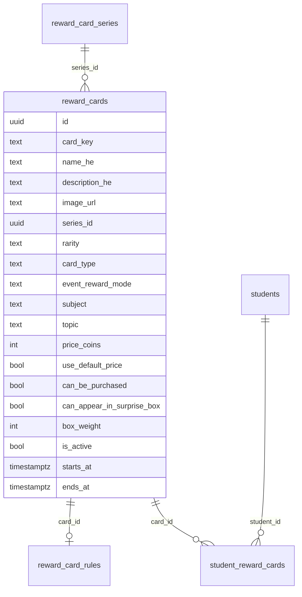
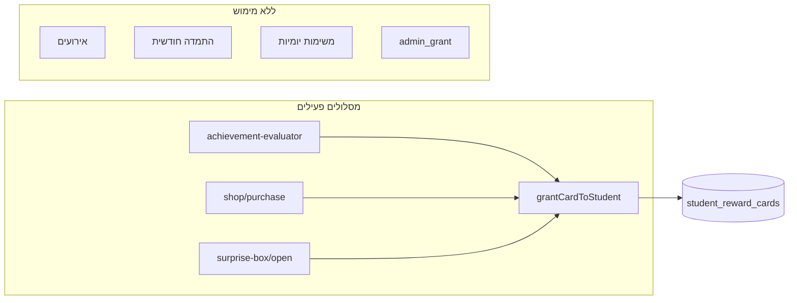

# תוכנית: שליטת Admin מלאה במערכת הקלפים

---

## חלק א׳ — מיפוי המצב הקיים

### 1. טבלאות DB רלוונטיות

| טבלה | תפקיד | מיגרציה |
|------|--------|---------|
| [`reward_card_series`](supabase/migrations/058_card_rewards_system.sql) | סדרות/חבילות (`slug`, `name_he`, `display_order`, `is_active`) | 058, 059, 061 |
| [`reward_cards`](supabase/migrations/058_card_rewards_system.sql) | קטלוג מלא — shop / achievement / event | 058, 059, 060, 061 |
| [`reward_card_rules`](supabase/migrations/058_card_rewards_system.sql) | חוקי פתיחה לקלפי הישג בלבד | 058, 059 (24 חוקים פעילים) |
| [`reward_card_settings`](supabase/migrations/058_card_rewards_system.sql) | הגדרות גלובליות JSON (מחירי ברירת מחדל, קופסה, כפילויות, `system_enabled`) | 058, 059 |
| [`student_reward_cards`](supabase/migrations/058_card_rewards_system.sql) | בעלות + `duplicate_count` | 058 |
| [`surprise_box_state`](supabase/migrations/058_card_rewards_system.sql) | מצב קופסה לילד | 058 |
| [`surprise_box_openings`](supabase/migrations/058_card_rewards_system.sql) | לוג פתיחות | 058 |
| [`reward_card_transactions`](supabase/migrations/058_card_rewards_system.sql) | יומן תנועות קלף | 058 |
| [`reward_card_conversions`](supabase/migrations/058_card_rewards_system.sql) | המרת כפילויות | 058 |
| `reward_economy_*` | משימות יומיות / התמדה חודשית — **מטבעות בלבד**, לא קלפים | 058, 063 |

**קטלוג חי אחרי 059+060+061:** 76 קלפים פעילים (40 חנות · 24 הישג · 12 אירוע). שורות legacy מ-058 נשארות עם `is_active=false`.

### 2. שדות קיימים ב-`reward_cards`



- **`box_weight`** — קיים ב-DB אך **לא בשימוש** (הקופסה משתמשת במשקלי נדירות גלובליים).
- **`event_reward_mode`** — קיים ב-DB אך **לא מיושם בקוד**.
- **`subject` / `topic`** — על הקלף (תצוגה) + חוזרים ב-`reward_card_rules`.

### 3. איך נקבעים היום סדרה / נדירות / מחיר / חנות / קופסה

| היבט | מקור היום |
|------|-----------|
| סדרה | `reward_cards.series_id` → `reward_card_series` (Admin: יצירה/עריכה בסיסית) |
| נדירות | עמודת `reward_cards.rarity` — **נקבעת ב-seed, לא ניתנת לעריכה ב-UI** |
| מחיר חנות | `use_default_price` + `price_coins` או `reward_card_settings.shop_default_prices[rarity]` |
| זמינות חנות | `can_be_purchased` + `is_active` + `card_type=shop` |
| זמינות קופסה | `can_appear_in_surprise_box` + pool לפי נדירות גלובלית מ-`surprise_box_card_rarity_weights` |
| אירועים | `starts_at`/`ends_at` + `is_active` — **תצוגה בלבד**, ללא מסלול הענקה |

### 4. איך ילד מקבל קלף היום



| מסלול | קובץ מרכזי | מתי מופעל |
|-------|------------|-----------|
| הישג | [`achievement-evaluator.server.js`](lib/rewards/server/achievement-evaluator.server.js) | סיום סשן, טעינת home, השלמת פעילות הורה |
| חנות | [`reward-shop.server.js`](lib/rewards/server/reward-shop.server.js) | POST `/api/student/rewards/shop/purchase` |
| קופסה | [`surprise-box.server.js`](lib/rewards/server/surprise-box.server.js) | POST `/api/student/rewards/surprise-box/open` |
| אירוע | — | **אין** |
| התמדה/משימות | `monthly-persistence-reward`, `mission-progress` | **מטבעות בלבד** |

### 5. Rule engine קיים

- **חלקי בלבד:** [`reward_card_rules`](supabase/migrations/058_card_rewards_system.sql) + evaluator קשיח בקוד.
- **סוגי `rule_type` מיושמים:** `total_questions`, `weekly_questions`, `subject_questions`, `subject_accuracy`, `learning_streak_days`, `parent_activity_complete`.
- **`subject_improvement`** — קיים ב-DB (059) אך evaluator מחזיר **תמיד false**.
- **לוגיקת סף** (למשל 30 שאלות, 80% דיוק) — **hardcoded ב-evaluator**, לא ב-DB.
- **אין Admin API/UI** ל-`reward_card_rules`.

### 6. Hardcoded — מיפוי מלא

| מיקום | מה hardcoded | חומרה |
|-------|--------------|--------|
| [`059_leo_cards_full_catalog.sql`](supabase/migrations/059_leo_cards_full_catalog.sql) | 76 קלפים + 24 חוקים + סדרות | seed — יישאר כ-baseline, לא runtime |
| [`leo-shop-cards-registry.js`](lib/rewards/leo-shop-cards-registry.js) | 40 נתיבי תמונה לפי `card_key` | runtime fallback על `image_url` |
| [`achievement-evaluator.server.js`](lib/rewards/server/achievement-evaluator.server.js) | סוגי חוקים + ברירות מחדל (30/80/7 ימים) | runtime |
| [`SEED_CARD_SETTINGS`](lib/rewards/server/reward-settings.server.js) | מחירים/משקלים/סף כפילויות | migration בלבד (fail-closed ב-runtime) |
| [`shop-card-sort.js`](lib/rewards/shop-card-sort.js) | סדר נדירות לתצוגה | UI בלבד, לא עסקי |
| [`surprise-box.server.js`](lib/rewards/server/surprise-box.server.js) | `threshold = 10` בהודעת כפילות | באג/חוסר עקביות |

### 7. מה הילד רואה בקלף נעול

| סוג | טקסט היום | מקור |
|-----|-----------|------|
| הישג | `ענה על עוד שאלות כדי לפתוח: {description_he}` | [`buildAchievementLockHint`](lib/rewards/server/reward-cards.server.js) |
| חנות (לא בבעלות) | `אפשר לקנות בחנות` | `getStudentCardsView` |
| אירוע / אחר | `לא זמין כרגע` | אותו קובץ |

**חסר היום:** התקדמות מספרית (45/100), תנאים מפורטים מפרמטרי חוק, הבחנה בין «מוסתר» ל«נעול».

### 8. בעלות וכפילויות

- **בעלות:** `student_reward_cards` (`owned`, `duplicate_count`, timestamps).
- **הישג:** ללא כפילויות — re-grant הוא no-op.
- **חנות/קופסה:** כפילות מגדילה `duplicate_count`.
- **המרה:** [`duplicate-conversion.server.js`](lib/rewards/server/duplicate-conversion.server.js) — `duplicate_threshold` + `duplicate_conversion_values` מ-DB.

### 9. בחירת קלף בחנות ובקופסה

- **חנות:** רשימה דטרמיניסטית של כל `can_be_purchased` פעילים — **ללא** `isCardActiveNow` (פער).
- **קופסה:** pool → roll נדירות גלובלי → בחירה אקראית אחידה; `prevent_duplicate_in_box` מ-settings.

### 10. Admin היום — מה עובד ומה חסר

| יכולת | סטטוס |
|-------|--------|
| רשימת קלפים + עריכה חלקית | [`AdminCardsTab`](components/admin/rewards/AdminCardsTab.jsx) — שם, תיאור, 3 דגלים בלבד |
| יצירת קלף | API POST קיים — **אין UI** |
| סדרות CRUD | [`AdminSeriesTab`](components/admin/rewards/AdminSeriesTab.jsx) |
| מחירים / חנות | [`AdminShopTab`](components/admin/rewards/AdminShopTab.jsx) |
| קופסה / כפילויות | [`AdminBoxTab`](components/admin/rewards/AdminBoxTab.jsx), [`AdminDuplicatesTab`](components/admin/rewards/AdminDuplicatesTab.jsx) |
| אירועים (חלונות תאריך) | [`AdminEventsTab`](components/admin/rewards/AdminEventsTab.jsx) |
| **חוקי קבלה** | **חסר לחלוטין** |
| תמונה / סדרה / סוג / נדירות בעריכה | **חסר ב-UI** |
| הענקה ידנית (`admin_grant`) | enum ביומן — **אין API** |

### 11. APIs קיימים

**Admin:** `GET/POST /cards`, `PUT /cards/[id]`, `GET/POST /series`, `PUT /series/[id]`, `GET/PUT /settings` — **ללא `/rules`**.

**Student:** `GET /cards`, `POST /shop/purchase`, `GET/POST /surprise-box/*`, `POST /convert-duplicates`.

### 12. סיכון לשבירת קלפים קיימים

| סיכון | הערכה | מניעה |
|-------|--------|--------|
| מחיקת `student_reward_cards` | נמוך | לא נוגעים בטבלה; `ON DELETE RESTRICT` על `card_id` |
| שינוי `card_key`/UUID | בינוני | לא למחוק קלפים; UPSERT בלבד; ארכיון דרך `is_active` |
| שינוי סמנטיקת חוקים | בינוני-גבוה | migration ממיר 059→פורמט חדש עם בדיקות parity |
| אירועים שמתחילים להעניק | בינוני | `event_grant` כבוי כברירת מחדל; דגל `grant_enabled` per rule |
| תמונות שבורות | נמוך | `image_url` מ-DB קודם; registry כ-fallback זמני |

---

## חלק ב׳ — פערים מול הדרישה שלך

| דרישה | מצב היום |
|--------|----------|
| הוספת קלף חדש ב-Admin | API בלבד |
| עריכה מלאה (תמונה, סדרה, סוג, נדירות, כל הדגלים) | חלקי |
| תנאי קבלה: שאלות / דקות / ימי פעילות / אירוע / כיתה / מקצוע / נושא | רק תת-קבוצה בהישגים; ללא דקות/כיתה/אירוע |
| קבלה ממשימות/התמדה | לא קיים לקלפים |
| טקסט עברי מפורט לילד | `description_he` גנרי בלבד |
| מוסתר עד תנאי / נעול עם דרישה | רק «נעול»; אין hidden |
| הכל מ-Admin/DB | settings+קטלוג חלקי; חוקים+תמונות+seed בקוד/SQL |

---

## חלק ג׳ — עקרון עיצוב מוצע

**מקור אמת יחיד:** כל מה שהילד/Admin רואים נגזר מ-`reward_cards` + `reward_card_rules` (מורחב) + `reward_card_settings`.

**לא מחליפים את `student_reward_cards`** — ממשיכים דרך `grantCardToStudent`.

**מודל acquisition דו-שכבתי:**

1. **ערוצי קבלה (channels)** — דגלים על הקלף + הגדרות גלובליות:
   - `can_be_purchased` + מחיר
   - `can_appear_in_surprise_box` (+ אופציונלי: שימוש ב-`box_weight` per-card)
   - `starts_at`/`ends_at` לאירועים
   - חדש: `visibility_mode` (`visible_locked` | `hidden_until_eligible`)

2. **חוקי הערכה (evaluated rules)** — טבלת חוקים מורחבת (המשך `reward_card_rules`, לא טבלה נפרדת בשלב ראשון):
   - שדות קיימים נשמרים ל-backward compatibility
   - **`params_json`** — פרמטרים גמישים (ספים, חלונות, כיתות)
   - **`requirement_text_he`** — override לטקסט ילד; אם ריק → בנייה אוטומטית
   - **`grant_enabled`** — שליטה האם החוק מעניק בפועל (בטיחות לאירועים)
   - סוגי חוק **חדשים:** `monthly_learning_minutes`, `active_days_streak`, `grade_band`, `event_window`, `daily_mission_complete`, `special_event_flag`

3. **מנוע הערכה מאוחד** — refactor של [`achievement-evaluator.server.js`](lib/rewards/server/achievement-evaluator.server.js) ל-[`card-acquisition-engine.server.js`](lib/rewards/server/card-acquisition-engine.server.js):
   - registry של evaluator keys (קוד) + פרמטרים (DB)
   - אין ספים hardcoded — הכל מ-`params_json` / עמודות rule
   - hooks: session finish, home load, monthly persistence award, mission complete, event window check

4. **טקסט עברי לילד** — [`card-requirement-he.server.js`](lib/rewards/card-requirement-he.server.js):
   - תבניות לכל `rule_type` + פרמטרים
   - אופציונלי: progress (`current`/`target`) ב-`GET /api/student/rewards/cards`

---

## חלק ד׳ — שינויי DB (מיגרציה 064)

קובץ חדש: [`supabase/migrations/064_card_admin_full_control.sql`](supabase/migrations/064_card_admin_full_control.sql)

### הרחבת `reward_cards`

```sql
-- עמודות חדשות (הצעה)
visibility_mode text not null default 'visible_locked'
  check (visibility_mode in ('visible_locked','hidden_until_eligible'));
requirement_text_he text null;  -- override גלובלי לקלף
image_asset_key text null;      -- מזהה נכס (אופציונלי, לצד image_url)
grade_bands text[] null;        -- הגבלת כיתה לתצוגה/קבלה
```

- **`box_weight`**: להתחיל להשתמש בקופסה (אופציונלי: weighted pick per-card בתוך נדירות).

### הרחבת `reward_card_rules`

```sql
params_json jsonb not null default '{}';
requirement_text_he text null;
grant_enabled boolean not null default true;
min_learning_minutes_monthly integer null;
grade_band text null check (grade_band is null or grade_band in ('g12','g34','g56'));
starts_at timestamptz null;
ends_at timestamptz null;
display_order integer not null default 0;
```

### מיגרציית נתונים (ללא שינוי התנהגות)

- העתקת כל 24 חוקי Leo מ-059 ל-`params_json` (למשל `{"min_questions":100}`).
- מילוי `requirement_text_he` מ-`reward_cards.description_he` כ-default.
- `subject_improvement` → `grant_enabled=false` עד מימוש.
- אירועים: ללא `grant_enabled=true` — נשארים display-only.

### אינדקס / audit

- אינדקס על `(card_id, is_active)`.
- רישום שינויי חוקים ב-`reward_economy_change_log` עם `setting_area='card_rules'`.

**לא מוחקים שורות קיימות. לא משנים `student_reward_cards`.**

---

## חלק ה׳ — תוכנית ביצוע עד הסוף (9 שלבים רציפים)

### שלב 0 — Baseline & parity (לפני שינוי התנהגות)

- סקריפט/בדיקה: snapshot של 76 קלפים פעילים + 24 חוקים + settings.
- קובץ בדיקה: `tests/rewards/card-catalog-baseline.test.mjs`.

### שלב 1 — DB migration 064

- הרחבת טבלאות + backfill מ-059.
- אימות: אין שינוי ב-counts / ב-`student_reward_cards`.

### שלב 2 — שכבת שרת: acquisition engine

קבצים חדשים/משתנים:

- [`lib/rewards/server/card-acquisition-engine.server.js`](lib/rewards/server/card-acquisition-engine.server.js) — evaluator מאוחד
- [`lib/rewards/card-requirement-he.server.js`](lib/rewards/card-requirement-he.server.js) — טקסטים + progress
- [`lib/rewards/card-rule-types.js`](lib/rewards/card-rule-types.js) — registry של `rule_type` (keys פנימיים בלבד)

שינויים:

- [`achievement-evaluator.server.js`](lib/rewards/server/achievement-evaluator.server.js) → thin wrapper / deprecated export
- [`reward-cards.server.js`](lib/rewards/server/reward-cards.server.js) — `getStudentCardsView` מחזיר `requirementHe`, `progress`, `visibility`
- [`reward-shop.server.js`](lib/rewards/server/reward-shop.server.js) — יישום `isCardActiveNow` + `grade_bands`
- [`surprise-box.server.js`](lib/rewards/server/surprise-box.server.js) — `getDuplicateThreshold()`; אופציונלי `box_weight`
- hooks ב-[`monthly-persistence-reward.server.js`](lib/learning-supabase/monthly-persistence-reward.server.js), [`mission-progress.server.js`](lib/learning-supabase/mission-progress.server.js) — grant קלפים לפי חוק

הסרת hardcoded:

- [`leo-shop-cards-registry.js`](lib/rewards/leo-shop-cards-registry.js) — deprecate; תמונה מ-`image_url` בלבד
- ספי evaluator → `params_json`

### שלב 3 — Admin APIs

| Route | פעולה |
|-------|--------|
| `GET/POST /api/admin/rewards/cards` | POST מורחב + validation |
| `PUT /api/admin/rewards/cards/[id]` | כל שדות הקלף |
| `GET/POST /api/admin/rewards/cards/[id]/rules` | CRUD חוקים |
| `PUT/DELETE /api/admin/rewards/cards/[id]/rules/[ruleId]` | עריכה/מחיקה |
| `POST /api/admin/rewards/cards/[id]/grant` | הענקה ידנית (`admin_grant`) |
| `GET /api/admin/rewards/rule-types` | רשימת סוגי חוק ל-UI (עברית) |

שרת: [`lib/rewards/server/admin-card-rules.server.js`](lib/rewards/server/admin-card-rules.server.js)

### שלב 4 — Admin UI (עברית מלאה)

| מסך | שינוי |
|-----|--------|
| [`AdminCardsTab`](components/admin/rewards/AdminCardsTab.jsx) | טופס יצירה + עריכה מלאה: שם, תיאור, תמונה, סדרה, סוג, נדירות, כל הדגלים, מחיר, visibility |
| **חדש:** `AdminCardRulesPanel.jsx` | עורך חוקים per-card (סוג, פרמטרים, טקסט ילד, פעיל/מעניק) |
| [`AdminEventsTab`](components/admin/rewards/AdminEventsTab.jsx) | חיבור ל-`event_window` rule + `grant_enabled` |
| [`AdminShopTab`](components/admin/rewards/AdminShopTab.jsx) / [`AdminBoxTab`](components/admin/rewards/AdminBoxTab.jsx) | ללא שינוי מהותי; הצלבה לקלף בודד |
| [`admin-rewards-ui.he.js`](lib/admin-portal/admin-rewards-ui.he.js) | תוויות `rule_type`, visibility, channels |

### שלב 5 — Student UI

| קובץ | שינוי |
|------|--------|
| [`pages/student/cards.js`](pages/student/cards.js) | הצגת `requirementHe` + progress bar |
| [`StudentRewardCard.jsx`](components/student/rewards/StudentRewardCard.jsx) | מצב hidden / locked |
| [`RewardCardLockedStamp.jsx`](components/student/rewards/RewardCardLockedStamp.jsx) | טקסט דינמי מ-API |
| [`rewards-ui.he.js`](lib/rewards/rewards-ui.he.js) | תבניות עברית לסוגי דרישה |

### שלב 6 — ברירת מחדל Leo כנתוני Admin

- אימות שכל 059 עדיין עובד אחרי migration.
- Admin יכול לשנות כל שדה — **ללא צורך ב-migration חדש** לשינוי תוכן.
- `scripts/generate-059-leo-catalog-sql.mjs` נשאר לגיבוי/ייצוא בלבד.

### שלב 7 — Truth gates & anti-hardcoded

בדיקות חדשות ב-[`tests/rewards/`](tests/rewards/):

- `card-rules-no-hardcoded.test.mjs` — אין ספי קבלה בקוד evaluator
- `card-catalog-admin-parity.test.mjs` — Admin GET ≡ מה שהילד רואה (מטא)
- `card-acquisition-evaluator.test.mjs` — כל `rule_type` עם fixtures
- `card-requirement-he.test.mjs` — טקסט עברי לכל סוג חוק
- הרחבת `card-settings-required.test.mjs`

עדכון [`reward-contract-pass.mjs`](tests/reward-contract-pass.mjs).

### שלב 8 — אימות סיום (בדיקות מלאות — פעם אחת בסוף)

- `npm run build`
- `npm run test:truth-gates:offline`
- smoke ידני מומלץ (לא נדרש צילום): יצירת קלף ב-Admin → הופעה אצל ילד → קבלה לפי תנאי → חנות → קופסה → כפילות

**במהלך העבודה:** smoke קצר בלבד (build + בדיקת קובץ אחד רלוונטי). **לא** truth gates מלאים אחרי כל שלב.

---

## חלק ו׳ — מפת קבצים מרכזיים

**DB:** `064_card_admin_full_control.sql`

**Server (חדש/עיקרי):** `card-acquisition-engine.server.js`, `card-requirement-he.server.js`, `admin-card-rules.server.js`, `card-rule-types.js`

**Server (שינוי):** `reward-cards.server.js`, `reward-shop.server.js`, `surprise-box.server.js`, `achievement-evaluator.server.js`, `monthly-persistence-reward.server.js`, `mission-progress.server.js`

**Admin API:** `pages/api/admin/rewards/cards/**`, `rule-types.js`

**Admin UI:** `AdminCardsTab.jsx`, `AdminCardRulesPanel.jsx`, `AdminEventsTab.jsx`, `admin-rewards-ui.he.js`

**Student:** `pages/student/cards.js`, `StudentRewardCard.jsx`, `RewardCardLockedStamp.jsx`

**הסרה/deprecate:** `leo-shop-cards-registry.js`

---

## חלק ז׳ — סיכונים ונקודות עצירה

| נקודת עצירה | מתי |
|-------------|-----|
| migration 064 מסוכן | אם backfill שובר FK או משנה חוקים קיימים ללא parity |
| שינוי `card_id` של קלף שיש לו בעלויות | **אסור** — רק עריכת שדות |
| הפעלת `grant_enabled` לאירועים בטעות | לבדוק ב-staging לפני prod |
| ביצועי evaluator | אם >50 חוקים — להוסיף cache per student/session |

---

## חלק ח׳ — בדיקות סיום (checklist)

- [ ] Admin: יצירת קלף חדש עם כל השדות
- [ ] Admin: עריכת חוק `total_questions` + טקסט ילד מותאם
- [ ] ילד: קלף נעול מציג דרישה בעברית + התקדמות
- [ ] ילד: קלף מוסתר לא מופיע עד עמידה בתנאי
- [ ] קבלה אחרי 100 שאלות (או סף אחר מ-Admin)
- [ ] קבלה אחרי דקות למידה חודשיות (חוק חדש)
- [ ] קבלה בחלון אירוע (תאריך)
- [ ] חנות: מחיר מ-Admin, רכישה, כפילות
- [ ] קופסה: קלף מ-pool, כפילות, סף מ-DB
- [ ] קלפים קיימים אצל ילדים לא נפגעו
- [ ] `npm run build` + truth gates ירוקים
- [ ] grep: אין ספי קבלה/מחירים בקוד runtime (מלבד registry מוסר)

---

## נספח — migration 064 מוכן להרצה

**קובץ:** `supabase/migrations/064_card_admin_full_control.sql`

**הרצה:** SQL Editor ב-Supabase (ידני). לא מריצים דרך Agent.

**מה עושה:**
- מוסיף ל-`reward_cards`: `visibility_mode`, `requirement_text_he`, `image_asset_key`, `grade_bands`
- מוסיף ל-`reward_card_rules`: `params_json`, `requirement_text_he`, `grant_enabled`, `min_learning_minutes_monthly`, `grade_band`, `starts_at`, `ends_at`, `display_order`
- backfill `params_json` מעמודות legacy (שומר התנהגות 059)
- ממלא `requirement_text_he` מ-`description_he`
- `subject_improvement` → `grant_enabled=false`

**לא נוגע:** `student_reward_cards`, `card_id`, מחיקות.

לאחר הרצה מוצלחת — עדכן בצ'אט «064 עבר» כדי להמשיך מימוש קוד (דורש Agent mode).

```sql
-- Card admin full control: extend reward_cards + reward_card_rules for Admin-managed acquisition.
-- Owner applies manually in Supabase SQL editor. Agent must NOT run this migration.
--
-- Requires 058_card_rewards_system.sql (and 059+ catalog seeds).
-- Safe: additive columns only, no deletes, no card_id changes, no student_reward_cards changes.

begin;

alter table public.reward_cards
  add column if not exists visibility_mode text not null default 'visible_locked';

alter table public.reward_cards
  drop constraint if exists reward_cards_visibility_mode_chk;

alter table public.reward_cards
  add constraint reward_cards_visibility_mode_chk
  check (visibility_mode in ('visible_locked', 'hidden_until_eligible'));

alter table public.reward_cards
  add column if not exists requirement_text_he text null;

alter table public.reward_cards
  add column if not exists image_asset_key text null;

alter table public.reward_cards
  add column if not exists grade_bands text[] null;

alter table public.reward_card_rules
  add column if not exists params_json jsonb not null default '{}'::jsonb;

alter table public.reward_card_rules
  add column if not exists requirement_text_he text null;

alter table public.reward_card_rules
  add column if not exists grant_enabled boolean not null default true;

alter table public.reward_card_rules
  add column if not exists min_learning_minutes_monthly integer null;

alter table public.reward_card_rules
  add column if not exists grade_band text null;

alter table public.reward_card_rules
  add column if not exists starts_at timestamptz null;

alter table public.reward_card_rules
  add column if not exists ends_at timestamptz null;

alter table public.reward_card_rules
  add column if not exists display_order integer not null default 0;

alter table public.reward_card_rules
  drop constraint if exists reward_card_rules_grade_band_chk;

alter table public.reward_card_rules
  add constraint reward_card_rules_grade_band_chk
  check (grade_band is null or grade_band in ('g12', 'g34', 'g56'));

create index if not exists reward_card_rules_card_active_idx
  on public.reward_card_rules (card_id, is_active);

update public.reward_card_rules rr
set params_json = jsonb_strip_nulls(
  jsonb_build_object(
    'min_questions', rr.min_questions,
    'min_accuracy', rr.min_accuracy,
    'min_streak_days', rr.min_streak_days,
    'min_completed_activities', rr.min_completed_activities,
    'subject', rr.subject,
    'topic', rr.topic,
    'min_learning_minutes_monthly', rr.min_learning_minutes_monthly
  )
),
updated_at = now()
where rr.params_json = '{}'::jsonb
   or rr.params_json is null;

update public.reward_card_rules rr
set requirement_text_he = c.description_he,
    updated_at = now()
from public.reward_cards c
where rr.card_id = c.id
  and rr.is_active = true
  and rr.requirement_text_he is null
  and c.description_he is not null
  and char_length(trim(c.description_he)) > 0;

update public.reward_cards c
set requirement_text_he = c.description_he,
    updated_at = now()
where c.requirement_text_he is null
  and c.description_he is not null
  and char_length(trim(c.description_he)) > 0
  and c.card_type in ('achievement', 'event');

update public.reward_card_rules rr
set grant_enabled = false,
    updated_at = now()
where rr.rule_type = 'subject_improvement'
  and rr.grant_enabled = true;

update public.reward_cards
set visibility_mode = 'visible_locked',
    updated_at = now()
where card_type = 'event'
  and visibility_mode is distinct from 'visible_locked';

commit;
```
