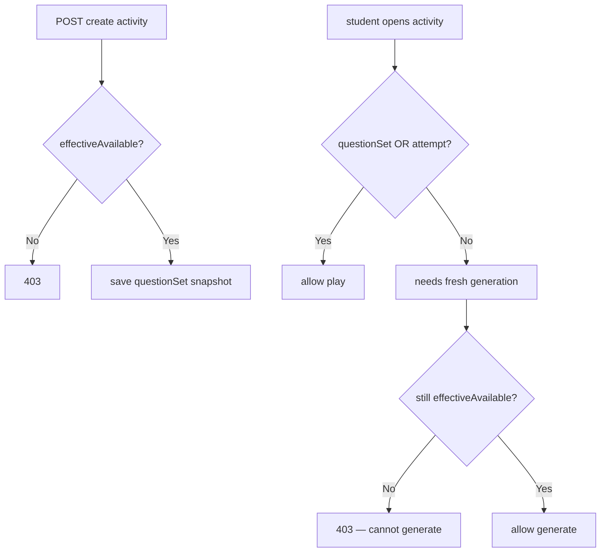
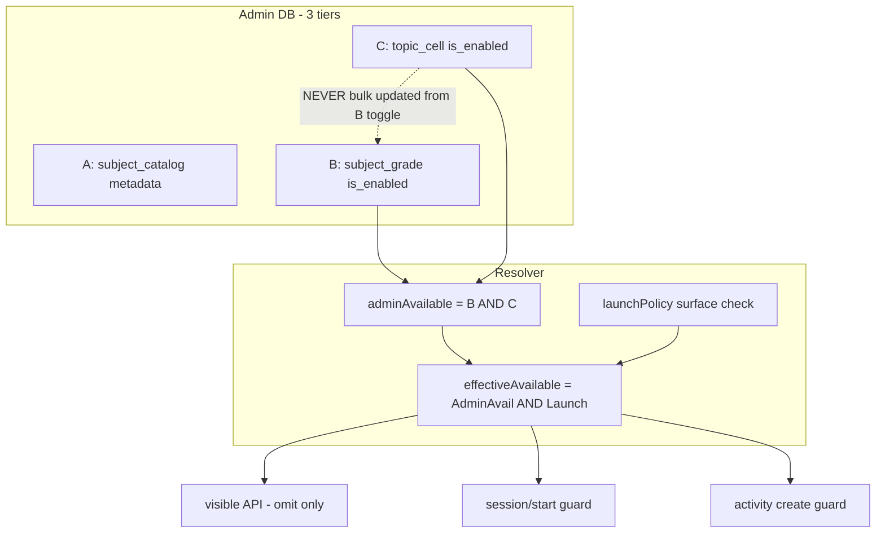

# תוכנית: שליטת Admin במקצועות ונושאי לימוד (rev 2)

**סטטוס:** ממתין לאישור — **לא להתחיל קוד** לפני sign-off על rev 2.

### מדיניות SQL — **רק הבעלים מריץ**

| מי | מה מותר |
|----|---------|
| **Agent / Cursor** | לכתוב קבצי migration (`075`–`077`) + seed script — **לתכנון וביקורת בלבד** |
| **Agent / Cursor** | **אסור** להריץ SQL, `supabase db push`, `psql`, seed על DB אמיתי, או כל פקודה שמשנה DB |
| **בעלים (אתה)** | להריץ migrations ידנית ב-Supabase / SQL editor **אחרי** review ואישור |
| **בעלים (אתה)** | להריץ seed script ידנית (אם נדרש) **אחרי** שהטבלאות קיימות |

כל קובץ migration יכלול הערת `FOR REVIEW ONLY — run manually by owner` (כמו [`071_site_game_catalog.sql`](supabase/migrations/071_site_game_catalog.sql)). Phase 1 **לא נחשב complete** עד שהבעלים מאשר שה-SQL רץ בהצלחה בסביבה שלו.

---

## החלטות שאושרו (rev 2)

### ארכיטקטורת שלוש שכבות — **לא bulk update על topic cells**

| שכבה | טבלה | מה נשמר | toggle משפיע על |
|------|------|---------|-----------------|
| A | `site_learning_subject_catalog` | metadata: title, route, sort | — (לא kill-switch) |
| B | `site_learning_subject_grade_catalog` | `(subject, grade) → is_enabled` | visibility מקצוע לכיתה |
| C | `site_learning_topic_cell_catalog` | `(subject, grade, topic) → is_enabled` | visibility נושא לכיתה |

**כלל זהב:** כיבוי/הדלקת מקצוע לכיתה מעדכן **רק** טבלה B. **אסור** לעדכן en masse את `is_enabled` בטבלה C.

**תרחיש קריטי (חייב לעבוד):**
1. Admin כיבה נושא "כפל" ב-g3 → `topic_cell.is_enabled=false`
2. Admin כיבה מקצוע חשבון ב-g3 → `subject_grade.is_enabled=false`
3. Admin הדליק מחדש מקצוע חשבון ב-g3 → `subject_grade.is_enabled=true`
4. **"כפל" נשאר כבוי** — כי `topic_cell.is_enabled` לא נגע

### נוסחת visibility (runtime)

```
adminTopicAvailable =
  subject_grade.is_enabled(subject, grade) == true
  AND topic_cell.is_enabled(subject, grade, topic) == true

effectiveAvailable(subject, grade, topic, surface) =
  adminTopicAvailable
  AND launchPolicy.isTopicAllowedOnSurface(subject, grade, topic, surface)
```

- **Admin disable** → תמיד חוסם (גם אם launch מאפשר).
- **Launch block** → Admin יכול להראות "פעיל באדמין" אבל "לא זמין בפועל".

**מקצוע visible לילד בכיתה** = `subject_grade enabled` **וגם** לפחות topic אחד עם `effectiveAvailable(..., self_practice)`.

### UX — "נעלם, לא ננעל"

- פריטים לא available → **לא ב-API visible, לא ב-DOM**
- אין disabled, אפור, 🔒, option disabled

### ספרי לימוד — v1 חסימה מלאה

- לא TOC, לא CTA, לא URL ישיר — redirect/block
- **אין** "קריאה מותרת / תרגול חסום" — שלב עתידי בלבד

### Sessions — guard ב-start בלבד

- `session/start` לנושא לא available → **403**
- session **קיים** (נפתח כשהיה פעיל) → `answer` **לא** נחסם אם Admin כיבה באמצע

### פעילויות הורה/מורה

- **Create חדש** על unavailable → חסום API + omit UI
- **Existing** → מותר **רק** אם `question_snapshot` / `questionSet` קפוא **או** attempt קיים
- אם פעילות דורשת שליפת שאלות חדשות מנושא כבוי → **חסום**

### הפרדה ממשחקים/יהלומים

- migrations **075+** (אחרי 074), namespaces נפרדים — לא לגעת ב-[`071_site_game_catalog.sql`](supabase/migrations/071_site_game_catalog.sql)

---

## 1. מיפוי המצב הקיים

(ללא שינוי מהrev 1 — ראה סעיפים 1.1–1.4 בגרסה הקודמת.)

**מקורות עיקריים:**
- מקצועות: [`LEARNING_SUBJECT_ALLOWLIST`](lib/learning-supabase/learning-activity.js), [`studentHomeDashboardClient.js`](lib/learning-client/studentHomeDashboardClient.js)
- נושאים per-grade: `utils/*-constants.js`, `data/*-curriculum.js`
- Resolver בחירה: [`teacher-class-topic-options.js`](lib/teacher-portal/teacher-class-topic-options.js)
- Launch policy: [`topic-launch-policy.js`](lib/launch-readiness/topic-launch-policy.js) — **שכבה נפרדת**, לא Admin
- ~255 תאים: [`topic-launch-registry.json`](data/launch-readiness/topic-launch-registry.json)

**פערים קריטיים היום:**
- אין Admin runtime catalog
- `session/start` — subject בלבד, ללא topic/grade guard
- Master pages / books / home — ללא catalog filter
- Parent/teacher create — ללא catalog guard

---

## 2. הצעת DB (תכנון + קבצי migration — **הרצה רק ע"י הבעלים**)

### 2.1 שלוש טבלאות

#### A — `site_learning_subject_catalog` (6 שורות)

| שדה | סוג | הערות |
|-----|-----|-------|
| `subject_key` | text PK | `math`, `geometry`, … |
| `title_he` | text NOT NULL | |
| `route` | text NOT NULL | `/learning/math-master` |
| `book_route_prefix` | text NULL | |
| `sort_order` | int DEFAULT 0 | |
| `metadata_json` | jsonb DEFAULT `{}` | emoji, blurb |
| `created_at` / `updated_at` | timestamptz | |

**אין `is_enabled` כאן** — metadata בלבד.

#### B — `site_learning_subject_grade_catalog` (6×6 = 36 שורות)

| שדה | סוג | הערות |
|-----|-----|-------|
| `subject_key` | text NOT NULL | FK → A |
| `grade_key` | text NOT NULL | g1..g6 |
| `is_enabled` | boolean NOT NULL DEFAULT **true** | kill-switch מקצוע×כיתה |
| `updated_by` | uuid NULL | |
| `updated_at` | timestamptz | |
| PK | `(subject_key, grade_key)` | |

#### C — `site_learning_topic_cell_catalog` (~255 שורות)

| שדה | סוג | הערות |
|-----|-----|-------|
| `subject_key` | text NOT NULL | |
| `grade_key` | text NOT NULL | |
| `topic_key` | text NOT NULL | math: operation keys |
| `title_he` | text NOT NULL | |
| `is_enabled` | boolean NOT NULL DEFAULT **true** | kill-switch נושא×כיתה — **עצמאי** מ-B |
| `updated_by` | uuid NULL | |
| `updated_at` | timestamptz | |
| PK | `(subject_key, grade_key, topic_key)` | |

**אין `subject_enabled` denormalized** — הוסר במפורש כדי למנוע bulk overwrite.

**Indexes:** `(subject_key, grade_key)`, `(grade_key, is_enabled)`, audit log table.

**RLS:** writes = service_role / Admin API only.

### 2.2 לוגיקת toggle (Admin actions)

| פעולה | מה מתעדכן | מה **לא** מתעדכן |
|-------|-----------|------------------|
| כיבוי מקצוע לכיתה אחת | B: `(subject, grade).is_enabled=false` | C: topic cells ללא שינוי |
| הדלקת מקצוע לכיתה אחת | B: `(subject, grade).is_enabled=true` | C: topics שנכבו פרטנית **נשארים** false |
| כיבוי מקצוע לכל הכיתות | B: all grades for subject | C: ללא שינוי |
| כיבוי נושא לכיתה אחת | C: `(subject, grade, topic).is_enabled=false` | B: ללא שינוי |
| כיבוי נושא בכל הכיתות | C: all grades where topic exists in curriculum | B: ללא שינוי |

### 2.3 Seed / backfill

Script: `scripts/admin/seed-learning-catalog.mjs`
- A: 6 subjects from code
- B: 6×6 subject-grades, all `true`
- C: ~255 cells from `curriculumTopicsFor()`, all `true`
- Idempotent ON CONFLICT DO NOTHING; new code topics → add enabled rows

Migrations: **075** (A), **076** (B), **077** (C) + audit — **קבצים ב-repo בלבד; הרצה ידנית ע"י הבעלים.**

**Workflow DB:**
1. Agent כותב `supabase/migrations/075_*.sql` … `077_*.sql` + `scripts/admin/seed-learning-catalog.mjs`
2. Owner review + אישור
3. **Owner** מריץ 075 → 076 → 077 ב-Supabase
4. **Owner** מריץ seed (אם לא baked into migration)
5. Owner מאשר "DB ready" — רק אז Phase 2+ (קוד אפליקציה)

---

## 3. Resolver + APIs

### 3.1 `lib/learning-catalog/learning-access.server.js`

```javascript
// Admin layer
isSubjectGradeAdminEnabled(subject, grade) → boolean
isTopicCellAdminEnabled(subject, grade, topic) → boolean
isAdminTopicAvailable(subject, grade, topic) → boolean  // B AND C

// Effective (runtime for students/parents/teachers)
isLaunchAllowed(subject, grade, topic, surface) → boolean
getLaunchBlockReason(subject, grade, topic, surface) → string|null

isEffectivelyAvailable(subject, grade, topic, surface) → boolean
// = isAdminTopicAvailable AND isLaunchAllowed

// Lists — return ONLY effectively available (omit)
listEffectiveSubjectsForGrade(grade, surface) → Subject[]
listEffectiveTopicsForGrade(subject, grade, surface) → Topic[]

// Guards
assertNewSessionAllowed(subject, grade, topic, surface) → 403  // session/start, new activity create
assertActivityPlayAllowed(activity) → 403|ok  // snapshot/attempt check
// NO assert on answer for existing learning_sessions row
```

### 3.2 Admin APIs

| Method | Path | תפקיד |
|--------|------|--------|
| GET | `/api/admin/learning-catalog/overview` | subjects + grades + cells + **admin vs effective** |
| PATCH | `/api/admin/learning-catalog/subject-grades/[subject]/[grade]` | toggle B |
| PATCH | `/api/admin/learning-catalog/subject-grades/[subject]/all-grades` | toggle B bulk |
| PATCH | `/api/admin/learning-catalog/topic-cells/[subject]/[grade]/[topic]` | toggle C |
| PATCH | `/api/admin/learning-catalog/topic-cells/[subject]/[topic]/all-grades` | toggle C bulk |
| POST | `/api/admin/learning-catalog/sync-from-code` | add missing rows |

**Admin cell response (חובה):**
```json
{
  "cellKey": "math:g3:multiplication",
  "subjectKey": "math",
  "gradeKey": "g3",
  "topicKey": "multiplication",
  "titleHe": "כפל",
  "subjectGradeAdminEnabled": true,
  "topicCellAdminEnabled": false,
  "adminAvailable": false,
  "launchAllowed": true,
  "effectiveAvailable": false,
  "effectiveBlockReasons": ["topic_disabled_by_admin"],
  "launchBlockReason": null
}
```

**`effectiveBlockReasons` enum (HE in UI):**
- `subject_grade_disabled_by_admin`
- `topic_disabled_by_admin`
- `launch_policy_hidden`
- `launch_policy_surface_blocked`

### 3.3 Runtime read API

`GET /api/learning/catalog/visible?grade=g3&surface=self_practice`

מחזיר **רק** `effectiveAvailable=true` — ללא disabled items.

### 3.4 Guard integration matrix

| Endpoint | Guard | הערה |
|----------|-------|------|
| `POST /api/learning/session/start` | `assertNewSessionAllowed` | **403** ל unavailable |
| `POST /api/learning/answer` | **אין** catalog guard אם `session_id` קיים ו-session נפתח חוקית | grandfather |
| `POST /api/parent/activities` | `assertNewSessionAllowed` at create | + snapshot required on save |
| `POST /api/teacher/activities` | idem | |
| `POST /api/teacher/student-activities` | idem | |
| Student activity start/play | `assertActivityPlayAllowed` | snapshot OR attempt |
| `POST /api/learning/planner-recommendation` | filter to effective only | |
| Question generators (client) | `isEffectivelyAvailable` before generate | new questions only |

---

## 4. Admin UI

### טאב: "מקצועות ונושאי לימוד"

**פעולות bulk (4):**
1. מקצוע — כל הכיתות (toggle B ×6)
2. מקצוע — כיתה אחת (toggle B ×1)
3. נושא — כל הכיתות שבהן קיים (toggle C per existing grade)
4. נושא — כיתה אחת (toggle C ×1)

**תצוגת סטטוס לכל שורה (Admin בלבד):**

| עמודה | משמעות |
|-------|--------|
| פעיל באדמין | `adminAvailable` (B AND C) |
| זמין בפועל | `effectiveAvailable` (כולל launch) |
| סיבת חסימה | אם לא זמין — reason badge |

דוגמה: Admin מדליק נושא אבל launch=HIDE → "פעיל באדמין: כן · זמין בפועל: לא · חסום: מדיניות launch-readiness"

**UX בחירה (student/parent/teacher):** omit only — ללא disabled UI.

---

## 5. התנהגות לפי persona

### ילד

| מצב | התנהגות |
|-----|---------|
| מקצוע unavailable | נעלם מ-home/hub; master URL → redirect |
| נושא unavailable | נעלם מ-picker; session/start → 403 |
| session פעיל + Admin כיבה באמצע | **answer ממשיך** |
| ספר — unavailable | **לא** ב-TOC; URL ישיר → redirect; **לא** CTA |

### הורה / מורה

| מצb | התנהגות |
|-----|---------|
| create חדש | omit + API 403 |
| פעילות קיימת + snapshot | play מותר |
| פעילות קיימת **ללא** snapshot + needs fresh gen | **חסום** |
| monitor/report על פעילות ישנה | לא נשבר |

### דוחות

- היסטוריה — **לא** מסוננת, **לא** נמחקת
- נושא inactive — badge קטן "לא פעיל כיום"
- recommendations / diagnostics / next-step — **רק** effective available

---

## 6. ספרי לימוד — v1 (ללא חריג)

| פריט | מדיניות |
|------|---------|
| TOC | omit pages mapped to unavailable cell |
| עמוד ספר URL ישיר | redirect `/learning?blocked=book` |
| CTA תרגול | לא מוצג |
| קריאת תוכן | **חסום** (אין read-only exception) |
| `book-events` API | reject new events for blocked pages |

מימוש: [`learning-book-catalog.js`](lib/learning-book/learning-book-catalog.js), practice maps, `[subject]/[grade]/[pageId].js` SSR guard.

---

## 7. פעילויות — snapshot rule



**DB signals:** [`054_assigned_activity_question_snapshot.sql`](supabase/migrations/054_assigned_activity_question_snapshot.sql) — `question_snapshot` / frozen set on parent & classroom activities.

---

## 8. בדיקות חובה לפני אישור (T1–T20)

| # | תרחיש | ציפייה |
|---|--------|--------|
| T1 | מקצוע unavailable g3 | אין כרטיס home |
| T2 | נושא unavailable g3 | אין option picker |
| T3 | URL master ישיר | redirect/block |
| T4 | URL book page ישיר | redirect/block |
| T5 | session/start unavailable | 403 |
| T6 | session קיים + Admin כיבה + answer | **200** — לא נופל |
| T7 | parent create unavailable | 403 |
| T8 | teacher create unavailable | 403 |
| T9 | דוח ישן + נושא inactive | data + badge |
| T10 | פעילות קיימת + snapshot | play OK |
| T11 | פעילות קיימת ללא snapshot + topic off | block generate |
| T12 | disable topic → disable subject g3 → enable subject g3 | **topic stays off** |
| T13 | disable topic all grades → enable one grade subject | topic still off that grade |
| T14 | Admin ON + launch HIDE | effective OFF; Admin UI shows reason |
| T15 | visible API | no disabled keys in payload |
| T16 | book TOC | unavailable pages absent |
| T17 | topic-next-step | no rec disabled |
| T18 | default seed | all B+C true |
| T19 | g4 on / g3 off same topic | grade isolation |
| T20 | API bypass create | 403 |

---

## 9. סיכונים

| סיכון | mitigation |
|-------|------------|
| **Subject re-enable restores disabled topics** | 3-tier schema; B never writes C |
| Admin ON but invisible (launch) | Admin UI: admin vs effective + reason |
| Mid-session kill | guard only session/start |
| Activity without snapshot breaks | assertActivityPlayAllowed |
| Book read-only scope creep | v1 full block; defer read-only |
| Reports break | no aggregation filter |
| Games agent conflict | 075+ separate namespace |
| Agent runs SQL by mistake | plan + migration header FOR REVIEW ONLY; Phase 1 gated on owner "DB ready" |

---

## 10. סדר ביצוע

### Phase 0 — אישור rev 2
- [ ] 3-tier schema + toggle rules + book v1 + session policy + snapshot rule

### Phase 1 — DB files (075–077) + seed script — **owner runs SQL**
- [ ] Agent: כתיבת migration files + seed script (FOR REVIEW ONLY)
- [ ] Owner: review + הרצה ידנית 075 → 076 → 077
- [ ] Owner: הרצה ידנית seed → אישור "DB ready"

### Phase 2 — Resolver + visible API
- [ ] `learning-access.server.js` with effectiveAvailable + launch merge
- [ ] Tests T12, T14, T18

### Phase 3 — Admin UI + 4 bulk actions + status columns
- [ ] admin vs effective display

### Phase 4 — Student (home, hub, masters, books full block)
- [ ] session/start guard only

### Phase 5 — Parent/Teacher create + play rules
- [ ] snapshot/attempt grandfather

### Phase 6 — Reports soft (badge + rec filter)

### Phase 7 — QA T1–T20 + CI sync script + deploy (deploy/SQL production — owner only)

---

## סיכום ארכיטקטוני



**Default:** כל B ו-C = `true`. **Visibility** = B ∧ C ∧ launch. **Re-enable subject** לא מדליק topics שנכבו פרטנית. **Omit** מ-pickers. **Books v1** — חסימה מלאה. **Sessions** — חסום רק start חדש.
