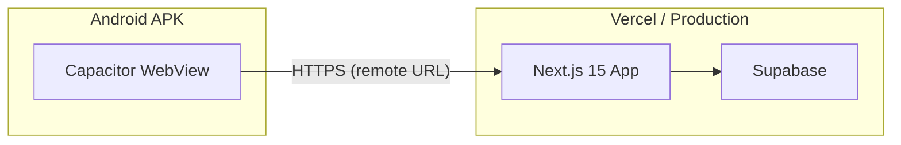

# Android App Packaging via Capacitor (Remote URL Shell)

---

## PLAN STATUS

**This document is PLAN ONLY. No implementation is approved yet.**

- Do not install packages yet.
- Do not create `android/` yet.
- Do not edit `package.json` yet.
- Do not create `capacitor.config.ts` yet.
- Do not build APK yet.
- Do not publish to Google Play.
- Do not create a Play Console release.
- Do not upload AAB/APK to Google Play.
- Do not configure a store listing without owner approval.
- No SQL. No migrations. No DB schema changes.
- No secrets, keystore files, or signing passwords in the repo, docs, logs, screenshots, or terminal output.
- No commit, push, or deploy.

Owner must explicitly approve execution before any step below is taken.

---

## OWNER DECISIONS — CONFIRMED

The following values have been confirmed by the owner and are final for this phase. No further clarification is needed before execution is approved.

| Decision | Confirmed Value |
|---|---|
| **Target phase** | Internal/debug APK for device testing only. No Google Play release in this phase. |
| **Production URL** | `https://liosh-website.vercel.app` |
| **Package ID** | `com.leok.kids` |
| **Android launcher app name** | `LEO K` |
| **Icon source** | `public/images/leo-icons/` — use existing icons as-is. If any required icon files are missing, stop and report exactly what is missing. Do not select replacement icons without owner approval. |

These values are locked. Do not change them during execution without explicit owner approval.

---

## BUILD BUTTON EXECUTION GATE

**Execution has not started. No implementation is in progress.**

Execution may begin only after the owner explicitly presses the build/start button or sends an execution approval message. When execution begins, it is limited strictly to internal/debug APK packaging as described in this plan.

**Hard limits — apply for the entire execution. No exceptions.**

- Internal/debug APK only.
- No Google Play publishing.
- No Play Console release of any kind.
- No APK or AAB upload to Google Play.
- No store listing configuration.
- No release signing keystore creation or use.
- No SQL. No migrations. No DB schema changes.
- No app logic changes.
- No UI or design changes.
- No Hebrew copy changes.
- No Auth logic changes.
- No changes to the existing Next.js web app or Vercel deployment.
- No commit, push, or deploy.
- No email delivery task work or any other unrelated work.

**Stop rule:** If execution reaches a point where any of the following would be required — changing website code, Auth logic, DB, Hebrew copy, UI, production deployment, or anything outside the approved Android packaging scope — stop immediately and ask the owner before making that change.

---

## Phase 0 — Production Suitability Decision

Before any Capacitor installation or Android project is created, the correct distribution approach must be confirmed. The following options exist and have meaningfully different implications:

- **Internal/debug APK (proof of concept)** — Install via ADB or direct APK share. No Play Store, no policy review required. Remote-URL mode is acceptable. Fastest to validate.
- **Google Play production release via Capacitor remote-URL shell** — Requires a full Play policy review. Google Play's WebView app policy prohibits low-value wrapper apps that merely replicate a website without added native value. Risk must be assessed and documented before submission. Remote-URL mode is permitted but must be disclosed and justified.
- **Trusted Web Activity (TWA)** — An alternative to Capacitor for wrapping a PWA for Play Store distribution. TWA is Google's recommended path for PWA-to-Play-Store packaging. It requires passing the Digital Asset Links verification (`assetlinks.json` hosted on the production domain). May be more appropriate for Play Store if the Capacitor WebView policy risk is judged too high.

**Required output of Phase 0:** A written decision in [`docs/android/ANDROID_APP_READINESS_AUDIT.md`](docs/android/ANDROID_APP_READINESS_AUDIT.md) documenting which approach is chosen and why, reviewed and confirmed by the owner before Phase 1 begins.

---

## Architecture overview: remote-URL mode

Because the app is Next.js with SSR + API routes, the app **cannot run standalone on-device** without a Node server. The Capacitor remote-URL approach is:



`capacitor.config.ts` sets `server.url` to the production Vercel domain. The WebView loads the live site. Auth cookies, SSR, and all APIs work unchanged.

### Remote-URL risk warning

Remote-URL mode in Capacitor is acceptable for an internal/debug APK or proof of concept. It must **not** be treated as automatically approved for a Google Play production release. Before any store submission:

- The app must be reviewed against Google Play's policy on [WebView apps](https://support.google.com/googleplay/android-developer/answer/9888379).
- The app must demonstrate that it provides a genuine, high-quality learning product experience — not merely a thin wrapper around a website.
- A separate policy suitability review must be completed and documented in the readiness checklist.
- No APK or AAB may be uploaded to Google Play without explicit owner approval after that review.

---

## Key technical risks identified

- **`X-Frame-Options: DENY`** — Safe; Capacitor WebView is a native view, not an iframe.
- **`SameSite=Lax` cookies** — Safe in remote-URL mode; WebView requests come from the same production origin.
- **`SameSite=Strict` (staff session)** — Needs manual QA; top-level navigation from within WebView should pass, but document in QA report.
- **`Secure` cookie flag** — Safe; production URL is HTTPS.
- **Service worker in WebView** — Android WebView (Chromium API 67+) supports SW; Capacitor WebView is Chromium-based, so it works.
- **CSP `frame-ancestors 'none'`** — Safe; not an iframe scenario.
- **Same-origin guard** — Safe; WebView sends the production origin header.

---

## Phase 1 — Audit (docs only)

Create [`docs/android/ANDROID_APP_READINESS_AUDIT.md`](docs/android/ANDROID_APP_READINESS_AUDIT.md):
- Phase 0 approach decision (see above)
- PWA manifest completeness check (`manifest.json`, icons 192/512, maskable, orientation)
- Viewport meta audit (`viewport-fit=cover` already set in `_app.js`)
- Cookie/auth WebView compatibility matrix
- CSP header compatibility with Capacitor WebView
- Service-worker behavior in Capacitor WebView
- Google Play WebView policy review:
  - Confirm the app is owned by the same owner as the production website
  - Confirm the app provides a real, substantive learning product experience
  - Confirm the app is not affiliate, referral, or thin-wrapper traffic
  - Document policy risk level and mitigation before any store submission
- Known gaps and mitigations

---

## Phase 2 — Install Capacitor

Add to `package.json` devDependencies:
- `@capacitor/core`
- `@capacitor/cli`
- `@capacitor/android`

Add scripts:
- `"cap:sync": "npx cap sync android"`
- `"cap:open": "npx cap open android"`
- `"cap:build:debug": "npx cap build android"`

Create [`capacitor.config.ts`](capacitor.config.ts) at repo root:
```typescript
import { CapacitorConfig } from '@capacitor/cli';

const config: CapacitorConfig = {
  appId: 'com.leok.kids',
  appName: 'LEO K',
  webDir: 'out',                   // unused in remote-URL mode but required by Capacitor CLI
  server: {
    url: 'https://liosh-website.vercel.app',
    cleartext: false,
    allowNavigation: ['liosh-website.vercel.app', '*.supabase.co'],
  },
  android: {
    allowMixedContent: false,
    captureInput: true,
    webContentsDebuggingEnabled: false,  // set true only for debug builds, never commit as true
  },
};

export default config;
```

---

## Phase 3 — Add Android platform

Run `npx cap add android` — generates `android/` project.

Configure `android/app/src/main/res/values/strings.xml`:
- `app_name` → `LEO K` (confirmed by owner)

Configure `android/app/src/main/AndroidManifest.xml`:
- Remove any auto-added permissions beyond `INTERNET`
- Keep: `android.permission.INTERNET` only — no other permissions
- Set `android:usesCleartextTraffic="false"`

Configure `android/variables.gradle` or `build.gradle`:
- `minSdkVersion 26` (Android 8.0, covers WebView Chromium + SameSite cookie support)
- `targetSdkVersion 35`
- `compileSdkVersion 35`

---

## Phase 4 — Icons and splash

Replace Capacitor default icons with Leo K assets from `public/images/leo-icons/`:
- `icon-192.png` → all mipmap densities (via `npx @capacitor/assets generate` or manual copy)
- `icon-512.png` → Play Store icon source
- Maskable variant → adaptive icon foreground
- Background color `#050816` (matches `manifest.json`)

Splash screen: optional; document as a "nice to have" — not blocking for debug APK.

---

## Phase 5 — WebView behavior verification (QA doc)

Create [`docs/android/ANDROID_QA_REPORT.md`](docs/android/ANDROID_QA_REPORT.md) with a test matrix covering:
- Parent login/logout → dashboard → report
- Student code/PIN login → home → activity → answer submission
- School/teacher/staff login and key screens
- Games (arcade, learning activities)
- Offline indicator behavior
- Cookie persistence across app background/foreground
- Back-button behavior (WebView history vs Android back)
- Hebrew RTL rendering
- Audio playback (TTS, sound effects)
- `SameSite=Strict` staff session navigation behavior

---

## Phase 6 — Build debug APK

Instructions in [`docs/android/ANDROID_BUILD_AND_SIGNING_REPORT.md`](docs/android/ANDROID_BUILD_AND_SIGNING_REPORT.md):
```bash
# One-time setup
npm install
npx cap sync android

# Debug APK
cd android
./gradlew assembleDebug
# Output: android/app/build/outputs/apk/debug/app-debug.apk
```
Document: prerequisites (JDK 17+, Android SDK, ANDROID_HOME), emulator setup, ADB install command.

**Signing rules for this phase:**
- Debug APK uses the auto-generated Android debug keystore only.
- No release keystore is created, stored, or committed at this stage.
- No signing passwords appear in docs, logs, screenshots, or terminal output.
- Release signing instructions are documented as readiness notes only — not executed.

---

## Phase 7 — Capacitor setup report

Create [`docs/android/CAPACITOR_SETUP_REPORT.md`](docs/android/CAPACITOR_SETUP_REPORT.md):
- Packages installed and versions
- `capacitor.config.ts` decisions and owner-confirmed values
- Android manifest changes
- Icon/splash asset pipeline
- Known issues found during setup

---

## Phase 8 — Google Play readiness checklist

Create [`docs/android/GOOGLE_PLAY_READINESS_CHECKLIST.md`](docs/android/GOOGLE_PLAY_READINESS_CHECKLIST.md) covering:

### WebView policy review
- Confirm app is owned by the same owner as the production website (required for Play policy)
- Confirm the app provides a real, substantive learning product experience — not a low-value wrapper
- Confirm no affiliate or referral traffic involvement
- Document the policy risk assessment before any store submission
- Reference: [Google Play WebView app policy](https://support.google.com/googleplay/android-developer/answer/9888379)

### Google Play Families policy (required — product is for children/students)
- **Target audience declaration** — explicitly declare the intended age group (children 6–12, mixed audience, or directed to children under 13)
- **Children/Family requirements** — if declared as directed to children or mixed audience, Families policy applies in full
- **No behavioural advertising** — confirm no ad SDKs or behavioural tracking are present or will be added
- **Privacy policy review** — existing `/privacy` page must be publicly accessible; confirm it covers child/student data collection and use
- **Student/child data disclosures** — document all data collected from students (activity answers, PIN login, session data) and basis for collection
- **School/parent account data disclosures** — document all data collected from parent and school accounts (email, reports, assigned activities)
- **Data Safety form readiness** — map all data types collected to Google Play Data Safety categories; prepare draft before store submission

### Store listing requirements
- Privacy policy URL (existing `/privacy` page — confirm public URL)
- App content rating via IARC questionnaire (ages 6–12 expected; children's category triggers Families review)
- App screenshots required: phone (at least 2), 7" tablet (at least 1)
- Feature graphic: 1024×500 px
- Short description (80 characters max)
- Full description (4000 characters max) — Hebrew and English versions
- App icon: 512×512 px PNG (high-res)

### Release and testing requirements
- **12-tester closed testing rule** — If the owner opens a new personal Google Play developer account, Google may require a closed test track with at least 12 testers opted in for a minimum of 14 continuous days before production access is granted. This must be planned for in advance. Do not assume immediate production publication is available for a new account.
- Release track path: Internal Test → Closed Test (12+ testers, 14 days) → Open Test → Production
- Signing approach: document upload key vs Google-managed signing key options; recommend Google-managed for safety
- **No keystore files committed** — add `*.jks` and `*.keystore` to `.gitignore`
- **No signing passwords in repo, docs, logs, or screenshots**

### Publishing gate
- **Do not publish to Google Play.**
- **Do not create a Play Console release.**
- **Do not upload AAB/APK to Google Play.**
- **Do not configure the store listing without explicit owner approval.**
- All items in this checklist are readiness documentation only until the owner explicitly approves store submission.

---

## Files changed/created summary

| File | Action |
|------|--------|
| `package.json` | Add 3 Capacitor devDependencies + 3 scripts |
| `capacitor.config.ts` | New — Capacitor configuration |
| `android/` | New — generated by `npx cap add android` |
| `android/app/src/main/AndroidManifest.xml` | Edit permissions + cleartext flag |
| `android/app/src/main/res/values/strings.xml` | Edit app name |
| `android/variables.gradle` | Edit SDK versions |
| `android/app/src/main/res/mipmap-*/` | Replace icons |
| `.gitignore` | Add keystore/signing ignores |
| `docs/android/ANDROID_APP_READINESS_AUDIT.md` | New |
| `docs/android/CAPACITOR_SETUP_REPORT.md` | New |
| `docs/android/ANDROID_QA_REPORT.md` | New |
| `docs/android/ANDROID_BUILD_AND_SIGNING_REPORT.md` | New |
| `docs/android/GOOGLE_PLAY_READINESS_CHECKLIST.md` | New |

---

## What is NOT changed

- `next.config.js` — no changes needed (CSP/headers work fine with remote WebView)
- `pages/_app.js` — no changes
- All auth logic, DB schema, Hebrew copy, UI — untouched
- Existing Vercel/web deployment — completely unaffected
- No SQL, migrations, or DB schema changes of any kind

---

## Hard rules (apply to all phases)

- No SQL. No migrations. No DB schema changes.
- No secrets, API keys, or passwords anywhere in the repo, docs, logs, screenshots, or terminal output.
- No keystore files or signing passwords committed to the repo.
- No commit, push, or deploy as part of this plan.
- Do not publish to Google Play. Do not create a Play Console release. Do not upload AAB/APK.
- Do not configure a store listing without explicit owner approval.
- Do not mix this work with the email delivery work or any other open plan.
