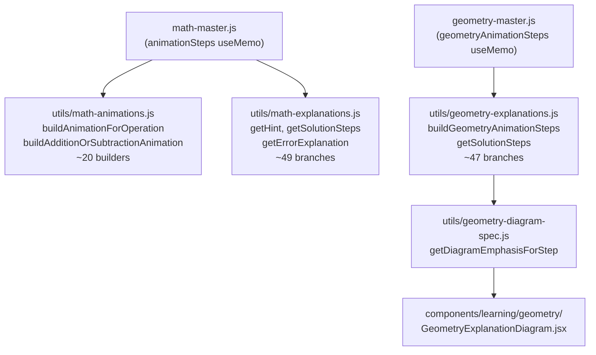
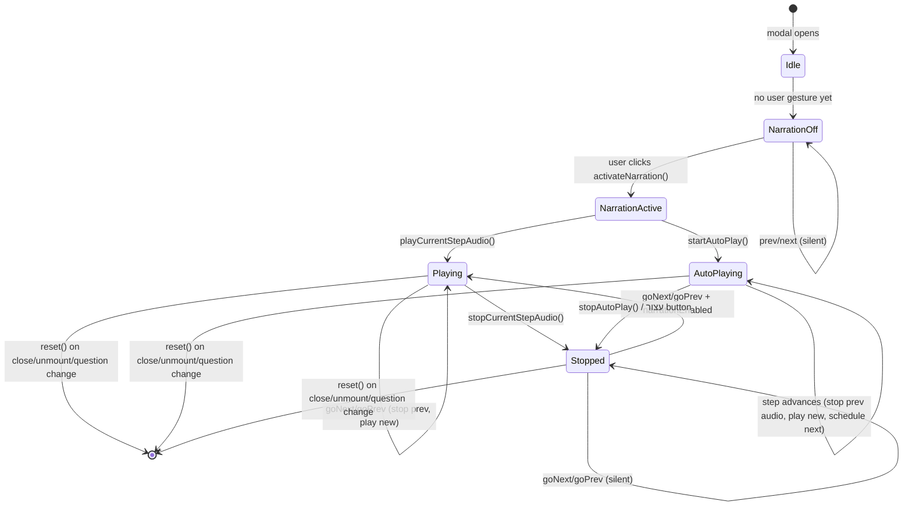
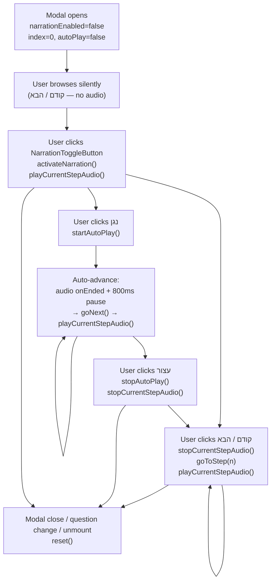

# Audio Support for Step-by-Step Explanation Panels — Audit & Plan

## 1. Current Audio Map

The site uses **three separate audio mechanisms**, none of which are wired to Math/Geometry explanation modals today.

### Mechanism A — Server-generated MP3 (Hebrew pedagogical audio, primary)
- **Files:** [`utils/audio-playback-core.js`](utils/audio-playback-core.js), [`utils/hebrew-audio-gen-url.js`](utils/hebrew-audio-gen-url.js), [`utils/hebrew-audio-gen-store.js`](utils/hebrew-audio-gen-store.js), [`pages/api/hebrew-audio-ensure.js`](pages/api/hebrew-audio-ensure.js), [`pages/api/hebrew-audio-stream.js`](pages/api/hebrew-audio-stream.js)
- **Technology:** `node-edge-tts` (`he-IL-HilaNeural` neural voice), MP3 written to disk/`/tmp`, streamed via `/api/hebrew-audio-stream?h=<hash>`
- **Trigger:** Content hash of narration text → deterministic URL → `POST /api/hebrew-audio-ensure` pre-generates file on first use
- **Playback:** `createStemPlaybackController(stem, opts)` → `{ play(), stopAll(), bumpReplay(), dispose() }`
- **Subjects:** Hebrew only

### Mechanism B — Browser `speechSynthesis` (Hebrew fallback TTS)
- **Files:** [`utils/audio-playback-core.js`](utils/audio-playback-core.js) — `pickHebrewTtsVoice()`, `primeSpeechSynthesisVoices()`
- **Technology:** `window.speechSynthesis` with `lang: "he-IL"`
- **Trigger:** When `playback_kind === "tts"` and `tts_text` is set (non-static Hebrew questions)
- **Limitations:** iOS requires synchronous call after user gesture; Hebrew voice may not be installed on all devices; Chrome needs voice pre-load; no pause API
- **Subjects:** Hebrew only (fallback path)

### Mechanism C — Pre-recorded MP3 SFX via `useSound`
- **Files:** [`hooks/useSound.js`](hooks/useSound.js), `/public/sounds/*.mp3`
- **Technology:** `HTMLAudioElement`, local static files
- **Subjects:** All six subjects (correct/wrong/badge/BGM SFX only — not narration)

### What does NOT exist today
- No audio hook, button, or narration in Math or Geometry explanation modals
- No `audioText`, `spokenText`, or `narrationHe` fields on any math/geometry step object
- English audio scaffold exists but is **disabled** (`ENGLISH_AUDIO_PRODUCT_ACTIVATED = false`)

---

## 2. Current Step-by-Step / Help Component Map

Explanation modals are **not standalone components** — they are rendered inline inside two monolithic page files:

- [`pages/learning/math-master.js`](pages/learning/math-master.js)
- [`pages/learning/geometry-master.js`](pages/learning/geometry-master.js)

### Step data generation



### Step object shape (Math & Geometry)

```js
{
  id: string,
  title: string,         // e.g. "שלב 3" or "מיישרים את הספרות"
  content?: ReactNode,   // primary display — geometry ALWAYS uses this
  text?: string,         // optional plain string; math uses with renderMathLTRInText
  pre?: string,          // vertical digit column art in <pre> — Math column add/sub
  highlights?: string[], // math column highlights
  diagramEmphasis?: string // geometry SVG highlight
}
```

### Step navigation

Both pages use: `animationStep` state, `קודם` / `הבא` buttons, `נגן` / `עצור` auto-advance toggle (2 s per step), counter label.

### Modal triggers

- Math: `📖 צעד-צעד` button → `setShowSolution(true)`
- Geometry: `📘 צעד-צעד` button → `setShowSolution(true)`

### Other help surfaces (not stepped)

- Inline hint panel (`showHint` + `getHint`) — single-paragraph text
- "למה טעיתי?" error explanation — single block
- Theory help (`getTheorySummary`) — Geometry only, single paragraph
- Reference board / multiplication table — static visual

### Template scale

| Subject | Step template branches | Dynamic animators |
|---------|----------------------|-------------------|
| Math | ~49 | ~20 |
| Geometry | ~47 | — |

---

## 3. TTS Suitability Assessment

| Step content | Spoken aloud suitability | Notes |
|---|---|---|
| Short Hebrew hint sentences | **Good** | `getHint` returns clean Hebrew prose |
| `text` field (math animation steps) | **Acceptable** with symbol expansion | Often set; contains `×`, `÷`, ` = `, numbers |
| `content` ReactNode | **Cannot be read directly** | Must extract text or provide `audioTextHe` |
| `pre` vertical columns | **Very poor** | Digit grids → nonsense when spoken |
| Geometry formulas with π, ², √ | **Poor without expansion** | Symbol expansion layer needed |
| `getTheorySummary` | **Good** | Returns clean Hebrew sentence string |

### Where `audioTextHe` / `spokenTextHe` fields are needed

A separate spoken-text field is needed for any step whose `content` is a ReactNode (i.e. most geometry steps and math animation steps that use visual column layouts). For example, a step displaying:

```
  9374
+ 6573
------
```

needs a companion text such as `"תשע אלף שלוש מאות שבעים וארבע ועוד שש אלף חמש מאות שבעים ושלוש"` — **this narration text must be approved by the content owner before implementation.**

---

## 4. Architecture Options Compared

### Option A — Reuse Hebrew audio mechanism (`createStemPlaybackController`)

**How:** Construct a minimal `audioStem`-compatible object per step, pass it to `createStemPlaybackController` inside a new `useStepAudio` hook.

**Pros:**
- Infrastructure already exists and is tested in Hebrew
- Supports both server MP3 (`static_url`) and browser TTS (`tts`) in one controller
- `dispose()` / `stopAll()` lifecycle already built
- `he-IL-HilaNeural` produces good Hebrew speech quality

**Cons:**
- `createStemPlaybackController` accepts the full `audioStem` schema; wrapping it adds a thin boilerplate object
- Server MP3 path requires `POST /api/hebrew-audio-ensure` — adds network round-trip per step on first play
- Rate limiting in `lib/security/public-api-rate-limit.js` applies — may need higher budget for math/geometry steps

**Risk:** Low. The controller is cleanly abstracted.

---

### Option B — Browser `speechSynthesis` directly

**How:** New minimal hook calls `window.speechSynthesis.speak(new SpeechSynthesisUtterance(text))` with `lang: "he-IL"`.

**Pros:**
- Zero server cost, zero network, works offline
- Simple to implement (< 50 lines)
- No API key exposure

**Cons:**
- **Hebrew voice availability is inconsistent.** On Android, `he-IL` voice may not be installed. On iOS Safari, `he-IL` is present but requires synchronous call from user gesture.
- Voice quality varies dramatically by device/OS
- No pause API — only `cancel()` and `speak()`
- Chrome needs voice pre-load (`primeSpeechSynthesisVoices`) before first use
- Not suitable as the only mechanism if quality matters for children

**Risk:** Medium. Acceptable as a fallback but not as primary if voice quality matters.

---

### Option C — Pre-recorded audio files

**How:** Author `.mp3` files for each step template (≈49 + 47 = ~96 templates × average 4 steps = ~384 files), serve from `public/audio/steps/`, map by step `id`.

**Pros:**
- Perfect quality, no TTS quirks, works fully offline
- No server cost at runtime

**Cons:**
- ~384+ files to record and maintain (number increases with new templates)
- Cannot cover dynamically-generated steps (column add/sub animation produces variable numbers)
- Any text change requires re-recording
- **Not viable for dynamic steps** — math animation steps are parameterized per question

**Risk:** High maintenance cost. Not feasible for dynamic math content.

---

### Option D — Server-side TTS generation with cache (Edge TTS)

**How:** Same as current Hebrew implementation — `POST /api/hebrew-audio-ensure` with step text → `node-edge-tts` generates MP3 → served from `/api/hebrew-audio-stream`.

**Pros:**
- Best voice quality (`he-IL-HilaNeural` neural)
- Results are cached by content hash — same step text is only generated once
- Already working in production for Hebrew

**Cons:**
- Adds latency on first-ever play of a step (generation time ~1–3 s)
- Disk/`/tmp` space on Vercel is ephemeral — cached files may need to be regenerated between deploys
- Rate limiting needs review for math/geometry volume
- Requires server environment (no offline/PWA support without pre-caching)

**Risk:** Low for implementation; moderate for Vercel ephemeral storage.

---

## 5. Corrected Behavior Model — Synced Narration Step Player

### Important distinction

The step-by-step explanation is **not** a static help panel. It behaves like a video/animated presentation with step-by-step visual transitions. Audio must model this correctly:

| Scenario | Correct behavior |
|---|---|
| Page load / modal open | **No audio** — no autoplay before user gesture (browser policy) |
| User has NOT activated narration | Silent steps; no audio at all |
| User activates narration (first gesture) | `narrationEnabled = true`; current step plays immediately |
| User clicks קודם / הבא manually | Stop previous step audio; play new step audio if `narrationEnabled` |
| Auto-advance ("נגן" mode) is active + `narrationEnabled` | Each step transition stops previous audio and plays new step audio |
| User clicks "עצור" | Stops both visual auto-advance **and** audio |
| User closes modal | Stops audio + resets narration state |
| User changes question / navigates away | Stops audio + resets narration state |

The old plan incorrectly described this as "audio button only, no synced playback." That is replaced by the model above.

---

## 5a. Narration-Enabled Step Player — State Architecture

### New hook: `hooks/useNarratedStepPlayer.js`

This replaces the simpler `useStepAudio.js` concept. It owns all step-player state and is the single source of truth for both visual and audio progression.

Proposed state shape:

```js
{
  // Narration activation (requires user gesture — set to true only on explicit click)
  narrationEnabled: boolean,        // false by default; true after first play click

  // Visual step state (currently in math-master.js / geometry-master.js as animationStep)
  currentStepIndex: number,         // 0-based
  totalSteps: number,

  // Audio state
  isPlayingAudio: boolean,          // true while TTS/MP3 is speaking
  audioReady: boolean,              // true if TTS voices loaded / MP3 ready
  audioError: string | null,        // "no_hebrew_voice" | "synthesis_failed" | null

  // Auto-advance state
  isAutoPlayingSteps: boolean,      // replaces current `autoPlay` boolean in pages
}
```

Proposed actions:

```js
{
  // Activate narration for the first time (must be called on user gesture)
  activateNarration(),

  // Navigate steps
  goToStep(index),          // stop audio → set index → play if narrationEnabled
  goNext(),                 // goToStep(currentStepIndex + 1)
  goPrev(),                 // goToStep(currentStepIndex - 1)

  // Auto-advance controls
  startAutoPlay(),          // setIsAutoPlayingSteps(true); schedule next step
  stopAutoPlay(),           // setIsAutoPlayingSteps(false); stopCurrentStepAudio()

  // Audio controls (used internally + exposed for UI)
  playCurrentStepAudio(),   // play step[currentStepIndex].audioTextHe
  stopCurrentStepAudio(),   // cancel TTS / pause Audio element

  // Cleanup (called on modal close / unmount / question change)
  reset(),                  // stopAll + narrationEnabled=false + index=0 + autoPlay=false
}
```

Hook reads steps from a `steps` prop — same `animationSteps` array already computed by the page.

### Mermaid: full state machine



---

## 5b. Auto-Advance + Audio Timing: Analysis

### The problem

The current auto-advance timer fires every **2 seconds** regardless of step content length. With audio, a spoken narration for a math step may take 3–8 seconds. Two incompatible modes:

**Option B — Fixed 2-second timer, cut/replace audio on transition**

- Visual advance stays at 2 s per step
- When the step changes, previous audio is cut; new audio starts
- Narration is interrupted mid-sentence
- Pros: Simple; existing timer logic unchanged
- Cons: Children hear truncated sentences; confusing and poor UX; not child-friendly
- **Not recommended**

**Option A — Audio-driven advance: wait for audio `onEnded`, then advance after short delay**

- When `isAutoPlayingSteps` and `narrationEnabled`, the timer is replaced by an audio `onEnded` callback
- After the audio for a step finishes, a configurable short pause (e.g., 800 ms) is added before advancing
- If `narrationEnabled` is false, fall back to 2-second timer (existing behavior preserved)
- Pros: Sentences are heard completely; natural pacing; child-friendly; synced visuals and audio
- Cons: Step duration becomes variable and unpredictable; very long narrations could stall the presentation; needs a **maximum timeout** safety net (e.g., 15 s per step) in case `onEnded` never fires (known issue with browser TTS on some devices)
- **Recommended**

### Recommended timing model (Option A, with safety net):

```
if narrationEnabled && isAutoPlayingSteps:
  play step audio
  → onEnded fires → wait pauseAfterStepMs (800 ms) → advance
  → OR safety timeout (maxStepDurationMs = 15000) → force advance
else:
  existing 2-second timer (no change)
```

The `maxStepDurationMs` safety net ensures a broken TTS does not stall the auto-player indefinitely.

**Owner decision required:** Confirm Option A is acceptable and approve values for `pauseAfterStepMs` and `maxStepDurationMs`.

---

## 5c. Recommended Architecture (Revised)

### Strategy: Option A (reuse `createStemPlaybackController`) + Option B (browser TTS fallback) + new `useNarratedStepPlayer` hook

### New files to create (if approved)

- **`hooks/useNarratedStepPlayer.js`** — owns step index, narrationEnabled, autoPlay state, and audio lifecycle. Wraps `createStemPlaybackController`. Replaces both the per-page `animationStep` state and the simple `useStepAudio` concept.
- **`components/learning/NarrationToggleButton.js`** — child-friendly "activate narration / stop narration" toggle button, RTL-safe. Renders `null` if no audio is available for the current step.

### Files to modify (if approved)

- [`utils/math-animations.js`](utils/math-animations.js) — add optional `audioTextHe` field to step objects; **content must be owner-approved before adding**
- [`utils/geometry-explanations.js`](utils/geometry-explanations.js) — add optional `audioTextHe` field per step template; **same approval required**
- [`pages/learning/math-master.js`](pages/learning/math-master.js) — replace local `animationStep` + `autoPlay` state with `useNarratedStepPlayer`; mount `<NarrationToggleButton>` in modal footer; call `reset()` on modal close
- [`pages/learning/geometry-master.js`](pages/learning/geometry-master.js) — same as math-master
- [`utils/audio-playback-core.js`](utils/audio-playback-core.js) — no changes needed; used as-is

### Lifecycle flow (revised)



Key rules:
- `narrationEnabled` is `false` on modal open — no audio before user gesture
- After `activateNarration()`, every step change (manual or auto) plays the new step's audio
- `stopAutoPlay()` and `עצור` both stop visual advance AND audio
- `reset()` on modal close / question change / page unmount — clears all state
- If `audioTextHe` is missing for a step, `playCurrentStepAudio()` is a no-op (no error, no broken UI)
- Safety timeout of 15 s per step in auto-advance mode prevents stall if `onEnded` does not fire

---

## 6. Data / Content Requirements

| Requirement | Owner decision needed? | Notes |
|---|---|---|
| Approve `audioTextHe` per math step | **Yes** | ~49 templates × ~3–5 steps avg. = ~180–245 step texts. Many can reuse the `text` field if it contains no symbols. |
| Approve `audioTextHe` per geometry step | **Yes** | ~47 templates × ~4 steps avg. = ~188 step texts. Geometry steps use ReactNode — owner must provide or approve derived text. |
| Hebrew number expansion wording | **Yes** | Multi-digit spoken numbers need educational phrasing approved by curriculum team |
| Hint text audio | **Likely reusable** | `getHint` returns clean Hebrew prose; may be readable directly |
| Theory summary audio | **Likely reusable** | `getTheorySummary` returns clean Hebrew paragraph |
| "למה טעיתי?" audio | **Defer to phase 2** | Not stepped; simpler but still needs review |

**Is this work mostly technical or content?**
- Technical: ~40% (hook, button, lifecycle wiring)
- Content: ~60% (writing/approving ~400+ `audioTextHe` strings for steps that contain formulas)

Dynamic steps from `buildAnimationForOperation` (parameterized by actual question numbers) require a **runtime symbol expansion function** — e.g., `×` → `כפול`, `÷` → `חלקי`, `π` → `פאי`, `²` → `בריבוע`, numbers 0–9999 → Hebrew words. This is a small technical module but its **output wording must be approved by the content team**.

---

## 7. QA Requirements

Before implementation is approved for production, the following checks must pass:

### Activation and initial state
- Modal opens: no audio plays (no autoplay — browser policy respected)
- NarrationToggleButton is visible but narration is inactive on open
- `NarrationToggleButton` renders `null` if no `audioTextHe` exists for any step in the current question

### Narration activation (first user gesture)
- Clicking `NarrationToggleButton` activates narration and plays current step immediately
- Activation is treated as a user gesture — TTS or MP3 starts without browser autoplay block
- Clicking the button again while playing stops audio and deactivates narration

### Manual navigation with narration active
- קודם: stops current step audio → moves to previous step → plays previous step audio
- הבא: stops current step audio → moves to next step → plays next step audio
- If `audioTextHe` is missing for the target step, navigation still works silently (no error)
- Audio for the new step is the correct step's text, not the old step's text

### Auto-advance ("נגן") with narration active
- Starting נגן while narration is active: current step audio plays; when audio ends (+ 800 ms pause), next step advances and plays
- Auto-advance does not fire before current step audio ends (Option A timing model)
- Safety timeout: if step audio takes longer than 15 s, auto-advance fires anyway
- נגן with narration inactive: existing 2-second timer behavior unchanged

### Stop ("עצור") behavior
- עצור stops visual auto-advance AND stops current step audio
- After עצור, narration state remains active (user can manually navigate with audio)

### Modal close and cleanup
- Closing the modal stops audio and resets `narrationEnabled` to false
- Reopening the modal for the same question starts in silent mode (no autoplay on re-open)

### Question / page / subject change
- Changing question stops audio (no audio from previous question bleeds into new question)
- Navigating away from the page stops audio (component unmount cleanup via `useEffect`)
- Switching subject stops audio

### No background audio
- After modal is closed, no audio continues in the background
- After navigating away, no audio continues in the background
- Audio does not restart automatically on any page event

### Regression: existing Hebrew subject audio
- Hebrew pedagogical audio (`HebrewAudioBuild1Panel`) is unaffected
- `useSound` SFX (correct/wrong/badge) fires normally before and after narration session
- No interaction between `useNarratedStepPlayer` and Hebrew audio stem controller

### Accessibility and layout
- No layout shift, overflow, or scroll regression in Math/Geometry modals on desktop or mobile
- NarrationToggleButton does not cover or shift קודם / הבא / נגן / עצור buttons
- RTL layout is preserved

### Browser/device compatibility
- Chrome desktop: Hebrew TTS voice available; narration works
- iOS Safari: Hebrew voice available; narration activated by user gesture (synchronous call path)
- Android Chrome: Hebrew voice present or graceful fallback shown (button hidden or tooltip)
- If `window.speechSynthesis` is unavailable, `NarrationToggleButton` renders `null` silently

### Security
- No API keys or secrets exposed in client-side code or network requests if server MP3 path is used
- Rate limiter at [`lib/security/public-api-rate-limit.js`](lib/security/public-api-rate-limit.js) does not block expected usage volume

---

## 8. Implementation Phases

### Phase 1 — Infrastructure (browser TTS only, no server MP3)
- Create `hooks/useNarratedStepPlayer.js` owning step index, narrationEnabled, autoPlay state, and audio lifecycle; wraps `createStemPlaybackController` in `tts` mode
- Create `components/learning/NarrationToggleButton.js`
- Wire into Math explanation modal only (pilot)
- Replace local `animationStep` + `autoPlay` state in `math-master.js` with `useNarratedStepPlayer`
- Implement audio-driven auto-advance (Option A: `onEnded` + 800 ms pause + 15 s safety timeout)
- Add `audioTextHe` to 3–5 math step templates as proof of concept (owner must approve text)
- QA full synced narration lifecycle: activation, manual nav, auto-advance, stop, close, unmount
- No Geometry changes yet; no server MP3 yet

### Phase 2 — Math complete
- Owner provides/approves `audioTextHe` for remaining ~49 Math step templates
- Build symbol expander for dynamic animation steps (`×` → `כפול`, etc.); owner approves output wording
- Wire narration into all math explanation surfaces (hint, error explanation, animated steps)
- QA on mobile (iOS Safari + Android Chrome)

### Phase 3 — Geometry
- Owner provides/approves `audioTextHe` for ~47 Geometry step templates
- Replace local state in `geometry-master.js` with `useNarratedStepPlayer`
- Wire `NarrationToggleButton` into Geometry explanation modal
- QA on mobile, especially geometry diagram + narration combined

### Phase 4 — Server MP3 upgrade (optional, quality)
- Switch `useNarratedStepPlayer` to prefer `static_url` mode (server-generated MP3 via `node-edge-tts`) when `audioTextHe` is a static string
- Dynamic steps (parameterized numbers) remain on browser TTS
- Review rate limiting and Vercel `/tmp` storage capacity
- No visible product changes — voice quality upgrade only

---

## 9. Owner Decisions Needed Before Coding

1. **Approve scope:** Math only first, or Math + Geometry in the same sprint?
2. **Auto-advance timing model:** Confirm Option A (audio-driven advance: wait for `onEnded` + 800 ms pause, with 15 s safety timeout). If yes, approve values for `pauseAfterStepMs` and `maxStepDurationMs`.
3. **Content writing:** Who writes the `audioTextHe` narration strings for ~400 steps? Owner, curriculum team, or AI-assisted draft with mandatory human review before any text goes into code?
4. **Number expansion wording:** Approve the phrasing convention for Hebrew number expansion in dynamic math steps (educational vs. natural speech style). **No expansion text may be added to code without this approval.**
5. **Quality threshold:** Is browser `speechSynthesis` (`he-IL`) acceptable for Phase 1–3 launch, or must server MP3 (`HilaNeural`) be used from day one?
6. **Narration activation UX:** Should `NarrationToggleButton` be a single toggle (one click activates + plays; same click stops + deactivates), or two separate buttons (activate once, then play/stop per step)?
7. **Button placement:** Where in the modal footer? Alongside קודם/הבא/נגן/עצור, or in a separate row? (Owner approves visual design — no UI change without approval)
8. **Mobile fallback:** If no Hebrew voice is installed on the device — hide `NarrationToggleButton` silently, show it disabled with a tooltip, or show a message?
9. **Replay and narration persistence:** Should `narrationEnabled` reset each time the modal closes (proposed default), or persist until the student explicitly deactivates it?

---

## Risk Assessment

| Risk | Level | Mitigation |
|---|---|---|
| Hebrew TTS voice not installed on student devices | Medium | Detect in `pickHebrewTtsVoice`; `NarrationToggleButton` renders null or disabled with tooltip |
| Browser TTS `onEnded` not firing reliably (iOS Safari, some Android) | Medium | Safety timeout (15 s) forces auto-advance; prevents stall |
| Auto-advance with audio feels too slow for short steps | Low | `pauseAfterStepMs` is configurable; owner sets preference in Phase 1 pilot |
| Content team bandwidth for ~400 step narration texts | High | Phase 1 pilot with 3–5 templates validates full sync model before committing to content effort |
| Dynamic math steps (parameterized numbers) need runtime symbol expander | Medium | Build expander module; owner approves wording before any text goes into code |
| `useNarratedStepPlayer` replaces existing step state in math/geometry master pages — regression risk | Medium | Refactor is scoped to the explanation modal only; existing question/answer state is untouched |
| Vercel `/tmp` ephemeral storage for server MP3 (Phase 4 only) | Medium | Deferred to Phase 4; not needed for Phase 1–3 |
| Breaking existing Hebrew audio | Low | New hook is independent; `HebrewAudioBuild1Panel` and `createStemPlaybackController` callers untouched |
| Layout regression in modals | Low | `NarrationToggleButton` is an additive UI element; no modal CSS changes |
