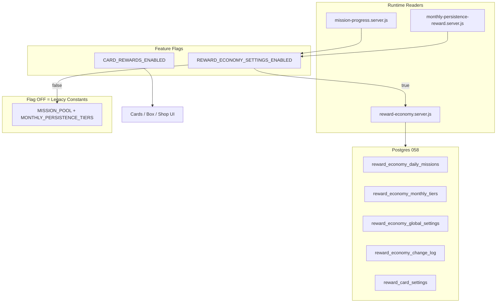

# תוכנית ביצוע — מערכת קלפים + כלכלת מטבעות

## הקשר קיים בפרויקט

| נושא | מצב נוכחי | השלכה לתוכנית |
|------|-----------|---------------|
| זהות ילד | `students.id` → `studentId` | ב-SQL: `student_id` (לא `child_id`) |
| מטבעות | RPC `arcade_coin_apply` דרך [`lib/arcade/server/arcade-coins.js`](lib/arcade/server/arcade-coins.js) | כל תנועה דרך `applyArcadeCoinMove` + ledgers |
| משימות יומיות | [`lib/learning-supabase/mission-progress.server.js`](lib/learning-supabase/mission-progress.server.js) — `MISSION_REWARD_COINS=20`, pool לפי grade band (`g12`/`g34`/`g56`) | **ברירת מחדל נשמרת**; כש-`REWARD_ECONOMY_SETTINGS_ENABLED=true` — קריאה מאדמין |
| התמדה חודשית | [`lib/learning-supabase/monthly-persistence-reward.server.js`](lib/learning-supabase/monthly-persistence-reward.server.js) — `MONTHLY_PERSISTENCE_TIERS` | **ברירת מחדל נשמרת**; כש-flag ON — קריאה מאדמין |
| תקרת דקות חודשית (UI) | [`data/reward-options.js`](data/reward-options.js) — `MONTHLY_MINUTES_TARGET=600` | ניתנת לעריכה באדמין (תקרת דקות + תקרת מטבעות) |
| עולם הילד | [`pages/student/home.js`](pages/student/home.js) | קופסה + אוסף — רק כש-`CARD_REWARDS_ENABLED=true` |
| Migrations | אחרון: `057` | קובץ חדש: **`058_card_rewards_system.sql`** |



---

## עקרון מרכזי — ברירת מחדל + שליטה מלאה

**לא משנים את ההתנהגות הקיימת כברירת מחדל.** מוסיפים שכבת הגדרות באדמין שמופעלת רק בדגל נפרד.

| מקור | ברירת מחדל (seed = קוד נוכחי) |
|------|-------------------------------|
| משימה יומית (g12) | 10 שאלות / 5 דקות / 1 מקצוע → **20 מטבעות** כל אחת |
| משימה יומית (g34/g56) | יעדים כמו ב-`MISSION_POOL` היום → **20 מטבעות** |
| התמדה חודשית | 100→10k, 250→30k, 400→60k, 600→100k |
| תקרת דקות חודשית | 600 |
| תקרת מטבעות חודשית | 100,000 (מדרגה עליונה) |

**כל שינוי באדמין משפיע רק קדימה** — לא retroactive על `coin_transactions` / פרסים שכבר ניתנו (idempotency keys קיימים: `mission_complete_*`, `monthly_persistence_*`).

---

## שלב 1 — דגלים ו-Guards

### 1.1 שני דגלים נפרדים

| דגל | ברירת מחדל | תפקיד |
|-----|------------|--------|
| `CARD_REWARDS_ENABLED` | `false` | קלפים, קופסה, חנות, כפילויות, אוסף |
| `REWARD_ECONOMY_SETTINGS_ENABLED` | `false` | קריאת משימות יומיות + התמדה חודשית מה-DB |

קובץ: `lib/rewards/reward-feature-flags.js`

```javascript
export function isCardRewardsEnabled() {
  return process.env.CARD_REWARDS_ENABLED === "true";
}
export function isRewardEconomySettingsEnabled() {
  return process.env.REWARD_ECONOMY_SETTINGS_ENABLED === "true";
}
```

עדכון [`.env.example`](.env.example) בלבד.

### 1.2 CARD_REWARDS — guard

- כשכבוי: אין UI קלפים/קופסה, אין student rewards APIs, אין achievement card grants
- Admin tabs 3–9 (קלפים ומטה) — מוסתרים; טאב "כלכלת מטבעות" **יכול** להיות זמין (ראו §6)

### 1.3 REWARD_ECONOMY — guard

- כשכבוי: [`mission-progress.server.js`](lib/learning-supabase/mission-progress.server.js) ו-[`monthly-persistence-reward.server.js`](lib/learning-supabase/monthly-persistence-reward.server.js) משתמשים **אך ורק** בקבועים הקשיחים הנוכחיים — **זהה ל-100% להיום**
- כשדולק: `getDailyMissionConfig()` / `getMonthlyPersistenceConfig()` מ-`reward-economy.server.js` (cache קצר)
- **לא** משנים דוח הורים, diagnosis, session coin cap (300/day)

### 1.4 וידוא "שני דגלים כבויים = אפס שינוי"

- Home, missions panel, persistence panel — זהים להיום
- אין קריאות DB economy כש-`REWARD_ECONOMY_SETTINGS_ENABLED=false`

---

## שלב 2 — SQL Migration (הכנה בלבד)

קובץ: **`supabase/migrations/058_card_rewards_system.sql`**

### 2.1 טבלאות כלכלת מטבעות (חדש)

| טבלה | שדות עיקריים |
|------|--------------|
| **`reward_economy_daily_missions`** | `mission_key`, `grade_band` (`g12`/`g34`/`g56`), `name_he`, `text_he`, `mission_type` (`questions`/`minutes`/`subjects`), `target_value`, `reward_coins`, `is_active`, `display_order` |
| **`reward_economy_monthly_tiers`** | `minutes_threshold`, `reward_coins`, `label_he`, `is_active`, `display_order` |
| **`reward_economy_global_settings`** | `monthly_minutes_cap` (600), `monthly_coins_cap` (100000), `updated_at` |
| **`reward_economy_change_log`** | `admin_user_id`, `setting_area`, `entity_key`, `field_name`, `old_value_json`, `new_value_json`, `created_at` |

Unique: `(mission_key, grade_band)` על daily missions.

### 2.2 Seed — ערכים זהים לקוד הנוכחי

**Daily (g12):**

```text
questions_10  → target 10,  reward 20, "ענה על 10 שאלות היום"
minutes_5     → target 5,   reward 20, "למד 5 דקות היום"
subjects_1    → target 1,   reward 20, "תרגל מקצוע אחד לפחות"
```

**Daily (g34/g56):** שורות תואמות ל-`MISSION_POOL` ב-[`mission-progress.server.js`](lib/learning-supabase/mission-progress.server.js) עם `reward_coins=20`.

**Monthly tiers:**

```text
100 → 10,000 | 250 → 30,000 | 400 → 60,000 | 600 → 100,000
```

**Global:** `monthly_minutes_cap=600`, `monthly_coins_cap=100000`.

### 2.3 טבלאות קלפים (ללא שינוי מהתוכנית המקורית)

`reward_card_settings`, `reward_card_series`, `reward_cards`, `student_reward_cards`, `reward_card_rules`, `surprise_box_state`, `surprise_box_openings`, `reward_card_transactions`, `reward_card_conversions` — כמו בתוכנית הקודמת.

Settings seed לקופסה/חנות/כפילויות: מחירים, משקלים 7800/1700/450/50, המרות, `box_interval_minutes=180`, וכו'.

### 2.4 RLS + אינדקסים

- RLS על כל הטבלאות; parent read-only היכן רלוונטי
- `reward_economy_change_log` — admin/service role בלבד
- אינדקסים על `grade_band`, `display_order`, `student_id`

---

## שלב 3 — תשתית שרת

### 3.1 מודול economy

קובץ: **`lib/rewards/server/reward-economy.server.js`**

| פונקציה | שימוש |
|---------|--------|
| `getDailyMissionsForGradeBand(band)` | mission-progress |
| `getMissionRewardCoins(missionKey, band)` | award |
| `getMonthlyPersistenceTiers()` | monthly-persistence + home UI |
| `getMonthlyGlobalCaps()` | progress bar + evaluation |
| `updateDailyMission(...)` / `updateMonthlyTier(...)` | admin API + **change log** |
| `logEconomyChange(adminUserId, ...)` | כל PUT מאדמין |

### 3.2 Refactor מינימלי (לא שינוי התנהגות)

**[`mission-progress.server.js`](lib/learning-supabase/mission-progress.server.js):**

```javascript
function resolveMissionPool(gradeBand) {
  if (!isRewardEconomySettingsEnabled()) return MISSION_POOL[gradeBand] ?? MISSION_POOL.g34;
  return getDailyMissionsForGradeBand(gradeBand); // same shape: id, textHe, type, target, rewardCoins
}
```

**[`monthly-persistence-reward.server.js`](lib/learning-supabase/monthly-persistence-reward.server.js):**

```javascript
function resolveMonthlyTiers() {
  if (!isRewardEconomySettingsEnabled()) return MONTHLY_PERSISTENCE_TIERS;
  return getMonthlyPersistenceTiers();
}
```

**[`studentHomeDashboardClient.js`](lib/learning-client/studentHomeDashboardClient.js):** tiers לתצוגה — מ-home-profile payload (server כבר שולח tiers מ-resolver).

### 3.3 כלל forward-only

- פרס משימה: idempotency `mission_complete_{studentId}_{date}_{missionId}` — סכום נשמר ב-transaction בזמן ההענקה
- פרס חודשי: `monthly_persistence_{studentId}_{YYYY-MM}` — אותו עיקרון
- שינוי reward_coins באדמין **לא** מעדכן transactions קיימים
- UI ילד: משימות שכבר הושלמו היום מציגות את הסכום שניתן בפועל (`coinAwarded` / `rewardCoins` ב-state)

### 3.4 מודול קלפים (ללא שינוי מהותי)

`reward-settings.server.js`, `reward-shop.server.js`, `surprise-box.server.js`, `duplicate-conversion.server.js`, `achievement-evaluator.server.js`, `reward-coins.server.js` — כמו בתוכנית המקורית.

### 3.5 APIs — Admin (הרחבה)

תחת `pages/api/admin/rewards/`:

| Route | תוכן |
|-------|------|
| `GET/PUT economy/daily-missions` | CRUD משימות + change log |
| `GET/PUT economy/monthly-tiers` | מדרגות + change log |
| `GET/PUT economy/global-settings` | תקרות דקות/מטבעות |
| `GET economy/change-log` | היסטוריית שינויים (pagination) |
| settings, cards, series | כמו קודם |

כל PUT economy: validate → write → `logEconomyChange` → return new state.

---

## שלב 4 — נכסים (קלפים)

ללא שינוי — `public/rewards/cards/...`, placeholders, `rewards-ui.he.js`.

---

## שלב 5 — UI ילד

ללא שינוי מהותי — קופסה, `/student/cards`, guards על `CARD_REWARDS_ENABLED`.

**משימות / התמדה:** UI קיים ([`StudentDailyMissionsPanel.js`](components/student/StudentDailyMissionsPanel.js), [`StudentMonthlyPersistencePanel.js`](components/student/StudentMonthlyPersistencePanel.js)) ממשיך להציג נתונים מ-home-profile — שמגיעים מה-resolver (legacy או DB).

---

## שלב 6 — Admin UI

### 6.1 טאבים (9)

`pages/admin/rewards/index.js` + `AdminRewardsShell.jsx`:

1. **הגדרות כלליות** — `CARD_REWARDS` system_enabled, קופסה (interval, first box)
2. **כלכלת מטבעות** — שליטה מלאה על כל מקורות מטבעות:
   - **משימות יומיות** — לפי grade band: שם, יעד, מטבעות, פעיל, סדר, טקסט לילד
   - **התמדה חודשית** — מדרגות: דקות, מטבעות, שם לילד, פעיל, סדר; תקרות גלובליות
   - **קופסת הפתעה** — סכומי מטבעות + משקלים (או קישור/תת-סקשן לטאב 5)
   - **חנות קלפים** — מחירי נדירות (או קישור לטאב 6)
   - **המרת כפילויות** — threshold + ערכים (או קישור לטאב 7)
   - **יומן שינויים** — טבלה: מי / מה / ערך קודם / ערך חדש / מתי
3. קלפים
4. סדרות
5. קופסת הפתעה (פרטים: סיכויי נדירות, prevent duplicate)
6. חנות (מחיר per-card override)
7. כפילויות
8. אירועים
9. בדיקות

### 6.2 נראות Admin

- `/admin/rewards` זמין כש-**`CARD_REWARDS_ENABLED=true` OR `REWARD_ECONOMY_SETTINGS_ENABLED=true`**
- מאפשר להגדיר economy לפני הפעלת קלפים
- טאבים 3–9 מוסתרים כש-`CARD_REWARDS_ENABLED=false`; טאבים 1–2 + economy נגישים

### 6.3 UX

- RTL, עברית, ללא scroll אופקי
- כפתור שמירה → change log אוטומטי
- אזהרה: "שינוי יחול על פרסים עתידיים בלבד"

---

## שלב 7 — קלפי הישג

ללא שינוי — hooks ב-session/finish, home-profile, parent-activity; רק כש-`CARD_REWARDS_ENABLED=true`.

---

## שלב 8 — בדיקות

### 8.1 שני דגלים כבויים

```text
משימות = 20 מטבעות (legacy constants)
התמדה = 100/250/400/600 (legacy tiers)
אין קלפים / קופסה / economy DB reads
```

### 8.2 REWARD_ECONOMY בלבד ON

- seed defaults = זהה ל-legacy (A/B על home)
- שינוי באדמין (למשל 250→40k) — רק award **חדש** משתמש בערך החדש
- change log נרשם
- ילד שכבר קיבל 30k — לא משתנה

### 8.3 CARD_REWARDS ON

- כל בדיקות קופסה / חנות / כפילויות / עברית / mobile מהמפרט המקורי

### 8.4 Build

- `npm run build`
- truth-gates reward — לא נשבר

---

## מפת קבצים (עדכון)

```text
lib/rewards/
  reward-feature-flags.js          # שני דגלים
  rewards-ui.he.js
  server/
    reward-economy.server.js       # חדש
    reward-settings.server.js
    ... (קלפים)
lib/learning-supabase/
  mission-progress.server.js       # refactor: resolveMissionPool
  monthly-persistence-reward.server.js  # refactor: resolveMonthlyTiers
pages/api/admin/rewards/economy/
components/admin/rewards/
  AdminEconomyTab.jsx              # חדש
  AdminEconomyChangeLog.jsx        # חדש
supabase/migrations/058_card_rewards_system.sql
```

## נקודות עצירה

1. **SQL:** המשתמש מריץ `058` ידנית
2. **Economy:** `REWARD_ECONOMY_SETTINGS_ENABLED=true` רק אחרי אימות seed = legacy
3. **Cards:** `CARD_REWARDS_ENABLED=true` רק אחרי אימות מלא

## סיכונים

| סיכון | mitigation |
|-------|------------|
| שינוי economy שובר missions | flag OFF = legacy path; tests A/B |
| grade bands שונים (g12≠g34) | seed לכל band; admin UI מסונן לפי band |
| retroactive coins | idempotency + forward-only rule + change log |
| שני דגלים מבלבלים | תיעוד ב-.env.example; admin מציג מצב דגלים |
