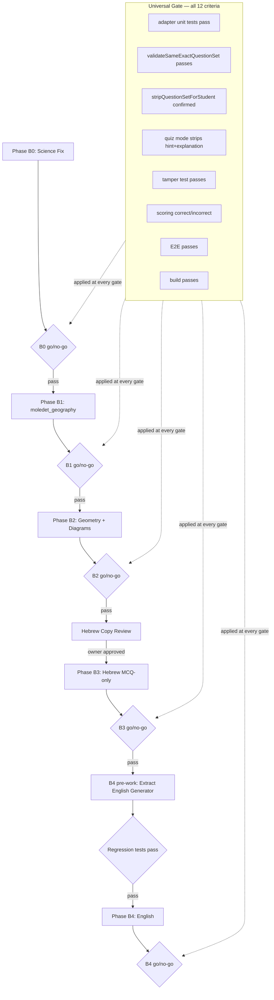

# All Subjects Classroom Activities — Final Implementation Plan

## Hard Decisions (locked)

These are not open questions. They define the rules for every phase below.

**D1 — Science is a B0 blocker.**
No new subject may be enabled until Science grade filtering, difficulty filtering, topic normalization, shuffle, and dedup are fixed and tested. Science regressions in Phase A are production bugs, not future work.

**D2 — Canonical subject key for Moledet/Geography is `moledet_geography` (underscore).**
Confirmed from `LEARNING_SUBJECT_ALLOWLIST` (`lib/learning-supabase/learning-activity.js`), `REPORT_SUBJECTS` and `SUBJECT_LABEL_HE` (`lib/teacher-portal/teacher-ui.he.js`). The hyphenated form `moledet-geography` is used only in URL slugs, npm script names, and file paths — never in subject keys passed through APIs or allowlists. All classroom activities code, adapter, tests, and UI gate must use `moledet_geography`.

**D3 — Strict sequential phases: B0 → B1 → B2 → B3 → B4.**
No phase starts until the prior phase passes its full acceptance checklist and build.

**D4 — Subject gate rule.**
A subject key may be added to `ACTIVITY_PREVIEW_SUPPORTED_SUBJECTS` and the teacher dropdown only after all ten acceptance criteria in the gate checklist below pass. No exceptions.

**D5 — Hebrew typing-mode items are excluded from Phase B3.**
The safest default. Classroom activities for Hebrew will be MCQ-only in Phase B3. Items with `answerMode === "typing"` or `preferredAnswerMode === "typing"` are filtered out by the adapter before the question set is built. Typing-mode classroom activities are a separate future phase (B3+) requiring `acceptedAnswers` server-side scoring and student UI changes.

**D6 — Geometry Phase B2 includes diagram rendering in the student activity player.**
Geometry questions for topics such as `area`, `perimeter`, `circles`, `pythagoras`, and `triangles` reference shapes that are meaningless without a diagram. Shipping geometry classroom activities without diagrams would produce an incomplete, confusing student experience. Phase B2 must therefore include a geometry-aware render path in the student activity player. If diagram rendering cannot be completed safely within Phase B2 scope, geometry is deferred entirely to a later phase — there is no text-only geometry shortcut.

**D7 — English is Phase B4, always separate.**
The English generator lives inside `pages/learning/english-master.js`. Extraction to `utils/english-question-generator.js` is required before an adapter can be written. This extraction must include regression tests proving that `english-master.js` behavior is unchanged. English is the largest phase and must not be bundled with any other subject.

**D8 — No Hebrew UI copy changes without owner approval.**
No Hebrew text for new subject labels, topic dropdown options, or error messages may be added or changed without explicit owner sign-off. A copy review is a hard pre-gate for Phase B3. This does not block B0, B1, or B2.

**D9 — No SQL unless explicitly required.**
If a migration is needed, write the migration file and stop for owner approval. Do not execute SQL. Based on current analysis, no schema changes are required for any phase — `question_set jsonb` already supports all new subject formats.

**D10 — No placeholder questions, no fallback questions.**
Every adapter must throw a clear, specific error if it cannot generate the requested number of real questions for the given grade/topic/difficulty. No silent fallback to the full bank, no cycling, no placeholders.

---

## Universal Go/No-Go Gate Checklist

Every phase (B0 through B4) must pass all applicable items before the subject key is enabled in production:

1. Adapter unit tests pass: generates exactly N items for valid grade+topic+difficulty
2. Every generated item passes `validateSameExactQuestionSet` server-side
3. Every generated item has a non-empty `question` string
4. Every generated item has a non-null, non-empty `correctAnswer` string
5. MCQ items: `choices` array contains `correctAnswer` as one of the options
6. `stripQuestionSetForStudent` removes `correctAnswer` from student payload (confirmed by test)
7. Quiz mode: `hint` and `explanation` absent from student start payload (confirmed by test)
8. Tamper test: student submitting `correctAnswer` in request body is ignored by scoring route
9. Server scores correct answer as `isCorrect: true`, wrong answer as `isCorrect: false`
10. `npm run build` passes with no new errors or warnings
11. E2E: teacher preview → save draft → student start → student answer → student submit flow completes
12. No placeholder fallback path exists in the adapter (verified by code review)

---

## Phase B0 — Science Quality Fix (blocker for all other phases)

**Estimated complexity: Small**
**Estimated time: 1 day**
**SQL required: No**

### What is broken today

The existing science adapter in `generate-activity-questions-client.js` (lines 106–153):
- Ignores `gradeLevel` entirely — passes it through but never filters `q.grades`
- Ignores `difficulty` — never checks `q.minLevel` / `q.maxLevel`
- Uses `source[i % source.length]` — deterministic cycling, produces duplicates for small N
- Topic filtering is a substring match with silent fallback to the full bank
- Hebrew topic label strings from teacher UI do not map to bank `topic` keys (teacher types "גופנו" but bank key is `body`)

### Files changed in B0

- [`lib/classroom-activities/generate-activity-questions-client.js`](lib/classroom-activities/generate-activity-questions-client.js) — science branch rewrite
- [`tests/classroom-activities/classroom-activities-shared.test.mjs`](tests/classroom-activities/classroom-activities-shared.test.mjs) — add Science-specific tests

### Exact changes

**1. Add grade filter:**
```javascript
const gradeKey = normalizeGradeKey(gradeLevel); // already exists for math
const filtered = pool.filter((q) => {
  if (!Array.isArray(q.grades) || !q.grades.includes(gradeKey)) return false;
  // topic filter (see below)
  // difficulty filter (see below)
  return true;
});
```

**2. Add difficulty filter** (mirror `levelAllowed` from `pages/learning/science-master.js`):
```javascript
const LEVEL_ORDER = { easy: 0, medium: 1, hard: 2 };
function scienceLevelAllowed(q, levelKey) {
  const min = LEVEL_ORDER[q.minLevel] ?? 0;
  const max = LEVEL_ORDER[q.maxLevel] ?? 2;
  const target = LEVEL_ORDER[String(levelKey || "medium")] ?? 1;
  return target >= min && target <= max;
}
```

**3. Add topic normalization map** (Hebrew UI label → bank `topic` key):
```javascript
const SCIENCE_TOPIC_MAP = {
  "גוף": "body", "גופנו": "body",
  "בעלי חיים": "animals", "חיות": "animals",
  "צמחים": "plants",
  "חומרים": "materials",
  "ניסויים": "experiments",
  "כדור הארץ": "earth_space", "חלל": "earth_space",
  "סביבה": "environment",
};
function normalizeScienceTopic(raw) {
  const t = String(raw || "").toLowerCase().trim();
  return SCIENCE_TOPIC_MAP[t] || t; // pass through if already an English key
}
```

**4. Replace cycling with shuffle + dedup:**
```javascript
const shuffled = [...source].sort(() => Math.random() - 0.5);
const seen = new Set();
for (const q of shuffled) {
  const key = `${q.stem || q.question}|${q.correctAnswer || q.options?.[q.correctIndex]}`;
  if (seen.has(key)) continue;
  seen.add(key);
  questions.push({ /* frozen item */ });
  if (questions.length >= n) break;
}
```

**5. Throw on insufficient questions** (no fallback to full bank):
```javascript
if (questions.length < n) {
  throw new Error(`אין מספיק שאלות מדע עבור כיתה ${gradeKey} נושא ${topic} רמה ${difficulty}`);
}
```

### B0 Tests to add

In `tests/classroom-activities/classroom-activities-shared.test.mjs`:

- Science preview for g1 `body` `easy` returns only items where `q.grades.includes("g1")`
- Science preview for g4 `animals` `hard` returns only items where `maxLevel >= hard`
- Science preview topic `"גופנו"` normalizes to bank key `body`
- Science preview for g1 `experiments` `hard` throws (thin pool — not enough items)
- No two returned items have identical `question|correctAnswer` fingerprint
- Each returned item: `choices` is an array, `choices.includes(correctAnswer)` is true
- Each returned item passes `validateSameExactQuestionSet`

### B0 Acceptance Criteria

All 12 gate checklist items apply to Science. Additionally:
- `npm run qa:science:runtime-gate` passes (existing script)
- Grade-filtered test confirms no cross-grade leakage

---

## Phase B1 — Moledet-Geography

**Estimated complexity: Small**
**Estimated time: 1–2 days**
**SQL required: No**
**Depends on: B0 complete**

### Subject key: `moledet_geography`

This is the only form used in `LEARNING_SUBJECT_ALLOWLIST`, `REPORT_SUBJECTS`, and `SUBJECT_LABEL_HE`. All new code must use `moledet_geography`. The adapter receives `sub === "moledet_geography"` and stores `subject: "moledet_geography"` in frozen items.

### Source

- Bank: [`data/geography-questions/g1.js`](data/geography-questions/g1.js) … `g6.js` (~617 items per grade, 3,506 total)
- Generator: [`utils/moledet-geography-question-generator.js`](utils/moledet-geography-question-generator.js) — exposes `listTopicQuestionsForGradeLevel(gradeKey, levelKey, topicKey)` which returns `{ items, emptyPool: boolean }`
- Curriculum: [`data/moledet-geography-curriculum.js`](data/moledet-geography-curriculum.js)
- Grade-topic policy: [`utils/moledet-geography-grade-topic-policy.js`](utils/moledet-geography-grade-topic-policy.js)

### Topic keys (canonical, from `utils/moledet-geography-constants.js`)

`homeland`, `community`, `citizenship`, `geography`, `values`, `maps`, `mixed`

### Adapter design

```javascript
if (sub === "moledet_geography") {
  const { listTopicQuestionsForGradeLevel } = await import(
    "../../utils/moledet-geography-question-generator.js"
  );
  const gradeKey = normalizeGradeKey(gradeLevel);
  const levelKey = String(difficulty || "medium").toLowerCase();
  const topicKey = normalizeMoledettGeographyTopic(topic); // Hebrew → key map
  const result = listTopicQuestionsForGradeLevel(gradeKey, levelKey, topicKey);
  if (result.emptyPool) {
    throw new Error(`אין שאלות מולדת וגאוגרפיה עבור כיתה ${gradeKey} נושא ${topicKey} רמה ${levelKey}`);
  }
  const shuffled = [...result.items].sort(() => Math.random() - 0.5);
  const seen = new Set();
  const questions = [];
  for (const q of shuffled) {
    const answers = Array.isArray(q.answers) ? q.answers : [];
    const correctAnswer = answers[q.correct] != null ? String(answers[q.correct]) : null;
    if (!q.question || !correctAnswer) continue;
    const key = `${q.question}|${correctAnswer}`;
    if (seen.has(key)) continue;
    seen.add(key);
    questions.push({
      question: String(q.question),
      correctAnswer,
      choices: answers,
      subject: "moledet_geography",
      topic: topicKey,
      gradeLevel: gradeKey,
      difficulty: levelKey,
      skillKey: q.skillId || undefined,
      params: { subtype: q.subtype, cognitiveLevel: q.cognitiveLevel },
    });
    if (questions.length >= n) break;
  }
  if (questions.length < n) {
    throw new Error(`אין מספיק שאלות מולדת וגאוגרפיה — נסו נושא, כיתה, או רמה אחרת`);
  }
  return questions;
}
```

Topic normalization map (Hebrew UI label → canonical key):
```javascript
const MOLEDET_TOPIC_MAP = {
  "מולדת": "homeland",
  "קהילה": "community",
  "אזרחות": "citizenship",
  "גאוגרפיה": "geography",
  "ערכים": "values",
  "מפות": "maps",
  "ערבוב": "mixed",
};
```

### Teacher UI — topic dropdown for moledet_geography

When subject === `moledet_geography`, replace the free-text topic input with a `<select>` populated from `MOLEDET_TOPIC_MAP` keys. The Hebrew label is already the map key. Do not add new Hebrew copy — these are existing labels from the curriculum.

**Copy gate**: These topic labels come directly from `utils/moledet-geography-constants.js` and are not new text. No owner approval needed for B1. Owner approval is required only for B3 (Hebrew subject labels).

### Files changed in B1

- [`lib/classroom-activities/classroom-activities-preview.js`](lib/classroom-activities/classroom-activities-preview.js) — add `"moledet_geography"` to `ACTIVITY_PREVIEW_SUPPORTED_SUBJECTS`
- [`lib/classroom-activities/generate-activity-questions-client.js`](lib/classroom-activities/generate-activity-questions-client.js) — add `moledet_geography` adapter branch
- [`pages/teacher/class/[classId]/activities/new.js`](pages/teacher/class/[classId]/activities/new.js) — subject-aware topic dropdown for `moledet_geography`
- `tests/classroom-activities/generate-moledet-geography-activity-questions.test.mjs` — NEW

### B1 Tests

**Adapter unit tests** (`generate-moledet-geography-activity-questions.test.mjs`):
- Generates N=5 items for g3 `homeland` `easy` — all pass `validateSameExactQuestionSet`
- Generates N=5 items for g5 `geography` `hard` — all have `choices` array
- Each item: `choices.includes(correctAnswer)` is true
- Each item: `subject === "moledet_geography"`
- Empty pool: g1 `maps` `hard` (thin) throws with Hebrew error message (no fallback)
- Dedup: N=10 items from g4 `citizenship` `medium` — no two share `question|correctAnswer`
- Unsupported subject key `"moledet-geography"` is rejected by `isActivityPreviewSubjectSupported`

**Scoring tests** (extend `classroom-activities-shared.test.mjs`):
- `stripQuestionSetForStudent` removes `correctAnswer` from moledet item
- Quiz mode removes `explanation` (absent in bank) and `hint` (absent) — no regression
- `answersMatch` scores correct MCQ choice correctly for Hebrew string answer
- `answersMatch` rejects wrong choice

**E2E** (extend `tests/e2e/teacher-activities.spec.ts`):
- Teacher selects `moledet_geography`, topic `homeland`, grade `g4`, difficulty `easy`
- Preview renders 5 visible questions, each with Hebrew text and 4 choices
- Save draft succeeds, returns `activityId`
- Student start: `correctAnswer` absent from payload
- Student answers correctly: `isCorrect: true`
- Student answers incorrectly: `isCorrect: false`

### B1 Acceptance Criteria

All 12 universal gate checklist items, plus:
- Subject key `moledet_geography` (underscore) used consistently in frozen items, API, and tests
- `npm run qa:moledet-geography:runtime-gate` passes (existing script)
- Topic dropdown shows Hebrew labels from curriculum constants (no new copy invented)

---

## Phase B2 — Geometry

**Implementation status (2026-05-25):** **GO — owner approved.** Adapter + student diagram renderer + security same-origin Bearer gate. Verified: `tests/security/same-origin.test.mjs` 12/12; geometry unit 8/8; shared 25/25; Playwright `@geometry-b2` 8/8 (incl. SVG); `@science-b0|@moledet-b1` 14/14; `npm run build` PASS. Root cause of earlier E2E failure was `cross_origin` (not SQL/024); fixed in `lib/security/same-origin.js`. **Next phase (B3/B4): blocked until explicit owner approval.**

**Estimated complexity: Medium**
**Estimated time: 3–4 days**
**SQL required: No**
**Depends on: B1 complete**

### Decision: Diagram rendering is included in B2

Geometry is not enabled without diagram support in the student activity player. Questions referencing `area`, `perimeter`, `circles`, `triangles`, `pythagoras`, and similar topics are meaningless without the shape diagram. If diagram rendering cannot be completed safely within B2 scope, geometry is deferred — there is no partial or text-only geometry option.

### Source

- Procedural generator: [`utils/geometry-question-generator.js`](utils/geometry-question-generator.js) — `generateQuestion(levelConfig, topic, gradeKey, options)`
- Conceptual bank: [`utils/geometry-conceptual-bank.js`](utils/geometry-conceptual-bank.js) — 52 templates
- Constants: [`utils/geometry-constants.js`](utils/geometry-constants.js) — `GRADES`, `TOPICS`, `LEVELS`
- Grade-topic policy: [`utils/geometry-grade-topic-policy.js`](utils/geometry-grade-topic-policy.js)
- Explanations: [`utils/geometry-explanations.js`](utils/geometry-explanations.js) — keyed by `topic`/`kind`
- Diagram spec: [`utils/geometry-diagram-spec.js`](utils/geometry-diagram-spec.js) — `getGeometryDiagramSpec(params, shape, topic)`
- Diagram component: [`components/learning/geometry/GeometryExplanationDiagram.jsx`](components/learning/geometry/GeometryExplanationDiagram.jsx)
- Student player: [`pages/student/activity/[activityId].js`](pages/student/activity/[activityId].js)

### Adapter design

**correctAnswer normalization** — geometry has three answer types; all must be normalized to a string:
- Numeric answers: `String(16)` → `"16"` (scored with numeric tolerance by `answersMatch`)
- Hebrew label answers: `"שטח"`, `"היקף"` — already strings
- Index-string answers `"1"`…`"6"` — these are rare conceptual items; the adapter should verify that the stem text defines the mapping; if not verifiable, skip the item and regenerate

```javascript
if (sub === "geometry") {
  const { generateQuestion } = await import("../../utils/geometry-question-generator.js");
  const { getExplanationForQuestion } = await import("../../utils/geometry-explanations.js");
  const { GRADES, LEVELS, TOPICS } = await import("../../utils/geometry-constants.js");
  const gradeKey = normalizeGradeKey(gradeLevel);
  const topicKey = normalizeGeometryTopic(topic, gradeKey, GRADES, TOPICS);
  const levelConfig = { ...LEVELS[String(difficulty || "medium")] };
  const questions = [];
  const seen = new Set();
  let attempts = 0;
  while (questions.length < n && attempts < n * 40) {
    attempts++;
    const q = generateQuestion(levelConfig, topicKey, gradeKey, {});
    if (!q?.question || q.correctAnswer == null) continue;
    if (q.noQuestion) continue; // topic not valid for grade
    const correctAnswer = String(q.correctAnswer);
    const key = `${q.question}|${correctAnswer}`;
    if (seen.has(key)) continue;
    seen.add(key);
    const choices = Array.isArray(q.answers) ? q.answers.map(String) : undefined;
    if (choices && !choices.includes(correctAnswer)) continue; // safety check
    const explanation = getExplanationForQuestion(q) || undefined;
    questions.push({
      question: String(q.question),
      correctAnswer,
      choices,
      explanation,
      subject: "geometry",
      topic: topicKey,
      gradeLevel: gradeKey,
      difficulty: String(difficulty || "medium"),
      skillKey: q.params?.diagnosticSkillId || undefined,
      params: {
        kind: q.params?.kind,
        shape: q.shape || undefined,
        patternFamily: q.params?.patternFamily,
        subtype: q.params?.subtype,
        // numeric params for diagram reconstruction
        side: q.params?.side,
        base: q.params?.base,
        height: q.params?.height,
        radius: q.params?.radius,
        a: q.a,
        b: q.b,
      },
    });
  }
  if (questions.length < n) {
    throw new Error(`אין מספיק שאלות גיאומטריה עבור כיתה ${gradeKey} נושא ${topicKey} רמה ${difficulty}`);
  }
  return questions;
}
```

### Student player diagram render path

In [`pages/student/activity/[activityId].js`](pages/student/activity/[activityId].js), add a geometry-aware question renderer:

```jsx
// If question.subject === "geometry" and question.params?.kind exists:
// Render GeometryExplanationDiagram with q.params before the question text.
// The diagram is part of the question display, not the explanation.
// The explanation (if any) is shown post-submit and in guided_practice mode only —
// this is already handled by stripQuestionSetForStudent and the existing quiz gate.
```

The `GeometryExplanationDiagram` component receives the frozen `params` object and `shape` string. It is a read-only SVG renderer; exposing it to students is safe (it does not reveal the answer).

### Files changed in B2

- [`lib/classroom-activities/classroom-activities-preview.js`](lib/classroom-activities/classroom-activities-preview.js) — add `"geometry"`
- [`lib/classroom-activities/generate-activity-questions-client.js`](lib/classroom-activities/generate-activity-questions-client.js) — add `geometry` adapter branch
- [`pages/teacher/class/[classId]/activities/new.js`](pages/teacher/class/[classId]/activities/new.js) — geometry topic dropdown from `GRADES[gradeKey].topics`
- [`pages/student/activity/[activityId].js`](pages/student/activity/[activityId].js) — geometry diagram render path
- `tests/classroom-activities/generate-geometry-activity-questions.test.mjs` — NEW

### B2 Tests

**Adapter unit tests**:
- Generates N=5 for g3 `area` `easy` — all have `choices`, `choices.includes(correctAnswer)`
- Generates N=5 for g6 `pythagoras` `hard` — all pass `validateSameExactQuestionSet`
- Each item: `params.kind` is non-null
- Each item: `subject === "geometry"`
- Topic not valid for grade (e.g., g1 `pythagoras`) throws with clear error, no fallback
- Dedup: N=10 for g4 `perimeter` `medium` — no two share `question|correctAnswer`
- Index-string correctAnswer items (if any reach the frozen set) — verify `choices.includes(correctAnswer)` is true; otherwise they are filtered

**Diagram render test**:
- Snapshot test (or Playwright): student activity player renders an SVG element for a geometry question with `params.kind` and `params.shape`
- Diagram SVG does not contain the `correctAnswer` string

**Scoring tests** (extend shared test file):
- `stripQuestionSetForStudent` removes `correctAnswer` from geometry item
- Quiz mode removes `explanation` (if present)
- `answersMatch("16", "16")` is true (numeric string match)
- `answersMatch("16.0", "16")` is true (numeric tolerance)
- `answersMatch("שטח", "שטח")` is true (Hebrew string match)
- `answersMatch("היקף", "שטח")` is false

### B2 Acceptance Criteria

All 12 universal gate items, plus:
- Student activity player renders a geometry diagram for a frozen geometry question
- Diagram does not appear in quiz mode until after submit (explanation gate applies)
- `npm run build` with no new React import/component errors

---

## Phase B3 — Hebrew

**Estimated complexity: Medium-Large**
**Estimated time: 3–5 days**
**SQL required: No**
**Depends on: B2 complete**
**Pre-gate: Hebrew UI copy review (owner approval)**

### Pre-gate: Copy Review

Before Phase B3 begins, the owner must approve the Hebrew-language labels for the Hebrew subject topic dropdown in the teacher UI. The six topic keys (`reading`, `comprehension`, `grammar`, `vocabulary`, `writing`, `speaking`) map to existing Hebrew labels in `data/hebrew-curriculum.js`. No new copy may be invented. The owner must confirm these labels are acceptable as displayed in the teacher dropdown.

### Decision: Typing-mode items excluded

Hebrew items with `answerMode === "typing"` or `preferredAnswerMode === "typing"` are filtered out by the adapter before building the question set. This applies to all typing-mode subtopics in g1–g2 (`g1.spell_word_choice`, `g2.sentence_wellformed`, `g2.punctuation_choice`, etc.) and any higher-grade typing variants. The classroom activity for Hebrew is MCQ-only in Phase B3. Typing-mode support is a future phase (B3+) that requires `acceptedAnswers` server-side scoring, student UI changes, and its own test suite.

### Source

- Generator (standalone util): [`utils/hebrew-question-generator.js`](utils/hebrew-question-generator.js) — `generateQuestion(gradeKey, levelKey, topic)` returns runtime question object
- Rich bank: [`utils/hebrew-rich-question-bank.js`](utils/hebrew-rich-question-bank.js) (54 items, merged by generator)
- G3 reading bank: [`data/hebrew-g3-reading-bank.js`](data/hebrew-g3-reading-bank.js) (46 items, merged by generator)
- Archive NOT used: `data/hebrew-questions/g1-g6.js` — explicitly excluded; these files must not be imported by the adapter
- Constants: [`utils/hebrew-constants.js`](utils/hebrew-constants.js)
- Curriculum: [`data/hebrew-curriculum.js`](data/hebrew-curriculum.js)

### Adapter design

The generator already resolves `correct` index → `correctAnswer` string and `answers[]` as choices. The adapter calls it in a loop, filters out typing-mode outputs, deduplicates, and snapshots.

```javascript
if (sub === "hebrew") {
  const { generateQuestion } = await import("../../utils/hebrew-question-generator.js");
  const gradeKey = normalizeGradeKey(gradeLevel);
  const levelKey = String(difficulty === "mixed" ? "medium" : (difficulty || "medium")).toLowerCase();
  const topicKey = normalizeHebrewTopic(topic); // Hebrew label → key
  const questions = [];
  const seen = new Set();
  let attempts = 0;
  while (questions.length < n && attempts < n * 40) {
    attempts++;
    const q = generateQuestion(gradeKey, levelKey, topicKey);
    if (!q?.question || !q.correctAnswer) continue;
    // Exclude typing-mode items
    if (q.answerMode === "typing" || q.params?.answerMode === "typing") continue;
    const choices = Array.isArray(q.answers) ? q.answers : undefined;
    if (!choices || !choices.includes(q.correctAnswer)) continue; // safety
    const key = `${q.question}|${q.correctAnswer}`;
    if (seen.has(key)) continue;
    seen.add(key);
    questions.push({
      question: String(q.question),
      correctAnswer: String(q.correctAnswer),
      choices,
      subject: "hebrew",
      topic: topicKey,
      gradeLevel: gradeKey,
      difficulty: levelKey,
      skillKey: q.params?.diagnosticSkillId || undefined,
      params: {
        gradeKey,
        levelKey,
        patternFamily: q.params?.patternFamily,
        subtype: q.params?.subtype,
        answerMode: "choice", // always MCQ in Phase B3
      },
    });
  }
  if (questions.length < n) {
    throw new Error(`אין מספיק שאלות עברית (MCQ) עבור כיתה ${gradeKey} נושא ${topicKey} רמה ${levelKey}`);
  }
  return questions;
}
```

Topic normalization map (Hebrew UI label → generator key):
```javascript
const HEBREW_TOPIC_MAP = {
  "קריאה": "reading",
  "הבנת הנקרא": "comprehension",
  "דקדוק": "grammar",
  "אוצר מילים": "vocabulary",
  "כתיבה": "writing",
  "דיבור": "speaking",
  "ערבוב": "mixed",
};
```

### Teacher UI — topic dropdown for hebrew

Subject-aware `<select>` for Hebrew with the 6 topics above. These labels are from `data/hebrew-curriculum.js` and are subject to the copy review pre-gate.

### Files changed in B3

- [`lib/classroom-activities/classroom-activities-preview.js`](lib/classroom-activities/classroom-activities-preview.js) — add `"hebrew"`
- [`lib/classroom-activities/generate-activity-questions-client.js`](lib/classroom-activities/generate-activity-questions-client.js) — add `hebrew` adapter branch
- [`pages/teacher/class/[classId]/activities/new.js`](pages/teacher/class/[classId]/activities/new.js) — Hebrew topic dropdown (requires copy approval)
- `tests/classroom-activities/generate-hebrew-activity-questions.test.mjs` — NEW

### B3 Tests

**Adapter unit tests**:
- Generates N=5 for g2 `vocabulary` `easy` — all MCQ (no typing-mode items in result)
- Generates N=5 for g4 `reading` `medium` — all pass `validateSameExactQuestionSet`
- Each item: `choices.includes(correctAnswer)` is true
- Each item: `params.answerMode === "choice"`
- Typing-mode filter: if generator returns a typing-mode item, it is excluded and regeneration continues
- Empty pool (topic not active for grade) throws Hebrew error with no fallback
- Dedup: N=10 for g5 `grammar` `hard` — no two items share `question|correctAnswer`
- Archive bank: confirmed that `data/hebrew-questions/g1.js` is NOT imported anywhere in the adapter path

**Scoring tests** (extend shared test file):
- `stripQuestionSetForStudent` removes `correctAnswer` from Hebrew item
- Quiz mode removes `explanation` (absent in Hebrew items — no regression)
- `answersMatch("ילד", "ילד")` is true (Hebrew string, case-insensitive)
- `answersMatch("ילדה", "ילד")` is false

### B3 Acceptance Criteria

All 12 universal gate items, plus:
- Copy review sign-off obtained before topic dropdown ships
- No typing-mode item survives to a frozen `question_set` (enforced by adapter filter + test)
- Archive bank files not reachable from adapter (import graph verified)

---

## Phase B4 — English

**Estimated complexity: Large**
**Estimated time: 5–7 days**
**SQL required: No**
**Depends on: B3 complete**

### Pre-work: Generator Extraction

The English `generateQuestion` function and all its helpers (`resolveEnglishQType`, `buildEnglishMcqOptions`, `englishPoolItemAllowedWithClassSplit`, etc.) are currently embedded in [`pages/learning/english-master.js`](pages/learning/english-master.js). Before writing the adapter, these must be moved to a new file `utils/english-question-generator.js`. The extraction must:

1. Move only the generator logic — no UI, no React hooks, no state
2. Update `english-master.js` to import from the new file
3. Add a unit test proving that the extracted generator returns identical output for the same seed inputs as the original (behavior parity test)
4. `npm run build` must pass
5. The existing `english-master.js` page must be regression-tested (Playwright or unit test)

No adapter is written until the extraction is complete and tested.

### Source (after extraction)

- Generator: `utils/english-question-generator.js` (NEW — extracted)
- Grammar pools: [`data/english-questions/grammar-pools.js`](data/english-questions/grammar-pools.js) (~617 items)
- Sentence pools: [`data/english-questions/sentence-pools.js`](data/english-questions/sentence-pools.js) (~229 items)
- Translation pools: [`data/english-questions/translation-pools.js`](data/english-questions/translation-pools.js) (~172 phrase pairs — no `options` field)
- Word lists: [`data/english-questions/word-lists.js`](data/english-questions/word-lists.js) (~722 entries)
- Curriculum: [`data/english-curriculum.js`](data/english-curriculum.js)
- Grade-topic policy: [`utils/english-grade-topic-policy.js`](utils/english-grade-topic-policy.js)

### Translation / vocabulary MCQ pre-expansion

Translation pool rows have no `options` field — the generator builds MCQ distractors at runtime from word list pools. The adapter must pre-expand these at preview time, snapshotting the full question+choices into the frozen `question_set`. This is not a schema change — the frozen item stores `choices: [...]` exactly like grammar items. The distractor expansion logic is already in `english-master.js`; it moves to `english-question-generator.js` as part of the extraction.

Vocabulary items are similar: a random word pair is selected and distractors are built from the same word list. The adapter snapshots the result.

### Adapter design (after extraction)

```javascript
if (sub === "english") {
  const { generateQuestion } = await import("../../utils/english-question-generator.js");
  const gradeKey = normalizeGradeKey(gradeLevel);
  const levelKey = String(difficulty || "medium").toLowerCase();
  const topicKey = normalizeEnglishTopic(topic);
  const questions = [];
  const seen = new Set();
  let attempts = 0;
  while (questions.length < n && attempts < n * 40) {
    attempts++;
    const q = generateQuestion(gradeKey, levelKey, topicKey);
    if (!q?.question || !q.correctAnswer) continue;
    const choices = Array.isArray(q.answers) ? q.answers : undefined;
    // All English classroom items must be MCQ (no typing/writing mode)
    if (!choices || !choices.includes(q.correctAnswer)) continue;
    const key = `${q.question}|${q.correctAnswer}`;
    if (seen.has(key)) continue;
    seen.add(key);
    questions.push({
      question: String(q.question),
      correctAnswer: String(q.correctAnswer),
      choices,
      explanation: q.explanation || undefined,
      subject: "english",
      topic: topicKey,
      gradeLevel: gradeKey,
      difficulty: levelKey,
      skillKey: q.params?.diagnosticSkillId || undefined,
      params: {
        patternFamily: q.params?.patternFamily,
        direction: q.params?.direction,
        topicKey,
        grammarOptionSet: q.params?.grammarOptionSet,
        listKey: q.params?.listKey,
      },
    });
  }
  if (questions.length < n) {
    throw new Error(`אין מספיק שאלות אנגלית עבור כיתה ${gradeKey} נושא ${topicKey} רמה ${levelKey}`);
  }
  return questions;
}
```

### Files changed in B4

- `utils/english-question-generator.js` — NEW (extracted from english-master)
- [`pages/learning/english-master.js`](pages/learning/english-master.js) — update import (no behavior change)
- [`lib/classroom-activities/classroom-activities-preview.js`](lib/classroom-activities/classroom-activities-preview.js) — add `"english"`
- [`lib/classroom-activities/generate-activity-questions-client.js`](lib/classroom-activities/generate-activity-questions-client.js) — add `english` adapter branch
- [`pages/teacher/class/[classId]/activities/new.js`](pages/teacher/class/[classId]/activities/new.js) — English topic dropdown
- `tests/classroom-activities/generate-english-activity-questions.test.mjs` — NEW
- `tests/learning/english-generator-extraction.test.mjs` — NEW (parity + regression)

### B4 Tests

**Extraction regression tests** (`english-generator-extraction.test.mjs`):
- Extracted `generateQuestion` returns same fields as original for grammar/g2/easy
- Extracted generator returns same fields for translation/g3/medium
- `english-master.js` import resolves without errors (module load test)
- Playwright: English learning page works end-to-end after extraction

**Adapter unit tests**:
- Generates N=5 for g2 `grammar` `easy` — all MCQ, all pass `validateSameExactQuestionSet`
- Generates N=5 for g3 `translation` `medium` — all have `choices` (pre-expanded)
- Each item: `choices.includes(correctAnswer)` is true
- Writing-mode items (if any) are excluded by the MCQ filter
- Dedup across N=10 for g4 `vocabulary` `medium` — no duplicates
- Empty pool for g1 `grammar` `hard` (thin) throws, no fallback

**Scoring tests** (extend shared test file):
- `stripQuestionSetForStudent` removes `correctAnswer` from English item
- Quiz mode removes `explanation` (present on grammar items)
- `answersMatch("am", "am")` is true (English string, case-insensitive)
- `answersMatch("is", "am")` is false
- `answersMatch("כלב", "כלב")` is true (Hebrew answer in English question)

### B4 Acceptance Criteria

All 12 universal gate items, plus:
- Generator extraction regression tests pass before adapter development begins
- Translation items have pre-expanded `choices` in frozen set (no runtime pool access at answer time)
- `english-master.js` Playwright test passes

---

## Architecture Diagram



---

## No SQL Confirmation

Current schema (`supabase/migrations/024_classroom_activities.sql`) has `question_set jsonb NOT NULL DEFAULT '[]'`. This column accepts any JSON array. All new subject formats (moledet_geography, geometry, hebrew, english) store objects with the same field shape already validated by `validateSameExactQuestionSet`. No migration is required for any phase. If a future phase needs a schema change, the migration file will be written and presented for owner approval before execution.

---

## Final Recommendation

**B0 and B1 are small enough to do now, immediately after Phase A simulation closure.**

- Phase B0 (Science fix) is 1 day of targeted code changes in a single file. These are production regressions that should be fixed regardless of expansion plans.
- Phase B1 (moledet_geography) is 1–2 days. The bank is large and well-structured, the generator is standalone, the adapter is a clean pattern, and no copy approval is needed. The subject key `moledet_geography` is already in `LEARNING_SUBJECT_ALLOWLIST` and `REPORT_SUBJECTS` — only the preview gate and adapter are missing.
- Together, B0+B1 add one fully-tested subject, fix a production bug in Science, and establish the adapter pattern that B2–B4 will follow.

**B2 (Geometry) should follow closely**, provided the diagram rendering decision does not require architectural changes to the student player beyond adding a subject-aware render branch.

**B3 (Hebrew) and B4 (English) are the right scope for a second work cycle**, after B0–B2 are shipped and regression-stable.
