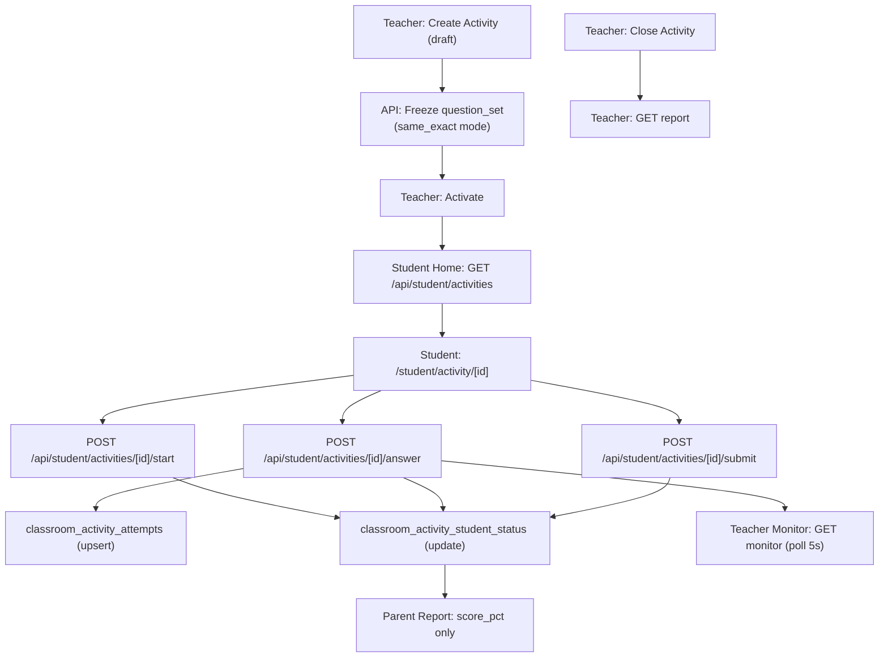

# Classroom Activities — Full Implementation Plan

## 1. Product Design

### Activity Modes

| Mode | Pacing | Hints | Explanations | Time limit |
|---|---|---|---|---|
| **live_lesson** | Teacher broadcasts one question at a time; students cannot advance | Off during lesson; teacher can reveal | Teacher reveals after each question | No (teacher controls) |
| **guided_practice** | Student self-paced through all questions | Optional | Shown after each answer | Optional |
| **quiz** | Student self-paced; cannot go back | Off | Shown after submit only | Required |
| **homework** | Student self-paced; closes at deadline | Optional | Shown after each answer | Optional (window) |

> Note: tables are shown here for the plan only; the final markdown will not use them. The above is part of the design section.

### Activity Lifecycle

```
draft ──activate──▶ active ──pause──▶ paused ──resume──▶ active
                      │
                   close
                      │
                      ▼
                   closed ──archive──▶ archived
```

- `draft`: created but not visible to students; questions can still be edited.
- `active`: visible to students; answers accepted.
- `paused`: live_lesson only; students see a "waiting" screen.
- `closed`: no more submissions; all data locked.
- `archived`: hidden from teacher dashboard by default; data preserved.

### Question Selection & Freezing

Phase A implements **`same_exact` only**. `controlled_variants` is reserved and disabled until a server-side answer verification path exists (see Security note below).

- **same_exact** — The teacher's creation form runs the appropriate client-side generator in the browser, the teacher previews and confirms the questions, and the fully-rendered array is POSTed to `POST /api/teacher/activities` as `question_set`. The server stores it. **Correct answers are embedded in `question_set` on the server, never provided by the student.** When a student submits an answer, the server looks up `question_set[question_index].correct_answer` from the DB and performs scoring independently. The student's submission contains only `selected_answer` — no snapshot, no `correct_answer`.
- **controlled_variants** — **Disabled in Phase A.** This mode requires the server to derive the correct answer independently (re-run the generator with a deterministic seed, or store the correct answer server-side on first generation). Until the generator logic is ported to a Node.js-safe shared module, the server has no way to verify correctness without trusting student-submitted data. `question_selection = 'controlled_variants'` is accepted by the DB schema (reserved for future use) but the API will reject attempts to create or activate activities with that mode with `501 Not Implemented`.

The DB schema retains the `question_snapshot` column in `classroom_activity_attempts` for future use and for `same_exact` archival (stores a copy of the question object for the report reader without requiring a join back to `classroom_activities.question_set`). But **the server populates `question_snapshot` at scoring time from the server-side `question_set`**, not from client-submitted data.

### Critical Constraint: Question Generators Are Client-Side

The question generators (`utils/math-question-generator.js`, `utils/hebrew-question-generator.js`, `utils/geometry-question-generator.js`, etc.) run entirely in the browser on the `*-master.js` learning pages. There is no existing server-side path to call them.

**Chosen approach — teacher-side freeze during creation:**

The creation form (`activities/new.js`) runs the appropriate generator in the browser, generates the N question objects client-side, and the resulting frozen array is POSTed to `POST /api/teacher/activities` as the `question_set` field. The server validates and stores it. The server does NOT call generators itself. The teacher previews the exact questions before saving.

A future phase could port generator logic to a shared `utils/question-generators/` module callable from both browser and Node.js, which would unlock `controlled_variants` with trusted server-side scoring, but this is deferred.

---

## 2. Proposed DB Schema (Migration 024)

File to be created: `supabase/migrations/024_classroom_activities.sql`

### New Enums / Check Constraints

```sql
-- activity_mode: 'live_lesson' | 'guided_practice' | 'quiz' | 'homework'
-- activity_status: 'draft' | 'active' | 'paused' | 'closed' | 'archived'
-- question_selection_mode: 'same_exact' (Phase A only) | 'controlled_variants' (reserved, API rejects)
-- student_activity_status: 'not_started' | 'in_progress' | 'submitted' | 'timed_out'
```

### `classroom_activities`

```sql
create table public.classroom_activities (
  id                    uuid primary key default gen_random_uuid(),
  teacher_id            uuid not null references public.teacher_profiles(id) on delete cascade,
  class_id              uuid not null references public.teacher_classes(id) on delete cascade,
  title                 text not null check (char_length(title) between 1 and 120),
  subject               text not null check (char_length(subject) between 1 and 64),
  topic                 text not null check (char_length(topic) between 1 and 120),
  subtopic              text null check (subtopic is null or char_length(subtopic) <= 120),
  skill_key             text null check (skill_key is null or char_length(skill_key) <= 120),
  difficulty_level      text null check (difficulty_level in ('easy','medium','hard','mixed')),
  question_count        integer not null check (question_count between 1 and 50),
  mode                  text not null check (mode in ('live_lesson','guided_practice','quiz','homework')),
  question_selection    text not null default 'same_exact'
                          check (question_selection in ('same_exact','controlled_variants')),
  time_limit_seconds    integer null check (time_limit_seconds is null or time_limit_seconds > 0),
  due_at                timestamptz null,
  status                text not null default 'draft'
                          check (status in ('draft','active','paused','closed','archived')),
  question_set          jsonb not null default '[]'::jsonb,
  -- for same_exact: frozen array of question objects
  -- for controlled_variants: generation parameters + seed_base
  current_question_idx  integer null,
  -- live_lesson only: which question teacher is broadcasting
  activated_at          timestamptz null,
  paused_at             timestamptz null,
  closed_at             timestamptz null,
  archived_at           timestamptz null,
  created_at            timestamptz not null default now(),
  updated_at            timestamptz not null default now()
);
```

### `classroom_activity_student_status`

```sql
create table public.classroom_activity_student_status (
  id                uuid primary key default gen_random_uuid(),
  activity_id       uuid not null references public.classroom_activities(id) on delete cascade,
  student_id        uuid not null references public.students(id) on delete cascade,
  status            text not null default 'not_started'
                      check (status in ('not_started','in_progress','submitted','timed_out')),
  started_at        timestamptz null,
  submitted_at      timestamptz null,
  last_seen_at      timestamptz null,
  answers_count     integer not null default 0,
  correct_count     integer not null default 0,
  score_pct         numeric(5,2) null,
  created_at        timestamptz not null default now(),
  updated_at        timestamptz not null default now(),
  constraint classroom_activity_student_status_unique unique (activity_id, student_id)
);
```

### `classroom_activity_attempts`

```sql
create table public.classroom_activity_attempts (
  id                    uuid primary key default gen_random_uuid(),
  activity_id           uuid not null references public.classroom_activities(id) on delete cascade,
  student_id            uuid not null references public.students(id) on delete cascade,
  question_index        integer not null check (question_index >= 0),
  skill_key             text null,
  question_snapshot     jsonb not null default '{}'::jsonb,
  -- server-written copy of question_set[question_index] at scoring time; never from student
  selected_answer       text null,
  -- student-submitted; the only field accepted from student input for scoring
  correct_answer        text null,
  -- server-derived from question_set[question_index].correct_answer; never from student
  is_correct            boolean null,
  -- server-computed: selected_answer = correct_answer
  time_spent_ms         integer null check (time_spent_ms is null or time_spent_ms >= 0),
  hints_used            integer not null default 0,
  explanation_viewed    boolean not null default false,
  answered_at           timestamptz null,
  created_at            timestamptz not null default now(),
  constraint classroom_activity_attempts_unique
    unique (activity_id, student_id, question_index)
);
```

### Indexes

```sql
create index classroom_activities_class_status_idx
  on public.classroom_activities (class_id, status);
create index classroom_activities_teacher_idx
  on public.classroom_activities (teacher_id, created_at desc);
create index cass_student_status_activity_idx
  on public.classroom_activity_student_status (activity_id, status);
create index cass_student_status_student_idx
  on public.classroom_activity_student_status (student_id);
create index caa_activity_student_idx
  on public.classroom_activity_attempts (activity_id, student_id, question_index);
create index caa_activity_question_idx
  on public.classroom_activity_attempts (activity_id, question_index);
```

### RLS

All three new tables: RLS enabled, **no authenticated client policies**. All reads and writes go through service-role APIs. Same posture as `student_learning_state` and `teacher_access_audit`.

### Audit Action Additions (to `teacher_access_audit`)

Extend the `action` CHECK constraint to include:
`'activity_created'`, `'activity_activated'`, `'activity_paused'`, `'activity_closed'`, `'activity_archived'`

---

## 3. API Design

All endpoints use service-role Supabase client. Teacher endpoints require teacher JWT (existing `resolveTeacherSession` pattern). Student endpoints require student session cookie (existing `getAuthenticatedStudentSession` pattern).

### Teacher — Activity Lifecycle

- `POST /api/teacher/activities` — create activity in `draft`; body must include a fully rendered `question_set` array (teacher client generates it); `question_selection = 'controlled_variants'` is accepted by the schema but the API returns `501 Not Implemented` until a server-side scoring path exists
- `GET /api/teacher/activities?classId=&status=` — list activities for owned class
- `GET /api/teacher/activities/[activityId]` — get activity + student roster status summary
- `PATCH /api/teacher/activities/[activityId]/status` — body `{ action: 'activate'|'pause'|'resume'|'close'|'archive' }`
  - `activate`: validates class still has students, validates `question_set` is non-empty array, rejects `controlled_variants` with `501`, transitions to `active`, upserts `not_started` rows in student_status for all current class members
  - `close`: closes activity, calculates final scores
- `PATCH /api/teacher/activities/[activityId]/question` — live_lesson only: `{ current_question_idx }` to broadcast next question
- `DELETE /api/teacher/activities/[activityId]` — only allowed when status is `draft`

### Teacher — Monitoring & Reports

- `GET /api/teacher/activities/[activityId]/monitor` — real-time dashboard payload:
  - per-student: `{ studentId, maskedName, status, answers_count, correct_count, last_seen_at }`
  - per-question aggregate: `{ question_index, total_answers, correct_count, wrong_count, accuracy_pct, wrong_student_ids }`
  - summary: `{ not_started_count, in_progress_count, submitted_count, class_accuracy }`
- `GET /api/teacher/activities/[activityId]/report` — final report (only accessible when `closed` or `archived`):
  - same structure as monitor plus weak_skills array derived from attempts
  - exportable

### Student — Activity Flow

- `GET /api/student/activities` — list active activities for student's class memberships; returns `[{ activityId, title, mode, question_count, time_limit_seconds, status, student_status }]`
- `POST /api/student/activities/[activityId]/start` — creates/updates `classroom_activity_student_status` to `in_progress`; returns question_set (question prompts and choices only — `correct_answer` is stripped before sending to student)
- `POST /api/student/activities/[activityId]/answer` — body accepted from student: `{ question_index, selected_answer, time_spent_ms, hints_used, explanation_viewed }` only:
  - server loads `classroom_activities.question_set[question_index]` from DB
  - server derives `correct_answer` and computes `is_correct` — never from student body
  - server writes `question_snapshot`, `correct_answer`, `is_correct` into attempt row
  - verifies activity is `active` (or for `homework` mode, not yet past `due_at`)
  - verifies student is class member
  - upserts into `classroom_activity_attempts` (idempotent by unique constraint)
  - updates `classroom_activity_student_status.answers_count`, `correct_count`
  - returns `{ ok, is_correct, explanation? }` — `correct_answer` returned only for `guided_practice`/`homework` modes; withheld during `quiz` until after submit; never returned to student for `live_lesson` until teacher reveals
- `POST /api/student/activities/[activityId]/submit` — marks student status as `submitted`, records final score

### Auth Guards (IDOR Prevention)

Every teacher endpoint:
```javascript
// verify ownership
const activity = await serviceRole
  .from('classroom_activities')
  .select('id, class_id, teacher_id')
  .eq('id', activityId)
  .maybeSingle();
if (!activity || activity.teacher_id !== teacherIdFromJwt) return 403;
```

Every student endpoint:
```javascript
// verify student is a member of the activity's class
const membership = await serviceRole
  .from('teacher_class_students')
  .select('id')
  .eq('class_id', activity.class_id)
  .eq('student_id', auth.studentId)
  .is('removed_at', null)
  .maybeSingle();
if (!membership) return 403;
```

Parent endpoints: only expose `score_pct` and `submitted_at` from `classroom_activity_student_status` for their own child. No question-level data exposed to parents.

---

## 4. Teacher UI Routes & Components

All under `pages/teacher/class/[classId]/` and `components/teacher-portal/`.

### New Pages

- `pages/teacher/class/[classId]/activities/index.js` — list activities panel for the class:
  - shows table: title, mode, status, progress summary (N/M submitted), created_at, actions
  - "New Activity" button → `activities/new.js`
  - Row click → monitor or report depending on status
- `pages/teacher/class/[classId]/activities/new.js` — multi-step creation form:
  1. Subject / Topic / Subtopic / Skill
  2. Mode selector (live_lesson / guided_practice / quiz / homework)
  3. Question count + difficulty + selection mode
  4. Optional: time limit, due date
  5. Preview generated questions (for same_exact)
  6. "Create Draft" → POST /api/teacher/activities
- `pages/teacher/class/[classId]/activities/[activityId]/monitor.js` — live monitoring dashboard:
  - "Activate" / "Pause" / "Close" status buttons
  - Live polling every 5s via `/api/teacher/activities/[activityId]/monitor`
  - Student progress table: name, status badge, N/M answers, accuracy %
  - Per-question accordion: question prompt, accuracy bar, list of students who got it wrong
  - "Stuck students" alert (in_progress with no new answer for > 3 min)
- `pages/teacher/class/[classId]/activities/[activityId]/report.js` — final report (closed/archived):
  - Class summary: total students, completion rate, class accuracy
  - Per-question correctness breakdown
  - Weak skills panel (skill_keys with accuracy < 60%)
  - Student breakdown table (sortable by score)
  - Export button (CSV)

### Navigation Addition (non-breaking)

Add "פעילויות" (Activities) tab/link in the existing `TeacherPortalShell` or class detail page navigation bar. No redesign of existing screens.

---

## 5. Student UI Changes (Non-Breaking)

### `pages/student/home.js` addition

Below the existing subject panels, add a new section:

```
┌─ פעילויות כיתה ─────────────────────────────────────┐
│  [title] • [mode label] • [N questions] • [status]   │
│  [Start / Continue / View Results] button            │
└──────────────────────────────────────────────────────┘
```

- Fetches `/api/student/activities` on load (alongside existing `/api/student/home-profile`)
- If no active activities → section not rendered (zero visual impact for unaffected students)
- Each card links to `/student/activity/[activityId]`

### New Page: `pages/student/activity/[activityId].js`

- Renders activity title, mode label, progress bar (question X / N)
- For `quiz` mode: no hints, no explanations during session
- For `guided_practice` and `homework`: shows hint button and explanation after answer
- For `live_lesson`: shows current question only (polls teacher's `current_question_idx` every 3s)
- On submit: shows score screen and "back to home" button
- The existing learning flow (`/learning/*`, `learning_sessions`, adaptive planner) is **not touched**

---

## 6. Data Flow



Independent learning flow (`learning_sessions` → `answers` → `adaptive planner`) continues in parallel and is not modified.

---

## 7. Security & IDOR Checks

- **Teacher ownership**: Every teacher API call verifies `classroom_activities.teacher_id = jwt_teacher_id`. The class ownership is checked via `teacher_classes.teacher_id`.
- **Student membership**: Every student API call verifies `teacher_class_students` row exists for `(activity.class_id, auth.studentId)` with `removed_at IS NULL`.
- **Cross-student**: Student can only read/write their own `classroom_activity_attempts` and `classroom_activity_student_status` rows. API layer filters by `auth.studentId`.
- **Cross-teacher**: Listing endpoints always filter `teacher_id = jwt_teacher_id`. Report endpoints recheck ownership before returning attempt-level data.
- **Trusted scoring (critical)**: The student answer endpoint accepts only `selected_answer` from the student body. `correct_answer`, `is_correct`, and `question_snapshot` are **always derived server-side** from the frozen `question_set` stored in `classroom_activities`. No student-submitted field influences scoring. This is enforced regardless of `question_selection` mode.
- **`correct_answer` not sent to student at start**: The `start` endpoint strips `correct_answer` from every question object before returning `question_set` to the student client.
- **`controlled_variants` disabled**: Any request to create or activate an activity with `question_selection = 'controlled_variants'` returns `501 Not Implemented`. This mode is schema-reserved but not enabled until server-side answer derivation is implemented.
- **Parent boundary**: Parent API (existing `/api/parent/*`) must NOT join to `classroom_activity_attempts`. Only `classroom_activity_student_status.score_pct` and `submitted_at` may be added to parent report payload in future (opt-in, out of scope for this phase unless explicitly added).
- **Status guard**: Student `answer` endpoint checks `status = 'active'` (for `homework`, checks `due_at` not passed). If `closed` or `archived`, returns `409 Conflict`.
- **Activity not started guard**: If student status row doesn't exist (student never called `start`), `answer` endpoint returns `400`.
- **No PII leakage**: Teacher monitor/report use `maskStudentFullName` (existing helper) — full names only shown to the owning teacher.

---

## 8. Simulation Plan

New script: `scripts/teacher-portal/teacher-activity-sim.mjs`

Steps:
1. Authenticate as existing simulation teacher.
2. Pick first active class with at least 3 simulation students.
3. `POST /api/teacher/activities` → create `guided_practice` activity (5 questions, math, fractions, medium difficulty, same_exact).
4. `PATCH .../status { action: 'activate' }` → freeze questions, activate.
5. For each simulation student (parallel):
   a. Start activity via student-side API (using student session cookie).
   b. Loop: submit answer for each question (random correct/wrong mix).
   c. Submit activity.
6. Poll teacher monitor endpoint; assert all students `submitted`.
7. `PATCH .../status { action: 'close' }`.
8. `GET .../report`; assert per-question accuracy populated.
9. Also run a `quiz` mode variant with time_limit.
10. Run a `live_lesson` stub: activate → advance question_idx → close.

Separate from the existing `run-teacher-classroom-daily-simulation.mjs` (no modification).

---

## 9. QA / Playwright Plan

New test file: `tests/teacher-activities.spec.ts`

### Teacher Flow Tests

- `[T-ACT-01]` Create draft activity → verify appears in activities list with status `draft`
- `[T-ACT-02]` Activate activity → verify status changes to `active`; student_status rows created
- `[T-ACT-03]` Pause and resume (live_lesson mode) → status transitions correctly
- `[T-ACT-04]` Close activity → status `closed`; subsequent student answer returns 409
- `[T-ACT-05]` Monitor endpoint returns expected student progress counts
- `[T-ACT-06]` Report endpoint returns per-question accuracy after close
- `[T-ACT-07]` Delete draft activity → 204; delete active activity → 409

### Student Flow Tests

- `[S-ACT-01]` Student home shows activity card when one is active for their class
- `[S-ACT-02]` Student home shows no activity section when no active activities
- `[S-ACT-03]` Student starts activity → status row transitions to `in_progress`
- `[S-ACT-04]` Student submits correct answer → is_correct = true, counts updated
- `[S-ACT-05]` Student submits all answers → `submit` → status `submitted`
- `[S-ACT-06]` Student cannot answer closed activity (409)
- `[S-ACT-07]` Quiz mode: explanation not returned until after submit

### IDOR / Security Tests

- `[SEC-01]` Teacher B cannot GET/PATCH activities owned by Teacher A → 403
- `[SEC-02]` Student from Class B cannot start/answer activity for Class A → 403
- `[SEC-03]` Student cannot read another student's attempts → 403
- `[SEC-04]` Monitor endpoint not accessible by student JWT → 401/403
- `[SEC-05]` Parent cannot access attempt-level data
- `[SEC-06]` Unauthenticated request to any activity endpoint → 401
- `[SEC-07]` Student POSTs answer body with fabricated `correct_answer: "X"` and `is_correct: true` fields → server ignores them; scoring uses server-side `question_set` only; stored `is_correct` matches server computation
- `[SEC-08]` `POST /api/teacher/activities` with `question_selection: 'controlled_variants'` → 501
- `[SEC-09]` `start` endpoint response does not include `correct_answer` in any question object

### Regression Tests (existing flows must still pass)

- `[REG-01]` Independent learning session start/answer/finish unaffected
- `[REG-02]` Existing class report still loads correctly
- `[REG-03]` Teacher dashboard loads correctly
- `[REG-04]` Student home loads correctly even when `/api/student/activities` returns 200 with empty array

---

## 10. Rollout Plan

### Phase A — DB Migration File (written by agent, applied manually by owner)
1. Agent writes `supabase/migrations/024_classroom_activities.sql`. Does NOT run it.
2. Owner reviews the SQL file and applies it manually in Supabase.
3. Owner confirms application; agent proceeds to Phase B.
4. After owner confirms: verify RLS posture and audit action constraint extension.

### Phase B — Backend APIs
4. Create `lib/teacher-server/teacher-activities.server.js` — core data layer.
5. Create API routes: teacher lifecycle endpoints, teacher monitor/report endpoints.
6. Create API routes: student activity list, start, answer, submit endpoints.
7. Run simulation script; assert no regressions.

### Phase C — Teacher UI
8. Activities list page and creation form.
9. Monitor dashboard (polling).
10. Final report page.
11. Add "פעילויות" nav entry in `TeacherPortalShell`.

### Phase D — Student UI
12. Add activity section to student home (feature-flagged initially via env var `NEXT_PUBLIC_ACTIVITIES_ENABLED=false`).
13. Create `pages/student/activity/[activityId].js`.
14. Enable flag after QA sign-off.

### Phase E — QA & Playwright
15. Run all Playwright tests; fix regressions.
16. Manual QA walkthrough (teacher + student + IDOR checks).

### Phase F — Parent Report (optional, separate approval)
17. Add `score_pct` summary to parent report payload (not question-level data).

---

## 11. Risks & Open Questions

### Risks

- **Question bank availability**: The existing question engine is called at activation time. If the skill/topic has fewer questions than requested, the API must return a clear error at creation time, not silently truncate.
- **Live lesson polling**: 3–5s client polling is acceptable for an MVP. If the class size exceeds 30+, teacher monitor polling may create DB load; consider SSE or Supabase Realtime channel in a later phase.
- **Controlled variants (deferred)**: `controlled_variants` is disabled in Phase A because scoring correctness cannot be verified server-side without porting the question generators to Node.js. When the generators are ported, `controlled_variants` can be unlocked with server-side seed derivation and server-side `correct_answer` lookup.
- **Clock skew for time limits**: `time_limit_seconds` enforcement is client-side for UX; server-side enforcement is at submit time using `started_at + time_limit_seconds`.
- **Student in multiple classes**: If a student is a member of two classes that both have active activities, both appear in the home list independently. This is expected behavior.

### Open Questions

1. Should coins/rewards be granted for correct activity answers, or are activities score-only (no gamification)?
2. Should activity results contribute to `student_learning_state` (daily missions, streaks)?
3. For `live_lesson` mode: does the teacher explicitly push questions one by one via the UI, or does a timer advance them automatically?
4. For `homework` mode: is `due_at` enforced server-side (auto-close) or is it advisory?
5. Should the parent report show activity scores immediately, or only when the teacher closes the activity?
6. Is there a maximum number of activities per class per teacher plan (needs `teacher_plans` / `teacher_limits` update)?
7. For controlled_variants (future phase): do the existing question generators produce the same output given the same seed? If not, what changes are needed before the mode can be safely enabled with server-side scoring?
