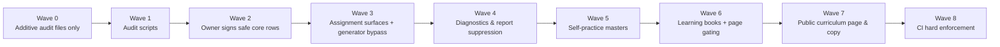

# Curriculum Governance Layer — Revised Implementation Plan

## Hard rules in force
- No code changes, no SQL, no Hebrew UI text, no commits, no pushes, no deploys.
- GOV tests run in audit-only (report) mode until Wave 8.
- `UNSUPPORTED_OR_UNKNOWN` is blocked from every runtime surface without exception.
- Science question generation is blocked until at least one topic row is explicitly promoted to `ENRICHMENT_ONLY` by owner decision.

## Final clarifications (approved 2026-06-04)

**CL-1 — Generator bypass prevention is total.** Every generation entry point — not only assigned activities — must call `assertTopicAllowedForGeneration` before producing questions. This includes:
- `lib/classroom-activities/generate-activity-questions-client.js` (assigned activity path)
- All subject generators: `utils/english-question-generator.js`, `utils/geometry-question-generator.js`, `utils/moledet-geography-question-generator.js`, `utils/hebrew-question-generator.js`, `utils/math-question-generator.js`, and the inline science generator in `pages/learning/science-master.js`
- Self-practice generation path in each `pages/learning/*-master.js`
- Book practice CTA generation (`lib/learning-book/english-book-practice-map.js`, `resolve-english-book-page.js`)
- Any direct API route or fallback that accepts `subject/grade/topic` and calls a generator

No generator may produce questions for a topic unless the resolver confirms that topic is allowed on the relevant surface. The surface key passed to `assertTopicAllowedForGeneration` must match the actual call origin: `"self_practice"` for master pages, `"book"` for book CTAs, `"question_generator"` for assigned/classroom paths.

**CL-2 — Wave 1 spine is report-only.** `scripts/build-curriculum-spine-v1.mjs` must **not** overwrite or regenerate any production spine files during Wave 1. It must only emit a diff-report showing which `SHOULD_HIDE` rows would be skipped. A separate owner-approved write step is required before the spine is actually rebuilt.

**CL-3 — `audit_only` is permissive for runtime only, strict for audit reporting.** When `enforcement_mode: "audit_only"`:
- Runtime calls (`isTopicAllowedOnSurface`, `isDiagnosticOutputAllowed`, etc.) return `true` / allowed — no site breakage.
- `auditAllViolations()` and all GOV tests evaluate `candidate_status` strictly and record every violation, regardless of `enforcement_mode`. A topic with `candidate_status: UNSUPPORTED_OR_UNKNOWN` appearing on an assignment surface is recorded as a violation even while runtime enforcement is off.

**CL-4 — Diagnostic/report activation requires all five product-readiness fields to be explicitly `true`.** A row with `approved_status: OFFICIAL_CORE` is still blocked from `diagnostics_weakness` and `report_recommendation` surfaces unless all of the following are `true` in `product_readiness`:
- `instruction_available`
- `practice_available`
- `question_bank_validated`
- `diagnostic_validated`
- `report_language_validated`

`isDiagnosticOutputAllowed` checks all five. Missing or `false` on any field = blocked. This applies equally to English G3 (Pre-A1 foundations not yet present) and to any other topic promoted to `OFFICIAL_CORE` before its product path is complete.

**CL-5 — Book page gating requires a stable `pageId → (subject, grade, topic_key)` mapping.** Every book page must have a deterministic resolution path. The resolver's `isBookPageApproved(subject, grade, pageId)` looks up `pageId` in the row's `book_pages_approved` / `book_pages_blocked` lists AND cross-checks against `lib/learning-book/english-page-skill-index.js` (and equivalent per-subject skill indexes). Pages that cannot be resolved to a `(subject, grade, topic_key)` triple must be:
- **Blocked in `runtime_enforced` mode** (TOC omits them)
- **Reported as unresolvable in `audit_only` mode** (GOV-05 records the violation)

The initial map must encode `book_pages_approved` and `book_pages_blocked` for every subject/grade where a book registry exists. English G1 Batch C pages (`grammar_be`, `sentence_base`, `translation_classroom`) are blocked until owner resolves D2.

---

## A. Schema: `data/curriculum-governance/v1/approved-topic-map.json`

Single flat JSON array. One row per `(subject, grade, topic_key)`. Missing row = resolver blocks the surface (fail-closed).

### Row shape

```json
{
  "subject": "english",
  "grade": "g1",
  "topic_key": "vocabulary",
  "label_he": "אוצר מילים",

  "candidate_status": "OFFICIAL_EARLY_EXPOSURE",
  "approved_status": null,
  "enforcement_mode": "audit_only",

  "content_tier": "exposure",
  "public_label_tier": "חשיפה מוקדמת",

  "surfaces_allowed_when_approved": ["book", "self_practice"],
  "surfaces_blocked_always": [
    "parent_assign", "teacher_assign",
    "diagnostics_weakness", "report_recommendation"
  ],

  "source_refs": [
    {
      "source_type": "official_primary",
      "file": "תוכנית משרד החינוך קובצי TXT/כיתה א.txt",
      "anchor": "§ Focus",
      "corroborating": "english Curriculum2020.pdf",
      "verified_at": "2026-06-04",
      "confidence": "medium"
    }
  ],

  "age_appropriateness": "PARTIAL",

  "required_foundations": [
    "alphabet_letter_recognition",
    "capital_lowercase_distinction",
    "ltr_direction",
    "basic_english_sounds",
    "listening_first_tasks",
    "oral_repetition",
    "songs_chants_exposure",
    "simple_chunk_patterns"
  ],
  "foundations_present_in_product": false,

  "product_readiness": {
    "instruction_available": false,
    "practice_available": true,
    "question_bank_validated": false,
    "diagnostic_validated": false,
    "report_language_validated": false
  },

  "book_pages_approved": [],
  "book_pages_blocked": ["grammar_be", "sentence_base", "translation_classroom"],

  "dependency_topic_keys": [],
  "notes": "G1 official = exposure via songs/routines. Vocab MCQ is enrichment format only. Batch C pages exceed tier.",

  "owner_approved": false,
  "owner_approved_at": null,
  "owner_approved_by": null
}
```

### Two-status (`candidate_status` / `approved_status`) and `enforcement_mode`

This solves the Wave 0 rollout risk. The resolver reads them as follows:

| `enforcement_mode` | Runtime behavior |
|----|-----|
| `"audit_only"` | Resolver answers every surface query as **allowed** (no blocking); GOV tests record violations but do not fail CI |
| `"runtime_enforced"` | Resolver enforces `approved_status`; GOV tests are CI-breaking |

**Transition rules:**
- All rows start as `enforcement_mode: "audit_only"`, `approved_status: null`.
- Owner promotes a row to `enforcement_mode: "runtime_enforced"` by setting `approved_status` to a valid status and `owner_approved: true`.
- The resolver checks `enforcement_mode` first. Only `"runtime_enforced"` rows are enforced at runtime.
- `candidate_status` is always written regardless of enforcement; it powers audit reports.

### `approval_status` enum (used for both fields)

`OFFICIAL_CORE` | `OFFICIAL_EARLY_EXPOSURE` | `ENRICHMENT_ONLY` | `UNSUPPORTED_OR_UNKNOWN` | `SHOULD_HIDE`

### `UNSUPPORTED_OR_UNKNOWN` surface rule (correction 1 & 2)

When `enforcement_mode: "runtime_enforced"` and `approved_status` is `UNSUPPORTED_OR_UNKNOWN`:
- Blocked from: `book`, `self_practice`, `parent_assign`, `teacher_assign`, `question_generator`, `diagnostics_weakness`, `report_recommendation`
- Allowed only in: `curriculum_audit_page` (internal, not child-facing) with an explicit "אין מיפוי רשמי מאושר" label
- **Science**: no row may have `approved_status: ENRICHMENT_ONLY` in the initial map. Only after owner explicitly sets a row to `ENRICHMENT_ONLY` may science question generation proceed for that row.

### Pre-filled `candidate_status` by subject/grade/topic

| Subject | Grade | Topic keys | `candidate_status` |
|---------|-------|-----------|-----|
| math | g1–g6 | all operations | `OFFICIAL_CORE` |
| geometry | g1–g6 | non-area topics | `OFFICIAL_CORE` |
| geometry | g3–g4 | `area` | `ENRICHMENT_ONLY` |
| geometry | g6 | `symmetry` | `ENRICHMENT_ONLY` |
| hebrew | g1–g6 | reading, comprehension, writing, grammar, vocabulary, mixed | `OFFICIAL_CORE` |
| hebrew | g1–g2 | `speaking` | `ENRICHMENT_ONLY` |
| hebrew | g3–g6 | `speaking` | `OFFICIAL_CORE` |
| english | g1 | `vocabulary` | `OFFICIAL_EARLY_EXPOSURE` |
| english | g2 | `vocabulary` | `OFFICIAL_EARLY_EXPOSURE` |
| english | g2 | `translation`, `writing` | `ENRICHMENT_ONLY` |
| english | g3 | all topics | `OFFICIAL_CORE` (see correction 4 — `diagnostic_validated: false` blocks weakness output) |
| english | g4–g6 | all topics | `UNSUPPORTED_OR_UNKNOWN` |
| science | g1–g6 | all topics | `UNSUPPORTED_OR_UNKNOWN` |
| moledet_geography | g1 | (no UI topics) | `SHOULD_HIDE` — row exists to block spine leak |
| moledet_geography | g2–g4 | all topics | `OFFICIAL_CORE` |
| moledet_geography | g5–g6 | all topics | `ENRICHMENT_ONLY` |

### Product-readiness blocking English G3 diagnostics (correction 4)

English G3 rows get `candidate_status: OFFICIAL_CORE` but `product_readiness.diagnostic_validated: false` and `product_readiness.report_language_validated: false`. The resolver surfaces check `diagnostic_validated` before emitting weakness/recommendation rows, independent of `approval_status`. Until the Pre-A1 foundation path exists and is owner-validated, G3 diagnostics are suppressed exactly like an `ENRICHMENT_ONLY` row.

Required foundations tracked in `required_foundations[]`:
`alphabet`, `capital_lowercase`, `ltr_direction`, `basic_sounds_phonics_readiness`, `listening_first_tasks`, `oral_repetition`, `chunk_sentence_patterns`, `gradual_reading_readiness`

`foundations_present_in_product: false` until those book/practice paths exist.

---

## B. Resolver module design

**New files (additive — Wave 0):**
- [`lib/curriculum/approved-topic-map-loader.js`](lib/curriculum/approved-topic-map-loader.js) — singleton; reads the JSON once at init; throws if file missing
- [`lib/curriculum/resolve-approved-topic.js`](lib/curriculum/resolve-approved-topic.js) — all query functions; no side effects

### Public API

```js
// Core lookup — null means "no row found" → treat as SHOULD_HIDE in enforced mode
getApprovedTopic(subject, grade, topicKey) → Row | null

// Surface gate (respects enforcement_mode)
isTopicAllowedOnSurface(subject, grade, topicKey, surface) → boolean

// Diagnostic/report gate (respects enforcement_mode AND product_readiness fields)
isDiagnosticOutputAllowed(subject, grade, topicKey) → boolean

// Topic list for UI selectors — only returns rows allowed on the surface
approvedTopicOptionsForSubjectGrade(subject, grade, surface)
  → Array<{ key, label_he, content_tier, public_label_tier }>
  // Sorted: OFFICIAL_CORE first, OFFICIAL_EARLY_EXPOSURE second, ENRICHMENT_ONLY third
  // Never returns UNSUPPORTED_OR_UNKNOWN or SHOULD_HIDE rows

// Public label
getPublicLabelTier(subject, grade, topicKey)
  → "ליבת תוכנית" | "חשיפה מוקדמת" | "העשרה" | null

// Book page gate (correction 6)
isBookPageApproved(subject, grade, pageId) → boolean

// Bypass-prevention gate for generators (correction 9)
assertTopicAllowedForGeneration(subject, grade, topicKey, surface)
  → void | throws Error("GOVERNANCE_BLOCK: …")

// Audit functions (used by GOV tests and scripts regardless of enforcement_mode)
auditAllViolations() → Array<ViolationRecord>
pendingOwnerApprovalRows() → Row[]
```

### Resolution logic (pseudocode)

```
// RUNTIME gate — permissive when audit_only, enforced when runtime_enforced
isTopicAllowedOnSurface(subject, grade, topic, surface):
  row = getApprovedTopic(subject, grade, topic)
  if !row: return row.enforcement_mode === "audit_only" ? true : false
  if row.enforcement_mode === "audit_only": return true   // CL-3: permissive for runtime
  // runtime_enforced from here
  status = row.approved_status
  if status === "SHOULD_HIDE": return false
  if status === "UNSUPPORTED_OR_UNKNOWN": return false    // all surfaces blocked
  if surface in row.surfaces_blocked_always: return false
  return row.surfaces_allowed_when_approved.includes(surface)

// RUNTIME gate — checks approved_status AND all five product_readiness fields (CL-4)
isDiagnosticOutputAllowed(subject, grade, topic):
  row = getApprovedTopic(subject, grade, topic)
  if !row: return row.enforcement_mode === "audit_only" ? true : false
  if row.enforcement_mode === "audit_only": return true   // CL-3: permissive for runtime
  if !isTopicAllowedOnSurface(subject, grade, topic, "diagnostics_weakness"):
    return false
  // All five product_readiness fields must be explicitly true (CL-4)
  const pr = row.product_readiness
  return pr.instruction_available === true
      && pr.practice_available === true
      && pr.question_bank_validated === true
      && pr.diagnostic_validated === true
      && pr.report_language_validated === true

// RUNTIME generator guard (CL-1) — throws in runtime_enforced, no-op in audit_only
assertTopicAllowedForGeneration(subject, grade, topic, surface):
  row = getApprovedTopic(subject, grade, topic)
  if row?.enforcement_mode === "audit_only": return   // CL-3: permissive for runtime
  if !isTopicAllowedOnSurface(subject, grade, topic, surface):
    throw new Error("GOVERNANCE_BLOCK: " + subject + "/" + grade + "/" + topic
                    + " not allowed on surface " + surface)

// AUDIT evaluator — always uses candidate_status strictly regardless of enforcement_mode (CL-3)
auditTopicOnSurface(subject, grade, topic, surface):
  row = getApprovedTopic(subject, grade, topic)
  if !row: return { violation: true, reason: "no_row_in_map" }
  status = row.candidate_status   // uses candidate, not approved — always strict
  if status === "SHOULD_HIDE": return { violation: true, reason: "SHOULD_HIDE" }
  if status === "UNSUPPORTED_OR_UNKNOWN":
    return { violation: true, reason: "UNSUPPORTED_OR_UNKNOWN" }
  if surface in row.surfaces_blocked_always:
    return { violation: true, reason: "surface_blocked_always" }
  if !row.surfaces_allowed_when_approved.includes(surface):
    return { violation: true, reason: "surface_not_in_allowed_list" }
  return { violation: false }

// auditAllViolations — iterates all rows × all surfaces, calls auditTopicOnSurface (CL-3)
auditAllViolations() → Array<ViolationRecord>
```

### Data flow diagram

```mermaid
flowchart TD
  A["approved-topic-map.json\nsingle source of truth"] --> L["approved-topic-map-loader.js\nsingleton cache"]
  L --> R["resolve-approved-topic.js\nall gate functions"]

  subgraph runtime ["Runtime gates (permissive in audit_only)"]
    R --> S1["teacher-class-topic-options.js"]
    R --> S2["assigned-activity-topic-options.js"]
    R --> S3["pages/learning/*-master.js"]
    R --> S5["learning-book-catalog.js"]
    R --> S6["topic-taxonomy-bridge.js"]
    R --> S7["parent-report-v2.js"]
    R --> S8["topic-next-step-engine.js"]
    R --> S9["curriculum.js page"]
  end

  subgraph generators ["Generator bypass prevention - CL-1 - all paths"]
    R --> G1["generate-activity-questions-client.js"]
    R --> G2["english-question-generator.js"]
    R --> G3["geometry-question-generator.js"]
    R --> G4["moledet-geography-question-generator.js"]
    R --> G5["hebrew-question-generator.js"]
    R --> G6["math-question-generator.js"]
    R --> G7["science-master.js inline generator"]
    R --> G8["book practice CTA generators"]
  end

  subgraph audit ["Audit layer (always strict - CL-3)"]
    R --> T["GOV tests\nauditTopicOnSurface uses candidate_status"]
    R --> SC["verify-approved-topic-governance.mjs"]
  end
```



---

## C. Files that must be migrated from raw constants to resolver

### C1 — Topic selector builders (Wave 3)

| File | Raw import to remove | New call |
|------|---------------------|----------|
| [`lib/teacher-portal/teacher-class-topic-options.js`](lib/teacher-portal/teacher-class-topic-options.js) | `MATH_GRADES`, `GEOMETRY_GRADES`, `HEBREW_GRADES`, `ENGLISH_GRADES`, `MOLEDET_GRADES`, `SCIENCE_GRADES` | `approvedTopicOptionsForSubjectGrade(subject, grade, "teacher_assign")` |
| [`lib/classroom-activities/assigned-activity-topic-options.js`](lib/classroom-activities/assigned-activity-topic-options.js) | `topicOptionsForSubject` | `approvedTopicOptionsForSubjectGrade(subject, grade, "parent_assign")` |

### C2 — Generator bypass prevention — ALL entry points (CL-1, Wave 3)

Every path that can produce questions must call `assertTopicAllowedForGeneration(subject, grade, topicKey, surface)` before any question is produced. The `surface` argument must match the actual call origin.

| File | Surface key | Change |
|------|-------------|--------|
| [`lib/classroom-activities/generate-activity-questions-client.js`](lib/classroom-activities/generate-activity-questions-client.js) | `"question_generator"` | Assert at top of dispatch function, before subject switch |
| [`utils/english-question-generator.js`](utils/english-question-generator.js) | `"question_generator"` | Assert at `generateQuestion` entry |
| [`utils/geometry-question-generator.js`](utils/geometry-question-generator.js) | `"question_generator"` | Assert at generator entry; retain existing `geometry-curriculum-gates.js` sub-checks |
| [`utils/moledet-geography-question-generator.js`](utils/moledet-geography-question-generator.js) | `"question_generator"` | Assert at generator entry |
| [`utils/hebrew-question-generator.js`](utils/hebrew-question-generator.js) | `"question_generator"` | Assert at generator entry |
| [`utils/math-question-generator.js`](utils/math-question-generator.js) | `"question_generator"` | Assert at generator entry |
| [`pages/learning/science-master.js`](pages/learning/science-master.js) | `"self_practice"` | Assert in inline science generator before question bank dispatch |
| Each `pages/learning/*-master.js` | `"self_practice"` | Assert inside question-generation handler, not only in topic selector |
| [`lib/learning-book/english-book-practice-map.js`](lib/learning-book/english-book-practice-map.js) | `"book"` | Assert before resolving a practice CTA topic |
| [`lib/learning-book/resolve-english-book-page.js`](lib/learning-book/resolve-english-book-page.js) | `"book"` | Assert before routing to generator |
| Any direct API route / fallback that accepts `subject/grade/topic` | matching surface key | Assert before delegating to any generator |

### C3 — Self-practice master pages (Wave 5)

| File | Raw read to replace |
|------|---------------------|
| [`pages/learning/math-master.js`](pages/learning/math-master.js) | `GRADES[grade].operations` (8 occurrences) |
| [`pages/learning/geometry-master.js`](pages/learning/geometry-master.js) | `GRADES[grade].topics` |
| [`pages/learning/hebrew-master.js`](pages/learning/hebrew-master.js) | `GRADES[grade].topics` |
| [`pages/learning/english-master.js`](pages/learning/english-master.js) | `GRADES[grade].topics` — lines 1358, 1367, 2742, 3218, 3237, 3265, 3280 |
| [`pages/learning/science-master.js`](pages/learning/science-master.js) | `GRADES[gradeKey].topics` line 1279 and 1370 |
| [`pages/learning/moledet-geography-master.js`](pages/learning/moledet-geography-master.js) | `MOLEDET_GRADES` |

### C4 — Learning books (Wave 6)

| File | Change |
|------|--------|
| [`lib/learning-book/learning-book-catalog.js`](lib/learning-book/learning-book-catalog.js) | Gate each book entry via `isBookPageApproved(subject, grade, pageId)` when building TOC |
| [`lib/learning-book/english-g1-registry.js`](lib/learning-book/english-g1-registry.js) | Batch C pages (`grammar_be`, `sentence_base`, `translation_classroom`) are listed in `book_pages_blocked` in the map; registry must check gate before including them in TOC |
| [`lib/learning-book/english-page-skill-index.js`](lib/learning-book/english-page-skill-index.js) | Page skill index must not emit skills for blocked pages |
| [`lib/learning-book/learning-book-sequence-meta.js`](lib/learning-book/learning-book-sequence-meta.js) | Regenerated from approved map only |

### C5 — Diagnostics/reports (Wave 4)

| File | Change |
|------|--------|
| [`utils/diagnostic-engine-v2/topic-taxonomy-bridge.js`](utils/diagnostic-engine-v2/topic-taxonomy-bridge.js) | Add `isDiagnosticOutputAllowed` gate before returning taxonomy IDs |
| [`utils/parent-report-v2.js`](utils/parent-report-v2.js) | Suppress topic rows where `isDiagnosticOutputAllowed` returns false; route `ENRICHMENT_ONLY` rows to separate enrichment section |
| [`utils/detailed-parent-report.js`](utils/detailed-parent-report.js) | Same suppression |
| [`utils/topic-next-step-engine.js`](utils/topic-next-step-engine.js) | Return `null` for blocked topics before `computeRowDiagnosticSignals` |
| [`utils/topic-next-step-phase2.js`](utils/topic-next-step-phase2.js) | Same null-return gate |
| [`utils/report-diagnostic-safety-guards.js`](utils/report-diagnostic-safety-guards.js) | Extend to delegate to resolver; existing science guards become a subset of the governance rule |
| [`utils/parent-report-language/grade-aware-recommendation-templates.js`](utils/parent-report-language/grade-aware-recommendation-templates.js) | Existing null-guards for science G1–2 extended to all grades via resolver; no new Hebrew copy |
| [`lib/parent-server/parent-report-parent-facing.server.js`](lib/parent-server/parent-report-parent-facing.server.js) | Filter `weakTopics` list through `isDiagnosticOutputAllowed` |
| [`lib/teacher-server/teacher-recommendations.server.js`](lib/teacher-server/teacher-recommendations.server.js) | Same filter |
| [`lib/teacher-server/teacher-guidance-v2.server.js`](lib/teacher-server/teacher-guidance-v2.server.js) | Same filter |

### C6 — Public curriculum page (Wave 7)

| File | Change |
|------|--------|
| [`pages/learning/curriculum.js`](pages/learning/curriculum.js) | Render `public_label_tier` badge from resolver; add three-tier legend; `UNSUPPORTED_OR_UNKNOWN` rows shown with "אין מיפוי רשמי מאושר" on audit page only |

### C7 — Spine build and QA scripts (Wave 1)

| File | Change |
|------|--------|
| [`scripts/build-curriculum-spine-v1.mjs`](scripts/build-curriculum-spine-v1.mjs) | Skip rows where `candidate_status === "SHOULD_HIDE"` (removes G1 moledet spine leak) |
| [`scripts/verify-product-alignment.mjs`](scripts/verify-product-alignment.mjs) | Run GOV-01–07 in audit-only mode; emit report, no CI failure until Wave 8 |
| [`scripts/audit-assigned-activity-topic-availability.mjs`](scripts/audit-assigned-activity-topic-availability.mjs) | Filter through `candidate_status` before checking question depth |
| [`scripts/qa-*-topic-visibility.mjs`](scripts/qa-math-topic-visibility.mjs) (all 6 subject scripts) | Call `auditAllViolations()` from resolver; report discrepancies |

---

## D. Surface gates (corrected — correction 1 & 2)

```
SURFACE_GATES = {
  book:
    allow: OFFICIAL_CORE | OFFICIAL_EARLY_EXPOSURE | ENRICHMENT_ONLY
      — ENRICHMENT_ONLY: separate "העשרה" section in book TOC
      — page must also pass isBookPageApproved()
    block: UNSUPPORTED_OR_UNKNOWN | SHOULD_HIDE

  self_practice:
    allow: OFFICIAL_CORE | OFFICIAL_EARLY_EXPOSURE | ENRICHMENT_ONLY
      — ENRICHMENT_ONLY: below visual divider "העשרה"
      — OFFICIAL_EARLY_EXPOSURE where foundations_present_in_product=false:
          render in "חשיפה מוקדמת" section only; no diagnostic output
    block: UNSUPPORTED_OR_UNKNOWN | SHOULD_HIDE

  parent_assign:
    allow: OFFICIAL_CORE only
    block: everything else (including ENRICHMENT_ONLY)

  teacher_assign:
    same as parent_assign

  question_generator:
    allow: OFFICIAL_CORE | OFFICIAL_EARLY_EXPOSURE | ENRICHMENT_ONLY
    block: UNSUPPORTED_OR_UNKNOWN | SHOULD_HIDE
    note: science stays blocked until at least one topic promoted
          to ENRICHMENT_ONLY by explicit owner decision

  diagnostics_weakness:
    allow: OFFICIAL_CORE where product_readiness.diagnostic_validated=true
    block: all other statuses; OFFICIAL_CORE with diagnostic_validated=false
           (covers English G3 Pre-A1 gap)

  report_recommendation:
    allow: OFFICIAL_CORE where product_readiness.report_language_validated=true
    block: all other statuses; OFFICIAL_CORE with report_language_validated=false

  curriculum_page (child-facing):
    allow: OFFICIAL_CORE | OFFICIAL_EARLY_EXPOSURE | ENRICHMENT_ONLY
    block: UNSUPPORTED_OR_UNKNOWN | SHOULD_HIDE

  curriculum_audit_page (internal only):
    allow: all statuses with explicit tier badge
    UNSUPPORTED_OR_UNKNOWN: "אין מיפוי רשמי מאושר"
}
```

---

## E. Diagnostic/report suppression rules (correction 7)

### Two output buckets in reports

| Bucket | Content | Condition to emit |
|--------|---------|-------------------|
| **Core weakness rows** | "topic to improve for curriculum" | `approved_status === OFFICIAL_CORE` AND `diagnostic_validated === true` |
| **Enrichment activity history** | "practiced this enrichment topic" | `approved_status === ENRICHMENT_ONLY` OR `approved_status === OFFICIAL_EARLY_EXPOSURE`; clearly labeled "אינו חלק מהבחינת ליבת תוכנית" |

Enrichment/exposure rows **never** generate weakness text, never appear in priority improvement lists, and never drive teacher recommendations. They may appear in a separate "activity history" section if the design calls for it — but that section requires an explicit owner decision before UI implementation.

### Per-file suppression entry points

- **`topic-taxonomy-bridge.js`**: `isDiagnosticOutputAllowed(subject, grade, topic)` check before mapping → empty array if blocked
- **`topic-next-step-engine.js`** + **`topic-next-step-phase2.js`**: return `null` early for blocked topics
- **`parent-report-v2.js`**: separate list-build for core weakness rows vs enrichment history
- **`report-diagnostic-safety-guards.js`**: existing science guards become a resolver delegate; no logic duplication

---

## F. Public labeling rules

| Tier key | Hebrew label | When rendered |
|----------|-------------|---------------|
| `core` | `ליבת תוכנית` | `approved_status === OFFICIAL_CORE` and `owner_approved === true` |
| `exposure` | `חשיפה מוקדמת` | `approved_status === OFFICIAL_EARLY_EXPOSURE` |
| `enrichment` | `העשרה` | `approved_status === ENRICHMENT_ONLY` |
| `unsupported` | `אין מיפוי רשמי מאושר` | `approved_status === UNSUPPORTED_OR_UNKNOWN` — internal/audit page only |
| — (hidden) | not rendered | `SHOULD_HIDE` |

The `public_label_tier` field in each row stores the pre-resolved string. The resolver's `getPublicLabelTier()` returns it directly — no runtime string construction.

Curriculum page legend (exact Hebrew text pending owner sign-off — no change yet):
- One legend box at page top
- Three-tier visual key with label and description for each tier

---

## G. Verification tests GOV-01 through GOV-07

All seven tests live in new directory `tests/governance/`. In Waves 0–7 they run in **report-only mode** (no CI failure). In Wave 8 they become hard CI gates.

Each test file includes a constant `ENFORCEMENT_WAVE` flag. When set to `"audit"` the test emits a console report but always passes. When set to `"enforced"` any violation throws.

### GOV-01: All runtime topics have a map row

**File:** `tests/governance/gov-01-all-topics-in-map.test.mjs`

For every `(subject, grade, topic_key)` in runtime constants, assert `getApprovedTopic()` returns non-null. Reports missing rows. Fails CI in Wave 8.

### GOV-02: Assignment surfaces contain only OFFICIAL_CORE rows

**File:** `tests/governance/gov-02-assignment-surface-compliance.test.mjs`

For each subject × grade, every option returned by `topicOptionsForAssignedActivity` must resolve to `approved_status === OFFICIAL_CORE`. Catches science, English G1–2, Moledet G5–6.

### GOV-03: No diagnostic template output for blocked topics

**File:** `tests/governance/gov-03-diagnostic-template-compliance.test.mjs`

For each topic where `isDiagnosticOutputAllowed` returns false, asserts `taxonomyIdsForTopicBucket` returns empty and `grade-aware-recommendation-templates` returns null. Catches science leak and English G3 pre-foundation.

### GOV-04: No alignment copy for non-OFFICIAL_CORE topics

**File:** `tests/governance/gov-04-alignment-copy-compliance.test.mjs`

Scans `ENGLISH_GENERAL_GOALS` and `geometry-constants.js` for unqualified Ministry claims. Reports violations. Becomes hard gate in Wave 8 after copy is owner-approved.

### GOV-05: Every book page has a stable resolution to an approved topic (CL-5)

**File:** `tests/governance/gov-05-book-topic-coverage.test.mjs`

For every registry page in every `lib/learning-book/*-registry.js`:

1. Resolve `pageId` → `skillId` via the per-subject `*-page-skill-index.js`.
2. Parse `skillId` → `(subject, grade, topic_key)`.
3. Assert the triple is resolvable (no `null` / unknown parts).
4. Assert `isBookPageApproved(subject, grade, pageId)` returns true.

Pages that fail step 1–3 (unresolvable `skillId`) are reported as `UNRESOLVABLE_PAGE` violations. Pages that fail step 4 are reported as `BOOK_PAGE_BLOCKED` violations. Both violation types are recorded in audit mode; both fail CI in Wave 8. Catches English G1 Batch C pages and any future book page added without a map row.

### GOV-06: English G1–G2 grammar/writing/translation not in core or assignment

**File:** `tests/governance/gov-06-english-early-grade-tier.test.mjs`

For G1 and G2, topics `grammar`, `writing`, `translation`, `sentences`: assert `approved_status !== OFFICIAL_CORE`, assert not in `surfaces_allowed_when_approved` for `parent_assign` or `teacher_assign` or `diagnostics_weakness`.

### GOV-07: Science topics are blocked from diagnostic and report surfaces

**File:** `tests/governance/gov-07-science-diagnostic-block.test.mjs`

For all science topics all grades: assert `isDiagnosticOutputAllowed` returns false, assert `isTopicAllowedOnSurface(…, "report_recommendation")` returns false until at least one row is promoted to `ENRICHMENT_ONLY`. Note: when owner promotes science rows the test must be updated to reflect the new expected status.

---

## H. Migration order (9 waves, corrected)



### Wave 0 — Additive audit files only (no runtime change)

Create:
- `data/curriculum-governance/v1/approved-topic-map.json` — all rows, all `enforcement_mode: "audit_only"`, all `owner_approved: false`, `approved_status: null`
- `lib/curriculum/approved-topic-map-loader.js`
- `lib/curriculum/resolve-approved-topic.js`
- `tests/governance/gov-01` through `gov-07` — all in `ENFORCEMENT_WAVE: "audit"` mode
- `scripts/verify-approved-topic-governance.mjs` — report-only script

No existing file is modified. No user-facing behavior changes.

### Wave 1 — Audit scripts only (report-only; no spine file writes)

Migrate QA scripts to consume resolver in audit mode:
- `scripts/verify-product-alignment.mjs` — add GOV report output
- `scripts/audit-assigned-activity-topic-availability.mjs` — filter by `candidate_status`
- All 6 `scripts/qa-*-topic-visibility.mjs` scripts — call `auditAllViolations()`
- `scripts/build-curriculum-spine-v1.mjs` — add diff-report showing which `SHOULD_HIDE` rows **would** be skipped; **must not overwrite or regenerate any production spine file** (CL-2). A separate write step requires explicit owner approval.

**Pre-condition:** Wave 0 complete.
**Risk:** None — scripts only; no production files modified.

### Wave 2 — Owner signs safe core rows

Owner reviews and promotes the clearly safe, high-confidence rows to `enforcement_mode: "runtime_enforced"` + `approved_status` + `owner_approved: true`:
- Math G1–G6 all operations
- Hebrew G1–G6 all topics (except speaking → ENRICHMENT_ONLY G1–2)
- Geometry G1–G6 non-flagged topics
- Moledet G2–G4 all topics

This wave is **JSON-only edits to the map file**. No code changes.

**Pre-condition:** Wave 1 complete; owner has reviewed audit reports.

### Wave 3 — Assignment surfaces + generator bypass prevention

Migrate:
- `lib/teacher-portal/teacher-class-topic-options.js`
- `lib/classroom-activities/assigned-activity-topic-options.js`
- `lib/classroom-activities/generate-activity-questions-client.js` — add `assertTopicAllowedForGeneration`
- `utils/english-question-generator.js`, `utils/geometry-question-generator.js`, `utils/moledet-geography-question-generator.js` — add generator assertion

Update test `tests/classroom-activities/assigned-activity-topic-options.test.mjs` to assert governance compliance.

**Pre-condition:** Wave 2 complete; safe core rows are runtime-enforced.  
**User impact:** Science, English G1 grammar, Moledet G5–6 disappear from assignment selectors. Owner must communicate change.

### Wave 4 — Diagnostics and report suppression

Migrate:
- `utils/diagnostic-engine-v2/topic-taxonomy-bridge.js`
- `utils/topic-next-step-engine.js`, `utils/topic-next-step-phase2.js`
- `utils/parent-report-v2.js`, `utils/detailed-parent-report.js`
- `utils/report-diagnostic-safety-guards.js`
- `utils/parent-report-language/grade-aware-recommendation-templates.js` (extend null-guards)
- `lib/parent-server/parent-report-parent-facing.server.js`
- `lib/teacher-server/teacher-recommendations.server.js`, `teacher-guidance-v2.server.js`

**Pre-condition:** Wave 3 complete.  
**User impact:** Science weakness rows removed from parent/teacher reports. English G3 diagnostics suppressed. Owner must approve messaging.

### Wave 5 — Self-practice masters

Migrate all 6 `pages/learning/*-master.js` to read topic lists from `approvedTopicOptionsForSubjectGrade(subject, grade, "self_practice")`. Render enrichment/exposure tier sections with visual dividers (layout only — no Hebrew copy change until Wave 7).

**Pre-condition:** Wave 4 complete; English and science rows at appropriate enforcement mode.  
**User impact:** Self-practice topic selectors change for English G1, Science (if still blocked), Moledet G5–6.

### Wave 6 — Learning books and page-level gating

Gate `lib/learning-book/learning-book-catalog.js` via `isBookPageApproved`. English G1 Batch C pages (`grammar_be`, `sentence_base`, `translation_classroom`) are listed in `book_pages_blocked` and will not appear in the book TOC until owner resolves Decision D2.

**Pre-condition:** Wave 5 complete; D2 owner decision made.

### Wave 7 — Public curriculum page and copy

Migrate `pages/learning/curriculum.js` to render three-tier labels from resolver. Add legend. Update `ENGLISH_GENERAL_GOALS` (pending D7 owner approval of exact Hebrew wording). Remove unqualified Ministry claim from `geometry-constants.js` comment.

**Pre-condition:** Wave 6 complete; D7 owner text approved.

### Wave 8 — CI hard enforcement

Flip all GOV test files to `ENFORCEMENT_WAVE: "enforced"`. All GOV-01–07 failures now break CI. Treat any remaining `enforcement_mode: "audit_only"` row as a known tech-debt item to be resolved by owner sign-off cycle.

**Pre-condition:** All waves complete; no outstanding D-decisions blocking enforcement.

---

## I. Owner decisions required before implementation

### D1 — English G1 scope (before Wave 5)
Continue G1 English as `OFFICIAL_EARLY_EXPOSURE` only with no alignment claim, committing to a foundation path (alphabet/listening/phonics)? Or pause G1 English entirely?

### D2 — English G1 book Batch C (before Wave 6)
Batch C pages `grammar_be`, `sentence_base`, `translation_classroom` exceed the exposure tier. Keep as blocked enrichment opt-in? Move to G2 book? Remove for now?

### D3 — English G2 writing/translation (before Wave 5)
Keep in self-practice as enrichment with tier badge? Remove until phonics path exists?

### D4 — English G4–G6 source verification (before any promotion from UNSUPPORTED)
Assign a reviewer to validate `כיתה ד–ו.txt` files and confirm subject/grade mapping. Until confirmed: all G4–G6 stay `UNSUPPORTED_OR_UNKNOWN`.

### D5 — Science oracle path (before Wave 3 for generation; before Wave 4 for reports)
Parse `science Curriculum2016.docx` into oracle rows and promote topics to `ENRICHMENT_ONLY`, or permanently label science as "domain practice — not grade-specific alignment"? **No science generation until at least one row is explicitly promoted.**

### D6 — Moledet G5–G6 label (before Wave 5)
Split G5–G6 into separate "גאוגרפיה — העשרה" label in UI, or keep combined subject with enrichment tier badge on all G5–G6 topics?

### D7 — English goals copy and curriculum page disclaimer Hebrew text (before Wave 7)
Approve exact Hebrew wording for: revised `ENGLISH_GENERAL_GOALS`, three-tier legend text on curriculum page, `UNSUPPORTED_OR_UNKNOWN` label text for internal audit page.

### D8 — owner_approved signing process (before Wave 8)
Agree who is the named approver for each row promotion from `enforcement_mode: "audit_only"` to `"runtime_enforced"`. Define the sign-off workflow (PR review, spreadsheet, other).
