# Data Retention + OneDrive Archive + Safe Cleanup — Full Implementation Plan

---

## Implementation Model

**Plan approval and execution are two separate events.**

- This document is the plan. The owner reviews it and approves or revises it before any implementation begins.
- When the owner sends a single explicit approval message for this plan, Cursor executes the full approved scope from beginning to end in one continuous run.
- Cursor does not stop between steps to ask for approval unless a true blocker occurs: a missing required credential, a dependency that cannot be resolved, or a requested action that falls outside the approved scope (live deletion, SQL execution, commit, push, deploy).
- Every script built during implementation defaults to dry-run mode and requires explicit `--live` to perform destructive actions. No destructive action runs during implementation itself.

---

## Implementation Guardrails

These rules are absolute and override any instruction given during implementation:

| Rule | Detail |
|------|--------|
| No SQL execution | SQL migration files are written as `.sql` files only. Cursor never runs them against the database. |
| No live cleanup | The cleanup script is built and its dry-run is executed. The live deletion path (`--live`) is never invoked during implementation. |
| No commit / push / deploy | Git operations are not performed. No files are staged, committed, or pushed. |
| No secrets printed | Environment variable values are never printed, logged, or written to any file. Variable names only. |
| No Hebrew UI changes | No changes to any UI component, copy, layout, or design. |
| Dry-run default | All scripts that write to OneDrive, Supabase, or local disk default to `--dry-run`. Live mode requires an explicit flag. |

---

## Audit Findings (Phase 1 — Complete)

### What the exploration found

**`classroom_activity_attempts` (~1150 MB, ~2.57M rows) — direct readers:**
- `lib/teacher-server/teacher-activities.server.js` — 4 functions read raw attempts:
  - `buildPerQuestionAggregates` (per-question stats for monitor + report)
  - `buildActivityStudentAnswersPayload` (teacher views what a student answered)
  - `buildActivityReportPayload` (skill-rollup for report tab)
  - `student-activity-resume.server.js` — restores in-progress answers so students can continue
- `lib/teacher-server/teacher-activities-enriched.server.js` — full attempt export for Excel

**`classroom_activity_student_status` (~68 MB) — rollup table:**
- All class reports, student reports, teacher/school dashboards use this table via `classroom-activity-class-report.server.js`. These reports do **not** need raw attempts — they would survive attempts deletion once closed.

**`classroom_activities` (~11 MB) — metadata:**
- Status lifecycle: `draft → active → paused → closed → archived`
- `closed_at` and `archived_at` are available for retention age calculations

**Parent reports:** Use `learning_sessions` + `answers` only — **completely independent** of classroom tables.

**No existing snapshot/summary tables exist.** The `parent_reports` table (migration 001) is not used at runtime for classroom data. No pg_cron jobs, no Edge Functions.

### What is missing before safe deletion

1. `classroom_activity_report_snapshots` — frozen per-activity per-question aggregates + skill rollup (replaces `buildPerQuestionAggregates` and `buildActivityReportPayload` reads for closed activities)
2. `classroom_activity_student_answer_snapshots` — **compact** per-student answer record per activity containing only the fields needed for modal display and Excel export. Must NOT store full raw attempt rows — full raw data lives only in the encrypted OneDrive archive after cleanup.
3. Reader fallback wiring in `lib/teacher-server/teacher-activities.server.js` and `lib/teacher-server/teacher-activities-enriched.server.js` — code changes so closed/archived activities with snapshots are served from snapshot tables, not from `classroom_activity_attempts`.
4. `classroom_archive_batches` — metadata, checksums, OneDrive paths, verification status per archive run
5. `classroom_archive_batch_items` — per-activity row counts and activity metadata per batch

### First cleanup scope

**Only `classroom_activity_attempts` rows are deleted in the first retention release.**
- `classroom_activities` rows are kept — activity metadata is needed for teacher/school dashboards and report navigation.
- `classroom_activity_student_status` rows are kept — all class/student/school report rollups depend on this table.
- These tables will be reassessed in a future retention phase once snapshot coverage is proven.

---

## Phase 2 — Snapshot Layer Design

### Migration `054_classroom_activity_snapshots.sql`

```sql
-- Frozen per-activity report: replaces buildPerQuestionAggregates +
-- buildActivityReportPayload for any closed/archived activity
CREATE TABLE classroom_activity_report_snapshots (
  id                  uuid PRIMARY KEY DEFAULT gen_random_uuid(),
  activity_id         uuid NOT NULL REFERENCES classroom_activities(id) ON DELETE CASCADE,
  snapshot_version    integer NOT NULL DEFAULT 1,
  snapshotted_at      timestamptz NOT NULL DEFAULT now(),
  attempt_row_count   integer NOT NULL,   -- row count at snapshot time (used for verification)
  per_question_stats  jsonb NOT NULL,     -- [{ question_index, correct_count, total, skill_key, ... }]
  skill_rollup        jsonb NOT NULL,     -- { skill_key: { correct, total, pct } }
  student_summary     jsonb NOT NULL,     -- [{ student_id, score_pct, correct_count, ... }]
  snapshot_checksum   text NOT NULL,      -- SHA-256 of canonical JSON
  created_by          text NOT NULL DEFAULT 'system'
);

CREATE UNIQUE INDEX idx_cairs_activity_version
  ON classroom_activity_report_snapshots(activity_id, snapshot_version);

ALTER TABLE classroom_activity_report_snapshots ENABLE ROW LEVEL SECURITY;
-- No client policies; service role only

-- Compact per-student answer record per activity.
-- Stores ONLY the fields needed for modal display and Excel export.
-- Does NOT store raw attempt rows — full raw data goes to OneDrive archive only.
-- Field budget per answer entry (stored as jsonb array):
--   q   integer   question_index
--   sk  text      skill_key
--   sa  text      selected_answer
--   ca  text      correct_answer
--   ok  boolean   is_correct
--   hints integer hints_used
--   exp boolean   explanation_viewed
--   ms  integer   time_spent_ms
--   qt  text      question_text extracted from question_snapshot (for display)
CREATE TABLE classroom_activity_student_answer_snapshots (
  id             uuid PRIMARY KEY DEFAULT gen_random_uuid(),
  activity_id    uuid NOT NULL REFERENCES classroom_activities(id) ON DELETE CASCADE,
  student_id     uuid NOT NULL REFERENCES students(id) ON DELETE CASCADE,
  snapshotted_at timestamptz NOT NULL DEFAULT now(),
  attempt_count  integer NOT NULL,
  answers        jsonb NOT NULL,   -- compact array, see field budget above
  checksum       text NOT NULL,    -- SHA-256 of canonical JSON of answers array
  UNIQUE (activity_id, student_id)
);

CREATE INDEX idx_casas_activity ON classroom_activity_student_answer_snapshots(activity_id);
ALTER TABLE classroom_activity_student_answer_snapshots ENABLE ROW LEVEL SECURITY;
-- No client policies; service role only
```

### Migration `055_classroom_archive_metadata.sql`

```sql
CREATE TABLE classroom_archive_batches (
  id                uuid PRIMARY KEY DEFAULT gen_random_uuid(),
  month_label       text NOT NULL,   -- 'YYYY-MM', e.g. '2024-01'
  status            text NOT NULL DEFAULT 'pending'
                    CHECK (status IN ('pending','snapshotted','exported','uploaded',
                                      'verified','cleanup_approved','cleaned')),
  activity_count    integer,
  attempt_row_count integer,
  onedrive_folder   text,   -- 'LEO-KID-Archives/school-activity-raw/YYYY-MM'
  manifest_checksum text,
  attempts_checksum text,
  verified_at       timestamptz,
  cleanup_approved_at timestamptz,
  cleanup_approved_by text,
  cleaned_at        timestamptz,
  error_log         jsonb DEFAULT '[]',
  run_log           jsonb DEFAULT '[]',
  created_at        timestamptz NOT NULL DEFAULT now(),
  updated_at        timestamptz NOT NULL DEFAULT now(),
  UNIQUE (month_label)
);

CREATE TABLE classroom_archive_batch_items (
  id             uuid PRIMARY KEY DEFAULT gen_random_uuid(),
  batch_id       uuid NOT NULL REFERENCES classroom_archive_batches(id) ON DELETE CASCADE,
  activity_id    uuid NOT NULL REFERENCES classroom_activities(id),
  class_id       uuid,
  school_id      uuid,
  closed_at      timestamptz,
  attempt_count  integer NOT NULL,
  snapshot_id    uuid REFERENCES classroom_activity_report_snapshots(id),
  archived_to_file text,   -- filename within OneDrive folder
  file_checksum  text,
  UNIQUE (batch_id, activity_id)
);

ALTER TABLE classroom_archive_batches ENABLE ROW LEVEL SECURITY;
ALTER TABLE classroom_archive_batch_items ENABLE ROW LEVEL SECURITY;
```

---

## Phase 2b — Reader Fallback Wiring

This phase must be deployed and verified **before** any cleanup is approved. The cleanup script enforces this via the `SNAPSHOT_READERS_ENABLED=true` env var gate (see Phase 6).

### Files to modify

**`lib/teacher-server/teacher-activities.server.js`**

Four functions need a closed/archived fallback guard:

| Function | Current behaviour | After change |
|----------|-------------------|--------------|
| `buildPerQuestionAggregates(activityId)` | Always queries `classroom_activity_attempts` | If `activity.status IN ('closed','archived')` AND snapshot exists → read from `classroom_activity_report_snapshots.per_question_stats`; else read live table |
| `buildActivityReportPayload(activityId)` | Always queries `classroom_activity_attempts` | Same guard; use `skill_rollup` + `student_summary` from snapshot |
| `buildActivityStudentAnswersPayload(activityId, studentId)` | Always queries `classroom_activity_attempts` | If closed + snapshot exists → expand compact `answers` jsonb from `classroom_activity_student_answer_snapshots`; else read live table |
| `student-activity-resume.server.js` `loadStudentActivityAttempts` | Reads live table to restore in-progress state | **Never falls back to snapshot.** Students can only resume `active`/`in_progress` activities. Closed activities cannot be resumed. Guard: if `activity.status IN ('closed','archived')` → throw `ActivityClosedError`, do not read attempts. |

**`lib/teacher-server/teacher-activities-enriched.server.js`**

| Function | Current behaviour | After change |
|----------|-------------------|--------------|
| `buildEnrichedActivityReportPayload(activityId)` | Reads all attempts for export | If closed + snapshot exists → expand compact answers for all students from `classroom_activity_student_answer_snapshots`; else read live table |

### Fallback logic (pseudocode)

```js
// Shared helper: getActivityAttemptsSource(activityId)
async function getActivityAttemptsSource(activityId) {
  const activity = await loadActivity(activityId);
  if (['closed', 'archived'].includes(activity.status)) {
    const snapshot = await loadActivityReportSnapshot(activityId);
    if (snapshot) return { source: 'snapshot', snapshot, activity };
    // Snapshot missing for a closed activity → log warning, fall through to live
    // (live data may still exist before first archive run)
  }
  return { source: 'live', activity };
}
```

**Note on in-progress activities:** `student-activity-resume.server.js` must never use the snapshot path. Attempts for `active` or `paused` activities are always read from the live table. This is the source of truth for the student's current session.

### Snapshot compact answer expansion

When serving `buildActivityStudentAnswersPayload` from the compact snapshot, the response payload is reconstructed from the compact fields:

```js
// Input: compact snapshot answers array
// Output: same shape as current buildActivityStudentAnswersPayload response
function expandCompactAnswers(compactAnswers) {
  return compactAnswers.map(a => ({
    question_index: a.q,
    skill_key: a.sk,
    selected_answer: a.sa,
    correct_answer: a.ca,
    is_correct: a.ok,
    hints_used: a.hints,
    explanation_viewed: a.exp,
    time_spent_ms: a.ms,
    question_text: a.qt,   // extracted; full question_snapshot not available after archive
  }));
}
```

### Feature flag

The fallback is controlled by the environment variable `SNAPSHOT_READERS_ENABLED=true`. When `false` (default before rollout), all functions read only from live `classroom_activity_attempts` regardless of activity status. The cleanup script refuses to run unless this flag is `true`.

---

## Phase 3 — OneDrive Business Archive Design

### Authentication

Microsoft Graph uses **OAuth 2.0 client credentials** (app-only):
- App registration in Azure AD with `Files.ReadWrite.All` or a delegated drive
- Env vars: `ONEDRIVE_TENANT_ID`, `ONEDRIVE_CLIENT_ID`, `ONEDRIVE_CLIENT_SECRET`, `ONEDRIVE_DRIVE_ID`
- Token endpoint: `https://login.microsoftonline.com/{tenant}/oauth2/v2.0/token`

### Folder structure

```
LEO-KID-Archives/
  school-activity-raw/
    YYYY-MM/
      attempts_<activity_id>.jsonl.gz.enc
      manifest.json
      checksums.txt
```

### File format

1. Export attempts for one activity as newline-delimited JSON (`jsonl`)
2. `gzip` compress → `.jsonl.gz`
3. Encrypt with **AES-256-GCM** (key from `ARCHIVE_ENCRYPTION_KEY` env var, 32 bytes hex) → `.jsonl.gz.enc`
   - Prepend 12-byte IV + 16-byte auth tag to the file so decryption is self-contained

### `manifest.json` per batch

```json
{
  "month": "YYYY-MM",
  "exported_at": "ISO8601",
  "activity_count": 42,
  "total_attempt_rows": 15000,
  "files": [
    {
      "filename": "attempts_<uuid>.jsonl.gz.enc",
      "activity_id": "<uuid>",
      "row_count": 350,
      "sha256_plaintext": "...",
      "sha256_encrypted": "..."
    }
  ]
}
```

`checksums.txt` — one `sha256  filename` line per file (standard shasum format).

### Large file upload

Microsoft Graph requires the **upload session** API for files > 4 MB:
- `POST /drives/{driveId}/root:/{path}:/createUploadSession`
- Upload in 10 MB chunks
- Wrapper: `scripts/retention/lib/onedrive-client.mjs`

---

## Phase 4 — Archive-Only Script

**File:** `scripts/retention/archive-classroom-attempts.mjs`

**CLI:**
```bash
node scripts/retention/archive-classroom-attempts.mjs \
  --month 2024-01 \
  --dry-run            # default: true, must pass --live to write
```

**Dry-run vs. live behaviour — explicit boundary:**

| Step | `--dry-run` (default) | `--live` (explicit flag required) |
|------|-----------------------|-----------------------------------|
| Read candidate activities + row counts | Yes | Yes |
| Compute snapshot fields in memory | Yes | Yes |
| INSERT into `classroom_activity_report_snapshots` | **NO** | Yes |
| INSERT into `classroom_activity_student_answer_snapshots` | **NO** | Yes |
| Write encrypted `.jsonl.gz.enc` files to disk | **NO** | Yes |
| INSERT/UPDATE `classroom_archive_batches` / `_items` | **NO** | Yes |
| Upload to OneDrive | **NO** | Yes |

`--dry-run` is the default. It prints the full report — candidate list, row counts, estimated file sizes, snapshot field samples — but performs zero writes to the database, zero writes to disk, and zero uploads. Real DB snapshot writes require that migrations 054 and 055 have been manually applied by the owner first.

**Steps (all idempotent in `--live` mode):**

```
1. PRE-FLIGHT (both modes)
   ├─ Verify env vars present (names only — values never printed)
   ├─ In --live mode: verify migrations 054 + 055 exist by querying
   │     information_schema.tables for classroom_activity_report_snapshots
   │     Abort with "Run migration 054 before --live mode" if missing
   ├─ Query eligible activities: status IN ('closed','archived')
   │     AND closed_at < now() - interval '--min-age-months months' (default 18)
   └─ Print candidate list: activity IDs, class/school, closed_at, row count estimate

2. SNAPSHOT COMPUTE (both modes — compute only, write only in --live)
   ├─ For each eligible activity:
   │   ├─ Read all attempts from classroom_activity_attempts (read-only)
   │   ├─ Compute per_question_stats, skill_rollup, student_summary in memory
   │   ├─ Compute SHA-256 checksum of canonical JSON in memory
   │   ├─ For each student: extract compact answer fields in memory
   │   │     (q, sk, sa, ca, ok, hints, exp, ms, qt)
   │   │     Extract qt from question_snapshot display field only
   │   │     Full question_snapshot blob is NOT included
   │   │   Compute SHA-256 of compact answers array in memory
   │   └─ [--dry-run] Print sample snapshot fields; do not write to DB
   │      [--live]    INSERT INTO classroom_activity_report_snapshots
   │                  INSERT INTO classroom_activity_student_answer_snapshots
   │                  (skip if already exists and checksum matches)
   │                  Assert: snapshot count in DB matches live attempt count
   └─ Print: "N activities computed, M student-answer records [DRY-RUN: not written]"

3. EXPORT COMPUTE (both modes — files written only in --live)
   ├─ For each activity: build jsonl payload in memory → compute gzip size estimate
   ├─ [--dry-run] Print: estimated file sizes per activity; do not write files
   └─ [--live]    Write jsonl → gzip → encrypt → temp dir
                  Compute SHA-256 of plaintext and encrypted file

4. MANIFEST + CHECKSUM
   ├─ [--dry-run] Print manifest preview; do not write files
   └─ [--live]    Write manifest.json and checksums.txt to temp dir

5. UPLOAD
   ├─ [--dry-run] Skip entirely; print "Upload skipped (dry-run)"
   └─ [--live]    Create OneDrive folder if not exists
                  Upload each .enc file via upload session (10 MB chunks)
                  Upload manifest.json and checksums.txt
                  Verify each upload by downloading and comparing SHA-256

6. RECORD BATCH
   ├─ [--dry-run] Skip entirely; print "Batch record skipped (dry-run)"
   └─ [--live]    INSERT INTO classroom_archive_batches (status = 'uploaded')
                  INSERT INTO classroom_archive_batch_items per activity
                  UPDATE batch status to 'verified' after checksum match

7. REPORT (both modes)
   └─ Print full summary: candidate activities, row counts, estimated/actual file
      sizes, snapshot field counts, OneDrive paths (or "N/A — dry-run"),
      batch ID (or "N/A — dry-run"), duration
      [--dry-run] Footer: "DRY-RUN COMPLETE — no data written, no files uploaded"
      [--live]    Footer: "LIVE RUN COMPLETE — batch ID: <uuid>"
```

---

## Phase 5 — Restore Script

**File:** `scripts/retention/restore-classroom-attempts.mjs`

**CLI:**
```bash
node scripts/retention/restore-classroom-attempts.mjs \
  --month 2024-01 \
  --activity-id <uuid>    # optional: restore single activity
  --verify-only           # decrypt+decompress+count, do not load to DB
```

**Steps:**

```
1. Download .enc file(s) from OneDrive for the batch
2. Verify SHA-256 encrypted file matches checksums.txt
3. Decrypt → decompress → parse jsonl
4. Verify plaintext SHA-256 matches manifest.json
5. Verify row count matches manifest.json
6. (Unless --verify-only) Load rows into:
      classroom_activity_attempts_restore_YYYYMM (created dynamically, same schema)
7. Run report reconstruction check:
   - Call buildPerQuestionAggregates equivalent on restore table
   - Compare against snapshot in classroom_activity_report_snapshots
   - Assert match within tolerance (exact count match required)
8. Print: "Restore verified. N rows loaded into restore table. Report matches snapshot."
9. NEVER overwrites production classroom_activity_attempts without explicit prompt + confirmation
```

---

## Phase 6 — Cleanup Script

**File:** `scripts/retention/cleanup-classroom-attempts.mjs`

**CLI:**
```bash
node scripts/retention/cleanup-classroom-attempts.mjs \
  --month 2024-01 \
  --dry-run       # DEFAULT: true — must pass --live to delete
  --batch-size 500
```

**Safety gate (refuses to proceed if ANY condition fails):**

| Check | Abort message |
|-------|---------------|
| `SNAPSHOT_READERS_ENABLED=true` env var is set | "Reader fallback not enabled — deploy Phase 2b before cleanup" |
| Batch exists in `classroom_archive_batches` | "No archive batch found for month" |
| Batch `status = 'verified'` | "Batch not verified — run restore script first" |
| Batch `cleanup_approved_at IS NOT NULL` | "Cleanup not approved — set approval in DB manually" |
| All batch activities have report snapshot | "Missing report snapshot for activity X" |
| All batch activities have **compact** student answer snapshots | "Missing student answer snapshots for activity X" |
| Compact snapshot checksum matches stored checksum | "Snapshot checksum mismatch for activity X — do not delete" |
| All activities `status IN ('closed','archived')` | "Activity X is not closed/archived" |
| `closed_at < now() - interval '18 months'` | "Activity X is not old enough" |
| No active/paused activities in scope | "Activity X has status active/paused — cannot archive" |

**Delete loop (only in `--live` mode):**

```
FOR each activity_id in approved batch:
  WHILE rows remain:
    DELETE FROM classroom_activity_attempts
    WHERE activity_id = $1
    AND id IN (
      SELECT id FROM classroom_activity_attempts
      WHERE activity_id = $1
      LIMIT $batch_size
    )
    → record deleted count in run_log
    → sleep 50ms between batches (avoid lock contention)
  Record rows_deleted in classroom_archive_batch_items
  
UPDATE classroom_archive_batches SET status = 'cleaned', cleaned_at = now()
```

**Output:** Full report per activity — rows before, rows deleted, rows remaining, duration.

---

## Phase 7 — Monthly Automation (File Prepared, Never Executed)

Migration `056_classroom_retention_cron.sql` is written as a file during implementation and included in the final delivery ZIP. **It is never applied to the database.**

The owner will review it via ChatGPT and apply it manually only after:
- Reviewing the final delivery report
- Running at least one manual archive dry-run and confirming the output
- Running at least one restore verify and confirming checksums match
- Running at least one cleanup dry-run and confirming all safety gates pass

### `supabase/migrations/056_classroom_retention_cron.sql` (file only)

```sql
-- PREPARED FILE ONLY — DO NOT APPLY until owner explicitly approves
-- after successful manual dry-run + restore + cleanup dry-run cycles.
-- Prerequisite: owner must set cleanup_approved_at in classroom_archive_batches
-- for the target month before any live cleanup is possible.

CREATE EXTENSION IF NOT EXISTS pg_cron;

-- Monthly pre-flight check: row count estimate + candidate activities only
-- No export, no upload, no deletion
SELECT cron.schedule(
  'monthly-classroom-archive-precheck',
  '0 2 1 * *',
  $$ /* wire to archive script pre-flight endpoint or pg_net call */ $$
);
```

---

## File Deliverables

### SQL Migration Files — Prepared Only, Never Executed

These files are written by Cursor and included in the delivery ZIP. The owner uploads them to ChatGPT for review and runs them manually.

| File | Purpose | Execute order |
|------|---------|---------------|
| `supabase/migrations/054_classroom_activity_snapshots.sql` | Compact snapshot tables | 1st |
| `supabase/migrations/055_classroom_archive_metadata.sql` | Archive batch tracking tables | 2nd |
| `supabase/migrations/056_classroom_retention_cron.sql` | pg_cron monthly precheck (file only — do not apply yet) | When owner approves later |

### Modified source files (Phase 2b reader fallback)

- [`lib/teacher-server/teacher-activities.server.js`](lib/teacher-server/teacher-activities.server.js) — snapshot fallback added to 4 functions (`buildPerQuestionAggregates`, `buildActivityReportPayload`, `buildActivityStudentAnswersPayload`, student resume guard)
- [`lib/teacher-server/teacher-activities-enriched.server.js`](lib/teacher-server/teacher-activities-enriched.server.js) — snapshot fallback added to `buildEnrichedActivityReportPayload`

### New scripts

```
scripts/retention/
  archive-classroom-attempts.mjs      # dry-run default
  restore-classroom-attempts.mjs      # verify-only default
  cleanup-classroom-attempts.mjs      # dry-run default, 10-gate safety check
  tests/
    snapshot-reader-acceptance.mjs    # 6 acceptance test cases
  lib/
    onedrive-client.mjs               # Graph API + upload session wrapper
    archive-crypto.mjs                # AES-256-GCM encrypt/decrypt
    snapshot-writer.mjs               # compact snapshot writer
    manifest-builder.mjs              # manifest.json + checksums.txt
    verification.mjs                  # report reconstruction check
```

### New reports / delivery

```
reports/data-retention/
  FINAL_DELIVERY_REPORT.md            # final implementation report
  data-retention-archive-cleanup-delivery.zip   # full delivery ZIP
```

### Environment variables required (names only — values never printed)

```
SUPABASE_URL
SUPABASE_SERVICE_ROLE_KEY
ONEDRIVE_TENANT_ID
ONEDRIVE_CLIENT_ID
ONEDRIVE_CLIENT_SECRET
ONEDRIVE_DRIVE_ID
ARCHIVE_ENCRYPTION_KEY        # 64-char hex = 32 bytes for AES-256
SNAPSHOT_READERS_ENABLED      # set to "true" after reader fallback is deployed
```

---

## Final Delivery ZIP

At the end of implementation Cursor creates:

```
reports/data-retention/data-retention-archive-cleanup-delivery.zip
```

### ZIP contents

All modified source files are included as **full copies**, not diffs. A unified patch file is also included for review.

```
data-retention-archive-cleanup-delivery/
  migrations/
    054_classroom_activity_snapshots.sql
    055_classroom_archive_metadata.sql
    056_classroom_retention_cron.sql          # file only, do not apply yet
  source/
    lib/teacher-server/teacher-activities.server.js          # full file copy
    lib/teacher-server/teacher-activities-enriched.server.js # full file copy
  scripts/
    retention/
      archive-classroom-attempts.mjs
      restore-classroom-attempts.mjs
      cleanup-classroom-attempts.mjs
      lib/
        onedrive-client.mjs
        archive-crypto.mjs
        snapshot-writer.mjs
        manifest-builder.mjs
        verification.mjs
      tests/
        snapshot-reader-acceptance.mjs
  patches/
    changes.patch                     # unified diff of all modified source files
  reports/
    FINAL_DELIVERY_REPORT.md
    dry-run-archive-output.txt        # captured stdout of archive --dry-run
    dry-run-cleanup-output.txt        # captured stdout of cleanup --dry-run
    acceptance-test-results.txt       # captured stdout of snapshot-reader-acceptance.mjs
```

### ZIP exclusions

The ZIP must never include:
- `.env` files or any file containing credentials
- `node_modules/`
- `.next/`, `.vercel/`, or any build artifact directory
- `*.log` files
- Any file matching `*secret*`, `*key*`, `*token*`, `*password*`

---

## Final Report Template

At the end of implementation Cursor writes `reports/data-retention/FINAL_DELIVERY_REPORT.md` containing all of the following sections:

```
# Data Retention Archive Cleanup — Final Delivery Report

Date: <ISO8601>

## What Was Implemented
<bullet list of completed work>

## Files Changed
<list of all modified existing files with brief description>

## New Files Created
<list of all new files>

## SQL Migration Files Requiring Manual Owner Execution
<ordered list with filename, purpose, and execute-order note>
NOTE: None of these were executed by Cursor.

## Tests Run and Results
<per-test: test name, pass/fail, output summary>

## Dry-Run Results
Archive dry-run: PASS / FAIL
  - Month targeted: <YYYY-MM>
  - Candidate activities: <N>
  - Candidate rows: <N>
  - Estimated file size: <MB>
  - Output: see dry-run-archive-output.txt

Restore verify (--verify-only): PASS / FAIL
  - Files checked: <N>
  - Checksums matched: <N>/<N>
  - Row counts matched: <N>/<N>

Cleanup dry-run: PASS / FAIL
  - Safety gates evaluated: 10
  - Gates passed: <N>/10
  - Blocking gate (if any): <description>
  - Output: see dry-run-cleanup-output.txt

## Acceptance Test Results
<test 1..6: name — PASS / FAIL — one-line note>

## Build Status
<npm run build / next build result: PASS / FAIL / SKIPPED>

## Guardrail Confirmations
- [ ] No SQL was executed against the database
- [ ] No live cleanup or deletion was run
- [ ] No commit, push, or deploy was performed
- [ ] No secrets or credential values were printed or logged
- [ ] No Hebrew UI/copy/design changes were made
- [ ] All destructive scripts default to --dry-run

## Delivery ZIP Location
reports/data-retention/data-retention-archive-cleanup-delivery.zip

## Next Steps for Owner
1. Review this report
2. Upload migration files to ChatGPT for SQL review
3. Run migrations 054 and 055 manually in order
4. Set SNAPSHOT_READERS_ENABLED=true in deployment environment
5. Run archive dry-run with real credentials and review output
6. Run restore --verify-only against a real archive file
7. Run cleanup dry-run and review all 10 safety gate outputs
8. Set cleanup_approved_at in classroom_archive_batches for target month when ready
9. Run cleanup --live only after explicit approval
10. Apply migration 056 only after successful manual archive + cleanup cycles
```

---

## Report Pipeline Impact Analysis

| Report / View | Reads raw attempts? | Safe after archiving? | Why |
|---------------|--------------------|-----------------------|-----|
| Class report (teacher/school) | No — uses `classroom_activity_student_status` | Yes | Status rollup table stays |
| Student report (teacher/school) | No — rollup merge only | Yes | Same as above |
| Parent report | No — uses `learning_sessions` | Yes | Completely independent |
| Activity monitor (live) | Yes — `buildPerQuestionAggregates` | Yes, for closed | Snapshot covers closed; live activities always kept |
| Per-student answers modal | Yes — `buildActivityStudentAnswersPayload` | Yes, for closed | Snapshot covers closed |
| Activity report export (Excel) | Yes — enriched payload | Yes, for closed | Snapshot covers closed |
| Student resume (in-progress) | Yes — loads prior answers | N/A | Only `closed`/`archived` activities are archived; in-progress excluded |

---

## Acceptance Criteria and Tests

### Automated acceptance tests — `scripts/retention/tests/snapshot-reader-acceptance.mjs`

Tests run against **in-process mock / seeded data** during implementation — no live database writes, no production data. Tests 1–3 use a deterministic seeded attempt dataset to verify that the snapshot writer produces output that the reader fallback serves identically to the live-table path.

| # | Test | Pass condition |
|---|------|----------------|
| 1 | **Report equality** | Seed N mock attempt rows for a closed activity. Compute per_question_stats/skill_rollup/student_summary via the live-table code path. Then compute the same via the snapshot path (snapshot-writer → reader fallback). All three fields must be byte-identical. |
| 2 | **Per-student answers modal** | Seed compact answer data for a mock student. Run `expandCompactAnswers` through the fallback path. All rendered fields (`question_index`, `selected_answer`, `correct_answer`, `is_correct`, `hints_used`, `explanation_viewed`, `time_spent_ms`, `question_text`) must match the original seeded values. |
| 3 | **Excel export path** | Seed compact snapshots for 3 mock students. Run `buildEnrichedActivityReportPayload` fallback. Per-student row data must match seeded values for all export fields. Full `question_snapshot` blob must not appear in output. |
| 4 | **Active activity resume isolation** | Assert that `getActivityAttemptsSource` returns `{ source: 'live' }` for an activity with status `'active'`, regardless of `SNAPSHOT_READERS_ENABLED` value. Assert archive candidate query excludes `active` and `paused` activities. |
| 5 | **Cleanup refuses without reader fallback** | Run cleanup script with `SNAPSHOT_READERS_ENABLED` unset (or `false`). Assert exit code 1 and message "Reader fallback not enabled — deploy Phase 2b before cleanup". |
| 6 | **Cleanup refuses on checksum mismatch** | Seed a mock snapshot with a deliberately wrong `checksum` value. Run cleanup script safety gate check. Assert exit code 1 and message "Snapshot checksum mismatch for activity X — do not delete". |

### Structural acceptance criteria

- `classroom_activities` rows are never deleted in Phase 4/6 scripts
- `classroom_activity_student_status` rows are never deleted in Phase 4/6 scripts
- `classroom_activity_student_answer_snapshots.answers` stores zero full `question_snapshot` blobs — the compact writer explicitly excludes them
- Archive dry-run produces a full report (row counts, candidate activities, estimated file sizes) without touching OneDrive or the DB
- Restore `--verify-only` mode never writes to the DB
- All destructive scripts (`archive`, `cleanup`) default to `--dry-run`; `--live` must be passed explicitly

---

## Sequencing — Single Continuous Implementation Run

After the owner sends one explicit approval message, Cursor executes the full sequence below without stopping. The only permitted stops are true blockers (missing credential, out-of-scope destructive action).

```mermaid
flowchart TD
  subgraph approval [Owner Approves Plan]
    AP["Owner sends approval message"]
  end

  subgraph impl [Cursor Executes — Continuous, No Intermediate Stops]
    S1["Write migration 054\ncompact snapshot tables\n(file only, not executed)"]
    S2["Write migration 055\narchive batch tables\n(file only, not executed)"]
    S3["Write migration 056\npg_cron monthly job\n(file only, not executed)"]
    S4["Wire reader fallback\nteacher-activities.server.js\nteacher-activities-enriched.server.js"]
    S5["Write snapshot-writer.mjs\ncompact extraction, no raw blobs"]
    S6["Write archive-crypto.mjs\nAES-256-GCM"]
    S7["Write onedrive-client.mjs\nGraph API + chunked upload"]
    S8["Write manifest-builder.mjs\nmanifest.json + checksums.txt"]
    S9["Write verification.mjs\nreport reconstruction check"]
    S10["Write archive-classroom-attempts.mjs\ndry-run default"]
    S11["Write restore-classroom-attempts.mjs\nverify-only default"]
    S12["Write cleanup-classroom-attempts.mjs\n10-gate safety, dry-run default"]
    S13["Write snapshot-reader-acceptance.mjs\n6 acceptance tests"]
    S14["Run acceptance tests\nall 6 cases"]
    S15["Run archive --dry-run\ncapture output"]
    S16["Run restore --verify-only\ncapture output"]
    S17["Run cleanup --dry-run\ncapture output"]
    S18["Write FINAL_DELIVERY_REPORT.md"]
    S19["Create delivery ZIP\nreports/data-retention/\ndata-retention-archive-cleanup-delivery.zip"]
  end

  subgraph owner_post [Owner Actions — After Delivery, Separate Future Session]
    P1["Owner reviews report + ZIP"]
    P2["Owner uploads SQL to ChatGPT for review"]
    P3["Owner runs migrations 054 + 055 manually"]
    P4["Owner sets SNAPSHOT_READERS_ENABLED=true\nin deployment environment"]
    P5["Owner runs archive --live\nfor first real month"]
    P6["Owner sets cleanup_approved_at\nin DB for target batch"]
    P7["Owner runs cleanup --live\nattempts only"]
    P8["Owner applies migration 056\nwhen automation is ready"]
  end

  AP --> S1
  S1 --> S2 --> S3
  S3 --> S4
  S4 --> S5 --> S6 --> S7 --> S8 --> S9
  S9 --> S10 --> S11 --> S12 --> S13
  S13 --> S14 --> S15 --> S16 --> S17
  S17 --> S18 --> S19

  S19 --> P1
  P1 --> P2 --> P3 --> P4 --> P5 --> P6 --> P7 --> P8
```



### What Cursor does vs. what the owner does

| Action | Who |
|--------|-----|
| Write all migration `.sql` files | Cursor |
| Execute SQL against the database | Owner only, manually |
| Write reader fallback code | Cursor |
| Run acceptance tests (mock/unit, no live DB write) | Cursor |
| Run archive `--dry-run` | Cursor |
| Run restore `--verify-only` | Cursor |
| Run cleanup `--dry-run` | Cursor |
| Run archive `--live` | Owner only, after review |
| Run cleanup `--live` | Owner only, after setting `cleanup_approved_at` |
| Set `SNAPSHOT_READERS_ENABLED=true` in production env | Owner only |
| Commit, push, deploy | Never — not in this scope |
