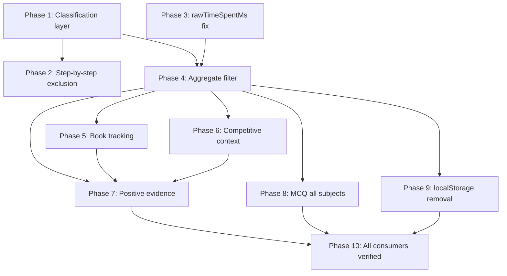

# Diagnostic Truth Fix Plan — Final Complete Version

## Non-Negotiable Constraints

- No visible timer in normal learning/practice. Challenge/speed keep their timers.
- Raw elapsed time is never discarded. `rawTimeSpentMs` and `creditedTimeMs` are always two separate fields.
- `afterStepByStep=true` → excluded from `diagnosticAccuracy`. Not a labeled subset. Excluded.
- No parent reward system. `LEO_REWARD_CHOICE` is removed, not migrated.
- `LEO_MONTHLY_PROGRESS`, parent rewards page, and all progress displays derive from DB/server — localStorage is UI cache only.
- Learning mode, step-by-step, book reading = positive learning behavior, never diagnostic success.
- Book CTA practice = diagnostic eligible only if `contextAfterBookReading=true` AND mode is independent practice.
- All reports visible to humans (parent, teacher, class, school) use `diagnosticAccuracy` only.
- `rawActivityAccuracy` (mixing all modes) exists only as an internal/technical field, never displayed.
- Challenge/speed/marathon earn coins if they count as credited learning time. No zero-coin penalty for choosing harder modes.
- All 6 subjects (math, geometry, hebrew, english, science, moledet_geography), all question sources, and all activity types are in scope together. No partial synchronization.
- Each phase has a mandatory test gate before the next phase begins.
- No code, no migrations, no commits until each phase is approved.

---

---

## Credit Time Policy — Defined for All Activity Types

Every activity type has two time values that must always travel together:
- `rawTimeSpentMs` — real elapsed wall time (never discarded, never replaced)
- `creditedTimeMs` — capped, visibility-aware time used for coins/reports/progress

| Activity type | Credit tier | Per-question cap (flag ON) | Visibility-aware? |
|---|---|---|---|
| Normal MCQ (math/geom/etc.) | `default` | 300 s | Yes — tab hide pauses credit |
| Hard MCQ (word problem, multi-step) | `hard` | 480 s | Yes |
| Reading comprehension | `long_reading` | 600 s | Yes |
| Challenge mode | `legacy_game` | 120 s | Yes |
| Speed mode | `legacy_game` | 120 s | Yes |
| Marathon mode | `default` | 300 s | Yes |
| Learning book (reading) | `long_reading` | 600 s per session | Yes |
| Assigned activity (per question) | `default` | `creditedTimeMs` capped at 300 s; `rawTimeSpentMs` never capped | No — no visibility ledger; `timingStatus` records over-cap/long/very_long |
| Parent-assigned activity | `default` | `creditedTimeMs` capped at 300 s; `rawTimeSpentMs` never capped | No |
| Step-by-step / explanation time | `learning_guided` — credited like other guided learning, visibility-aware where available | 300 s (default tier) | Yes where ledger exists |
| Discussion activity | Not credited (no answer, no learning time signal) | — | — |

The `NEXT_PUBLIC_LEARNING_TIME_FAIRNESS_V1` flag must be confirmed ON in all environments before Phase 1 deploys. If it is OFF, the tiers above do not apply and all modes get the legacy 120 s cap.

**Session maximum regardless of tier: 3 hours (10,800,000 ms).**

---

## Activity Classification Matrix — Complete

The core classification function `classifyActivityEvidence(mode, source, context)` must cover every activity type in the system. The output is an `evidenceCategory` enum and `isDiagnosticEligible` boolean.

### Free-practice answers (`answers` table, from 6 learning masters)

| mode | evidenceCategory | isDiagnosticEligible | Notes |
|---|---|---|---|
| `practice` | `diagnostic_independent` | true | Core diagnostic signal |
| `graded` | `diagnostic_independent` | true | Assessed practice |
| `drill` | `diagnostic_independent` | true | Targeted independent |
| `review` | `diagnostic_independent` | true | Spaced repeat — cold |
| `normal` | `diagnostic_independent` | true | Legacy neutral mode |
| `practice_mistakes` | `diagnostic_guided` | true (with flag) | Targeted retry — eligible but context-flagged as retry |
| `challenge` | `diagnostic_competitive` | true | Eligible — separate bucket only |
| `speed` | `diagnostic_competitive` | true | Eligible — fluency bucket |
| `marathon` | `diagnostic_competitive` | true | Eligible — endurance bucket |
| `learning` | `learning_guided` | false | Explanation visible, answer leakage possible |
| `mistakes` | `learning_review` | false | Not a cold probe |
| `unknown` / missing | `unclassified` | false | No mode evidence |

Context overrides (applied after mode classification):
- `afterStepByStep=true` → forces `isDiagnosticEligible=false`, `evidenceCategory="learning_guided"` regardless of mode
- `contextAfterBookReading=true` + mode=`practice` → eligible (contextual note added)
- `hintsUsed > 0` → sets `hasHints=true` context flag (does not change eligibility)

### Assigned activity answers (`student_activity_attempts` table)

| activity mode | evidenceCategory | isDiagnosticEligible | Notes |
|---|---|---|---|
| `quiz` | `diagnostic_independent` | true | Graded, independent |
| `graded` | `diagnostic_independent` | true | Same as quiz |
| `homework` | `diagnostic_independent` | true | Assumed independent at home |
| `live_lesson` | `diagnostic_guided` | true (with flag) | Teacher present — context-flagged |
| `guided_practice` | `learning_guided` | false | Guided with hints/explanation — not independent |
| `discussion` | `learning_context` | false | No accuracy diagnostic |
| `worksheet` | `diagnostic_independent` | true | If student answered independently |

**All of these modes must be added to `LEARNING_GAME_MODE_ALLOWLIST`** in `lib/learning-supabase/learning-activity.js`. None may fall to `unknown`.

### Parent-assigned activity answers (`parent_activity_attempts` table)

Inherit `evidenceCategory` from `parent_assigned_activities.mode` using the same matrix above.

### Classroom activity rollup (`classroom_activity_student_status` table)

The rollup aggregates `answers_count` and `correct_count` from status rows. Classification must be applied at merge time using the activity's `mode` field from `classroom_activities`.

### Learning book sessions (new, Phase 5)

| event | evidenceCategory | isDiagnosticEligible |
|---|---|---|
| Book reading session | `learning_book` | false |
| Practice launched from book CTA + mode=practice | `diagnostic_independent` with `contextAfterBookReading=true` | true |
| Practice launched from book CTA + mode=learning | `learning_guided` | false |

### Legacy / backfill policy

Existing rows with no classification field are tagged `legacy_unclassified`. Rules:
- `legacy_unclassified` rows with `gameMode` in `answer_payload` → backfill classification using the matrix above via a one-time migration script
- `legacy_unclassified` rows without `gameMode` → stay `unclassified`, treated as `isDiagnosticEligible=false`
- `legacy_unclassified` rows are never used for strong mastery claims
- They may be shown as historical activity in a low-confidence context
- A backfill script `scripts/backfill-activity-classification.mjs` must be written and tested before Phase 4 deploys

---

## Phase 1 — Activity Classification Layer (foundation for everything)

**Goal:** Implement `classifyActivityEvidence` as the system's single source of classification truth. Write `evidenceCategory`, `isDiagnosticEligible`, and context flags into `answer_payload` JSONB at API write time for all three answer tables. Expand `LEARNING_GAME_MODE_ALLOWLIST` to include all assigned activity modes.

**Files affected:**
- New: `lib/learning/activity-classification.js` — pure function `classifyActivityEvidence(mode, source, context)` → `{ isDiagnosticEligible, evidenceCategory, contextFlags }`. No I/O. No side effects. Covers the full matrix above.
- `lib/learning-supabase/learning-activity.js` — expand `LEARNING_GAME_MODE_ALLOWLIST` to include `guided_practice`, `homework`, `quiz`, `live_lesson`, `discussion`, `learning_book`. Add `DIAGNOSTIC_ELIGIBLE_MODES` and `EVIDENCE_CATEGORY_MAP` exports.
- `pages/api/learning/answer.js` — call `classifyActivityEvidence` with the resolved mode and context flags; write `{ evidenceCategory, isDiagnosticEligible, contextFlags }` into `answer_payload` before the DB insert
- `pages/api/student/activities/[activityId]/answer.js` — same: classify using the activity's mode from the activity row; write into the JSONB payload at insert time
- `lib/parent-server/report-data-aggregate.server.js` — read `isDiagnosticEligible` from `answer_payload` when classifying answers; for rows where the field is missing, fall back to re-classifying from `gameMode` using the same function (never assume eligible for unclassified rows)
- New: `scripts/backfill-activity-classification.mjs` — offline backfill script: reads all `answers` rows in batches, classifies from `answer_payload.gameMode`, writes `evidenceCategory` + `isDiagnosticEligible` back into `answer_payload`

**Migration:** No schema change. All classification data lives in existing JSONB columns. Backfill script is run once before Phase 4 deploys. Until backfill completes, the aggregator's fallback path applies. After backfill, the fallback path is retained for safety but should never trigger for post-Phase-1 rows.

**Phase 1 test gate (mandatory before Phase 2):**
- Unit: `classifyActivityEvidence` — 100% branch coverage of the full matrix (all 11 free-practice modes, all 7 assigned modes, all 3 book modes, all 3 context overrides)
- Unit: API handler `pages/api/learning/answer.js` — `learning` mode answer written with `isDiagnosticEligible=false`
- Unit: API handler — `practice` mode answer written with `isDiagnosticEligible=true`
- Unit: API handler — `afterStepByStep=true` context override → `isDiagnosticEligible=false` regardless of mode
- Unit: `guided_practice` assigned activity written with `isDiagnosticEligible=false`
- Unit: `quiz` assigned activity written with `isDiagnosticEligible=true`
- Unit: backfill script correctly classifies a row with `gameMode="learning"` → `isDiagnosticEligible=false`
- Unit: backfill script correctly classifies a row with missing `gameMode` → `isDiagnosticEligible=false`, `evidenceCategory="unclassified"`

---

## Phase 2 — Step-by-Step Tracking and Diagnostic Exclusion

**Goal:** Any answer submitted after the student opened a step-by-step explanation, solution path, or hint explanation is excluded from `diagnosticAccuracy`. It is not "labeled separately" — it does not enter the diagnostic bucket at all. It enters `learningActivity` as positive learning behavior.

**Rule:** `afterStepByStep=true` → `isDiagnosticEligible=false`, `evidenceCategory="learning_guided"`. This override is applied inside `classifyActivityEvidence` and cannot be reverted by mode.

**What counts as "step-by-step viewed":** Any of the following opens mid-question → sets the flag for that question's answer:
- Step-by-step modal opened (`showStepByStep` state goes true)
- Solution explanation modal opened (`showExplanation` / `showSolutionSteps` / `showHint` in any master)
- Error explanation modal opened (`showErrorExplanation`)
- Column addition / animated explanation opened

**Implementation in all 6 masters:**
- Add `stepByStepViewedForCurrentQuestionRef = useRef(false)` to each master
- Set to `true` in each handler that opens any explanation/hint/step UI
- Reset to `false` at the start of each new question (when `currentQuestion` changes)
- Pass `clientMeta.afterStepByStep: stepByStepViewedForCurrentQuestionRef.current` in `saveAnswerInParallel` (or equivalent per-master answer save function)

**API side:** `pages/api/learning/answer.js` passes `clientMeta.afterStepByStep` as a context flag into `classifyActivityEvidence`. Phase 1 already wires this.

**What the report does with these answers:**
- They count as `learningActivity.stepByStepCount` per topic
- The time spent on them counts as credited learning time (`learning_guided` tier) — eligible for coins on the same basis as other learning activity
- They appear in parent/teacher reports as: "used step-by-step to work through this topic" (positive persistence signal)
- They are never displayed as "correct answers" in diagnostic accuracy
- They are never used for mastery claims

**Files affected:**
- `pages/learning/math-master.js` — `stepByStepViewedForCurrentQuestionRef`, wire to all explanation-opening handlers
- `pages/learning/geometry-master.js` — same
- `pages/learning/hebrew-master.js` — same
- `pages/learning/english-master.js` — same
- `pages/learning/science-master.js` — same
- `pages/learning/moledet-geography-master.js` — same
- `lib/learning/activity-classification.js` — `afterStepByStep=true` override (already defined in Phase 1 matrix)

**Risk:** Each master has multiple explanation-opening paths. Missing one means the flag is not set for that path. Before implementation, all explanation triggers in each master must be enumerated. The audit found these for math-master: `showHint`, `showStepByStep`, `showExplanation`, `showErrorExplanation`, `getAdditionStepsColumn` animation, `buildStepExplanation` modal. Each master may have different trigger names.

**Phase 2 test gate (mandatory before Phase 3):**
- Unit: `classifyActivityEvidence` with `context.afterStepByStep=true` and `mode="practice"` → `isDiagnosticEligible=false`
- Unit: `classifyActivityEvidence` with `context.afterStepByStep=true` and `mode="challenge"` → `isDiagnosticEligible=false`
- Unit: `stepByStepViewedForCurrentQuestionRef` resets on question change
- Unit: `stepByStepViewedForCurrentQuestionRef` set to `true` when hint modal opened
- Integration: math-master answer submitted after step-by-step open → DB row has `isDiagnosticEligible=false` in payload
- Integration: math-master answer submitted without step-by-step → DB row has `isDiagnosticEligible=true` (for practice mode)

---

## Phase 3 — Timing Truth: rawTimeSpentMs + creditedTimeMs + timingStatus Everywhere

**Goal:** Every answer row — free-practice and assigned — carries both raw and credited time, plus a `timingStatus` field that gives the engine context about how the time was spent. Raw time is never replaced by a cap. The cap produces a separate credited value.

**Current confirmed bug:** `pages/student/activity/[activityId].js` line 192 hardcodes `timeSpentMs: 5000`. This produces fake data in every `student_activity_attempts` row.

**Required data shape for ALL answer submissions (free-practice and assigned):**

```
rawTimeSpentMs     — actual elapsed milliseconds (never capped, never replaced)
creditedTimeMs     — visibility-aware capped milliseconds (used for coins/reports)
timingStatus       — enum: "normal" | "long" | "very_long" | "over_credit_cap"
                           | "hidden_tab" | "idle_suspected" | "no_timer"
explanationViewed  — boolean (was an explanation shown before submit)
hintsUsed          — integer (0 if no hints shown)
afterStepByStep    — boolean (from Phase 2)
```

**For assigned activities (`pages/student/activity/[activityId].js`):**
- Add `questionStartTimeRef = useRef(null)`, set to `Date.now()` when `effectiveIdx` changes
- On `submitAnswer`: compute `rawMs = Date.now() - questionStartTimeRef.current`
- `rawMs` is stored as-is — never capped, never replaced, never discarded
- Compute `creditedMs = Math.min(rawMs, 300_000)` (default tier cap; assigned activities have no visibility ledger)
- Derive `timingStatus`:
  - `rawMs <= 300_000` → `"normal"`
  - `300_000 < rawMs <= 600_000` → `"long"`
  - `rawMs > 600_000` → `"very_long"`
  - Any `rawMs > 300_000` also carries `"over_credit_cap"` alongside the above
- Track `explanationViewedRef = useRef(false)` — set to `true` when `feedback.explanation` is shown (for `guided_practice`/`homework` modes)
- Send `{ rawTimeSpentMs, creditedTimeMs, timingStatus, explanationViewed, hintsUsed: 0 }` in the request body
- The server stores both raw and credited into `student_activity_attempts` via new columns or existing JSONB

**For free-practice masters (all 6):**
- These already use `QuestionTimeLedger.closeQuestion()` which returns `{ creditedMs, rawWallMs }`
- Currently only `creditedMs` is passed as `timeSpentMs` to `saveLearningAnswer` — the raw value is discarded
- Fix: pass both `rawTimeSpentMs: rawWallMs` and `creditedTimeMs: creditedMs` in the answer payload
- Derive `timingStatus` from the ledger's `{ tier, tierCapMs, fairnessEnabled }` return values

**DB storage:**
- `answers` table: `rawTimeSpentMs` and `creditedTimeMs` stored inside `answer_payload` JSONB — no schema change
- `student_activity_attempts` table: two options:
  - a) Add `raw_time_spent_ms` and `credited_time_ms` columns (schema migration needed)
  - b) Store in existing `question_snapshot` JSONB column (no schema migration)
  - Decision: option (a) preferred for query clarity; migration is small and safe

**What the engine/report uses:**
- `creditedTimeMs` for coins, learning time display, monthly progress
- `rawTimeSpentMs` stored but not displayed; available for future anomaly detection
- `timingStatus` available to the aggregator as a signal (e.g., `very_long` answers in a topic = possible struggle or distraction)

**Existing rows:** All `student_activity_attempts` rows with `time_spent_ms=5000` are tagged `legacy_fabricated_timing` in the backfill classification script. They are excluded from any average-time-per-question calculations in the engine.

**Files affected:**
- `pages/student/activity/[activityId].js` — full timing fix (line 192 and surrounding logic)
- `pages/api/student/activities/[activityId]/answer.js` — accept and store `rawTimeSpentMs`, `creditedTimeMs`, `timingStatus`
- `lib/teacher-server/student-activity-play.server.js` — update `recordStudentActivityAnswer` to write both time fields
- `pages/learning/math-master.js` (and all 5 other masters) — pass `rawWallMs` from ledger alongside `creditedMs`
- `pages/api/learning/answer.js` — accept `rawTimeSpentMs` and `creditedTimeMs` separately in `answer_payload`
- New DB migration: add `raw_time_spent_ms` and `credited_time_ms` to `student_activity_attempts`

**Phase 3 test gate (mandatory before Phase 4):**
- Unit: assigned activity page — `rawTimeSpentMs` in submit body = actual elapsed time (≥ real elapsed)
- Unit: assigned activity page — `creditedTimeMs = Math.min(rawMs, 300_000)`
- Unit: assigned activity page — `timingStatus = "very_long"` when `rawMs > 600_000`
- Unit: `explanationViewed = true` when `feedback.explanation` was shown
- Unit: free-practice master — both `rawTimeSpentMs` and `creditedTimeMs` present in `saveLearningAnswer` call
- Integration: `answers` table row after Phase 3 has `answer_payload.rawTimeSpentMs` > 0
- Integration: no `answer_payload.rawTimeSpentMs = 5000` in any new row after Phase 3
- Regression: old rows with `time_spent_ms=5000` in `student_activity_attempts` have `legacy_fabricated_timing` flag after backfill

---

## Phase 4 — Aggregate Filter: diagnosticAccuracy is the Only Visible Accuracy

**Goal:** `aggregateReportPayloadFromActivityRows` produces two completely separate accumulators. `diagnosticAccuracy` is the only accuracy metric that appears in any human-facing report. `rawActivityAccuracy` (all modes mixed) exists only as an internal/audit field, never exposed to parent, teacher, school, or student.

**Prerequisite:** Phase 1 backfill script must have run successfully before Phase 4 deploys. No unclassified rows should remain in the relevant date range.

**Two accumulators in the aggregator:**

**Accumulator A — diagnostic:**
- Accepts only rows where `isDiagnosticEligible=true`
- Subdivided into:
  - `diagnostic_independent` bucket (practice/graded/drill/review/normal/homework/quiz)
  - `diagnostic_competitive` bucket (challenge/speed/marathon) — separate, not mixed into independent
- Produces: `diagnosticAnswers`, `diagnosticCorrect`, `diagnosticWrong`, `diagnosticAccuracy` (per subject, per topic, per grade-slice)
- Also produces: `competitiveAnswers`, `competitiveCorrect`, `competitiveAccuracy` per mode within competitive bucket

**Accumulator B — learning activity:**
- Accepts only rows where `isDiagnosticEligible=false`
- Subdivided into:
  - `learning_guided` (learning mode answers)
  - `learning_review` (mistakes mode)
  - `learning_book` (book session rows from Phase 5)
  - `learning_step_by_step` (afterStepByStep=true answers)
- Produces: `learningAnswers`, `learningSessionCount`, `stepByStepCount`, `bookReadingMinutes`, `selfDirectedPracticeCount`

**Internal-only field:** `_rawActivityAccuracy` — computed from all answers regardless of classification, stored in `payload.meta` for technical auditing only. Never exposed via any API response to human-facing consumers.

**Payload shape change (per subject and per topic):**

```
// REPLACES the old contaminated fields:
diagnosticAnswers     (replaces: answers)
diagnosticCorrect     (replaces: correct)
diagnosticWrong       (replaces: wrong)
diagnosticAccuracy    (replaces: accuracy — this is the canonical accuracy number)

// NEW fields:
competitiveAnswers
competitiveCorrect
competitiveAccuracy
learningAnswers
learningSessionCount
stepByStepCount
bookReadingMinutes    (phase 5)
selfDirectedPracticeCount

// INTERNAL ONLY (in payload.meta, never in subjects[]):
_rawActivityAccuracy
```

**Report consumer migration — all consumers switch simultaneously with Phase 4:**

All of the following files must read `diagnosticAccuracy` (not `accuracy`) and be updated in the same deployment:
- `lib/parent-server/parent-report-parent-facing.server.js` — `buildParentInsightsHe`, `buildHomeRecommendationsHe`
- `lib/teacher-server/teacher-guidance-v2.server.js` — `buildStudentTeacherGuidanceV2`
- `lib/teacher-server/teacher-report.server.js` — `sanitizeReportPayloadForTeacher`
- `lib/guardian-server/guardian-report.server.js` — `buildGuardianStudentReportPayload`
- `lib/teacher-server/classroom-activity-class-report.server.js` — `mergeClassroomActivityRollupIntoReportPayload` must classify each activity's mode using the classification matrix before merging
- `lib/learning-supabase/report-data-adapter.js` — client-facing adapter
- `lib/learning-supabase/seed-db-report-local-storage.js` — deprecated (see Phase 9); if it must exist temporarily, it seeds from `diagnosticAccuracy`
- `lib/learning-supabase/parent-dashboard-report-bridge.js` — deprecated (see Phase 9)

**Parent activity attempts:** The guardian report API (`pages/api/guardian/student/[studentId]/report-data.js`) must pass `includeParentActivities: true` to `aggregateParentReportPayload`. This was previously excluded — it must be included and classified using the matrix.

**Phase 4 test gate (mandatory before Phase 5):**
- Unit: 10 learning-mode answers at 100% + 5 practice answers at 40% → `diagnosticAccuracy=40%`, `learningAnswers=10`
- Unit: 5 challenge answers at 50% → `competitiveAccuracy=50%`, `diagnosticAccuracy` not affected
- Unit: `afterStepByStep=true` answers do not appear in `diagnosticAnswers`
- Unit: classroom rollup — `quiz` mode activity → goes to `diagnosticAnswers`, not `learningAnswers`
- Unit: classroom rollup — `guided_practice` mode activity → goes to `learningAnswers`
- Integration: guardian report API response — `subjects.math.diagnosticAccuracy` present and clean
- Contract: guardian report `diagnosticAccuracy` equals teacher report `diagnosticAccuracy` for same student + range
- Contract: `_rawActivityAccuracy` is NOT present in any human-facing API response body
- Contract: parent activity attempts appear in guardian report after fix (they were missing before)

---

## Phase 5 — Learning Book Full Tracking

**Goal:** Book reading has a complete, first-class presence in the DB. Reading time appears in reports as learning context only — never in diagnostic accuracy. The book architecture must be mapped before implementation begins.

**Architecture mapping required before Phase 5 implementation:**

The audit found `lib/learning-book/` contains catalog/nav/content logic but zero tracking. Book pages render via:
- `getMathG1BookHref` returns a URL, clicked from `math-master.js`
- `lib/learning-book/learning-book-catalog.js` provides page/chapter data
- No page component in `pages/` was found

Before Phase 5 can be implemented, the following must be determined:
- Where are book pages rendered? (`pages/learning/book/[bookId].js`? Embedded in masters? Not yet built?)
- Is there a book page component, and if not, does Phase 5 build it?
- How does the student navigate between book pages?

**Tracking design — full event model:**

Events to track per book session:

| event | when fired | data |
|---|---|---|
| `book_session_start` | book page loads | `bookId`, `subject`, `gradeLevel`, `chapterId` |
| `book_page_view` | student lands on a page (debounced, ≥2s dwell) | `pageIndex`, `dwellMs` |
| `book_page_skip` | student navigates away from page in < 2s | `pageIndex`, `dwellMs` |
| `book_session_end` | student leaves book page (unload/navigate away) | `totalDwellMs`, `pagesViewed`, `pagesSkipped`, `hiddenTabMs` |

**Visibility-aware dwell time:**
- Book pages use the same `useLearningVisibilityClock` hook as the masters
- `hiddenTabMs` is tracked separately; not credited toward reading time
- Credited dwell time per session = total dwell minus hidden time, capped at 600s (`long_reading` tier)
- Pages with `dwellMs < 2000` are counted as skips, not reads — cannot generate reading credit from rapid scrolling

**DB storage:**
- Book session rows written into `learning_sessions` with `metadata.mode = "learning_book"`, `metadata.bookId`, `metadata.pagesViewed`, `metadata.creditedDwellMs`
- No new table needed — uses existing `learning_sessions` table
- `duration_seconds` = credited dwell seconds (capped, visibility-aware)

**CTA → practice flow (`contextAfterBookReading`):**
- When student clicks a practice CTA button inside a book, the book page writes `sessionStorage.setItem("liosh_lastBookContext", JSON.stringify({ bookId, subject, topic }))` before routing
- Each master reads `sessionStorage.getItem("liosh_lastBookContext")` on startup — if present and timestamp < 5 minutes ago, sets `clientMeta.contextAfterBookReading = true` for the first answer of that session and clears the key
- Classification for that session's answers:
  - mode=`practice` + `contextAfterBookReading=true` → `isDiagnosticEligible=true` (independent practice after self-directed reading)
  - mode=`learning` + `contextAfterBookReading=true` → `isDiagnosticEligible=false` (still guided)

**What appears in reports:**
- Parent report: "Read [subject] learning book — [N] minutes" in learning activity section
- Teacher report: same — book sessions visible as learning time, not diagnostic
- Diagnostic: completely excluded from `diagnosticAccuracy`
- Positive evidence: book reading + subsequent practice improvement → "self-directed learning" signal (Phase 7)

**Files affected:**
- Book page component (location to be confirmed during Phase 5 pre-work)
- `pages/api/learning/book/event.js` — new endpoint for session_start/session_end writes to `learning_sessions`
- `hooks/useLearningVisibilityClock.js` — reused, no change
- `lib/learning-book/learning-book-catalog.js` — export `getBookSessionMeta(bookId)` for subject/grade/topic lookup
- All 6 masters — read `sessionStorage` for `contextAfterBookReading` on startup
- `lib/parent-server/report-data-aggregate.server.js` — route `learning_book` sessions to `learningActivity` accumulator (Phase 4 prerequisite)
- `lib/learning-supabase/learning-activity.js` — add `learning_book` to allowlist

**Phase 5 test gate (mandatory before Phase 6):**
- Unit: book session row with `metadata.mode="learning_book"` → `evidenceCategory="learning_book"`, `isDiagnosticEligible=false`
- Unit: page dwell < 2s → counted as skip, not credited reading time
- Unit: 10 minutes in book with 3 minutes hidden tab → credited dwell = 7 minutes (capped at 600s)
- Unit: `contextAfterBookReading=true` + mode=`practice` → `isDiagnosticEligible=true`
- Unit: `contextAfterBookReading=true` + mode=`learning` → `isDiagnosticEligible=false`
- Integration: book session row appears in parent report as `learningActivity.bookReadingMinutes`, not in `diagnosticAnswers`
- Integration: master startup reads `sessionStorage` key and sets flag on first answer only

---

## Phase 6 — Challenge/Speed/Marathon: Competitive Bucket and Context Framing

**Goal:** Competitive modes (challenge/speed/marathon) are separated into their own `diagnostic_competitive` bucket in Phase 4. Phase 6 adds the insight layer that interprets these correctly — and confirms that a student is never penalized in diagnostic accuracy or coins for choosing harder modes.

**Coin rule:** Challenge/speed/marathon sessions earn coins if they produce credited learning time. They use the `legacy_game` tier (120s cap) for challenge and speed, and `default` tier (300s) for marathon. There is no mode-based coin disqualification. A child who plays challenge mode earns coins the same way as a child who does practice, assuming equivalent credited time. The only difference is the cap level. This rule is already implied by the credit time policy — Phase 6 confirms it is implemented and not overridden.

**Interpretation rules for the competitive bucket:**

| mode | interpretation | insight type |
|---|---|---|
| `speed` | fluency — automatic recall under time pressure | Speed accuracy ≥ 70% with ≥ 10 answers → "fast and accurate" |
| `challenge` | difficulty — attempted harder content | Any challenge session → "took on hard problems"; accuracy ≥ 60% → "succeeded at challenge level" |
| `marathon` | endurance — sustained focus across many questions | ≥ 30 answers in session → "strong sustained focus"; accuracy stable across session → "consistent under pressure" |

**Key rule:** A student with 50% diagnostic accuracy in `challenge` mode must NOT generate a "weakness" insight. Challenge mode is hard by design. Low accuracy in challenge may be positive (attempted difficult content). The insight engine must check `competitiveAccuracy` independently from `diagnosticAccuracy`.

**Payload fields added in Phase 4 that Phase 6 uses:**
- `subjects[subject].competitiveAnswers`
- `subjects[subject].competitiveAccuracy`
- `subjects[subject].byMode.speed.answers`, `.accuracy`, `.avgTimeMs`
- `subjects[subject].byMode.challenge.answers`, `.accuracy`
- `subjects[subject].byMode.marathon.answers`, `.sessionCount`, `.avgSessionLength`

**Files affected:**
- `lib/parent-server/parent-report-parent-facing.server.js` — add `detectCompetitiveSignals(subjects)` function; produce competitive insights in `buildParentInsightsHe`
- `lib/teacher-server/teacher-guidance-v2.server.js` — add competitive context block
- `lib/parent-server/report-data-aggregate.server.js` — ensure per-mode accuracy buckets are computed within the competitive accumulator (may be Phase 4 already, confirmed here)
- `lib/learning-supabase/learning-coin-award.server.js` — confirm no mode-based zero-coin path exists; remove any such guard if present

**Phase 6 test gate (mandatory before Phase 7):**
- Unit: 15 challenge answers at 45% → no "weakness" insight generated; instead generates "attempted challenge" insight
- Unit: 20 speed answers at 85% → generates fluency insight
- Unit: 35 marathon answers in one session → generates endurance insight
- Unit: challenge accuracy does NOT appear in `diagnosticAccuracy`
- Unit: `awardLearningSessionCoins` — challenge session with 120s credited time → coins awarded (not zero)
- Unit: speed session with 60s credited time → coins awarded (not zero)

---

## Phase 7 — Positive Evidence Engine

**Goal:** The engine is redesigned to detect strengths, persistence, and improvement as primary signals — not secondary additions. Every report must include at least one positive signal when evidence exists. "Not enough data" is an explicit state, not silence.

**Confidence thresholds — no claim made without these minimums:**

| Signal | Minimum evidence required |
|---|---|
| Mastery / "strong in X" | ≥ 8 diagnostic answers, accuracy ≥ 80% |
| Improvement | ≥ 4 days of activity; second half accuracy > first half by ≥ 8% |
| Persistence with difficulty | ≥ 5 answers with `correctManyHintsAnswers ≥ 2` |
| Self-directed learning | ≥ 3 learning sessions + subsequent practice accuracy ≥ 70% |
| Post-step-by-step improvement | ≥ 3 step-by-step uses + practice accuracy ≥ 65% in same topic |
| Challenge success | ≥ 10 challenge answers, accuracy ≥ 55% |
| Speed fluency | ≥ 15 speed answers, accuracy ≥ 70% |
| Marathon endurance | ≥ 30 marathon answers in a session or across sessions |
| "Not enough data" | < 5 diagnostic answers for a topic (no accuracy claim made) |
| Post-book-reading improvement | ≥ 5 post-book practice answers, accuracy ≥ 65% |
| Retry success | ≥ 3 `practice_mistakes` answers correct after prior wrong answers in same topic |

**Complete list of positive signals to detect:**

- `mastery` — stable diagnostic accuracy ≥ 80%, ≥ 8 answers
- `improvement` — second-half better than first-half by 8%+ over ≥ 4 days
- `persistence_hints` — correct answers after many hints, not giving up
- `independent_practice` — success without hints (`hintsUsed=0`, correct, ≥ 8 answers)
- `self_directed_learning` — learning sessions + subsequent practice improvement
- `post_book_improvement` — `contextAfterBookReading=true` answers with good accuracy
- `step_by_step_learner` — used step-by-step guidance (counts as credited learning time and positive persistence behavior), then succeeded in independent practice in the same topic
- `challenge_attempt` — attempted challenge mode regardless of accuracy
- `challenge_success` — challenge accuracy ≥ 55% with ≥ 10 answers
- `speed_fluency` — speed mode accuracy ≥ 70% with ≥ 15 answers
- `marathon_endurance` — marathon session ≥ 30 answers
- `retry_success` — `practice_mistakes` mode answers correct in topics where student previously struggled
- `sustained_focus` — marathon accuracy stable (< 15% drift) across session

**"Not enough data" handling:**
- Any topic with < 5 diagnostic answers: `diagnosticConfidence = "insufficient"` — no mastery or weakness claim
- Report must say this explicitly if a topic appears at all: "We don't have enough practice data for [topic] yet"
- This is a required field in the topic slice output, not optional

**What the engine must stop producing:**
- No weakness insight about a topic with < 3 diagnostic answers
- No "struggling" signal that uses `rawActivityAccuracy` (all-modes mixed)
- No negative insight about challenge/speed/marathon accuracy specifically
- No generic "keep practicing" without any topic evidence

**Files affected:**
- `lib/parent-server/parent-report-parent-facing.server.js` — complete rewrite of `buildParentInsightsHe` and `buildHomeRecommendationsHe` using the signals above; all reads switch to `diagnosticAccuracy`
- `lib/teacher-server/teacher-guidance-v2.server.js` — same positive signal additions for teacher view
- `lib/parent-server/report-data-aggregate.server.js` — add `diagnosticConfidence` to topic slices

**Phase 7 test gate (mandatory before Phase 8):**
- Unit: topic with 2 diagnostic answers → `diagnosticConfidence="insufficient"`, no accuracy insight
- Unit: topic with 9/10 diagnostic correct → `mastery` signal generated
- Unit: `correctManyHintsAnswers=3` in topic with ≥5 answers → `persistence_hints` insight
- Unit: step-by-step count ≥ 3 in topic where practice accuracy ≥ 65% → `step_by_step_learner` insight
- Unit: challenge accuracy 48% with 12 answers → `challenge_attempt` insight, NOT a weakness insight
- Unit: speed accuracy 72% with 16 answers → `speed_fluency` insight
- Unit: `buildParentInsightsHe` — output includes at least one positive signal when mastery threshold is met
- Unit: no insight uses `_rawActivityAccuracy` or the old mixed `accuracy` field

---

## Phase 8 — MCQ Engine Compatibility: All Subjects, All Grades, All Question Sources

**Goal:** Every question in the system, from every source, must expose a defined set of metadata fields so the engine can classify answers meaningfully. This is not math-only. It covers all 6 subjects and all question sources.

**Required question metadata fields (must be present for diagnostic use):**

| Field | Required | Source |
|---|---|---|
| `subject` | Yes | master/generator/activity config |
| `grade` | Yes | master session context |
| `topic` | Yes | generator/activity config |
| `subtopic` | Preferred | generator params or activity config |
| `skillId` / `diagnosticSkillId` | Preferred | `mergeDiagnosticContractIntoParams` or manual |
| `questionType` | Yes | `"mcq"` / `"open"` / `"numeric"` / `"text"` |
| `difficulty` | Preferred | `params.difficulty` or `params.levelKey` |
| `generatorKind` | Yes | `params.kind` |
| `allAnswerChoices` | Yes for MCQ | the full `answers[]` array with option objects |
| `correctAnswer` | Yes | generator output |
| `selectedAnswer` | Yes | user selection — stored as option object for MCQ |
| `distractorFamily` | Where possible | attached to each option in `answers[]` |
| `isDiagnosticEligible` | Yes | from Phase 1 classification |
| `answerLeakageRisk` | Yes | `"none"` / `"step_by_step_shown"` / `"explanation_shown"` |

**Coverage by subject and question source:**

**Math (math-master, `utils/math-question-generator.js`):**
- `buildMathMcqAnswerList` enriched to return `{ value, distractorFamily }` objects for all tagged distractor types
- Addition: `"mul_instead_of_add"`, `"sub_instead_of_add"`, carry error `"carry_ignored"`
- Subtraction: `"add_instead_of_sub"`, delta confusion
- Multiplication: `"add_instead_of_mul"`, off-by-one operand
- Division: `"divisor_as_quotient"`, `"dividend_as_quotient"`
- Fractions: `"fraction_flip"`, off-by-one numerator/denominator
- Word problems: `"wrong_operation_wp"`, partial result selection
- Fallback generic distractors: tagged `"generic_proximity"` — engine knows these are non-diagnostic

**Geometry (geometry-master):** Requires audit of geometry question generator for distractor logic. Must expose `subtopic` (e.g., "perimeter", "area", "angles"), `distractorFamily` where possible (e.g., `"confused_perimeter_area"`, `"wrong_formula"`).

**Hebrew (hebrew-master):** Questions are a mix of MCQ and open/audio. MCQ questions must expose `distractorFamily` tags. Reading comprehension questions must be marked `isDiagnosticEligible` only when no passage is shown during answering. Grammar questions must tag distractors (e.g., `"wrong_gender"`, `"wrong_tense"`, `"root_confusion"`).

**English (english-master):** MCQ vocabulary/grammar questions must tag distractors. Passage-based reading comprehension: answer leakage risk is `"passage_shown"` → must be flagged; the engine should treat these with lower confidence. Translation questions: open-ended, no `distractorFamily`.

**Science (science-master):** MCQ concept questions must expose `subtopic` and `distractorFamily` where the distractor represents a specific misconception (e.g., `"confuses_heat_temperature"`, `"confuses_force_energy"`). Experiment-based questions: no distractor family possible for open-ended; mark as `questionType="open"`.

**Moledet/Geography (moledet-geography-master):** Map-based and concept MCQ. Must expose `subtopic`, geographic context, and `distractorFamily` for concept confusions.

**Assigned activities (teacher/parent/classroom):** Questions stored in activity snapshots. The `question_snapshot` JSONB must expose `allAnswerChoices`, `correctAnswer`, `distractorFamily` where the activity creator provided them. If not present, mark `distractorFamily=null` and flag as `"non_diagnostic_distractor"`.

**Answer leakage audit per question type:**

| Question type | Leakage risk | Rule |
|---|---|---|
| MCQ, no explanation shown | `"none"` | Fully diagnostic |
| MCQ, after step-by-step | `"step_by_step_shown"` | `isDiagnosticEligible=false` (Phase 2) |
| MCQ, explanation shown mid-question | `"explanation_shown"` | `isDiagnosticEligible=false` |
| Open numeric, correct answer not revealed | `"none"` | Diagnostic |
| Reading comprehension with passage visible | `"passage_visible"` | Flagged; lower confidence |
| Correct answer length/format leak | Audited per question in generator | Tagged if identified |
| RTL/LTR display inconsistency | Audited per subject | Tagged if identified |

**Distractor quality check — not just tagging:**
If a distractor has no `distractorFamily` and is generated by the fallback proximity loop (generic nearby numbers), the engine must treat that wrong answer as `"non_diagnostic_proximity"` — it cannot infer a specific misconception from it. The report should only cluster misconceptions when `distractorFamily` is a named family, not proximity.

**`allAnswerChoices` must be sent to the server:**
Currently, `math-master.js` sends only `userAnswer` (the selected value). The full `answers[]` array is not stored. Without it, the server cannot verify that the chosen option was actually presented to the student (anti-cheat), and it cannot store the `distractorFamily` of the unchosen options (for future analysis of "which options were available"). Fix: send `allAnswerChoices` as part of the answer payload for MCQ questions.

**Files affected:**
- `utils/math-question-generator.js` — enrich all tagged distractor types to return `{ value, distractorFamily }`
- `utils/geometry-question-generator*.js` (to be located) — same enrichment
- Hebrew/English/Science/Moledet question generators — same enrichment where applicable; audit required per generator
- `pages/learning/math-master.js` (and all other masters) — send `allAnswerChoices` and full option cell as `userAnswer`
- `pages/api/learning/answer.js` — accept and store `allAnswerChoices`; extract `distractorFamily` from chosen option
- `lib/parent-server/report-data-aggregate.server.js` — extract `distractorFamily` from `userAnswer` into `recentMistakes`
- `lib/parent-server/parent-report-parent-facing.server.js` — cluster `recentMistakes` by `distractorFamily`
- New: `lib/learning/question-metadata-audit.js` — utility that checks a question object for completeness of required metadata fields (used in tests and future admin tooling)

**Phase 8 test gate (mandatory before Phase 9):**
- Unit: `buildMathMcqAnswerList` for `add_two` — wrong option `a×b` has `distractorFamily: "mul_instead_of_add"`
- Unit: `buildMathMcqAnswerList` fallback proximity distractor has `distractorFamily: "generic_proximity"`
- Unit: `question-metadata-audit` — flags a question missing `topic` as incomplete
- Unit: `question-metadata-audit` — flags a question missing `allAnswerChoices` as MCQ-incomplete
- Unit: `recentMistakes` entry for `mul_instead_of_add` wrong answer has `distractorFamily` field
- Unit: `recentMistakes` entry for generic proximity wrong answer has `distractorFamily: "generic_proximity"` — not used for misconception inference
- Regression: old plain-string `userAnswer` in DB read without error (graceful fallback)
- Coverage: at least one tagged distractor family defined for math, geometry, hebrew MCQ, english MCQ

---

## Phase 9 — Single Truth: Coins, Time, Monthly Progress — localStorage Removed as Authority

**Goal:** Coins, credited learning time, monthly progress, and all progress displays derive from DB/server as the single source of truth. localStorage is used only as a UI rendering cache — never as a source for any number shown to a parent, teacher, or student as authoritative.

**What must be removed as authority:**
- `LEO_REWARD_CHOICE` — removed entirely (key deleted, functions deleted, UI removed)
- `LEO_MONTHLY_PROGRESS` as authority — demoted to cache
- `LEO_PROGRESS_LOG` as authority — demoted to cache
- `pages/parent/rewards.js` — replaced with DB-sourced display or removed
- `lib/learning-supabase/parent-dashboard-report-bridge.js` — eliminated entirely (not just refactored)
- `lib/learning-supabase/seed-db-report-local-storage.js` — eliminated entirely

**Prerequisite checks before Phase 9:**
1. Confirm `ENABLE_SESSION_COIN_AWARDS=true` in all environments. If off, enable it first — otherwise there is no DB coin source.
2. Confirm `NEXT_PUBLIC_LEARNING_TIME_FAIRNESS_V1=true` in all environments. If off, enable it first — otherwise credited time uses legacy 120s-per-question regardless of tier.

**Coin formula — final:**
- Formula: base 10 + accuracy bonus (≥80% → +5, ≥95% → +10)
- Input: `creditedTimeMs` from the session (not raw wall time)
- Mode: coins awarded for all modes (learning, practice, challenge, speed, marathon) if credited time > 0
- There is no mode-based disqualification from coins. A child who plays challenge earns coins. The credited time is lower (120s cap), so fewer coins may naturally result from very short credited sessions, but that is a side effect of the cap, not a penalty rule.
- Accuracy input: `diagnosticAccuracy` from the session (not raw mixed accuracy) — if a session has only `learning` mode answers, `diagnosticAccuracy=0` and `accuracy=0` for coin formula purposes; base 10 coins still awarded for credited time > 0
- Daily cap: 300 coins/day from `learning_session` source — unchanged

**Child-facing monthly progress display:**
- `StudentMonthlyPersistencePanel.js` must be migrated from localStorage to a DB API call
- New API endpoint: `GET /api/student/me/monthly-progress` — returns total credited minutes, total coins earned, session count for the current calendar month (Israel timezone)
- localStorage `LEO_MONTHLY_PROGRESS` may remain as a write-cache for optimistic UI (written at session end, read for immediate display before API confirms) — but it is NOT the source of truth; the API response overwrites it on load

**Parent rewards page:**
- `pages/parent/rewards.js` — the entire localStorage-based implementation is removed
- Replacement: a read-only display pulling from `coin_transactions` API for the student's monthly coin history
- `LEO_REWARD_CHOICE` — removed. There is no parent reward choice system. This key, its getters, setters, and all UI references are deleted.

**`parent-dashboard-report-bridge.js` elimination:**
- The bridge pattern (seed localStorage → generate report → restore localStorage) is eliminated
- The parent report renders directly from the DB payload object returned by `aggregateParentReportPayload`
- Any legacy client-side report rendering function that requires localStorage input must be replaced or eliminated
- This may require identifying and rewriting the legacy client-side report renderer that `generateParentReportV2` calls

**Files to be deleted or gutted:**
- `lib/learning-supabase/parent-dashboard-report-bridge.js` — deleted
- `lib/learning-supabase/seed-db-report-local-storage.js` — deleted
- `utils/progress-storage.js` — `loadRewardChoice`, `saveRewardChoice` deleted; `LEO_REWARD_CHOICE` key references deleted; `addSessionProgress` retained as write-cache only with explicit "UI cache only" comment
- `pages/parent/rewards.js` — replaced with DB-sourced component

**Files to add:**
- `pages/api/student/me/monthly-progress.js` — new endpoint for child-facing monthly progress
- `pages/api/parent/students/[studentId]/coin-history.js` — for parent rewards display

**Phase 9 test gate (mandatory before Phase 10):**
- Unit: `utils/progress-storage.js` — `LEO_REWARD_CHOICE` key does not exist in exports
- Unit: `awardLearningSessionCoins` — learning-only session (no diagnostic answers) with credited time > 0 → base 10 coins awarded
- Unit: `awardLearningSessionCoins` — challenge session with credited time > 0 → coins awarded (not zero)
- Integration: parent rewards page loads data via API response, not `window.localStorage`
- Integration: monthly progress API returns credited minutes matching sum of `learning_sessions.duration_seconds` for the month
- Integration: `StudentMonthlyPersistencePanel` shows value from API, not stale localStorage after cache reset
- Negative: no reference to `parent-dashboard-report-bridge.js` in any import after deletion
- Negative: no reference to `seed-db-report-local-storage.js` in any import after deletion

---

## Phase 10 — All Report Consumers on Same Truth

**Goal:** All human-facing report consumers — parent/guardian, teacher-student, teacher-class, classroom activity, worksheet, school, school manager — read from the same `diagnosticAccuracy` truth. This phase audits each consumer, confirms alignment, and closes any remaining gaps.

**Complete consumer inventory:**

| Consumer | File | Status after Phase 4 | Phase 10 action |
|---|---|---|---|
| Parent/guardian report | `lib/parent-server/parent-report-parent-facing.server.js` | Migrated in Phase 4 | Verify; add positive signals from Phase 7 |
| Guardian API response | `pages/api/guardian/student/[studentId]/report-data.js` | Migrated in Phase 4 | Verify `_rawActivityAccuracy` not in response |
| Teacher student report | `lib/teacher-server/teacher-report.server.js` | Migrated in Phase 4 | Verify; confirm `diagnosticAccuracy` field name |
| Teacher class report | `lib/teacher-server/teacher-guidance-v2.server.js` | Migrated in Phase 4+7 | Verify; confirm no old `accuracy` field in output |
| Classroom activity report | `lib/teacher-server/classroom-activity-class-report.server.js` | Migrated in Phase 4 | Verify classification applied per activity mode |
| Worksheet report (if applicable) | To be located during implementation | Unknown | Locate; apply same classification if worksheets hit an answer endpoint |
| School report | `lib/school-server/*.js` (to be located) | Unknown | Locate; verify reads from `diagnosticAccuracy` |
| School manager view | Admin pages (to be located) | Unknown | Locate; verify reads from `diagnosticAccuracy` |

**Phase 10 full test suite: `tests/reports/diagnostic-truth.test.mjs`**

1. **Contamination guard:** 10 learning-mode answers at 100% + 5 practice answers at 40% → `diagnosticAccuracy=40%`, not 73%
2. **Step-by-step exclusion:** `afterStepByStep=true` answer → NOT in `diagnosticAnswers`, IS in `learningActivity.stepByStepCount`
3. **Mode parity contract:** Guardian report and teacher-student report for same student + same date range → `diagnosticAccuracy` identical
4. **Classroom rollup parity:** quiz-mode classroom activity → `diagnosticAnswers`; guided_practice-mode → `learningAnswers`
5. **Book session invisible to diagnostic:** `learning_book` session → in `learningActivity.bookReadingMinutes`, not in `diagnosticAnswers`
6. **Post-book practice eligible:** `contextAfterBookReading=true` + mode=`practice` → `isDiagnosticEligible=true`
7. **Competitive bucket isolation:** marathon answers → `competitiveAccuracy`, NOT in `diagnosticAccuracy`
8. **"Not enough data":** topic with 3 diagnostic answers → no mastery claim; `diagnosticConfidence="insufficient"`
9. **Positive mastery:** topic with 9/10 diagnostic correct → `mastery` insight generated
10. **Coin-to-progress alignment:** sum of `learning_sessions.duration_seconds × coin_formula` matches `coin_transactions` total for same student
11. **localStorage clean:** parent report API response comes from DB aggregation; `seed-db-report-local-storage` not called
12. **No `_rawActivityAccuracy` in API response:** HTTP response body of guardian/teacher/school reports does not contain `rawActivityAccuracy` or the old `accuracy` mixed field
13. **Assigned activity timing:** `student_activity_attempts` row after Phase 3 has `raw_time_spent_ms` != `credited_time_ms` (they are separate and realistic)
14. **Legacy unclassified:** rows backfilled as `legacy_unclassified` do not appear in `diagnosticAnswers`
15. **All 6 subjects covered:** MCQ metadata audit passes for at least one question per subject per source

**Files:**
- New: `tests/reports/diagnostic-truth.test.mjs`
- New: `tests/reports/report-truth-fixtures.mjs`
- New: `tests/reports/consumer-parity.test.mjs` — contract tests between consumers

---

## Implementation Order and Dependencies



Phase 3 (timing fix) is independent of Phase 2. Both can start in parallel with Phase 1.
Phase 8 generator changes (distractor tagging) can start in parallel with Phase 1; only the report surfacing part depends on Phase 4.
Phase 5 book architecture mapping must be done before Phase 5 implementation begins (not blocking other phases).

---

## Pre-Implementation Decisions Required (Before Any Phase Begins)

These must be confirmed before the first line of code is written:

1. **`NEXT_PUBLIC_LEARNING_TIME_FAIRNESS_V1` status:** Is this flag ON in all environments? If OFF, enable it first — otherwise all credit tiers above are bypassed.
2. **`ENABLE_SESSION_COIN_AWARDS` status:** Is this flag ON? If OFF, enable it — otherwise there is no DB coin source for Phase 9 to read from.
3. **Learning book page architecture:** Where are book pages rendered currently? This must be determined before Phase 5 can be scoped. Options: already in `pages/learning/book/`, embedded inside a master, or not yet built.
4. **`mistakes` mode eligibility:** Confirm `isDiagnosticEligible=false` for `mistakes` mode. Rationale: student is reviewing previously wrong answers — not a cold probe. This is already in the matrix above; confirm it is correct product intent.
5. **School and worksheet report files:** Locate `lib/school-server/` and any worksheet report path. If these do not yet exist, Phase 10 documents them as "not yet built — must use `diagnosticAccuracy` when built."
