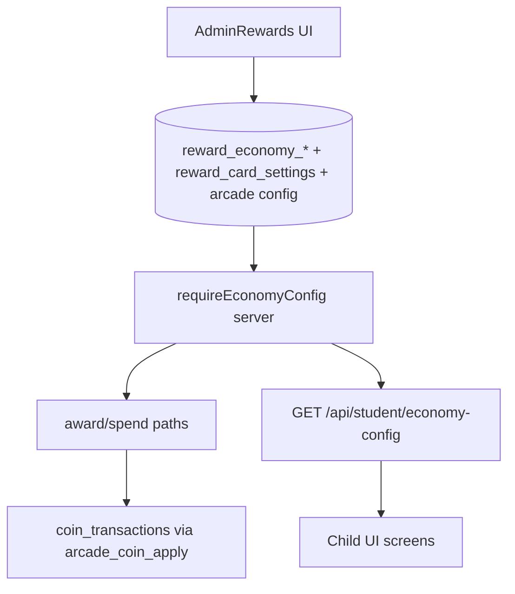

# תוכנית איחוד כלכלת מטבעות — מקור אמת יחיד (Admin/DB)

## עקרונות מחייבים (החלטת מוצר)

- `REWARD_ECONOMY_SETTINGS_ENABLED=true` הוא המצב היחיד; אם הדגל כבוי → `economy_unavailable` (לא legacy).
- אין ערכים כלכליים מ-hardcoded בזמן ריצה.
- `legacy-economy.js` — **seed/migration בלבד**; אסור import בנתיבי award/display כשהמערכת רצה.
- `DEFAULT_CARD_SETTINGS` ב-[`lib/rewards/server/reward-settings.server.js`](lib/rewards/server/reward-settings.server.js) — seed בלבד; אם מפתח חסר ב-DB → שגיאה/`unavailable`.
- משימות שבועיות במאסטרים (`weeklyChallenge` ב-localStorage) — **לא מעניקות מטבעות**; מחוץ לסCOPE כלכלה (אין שינוי נדרש).



---

## טבלאות: מה קיים / מה חסר

### מספיקות (קיימות — רק לחבר נכון)

| טבלה | שימוש |
|------|--------|
| `reward_economy_monthly_tiers` | פרס חודשי — מענק + תצוגה |
| `reward_economy_daily_missions` | משימות יומיות — טקסט, יעד, `reward_coins` |
| `reward_economy_global_settings` | `monthly_minutes_cap`, `monthly_coins_cap` (מחליף `MONTHLY_MINUTES_TARGET`) |
| `reward_economy_change_log` | audit Admin (קיים) |
| `reward_card_settings` | מחירי חנות, קופסה, המרת כפילויות |
| `reward_cards` | מחיר per-card (`price_coins`, `use_default_price`) |
| `arcade_games` | קטלוג משחקים + `allowed_entry_costs` |

### חסרות (נדרש migration `063`)

| טבלה חדשה | תפקיד |
|-----------|--------|
| **`reward_economy_session_coins`** | singleton: `base_coins`, `bonus_80_coins`, `bonus_95_coins`, `daily_cap` — מחליף `10/15/20` + `300` ב-[`learning-coin-award.server.js`](lib/learning-supabase/learning-coin-award.server.js) |
| **`reward_economy_entry_cost_options`** | קטלוג עלויות כניסה מותרות (היום: 10/100/1000/10000); Admin מנהל רשימה; מחליף `ARCADE_ENTRY_COSTS` ב-[`lib/arcade/game-registry.js`](lib/arcade/game-registry.js) |
| **`reward_economy_arcade_payout_rules`** | per `game_key`: JSON payout (למשל `pot_multiplier: 2` ל-fourline, `bingo_row_pct: 0.1`, `winner_takes_pot: true`) — מחליף נוסחאות קשיחות ב-[`fourline-game.js`](lib/arcade/server/fourline-game.js), [`bingo-game.js`](lib/arcade/server/bingo-game.js), וכו' |

### שינויי schema נלווים (באותה migration)

- **הסרת** `CHECK (entry_cost IN (10,100,1000,10000))` מ-`arcade_rooms`, `arcade_quick_match_queue` — לאפשר עלויות מ-Admin.
- **אופציונלי:** FK או validation באפליקציה ש-`entry_cost` ∈ `reward_economy_entry_cost_options.amount`.
- Seed לכל הטבלאות החדשות + וידוא ש-`reward_card_settings` מכיל את כל המפתחות הנדרשים (מ-migration 058).

---

## שלב 0 — הכנה וחוזה (ללא שינוי מוצר גלוי)

**מטרה:** הגדרת מודול מרכזי + חוזה שגיאות.

**קבצים חדשים:**
- `lib/rewards/server/economy-config.server.js` — `requireEconomyConfig(supabase)`, `getEconomySnapshot(supabase)`, `EconomyUnavailableError`
- `lib/rewards/economy-errors.js` — קודים: `economy_unavailable`, `economy_config_missing`, `card_settings_missing`

**קבצים שישתנו:**
- [`lib/rewards/reward-feature-flags.js`](lib/rewards/reward-feature-flags.js) — `isRewardEconomySettingsEnabled()` false → כל קריאת economy מחזירה unavailable (לא legacy)
- [`.env.example`](.env.example) — תיעוד: דגל חייב true; אין מצב legacy

**Migration:** לא

**סיכון:** נמוך — תשתית בלבד

**בדיקה:** unit tests ל-`requireEconomyConfig` — DB ריק → throw; DB מלא → snapshot

---

## שלב 1 — Migration + Seed (`063_economy_single_source.sql`)

**מטרה:** כל הערכים הנוכחיים ב-DB; אין תלות ב-runtime ב-legacy.

**קבצים:**
- `supabase/migrations/063_economy_single_source.sql` (חדש)
- [`supabase/migrations/058_card_rewards_system.sql`](supabase/migrations/058_card_rewards_system.sql) — **לא לשנות**; 063 משלים seed אם חסר
- [`lib/rewards/legacy-economy.js`](lib/rewards/legacy-economy.js) — **נשאר** רק כמקור ערכים ל-seed script בתוך 063 (הערה בקובץ: `SEED_ONLY — no runtime imports`)

**סיכון:** בינוני — migration על arcade CHECK constraints; לבדוק ב-staging לפני prod

**בדיקה:** SQL verify — כל טבלה מכילה ≥1 שורה פעילה; אין API שרץ לפני migration

---

## שלב 2 — שרת: הסרת fallback ו-legacy מנתיבי מענק

**מטרה:** מענק חודשי, משימות יומיות, נוסחת תרגול — DB בלבד.

### 2א — Economy core

**קבצים:**
- [`lib/rewards/server/reward-economy.server.js`](lib/rewards/server/reward-economy.server.js) — הסרת `getLegacy*`, `LEGACY_*` imports; כל getter קורא DB או זורק `EconomyUnavailableError`
- [`lib/learning-supabase/monthly-persistence-reward.server.js`](lib/learning-supabase/monthly-persistence-reward.server.js) — הסרת `MONTHLY_PERSISTENCE_TIERS` / `LEGACY_*`; `resolveMonthlyTiers` → `requireEconomyConfig` בלבד
- [`lib/learning-supabase/mission-progress.server.js`](lib/learning-supabase/mission-progress.server.js) — הסרת `MISSION_POOL`, `MISSION_REWARD_COINS`, `LEGACY_*`; `resolveMissionPool` מ-DB; הסרת `?? MISSION_REWARD_COINS` ב-award
- [`lib/learning-supabase/learning-coin-award.server.js`](lib/learning-supabase/learning-coin-award.server.js) — `calculateSessionCoins` קורא `reward_economy_session_coins`; cap יומי מ-DB
- [`lib/learning-supabase/parent-activity-completion-reward.server.js`](lib/learning-supabase/parent-activity-completion-reward.server.js) — אותו מקור נוסחה (כבר משתמש ב-`calculateSessionCoins`)

### 2ב — משימות יומיות stale state

**שינוי ב-** [`mission-progress.server.js`](lib/learning-supabase/mission-progress.server.js):
- ב-`ensureTodayMissions`: אם `rewardCoins` / `textHe` / `target` במשימה ב-state ≠ pool מ-DB → **רענון forward-only** (רק למשימות שלא `coinAwarded`)
- הוספת `economyVersion` או hash של pool ב-`challenges.daily` לזיהוי drift

**סיכון:** בינוני — ילד עם משימה פתוחה עלול לראות `rewardCoins` מתעדכן לפני השלמה (מקובל: "שינוי יחול על פרסים עתידיים")

**בדיקה:**
- `node --test tests/learning/phase9-single-truth-progress.test.mjs` (יעודכן בשלב 7)
- בדיקות חדשות: `tests/rewards/economy-config-required.test.mjs`

---

## שלב 3 — קלפים / חנות / קופסה / כפילויות — fail-closed

**מטרה:** אין `DEFAULT_CARD_SETTINGS` בזמן ריצה.

**קבצים:**
- [`lib/rewards/server/reward-settings.server.js`](lib/rewards/server/reward-settings.server.js) — `getCardSetting`: מפתח חסר → error; `DEFAULT_CARD_SETTINGS` → export ל-seed בלבד (`SEED_CARD_SETTINGS`)
- [`lib/rewards/server/reward-shop.server.js`](lib/rewards/server/reward-shop.server.js)
- [`lib/rewards/server/surprise-box.server.js`](lib/rewards/server/surprise-box.server.js)
- [`lib/rewards/server/duplicate-conversion.server.js`](lib/rewards/server/duplicate-conversion.server.js)
- [`pages/api/student/rewards/shop/index.js`](pages/api/student/rewards/shop/index.js) — 503 + `economy_unavailable` במקום defaults
- [`pages/api/student/rewards/surprise-box/open.js`](pages/api/student/rewards/surprise-box/open.js)
- [`pages/api/student/rewards/cards/convert-duplicates.js`](pages/api/student/rewards/cards/convert-duplicates.js)
- Admin APIs: [`pages/api/admin/rewards/settings.js`](pages/api/admin/rewards/settings.js), [`AdminShopTab.jsx`](components/admin/rewards/AdminShopTab.jsx), [`AdminBoxTab.jsx`](components/admin/rewards/AdminBoxTab.jsx), [`AdminDuplicatesTab.jsx`](components/admin/rewards/AdminDuplicatesTab.jsx)

**הערה על `CARD_REWARDS_ENABLED`:** נשאר gate ל**הפעלת פיצ'ר** (קלפים נראים/לא), אבל **ערכים** תמיד מ-DB; אם DB חסר → unavailable גם כשהדגל דלוק.

**סיכון:** בינוני — סביבה בלי seed מלא תקבל 503 עד Admin ממלא הגדרות

---

## שלב 4 — API לילד: `economy-config` + חיבור תצוגה

**מטרה:** אף מסך ילד לא מחשב סכומי מטבעות/יעדים מקוד.

### API חדש

`GET /api/student/economy-config` (או הרחבת [`home-profile.js`](pages/api/student/home-profile.js) + [`learning-profile.js`](pages/api/student/learning-profile.js)):

```json
{
  "ok": true,
  "monthlyTiers": [{ "minutes": 100, "coins": 10000, "labelHe": "..." }],
  "globalCaps": { "monthlyMinutesCap": 600, "monthlyCoinsCap": 100000 },
  "sessionCoins": { "base": 10, "bonus80": 5, "bonus95": 10, "dailyCap": 300 },
  "entryCostOptions": [10, 100, 1000, 10000],
  "arcadeGames": [{ "gameKey": "fourline", "allowedEntryCosts": [...], "payoutRules": {...} }],
  "cardDisplay": { "shopDefaultPrices": {...} }  // לתצוגה בלבד, לא לחיוב
}
```

**קבצים חדשים:**
- `pages/api/student/economy-config.js`
- `lib/learning-client/economyConfigClient.js` — fetch + cache קצר

**קבצים שישתנו (הסרת hardcoded):**

| קובץ | שינוי |
|------|--------|
| [`lib/learning-client/studentHomeDashboardClient.js`](lib/learning-client/studentHomeDashboardClient.js) | הסרת `MONTHLY_PERSISTENCE_TIERS`; מקבל `economy.monthlyTiers` |
| [`lib/learning-client/subjectMonthlyPersistenceView.js`](lib/learning-client/subjectMonthlyPersistenceView.js) | tiers + labels מ-payload; הסרת מערך קבוע |
| [`lib/learning-client/dailyMissionsView.js`](lib/learning-client/dailyMissionsView.js) | הסרת `\|\| 20`; אם חסר `rewardCoins` → `unavailable` |
| [`data/reward-options.js`](data/reward-options.js) | הסרת `MONTHLY_MINUTES_TARGET` או הפיכה ל-re-export מבוטל |
| [`pages/student/home.js`](pages/student/home.js) | טעינת economy-config לפני `buildStudentHomeView` |
| [`pages/learning/math-master.js`](pages/learning/math-master.js) (+ hebrew, english, geometry, science, moledet-geography) | הסרת `MONTHLY_MINUTES_TARGET`; שימוש ב-`monthlyPersistenceView.goalMinutes` מ-API |
| [`components/student/StudentMonthlyPersistencePanel.js`](components/student/StudentMonthlyPersistencePanel.js) | מצב `unavailable` אם אין tiers |
| [`components/student/StudentDailyMissionsPanel.js`](components/student/StudentDailyMissionsPanel.js) | הצגת unavailable במקום 20 שקט |
| [`components/learning/SubjectMonthlyPrizeJourney.js`](components/learning/SubjectMonthlyPrizeJourney.js) | tiers מ-view בלבד |

**הוספת מטבעות ידנית:** ללא שינוי לוגיקה — [`AdminManualCoinsTab.jsx`](components/admin/rewards/AdminManualCoinsTab.jsx) כבר Admin-driven; רק לוודא שלא נוגעים.

**סיכון:** גבוה — 6 מאסטרים + home; דורש רגרסיה UI

**אימות ילד = Admin:**
1. Admin משנה tier ב-[`AdminEconomyTab`](components/admin/rewards/AdminEconomyTab.jsx) → `PUT monthly-tiers`
2. ילד: `GET economy-config` → אותם `minutes`/`coins`/`labelHe`
3. בדיקת אינטגרציה: `tests/rewards/admin-student-economy-parity.test.mjs` (חדש) — mock DB → admin read = student read

---

## שלב 5 — ארקייד תחת Admin

**מטרה:** עלויות כניסה ופרסים — DB + Admin UI, לא `game-registry` / CHECK קשיח.

### Admin

**קבצים חדשים:**
- `components/admin/rewards/AdminArcadeTab.jsx`
- `pages/api/admin/rewards/economy/entry-costs.js` — CRUD `reward_economy_entry_cost_options`
- `pages/api/admin/rewards/economy/arcade-payout-rules.js` — CRUD per game
- `pages/api/admin/rewards/economy/arcade-games.js` — עדכון `allowed_entry_costs` ב-`arcade_games`

**קבצים שישתנו:**
- [`components/admin/rewards/AdminRewardsShell.jsx`](components/admin/rewards/AdminRewardsShell.jsx) — טאב "ארקייד"
- [`lib/arcade/server/arcade-rooms.js`](lib/arcade/server/arcade-rooms.js) — `validateEntryCost` מ-DB בלבד (הסרת `ARCADE_ENTRY_COSTS`)
- [`lib/arcade/game-registry.js`](lib/arcade/game-registry.js) — הסרת `ARCADE_ENTRY_COSTS`; titles בלבד או מ-DB
- [`pages/student/arcade.js`](pages/student/arcade.js) — הסרת `ENTRY_OPTIONS` hardcoded; מ-`economy-config`
- [`lib/arcade/server/fourline-game.js`](lib/arcade/server/fourline-game.js), [`bingo-game.js`](lib/arcade/server/bingo-game.js), [`checkers-game.js`](lib/arcade/server/checkers-game.js), [`chess-game.js`](lib/arcade/server/chess-game.js), [`dominoes-game.js`](lib/arcade/server/dominoes-game.js), [`snakes-ladders`](lib/arcade/server/) — pot/prize מ-`reward_economy_arcade_payout_rules`
- `pages/api/arcade/**` — להחזיר שגיאה ברורה אם economy config חסר

**Migration:** כלול ב-063 (טבלאות + הסרת CHECK)

**סיכון:** גבוה — לוגיקת משחקים רגישה; שלב נפרד אחרי שלבים 2–4

**בדיקה:** `tests/arcade/economy-entry-costs.test.mjs`; smoke ידני על fourline + bingo

---

## שלב 6 — ניקוי legacy + דגלים

**מטרה:** אין import ל-`legacy-economy.js` בנתיבי runtime.

**קבצים:**
- [`lib/rewards/legacy-economy.js`](lib/rewards/legacy-economy.js) — הערה `SEED_ONLY`; אופציונלי העברה ל-`scripts/seed/legacy-economy.seed.js`
- הסרת imports מ: `monthly-persistence-reward`, `mission-progress`, `reward-economy.server.js`
- [`lib/rewards/reward-feature-flags.js`](lib/rewards/reward-feature-flags.js) — אם false: כל economy APIs → 503 (לא legacy)
- [`lib/rewards/guards.server.js`](lib/rewards/guards.server.js) — איחוד: `guardEconomyAvailable(res)` לפני כל award/display

**סיכון:** נמוך אם שלבים 1–5 הושלמו

---

## שלב 7 — Truth gates + CI (לא טלאי)

**מטרה:** CI נכשל על hardcoded/fallback חדש; ירוק רק אחרי איחוד אמיתי.

**קבצים חדשים:**
- `tests/rewards/economy-no-hardcoded-contract.test.mjs` — סורק:
  - אין `LEGACY_MONTHLY` / `legacy-economy` import ב-`lib/` (מלבד seed scripts)
  - אין `MONTHLY_PERSISTENCE_TIERS = [` ב-client
  - אין `rewardCoins || 20`
  - אין `DEFAULT_CARD_SETTINGS` בשימוש runtime ב-`getCardSetting` fallback path
  - אין `ARCADE_ENTRY_COSTS`
- `tests/rewards/economy-resolution-chain.test.mjs` — mock supabase: config חסר → error; config מלא → snapshot נכון

**קבצים שישתנו:**
- [`tests/learning/phase9-single-truth-progress.test.mjs`](tests/learning/phase9-single-truth-progress.test.mjs) — במקום grep על קובץ בודד: בודק ש-`resolveMonthlyTiers` לא מייבא legacy; בודק migration seed קיים
- [`scripts/truth-gates/gates/reward-contract-pass.mjs`](scripts/truth-gates/gates/reward-contract-pass.mjs) — מוסיף `economy-no-hardcoded-contract.test.mjs`
- **אופציונלי:** gate חדש `ECONOMY_SINGLE_SOURCE_PASS` ב-[`scripts/truth-gates/gate-registry.mjs`](scripts/truth-gates/gate-registry.mjs)

**כשל CI הנוכחי (לא לתקן כטלאי):**
- Gate: `REWARD_CONTRACT_PASS`
- טסט: `monthly persistence and derived minutes include parent_activity_attempts credited time` ב-`phase9-single-truth-progress.test.mjs`
- שגיאה: `did not match /minutes: 600, coins: 100_000/` בקובץ `monthly-persistence-reward.server.js`
- סיבה: **טסט מחפש בקובץ הלא נכון** — ייפתר בשלב 7 כחלק מאיחוד architecture, לא בהעתקת ערכים

**בדיקות להרצה בכל שלב:**

| שלב | פקודות |
|-----|--------|
| 2 | `node --test tests/rewards/economy-config-required.test.mjs` |
| 3 | `node --test tests/rewards/card-settings-required.test.mjs` |
| 4 | `node --test tests/rewards/admin-student-economy-parity.test.mjs` |
| 5 | `node --test tests/arcade/economy-entry-costs.test.mjs` |
| 7 | `npm run test:truth-gates:offline` + `npm run build` |

---

## שלב 8 — אימות סופי (לפני prod)

**צ'קליסט "אין מקורות נסתרים":**
1. `rg "legacy-economy" lib/` → 0 תוצאות (מלבד הערות)
2. `rg "MONTHLY_PERSISTENCE_TIERS|MONTHLY_MINUTES_TARGET|ARCADE_ENTRY_COSTS|rewardCoins \\|\\| 20" components/ lib/learning-client/` → 0
3. `rg "DEFAULT_CARD_SETTINGS" lib/rewards/server/reward-settings.server.js` → רק `SEED_` export
4. כל `GET economy-config` מחזיר 200 עם DB מלא; עם DB ריק → 503 + הודעה בעברית

**אימות ילד = Admin (E2E ידני):**
1. Admin → כלכלת מטבעות → שנה tier 600 ל-99,999 מטבעות
2. ילד רענון home → תיבת 600 מציגה 99,999
3. הרץ `monthly-persistence-award` dry-run → `wouldAward: 99999`
4. Admin → נוסחת תרגול → שנה base ל-12 → סיים תרגול → `coin_transactions.amount` = 12 (בסיס)
5. Admin → ארקייד → הוסף entry cost 50 → ילד רואה 50 בלובי; יצירת חדר ב-50 עובדת

---

## סיכום סיכונים לפי שלב

| שלב | סיכון | הערה |
|-----|--------|------|
| 0 | נמוך | תשתית |
| 1 | בינוני | migration arcade CHECK |
| 2 | גבוה | כל מענקי למידה/משימות |
| 3 | בינוני | קלפים לא זמינים אם seed חסר |
| 4 | גבוה | 7+ מסכי ילד |
| 5 | גבוה | לוגיקת ארקייד |
| 6 | נמוך | ניקוי |
| 7 | בינוני | CI יישאר אדום עד סוף שלב 7 |
| 8 | — | gate לפרודקשן |

---

## סדר ביצוע מומלץ

```text
0 → 1 (migration) → 2 (server awards) → 3 (cards fail-closed)
→ 4 (student API + UI) → 5 (arcade) → 6 (legacy cleanup) → 7 (truth gates) → 8 (verify)
```

**לא לבצע שינוי קוד עד אישור מפורש.**
