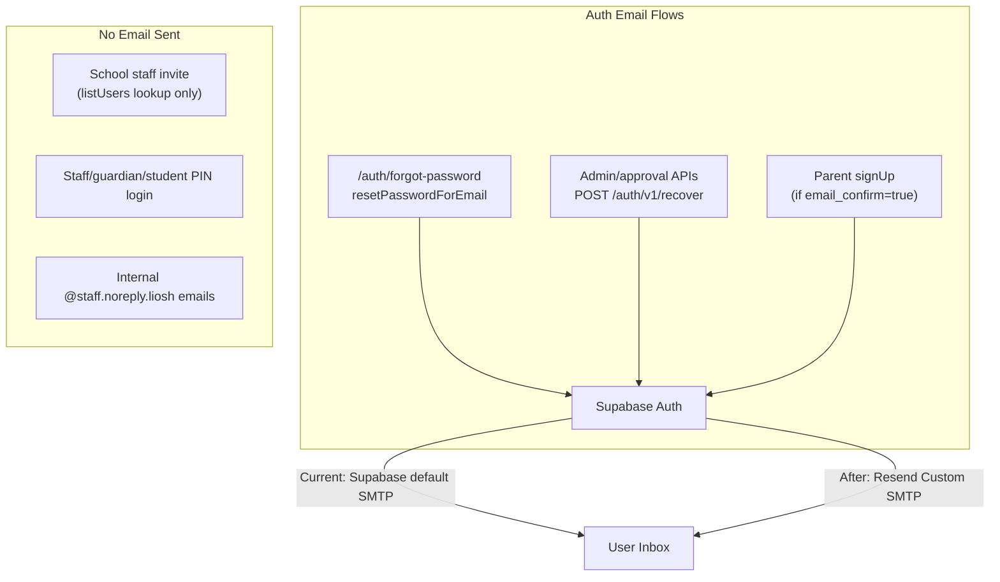

# External Email Delivery — Resend via Supabase Custom SMTP

---

## Execution Status

**This document is a PLAN ONLY.**

- No implementation has been approved or started.
- No files have been created, modified, committed, or deployed.
- No Resend account has been configured.
- No Supabase Dashboard settings have been changed.
- No live email tests have been run.
- Owner must review and explicitly approve this plan before any execution begins.

---

## Scope

- **Project:** Hebrew learning site (liosh-website.vercel.app)
- **Goal:** Move production Auth email delivery away from Supabase's default SMTP sender and use Resend as the external delivery provider via Supabase Custom SMTP.
- **Target provider:** Resend free tier, configured as Supabase Custom SMTP.
- **Auth trigger:** Supabase Auth remains the Auth trigger. Only the SMTP delivery path changes.
- **App code changes:** None are expected. The codebase audit confirms that 100% of outbound email is delegated to Supabase Auth — no custom transport exists in the app. No custom email transport will be added unless the audit proves a non-Auth transactional email flow exists AND the owner explicitly approves a separate implementation.
- **Deliverables:** Five documentation files in `docs/email/` (listed below). No code files.

---

## Out of Scope

The following are explicitly excluded from this plan. They must not be mentioned, prepared, audited, or started as part of this work:

- Android app
- iOS app
- PWA (Progressive Web App) changes
- Capacitor
- Google Play
- App Store
- Push notifications
- Marketing emails
- Newsletter system
- Product UI changes of any kind
- Hebrew copy changes
- Auth logic replacement
- Database schema changes
- SQL of any kind
- Migrations
- Commit, push, or deploy of any kind

---

## Hard Rule: No SQL

- No SQL is expected for this project.
- Do not create SQL.
- Do not run SQL.
- Do not create or apply migrations.
- If SQL appears necessary at any point during execution, **stop immediately** and document exactly why it seems needed. The owner will review separately before any SQL is approved or executed.

---

## Hard Rule: No Secrets

- Do not print, log, commit, document, or expose any of the following: Resend API key, Resend SMTP password, Supabase service role key, Supabase anon key value, any env value from `.env`, `.env.local`, `.env.production`, or any other real env file.
- Documentation files may include only: key names (e.g. `SMTP_PASSWORD`) and placeholder examples (e.g. `re_xxxxxxxxxxxx`).
- No secrets in: `.env.example`, docs, logs, tests, terminal output, screenshots, or QA reports.
- The Resend API key / SMTP password must be entered by the owner directly in the Supabase Dashboard — it must never appear anywhere in this repository.

---

## Findings from Codebase Audit

**Critical finding:** The app has zero custom email transport code. 100% of outbound auth email is delegated to Supabase Auth. Switching to Resend means configuring Supabase Custom SMTP in the Dashboard — **no app code changes are needed.**

### Email flows identified

### Key files (reference only — no changes)

- [`lib/auth/auth-password-setup.server.js`](lib/auth/auth-password-setup.server.js) — `sendPasswordSetupRecoveryEmail()` calls `POST /auth/v1/recover`
- [`pages/auth/forgot-password.js`](pages/auth/forgot-password.js) — `supabase.auth.resetPasswordForEmail()`
- [`pages/auth/reset-password.js`](pages/auth/reset-password.js) — password update after link click
- [`lib/auth/auth-recovery-session.client.js`](lib/auth/auth-recovery-session.client.js) — OTP/code exchange
- [`lib/auth/auth-registration-request.server.js`](lib/auth/auth-registration-request.server.js) — `createUser` with `email_confirm: true`

### Environment keys (no SMTP keys in app)

Supabase Custom SMTP credentials live **only** in Supabase Dashboard — never in app env, `.env.example`, or this repo. No new env keys will be added to the app.

---

## Required Deliverables

All five files below must be created under `docs/email/`. No other files will be created or modified.

### 1. `docs/email/EMAIL_DELIVERY_AUDIT.md`

Full inventory:
- 3 active Auth email flows: (a) forgot-password / `resetPasswordForEmail`, (b) admin/approval `POST /auth/v1/recover`, (c) parent `signUp` confirmation if enabled
- 3 non-email flows: staff invite (lookup only), PIN/code login, internal `@staff.noreply.liosh` addresses
- Redirect URL derivation (`getPublicSiteOrigin` logic and env priority)
- Hebrew UI copy file locations (no copy changes)
- Confirmation: no email templates in repo (they live in Supabase Dashboard)
- Confirmation: no edge functions exist
- Confirmation: no custom SMTP or third-party email library in app code
- Statement: no app code changes are needed or planned

### 2. `docs/email/RESEND_SETUP_CHECKLIST.md`

Owner-facing step-by-step checklist — all steps marked `[OWNER ACTION REQUIRED]`:
- Create Resend account and project
- Add sending domain (DNS TXT/MX/DKIM records — record values listed as placeholders, not real values)
- Verify domain in Resend dashboard
- Generate SMTP credentials in Resend (host: `smtp.resend.com`, port: `465` or `587`, username: `resend`)
- Note: the SMTP password equals the Resend API key — owner enters it only in Supabase Dashboard, never in repo
- Confirm sending domain matches `from` address to be configured in Supabase Auth settings
- No Resend API key or credential values appear in this document

### 3. `docs/email/SUPABASE_CUSTOM_SMTP_CONFIG.md`

Dashboard-only configuration guide — all steps marked `[OWNER ACTION REQUIRED]`:
- Path: Supabase Dashboard → Authentication → Settings → Custom SMTP
- Fields and example values (no real secrets):
  - Host: `smtp.resend.com`
  - Port: `465`
  - Username: `resend`
  - Password: `[OWNER ENTERS RESEND API KEY HERE — NOT IN DOCS]`
  - Sender name: (owner decides)
  - Sender email: (must match verified Resend domain)
- Supabase Auth email rate limit settings
- Redirect URL allowlist configuration: production URL + Vercel preview URL patterns
- Note on email template location (Dashboard, not repo)

### 4. `docs/email/EMAIL_DELIVERY_QA_REPORT.md`

Test matrix using three statuses only:
- `PASS` — static/code/documentation checks completable without dashboard setup
- `PENDING_OWNER_SMTP_CONFIG` — live email delivery tests that require Resend + Supabase Dashboard setup first
- `BLOCKED` — only if a real blocker is discovered during execution

Tests covered:
- Code path: `sendPasswordSetupRecoveryEmail` calls correct endpoint (static — `PASS`)
- Code path: `resetPasswordForEmail` redirect URL derivation (static — `PASS`)
- Code path: no custom SMTP or third-party mailer in app (static — `PASS`)
- Code path: internal `@staff.noreply.liosh` addresses never reach email transport (static — `PASS`)
- Live: password reset email arrives — teacher portal (`PENDING_OWNER_SMTP_CONFIG`)
- Live: password reset email arrives — parent portal (`PENDING_OWNER_SMTP_CONFIG`)
- Live: admin password-setup email — teacher reactivate (`PENDING_OWNER_SMTP_CONFIG`)
- Live: admin password-setup email — school registration approve (`PENDING_OWNER_SMTP_CONFIG`)
- Live: parent signup confirmation email (`PENDING_OWNER_SMTP_CONFIG`)
- Live: reset link redirects correctly after click (`PENDING_OWNER_SMTP_CONFIG`)
- Live: email sent from verified Resend domain, not Supabase default (`PENDING_OWNER_SMTP_CONFIG`)
- Review: Hebrew UI strings present on reset-password page (static — `PASS`)
- Review: RTL rendering of email templates (Dashboard review — `PENDING_OWNER_SMTP_CONFIG`)

### 5. `docs/email/EMAIL_DELIVERY_SECURITY_REVIEW.md`

Security findings from audit:
- SMTP credentials: Resend API key must only be in Supabase Dashboard — not in env files, `.env.example`, logs, docs, or code (verified: not present in repo)
- Redirect URL validation: `redirect_to` derived from env priority chain (`NEXT_PUBLIC_SITE_URL` → `NEXT_PUBLIC_APP_URL` → `VERCEL_URL` → hardcoded fallback) — owner must verify Supabase Auth redirect URL allowlist matches
- Rate limiting: Supabase Auth has built-in per-email rate limits; owner reviews in Dashboard
- Token exposure: no SMTP passwords or Resend keys found in any code file (verified)
- No secrets committed: `.env.example` contains only key names with empty values (verified)
- Internal staff addresses (`@staff.noreply.liosh`) are synthetic, never delivered (correct design — confirmed)
- No new security risks introduced by this plan (no code changes)

---

## Owner-Only Dashboard Actions

All items below require the owner to act in an external dashboard. No agent action can or should replace these steps.

1. **[OWNER ACTION REQUIRED — Resend Dashboard]** Create Resend account and project
2. **[OWNER ACTION REQUIRED — Resend Dashboard]** Add and verify the sending domain (add DNS records at domain registrar)
3. **[OWNER ACTION REQUIRED — Domain Registrar]** Add DNS TXT/MX/DKIM records provided by Resend
4. **[OWNER ACTION REQUIRED — Resend Dashboard]** Generate SMTP credentials (API key for SMTP use)
5. **[OWNER ACTION REQUIRED — Supabase Dashboard → Auth → SMTP]** Enter Resend host, port, username, and API key as SMTP password; set sender name and email
6. **[OWNER ACTION REQUIRED — Supabase Dashboard → Auth → URL Configuration]** Verify redirect URL allowlist includes production URL and Vercel preview URL patterns
7. **[OWNER ACTION REQUIRED — Supabase Dashboard → Auth → Email Templates]** Optionally review email template body for Hebrew/RTL rendering needs
8. **[OWNER ACTION REQUIRED — Post-config manual test]** Trigger a password reset and confirm email arrives from the Resend-verified domain

---

## Safety Guardrail

During execution, if any change outside `docs/email/` appears necessary, stop and ask for owner approval before making that change.

---

## What Is NOT Changing

- No app code files
- No DB schema or migrations
- No SQL of any kind
- No UI or Hebrew copy
- No `.env.example` or any env file
- No Supabase Auth RLS policies
- No Supabase Auth configuration (all config is owner-only dashboard action)
- No commits, pushes, or deployments
- No Android, iOS, PWA, Capacitor, or mobile work

---

## Final Execution Acceptance Criteria

Execution may only be considered complete when all of the following are confirmed:

- All five required docs are created in `docs/email/`
- All Auth/email flows are fully inventoried in the audit doc
- All dashboard-only owner actions are clearly labeled `[OWNER ACTION REQUIRED]`
- All live email delivery tests are marked `PENDING_OWNER_SMTP_CONFIG` (they cannot pass until owner completes dashboard configuration)
- No app code files were created or modified
- No SQL was written, run, or applied
- No migrations were created
- No secrets (API keys, SMTP passwords, Supabase keys, env values) appear anywhere in the docs, logs, or terminal output
- No UI or Hebrew copy was changed
- No commit, push, or deploy was performed
- No Android, iOS, PWA, Capacitor, or mobile work was touched
