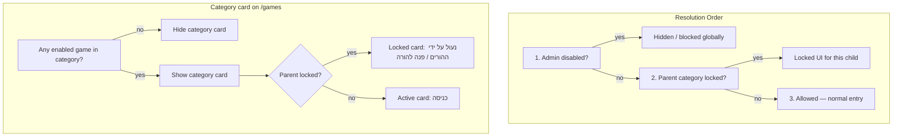

# תוכנית: ניהול משחקים, הרשאות הורים, תשתית יהלומים (v2 — מתוקן)

**סטטוס:** תוכנית בלבד — **אין אישור ביצוע**. לא קוד, לא SQL, לא migration.

**היקף:** רק 3 קטגוריות — `online`, `offline`, `solo`. **ללא** משחקי legacy `/mleo-*` (יימחקו בנפרד, מחוץ לתוכנית זו).

---

## כללי התנהגות מחייבים

### סדר הכרעה (Admin → Parent → Allowed)

1. **Admin disabled** — המשחק לא מוצג / חסום גלובלית. Parent **לא** יכול לפתוח משהו ש-Admin כיבה.
2. **Parent locked** — הקטגוריה/משחק מוצגים כ**נעולים** לילד הספציפי בלבד; כניסה חסומה.
3. **Allowed** — מוצג רגיל עם כפתור "כניסה".

Admin תמיד קודם. Parent lock חל רק על משחקים/קטגוריות ש-Admin השאיר פעילים.

### Admin disable — per-game, לא per-category

- Admin מכבה **משחק בודד** → מוסתר/חסום **רק** אותו משחק.
- כרטיס **קטגוריה** ב-`/games` מוסתר **רק** אם:
  - אין **אף** משחק פעיל בקטגוריה, **או**
  - Admin כיבה **את כל** המשחקים בקטגוריה.

**דוגמה:** Solo = 10 משחקים, Admin כיבה 1 → כרטיס "משחקים רגילים" **עדיין מוצג**; בתוך הקטגוריה 9 משחקים פעילים.

### Parent lock — per-category בלבד (3 סימונים)

לכל ילד: `online_enabled`, `offline_enabled`, `solo_enabled` (ברירת מחדל: כולם `true`).

- כרטיס קטגוריה ב-`/games` **יכול להופיע** גם כשנעול.
- במקום "כניסה": מצב נעול + חסימת כניסה + חסימת URL ישיר.
- **לא** נעילה per-game — רק per-category.

**טקסט UI (מוגדר):**
- כפתור / כותרת: **"נעול על ידי ההורים"**
- טקסט קטן נוסף: **"פנה להורה"**

### `/games` — חייב ילד מחובר

- `/games` **לא** דף חופשי — חייב session ילד (`liosh_student_session` / `StudentAccessGate`).
- **אין ילד מחובר** → redirect ל-`/student/login?next=/games` (או מצב מקביל לדפים מוגנים אחרים).
- **יש ילד מחובר** → הצגת קטגוריות לפי Admin catalog + הרשאות הורה **לאותו ילד**.

בלי זה אי אפשר לאכוף parent lock.

### יהלומים — מערכת נפרדת (לא לשבור מטבעות)

**לא לשנות:**
- `student_coin_balances`, `coin_transactions`
- solo coin payout (`calculateSoloGameCoins`)
- surprise box coins, shop coins, `arcade_coin_apply`

**יהלומים:** ledger + balance + RPC נפרדים; צבירה במקביל בלבד. **אין** המרה למטבעות, **אין** שימוש בחנות בשלב זה.

**ברירת מחדל:** `daily_cap_mode = none` — **אין תקרה יומית** כרגע. תשתית עתידית (global / per-source / per-game cap) נשמרת ב-settings אך לא מופעלת.

**Admin manual adjust:** **כן** — חלק מהתשתית (balance + ledger + reason + admin audit), כמו מטבעות.

---

## הקשר קיים (ממצאי הקוד)

| תחום | מצב היום | קובץ/טבלה עיקריים |
|------|----------|-------------------|
| Online (7) | DB `arcade_games.enabled` + `foundation_only`; guard ב-[`arcade-game-policy.js`](lib/arcade/server/arcade-game-policy.js); **אין UI Admin** ל-toggle | [`game-registry.js`](lib/arcade/game-registry.js), [`004_arcade_foundation.sql`](supabase/migrations/004_arcade_foundation.sql) |
| Solo (10) | רשימה סטטית + `reward_economy_solo_game_rules.is_active`; payout ב-[`solo-game-payout.server.js`](lib/solo-games/server/solo-game-payout.server.js) | [`solo-game-registry.js`](lib/solo-games/solo-game-registry.js) |
| Offline (4) | רשימה inline ב-[`pages/offline/index.js`](pages/offline/index.js); **ללא DB, ללא guard** | — |
| `/games` | **לא** ב-`STUDENT_PROTECTED_ROUTES` היום | [`pages/games.js`](pages/games.js), [`pages/_app.js`](pages/_app.js) |
| Parent permissions | **לא קיים** per-child game control | [`pages/parent/dashboard.js`](pages/parent/dashboard.js) |
| Diamonds | **לא קיים** | מטבעות: `student_coin_balances` + `coin_transactions` + RPC `arcade_coin_apply` |
| Surprise box | מטבעות + קלפים בלבד | [`surprise-box.server.js`](lib/rewards/server/surprise-box.server.js) |

**מחוץ להיקף:** דפי `/mleo-*` — לא ב-catalog, לא seed, לא guards, לא QA.

---

## חלק 1 — מיפוי משחקים (21 משחקים + hubs)

### קטגוריה: `online` (7)

| game_key | title_he | route |
|----------|----------|-------|
| `fourline` | ארבע בשורה | `/student/games/fourline` |
| `ludo` | לודו | `/student/games/ludo` |
| `snakes-and-ladders` | נחשים וסולמות | `/student/games/snakes-and-ladders` |
| `checkers` | דמקה | `/student/games/checkers` |
| `chess` | שחמט | `/student/games/chess` |
| `dominoes` | דומינו | `/student/games/dominoes` |
| `bingo` | בינגו | `/student/games/bingo` |

Hub: `/student/arcade` · API: [`/api/arcade/games`](pages/api/arcade/games.js) · Registry: [`lib/arcade/game-registry.js`](lib/arcade/game-registry.js)

### קטגוריה: `offline` (4)

| game_key | title_he | route |
|----------|----------|-------|
| `tic-tac-toe` | איקס עיגול XL | `/offline/tic-tac-toe` |
| `rock-paper-scissors` | אבן · נייר · מספריים | `/offline/rock-paper-scissors` |
| `tap-battle` | קרב הקשות | `/offline/tap-battle` |
| `memory-match` | התאמת זיכרון | `/offline/memory-match` |

Hub: `/offline` · רשימה: [`pages/offline/index.js`](pages/offline/index.js)

### קטגוריה: `solo` (10)

| game_key | title_he | route |
|----------|----------|-------|
| `catcher` | תופס עם ליאו | `/student/solo-games/catcher` |
| `flyer` | ליאו במטוס | `/student/solo-games/flyer` |
| `puzzle` | חידת ליאו | `/student/solo-games/puzzle` |
| `memory` | זיכרון ליאו | `/student/solo-games/memory` |
| `leo-jump` | ליאו קופץ | `/student/solo-games/leo-jump` |
| `balloons` | פיצוץ בלונים | `/student/solo-games/balloons` |
| `maze` | מבוך ליאו | `/student/solo-games/maze` |
| `picture-puzzle` | פאזל תמונה | `/student/solo-games/picture-puzzle` |
| `target-tap` | קליעה למטרה | `/student/solo-games/target-tap` |
| `sort-shapes` | מיון צורות | `/student/solo-games/sort-shapes` |

Hubs: `/student/solo-games`, `/game` · Registry: [`solo-game-registry.js`](lib/solo-games/solo-game-registry.js)

**יהלומים ויזואליים (צבירה עתידית, לא מטבעות):** `flyer`, `catcher`, `leo-jump`, `balloons`, `target-tap`, `maze` (bonus). שאר solo — payout יהלומים לפי Admin rules בלבד.

### Hubs (מושפעים מהרשאות)

| route | קטגוריה | הערה |
|-------|---------|------|
| `/games` | כל 3 | **חייב student session** |
| `/game` | solo | מוגן (solo routes) |
| `/student/solo-games` | solo | מוגן |
| `/student/arcade` | online | מוגן |
| `/offline` | offline | יוגדר מוגן |
| `/student/home` | — | קישור ל-`/games` |

**סה"כ:** **21** משחקים + **5** hubs.



---

## חלק 2 — הצעת מבנה DB (טיוטה — לא להריץ)

### 2.1 `site_game_catalog`

```sql
-- FOR REVIEW ONLY — לא להריץ לפני אישור
create table public.site_game_catalog (
  game_key text primary key,
  category text not null check (category in ('online','offline','solo')),
  title_he text not null,
  route text not null,
  hub_route text null,
  is_enabled boolean not null default true,
  sort_order int not null default 0,
  emoji text null,
  blurb_he text null,
  metadata_json jsonb not null default '{}'::jsonb,
  created_at timestamptz not null default now(),
  updated_at timestamptz not null default now()
);
create index site_game_catalog_category_enabled_idx
  on public.site_game_catalog (category, is_enabled, sort_order);
```

- **Seed:** **21** שורות בלבד (7 + 4 + 10). **ללא legacy.**
- **Sync:** `online` ↔ `arcade_games.enabled`; `solo` ↔ `reward_economy_solo_game_rules.is_active`; `offline` — catalog בלבד.
- **RLS:** enabled; service-role writes (כמו `reward_economy_*`).

**Helper view/query (אופציונלי):** `category_has_enabled_games(category)` — לשימוש ב-UI של `/games`.

### 2.2 `student_game_category_permissions`

```sql
create table public.student_game_category_permissions (
  student_id uuid primary key references public.students(id) on delete cascade,
  online_enabled boolean not null default true,
  offline_enabled boolean not null default true,
  solo_enabled boolean not null default true,
  updated_at timestamptz not null default now(),
  updated_by uuid null references auth.users(id) on delete set null
);
```

- **Trigger** on `students` INSERT → `(true, true, true)`.
- **Backfill** כל הילדים הקיימים → `(true, true, true)`.
- **RLS:** parent read/update על ילדים שלו; service-role full.

**Audit:** `student_game_permissions_change_log` — **ממולא אוטומטית** ע״י trigger `trg_student_game_permissions_audit` על UPDATE ל-`student_game_category_permissions` (אפשרות א׳). Parent API חייב לעדכן `updated_by`.

### 2.3 תשתית יהלומים

#### `student_diamond_balances`
- `student_id` PK, `balance`, `lifetime_earned`, `lifetime_spent` (0 לעתיד)
- Trigger auto-create on student insert

#### `diamond_transactions`
- `direction`: earn / spend / adjust / reversal
- `source_type`: solo_game, surprise_box, admin_adjustment, reversal
- `idempotency_key` unique, `balance_after`, `metadata_json`

#### RPC `diamond_apply`
- Idempotent; atomic balance + ledger; **לא** נוגע ב-coins

#### `reward_economy_diamond_settings` (singleton)

```json
{
  "system_enabled": true,
  "daily_cap_mode": "none",
  "global_daily_cap": null,
  "solo_daily_cap": null,
  "surprise_box_daily_cap": null,
  "per_game_daily_cap": null
}
```

**ברירת מחדל:** `daily_cap_mode = "none"`. שדות cap — **תשתית עתידית בלבד**, לא enforced.

#### Solo — `payout_rules_json.diamondRules` (הוספה; coin rules ללא שינוי)

#### `solo_game_sessions` — עמודות: `diamonds_awarded`, `diamond_result_json`

#### Surprise box — `surprise_box_openings.diamonds_reward`, setting `surprise_box_diamond_rewards`

#### Admin manual adjust
- POST adjust API → `diamond_apply` + `admin_audit_log` + `reason` חובה
- Pattern: [`admin-manual-coin-credit.server.js`](lib/admin-server/admin-manual-coin-credit.server.js)

---

## חלק 3 — APIs

### Admin — משחקים
| Method | Route | תפקיד |
|--------|-------|--------|
| GET | `/api/admin/games/catalog` | 21 משחקים + is_enabled |
| PATCH | `/api/admin/games/catalog/[gameKey]` | toggle + audit + sync |

### Admin — יהלומים
| Method | Route | תפקיד |
|--------|-------|--------|
| GET/PATCH | `/api/admin/rewards/diamonds/settings` | singleton; default `daily_cap_mode=none` |
| GET/PATCH | `/api/admin/rewards/diamonds/solo-rules` | 10 games diamondRules |
| GET/PATCH | `/api/admin/rewards/diamonds/surprise-box` | weighted diamonds |
| GET | `/api/admin/students/[studentId]/diamonds` | balance + ledger |
| POST | `/api/admin/students/[studentId]/diamonds/adjust` | **manual +/- + audit (חובה)** |

### Parent — הרשאות (3 קטגוריות)
| Method | Route | תפקיד |
|--------|-------|--------|
| GET | `/api/parent/students/[studentId]/game-permissions` | online/offline/solo booleans |
| PATCH | `/api/parent/students/[studentId]/game-permissions` | update + ownership verify |

Hook: [`create-student.js`](pages/api/parent/create-student.js) → default permissions row.

### Student
| Method | Route | תפקיד |
|--------|-------|--------|
| GET | `/api/student/game-access` | catalog + permissions + `effectiveAccess` per game/category |
| GET | `/api/student/diamonds/balance` | balance + system_enabled |

**Guards על APIs קיימים:**
- solo start/finish — Admin game + parent solo category
- arcade games/rooms — Admin game + parent online
- offline — parent offline (page guard + optional API if נוסף)
- surprise box open — diamond award בנפרד; **coins unchanged**

### Shared logic (חדש)
[`lib/games/server/game-access.server.js`](lib/games/server/game-access.server.js):
- `resolveEffectiveGameAccess(studentId, gameKey)` → `{ state: 'admin_disabled'|'parent_locked'|'allowed', category }`
- `resolveCategoryCardState(studentId, category)` → `{ visible, playable, showLockedCard }` — `visible=false` רק אם **zero** enabled games
- `assertStudentCanPlayGame` / `assertStudentCanAccessCategory`

[`lib/rewards/server/diamond-ledger.server.js`](lib/rewards/server/diamond-ledger.server.js):
- `applyDiamondMove`, `calculateSoloGameDiamonds`, `adminAdjustDiamonds`

---

## חלק 4 — מיפוי קבצים

### Admin
- `components/admin/games/AdminGamesCatalogTab.jsx` — **21** משחקים + toggle
- `components/admin/rewards/AdminDiamondsTab.jsx` — settings, solo rules, surprise box, **manual adjust form**
- `pages/api/admin/games/*`, `pages/api/admin/rewards/diamonds/*`

### Parent
- `components/parent/ChildGamePermissionsPanel.jsx` — 3 toggles
- [`pages/parent/dashboard.js`](pages/parent/dashboard.js) — panel in child details
- `pages/api/parent/students/[studentId]/game-permissions.js`

### Student
- [`pages/games.js`](pages/games.js) — **StudentAccessGate**; category cards per resolution logic
- [`pages/_app.js`](pages/_app.js) — add `/games`, `/game`, `/offline`, `/offline/*` to protected routes
- hubs: `game.js`, `solo-games/index.js`, `arcade.js`, `offline/index.js`
- `components/games/GameHubCard.jsx` — active / locked / hidden (category)
- `components/games/GameLockedScreen.jsx` — **"נעול על ידי ההורים"** + **"פנה להורה"**
- `SoloGameFinishScreen.jsx` — diamonds display (parallel to coins)
- `pages/student/home.js` — optional diamond badge

**לא בקבצים:** `pages/mleo-*.js` — **אין שינוי** במסגרת תוכנית זו.

### DB migrations (עתידי, לא להריץ)
| קובץ | תוכן |
|------|------|
| `071_site_game_catalog.sql` | table + **seed 21** |
| `072_student_game_permissions.sql` | permissions + trigger + backfill |
| `073_diamonds_foundation.sql` | balances, ledger, RPC, settings (`daily_cap_mode=none`) |
| `074_diamonds_solo_surprise.sql` | solo columns, surprise box, diamond rules seed |

---

## חלק 5 — התנהגות UI מלאה

### `/games` (student logged in)

| מצב | כרטיס קטגוריה | כניסה |
|-----|----------------|--------|
| Admin: כל המשחקים בקטגוריה כבויים | **מוסתר** | — |
| Admin: לפחות 1 פעיל + Parent enabled | רגיל | "כניסה" → hub |
| Admin: לפחות 1 פעיל + Parent locked | **נראה, נעול** | כפתור **"נעול על ידי ההורים"** + טקסט **"פנה להורה"** — **ללא** navigation |
| No student session | redirect login | — |

### Hub פנימי (solo / online / offline)

| מצב | משחק בודד |
|-----|-----------|
| Admin disabled | **לא מופיע** ברשימה |
| Parent locked (category) | hub שלם: locked screen / locked list — **לא** כניסה לשום משחק בקטגוריה |
| Allowed | רגיל |

### Admin disabled — URL ישיר
- מסך: "המשחק אינו זמין כרגע" (לא טקסט parent lock)
- API: 403 `game_admin_disabled`

### Parent locked — URL ישיר
- [`GameLockedScreen`](components/games/GameLockedScreen.jsx): **"נעול על ידי ההורים"** + **"פנה להורה"**
- API: 403 `game_parent_locked`

### יהלומים — הצגה
| מקום | תוכן |
|------|------|
| Solo finish | "+N 💎" if awarded |
| Surprise box | diamonds alongside coins/cards |
| Student home | optional counter |
| Admin student | balance + ledger + manual adjust |

**לא:** shop, conversion, spend.

---

## חלק 6 — תוכנית בדיקות (ללא legacy)

### Admin per-game disable
- [ ] Disable 1 solo game → נעלם מ-hub; **9** נשארים; category card **still visible**
- [ ] Disable **all 10** solo → category card **hidden** on `/games`
- [ ] Disable 1 online → lobby shows 6; category card visible
- [ ] Disable all 7 online → category card hidden
- [ ] Same for offline (4 games)
- [ ] Re-enable → returns to list

### Parent category lock
- [ ] Lock solo → `/games` solo card **visible locked** (נעול על ידי ההורים / פנה להורה)
- [ ] Lock online → arcade card locked; play routes blocked
- [ ] Lock offline → offline card locked
- [ ] Unlock → normal entry
- [ ] Admin disabled game + parent enabled → game still hidden (Admin wins)
- [ ] Admin enabled + parent locked → locked UI, not hidden

### `/games` auth
- [ ] No session → redirect to login
- [ ] Session → categories reflect **that** child's permissions

### Defaults & backfill
- [ ] New child → `(true,true,true)`
- [ ] Existing children → backfill all true

### URL direct access
- [ ] Solo/arcade/offline blocked when parent locked or admin disabled
- [ ] Correct error copy per reason

### Diamonds (coins unchanged)
- [ ] `system_enabled=false` → 0 diamonds; coins flow identical
- [ ] Solo finish: coins + diamonds independent ledgers
- [ ] Surprise box: coins/cards unchanged; diamonds when configured
- [ ] `daily_cap_mode=none` → no cap enforcement
- [ ] Admin manual adjust → ledger + audit; balance correct
- [ ] Idempotency on solo finish diamonds

---

## חלק 7 — סיכונים

| סיכון | Mitigation |
|-------|------------|
| שבירת מטבעות | diamonds = RPC/ledger/table נפרדים; zero changes to coin payout paths |
| `/games` ללא session | חובה protected route + gate לפני כל UI |
| Category card hidden by mistake | `visible` = f(enabled games count), not f(single disable) |
| Admin vs Parent conflict | strict order: Admin → Parent → Allowed |
| Dual catalog/arcade sync | catalog master + server sync + tests |
| Offline no API today | page guard + extend protected routes; optional lightweight check API |
| Race coins+diamonds on finish | separate idempotency keys |
| Diamond cap confusion | default `none`; cap fields dormant until product enables |

---

## חלק 8 — סדר ביצוע (לאחר אישור סופי בלבד)

### שלב 0 — אישור תוכנית v2
- אישורך על מסמך זה לפני כל קוד/SQL

### שלב 1 — DB (אתה מריץ SQL)
1. `071` — catalog + seed **21**
2. `072` — permissions + trigger + backfill
3. Sync arcade/solo flags

### שלב 2 — Server access core
1. `game-access.server.js` + resolution helpers
2. `/api/student/game-access`
3. Guards: solo, arcade, offline paths
4. **`/games` + hubs → protected routes**

### שלב 3 — Admin games UI
1. Catalog API + AdminGamesCatalogTab (21 games)

### שלב 4 — Parent permissions UI
1. API + ChildGamePermissionsPanel (3 toggles)
2. create-student hook

### שלב 5 — Student UI locks
1. GameHubCard + GameLockedScreen (copy: נעול על ידי ההורים / פנה להורה)
2. `/games` + all hubs wired to `game-access`
3. Category visibility = zero enabled games only

### שלב 6 — Diamonds DB
1. `073` — balances, ledger, RPC, settings (`daily_cap_mode=none`)
2. `074` — solo/surprise columns + rules seed

### שלב 7 — Diamonds server
1. `diamond-ledger.server.js`
2. Solo finalize (parallel to coins — **no coin changes**)
3. Surprise box diamonds
4. Admin manual adjust API + audit

### שלב 8 — Admin diamonds UI
1. Settings, solo rules, surprise box
2. Manual adjust form + ledger viewer

### שלב 9 — Student diamond display
1. Finish screen, surprise box result, optional home badge

### שלב 10 — QA + deploy
1. Full test matrix (sections above)
2. Monitor ledger consistency
3. **No legacy tests**

---

## החלטות סגורות (v2)

| נושא | החלטה |
|------|--------|
| Legacy `/mleo-*` | **מחוץ להיקף** — לא catalog, seed, guards, QA |
| קטגוריות | `online`, `offline`, `solo` בלבד |
| `/games` | **חייב student session** |
| Admin disable | **per-game**; category hidden only if all disabled |
| Parent lock | **per-category** (3 toggles); locked card visible |
| UI lock copy | **"נעול על ידי ההורים"** + **"פנה להורה"** |
| Resolution order | **Admin → Parent → Allowed** |
| Diamond daily cap | **`daily_cap_mode = none`** (default) |
| Diamond shop/conversion | **לא** בשלב זה |
| Admin manual diamond adjust | **כן** — חלק מהתשתית |
| Coin system | **לא לשנות** |

## ממתין לאישור

לאחר בדיקת גרסה v2 — אישור מפורש לפני implementation / migration / SQL.
