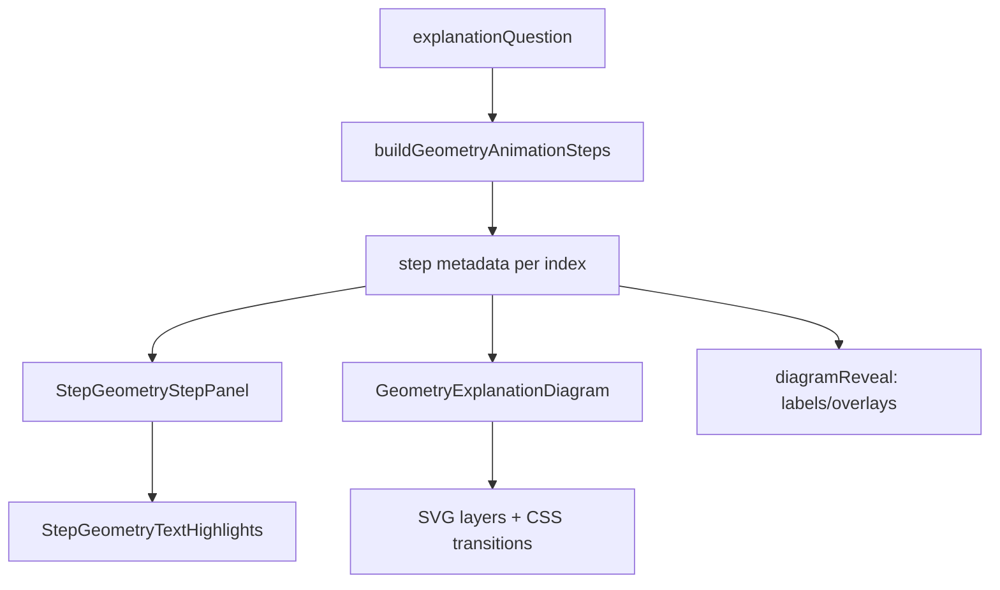

# תוכנית מלאה: אפקטים ויזואליים בצעד-צעד לכל נושאי הגאומטריה

## מצב נוכחי (Baseline)

| רכיב | מצב |
|------|-----|
| [`geometry-master.js`](pages/learning/geometry-master.js) | מודל צעד-צעד פעיל — טקסט + SVG + ניווט/נגן |
| [`buildGeometryAnimationSteps`](utils/geometry-explanations.js) | בונה שלבים מ-`getSolutionSteps` + `diagramEmphasis` בלבד |
| [`getDiagramEmphasisForStep`](utils/geometry-diagram-spec.js) | הדגשת stroke/fill ל-9 סוגי diagram; שאר → `"neutral"` |
| [`GeometryExplanationDiagram.jsx`](components/learning/geometry/GeometryExplanationDiagram.jsx) | SVG סטטי; `useHL()` — שינוי צבע מיידי, **ללא אנימציה** |
| [`GeometryDiagram.js`](components/learning-book/GeometryDiagram.js) | ספר לימוד — 20+ סוגי diagram; **לא מחובר** למודל צעד-צעד |

**מה עובד היום:** שטח, היקף, זוויות משולש, פיתגורס, מעגל, גבהים (חלקי), קובייה-נפח — הדגשה סטטית על צלעות/רדיוס/נוסחה.

**פערים מרכזיים:**
- אין `geometry-animations.js` — מיפוי emphasis לפי **אינדקס שלב** (לא metadata per-step)
- 8 נושאים ללא diagram spec: `transformations`, `rotation`, `volume` (פריזמה/גליל/…), `solids`, `mixed` (חלקי)
- אין ריבועי פיתגורס, רשת שטח, מסלול היקף, תלת-מימד, before/after לטרנספורמציות
- אין הדגשות בטקסט השלב (נוסחה/מספרים/מילות מפתח)
- אין `key={step.id}` — סיכון להדגשה דביקה (כמו בחשבון לפני התיקון)
- אין בדיקות אוטומטיות ל-`buildGeometryAnimationSteps` / emphasis

---

## יעד מוצר סופי

בכל שלב בחלון **📘 צעד-צעד** (גאומטריה בלבד), הילד רואה:

1. **דיאגרמה הנדסית** — הצורה/הממד הפעיל מודגש; שאר האלמנטים מעומעמים
2. **אפקט לימודי** — לא רק צבע: ציור קו (draw-on), רשת יחידות, ריבועים על ניצבים, קשת סיבוב, ציר סימטרייה, וכו'
3. **הדגשות טקסט** — נוסחה / מספרים / מילות מפתח בשלב הנוכחי (לא שינוי ניסוח ההסבר)
4. **ללא קפיצת layout** — גובה דיאגרמה קבוע; reveal של תוויות בשכבה נפרדת
5. **metadata-driven** — כל שלב מגדיר `diagramEmphasis`, `diagramReveal`, `textHighlights`, `animationPreset`
6. **ללא שינוי:** לוגיקת פתרון, ניסוח הסבר (מלבד metadata), כפתורים, טיוטה, דוחות, classroom diagrams



---

## מטריצת כיסוי — נושאים × כיתות

מקור: [`GRADES`](utils/geometry-constants.js) + [`TOPIC_SHAPES`](utils/geometry-constants.js)

| נושא | כיתות | צורות/סוגים | diagram היום | יעד |
|------|-------|-------------|--------------|-----|
| shapes_basic | א׳–ד׳ | ריבוע, מלבן | template/static | הדגשת צלעות, זוויות ישרות, קודקודים |
| area | ב׳–ו׳ | ריבוע→מעגל | ✓ חלקי | + רשת שטח, animate base×height |
| perimeter | ג׳–ו׳ | ריבוע→מעגל | ✓ חלקי | + מסלול היקף (stroke-dashoffset) |
| volume | ד׳–ו׳ | תיבה, קובייה, גליל, כדור… | קובייה בלבד | diagram תלת-מימדי לכל shape |
| angles | ג׳, ה׳, ו׳ | משולש | ✓ | קשתות זווית, סכום 180° |
| pythagoras | ו׳ | משולש ישר זווית | ✓ חלקי | ריבועים על ניצבים + סכום/הפרש |
| circles | ו׳ | רדיוס, היקף, שטח | ✓ | animate רדיוס / היקף |
| heights | ה׳ | משולש, מקבילית, טרפז | ✓ | קו גובה draw-on + בסיס |
| parallel_perpendicular | ג׳, ה׳ | קווים | static | סימון ⊥ / ∥ per step |
| triangles / quadrilaterals | ג׳, ה׳, ו׳ | סיווג | template | הדגשת תכונה (צלעות שוות, זווית…) |
| symmetry | ד׳ | ריבוע, מלבן, משולש | static | ציר/צירים per step |
| diagonal | ד׳, ה׳ | ריבוע, מלבן, מקבילית | static | אלכסון draw-on + משולש ישר זווית |
| tiling | ה׳ | ריבוע, משולש, משושה | tile בלבד | זווית + חזרתיות |
| transformations | א׳, ב׳ | הזזה, שיקוף | **אין** | before/after + חץ/קו מראה |
| rotation | ג׳ | 90°/180°/270° | **אין** | קשת סיבוב + צורה מסובבת |
| solids | ב׳–ו׳ | קובייה, תיבה, גליל… | **אין** (concept) | פאות/קודקודים/שמות |
| mixed | ה׳, ו׳ | לפי שאלה | לפי topic | routing אוטומטי |

---

## שלב 0 — תשתית (Foundation)

**קבצים חדשים:**
- [`utils/geometry-step-types.js`](utils/geometry-step-types.js) — enum: `diagramEmphasis`, `animationPreset`, `textHighlightKind`
- [`utils/geometry-step-highlight-styles.js`](utils/geometry-step-highlight-styles.js) — `GEOMETRY_HIGHLIGHT_STYLE`, `SVG_ANIMATION`, transitions (מחולק מ-`ST` ב-diagram)
- [`utils/geometry-animations.js`](utils/geometry-animations.js) — `buildGeometryStepMetadata(question, topic, gradeKey, stepIndex, totalSteps)` — **מקור אמת** לכל metadata
- [`utils/learning-step-geometry-text.js`](utils/learning-step-geometry-text.js) — `buildGeometryTextHighlightState(step, rawText)` — נוסחה / מספרים / מילות מפתח
- [`components/learning/geometry/StepGeometryTextHighlights.jsx`](components/learning/geometry/StepGeometryTextHighlights.jsx) — render טקסט עם spans מודגשים
- [`components/learning/geometry/StepGeometryStepPanel.jsx`](components/learning/geometry/StepGeometryStepPanel.jsx) — shell: כותרת + טקסט + `key={step.id}`

**Refactor (ללא שינוי UX קיים):**
- [`buildGeometryAnimationSteps`](utils/geometry-explanations.js) — כל שלב מקבל:
```js
{
  id, title, content, text: "",
  diagramEmphasis,           // קיים — נשאר
  diagramReveal: [],          // חדש: ["side_label", "height_dash", "grid"]
  animationPreset: "none",    // drawPath | pulse | gridFill | rotateGhost | ...
  textHighlights: [],         // [{ kind, match }]
}
```
- [`getDiagramEmphasisForStep`](utils/geometry-diagram-spec.js) — **delegate** ל-`geometry-animations.js` (שמירת backward compat לבדיקות קיימות)
- [`GeometryExplanationDiagram.jsx`](components/learning/geometry/GeometryExplanationDiagram.jsx) — props חדשים: `reveal`, `animationPreset`, `stepId`; CSS `@keyframes` + `stroke-dasharray` draw-on

**בדיקות:** `tests/learning/geometry-step-metadata.test.mjs` — smoke לכל `(topic, shape)` ב-`TOPIC_SHAPES`; אין `neutral` בכל השלבים כשיש diagram.

---

## שלב 1 — משפחת מדידות: שטח + היקף

**קבצים:** `geometry-animations.js`, `GeometryExplanationDiagram.jsx`, `geometry-diagram-spec.js`

| צורה | אפקטים חדשים per step |
|------|------------------------|
| ריבוע/מלבן שטח | `gridFill` — ריבועי יחידה; emphasis `formula` → `length_width` → `result` |
| משולש/מקבילית/טרפז | `drawHeight` — קו גובה מצויר; highlight בסיס+גובה בנפרד |
| מעגל שטח | `pulseRadius`; שלב אחרון — מילוי עיגול |
| היקף (כל צורה) | `tracePerimeter` — stroke-dashoffset סביב המצולע/היקף |
| volume cube (קיים) | pseudo-3D: שלושה פנים + emphasis `side³` |

**תיקון מיפוי:** emphasis לפי `step.id` / `stepKind` (identify / formula / substitute / compute / result) — **לא** `i === 2 || i === 3` כפול.

**כיתות:** ב׳–ו׳ (לפי `TOPIC_SHAPES.area/perimeter`).

---

## שלב 2 — נפח + גופים תלת-מימדיים (volume)

**diagram kinds חדשים** ב-`geometry-diagram-spec.js`:
- `rectangular_prism`, `cube`, `cylinder`, `sphere`, `pyramid`, `cone`

**רכיב:** [`components/learning/geometry/solids/`](components/learning/geometry/solids/) — SVG isometric (reuse לוגיקה מ-[`GeometryDiagram.js`](components/learning-book/GeometryDiagram.js) `cube_basic`, `box_basic`).

| שלב | אפקט |
|-----|------|
| זיהוי גוף | highlight פאה/בסיס |
| נוסחה | overlay נוסחה על הדיאגרמה |
| הצבה | מידות מודגשות (א/ר/ג, r, h) |
| חישוב | animate כפל/שורש |
| תוצאה | fill עדין + יחידות |

**כיתות:** ד׳–ו׳.

---

## שלב 3 — זוויות + פיתגורס

**זוויות (`triangle_angles`):**
- `given_two` — קשתות על 2 זוויות ידועות
- `angles_compute` — animate `180° − (α+β)`
- `third_angle` — pulse על הזווית המבוקשת

**פיתגורס:**
- tokens `squares_legs`, `sum`, `diff` — **ריבועים אמיתיים** על כל ניצב (לא רק recolor legs)
- `hyp` / `missing_leg` — draw-on על היתר/ניצב חסר
- reuse `right_triangle` מ-registry הספר

**כיתות:** ג׳, ה׳, ו׳.

---

## שלב 4 — גבהים + מעגל ועיגול

**heights:** reverse של area — emphasis על נוסחה הפוכה; `drawHeight` + highlight `base` vs `height` per step.

**circles (topic `circles`, g6):** אותו `circle` kind; mode perimeter — `tracePerimeter` על הקו; mode area — `pulseRadius` + π overlay.

---

## שלב 5 — נושאי מישור קונцепטואליים

| נושא | diagram / emphasis חדש |
|------|------------------------|
| shapes_basic | `identify_sides`, `identify_vertices`, `right_angles` על template |
| triangles / quadrilaterals | highlight תכונה לפי `p.type` (שווה-צלעות, ישר-זווית, מקבילית…) |
| parallel_perpendicular | `parallel` / `perpendicular` markers + זווית 90° |
| symmetry | `axis_1..n` — קווים מודגשים לפי `p.axes` |
| diagonal | `drawDiagonal` + משולש ישר-זווית מסומן (קשר לפיתגורס) |
| tiling | `showAngle` — הצגת `spec.angle`; `tileRepeat` — 2×2 tiles |

**כיתות:** א׳–ה׳ (לפי curriculum).

---

## שלב 6 — טרנספורמציות + סיבוב

**diagram kinds חדשים** (אין spec היום):
- `transformation_translate` — צורה מקור + ghost + חץ
- `transformation_reflect` — קו מראה + image
- `rotation_step` — נקודת מרכז + קשת `p.angle`

**metadata per step** (`transformations`, `rotation`):
- שלב 1: הצגת סוג
- שלב 2–3: הסבר ויזואלי
- שלב 4: תשובה / זווית

**כיתות:** א׳–ב׳ (transformations), ג׳ (rotation).

---

## שלב 7 — גופים (solids — היכרות)

**diagram kind:** `solid_identify` — קובייה/תיבה/גליל/חרוט/פירמידה/כדור.

| שלב | highlight |
|-----|-----------|
| שם הגוף | silhouette |
| פאות / קודקודים | edge/vertex dots |
| דוגמה מהחיים | note overlay (static) |

**כיתות:** ב׳–ו׳.

---

## שלב 8 — mixed + fallback בטוח

- [`buildGeometryStepMetadata`](utils/geometry-animations.js) — אם `topic === "mixed"`: delegate ל-topic הפנימי מ-`question.params`
- fallback: diagram + emphasis neutral; **לא** לשבור מודל
- שאלות conceptual ללא params מספריים — diagram static + textHighlights בלבד

---

## שלב 9 — חיווט `geometry-master.js`

**שינויים ב-[`geometry-master.js`](pages/learning/geometry-master.js) (~3217):**
- החלפת render ישיר של `activeStep.content` ב-`<StepGeometryStepPanel step={activeStep} />`
- `GeometryExplanationDiagram` — העברת `diagramReveal`, `animationPreset`, `key={activeStep.id}`
- reset step index — כבר קיים; וידוא remount על מעבר שלב (קדימה/אחורה)

**לא לגעת:** auto-play delay, כפתורי נגן, modal overlay, scratchpad.

---

## שלב 10 — בדיקות אוטומטיות + QA

**בדיקות:**
- `geometry-step-metadata.test.mjs` — כל topic ב-GRADES: steps.length > 0, metadata תקין
- `geometry-diagram-emphasis.test.mjs` — אין emphasis כפול על שלבים סמוכים (triangle 5 steps)
- הרחבת [`geometry-diagram-layout.test.mjs`](tests/geometry-diagram-layout.test.mjs) — solid kinds חדשים
- smoke: `buildGeometryAnimationSteps` × sample questions מ-generator

**QA ידני (matrix):**
- 3 שאלות לכל (grade × topic) עם diagram
- בדיקת: מעבר קדימה/אחורה, נגן, אין הדגשה דביקה, אין layout jump
- `npm run build` — חובה לפני מסירה

**מדיניות git:** **אין commit / push** עד אישור מפורש מהמשתמש (כמו תוכנית החשבון).

---

## סדר ביצוע מומלץ (רציף)

```mermaid
flowchart LR
  P0[0 Foundation] --> P1[1 Area Perimeter]
  P1 --> P2[2 Volume 3D]
  P2 --> P3[3 Angles Pythagoras]
  P3 --> P4[4 Heights Circles]
  P4 --> P5[5 Conceptual plane]
  P5 --> P6[6 Transform Rotation]
  P6 --> P7[7 Solids identify]
  P7 --> P8[8 Mixed routing]
  P8 --> P9[9 geometry-master]
  P9 --> P10[10 Tests QA build]
```



מימוש **רציף בשיחה אחת** (או המשך) — לא PRs נפרדים, לא push.

---

## קבצים מרכזיים (סיכום)

| פעולה | קובץ |
|-------|------|
| חדש | `utils/geometry-animations.js`, `utils/geometry-step-types.js`, `utils/learning-step-geometry-text.js` |
| חדש | `components/learning/geometry/StepGeometryStepPanel.jsx`, `StepGeometryTextHighlights.jsx`, `solids/*` |
| עדכון | `utils/geometry-explanations.js`, `utils/geometry-diagram-spec.js` |
| עדכון | `components/learning/geometry/GeometryExplanationDiagram.jsx` |
| עדכון | `pages/learning/geometry-master.js` |
| בדיקות | `tests/learning/geometry-step-metadata.test.mjs`, `geometry-diagram-emphasis.test.mjs` |

---

## הנחיות יישום (כל שלב)

1. **לא לשנות** `getSolutionSteps` prose — רק metadata
2. **reuse** [`GeometryDiagram.js`](components/learning-book/GeometryDiagram.js) / [`geometry-diagram-layout.js`](utils/geometry-diagram-layout.js) — לא לשכפל layout
3. **palette** — emerald/yellow קיים (`ST`); אין redesign
4. **RTL** — טקסט RTL; מידות/נוסחאות LTR (`\u2066…\u2069`)
5. **נגישות** — `aria-hidden` על SVG דקורטיבי; שמירת כותרות שלב
