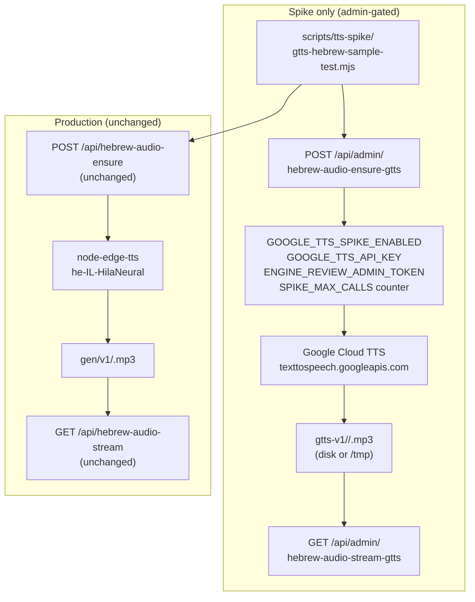

# Google TTS Hebrew Voice Spike — Technical Plan

> This is a spike / evaluation only. Nothing here touches production Hebrew audio, visible UI, Hebrew content, or Math/Geometry pages.

---

## 1. Current Hebrew Audio Baseline (What We Are Comparing Against)

The current server-side TTS stack:

- **Engine:** `node-edge-tts` → `he-IL-HilaNeural` (Microsoft Edge neural voice)
- **API route:** [`pages/api/hebrew-audio-ensure.js`](pages/api/hebrew-audio-ensure.js)
- **Cache key:** `narrationContentHash16(text)` = `sha256(normalize(text)).slice(0,16)` from [`utils/hebrew-audio-narration-binding.js`](utils/hebrew-audio-narration-binding.js)
- **Storage:** local `public/audio/hebrew/gen/v1/<hash>.mp3` or Vercel `/tmp/mleo-hebrew-audio-gen/v1/<hash>.mp3`
- **Stream route:** `GET /api/hebrew-audio-stream?h=<hash16>`
- **Rate limit:** 20 attempts / 10 min per IP, in-memory, enforced in [`lib/security/public-api-rate-limit.js`](lib/security/public-api-rate-limit.js)
- **Known issues:** Vercel `/tmp` ephemeral (cache misses on new instances); browser fallback (`speechSynthesis`) quality inconsistent on Android

Known strengths of current voice (`HilaNeural`):
- Female Hebrew, natural pacing, runs without an API key (Edge TTS protocol)
- Free at current volume

---

## 2. Google Cloud TTS — What We Are Testing

### Available Hebrew voices (as of 2025–2026)

| Voice name | Gender | Type | Notes |
|---|---|---|---|
| `he-IL-Wavenet-A` | Female | WaveNet (neural) | Primary candidate |
| `he-IL-Wavenet-B` | Male | WaveNet (neural) | Secondary candidate |
| `he-IL-Wavenet-C` | Female | WaveNet (neural) | |
| `he-IL-Wavenet-D` | Male | WaveNet (neural) | |
| `he-IL-Standard-A` | Female | Standard (non-neural) | Cheaper; lower quality |
| `he-IL-Standard-B` | Male | Standard | |
| `he-IL-Standard-C` | Female | Standard | |
| `he-IL-Standard-D` | Male | Standard | |

WaveNet voices are neural and significantly better than Standard. For child-facing educational audio, only WaveNet voices are worth evaluating.

### Pricing (informational, not blocking spike)

- WaveNet: ~$16 / 1M characters
- Standard: ~$4 / 1M characters
- Free tier: 1M WaveNet chars/month, 4M Standard chars/month (first 12 months)
- 10–20 samples × ~300 chars average = ~6,000 chars — well within free tier; **no cost risk for this spike**

### API call pattern (no npm package needed — plain HTTPS REST)

```http
POST https://texttospeech.googleapis.com/v1/text:synthesize?key=<GOOGLE_TTS_API_KEY>
Content-Type: application/json

{
  "input": { "text": "..." },
  "voice": { "languageCode": "he-IL", "name": "he-IL-Wavenet-A" },
  "audioConfig": { "audioEncoding": "MP3", "speakingRate": 0.92 }
}
→ { "audioContent": "<base64-encoded MP3>" }
```

For SSML testing, replace `"text"` with `"ssml"`:

```json
{
  "input": {
    "ssml": "<speak><prosody rate='slow'>האזינו לשאלה<break time='400ms'/> ענו לפי מה ששמעתם.</prosody></speak>"
  },
  ...
}
```

---

## 3. Scope — What This Spike Builds

### New files (spike-only, admin-gated)

- **[`pages/api/admin/hebrew-audio-ensure-gtts.js`](pages/api/admin/hebrew-audio-ensure-gtts.js)** — new API endpoint for Google TTS generation; admin token required; hard generation limit; reuses hash + storage pattern
- **[`pages/api/admin/hebrew-audio-stream-gtts.js`](pages/api/admin/hebrew-audio-stream-gtts.js)** — serves the generated Google TTS MP3 by hash; admin token required
- **[`scripts/tts-spike/gtts-hebrew-sample-test.mjs`](scripts/tts-spike/gtts-hebrew-sample-test.mjs)** — Node script that generates 10–20 Hebrew samples via the new endpoint, produces a comparison manifest, and saves output to `docs/tts-spike/`
- **[`docs/tts-spike/`](docs/tts-spike/)** — directory for spike output (MP3 files + result report Markdown); **gitignored** — MP3 files must not be committed

### Files to modify (minimal)

- **[`.env.example`](.env.example)** — add two new variables (see Section 4)
- **[`lib/security/public-api-rate-limit.js`](lib/security/public-api-rate-limit.js)** — add one new exported rate-limit function `rejectIfGttsSpikeRateLimited`

### Files explicitly NOT touched

- [`pages/api/hebrew-audio-ensure.js`](pages/api/hebrew-audio-ensure.js) — production endpoint, **untouched**
- [`pages/api/hebrew-audio-stream.js`](pages/api/hebrew-audio-stream.js) — production stream, **untouched**
- [`utils/audio-playback-core.js`](utils/audio-playback-core.js) — **untouched**
- [`components/HebrewAudioBuild1Panel.js`](components/HebrewAudioBuild1Panel.js) — **untouched**
- [`pages/learning/hebrew-master.js`](pages/learning/hebrew-master.js) — **untouched**
- All Hebrew question/content files — **untouched**
- All UI CSS/Tailwind — **untouched**

---

## 4. Environment Variables

Two new variables — both **server-only** (no `NEXT_PUBLIC_` prefix):

```env
# Google TTS Spike — admin evaluation only. Never expose to client.
# Leave empty/unset in production until spike evaluation is complete and approved.
GOOGLE_TTS_API_KEY=

# Hard kill switch: spike endpoints return 503 unless this is exactly "true".
# Default must be false. Never set to true on public production unless approved.
GOOGLE_TTS_SPIKE_ENABLED=false

# Optional: max number of Google TTS generations allowed per server instance before hard stop.
# Prevents runaway cost during local testing. Default: 50.
GOOGLE_TTS_SPIKE_MAX_CALLS=50
```

These are added to `.env.example` with the comments above.

---

## 5. New API Endpoint Design

### `POST /api/admin/hebrew-audio-ensure-gtts`

**Security gates (checked in order, all must pass):**

1. `GOOGLE_TTS_SPIKE_ENABLED === "true"` — else `503 spike_disabled`
2. `GOOGLE_TTS_API_KEY` is set — else `503 gtts_key_missing`
3. `Authorization: Bearer <ENGINE_REVIEW_ADMIN_TOKEN>` header matches env — else `401 unauthorized` (reuses existing admin token pattern from `ENGINE_REVIEW_ADMIN_TOKEN`)
4. In-memory generation counter `< GOOGLE_TTS_SPIKE_MAX_CALLS` — else `429 spike_limit_reached`
5. In-memory rate limit (5 calls / 10 min per IP) — `rejectIfGttsSpikeRateLimited`

**Request body:**

```json
{
  "text": "האזינו לשאלה וענו לפי מה ששמעתם.",
  "voice": "he-IL-Wavenet-A",
  "ssml": false,
  "speakingRate": 0.92
}
```

- `text`: required, max 2200 chars
- `voice`: optional; defaults to `"he-IL-Wavenet-A"`; must be one of the 8 `he-IL-*` voices listed above
- `ssml`: optional boolean; if true, `text` is treated as SSML and sent in `input.ssml` instead of `input.text`
- `speakingRate`: optional; 0.5–2.0; defaults to `0.92`

**Caching:** same `narrationContentHash16` function, but stored in a separate directory to avoid collision with Edge TTS files:
- Local: `public/audio/hebrew/gen/gtts-v1/<voice>/<hash>.mp3`
- Vercel `/tmp`: `/tmp/mleo-hebrew-audio-gen/gtts-v1/<voice>/<hash>.mp3`

The voice name is included in the path so two voices generating the same text produce different cached files.

**Response:**

```json
{ "ok": true, "hash16": "...", "voice": "he-IL-Wavenet-A", "url": "/api/admin/hebrew-audio-stream-gtts?h=...&v=...", "cached": false }
```

**Error responses:** `400 invalid_text`, `400 invalid_voice`, `401 unauthorized`, `429 spike_limit_reached`, `503 spike_disabled`, `503 gtts_key_missing`, `500 gtts_failed`

### `GET /api/admin/hebrew-audio-stream-gtts?h=<hash16>&v=<voice>`

- Same admin token gate as above
- `GOOGLE_TTS_SPIKE_ENABLED` gate
- Reads `<gtts-v1>/<voice>/<hash>.mp3` from disk/tmp
- Returns `Content-Type: audio/mpeg`, `Cache-Control: private, max-age=86400`
- Returns `404` if file not found (generate it first via ensure endpoint)

---

## 6. Pre-Flight Safety Verification — Mandatory Gates Before Any Audio Generation

**All 7 checks below must pass before the test script (Section 7) is allowed to run.**
If any check fails, stop and fix the endpoint before proceeding. Do not generate audio until every gate is confirmed.

---

### Check 1 — Kill switch: `GOOGLE_TTS_SPIKE_ENABLED=false` returns 503

**Setup:** `.env.local` has `GOOGLE_TTS_SPIKE_ENABLED=false` (or the variable is absent entirely). All other env vars may be set.

**Request:**
```http
POST /api/admin/hebrew-audio-ensure-gtts
Authorization: Bearer <ENGINE_REVIEW_ADMIN_TOKEN>
Content-Type: application/json

{ "text": "בדיקה" }
```

**Expected response:** `HTTP 503`
```json
{ "ok": false, "error": "spike_disabled" }
```

**Pass criterion:** Status is exactly `503` and `error` is `"spike_disabled"`. Any `200`, `401`, or call reaching Google is a failure.

---

### Check 2 — Missing API key returns 503

**Setup:** `.env.local` has `GOOGLE_TTS_SPIKE_ENABLED=true`, but `GOOGLE_TTS_API_KEY` is empty or absent.

**Request:** Same as Check 1 (valid admin token, valid body).

**Expected response:** `HTTP 503`
```json
{ "ok": false, "error": "gtts_key_missing" }
```

**Pass criterion:** Status is `503`, error is `"gtts_key_missing"`. The gate must be checked **after** the spike-enabled gate and **before** any Google API call is attempted. No partial key or placeholder value is ever sent to Google.

---

### Check 3 — Missing or invalid admin token returns 401

**Setup:** `GOOGLE_TTS_SPIKE_ENABLED=true`, `GOOGLE_TTS_API_KEY` is set.

**Request A — no Authorization header:**
```http
POST /api/admin/hebrew-audio-ensure-gtts
Content-Type: application/json

{ "text": "בדיקה" }
```

**Request B — wrong token:**
```http
POST /api/admin/hebrew-audio-ensure-gtts
Authorization: Bearer wrong-token-value
```

**Expected response for both:** `HTTP 401`
```json
{ "ok": false, "error": "unauthorized" }
```

**Pass criterion:** Both requests return `401`. No request without a valid admin token may reach the Google API or write any file.

---

### Check 4 — Invalid voice returns 400

**Setup:** All env vars valid, valid admin token.

**Request:**
```http
POST /api/admin/hebrew-audio-ensure-gtts
Authorization: Bearer <ENGINE_REVIEW_ADMIN_TOKEN>
Content-Type: application/json

{ "text": "בדיקה", "voice": "en-US-Wavenet-A" }
```

**Expected response:** `HTTP 400`
```json
{ "ok": false, "error": "invalid_voice" }
```

**Pass criterion:** Any voice name not in the explicit allowlist of 8 `he-IL-*` voices returns `400`. No call to Google is made. The allowlist must be a hardcoded constant in the endpoint code — not derived from the request.

Additional cases to test:
- Empty string `"voice": ""` → `400 invalid_voice`
- Numeric `"voice": 99` → `400 invalid_voice`
- Voice from a different language `"voice": "ar-XA-Wavenet-A"` → `400 invalid_voice`

---

### Check 5 — Current Hebrew audio endpoint is untouched and still works

**Request (no new headers, no changes):**
```http
POST /api/hebrew-audio-ensure
Content-Type: application/json

{ "text": "האזינו לשאלה וענו לפי מה ששמעתם." }
```

**Expected response:** `HTTP 200`
```json
{ "ok": true, "hash16": "...", "url": "/api/hebrew-audio-stream?h=...", "cached": false }
```
or `"cached": true` if already generated.

**Pass criterion:**
- The existing endpoint returns `200` with a valid hash and stream URL
- The MP3 is correctly served at `GET /api/hebrew-audio-stream?h=<hash16>`
- No import, export, or behavior in `pages/api/hebrew-audio-ensure.js` was changed (verify via `git diff`)
- No import, export, or behavior in `utils/audio-playback-core.js` was changed (verify via `git diff`)

---

### Check 6 — No production UI route changed

**What to verify:**

- `git diff pages/` — only `pages/api/admin/hebrew-audio-ensure-gtts.js` and `pages/api/admin/hebrew-audio-stream-gtts.js` appear as new files. No changes to any existing file under `pages/`.
- `git diff components/` — empty diff (no component files touched)
- `git diff pages/learning/` — empty diff (no learning page touched)
- `git diff pages/_app.js` — empty diff (`STUDENT_PROTECTED_ROUTES` unchanged)
- No new `NEXT_PUBLIC_*` variable was introduced (search `.env.example` and all source files for any new `NEXT_PUBLIC_GOOGLE` or `NEXT_PUBLIC_TTS` string)
- The `/api/admin/*` routes are **not** listed in `STUDENT_PROTECTED_ROUTES` and are not accessible from any student UI surface

---

### Check 7 — No Google API key is exposed to the client bundle or network responses

**A. Build-time check (Next.js bundle):**

Run `next build` and then search the output:

```bash
rg "GOOGLE_TTS_API_KEY" .next/static/ --type js
```

Expected: **zero matches**. The variable name itself must not appear in the client bundle.

Also search for any partial key value if you have a test key set (e.g., first 8 chars of the key):

```bash
rg "<first-8-chars-of-your-test-key>" .next/static/ --type js
```

Expected: **zero matches**.

**B. Runtime response check:**

Inspect the JSON response from `POST /api/admin/hebrew-audio-ensure-gtts` (on a successful call, after all checks pass). Verify:

- Response body does not contain `GOOGLE_TTS_API_KEY`
- Response body does not contain the API key value
- Response body does not contain any Google credential field
- Response headers do not contain any key material

**C. Source code check:**

Verify in `pages/api/admin/hebrew-audio-ensure-gtts.js`:

- `GOOGLE_TTS_API_KEY` is read only as `process.env.GOOGLE_TTS_API_KEY` — never assigned to a variable that is returned in a response
- The key is passed only to the outgoing Google API fetch URL — never logged, never returned, never included in error messages
- No `NEXT_PUBLIC_GOOGLE_TTS*` variable exists anywhere in the codebase

**Pass criterion:** All three sub-checks (build, runtime, source) confirm zero leakage. If the build check reveals any key material in `.next/static/`, stop immediately — do not deploy and do not run the test script.

---

### Verification Summary Table

| # | Check | How to verify | Pass condition |
|---|---|---|---|
| 1 | Kill switch | POST with valid token; `SPIKE_ENABLED=false` | HTTP 503 `spike_disabled` |
| 2 | Missing API key | POST with valid token; no `GOOGLE_TTS_API_KEY` | HTTP 503 `gtts_key_missing` |
| 3 | No admin token | POST without `Authorization` header; POST with wrong token | HTTP 401 `unauthorized` (both) |
| 4 | Invalid voice | POST with non-Hebrew voice name | HTTP 400 `invalid_voice` |
| 5 | Production endpoint intact | POST to `/api/hebrew-audio-ensure`; `git diff` | HTTP 200; zero diff on existing files |
| 6 | No UI route changed | `git diff pages/ components/`; check `_app.js` | Empty diff; no `NEXT_PUBLIC_GOOGLE*` added |
| 7 | No key in client | `next build` + `rg` in `.next/static/`; response inspection | Zero matches; no key in any response |

**All 7 must show PASS before the test script in Section 7 is run.**

---

## 7. Test Script Design

> **Prerequisite:** All 7 checks in Section 6 must be confirmed as PASS before this script is run. The script must not be executed until the pre-flight table shows all green.

**[`scripts/tts-spike/gtts-hebrew-sample-test.mjs`](scripts/tts-spike/gtts-hebrew-sample-test.mjs)**

The script runs from the command line against the local dev server (`localhost:3000`). It does not import Next.js internals directly — it calls the API endpoints via `fetch`. The script reads the admin token from `process.env.ENGINE_REVIEW_ADMIN_TOKEN` — it must be set in the shell environment before running the script (not hardcoded).

**Inputs:** A hardcoded array of 15–20 Hebrew narration samples drawn from real `buildFirstPassNarrationPlaintext` outputs — short reading/comprehension MCQ narrations already used in Hebrew subject questions. These are plain strings; no new Hebrew content is invented.

**What the script does for each sample:**
1. Call `POST /api/admin/hebrew-audio-ensure-gtts` for each of the 4 WaveNet voices
2. Download the resulting MP3 to `docs/tts-spike/samples/<voice>/sample-<n>.mp3`
3. Also call `POST /api/hebrew-audio-ensure` (existing Edge TTS endpoint) for the same text to produce a side-by-side comparison
4. Download Edge TTS MP3 to `docs/tts-spike/samples/edge-tts/sample-<n>.mp3`
5. Append a row to `docs/tts-spike/COMPARISON_MANIFEST.md` with: sample number, first 80 chars of text, hash, voice, file path, file size, latency (ms)

**SSML variant:** For 3 of the samples, also call Google TTS with `ssml: true` and the text wrapped in `<speak><prosody rate="0.85">...</prosody></speak>`, saving to `docs/tts-spike/samples/gtts-ssml/`.

**Output:** `docs/tts-spike/COMPARISON_MANIFEST.md` (auto-generated, gitignored). Owner listens to the MP3 files and completes the `EVALUATION_NOTES.md` template (see Section 8).

---

## 8. Architecture Diagram



---

## 9. Evaluation Criteria

After the script runs, the owner listens to all generated files and fills in a short `EVALUATION_NOTES.md`:

| Criterion | Questions to answer |
|---|---|
| **Voice quality** | Which of the 4 WaveNet voices sounds most natural for a Hebrew-speaking child (age 6–12)? |
| **Clarity** | Are all words clearly pronounced, especially vowel-less Hebrew? |
| **Pace** | Does the default rate (0.92) feel right? Too fast, too slow? |
| **SSML improvement** | Does `<prosody rate="slow">` noticeably improve comprehension? Is it too slow? |
| **Comparison to HilaNeural** | Is Google Wavenet clearly better, roughly equal, or worse than the current Edge voice? |
| **Child-friendliness** | Does the voice feel appropriate for elementary school students (grades 1–6)? |
| **Replace or augment?** | Should Google TTS replace Edge TTS, augment it (e.g., use Google for step narration, keep Edge for question audio), or not be used? |
| **Math/Geometry readiness** | Would this voice work well reading math step narration (Hebrew sentences, not symbols)? |

---

## 10. Safety and Cost Controls

| Control | Implementation |
|---|---|
| `GOOGLE_TTS_SPIKE_ENABLED=false` default | Endpoint returns `503` unless explicitly set to `"true"` — cannot be triggered accidentally |
| Admin token gate | Requires `Authorization: Bearer <ENGINE_REVIEW_ADMIN_TOKEN>` — same token used for engine review admin; not exposed to students |
| Hard generation counter | In-memory counter per server instance; stops at `GOOGLE_TTS_SPIKE_MAX_CALLS` (default 50); resets on server restart |
| Rate limiter | 5 calls / 10 min per IP, in-memory, same pattern as existing limiters |
| Text length limit | Max 2200 chars (same as current `hebrew-audio-ensure`) |
| Separate cache dir | `gtts-v1/` dir is isolated; no risk of overwriting or corrupting Edge TTS cache |
| API key never in client | `GOOGLE_TTS_API_KEY` is server-only, never prefixed `NEXT_PUBLIC_`, never returned in any response |
| Endpoints under `/api/admin/` | Clear namespace separation from production endpoints |
| MP3 files gitignored | `docs/tts-spike/` and `public/audio/hebrew/gen/gtts-v1/` added to `.gitignore` — no audio files committed |

---

## 11. Files Summary

| File | Action | Notes |
|---|---|---|
| `pages/api/admin/hebrew-audio-ensure-gtts.js` | **Create** | New spike endpoint |
| `pages/api/admin/hebrew-audio-stream-gtts.js` | **Create** | New spike stream |
| `scripts/tts-spike/gtts-hebrew-sample-test.mjs` | **Create** | Spike test runner |
| `docs/tts-spike/EVALUATION_NOTES_TEMPLATE.md` | **Create** | Owner fills this after listening |
| `.env.example` | **Modify** | Add `GOOGLE_TTS_API_KEY`, `GOOGLE_TTS_SPIKE_ENABLED`, `GOOGLE_TTS_SPIKE_MAX_CALLS` |
| `lib/security/public-api-rate-limit.js` | **Modify** | Add `rejectIfGttsSpikeRateLimited` |
| `.gitignore` | **Modify** | Add `docs/tts-spike/*.mp3`, `public/audio/hebrew/gen/gtts-v1/` |

---

## 12. Owner Decisions Needed After Spike

1. Which Hebrew WaveNet voice (A/B/C/D) sounds best for educational child-facing audio?
2. Is SSML `<prosody rate="slow">` needed, and what rate value is best?
3. Does Google Wavenet justify replacing `node-edge-tts` for Hebrew question audio? Or should it be used only for Math/Geometry step narration?
4. If Google TTS is adopted, approve the cost model before production rollout (estimated: < $1/month at current Hebrew audio volume; needs verification)
5. Should the spike be expanded to also test Google TTS for Math/Geometry step narration before Phase 1 of the audio step plan?

---

## 13. Spike Result Report Format

After the owner evaluates, the spike produces a short `docs/tts-spike/SPIKE_RESULT_REPORT.md` covering:

- Which Google Hebrew voices were tested (list all 4 WaveNet variants)
- Which voice sounded best and why
- Whether SSML improved pacing and which rate was approved
- Comparison result: Google Wavenet vs. current `he-IL-HilaNeural` (better / equivalent / worse)
- Recommendation: replace / augment / reject
- Math/Geometry step narration readiness verdict
- Go/no-go for including Google TTS in the Math/Geometry audio step plan (Phase 4 upgrade)
