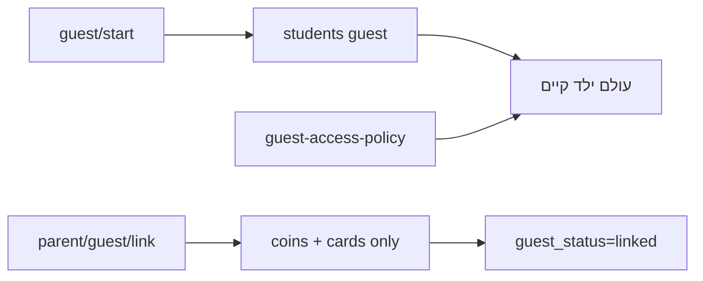

# תוכנית ביצוע — מצב אורch (גרסה פשוטה v2)

**מסמך מלא:** [docs/guest-child-mode/MASTER_PLAN.md](docs/guest-child-mode/MASTER_PLAN.md)

**לא בוצע פיתוח. לא הורץ SQL. תוכנית פשוטה לאישור בלבד.**

---

## סיכום

| נושא | החלטה |
|------|--------|
| מספר ליאו | **6 ספרות**, ייחודי, אוטומטי |
| תצוגה | `שלום אורch 482913` |
| Resume | localStorage + cookie — **בלי סיסמה, בלי recovery API** |
| localStorage נמחק | אורch **חדש** — מספיק |
| שיוך הורה | **רק מטבעות + קלפים** |
| אחרי שיוך | logout → login רגיל; `guest_status=linked` |
| לא מעבירים | התקדמות, sessions, אבחון, דוחות, המלצות |
| לא בונים | QR, recovery, merge מורכב, בחירת כיתה |

---

## ארכיטקטורה

**SSOT:** [`lib/guest/guest-access-policy.server.js`](lib/guest/guest-access-policy.server.js)

**הרחבות קיימות:**
- [`lib/games/server/game-access.server.js`](lib/games/server/game-access.server.js) — `guest_locked`
- [`components/games/GameHubCard.jsx`](components/games/GameHubCard.jsx) — נעילה visible
- [`pages/student/home.js`](pages/student/home.js) — tiles נעולים + שם אורch

---

## API (מינימום)

| Route | תפקיד |
|-------|--------|
| `POST /api/student/guest/start` | יצירה |
| `POST /api/student/guest/resume` | resume במכשיר |
| `POST /api/parent/guest/link` | coins+cards + linked |
| `GET/PUT /api/admin/guest/*` | Admin |

**אין:** `guest/recover`, `parent/guest/preview` (אופציונלי)

---

## SQL (בעלים מריץ)

`supabase/migrations/NNN_guest_child_mode.sql`:

- `students`: `account_kind`, `leo_number` (6), `guest_status`, `guest_linked_*`
- `guest_device_bindings`
- `guest_mode_settings`, `guest_game_access`, `guest_learning_access` (subject+topic, **ללא כיתה**)
- `student_sessions.session_kind`
- System Guest Parent

---

## שלבי ביצוע

1. אישור v2
2. SQL (עצירה)
3. guest auth (start/resume)
4. policy + /me
5. Admin
6. UI login + home
7. locks + economy
8. parent link — `transferGuestCoinsAndCards` (עצירה)
9. report guards
10. QA

**מאמץ:** ~2–3 שבועות

---

**לא בוצע פיתוח. לא הורץ SQL. זו תוכנית פשוטה לאישור בלבד.**
