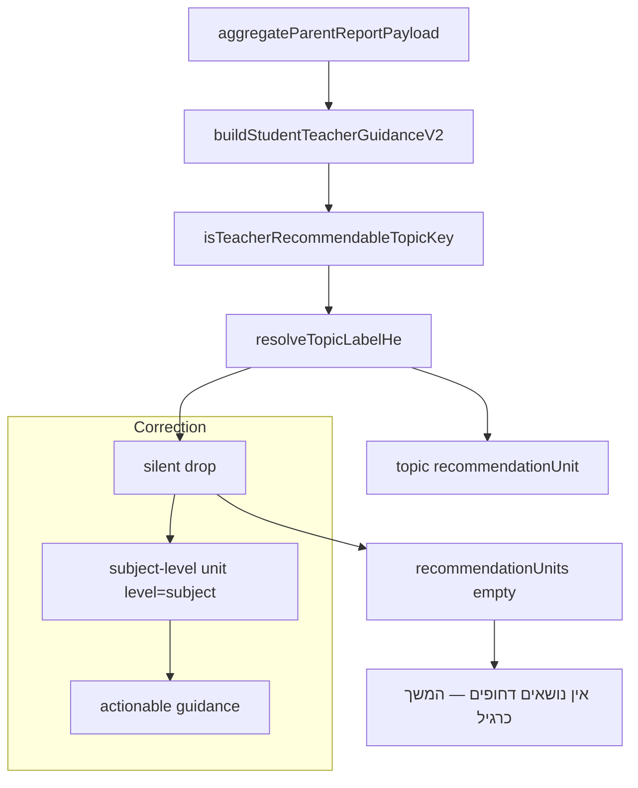

# Teacher Guidance Engine Correction Plan — Subject Fallbacks, Severity Model, and Misleading-State Guards

**Target document (written on Build approval):** [docs/qa/TEACHER_GUIDANCE_ENGINE_CORRECTION_PLAN.md](docs/qa/TEACHER_GUIDANCE_ENGINE_CORRECTION_PLAN.md)

**Source audit (accepted, read-only):** [docs/qa/TEACHER_GUIDANCE_ENGINE_DEEP_AUDIT.md](docs/qa/TEACHER_GUIDANCE_ENGINE_DEEP_AUDIT.md)

---

## MANDATORY WORKFLOW BLOCK

**This document is the single source of truth for implementation.**

The owner may approve implementation by pressing the Cursor **Build/Implement** button. No additional chat-body implementation instructions are required or expected.

After owner approval, implement the **full approved scope** start to finish. Phases below are **execution order only** — not stop-and-wait approval gates. Complete all implementation first, then run QA, fix issues, rerun relevant tests, and produce the final closure report (Section 16).

**Constraints for the entire implementation:**

- No SQL or DB migrations (unless a future audit proves otherwise — none expected here).
- No retroactive DB correction, no question-generator changes, no parent/guardian/worksheet/simulation workstream files.
- Do **not** change Hebrew strings already in product files except by adding/updating entries in [lib/teacher-portal/teacher-ui.he.js](lib/teacher-portal/teacher-ui.he.js) per the **owner-approved copy table** in Section 7 (no ad-hoc copy during implementation).
- No commit, no push unless explicitly approved at the end with **explicit pathspecs** only (see Section 7.1).
- Do **not** use `git add .` or `git add -A`.
- Do not touch unrelated simulation/parallel files (`scripts/school-portal/**`, school sim docs, `.cursor/plans/*school*`).

---

## 1. Problem statement

Manual review + deep audit confirm an **engine-level correctness** failure: weak accuracy (e.g. Hebrew 31%, Moledet 33%, class 61–64%) can produce calm or empty guidance because:

1. Topics bucketed as `general` / `mixed` or with unmapped labels are **silently dropped** in [lib/teacher-server/teacher-guidance-v2.server.js](lib/teacher-server/teacher-guidance-v2.server.js) (lines 305–312, 485–491).
2. V2 builds units **only** from mapped topic keys; V1’s subject fallback in [lib/teacher-server/teacher-recommendations.server.js](lib/teacher-server/teacher-recommendations.server.js) (lines 184–202) is **not surfaced** in V2 UI paths.
3. UI empty states in [pages/teacher/student/[studentId].js](pages/teacher/student/[studentId].js) (line 314) and [lib/school-portal/school-report-view-model.js](lib/school-portal/school-report-view-model.js) (lines 198–216, 670) have **no accuracy guards**.
4. `riskLevel` / `classHealthSignal` use weak signal-count logic and a 55% class cutoff, so 31% can show `"כדאי לעקוב"` and 61% can show `"הכיתה מתקדמת כסדרה"`.



---

## 2. Architecture decisions

### 2.1 Subject-level fallback (student) — Decision

**Add an explicit subject-level unit in V2** after the per-subject topic loop. Do **not** fake a topic label. Do **not** invent `topicLabelHe` from subject name alone for topic display.

**Emit subject fallback when ALL are true:**

| Condition | Rule |
|-----------|------|
| Subject accuracy weak | `subj.accuracy < 65` (aligns with monitor upper bound) |
| Enough answers | `subj.answers >= MIN_ANSWERS_FOR_STUDENT_SIGNAL` (5) |
| No topic unit for subject | Zero `recommendationUnits` with `level !== "subject"` and matching `subject` |
| Classification gap OR unmapped weakness | At least one of: (a) dropped topic keys in `general`/`mixed`/unmapped with `answers >= 3`, OR (b) subject accuracy below threshold while topic loop produced nothing |

**Do NOT emit subject fallback when:**

- A mapped topic unit already exists for that subject.
- Subject accuracy `>= 75%` (on_track).
- `insufficientData === true`.

**Exact student unit shape** (additive fields on existing unit object):

```javascript
{
  unitId: `${subject}::__subject_fallback`,
  scope: "individual",
  level: "subject",                    // NEW discriminator
  subject: "hebrew",
  subjectLabelHe: "עברית",             // from subjectLabelHe()
  topic: null,
  topicLabelHe: null,
  subtopic: null,
  taxonomyId: null,
  subtopicLabelHe: null,
  reason: "low_subject_accuracy_no_mapped_topic",
  guidanceSeverityTier: "critical",    // NEW — see 2.3
  severity: "P2",                      // keep diagnostic priority for sorting; map from tier
  confidence: "moderate",
  classificationGap: true,
  classificationGapReasons: ["general", "unmapped_topic"], // internal array
  evidenceSummary: {
    wrongCount,
    totalAnswers,
    accuracyPct,
    sessionCount: subj.sessions ?? null,
    droppedTopicAnswerCount,           // optional internal QA field
  },
  recentMistakeExamples: [],           // subject-level only; no fabricated prompts
  classContext: null,
  recommendedActionType: "diagnostic_practice", // stable machine key
  suggestedAssignmentType: "short_diagnostic",
  interventionPlan: null,
  sourceUnit: "subject_accuracy_fallback",
  headlineHe: "עברית — קושי ברמת מקצוע",        // precomposed for UI
  actionHe: "מומלץ לפתוח תרגול אבחוני קצר כדי לזהות את הנושא המדויק",
}
```

**Topic-level units remain unchanged** except: set `level: "topic"` explicitly (default) for clarity.

**Sorting:** Topic units sort before subject fallbacks for the same subject; among subject fallbacks, lowest `accuracyPct` first. Cap remains 5 student units total.

### 2.2 Class-level subject fallback — Decision

**Add class subject fallback units** in `buildClassTeacherGuidanceV2` after the `weaknessTopics` loop.

**Emit when ALL are true:**

| Condition | Rule |
|-----------|------|
| Cohort/subject weak | Scoped subject `accuracy < 65` OR overall `cohortAccuracy < 65` when no subject scope |
| Enough class data | `totalAnswers >= MIN_CLASS_ANSWERS_FOR_GUIDANCE` (10) and `studentsWithActivity > 0` |
| No topic class units for subject | Zero `classRecommendationUnits` with `topic` set for that `subject` |
| Gap or empty topic path | Same classification-gap logic using class `subjects[sid].topics` rollup |

**Exact class unit shape:**

```javascript
{
  unitId: `${subject}::__class_subject_fallback`,
  scope: "class",
  level: "subject",
  subject,
  subjectLabelHe,
  topic: null,
  topicLabelHe: null,
  reason: "low_class_subject_accuracy_no_mapped_topic",
  guidanceSeverityTier: "class_needs_reinforcement", // from cohort/subject accuracy
  severity: "P2",
  affectedStudentCount: studentsWithActivityInSubject, // from rollup if available else studentsWithActivity
  affectedStudentIds: [],
  affectedFraction: null,
  cohortWrongCount,
  cohortAnswers,
  cohortAccuracyPct,
  classificationGap: true,
  classificationGapReasons: [...],
  recommendedActionType: "class_diagnostic_review",
  suggestedAssignmentType: "class_diagnostic_or_review",
  interventionPlan: null,
  headlineHe: "עברית — קושי ברמת מקצוע בכיתה",
  actionHe: "מומלץ לפתוח פעילות אבחונית קצרה או חזרה כיתתית ממוקדת",
}
```

**Precedence:** Mapped `classRecommendationUnits` with `topicLabelHe` always win; subject fallback fills gaps only.

### 2.3 Severity model — Decision

Introduce **`guidanceSeverityTier`** (accuracy-primary) as the **canonical** severity field for all new Teacher Guidance V2 UI, Report Hub guidance text, and misleading-state guards.

#### 2.3.1 Canonical field contract (no mixed key names)

| Field | Role | Allowed values | Hebrew mapper | Used by |
|-------|------|----------------|---------------|---------|
| **`guidanceSeverityTier`** | **Canonical** — all V2 UI, guards, insights, dashboard attention labels | **Student:** `critical`, `needs_reinforcement`, `monitor`, `on_track`. **Class:** `critical_class`, `class_needs_reinforcement`, `class_monitor`, `class_on_track` | Student: `guidanceSeverityTierHe(tier)`. Class: `classGuidanceSeverityTierHe(tier)` — **same four class keys as `guidanceSeverityTier`** | [pages/teacher/student/[studentId].js](pages/teacher/student/[studentId].js), [pages/teacher/class/[classId].js](pages/teacher/class/[classId].js), [lib/school-portal/school-report-view-model.js](lib/school-portal/school-report-view-model.js), [components/teacher-portal/TeacherDashboardClient.jsx](components/teacher-portal/TeacherDashboardClient.jsx), misleading-state guards |
| **`classHealthSignal`** | **Legacy compatibility only** — existing payloads/consumers that still read `teacherSummary.classHealthSignal` | **Exactly:** `critical_class`, `needs_reinforcement`, `monitor`, `strong`, plus `no_data` when insufficient | `classHealthHe(signal)` — maps legacy keys to Hebrew (see Section 3) | Older code paths only; **new UI must read `guidanceSeverityTier` first** |
| **`teacherGuidance.riskLevel`** | **Legacy compatibility only** — student V1 consumers | `high`, `moderate`, `low` only (unchanged enum) | `riskLevelHe(level)` | Fallback when `guidanceSeverityTier` absent; not primary V2 display |
| **`severity` (P1–P4)** | Diagnostic sort priority on units | `P1`–`P4` | N/A (not shown as headline) | Unit ordering only |
| **`suggestedGroups` tiers** | Differentiation buckets (not guidance severity) | Bucket keys: `struggling`, `on_track`, `advanced` only | `groupTierHe(tier)` | Class report “קבוצות” section only |

**Mandatory mapping at build time** (`buildClassTeacherGuidance` / `buildClassTeacherGuidanceV2`):

| `guidanceSeverityTier` (canonical) | `classHealthSignal` (legacy, always set in parallel) |
|------------------------------------|------------------------------------------------------|
| `critical_class` | `critical_class` |
| `class_needs_reinforcement` | `needs_reinforcement` |
| `class_monitor` | `monitor` |
| `class_on_track` | `strong` |

**Deprecated — do not emit for new payloads:** `progressing`, `needs_support` (replace per table above). Guards must **never** check `progressing` / `needs_support` for V2 paths.

**Student / subject tiers** — `deriveStudentGuidanceSeverityTier(accuracyPct)`:

| Accuracy | `guidanceSeverityTier` |
|----------|------------------------|
| 0–49% | `critical` |
| 50–64% | `needs_reinforcement` |
| 65–74% | `monitor` |
| 75%+ | `on_track` |

**Class tiers** — `deriveClassGuidanceSeverityTier(accuracyPct)`:

| Accuracy | `guidanceSeverityTier` | `classHealthSignal` (legacy parallel) |
|----------|------------------------|---------------------------------------|
| 0–49% | `critical_class` | `critical_class` |
| 50–64% | `class_needs_reinforcement` | `needs_reinforcement` |
| 65–74% | `class_monitor` | `monitor` |
| 75%+ | `class_on_track` | `strong` |

Set `teacherGuidanceBlock.guidanceSeverityTier` on student and class V2 roots from overall/cohort accuracy (and per-unit tiers from subject/cohort slice accuracy).

#### 2.3.2 Interaction with existing fields

| Field | Exact change |
|-------|----------------|
| `teacherGuidance.riskLevel` | Map from `guidanceSeverityTier`: `critical`→`high`, `needs_reinforcement`→`moderate`, `monitor`→`moderate`, `on_track`→`low`. Inactivity signal may bump `monitor`→`needs_reinforcement` only; never downgrade `critical`. |
| `riskSignals` | Unchanged machine codes; UI may list signals **and** canonical tier headline. |
| `classHealthSignal` | Set only via mapping table in §2.3.1; remove 55/80 `progressing`/`needs_support` logic. |
| Diagnostic `severity` (P1–P4) | Keep `resolvePriority()` for topic units; subject fallbacks default `P2`. |
| **Attention list** | Include student when `accuracy < 65` and `totalAnswers >= MIN_STUDENT_ANSWERS_FOR_GROUP` (3). **Priority boost** (sort/rank higher): `accuracy < 50`. Threshold change: eligibility `<50` → `<65` in [lib/teacher-server/teacher-class-report.server.js](lib/teacher-server/teacher-class-report.server.js). |
| **Learning groups (`suggestedGroups`)** | **Exact buckets** (replace `STRUGGLING_ACCURACY_CUTOFF=55` / `ADVANCED=80`): `struggling` if `accuracy < 65`; `on_track` if `65 <= accuracy < 75`; `advanced` if `accuracy >= 75`; require `answers >= MIN_STUDENT_ANSWERS_FOR_GROUP` (3) for placement (except `no_activity_in_range`). Keep `groupReason` codes: `low_accuracy`, `expected_progress`, `high_accuracy`, `no_activity_in_range` — **not** severity tier keys. |
| Dashboard | Read `guidanceSeverityTier`; use `guidanceSeverityTierHe` / `classGuidanceSeverityTierHe`. |
| Report Hub | Read `guidanceSeverityTier` + units; use `classGuidanceSeverityTierHe` for class copy; legacy `classHealthHe(classHealthSignal)` only if tier missing. |

**Constants** (single source in [lib/teacher-server/teacher-recommendations.server.js](lib/teacher-server/teacher-recommendations.server.js), export for V2):

```javascript
export const GUIDANCE_TIER_THRESHOLDS = {
  CRITICAL_MAX: 49,           // 0–49%
  NEEDS_REINFORCEMENT_MAX: 64, // 50–64%
  MONITOR_MAX: 74,            // 65–74%
  // 75%+ on_track / class_on_track
};
export const LOW_ACCURACY_THRESHOLD = 65; // topic weak + subject fallback gate (was 60)
export const ATTENTION_ACCURACY_THRESHOLD = 65;
export const ATTENTION_PRIORITY_BOOST_THRESHOLD = 50;
```

Topic weak detection and subject fallback gate: `accuracy < LOW_ACCURACY_THRESHOLD` (65).

### 2.4 Misleading-state guards — Decision

Add **pure functions** in [lib/teacher-portal/teacher-ui.he.js](lib/teacher-portal/teacher-ui.he.js):

```javascript
export function hasActionableGuidanceV2(guidance) { ... }
export function canShowStudentCalmFocusMessage(guidance) { ... }
export function canShowClassCalmWeakTopicsMessage(guidance) { ... }
```

**Rules:**

| Message | Block when |
|---------|------------|
| `אין נושאים דחופים כרגע — המשך כרגיל.` | Any `recommendationUnits` (topic or subject), OR `guidanceSeverityTier` in `critical`/`needs_reinforcement`, OR any permitted subject `accuracy < 65` with `answers >= 5`, OR `overallStats.accuracyPct < 65` with enough answers |
| `לא זוהו נושאים חלשים משמעותיים — המשיכו מעקב.` (school hub) | `cohortAccuracy < 65` with `totalAnswers >= 10`, OR any `classRecommendationUnits`, OR `guidanceSeverityTier` not in (`class_monitor`, `class_on_track`) |
| `הכיתה מתקדמת כסדרה` / progressing insight | `cohortAccuracy < 65` OR `guidanceSeverityTier` in (`critical_class`, `class_needs_reinforcement`, `class_monitor`) |
| `כדאי לעקוב` as **only** guidance | `guidanceSeverityTier` in (`critical`, `needs_reinforcement`) — must also render subject/topic unit or `guidanceSeverityTierHe` headline |

**Replacement behavior:** When calm message blocked, render first subject/topic unit OR tier banner (`guidanceSeverityTierHe`) — never leave recommendations section empty for weak accuracy.

### 2.5 Topic preferred over subject — Decision

Per subject iteration order:

1. Collect mapped topic units (existing loop).
2. If `topicUnitsForSubject.length > 0` → **skip** subject fallback for that subject.
3. Else evaluate subject fallback conditions.

Dedupe: `unitId` keys prevent duplicate subject/topic pairs.

### 2.6 Classification-gap diagnostics — Decision

During topic loop, track per subject:

```javascript
droppedTopics: [{ topicKey, reason: "general"|"mixed"|"unmapped_topic"|"sparse_topic"|"missing_topic", answers }]
```

Expose on guidance root (student/class):

```javascript
classificationGapSummary: {
  subjects: [{ subject, reasons: string[], droppedAnswerCount, totalAnswers }]
}
```

- Included in API JSON for QA.
- **Not rendered** in teacher UI unless `NEXT_PUBLIC_TEACHER_GUIDANCE_DEBUG=1` (optional dev-only banner; default off).
- `classificationGap: true` on subject-level units only.

No SQL. No admin DB tables.

### 2.7 `supportSuggestionsV2` — Decision

Update `buildSupportSuggestionsV2FromUnits` in [lib/teacher-server/teacher-guidance-v2.server.js](lib/teacher-server/teacher-guidance-v2.server.js) to include units where `level === "subject"`:

```javascript
dedupeKey = `${action}::${subject}::${topic || "__subject__"}`
label = u.topicLabelHe || u.headlineHe
```

---

## 3. Hebrew copy (owner-approved — implement exactly)

Add to [lib/teacher-portal/teacher-ui.he.js](lib/teacher-portal/teacher-ui.he.js) as named exports / maps:

**Student severity (`guidanceSeverityTierHe`):**

| Key | Hebrew |
|-----|--------|
| `critical` | `דורש התערבות מיידית` |
| `needs_reinforcement` | `דורש חיזוק` |
| `monitor` | `כדאי לעקוב` |
| `on_track` | `בקצב תקין` |

**Student subject fallback (templates):**

| Field | Hebrew |
|-------|--------|
| Headline | `[מקצוע] — קושי ברמת מקצוע` (e.g. `עברית — קושי ברמת מקצוע`) |
| Evidence | `[X]% הצלחה מתוך [Y] תשובות` |
| Action | `מומלץ לפתוח תרגול אבחוני קצר כדי לזהות את הנושא המדויק` |

**Class severity — `classGuidanceSeverityTierHe(tier)`** (canonical; keys match `guidanceSeverityTier` for class):

| `guidanceSeverityTier` | Hebrew |
|------------------------|--------|
| `critical_class` | `הכיתה דורשת התערבות מיידית` |
| `class_needs_reinforcement` | `הכיתה דורשת חיזוק` |
| `class_monitor` | `הכיתה דורשת מעקב ותרגול ממוקד` |
| `class_on_track` | `הכיתה בקצב תקין` |

**Class subject fallback:**

| Field | Hebrew |
|-------|--------|
| Headline | `[מקצוע] — קושי ברמת מקצוע בכיתה` |
| Action | `מומלץ לפתוח פעילות אבחונית קצרה או חזרה כיתתית ממוקדת` |

**Legacy `classHealthHe(signal)`** — used only when `guidanceSeverityTier` is absent; maps `classHealthSignal` legacy keys to the **same Hebrew strings** as above:

| `classHealthSignal` (legacy) | Hebrew (same as canonical tier) |
|------------------------------|-----------------------------------|
| `critical_class` | `הכיתה דורשת התערבות מיידית` |
| `needs_reinforcement` | `הכיתה דורשת חיזוק` |
| `monitor` | `הכיתה דורשת מעקב ותרגול ממוקד` |
| `strong` | `הכיתה בקצב תקין` |
| `no_data` | existing insufficient-data copy (unchanged) |

**Do not use** `classHealthHe("progressing")` or `classHealthHe("needs_support")` in new code paths.

**Blocked calm messages** — keep strings but gate visibility; when blocked and no units, show:

`יש קושי במקצוע — נדרש תרגול אבחוני לזיהוי נושא מדויק` (student focus fallback banner)

`הכיתה מציגה קושי במקצוע — מומלץ חיזוק כיתתי אבחוני` (class weak-topics fallback banner)

**Do not show:** `נושא לא מסווג`, raw topic keys, `general`/`mixed` as labels.

**Legacy `riskLevelHe`:** Map `high` → `דורש התערבות מיידית` when tier not present (compat).

---

## 4. Files to change (execution order)

### Phase 1 — Shared severity and helpers

| File | Work |
|------|------|
| [lib/teacher-server/teacher-recommendations.server.js](lib/teacher-server/teacher-recommendations.server.js) | Export tier thresholds; `deriveStudentGuidanceSeverityTier`, `deriveClassGuidanceSeverityTier`; set `guidanceSeverityTier` + legacy `classHealthSignal` per §2.3.1 mapping; update `riskLevel`; replace `buildSuggestedGroups` cutoffs with 65/75 buckets (§2.3.2); remove `STRUGGLING_ACCURACY_CUTOFF` / old 55/80 logic; V1 subject fallback uses `LOW_ACCURACY_THRESHOLD` (65) |
| [lib/teacher-server/teacher-guidance-v2.server.js](lib/teacher-server/teacher-guidance-v2.server.js) | Import tier helpers; track dropped topics; build student/class subject units; set `guidanceSeverityTier` on base; extend `buildSupportSuggestionsV2FromUnits`; emit `classificationGapSummary` |

### Phase 2 — Report payloads and attention

| File | Work |
|------|------|
| [lib/teacher-server/teacher-class-report.server.js](lib/teacher-server/teacher-class-report.server.js) | Attention threshold 50→65; pass through new guidance fields |
| [lib/teacher-server/teacher-dashboard.server.js](lib/teacher-server/teacher-dashboard.server.js) | Prefer `guidanceSeverityTier` for attention ranking labels |

### Phase 3 — Hebrew UI layer

| File | Work |
|------|------|
| [lib/teacher-portal/teacher-ui.he.js](lib/teacher-portal/teacher-ui.he.js) | `guidanceSeverityTierHe`, `classGuidanceSeverityTierHe`, legacy `classHealthHe` per §3; subject fallback formatters; misleading-state guards (canonical tier keys only); `dedupeTeacherRecommendationItems` for `level==="subject"` |

### Phase 4 — Surfaces

| File | Work |
|------|------|
| [pages/teacher/student/[studentId].js](pages/teacher/student/[studentId].js) | Render subject units (`level==="subject"`); use guards for focus + recommendations empty state; show tier headline when critical/needs_reinforcement |
| [pages/teacher/class/[classId].js](pages/teacher/class/[classId].js) | Render class subject units; guard weak-topics empty state; class tier banner |
| [lib/school-portal/school-report-view-model.js](lib/school-portal/school-report-view-model.js) | `classInsightText`, `studentInsightText`, hub focus/empty strings — same guards and subject units |
| [components/teacher-portal/TeacherDashboardClient.jsx](components/teacher-portal/TeacherDashboardClient.jsx) | Display tier label on attention cards if field present |

### Phase 5 — Tests

| File | Work |
|------|------|
| [scripts/tests/teacher-guidance-v2-unit.mjs](scripts/tests/teacher-guidance-v2-unit.mjs) | All QA cases in Section 10 |
| [scripts/tests/school-report-view-model-unit.mjs](scripts/tests/school-report-view-model-unit.mjs) | Hub insight/empty-state guards for 61% class |

---

## 5. Explicit out of scope

- SQL / DB migrations / retroactive data fixes
- [lib/parent-server/report-data-aggregate.server.js](lib/parent-server/report-data-aggregate.server.js) `general` bucketing (noted as future metadata workstream)
- Expanding [utils/math-report-generator.js](utils/math-report-generator.js) topic dictionaries (separate classification pipeline)
- Parent/guardian reports, worksheet PDF, classroom activity automation
- School simulation scripts and `scripts/school-portal/**`
- Broad UI redesign beyond guidance sections
- Changing Hebrew question metadata or generators

---

## 6. QA plan (must pass before closure)

### 6.0 Who runs what (no mid-build owner gate)

| Responsibility | Owner |
|----------------|-------|
| Unit tests, view-model tests, `npm run build` | **Cursor** — required before closure report; fix failures and rerun until pass |
| Lightweight HTTP/script smoke | **Cursor** — run only if an existing relevant script is found in `package.json` or `scripts/tests/` for teacher guidance (none required today) |
| Manual browser verification (student 31%, class 61%, Report Hub) | **Owner** — after closure report delivery; **not** a stop-and-wait implementation gate |

**No dedicated teacher-guidance browser smoke script exists in the repo today.** Do not block closure on owner browser checks. Document recommended owner spot-checks in the closure report under “Post-delivery owner verification”.

### Engine unit tests (`teacher-guidance-v2-unit.mjs`)

| Case | Input | Assert |
|------|-------|--------|
| S1 | 31% Hebrew, topics only `general` | ≥1 subject unit, `level==="subject"`, `topic===null`, `classificationGap===true`, tier `critical` |
| S2 | 33% Moledet, unmapped keys only | Subject fallback for `moledet-geography`, no `topicLabelHe` |
| S3 | 58% subject, no mapped topics | `needs_reinforcement`, subject fallback present |
| S4 | 80%+ overall | No weak recommendation units |
| S5 | Mapped `fractions` weak + Hebrew general weak | Math topic unit present; Hebrew subject fallback present |
| S6 | Mapped topic only | No subject fallback for that subject |
| C1 | 61% cohort, empty `weaknessTopics` / unmapped | Class subject fallback; `guidanceSeverityTier === "class_needs_reinforcement"`; legacy `classHealthSignal === "needs_reinforcement"` |
| C2 | 64% cohort | `guidanceSeverityTier === "class_needs_reinforcement"` (not `class_monitor`, not `class_on_track`) |
| C3 | 75%+ cohort | `guidanceSeverityTier === "class_on_track"`; legacy `classHealthSignal === "strong"`; calm empty-state allowed |
| T1 | `general`/`mixed` keys | Never appear as `topicLabelHe` |

### View-model tests (`school-report-view-model-unit.mjs`)

| Case | Assert |
|------|--------|
| H1 | 61% class → insight does not contain `מתקדמת כסדרה` |
| H2 | Subject class unit → hub focus lists subject headline |

### Automated checks (Cursor must run before closure)

- No calm messages when accuracy below tier thresholds (Section 2.4) — covered by unit tests + view-model tests
- No raw keys / `נושא לא מסווג`
- No duplicate recommendations (dedupe keys)
- Canonical class tier keys only in new assertions (`critical_class`, `class_needs_reinforcement`, `class_monitor`, `class_on_track`)

### Commands (required)

```powershell
node scripts/tests/teacher-guidance-v2-unit.mjs
node scripts/tests/school-report-view-model-unit.mjs
npm run build
```

All three must exit 0 before writing the closure report.

---

## 7. Delivery requirements (post-implementation)

Produce **`docs/qa/TEACHER_GUIDANCE_ENGINE_CORRECTION_CLOSURE_REPORT.md`** containing:

- Summary of changes vs audit root causes
- Tests run + pass/fail (all commands from Section 6)
- `git status --short` and `git diff --name-only`
- Exact files changed (path list)
- Confirmation: no SQL run, no simulation files touched
- **Post-delivery owner verification** (optional browser checklist — not a Cursor gate)
- Commit/push status (only if owner approved per §7.1)

### 7.1 Commit / push rule (if approved later)

Default: **no commit, no push.**

If the owner explicitly approves commit/push after reviewing the closure report, Cursor must **first** return in chat:

1. `git status --short`
2. `git diff --name-only`
3. Exact file list to include in the commit (pathspecs)
4. Exact unrelated files to **exclude** (simulation, `.env.local`, school-portal sim, etc.)

Then commit using **explicit pathspecs only**, for example:

```powershell
git add lib/teacher-server/teacher-guidance-v2.server.js lib/teacher-server/teacher-recommendations.server.js ...
git commit -m "..."
```

**Forbidden:** `git add .`, `git add -A`, or any blanket staging.

Push only if the owner explicitly requests it after the commit.

---

## 8. Implementation phases (execution order)

| Phase | ID | Deliverable |
|-------|-----|-------------|
| 1 | `severity-helpers` | Tier constants + derive functions in `teacher-recommendations.server.js` |
| 2 | `student-subject-fallback` | Student V2 subject units + gap tracking |
| 3 | `class-subject-fallback` | Class V2 subject units + cohort/subject rollup |
| 4 | `v1-alignment` | `riskLevel`, `classHealthSignal`, attention threshold |
| 5 | `hebrew-ui` | Copy maps + guards in `teacher-ui.he.js` |
| 6 | `surfaces` | Student/class pages, school view-model, dashboard |
| 7 | `unit-tests` | Full test matrix Section 6 |
| 8 | `qa-closure` | Required automated checks (Section 6) + closure report |

---

## 9. Risk notes

| Risk | Mitigation |
|------|------------|
| More classes show `needs_reinforcement` | Expected; owner-approved copy |
| Threshold 60→65 increases units | Cap limits unchanged (5 student / 10 class) |
| `supportSuggestionsV2` shape change | Filter accepts `headlineHe` |
| Double severity labels | Show `guidanceSeverityTierHe` / `classGuidanceSeverityTierHe` OR `riskLevelHe`, not both when redundant |
| Mixed class tier keys | Enforce §2.3.1 contract in code review and tests |

---

## 10. Confirmation (planning session)

- **No code changed**
- **No SQL run**
- **No commit / push / staging**
- **No simulation files touched**
- **No Hebrew product copy changed** (copy specified in Section 3 for Build only)

### Plan revision (2026-05-28 — pre-Build clarification)

- §2.3.1 — canonical `guidanceSeverityTier` vs legacy `classHealthSignal` contract
- §2.3.2 — exact learning-group buckets; attention 65 / priority 50
- §3 — unified class Hebrew mappers; deprecated `progressing` / `needs_support`
- §6.0 — Cursor automated QA vs owner post-delivery browser checks
- §7.1 — explicit commit/push pathspec rules
