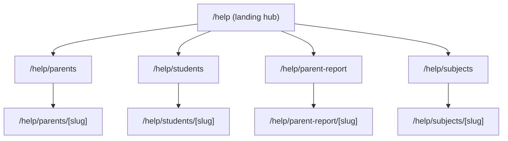
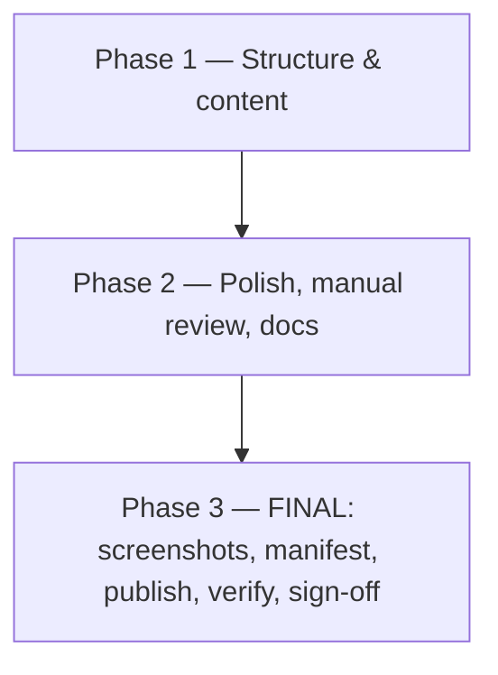

## 1. Scope & guardrails

- Hebrew only, RTL only. Every new page sets `dir="rtl"` and keeps the existing visual language (dark gradient `from-[#050816] via-[#0b1020]`, glass cards `bg-black/50 border border-white/10 rounded-xl`, amber/teal/rose gradients), copying the patterns already used in [`pages/about.js`](pages/about.js) and [`pages/contact.js`](pages/contact.js).
- Do NOT modify any existing route, component, or Hebrew string outside the new help pages. The ONLY existing-file change allowed is appending `{ href: "/help", label: "מרכז עזרה" }` to the `menuLinksBase` array in [`components/Layout.js`](components/Layout.js) and appending one matching footer link in the same file. Both are purely additive.
- Do NOT change `Layout.js`'s `isGamePage` heuristic or any other behavior; the help routes start with `/help` and are not matched by `isGamePage`.
- Do NOT introduce a new design system. All cards/buttons reuse Tailwind classes already present in [`pages/about.js`](pages/about.js) (`bg-black/50 border border-white/10 p-6 rounded-xl shadow-md text-right`) and [`pages/index.js`](pages/index.js) (gradient pill, `rounded-2xl bg-gradient-to-br ... p-[1px]` cards).

### 1.1 Allowed file changes (authoritative whitelist)

Implementation is allowed to create / modify ONLY the following paths. Any change outside this list must be flagged and re-approved before merge.

- New implementation areas (create freely):
  - `pages/help/**`
  - `components/help/**`
  - `data/help-center/**`
  - `public/help-center/**`
  - `scripts/help-center/**`
  - `docs/help-center/**` — for `SIGNOFF.md`, `MANUAL-QA.md`, `AUTHORING.md`, `README.md`
  - `tests/help/**` — only if/when adding the optional `HelpVideoEmbed` test
- Existing files allowed for narrow, additive edits only:
  - [`components/Layout.js`](components/Layout.js) — exactly two additive lines: one new entry in `menuLinksBase` and one matching footer link, both with label `מרכז עזרה`. Nothing else in this file may change.
  - `.gitignore` — only to add `qa-evidence-audit/help-center/` if needed.
  - `package.json` — only to add `help:*` npm scripts (e.g. `help:verify`, `help:capture`, `help:publish-screenshots`). No dependency additions are permitted under this whitelist by default.
  - `package-lock.json` — only if an approved dependency change is explicitly authorized (see §1.2).
- Forbidden by this plan (do not touch):
  - Any existing parent / student / learning / parent-report / parent-copilot / arcade / offline / auth / API / Supabase logic.
  - Any existing Hebrew UI text outside the new Help Center.
  - Any existing design tokens, layout component (other than the two additive `Layout.js` lines), or shared utilities.

### 1.2 Dependency policy

- The default plan adds NO new runtime or dev dependencies. All Help Center pages, components, content, and screenshot/verification scripts are built using packages already declared in [`package.json`](package.json) (Next.js, React, Tailwind, framer-motion, Playwright — Playwright is already used by the existing `scripts/virtual-student-qa/*`).
- Accessibility automation (`axe-core` / `@axe-core/playwright`) is NOT currently installed in this repo (verified against `package.json` and `package-lock.json` at planning time). Adding either package is GATED on explicit user approval. Until approved, accessibility checks are performed manually per §9 and `docs/help-center/MANUAL-QA.md`.
- Any future dependency proposal must be reported back as a plan delta (name, version, license, purpose, and impact) before it is added.

## 2. Help Center structure (routes)

Static routes (Next.js Pages Router, mirroring existing convention):

- `/help` — landing/hub: 4 large category cards + search/filter (client-side, no backend).
- `/help/parents` — Parent Guides hub.
- `/help/parents/[slug]` — single Parent Guide article.
- `/help/students` — Student Guides hub.
- `/help/students/[slug]` — single Student Guide article.
- `/help/parent-report` — Parent Report Explanation hub.
- `/help/parent-report/[slug]` — single Parent Report explanation article.
- `/help/subjects` — Subjects Guide hub.
- `/help/subjects/[slug]` — single subject guide (one of the 6 subjects).

All `[slug]` pages use `getStaticPaths` + `getStaticProps` driven by a content registry, so adding new articles is a content-only change (no new page files).



### File map (new files only)

- Pages:
  - `pages/help/index.js`
  - `pages/help/parents/index.js`
  - `pages/help/parents/[slug].js`
  - `pages/help/students/index.js`
  - `pages/help/students/[slug].js`
  - `pages/help/parent-report/index.js`
  - `pages/help/parent-report/[slug].js`
  - `pages/help/subjects/index.js`
  - `pages/help/subjects/[slug].js`
- Shared UI:
  - `components/help/HelpLayoutShell.js` — wraps `Layout` + adds breadcrumb + RTL container; reuses `dir="rtl"` and gradient already used by `pages/about.js`.
  - `components/help/HelpHubCard.js` — category card (matches `/` index card style).
  - `components/help/HelpArticleBody.js` — renders structured article sections (heading, paragraphs, ordered/unordered lists, callouts, screenshots, related links, optional video).
  - `components/help/HelpScreenshot.js` — responsive `` (or `<picture>`) with mobile/tablet/desktop sources; required `alt`; lazy-loaded.
  - `components/help/HelpVideoEmbed.js` — placeholder component (renders nothing if no video field; future-ready, see §10).
  - `components/help/HelpRelatedLinks.js`, `components/help/HelpBreadcrumb.js`, `components/help/HelpTOC.js` (collapsible on mobile).
  - `components/help/HelpSearchClient.js` — client-side fuzzy filter over loaded titles/keywords (no backend, no analytics).
- Content registry (data only):
  - `data/help-center/index.js` — exports `{ sections, articles, getArticle(slug), listArticles(section) }`. Pure data + simple selectors.
  - `data/help-center/parents/*.js` — one Hebrew article module per parent guide.
  - `data/help-center/students/*.js`
  - `data/help-center/parent-report/*.js`
  - `data/help-center/subjects/*.js` (math, geometry, english, science, hebrew, moledet-geography).

Article module shape (frozen, used by every section):

```js
export default {
  slug: "how-to-read-report",
  section: "parents",
  title: "איך קוראים את דוח ההורים",
  summary: "סקירה קצרה של מה שמופיע בדוח ואיך לפרש את החלקים.",
  keywords: ["דוח", "הורים", "ביצועים", "המלצות"],
  updatedAt: "2026-05-23",
  toc: [{ id: "summary-card", title: "כרטיס סיכום" }, ...],
  blocks: [
    { kind: "paragraph", text: "..." },
    { kind: "heading", level: 2, id: "summary-card", text: "כרטיס סיכום" },
    { kind: "list", ordered: false, items: ["...", "..."] },
    { kind: "callout", tone: "info" | "warning" | "tip", text: "..." },
    { kind: "screenshot", path: "/help-center/screenshots/parents/how-to-read-report/desktop/summary-card.png", alt: "...", caption: "...", sources: { mobile: "...", tablet: "..." } },
    { kind: "video", src: null, poster: null, captions: null }, // future-ready, hidden if src is null
    { kind: "relatedLinks", items: [{ href: "/help/parent-report/summary-card", label: "..." }] },
  ],
};
```

## 3. Parent Guide pages (`/help/parents`)

13 articles, Hebrew, mobile-first. Each article reuses `HelpArticleBody` blocks above.

- `welcome-and-overview` — מבוא: מה זה ליאו, מה ההורה יכול לעשות, איך מתחילים.
- `create-parent-account` — יצירת חשבון הורה ב־[`/parent/login`](pages/parent/login.js) (Supabase auth flow already exists).
- `parent-dashboard-tour` — סיור בעמוד ההורה: רשימת ילדים, יצירת ילד, גבולות חשבון (3 ילדים — מתוך [`pages/parent/dashboard.js`](pages/parent/dashboard.js)).
- `add-students` — הוספת תלמיד, בחירת כיתה (`grade_1`–`grade_6`), שמירה.
- `student-pin-and-credentials` — מה זה PIN, מתי הוא מוצג פעם אחת, איך מאפסים (מ־`credentialConfirmation` ב־[`pages/parent/dashboard.js`](pages/parent/dashboard.js)).
- `edit-or-delete-student` — עריכה ומחיקה של תלמיד (כולל אישור שם), מ־`deleteModalStudent` ב־[`pages/parent/dashboard.js`](pages/parent/dashboard.js).
- `how-to-read-report` — מבוא לקריאת הדוח, מפנה ל־`/help/parent-report/*`.
- `parent-copilot` — מה זה "שאלו על הדוח", איך משתמשים, מה שואלים, מה הוא לא יודע (התבסס על [`components/parent-copilot/parent-copilot-shell.jsx`](components/parent-copilot/parent-copilot-shell.jsx)).
- `monthly-rewards` — פרס ההתמדה החודשי (התבסס על [`components/learning/SubjectMonthlyPrizeJourney.js`](components/learning/SubjectMonthlyPrizeJourney.js) ו־[`pages/parent/rewards.js`](pages/parent/rewards.js)).
- `install-as-app` — התקנה כיישומון (PWA), מ־[`components/InstallAppPrompt.js`](components/InstallAppPrompt.js).
- `mobile-and-offline` — שימוש בנייד, OfflineIndicator, משחקים לא מקוונים.
- `troubleshooting-login` — תקלות נפוצות: PIN שגוי, חשבון נעול, ניקוי דפדפן.
- `privacy-and-data` — הסבר קצר על נתונים שנאספים ומה לא (ללא טענות משפטיות חדשות; קישור ל־[`pages/contact.js`](pages/contact.js) לפניות).

Each article's hero block follows the `pages/about.js` pattern: gradient title via `bg-gradient-to-r from-amber-300 ... bg-clip-text text-transparent` + summary paragraph + breadcrumb.

## 4. Student Guide pages (`/help/students`)

11 articles, written in simple Hebrew suited for kids (short sentences, bigger text). Reuse the same `HelpArticleBody` but with a child-friendly variant flag (`audience: "student"`) that bumps base font size by one Tailwind step (`text-base sm:text-lg` → `text-lg sm:text-xl`). No new colors.

- `student-login` — איך להתחבר עם שם ו־PIN (מ־[`pages/student/login.js`](pages/student/login.js)).
- `student-home-tour` — מה רואים ב־[`pages/student/home.js`](pages/student/home.js): כרטיסי מקצועות, מטבעות, אווטאר.
- `choose-subject-and-grade` — בחירת מקצוע וכיתה במסכי המקצוע ב־[`pages/learning/index.js`](pages/learning/index.js).
- `answering-questions` — איך עונים: בחירה / הקלדה / רב־ברירה (מ־[`components/learning/StudentQuestionDisplay.jsx`](components/learning/StudentQuestionDisplay.jsx)).
- `hints-and-explanations` — מה לעשות אחרי תשובה נכונה / שגויה.
- `daily-missions` — משימות יומיות (מ־[`components/student/StudentDailyMissionsPanel.js`](components/student/StudentDailyMissionsPanel.js)).
- `monthly-persistence` — מסע התמדה חודשי (מ־[`components/student/StudentMonthlyPersistencePanel.js`](components/student/StudentMonthlyPersistencePanel.js)).
- `coins-and-arcade` — מטבעות, ארקייד, שחקנים נוספים (מ־[`pages/student/arcade.js`](pages/student/arcade.js)).
- `avatar-and-profile` — שינוי אווטאר (מ־[`components/student/StudentAvatarPickerModal.js`](components/student/StudentAvatarPickerModal.js)).
- `offline-games` — משחקים לא מקוונים (מ־[`pages/offline/index.js`](pages/offline/index.js)).
- `tips-for-good-practice` — טיפים: זמן לימוד, הפסקות, שאלות ברצף.

## 5. Parent Report explanation pages (`/help/parent-report`)

12 articles. Each maps to a real visual block in the report so the screenshots stay accurate.

- `report-overview` — מה זה הדוח (regular vs detailed) — מקושר מ־[`pages/learning/parent-report.js`](pages/learning/parent-report.js) ו־[`pages/learning/parent-report-detailed.js`](pages/learning/parent-report-detailed.js).
- `summary-card` — כרטיס הסיכום העליון.
- `data-presence` — האם יש מספיק נתונים (מ־[`utils/parent-data-presence.js`](utils/parent-data-presence.js)).
- `trends-and-confidence` — מגמות, רמות ביטחון (`confidenceBadgeLabelHe`, `trendCompactLineHe`).
- `strengths-and-improvements` — חוזקות ונקודות לשיפור.
- `topics-and-buckets` — נושאים, "באקטים" לפי מקצוע (מ־`getMathReportBucketDisplayName`, `getEnglishTopicName`, וכו').
- `subjects-overview` — תרשים שש המקצועות.
- `recommendations` — המלצות תרגול.
- `challenges-section` — אתגרים מומלצים.
- `detailed-report` — דוח מפורט: סיכום מנהלים, מכתב הורי לכל מקצוע (מ־[`utils/detailed-report-parent-letter-he.js`](utils/detailed-report-parent-letter-he.js)).
- `printing-and-pdf` — הדפסה / ייצוא PDF (`exportReportToPDF` ב־[`utils/math-report-generator.js`](utils/math-report-generator.js)).
- `understanding-the-disclaimer` — הסבר של ההבהרה הקיימת ב־[`components/ParentReportImportantDisclaimer.js`](components/ParentReportImportantDisclaimer.js) — מצוטטת מילה במילה, לא מנוסחת מחדש.

## 6. Subject Guide pages (`/help/subjects`)

One page per subject (per user choice). Each subject article structure (Hebrew):

- מי מתאים: כיתות א׳–ו׳ (לפי `GRADE_OPTIONS` ב־[`pages/parent/dashboard.js`](pages/parent/dashboard.js)).
- מה תוכלו לתרגל: מתוך הקוריקולומים הקיימים ([`data/science-curriculum.js`](data/science-curriculum.js), [`data/hebrew-curriculum.js`](data/hebrew-curriculum.js), [`data/english-curriculum.js`](data/english-curriculum.js), [`data/moledet-geography-curriculum.js`](data/moledet-geography-curriculum.js)). Plan only quotes existing topic labels; does not invent new content.
- איך נראית שאלה (צילום מסך מתוך מסך התלמיד של אותו מקצוע).
- איך נראה הסבר אחרי שאלה.
- רמות קושי וקצב התקדמות.
- טיפים לתרגול יעיל.

Subjects (slugs match `LEARNING_GAMES` in [`pages/learning/index.js`](pages/learning/index.js)):

- `math` (חשבון)
- `geometry` (גיאומטריה)
- `english` (אנגלית)
- `science` (מדעים)
- `hebrew` (עברית)
- `moledet-geography` (מולדת וגיאוגרפיה)

## 7. Screenshot capture plan (FINAL PHASE — demo account only)

> Timing: This entire section runs only in the FINAL phase, after the Help Center pages, components, content, docs, and the agent's internal/manual review work are complete. This is NOT a separate user approval checkpoint. After final manual user approval for implementation is given, screenshot capture proceeds as part of the same continuous implementation pass per §14.1, unless a true blocker occurs under §14.1 Blocker handling. No screenshots are captured during the earlier phases, and articles initially ship with screenshot blocks that point at not-yet-existing files; the build verifier in §12 will surface those as missing until this final phase publishes them, but their absence is NOT an approval gate — it is simply the next step in the same pass.

### 7.1 Demo account used for capture

- Student login (the only account used by capture):
  - Username: `ADMIN`
  - PIN: `1234`
  - Visible child / student name in the UI: `ישראל ישראלי`
- This account is treated as a non-real demo identity. No personal data, no real photos, no parent-side PII may appear in any captured frame. If a captured frame ever surfaces unexpected text (real name, real email, real avatar photo), that frame is excluded from the manifest and never published.
- The script does NOT log into a real parent account. Parent-side screenshots that require post-login views (e.g. parent dashboard, parent report) are obtained by signing in via the existing parent flow with a parent account that owns the demo student `ישראל ישראלי`. The parent credentials are supplied via the existing `E2E_PARENT_*` / `VIRTUAL_STUDENT_ACCOUNTS` env mechanism in `.env.e2e.local` / `.env.local` — not committed, not logged, not echoed.

### 7.2 Script

A single new Playwright script `scripts/help-center/capture-help-screenshots.mjs`, modeled on [`scripts/virtual-student-qa/capture-parent-report-snapshots.mjs`](scripts/virtual-student-qa/capture-parent-report-snapshots.mjs) and reusing:

- `scripts/virtual-student-qa/lib/config.mjs` — for `resolveBaseUrl`, env loading from `.env.e2e.local` / `.env.local`.
- `scripts/virtual-student-qa/lib/parent-auth.mjs` — for parent login (Supabase) when a screenshot requires a parent-authenticated view.
- `scripts/virtual-student-qa/lib/student-auth.mjs` — for the student PIN flow (`ADMIN` / `1234`).

### 7.3 Hard rules (enforced in code)

- Refuses to run unless the resolved base URL is one of:
  - `http://localhost:*` / `http://127.0.0.1:*`, OR
  - a `*.vercel.app` preview deployment.
  The script ABORTS with a clear error if the base URL points at the production main domain. There is no override flag.
- Refuses to capture if `NODE_ENV === "production"` AND the base URL is not localhost (defense in depth on top of the URL allowlist).
- Student login is restricted to the demo identity `ADMIN` / `1234` (script-level constant; mismatched env aborts).
- Parent login (when required) reads from `E2E_PARENT_*` / `VIRTUAL_STUDENT_ACCOUNTS` only. If neither is set, the script SKIPS parent-authenticated captures rather than prompting interactively.
- Never logs PINs / passwords / session tokens; reuses the redaction discipline already present in `scripts/virtual-student-qa/lib/config.mjs`.
- Read-only browsing only after login; never creates/edits/deletes students. The demo student is presumed pre-populated; the script does not modify it.
- Each capture is a deterministic URL list per article (`captureSpecs` array) with named regions:
  - Full page: `await page.screenshot({ fullPage: true, path: ... })`.
  - Region: `await element.screenshot({ path: ... })` with role/text selectors that match the existing markup (e.g. `getByRole("heading", { name: /דוח להורים/u })`).
- Three viewports captured per article: `mobile=390x844`, `tablet=820x1180`, `desktop=1366x900`. Mobile captured first so mobile-first article rendering uses it as the primary source.

### 7.4 Article-to-URL map (high level)

- Parent Guides: `/parent/login`, `/parent/dashboard`, `/parent/rewards`, install prompt mock on `/`, `/contact` for support context.
- Student Guides: `/student/login`, `/student/home`, `/student/arcade`, `/learning`, `/learning/math-master` etc., `/offline`, `/offline/tic-tac-toe`.
- Parent Report: `/learning/parent-report?studentId=<demo-student-id>`, `/learning/parent-report-detailed?studentId=<demo-student-id>` — both driven by the demo student `ישראל ישראלי`.
- Subjects: `/learning/math-master`, `/learning/geometry-master`, `/learning/english-master`, `/learning/science-master`, `/learning/hebrew-master`, `/learning/moledet-geography-master`.

### 7.5 Output flow (raw → manifest → publish)

1. Raw `.png` files are written to `qa-evidence-audit/help-center/<section>/<slug>/<viewport>/<region>.png` (audit folder; git-ignored entry added to `.gitignore` for this subpath only).
2. The agent's own data-safety review pass walks every raw frame and removes anything containing unexpected real data; only frames that pass this internal review are entered into `data/help-center/screenshots-manifest.json`. This pass is part of the same continuous implementation pass and is NOT a separate user approval checkpoint.
3. `scripts/help-center/capture-help-screenshots.mjs --publish` (or a separate `scripts/help-center/publish-screenshots.mjs`) copies ONLY the manifest-listed files into `public/help-center/screenshots/<section>/<slug>/<viewport>/<region>.png`. Files not in the manifest are never copied.
4. `scripts/help-center/verify-screenshots.mjs` (`npm run help:verify`) asserts that every screenshot path referenced from any article module exists in `public/help-center/screenshots/` and is listed in the manifest. CI fails if any reference is unresolved.

This guarantees: only curated screenshots reach `public/`, none of them contain real user data, and none were captured against the production main domain.

## 8. Screenshot storage paths

- Raw QA artifacts: `qa-evidence-audit/help-center/<section>/<slug>/<viewport>/<region>.png` — git-ignored, regenerated.
- Published static assets: `public/help-center/screenshots/<section>/<slug>/<viewport>/<region>.png` — committed, served by Next.
- Manifest mapping article block → file paths: `data/help-center/screenshots-manifest.json` — single source of truth used by the publisher script and the runtime `HelpScreenshot` component (so missing files are detectable at build time).
- (Future) Videos: `public/help-center/videos/<section>/<slug>/<name>.mp4` + `<name>.he.vtt` captions.

## 9. Accessibility requirements

- Every page sets `dir="rtl"` and has a single `<h1>` followed by ordered `<h2>`/`<h3>` (article TOC validates this).
- Every screenshot block requires non-empty Hebrew `alt` (article module fails build if `alt` is missing — enforced in the content loader in `data/help-center/index.js`).
- Color contrast: only reuse classes already used elsewhere on the site (passes existing AA usage). No new colors are introduced.
- Keyboard: all interactive elements are real `<button>` / `<a>`; visible focus ring (`focus-visible:ring-2 focus-visible:ring-amber-300/70`) reused from current pages.
- Skip link `דלג לתוכן` at top of `HelpLayoutShell` targeting the article `<main id="help-main" tabIndex={-1}>`.
- Respect `prefers-reduced-motion`: any framer-motion uses `useReducedMotion()` (same approach as elsewhere; gate any animation behind it).
- Lang/dir: outermost `<html lang="he" dir="rtl">` is already effectively set via `Layout` `dir`; we add `lang="he"` on the article's root `<article>` to be explicit.
- Search input: `<label>` (visually hidden but present), `aria-controls`, `aria-expanded` for collapsible TOC.
- Images use `loading="lazy"` and explicit `width`/`height` to prevent CLS.

### 9.1 How accessibility is verified

- Default (no new dependency): manual checklist documented in `docs/help-center/MANUAL-QA.md`, executed against `next dev` and `next start` builds. Checklist items: Tab/Shift+Tab walk-through reaches every link; focus is visibly preserved; `<h1>` count = 1 per page; heading order is `h1 → h2 → h3`; every image has Hebrew `alt`; RTL alignment is correct on Chrome/Firefox/Safari + mobile Safari + Chrome Android; spot-check contrast on the gradient title and on body paragraphs using browser DevTools' built-in contrast checker.
- Optional automation (GATED — requires explicit user approval before adding the dependency): a small Playwright check `scripts/help-center/a11y-check.mjs` that runs `axe-core` (or `@axe-core/playwright`) against the 4 hub pages and one representative article per section. This is NOT part of the default plan; if approved, it must be reported as a plan delta with the package name and version before it is installed.

## 10. Mobile-first layout

- Default Tailwind breakpoint = mobile. Layouts start single-column, expand at `sm:` / `md:` / `lg:` matching the patterns in [`pages/about.js`](pages/about.js).
- Help hub: `grid grid-cols-1 sm:grid-cols-2 lg:grid-cols-4` of category cards.
- Article: `grid grid-cols-1 lg:grid-cols-[260px_minmax(0,1fr)]` — TOC sidebar appears only at `lg:` and above; below `lg`, TOC becomes a `<details>` accordion above the article.
- Touch targets ≥ 44×44 (`min-h-[44px] px-4 py-3`), reusing button styles from `pages/contact.js` (`btnBase`).
- Screenshots use `<picture>` with `<source media="(max-width: 640px)" srcSet="...mobile.png">`, `<source media="(max-width: 1023px)" srcSet="...tablet.png">`, default `desktop.png`. Each variant has a fixed aspect ratio to prevent layout shift.
- Search and filter input is full-width on mobile, inline on `md:`.
- iOS viewport: reuse `useIOSViewportFix` from [`hooks/useIOSViewportFix.js`](hooks/useIOSViewportFix.js) on the help landing page only (others are scrollable docs and don't need it).

## 11. Future support for short tutorial videos

- The article schema already includes a `video` block (see §2). Today every article ships with `video.src = null`; the `HelpVideoEmbed` component renders nothing in that case (no DOM, no skeleton).
- When a video becomes available, only data is added; no code changes required:
  - Drop the file into `public/help-center/videos/<section>/<slug>/<name>.mp4`.
  - Drop captions into `public/help-center/videos/<section>/<slug>/<name>.he.vtt` (Hebrew, RTL).
  - Update the article module to set:
    ```js
    { kind: "video",
      src: "/help-center/videos/parents/parent-copilot/intro.mp4",
      poster: "/help-center/videos/parents/parent-copilot/intro.jpg",
      captions: "/help-center/videos/parents/parent-copilot/intro.he.vtt",
      durationSec: 90,
      transcriptHe: "..." }
    ```
- `HelpVideoEmbed` requirements (specified now, implemented later):
  - `<video controls preload="metadata" playsInline>` with `<track kind="captions" srcLang="he" default>`.
  - Default captions ON.
  - A "תמלול" `<details>` directly below the player rendering `transcriptHe` for accessibility and SEO.
  - Honors `prefers-reduced-motion` (no autoplay ever).
  - Hard size cap (≤ 25 MB / ≤ 120 s recommended) documented in the article author notes (`data/help-center/AUTHORING.md`, plain Hebrew guide for content editors).
- No third-party hosting or trackers; videos are self-hosted under `/public`.

## 12. Acceptance criteria

> Acceptance criteria must all hold before final sign-off / merge. Some checks (build, screenshots, manifest verification, a11y review) can only run after implementation, screenshot capture, and verification, so this list is a final-merge gate, not a pre-code gate.

- Routing:
  - `/help`, `/help/parents`, `/help/students`, `/help/parent-report`, `/help/subjects` and every `[slug]` route in the registry return HTTP 200 in dev (`next dev -p 3001`) and in `next build && next start`.
  - All article slugs in `data/help-center/index.js` resolve via `getStaticPaths`; missing slug returns `notFound: true`.
- No regressions / file-change whitelist:
  - `git diff` is limited to the paths listed in §1.1. The only edits permitted to existing files are: (a) exactly two additive lines in [`components/Layout.js`](components/Layout.js) (one menu link + one footer link, both `מרכז עזרה`); (b) optionally one ignore entry in `.gitignore` for `qa-evidence-audit/help-center/`; (c) `package.json` `help:*` script entries; (d) `package-lock.json` only if an approved dependency was authorized via §1.2. Nothing else.
  - All existing `npm run` scripts (`qa:*`, `build`, `dev`) still pass with the same exit code as on `main`.
- Hebrew/RTL:
  - Every new page has `dir="rtl"` on its outermost wrapper and renders Hebrew without left/right misalignment on Chrome, Firefox, Safari, mobile Safari, and Chrome Android (manual smoke list captured in `docs/help-center/MANUAL-QA.md`).
  - No English microcopy slips through (lint check: a CI grep over `pages/help/**` and `data/help-center/**` for `[A-Za-z]{6,}` outside code blocks, code identifiers, and URLs returns 0 hits — failures must be explicitly allow-listed).
- Content completeness:
  - Parent Guides: ≥ 13 articles, all with `summary`, `toc`, ≥ 1 screenshot block.
  - Student Guides: ≥ 11 articles.
  - Parent Report explanations: ≥ 12 articles, the disclaimer article quotes [`components/ParentReportImportantDisclaimer.js`](components/ParentReportImportantDisclaimer.js) verbatim.
  - Subject Guides: exactly 6 articles, slugs match `LEARNING_GAMES` in [`pages/learning/index.js`](pages/learning/index.js).
- Screenshots (final phase only):
  - Capture was run only against `localhost` or a `*.vercel.app` preview — never against the production main domain.
  - Capture used the demo student `ADMIN` / PIN `1234`, with visible child name `ישראל ישראלי`.
  - All raw artifacts live under `qa-evidence-audit/help-center/`; only manifest-listed frames were copied to `public/help-center/screenshots/`; no real names, real emails, or real photos appear in any published frame (the agent's internal data-safety review is documented in `docs/help-center/SIGNOFF.md` — it is part of the continuous pass, not a separate user approval checkpoint).
  - Every screenshot path referenced from any article module exists in `public/help-center/screenshots/` AND is listed in `data/help-center/screenshots-manifest.json`. `npm run help:verify` exits 0; `next build` fails fast if any reference is unresolved.
- Accessibility:
  - Manual checklist in `docs/help-center/MANUAL-QA.md` is fully checked off (keyboard walk-through, focus visibility, heading order, alt text, RTL alignment, contrast spot-check).
  - If the optional `axe-core` automation was approved per §1.2 and added, it reports 0 critical/serious violations on the 4 hub pages and one representative article per section.
- Mobile-first:
  - At 390×844 viewport, no horizontal scroll on any new page; all interactive controls ≥ 44×44 (manually verified via Chrome DevTools device toolbar; documented in `docs/help-center/MANUAL-QA.md`).
- Future video readiness:
  - `HelpVideoEmbed` returns `null` when `src` is null (unit-style assertion in `tests/help/help-video-embed.test.js`, optional but recommended).
- Sign-off doc:
  - `docs/help-center/SIGNOFF.md` lists each acceptance check above and every item is checked before merge.

## 13. Out of scope (explicit)

- No backend endpoints. No Supabase tables. No analytics events.
- No translations (Hebrew-only by design).
- No edits to existing parent/student/learning/arcade/offline/about/contact/gallery pages.
- No edits to the existing FAQ on [`pages/contact.js`](pages/contact.js) (the user can later choose to cross-link, but that is a separate change request).
- No changes to authentication, parent dashboard logic, parent report logic, or copilot logic.
- No new dependencies by default. Any addition (including `axe-core` / `@axe-core/playwright`) requires explicit user approval per §1.2.

## 14. Build sequencing (internal execution order only)

The phases below describe the INTERNAL build order the agent follows when execution is approved. They are NOT approval checkpoints. See §14.1 for the binding execution policy.



- Phase 1 — Structure & content (no screenshots yet):
  1. Create `pages/help/**`, `components/help/**`, `data/help-center/**` skeletons.
  2. Wire `getStaticPaths` / `getStaticProps` from the registry.
  3. Add the two additive lines in [`components/Layout.js`](components/Layout.js) and footer link.
  4. Author all Hebrew articles (Parent Guides, Student Guides, Parent Report, Subjects). Articles reference future screenshot paths, but the build is allowed to surface "missing screenshot" warnings — not failures — during this phase via a `process.env.HELP_CENTER_ALLOW_MISSING_SCREENSHOTS=1` developer flag. Production `next build` continues to fail fast once Phase 3 publishes the manifest (the flag is dev-only).
- Phase 2 — Polish & docs (no separate approval gate; runs continuously after Phase 1):
  1. Self-review of every article in dev (`next dev`): RTL alignment, mobile-first layout, keyboard nav. Findings recorded in the implementation report (see §14.2), not surfaced as a stop point.
  2. Fill out `docs/help-center/MANUAL-QA.md`, `docs/help-center/AUTHORING.md`, and the `docs/help-center/SIGNOFF.md` skeleton.
- Phase 3 — FINAL (screenshots, manifest, publish, verify, sign-off):
  1. Run `scripts/help-center/capture-help-screenshots.mjs` against `localhost` (or a `*.vercel.app` preview ONLY) using student `ADMIN` / PIN `1234` (visible child `ישראל ישראלי`). Raw output → `qa-evidence-audit/help-center/`. The script must abort if the resolved base URL is the production main domain (no override flag exists).
  2. The agent's automated + self-review data-safety pass removes any raw frame containing unexpected real data; only frames that pass this internal review are entered into `data/help-center/screenshots-manifest.json`. This is internal to the continuous pass and is NOT a separate user approval checkpoint.
  3. The publish step copies only manifest-listed files to `public/help-center/screenshots/`.
  4. Run `npm run help:verify`; run `next build`; both must succeed without the Phase 1 dev flag.
  5. Complete `docs/help-center/SIGNOFF.md`. Then proceed directly to producing the final implementation report per §14.2 — without committing or pushing.

### 14.1 Execution approval policy

After final manual user approval is given, this plan is executed from start to finish in one continuous implementation pass. The phases in §14 are only an internal build order and are NOT approval checkpoints. The implementation must NOT stop after Phase 1 or after Phase 2 to request additional approval.

The agent completes, in this order and without pausing:

1. Structure & content (Phase 1).
2. Polish & docs (Phase 2).
3. Final screenshots, manifest, publish (Phase 3).
4. Verification: `npm run help:verify`, `next build`, and the manual checklist in `docs/help-center/MANUAL-QA.md`.
5. Sign-off documentation: fill out every item in `docs/help-center/SIGNOFF.md`.
6. Returns a single final implementation report per §14.2.

Hard rules during the continuous pass (binding, repeated here so they cannot be overlooked):

- Screenshot capture remains in the final phase only.
- No commit and no push under any circumstances. The agent leaves the working tree dirty so the user can review and commit themselves.
- No screenshot capture against the production main domain. Capture is allowed only against `localhost` / `127.0.0.1` or a `*.vercel.app` preview. The script must abort otherwise (no override flag).
- No new dependencies unless explicitly approved in this plan BEFORE implementation begins (see §1.2). `axe-core` and `@axe-core/playwright` remain not approved by default.
- No changes outside the allowed whitelist in §1.1. Any unavoidable change to a path outside the whitelist must trigger a stop+report (see "Blocker handling" below).

Blocker handling (the ONLY conditions under which the agent may stop before producing the final report):

- A true blocker prevents completion (e.g., a required path is forbidden, a build error cannot be resolved within the whitelist, a needed env var is missing, the demo account `ADMIN` / `1234` cannot authenticate against the chosen base URL, the script's domain guard refuses the configured base URL, etc.).
- On a blocker, the agent stops and returns a report containing exactly:
  - what was completed,
  - what failed,
  - why it failed (root cause, not just the surface error),
  - what files changed (full path list with status: created / modified),
  - what commands were run (verbatim, with exit codes),
  - whether anything was skipped (and why).
- The agent does not silently work around blockers, does not relax guardrails, and does not commit or push.

### 14.2 Final implementation report (returned at the end of the continuous pass)

When Phases 1–3 plus verification and sign-off are complete, the agent returns ONE final implementation report. The report MUST include each of the following sections, even if a section is empty:

- Files changed — full path list, each marked created / modified / deleted, grouped by the §1.1 whitelist buckets. Any path outside the whitelist is a hard error and must instead trigger blocker handling above.
- Routes added — every URL now served under `/help/**`, derived from the registry, with a count per section.
- Articles created by section — counts and slug lists for Parent Guides, Student Guides, Parent Report explanations, and Subject Guides; must match §12 content-completeness thresholds.
- Screenshot status — per article: number of raw frames captured under `qa-evidence-audit/help-center/`, number of frames manifested, number of frames published. A summary line confirming capture used `localhost` or a `*.vercel.app` preview (with the exact base URL).
- Published screenshot paths — full list of files now under `public/help-center/screenshots/`, each with the `<section>/<slug>/<viewport>/<region>.png` triple.
- Commands run and exit codes — verbatim list of every shell command executed (e.g. `npm run help:capture`, `npm run help:publish-screenshots`, `npm run help:verify`, `npx next build`), each with its exit code. PINs / passwords / tokens MUST NOT appear.
- Skipped checks and why — explicit, e.g. "axe-core automation skipped — dependency not approved in plan §1.2; manual a11y checklist completed instead." A check that is silently skipped is a violation of this plan.
- Confirmation that no existing product behavior was changed — including, at minimum: (a) `git diff` outside §1.1 paths is empty except for the two additive lines in `components/Layout.js`; (b) all existing `npm run` scripts that were green on `main` are still green; (c) no existing Hebrew UI text was changed.
- Confirmation that no private / real data was published — including: (a) all published frames came from the demo student `ישראל ישראלי` via `ADMIN` / `1234`; (b) the agent's internal data-safety review pass on raw frames was completed and any frame containing unexpected real data was excluded; (c) no parent PII (real name, real email, real photo, real phone) appears in any file under `public/help-center/`.
- Confirmation that there was no commit and no push — explicit statement that `git status` shows the changes uncommitted and that no `git commit`, `git push`, `git tag`, or remote-mutating command was executed during the pass.