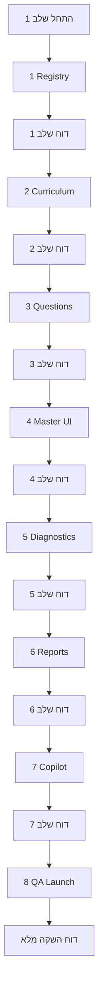

# תוכנית ביצוע: היסטוריה — מקצוע עצמאי, כיתה ו׳

**סטטוס:** **מאושר לביצוע מלא** — כל 8 השלבים ברצף עד **מוכן להשקה**.

**הערה:** scope **היסטוריה בלבד**. אין פעולות על מקצועות אחרים.

---

## החלטת ביצוע

| עקרון | החלטה |
|--------|--------|
| **מטרה** | מקצוע **מלא ומוכן להשקה** — לא תשתית חלקית |
| **אתר** | **טרם הושק** — **אין** דגלים חלקיים / הסתרה מדורגת / HIDE זמני |
| **עבודה** | **לא** עבודה חלקית; **לא** TODO להשקה; **לא** כרטיס בלי תוכן; **לא** שאלות בלי דוחות; **לא** דוחות בלי Copilot/פעילות אישית |
| **רצף** | כל 8 השלבים **ברצף** — **ללא** עצירה לאישור בין שלבים |
| **דיווח** | **דוח קצר בסוף כל שלב** + **דוח השקה מלא** בסיום |
| **המשך** | להמשיך כל עוד: build עובר, אין שגיאות קריטיות, אין חריגה מ-scope, אין שינוי במקצועות אחרים / PWA / משחקים / migrations |

---

## Guardrail — הפרדה מלאה

> **לוודא שהיסטוריה נשמרת כמקצוע עצמאי, ללא ערבוב אבחונים, דוחות, שאלות או metadata עם מקצועות אחרים.**

---

## מפרט מקצוע

| פרמטר | ערך |
|--------|-----|
| **שם תצוגה** | היסטוריה |
| **subject / internal key** | `history` |
| **כיתה** | **ו׳ בלבד** — G6 רואה; G1–G5 **לא** |
| **נושא על** | העולם היווני־רומי והיהודים — 60 שעות |
| **master** | `/learning/history-master` |
| **שאלות** | מינימום 600, יעד 800, metadata מלא |

```
מסך ילד (G6 — מצב השקה)        מסך ילד (G1–G5)
┌─────────┐ ┌─────────┐         ┌─────────┐
│ מתמטיקה │ │  מדעים  │         │ מתמטיקה │  … (ללא היסטוריה)
│   …     │ │   …     │         │   …     │
│היסטוריה │ ← כרטיס 7          └─────────┘
└─────────┘
     ↓
/learning/history-master  (+ ספר/יחידות + שאלות + דוחות)
```

---

## מבנה תוכן — מקור אמת יחיד

| שכבה | כמות | שימוש |
|------|------|--------|
| **topicKey** | **5** + `mixed` | master, ספר, launch registry, פעילות מהורה |
| **subtopicKey** | **16** | metadata, אבחון, דוחות |
| **skillId** | **9** | DE H-01…H-09 |

### 5 נושאי תצוגה

| # | topicKey | תווית עברית |
|---|----------|-------------|
| 1 | `what_is_history` | מהי היסטוריה |
| 2 | `classical_greece` | יוון הקלאסית |
| 3 | `hellenism_jews` | הלניזם והיהודים |
| 4 | `hasmonaeans` | החשמונאים |
| 5 | `rome_jews` | רומא והיהודים |
| — | `mixed` | תערובת |

### 16 תתי-נושאים

| # | subtopicKey | תווית עברית | topicKey |
|---|-------------|-------------|----------|
| 1 | `hist_sub_intro_sources_timeline` | מהי היסטוריה, מקור ראשוני, מקור משני, ציר זמן | `what_is_history` |
| 2 | `hist_sub_athens_democracy` | אתונה הדמוקרטית | `classical_greece` |
| 3 | `hist_sub_sparta` | ספרטה | `classical_greece` |
| 4 | `hist_sub_athens_sparta_compare` | השוואה בין אתונה לספרטה | `classical_greece` |
| 5 | `hist_sub_greek_culture_legacy` | תרבות יוון והשפעתה עד היום | `classical_greece` |
| 6 | `hist_sub_alexander_hellenism` | אלכסנדר מוקדון והתפשטות ההלניזם | `hellenism_jews` |
| 7 | `hist_sub_hellenism_meets_judaism` | המפגש בין הלניזם ליהדות | `hellenism_jews` |
| 8 | `hist_sub_antiochus_maccabees` | גזרות אנטיוכוס ומרד המקבים | `hasmonaeans` |
| 9 | `hist_sub_hasmonaean_kingdom` | ממלכת החשמונאים | `hasmonaeans` |
| 10 | `hist_sub_rise_of_rome` | עליית רומא והפיכתה לאימפריה | `rome_jews` |
| 11 | `hist_sub_roman_culture_law` | תרבות, משפט ומורשת רומית | `rome_jews` |
| 12 | `hist_sub_hasmonaean_loss_roman_conquest` | אובדן עצמאות החשמונאים והכיבוש הרומי | `rome_jews` |
| 13 | `hist_sub_herod_building` | הורדוס ומפעלי הבנייה | `rome_jews` |
| 14 | `hist_sub_judea_province` | יהודה כפרובינציה רומית | `rome_jews` |
| 15 | `hist_sub_great_revolt_destruction` | המרד הגדול וחורבן בית המקדש | `rome_jews` |
| 16 | `hist_sub_yavne_bar_kokhba_babylon` | יבנה, מרד בר כוכבא והמרכז היהודי בבבל | `rome_jews` |

### 9 מיומנויות (skillId → H-01…H-09)

| skillId | עברית |
|---------|-------|
| `hist_concepts` | מושגים היסטוריים |
| `hist_timeline_sequence` | ציר זמן ורצף אירועים |
| `hist_cause_effect` | סיבה ותוצאה |
| `hist_comparison` | השוואה |
| `hist_figures_roles` | דמויות ותפקידן |
| `hist_governance_institutions` | שלטון ומוסדות |
| `hist_culture_heritage` | תרבות ומורשת |
| `hist_simple_source` | הבנת מקור היסטורי פשוט |
| `hist_past_present_link` | קשר בין עבר להווה |

---

## metadata חובה לכל שאלה

`subject`, `grade`, `topicKey`, `subtopicKey`, `skillId`, `subskillId`, `difficulty`, `questionType`, `explanation`, `expectedErrorTypes` / `diagnosticPattern` / `patternFamily`, `canonicalMetadata` enriched.

---

## כללי ביצוע רציף



**בסוף כל שלב — דוח קצר:**
- קבצים ששונו / חדשים
- מה הושלם
- מה נבדק
- תוצאת build
- בעיות/סיכונים (אם יש)

**עצירה רק אם:** build נכשל, שגיאה קריטית, חריגה מ-scope, נגיעה ב-PWA/משחקים/migrations/מקצועות אחרים.

**סדר תלויות פנימי (בתוך הרצף):** curriculum → שאלות → master → diagnostics → reports → copilot → QA. כרטיס תלמיד ו-launch **FULL** נכללים במסגרת השלמת שלבים 4+8 — **לא** מצב ביניים עם קישורים שבורים.

---

## 8 שלבים — תוכן + Exit

### שלב 1 — Registry / gates

- `history` ב-allowlists; תווית **"היסטוריה"**
- `history-subject-id.js`, `history-curriculum-gates.js` (G6 בלבד)
- teacher/school lists + gate
- **לא** כרטיס תלמיד / master בשלב זה (יושלמו בשלב 4 במסגרת הרצף)

**Exit:** history מוכר בקוד; gate G6; G1–G5 חסומים.

---

### שלב 2 — Curriculum + skills + ספר

- `history-curriculum.js`, `history-g6-content-map.js`
- ספר G6: registry, nav, practice-map, plan doc
- `history-canonical-metadata.js`

**Exit:** 5 topics, 16 subtopics, 9 skills; יחידות ספר מוגדרות.

---

### שלב 3 — בנק שאלות

- ≥600 (יעד 800); metadata מלא
- `history-questions/g6.js`, index, inventory gate, metadata test

**Exit:** gate green; 0 שדות חסרים.

---

### שלב 4 — history-master + כרטיס תלמיד

- `pages/learning/history-master.js` — 5 topics + mixed + ספר
- כרטיס **"היסטוריה"** ב-G6: `studentHomeDashboardClient.js`, `pages/learning/index.js`
- **אין** קישור שבור

**Exit:** master עובד; G6 רואה כרטיס פעיל; G1–G5 לא.

---

### שלב 5 — Diagnostics (history בלבד)

- `taxonomy-history.js` H-01…H-09
- `HISTORY_TOPIC_TO_IDS` ב-bridge
- enrichment, alignment, harness, certify e2e

**Exit:** DE מזהה history; units מ-mistakes של history בלבד.

---

### שלב 6 — דוחות הורים + פעילות אישית

- aggregation, report v2, detailed, UI block
- AssignActivityModal, parent-activity, topic options, templates H-01…H-09

**Exit:** היסטוריה כמקצוע עצמאי בדוח; assign G6 עובד.

---

### שלב 7 — Parent Copilot

- scope, truth packet, API payload, certify prompts

**Exit:** Copilot עונה על history לפי נתוני דוח בלבד.

---

### שלב 8 — QA + סגירה להשקה

- launch registry **`history:g6:*` → FULL**
- virtual students G6; mobile+desktop smoke
- כל בדיקות DoD

**Exit:** דוח השקה מלא (ראה להלן).

---

## Definition of Done — השקה

1. [ ] היסטוריה **רק ב-G6**; G1–G5 **לא**
2. [ ] `/learning/history-master` — 5 נושאים + mixed
3. [ ] ספר/יחידות G6 מחוברים
4. [ ] ≥600 שאלות (יעד 800), metadata מלא
5. [ ] DE: history עצמאי (H-01…H-09)
6. [ ] דוח הורה: history עצמאי
7. [ ] פעילות אישית G6
8. [ ] Copilot לפי דוח בלבד
9. [ ] UI עברית מלאה — **אין** labels באנגלית למשתמש
10. [ ] QA מובייל + דסקטופ
11. [ ] virtual students G6
12. [ ] Guardrail: אין שדות חסרים, fallback שבור, ערבוב cross-subject

---

## דוח השקה — תבנית (סיום שלב 8)

| בדיקה | תוצאה |
|--------|--------|
| build pass | |
| QA pass | |
| מספר שאלות בפועל | |
| metadata audit | |
| history-master | |
| דוח הורה | |
| פעילות אישית | |
| Copilot | |
| virtual students G6 | |
| labels עברית בלבד | |
| G6 בלבד | |

---

## קבצים (סיכום)

**~18 חדשים** + **~45 עדכונים** ≈ **~63 קבצים** — ראה רשימה מפורטת בגרסה קודמת; launch registry **FULL** בשלב 8 (לא HIDE).

---

## מה אסור לגעת

משחקים · PWA · service workers · migrations · מקצועות אחרים (שינוי) · דוחות משחקים

---

## סיכונים

| סיכון | mitigation |
|-------|------------|
| 600–800 שאלות | batches + metadata pass |
| ספר G6 scope | plan + registry לפני טקסט |
| QA מקצוע 7 | smoke/harness בשלב 8 |
| Copilot hallucination | server payload + truth prompts |
| cross-subject mixing | Guardrail + harness |

---

## הערכת מאמץ

~55% תוכן · ~30% engineering · ~15% QA · **4–8 שבועות** (צוות 1)
