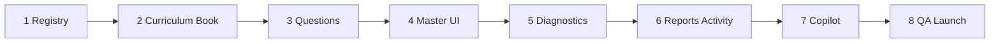

# תוכנית ביצוע: היסטוריה — מקצוע עצמאי, כיתה ו׳

**סטטוס:** החלטה סופית — **לא לבצע קוד, commit, migrations, או שינוי UI בפועל.**

---

## החלטה סופית

**היסטוריה = מקצוע עצמאי רגיל באתר** — כמו מתמטיקה, מדעים וכו'.

| פרמטר | ערך |
|--------|-----|
| **שם תצוגה** | היסטוריה |
| **subject / internal key** | `history` |
| **כיתה** | **ו׳ בלבד** — מוצג ב-G6, **מוסתר** בא׳–ה׳ |
| **נושא על (תוכנית לימודים)** | העולם היווני־רומי והיהודים — 60 שעות |
| **master** | `/learning/history-master` |
| **הפרדה מ-moledet** | מקצוע, אבחון, דוחות, בנק שאלות — **נפרדים לחלוטין** |

**לא בתוכנית:** Hub "מולדת, גאוגרפיה והיסטוריה", `mgh-g6-display-group`, שילוב תצוגה עם `moledet_geography`.

```
מסך ילד (G6)                    מסך ילד (G1–G5)
┌─────────┐ ┌─────────┐         ┌─────────┐
│ מתמטיקה │ │  מדעים  │         │ מתמטיקה │  … (6 מקצועות — ללא היסטוריה)
│   …     │ │   …     │         │   …     │
│היסטוריה │ ← כרטיס 7          └─────────┘
└─────────┘
     ↓
/learning/history-master  (+ ספר/יחידות למידה)
```

---

## מבנה תוכן — מקור אמת יחיד

| שכבה | כמות | שימוש |
|------|------|--------|
| **topicKey** (תצוגה) | **5** + `mixed` | master, ספר, launch registry, פעילות מהורה |
| **subtopicKey** | **16** | metadata, אבחון, דוחות, routing |
| **skillId** | **9** | DE taxonomy H-01…H-09 |

---

### 5 נושאי תצוגה (topicKey)

| # | topicKey | תווית עברית | subtopics |
|---|----------|-------------|-----------|
| 1 | `what_is_history` | מהי היסטוריה | 1 |
| 2 | `classical_greece` | יוון הקלאסית | 4 |
| 3 | `hellenism_jews` | הלניזם והיהודים | 2 |
| 4 | `hasmonaeans` | החשמונאים | 2 |
| 5 | `rome_jews` | רומא והיהודים | 7 |
| — | `mixed` | תערובת | 16 |

---

### 16 תתי-נושאים (subtopicKey)

| # | subtopicKey | תווית עברית | topicKey |
|---|-------------|-------------|----------|
| 1 | `hist_sub_intro_sources_timeline` | מהי היסטוריה, מקור ראשוני, מקור משני, ציר זמן | `what_is_history` |
| 2 | `hist_sub_athens_democracy` | אתונה הדמוקרטית | `classical_greece` |
| 3 | `hist_sub_sparta` | ספרטה | `classical_greece` |
| 4 | `hist_sub_athens_sparta_compare` | השוואה בין אתונה לספרטה | `classical_greece` |
| 5 | `hist_sub_greek_culture_legacy` | תרבות יוון והשפעתה עד היום | `classical_greece` |
| 6 | `hist_sub_alexander_hellenism` | אלכסנדר מוקדון והתפשטות ההלניזם | `hellenism_jews` |
| 7 | `hist_sub_hellenism_meets_judaism` | המפגש בין הלניזם ליהדות | `hellenism_jews` |
| 8 | `hist_sub_antiochus_maccabees` | גזרות אנטיוכוס ומרד המקבים | `hasmonaeans` |
| 9 | `hist_sub_hasmonaean_kingdom` | ממלכת החשמונאים | `hasmonaeans` |
| 10 | `hist_sub_rise_of_rome` | עליית רומא והפיכתה לאימפריה | `rome_jews` |
| 11 | `hist_sub_roman_culture_law` | תרבות, משפט ומורשת רומית | `rome_jews` |
| 12 | `hist_sub_hasmonaean_loss_roman_conquest` | אובדן עצמאות החשמונאים והכיבוש הרומי | `rome_jews` |
| 13 | `hist_sub_herod_building` | הורדוס ומפעלי הבנייה | `rome_jews` |
| 14 | `hist_sub_judea_province` | יהודה כפרובינציה רומית | `rome_jews` |
| 15 | `hist_sub_great_revolt_destruction` | המרד הגדול וחורבן בית המקדש | `rome_jews` |
| 16 | `hist_sub_yavne_bar_kokhba_babylon` | יבנה, מרד בר כוכבא והמרכז היהודי בבבל | `rome_jews` |

---

### 9 מיומנויות אבחון (skillId → DE H-01…H-09)

| skillId | עברית | דוגמת subskillId |
|---------|-------|------------------|
| `hist_concepts` | מושגים היסטוריים | `hist_concepts_definition` |
| `hist_timeline_sequence` | ציר זמן ורצף אירועים | `hist_timeline_order` |
| `hist_cause_effect` | סיבה ותוצאה | `hist_cause_chain` |
| `hist_comparison` | השוואה | `hist_compare_athens_sparta` |
| `hist_figures_roles` | דמויות ותפקידן | `hist_figure_alexander_role` |
| `hist_governance_institutions` | שלטון ומוסדות | `hist_gov_roman_senate` |
| `hist_culture_heritage` | תרבות ומורשת | `hist_culture_greek_legacy` |
| `hist_simple_source` | הבנת מקור היסטורי פשוט | `hist_source_primary_secondary` |
| `hist_past_present_link` | קשר בין עבר להווה | `hist_legacy_today` |

**Prefix:** `hist_*` בלבד — לא `moledet_geo_*`.

---

## metadata חובה לכל שאלה

| שדה | ערך / דוגמה |
|-----|-------------|
| `subject` | `history` |
| `grade` | `g6` |
| `topicKey` | אחד מ-5 (+ mixed) |
| `subtopicKey` | אחד מ-16 |
| `skillId` | אחד מ-9 |
| `subskillId` | granular, e.g. `hist_timeline_order` |
| `difficulty` | `basic` / `medium` / `hard` |
| `questionType` | `mcq` (ועוד לפי contract) |
| `explanation` | הסבר בעברית |
| `expectedErrorTypes` | מערך tags |
| `diagnosticPattern` / `patternFamily` | לפי contract קיים |

Enrichment: `canonicalMetadata` דרך [`lib/learning/history-canonical-metadata.js`](lib/learning/history-canonical-metadata.js) (חדש).

---

## נפח שאלות

| רמה | כמות |
|-----|------|
| **מינימום השקה** | 600 |
| **יעד מומלץ** | 800 |

**חישוב:** 5 topics × 3 levels = 15 cells + `mixed` → ~38–50 שאלות לכל topic×level.

**Launch registry:** `history:g6:what_is_history` … `history:g6:rome_jews` + `history:g6:mixed` = **6 cells**.

---

## קבצים חדשים (משוער ~18)

| קובץ | תפקיד |
|------|--------|
| `lib/learning-shared/history-subject-id.js` | normalization `history` |
| `utils/history-curriculum-gates.js` | `isHistoryGradeAllowed()` → G6 |
| `data/history-curriculum.js` | SSOT: topics, subtopics, skills |
| `data/history-g6-content-map.js` | subtopic weights, modes |
| `lib/learning/history-canonical-metadata.js` | metadata enricher |
| `data/history-questions/g6.js` | בנק שאלות |
| `data/history-questions/index.js` | aggregator |
| `data/history-questions-p0-g6-fill.js` | fill batches (אופציונלי) |
| `pages/learning/history-master.js` | דף מקצוע |
| `utils/history-time-tracking.js` | progress/mistakes keys |
| `utils/diagnostic-engine-v2/taxonomy-history.js` | H-01…H-09 |
| `lib/learning-book/history-g6-registry.js` | יחידות ספר G6 |
| `lib/learning-book/history-book-nav.js` | ניווט ספר |
| `lib/learning-book/history-book-practice-map.js` | מיפוי עמוד→תרגול |
| `lib/learning-book/resolve-history-book-page.js` | resolver |
| `docs/learning-book/HISTORY_GRADE_6_LEARNING_BOOK_PLAN.md` | תוכן ספר |
| `tests/learning/history-canonical-metadata.test.mjs` | metadata contract test |
| `scripts/certify-history-diagnostic-probe-e2e.mjs` | DE e2e |

---

## קבצים קיימים לעדכון (משוער ~45)

### Registry / labels / gates (~10)
- [`lib/learning-supabase/learning-activity.js`](lib/learning-supabase/learning-activity.js)
- [`lib/platform-ui/hebrew-display-labels.js`](lib/platform-ui/hebrew-display-labels.js) — `history: "היסטוריה"`, `SUBJECT_ORDER`
- [`lib/learning-shared/student-learning-profile-model.js`](lib/learning-shared/student-learning-profile-model.js)
- [`lib/learning-client/studentHomeDashboardClient.js`](lib/learning-client/studentHomeDashboardClient.js) — כרטיס G6 + gate
- [`pages/learning/index.js`](pages/learning/index.js)
- [`lib/teacher-portal/teacher-ui.he.js`](lib/teacher-portal/teacher-ui.he.js)
- [`lib/school-portal/school-drilldown.js`](lib/school-portal/school-drilldown.js)
- [`lib/school-server/school-subjects.server.js`](lib/school-server/school-subjects.server.js)

### Curriculum / QA matrix (~4)
- [`lib/teacher-portal/teacher-class-topic-options.js`](lib/teacher-portal/teacher-class-topic-options.js)
- [`scripts/lib/qa-curriculum-matrix.mjs`](scripts/lib/qa-curriculum-matrix.mjs)
- [`docs/diagnostics/QUESTION_METADATA_CONTRACT.md`](docs/diagnostics/QUESTION_METADATA_CONTRACT.md)

### Launch (~3)
- [`data/launch-readiness/topic-launch-registry.json`](data/launch-readiness/topic-launch-registry.json)
- [`lib/launch-readiness/topic-launch-policy.js`](lib/launch-readiness/topic-launch-policy.js)
- [`scripts/qa/build-topic-launch-registry.mjs`](scripts/qa/build-topic-launch-registry.mjs)

### Diagnostics (~8)
- [`utils/diagnostic-engine-v2/subject-ids.js`](utils/diagnostic-engine-v2/subject-ids.js)
- [`utils/diagnostic-engine-v2/taxonomy-registry.js`](utils/diagnostic-engine-v2/taxonomy-registry.js)
- [`utils/diagnostic-engine-v2/topic-taxonomy-bridge.js`](utils/diagnostic-engine-v2/topic-taxonomy-bridge.js) — `HISTORY_TOPIC_TO_IDS`; **הסר MG-04 מ-moledet homeland**
- [`utils/diagnostic-engine-v2/topic-taxonomy-metadata-enrichment.js`](utils/diagnostic-engine-v2/topic-taxonomy-metadata-enrichment.js)
- [`utils/adaptive-learning-planner/diagnostic-unit-skill-alignment.js`](utils/adaptive-learning-planner/diagnostic-unit-skill-alignment.js)
- [`lib/learning/question-metadata-normalizer.js`](lib/learning/question-metadata-normalizer.js)
- [`lib/classroom-activities/classroom-skill-labels-he.js`](lib/classroom-activities/classroom-skill-labels-he.js)

### Reports (~8)
- [`lib/parent-server/report-data-aggregate.server.js`](lib/parent-server/report-data-aggregate.server.js)
- [`utils/parent-report-v2.js`](utils/parent-report-v2.js)
- [`utils/detailed-parent-report.js`](utils/detailed-parent-report.js)
- [`utils/parent-report-language/subject-evidence-policy.js`](utils/parent-report-language/subject-evidence-policy.js)
- [`utils/parent-report-language/grade-aware-recommendation-templates.js`](utils/parent-report-language/grade-aware-recommendation-templates.js)
- [`pages/learning/parent-report.js`](pages/learning/parent-report.js)
- [`utils/parent-report-ui-explain-he.js`](utils/parent-report-ui-explain-he.js)

### Parent activity (~5)
- [`components/parent/AssignActivityModal.js`](components/parent/AssignActivityModal.js)
- [`lib/parent-server/parent-activity.server.js`](lib/parent-server/parent-activity.server.js)
- [`lib/classroom-activities/classroom-activities-preview.js`](lib/classroom-activities/classroom-activities-preview.js)
- [`lib/classroom-activities/assigned-activity-topic-options.js`](lib/classroom-activities/assigned-activity-topic-options.js)

### Copilot (~6)
- [`utils/parent-copilot/scope-resolver.js`](utils/parent-copilot/scope-resolver.js)
- [`utils/parent-copilot/truth-packet-v1.js`](utils/parent-copilot/truth-packet-v1.js)
- [`utils/parent-copilot/contract-reader.js`](utils/parent-copilot/contract-reader.js)
- [`pages/api/parent/copilot-turn.js`](pages/api/parent/copilot-turn.js)
- [`lib/parent-copilot/copilot-turn-payload.server.js`](lib/parent-copilot/copilot-turn-payload.server.js)

### QA (~10+)
- [`scripts/question-bank-inventory-gate.mjs`](scripts/question-bank-inventory-gate.mjs)
- [`scripts/diagnostic-engine-v2-harness.mjs`](scripts/diagnostic-engine-v2-harness.mjs)
- [`scripts/qa/final-launch-smoke-five-subjects.mjs`](scripts/qa/final-launch-smoke-five-subjects.mjs)
- [`scripts/parent-report-context-labeling-all-subjects.mjs`](scripts/parent-report-context-labeling-all-subjects.mjs)
- [`scripts/virtual-student-qa/run.mjs`](scripts/virtual-student-qa/run.mjs)
- [`scripts/launch-readiness/build-diagnostic-ground-truth-report.mjs`](scripts/launch-readiness/build-diagnostic-ground-truth-report.mjs)
- [`scripts/launch-readiness/run-copilot-truth-prompts.mjs`](scripts/launch-readiness/run-copilot-truth-prompts.mjs)
- [`scripts/verify-science-books.mjs`](scripts/verify-science-books.mjs) — pattern ל-`verify-history-g6-book.mjs` (חדש)

**סה"כ:** ~18 חדשים + ~45 עדכונים ≈ **~63 קבצים**.

**לא נוגעים:** [`pages/learning/moledet-geography-master.js`](pages/learning/moledet-geography-master.js) (ללא שינוי), Hub, PWA, SW, משחקים, migrations.

---

## מניעת ערבוב עם moledet_geography

1. `history` = מקצוע **שביעי** — maps, mistakes, taxonomy, reports נפרדים
2. **MG-04** ("היסטוריה מקומית") — להסיר מ-`homeland` ב-bridge moledet (שלב 5), לאחר audit
3. Copilot: scope `history` — units רק מ-`subjectId === "history"`
4. אין שינוי ל-`moledet_geography` content / labels / G2–G6 behavior

---

## סדר עבודה — 8 שלבים



### שלב 1 — קטלוג / registry / gates
- `history` ב-allowlists; תווית **"היסטוריה"**
- `isHistoryGradeAllowed()` — G6=true, G1–G5=false
- student home: כרטיס **נפרד** רק ב-G6
- **Exit:** history מוכר בקוד; מוסתר G1–G5; moledet ללא שינוי

### שלב 2 — curriculum + skills + ספר
- `history-curriculum.js`, `history-g6-content-map.js`
- ספר G6: registry + nav + practice-map (mirror [`lib/learning-book/science-g6-registry.js`](lib/learning-book/science-g6-registry.js))
- metadata contract + enricher
- **Exit:** 5 topics, 16 subtopics, 9 skills; יחידות ספר מוגדרות

### שלב 3 — בנק שאלות
- ≥600 שאלות (יעד 800); metadata מלא בכל שדה
- inventory gate + metadata test
- **Exit:** gate green; 0 שדות חסרים

### שלב 4 — history-master + כרטיס תלמיד
- `pages/learning/history-master.js` — 5 topics + mixed + חיבור ספר
- student home + learning index
- launch registry (HIDE → FULL בשלב 8)
- **Exit:** `/learning/history-master` עובד; G6 רואה כרטיס; G1–G5 לא

### שלב 5 — diagnostics
- taxonomy H-01…H-09; bridge; MG-04 decouple
- harness + certify e2e
- **Exit:** DE מזהה history כמקצוע עצמאי

### שלב 6 — דוחות הורים + פעילות אישית
- aggregation, report v2, UI block, AssignActivityModal
- **Exit:** היסטוריה כמקצוע נפרד בדוח; assign G6 עובד

### שלב 7 — Copilot
- scope, truth packet, API payload, certify prompts
- **Exit:** Copilot עונה על history **לפי נתוני דוח בלבד**

### שלב 8 — QA וסגירה
- launch FULL; virtual students G6; mobile+desktop smoke
- **Exit:** כל DoD מסומן

---

## Definition of Done — השקה

1. [ ] **היסטוריה** מופיעה כמקצוע עצמאי **רק בכיתה ו׳**; **לא** מופיעה בא׳–ה׳
2. [ ] **`/learning/history-master`** עובד — 5 נושאים + mixed
3. [ ] **ספר/יחידות למידה** להיסטוריה G6 קיימים ומחוברים ל-master
4. [ ] **≥600 שאלות** (יעד 800) — metadata מלא (כל השדות למעלה)
5. [ ] **מנוע אבחון** מזהה `history` כמקצוע עצמאי (H-01…H-09)
6. [ ] **דוח הורה** מציג **היסטוריה** כמקצוע עצמאי — לא תחת moledet
7. [ ] **פעילות אישית** מהורה עובדת ב-history (G6, 5 topics)
8. [ ] **Parent Copilot** עונה על history לפי נתוני הדוח בלבד
9. [ ] **UI בעברית מלאה** — ללא labels באנגלית למשתמש
10. [ ] **QA** מובייל + דסקטופ
11. [ ] **תלמידים וירטואליים** G6 — תרגול → דוח → copilot
12. [ ] **אין** שדות חסרים, fallback שבור, או mixing עם moledet

---

## מה אסור לגעת

| אסור |
|------|
| משחקים (`pages/offline/*`, games catalog) |
| PWA / service workers / offline precache |
| Supabase migrations |
| שינוי UI בפועל **בשלב תכנון זה** |
| שמות/כרטיסים של מקצועות קיימים (moledet, math, …) |
| דוחות משחקים |
| commit (עד אישור ביצוע) |

---

## סיכונים

| סיכון | חומרה | mitigation |
|-------|--------|------------|
| 600–800 שאלות = bottleneck תוכן | **גבוה** | batches + metadata pass; ספר לפני master |
| MG-04 overlap ב-moledet | **גבוה** | decouple בשלב 5 + audit |
| QA scripts assume 6 subjects | בינוני | עדכון smoke/harness בשלב 8 |
| ספר G6 — scope תוכן גדול | בינוני | plan doc + registry לפני כתיבת טקסט |
| Deploy לפני content מלא | בינוני | launch registry HIDE עד שלב 8 |
| Copilot hallucination | נמוך | server payload only + truth prompts |

---

## הערכת מאמץ

| רכיב | % מערכת |
|------|---------|
| תוכן (שאלות + ספר + תוויות עברית) | **~55%** |
| Engineering (registry, master, DE, reports, copilot) | **~30%** |
| QA + virtual students | **~15%** |

**זמן משוער (צוות 1):** 4–8 שבועות — תלוי קצב ייצור שאלות וספר.

**תשתית:** דפוס science G6 מוכן לשכפול — **אין חסם ארכיטקטוני**; חסם עיקרי = תוכן + QA.

---

## שינוי מהתוכנית הקודמת

| הוסר | הוחלף ב |
|------|---------|
| Hub "מולדת, גאוגרפיה והיסטוריה" | כרטיס **"היסטוריה"** עצמאי |
| `mgh-g6-display-group.js` | `history-curriculum-gates.js` |
| `pages/learning/mgh-g6-hub.js` | — (לא נדרש) |
| 5 topics קודמים (history_intro, hellenistic_world…) | 5 topics חדשים (classical_greece, hasmonaeans…) |
| 16 subtopics קודמים | 16 subtopics לפי תוכנית לימודים מאושרת |
