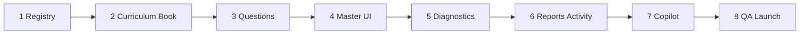

# תוכנית ביצוע סופית: היסטוריה — מקצוע עצמאי, כיתה ו׳

**סטטוס:** מאושר עקרונית — **לא לבצע קוד, commit, migrations, או שינוי UI בפועל.**

**הערה:** תוכנית זו מכסה **אך ורק** את מקצוע ההיסטוריה. אין בה פעולות על מקצועות אחרים.

---

## Guardrail — הפרדה מלאה

> **לוודא שהיסטוריה נשמרת כמקצוע עצמאי, ללא ערבוב אבחונים, דוחות, שאלות או metadata עם מקצועות אחרים.**

חל על כל שלב: `subject=history`, maps/mistakes/taxonomy/reports/copilot scope — **history בלבד**.

---

## החלטה סופית

**היסטוריה = מקצוע עצמאי רגיל באתר.**

| פרמטר | ערך |
|--------|-----|
| **שם תצוגה** | היסטוריה |
| **subject / internal key** | `history` |
| **כיתה** | **ו׳ בלבד** — מוצג ב-G6, **מוסתר** בא׳–ה׳ |
| **נושא על (תוכנית לימודים)** | העולם היווני־רומי והיהודים — 60 שעות |
| **master** | `/learning/history-master` |

```
מסך ילד (G6)                    מסך ילד (G1–G5)
┌─────────┐ ┌─────────┐         ┌─────────┐
│ מתמטיקה │ │  מדעים  │         │ מתמטיקה │  … (ללא כרטיס היסטוריה)
│   …     │ │   …     │         │   …     │
│היסטוריה │ ← כרטיס 7          └─────────┘
└─────────┘
     ↓
/learning/history-master  (+ ספר/יחידות למידה)
```

---

## מבנה תוכן — מקור אמת יחיד

| שכבה | כמות | שימוש |
|------|------|--------|
| **topicKey** (תצוגה) | **5** + `mixed` | master, ספר, launch registry, פעילות מהורה |
| **subtopicKey** | **16** | metadata, אבחון, דוחות, routing |
| **skillId** | **9** | DE taxonomy H-01…H-09 |

---

### 5 נושאי תצוגה (topicKey)

| # | topicKey | תווית עברית | subtopics |
|---|----------|-------------|-----------|
| 1 | `what_is_history` | מהי היסטוריה | 1 |
| 2 | `classical_greece` | יוון הקלאסית | 4 |
| 3 | `hellenism_jews` | הלניזם והיהודים | 2 |
| 4 | `hasmonaeans` | החשמונאים | 2 |
| 5 | `rome_jews` | רומא והיהודים | 7 |
| — | `mixed` | תערובת | 16 |

---

### 16 תתי-נושאים (subtopicKey)

| # | subtopicKey | תווית עברית | topicKey |
|---|-------------|-------------|----------|
| 1 | `hist_sub_intro_sources_timeline` | מהי היסטוריה, מקור ראשוני, מקור משני, ציר זמן | `what_is_history` |
| 2 | `hist_sub_athens_democracy` | אתונה הדמוקרטית | `classical_greece` |
| 3 | `hist_sub_sparta` | ספרטה | `classical_greece` |
| 4 | `hist_sub_athens_sparta_compare` | השוואה בין אתונה לספרטה | `classical_greece` |
| 5 | `hist_sub_greek_culture_legacy` | תרבות יוון והשפעתה עד היום | `classical_greece` |
| 6 | `hist_sub_alexander_hellenism` | אלכסנדר מוקדון והתפשטות ההלניזם | `hellenism_jews` |
| 7 | `hist_sub_hellenism_meets_judaism` | המפגש בין הלניזם ליהדות | `hellenism_jews` |
| 8 | `hist_sub_antiochus_maccabees` | גזרות אנטיוכוס ומרד המקבים | `hasmonaeans` |
| 9 | `hist_sub_hasmonaean_kingdom` | ממלכת החשמונאים | `hasmonaeans` |
| 10 | `hist_sub_rise_of_rome` | עליית רומא והפיכתה לאימפריה | `rome_jews` |
| 11 | `hist_sub_roman_culture_law` | תרבות, משפט ומורשת רומית | `rome_jews` |
| 12 | `hist_sub_hasmonaean_loss_roman_conquest` | אובדן עצמאות החשמונאים והכיבוש הרומי | `rome_jews` |
| 13 | `hist_sub_herod_building` | הורדוס ומפעלי הבנייה | `rome_jews` |
| 14 | `hist_sub_judea_province` | יהודה כפרובינציה רומית | `rome_jews` |
| 15 | `hist_sub_great_revolt_destruction` | המרד הגדול וחורבן בית המקדש | `rome_jews` |
| 16 | `hist_sub_yavne_bar_kokhba_babylon` | יבנה, מרד בר כוכבא והמרכז היהודי בבבל | `rome_jews` |

---

### 9 מיומנויות אבחון (skillId → DE H-01…H-09)

| skillId | עברית | דוגמת subskillId |
|---------|-------|------------------|
| `hist_concepts` | מושגים היסטוריים | `hist_concepts_definition` |
| `hist_timeline_sequence` | ציר זמן ורצף אירועים | `hist_timeline_order` |
| `hist_cause_effect` | סיבה ותוצאה | `hist_cause_chain` |
| `hist_comparison` | השוואה | `hist_compare_athens_sparta` |
| `hist_figures_roles` | דמויות ותפקידן | `hist_figure_alexander_role` |
| `hist_governance_institutions` | שלטון ומוסדות | `hist_gov_roman_senate` |
| `hist_culture_heritage` | תרבות ומורשת | `hist_culture_greek_legacy` |
| `hist_simple_source` | הבנת מקור היסטורי פשוט | `hist_source_primary_secondary` |
| `hist_past_present_link` | קשר בין עבר להווה | `hist_legacy_today` |

**Prefix:** `hist_*` בלבד.

---

## metadata חובה לכל שאלה

| שדה | ערך / דוגמה |
|-----|-------------|
| `subject` | `history` |
| `grade` | `g6` |
| `topicKey` | אחד מ-5 (+ mixed) |
| `subtopicKey` | אחד מ-16 |
| `skillId` | אחד מ-9 |
| `subskillId` | granular, e.g. `hist_timeline_order` |
| `difficulty` | `basic` / `medium` / `hard` |
| `questionType` | `mcq` (ועוד לפי contract) |
| `explanation` | הסבר בעברית |
| `expectedErrorTypes` | מערך tags |
| `diagnosticPattern` / `patternFamily` | לפי contract קיים |

Enrichment: `canonicalMetadata` דרך `lib/learning/history-canonical-metadata.js` (חדש).

---

## נפח שאלות

| רמה | כמות |
|-----|------|
| **מינימום השקה** | 600 |
| **יעד מומלץ** | 800 |

**חישוב:** 5 topics × 3 levels = 15 cells + `mixed` → ~38–50 שאלות לכל topic×level.

**Launch registry:** `history:g6:what_is_history` … `history:g6:rome_jews` + `history:g6:mixed` = **6 cells**.

---

## קבצים חדשים (~18)

| קובץ | תפקיד |
|------|--------|
| `lib/learning-shared/history-subject-id.js` | normalization `history` |
| `utils/history-curriculum-gates.js` | `isHistoryGradeAllowed()` → G6 |
| `data/history-curriculum.js` | SSOT: topics, subtopics, skills |
| `data/history-g6-content-map.js` | subtopic weights, modes |
| `lib/learning/history-canonical-metadata.js` | metadata enricher |
| `data/history-questions/g6.js` | בנק שאלות |
| `data/history-questions/index.js` | aggregator |
| `data/history-questions-p0-g6-fill.js` | fill batches (אופציונלי) |
| `pages/learning/history-master.js` | דף מקצוע |
| `utils/history-time-tracking.js` | progress/mistakes keys |
| `utils/diagnostic-engine-v2/taxonomy-history.js` | H-01…H-09 |
| `lib/learning-book/history-g6-registry.js` | יחידות ספר G6 |
| `lib/learning-book/history-book-nav.js` | ניווט ספר |
| `lib/learning-book/history-book-practice-map.js` | מיפוי עמוד→תרגול |
| `lib/learning-book/resolve-history-book-page.js` | resolver |
| `docs/learning-book/HISTORY_GRADE_6_LEARNING_BOOK_PLAN.md` | תוכן ספר |
| `tests/learning/history-canonical-metadata.test.mjs` | metadata contract test |
| `scripts/certify-history-diagnostic-probe-e2e.mjs` | DE e2e |

---

## קבצים קיימים לעדכון (~45)

רק הוספות/הרחבות **ל-history** — ללא שינוי לוגיקה של מקצועות אחרים.

### Registry / labels / gates (~8)
- `lib/learning-supabase/learning-activity.js` — הוספת `history`
- `lib/platform-ui/hebrew-display-labels.js` — `history: "היסטוריה"`
- `lib/learning-shared/student-learning-profile-model.js`
- `lib/learning-client/studentHomeDashboardClient.js` — כרטיס G6 + gate
- `pages/learning/index.js`
- `lib/teacher-portal/teacher-ui.he.js`
- `lib/school-portal/school-drilldown.js`
- `lib/school-server/school-subjects.server.js`

### Curriculum / QA matrix (~3)
- `lib/teacher-portal/teacher-class-topic-options.js` — case `history`
- `scripts/lib/qa-curriculum-matrix.mjs` — case `history`
- `docs/diagnostics/QUESTION_METADATA_CONTRACT.md` — דוגמאות history

### Launch (~3)
- `data/launch-readiness/topic-launch-registry.json`
- `lib/launch-readiness/topic-launch-policy.js`
- `scripts/qa/build-topic-launch-registry.mjs`

### Diagnostics — history בלבד (~7)
- `utils/diagnostic-engine-v2/subject-ids.js` — הוספת `"history"`
- `utils/diagnostic-engine-v2/taxonomy-registry.js` — import history rows
- `utils/diagnostic-engine-v2/topic-taxonomy-bridge.js` — **`HISTORY_TOPIC_TO_IDS` בלבד**
- `utils/diagnostic-engine-v2/topic-taxonomy-metadata-enrichment.js` — branch `history`
- `utils/adaptive-learning-planner/diagnostic-unit-skill-alignment.js` — alignment history
- `lib/learning/question-metadata-normalizer.js` — subject `history`
- `lib/classroom-activities/classroom-skill-labels-he.js` — תוויות `hist_*`

### Reports (~7)
- `lib/parent-server/report-data-aggregate.server.js`
- `utils/parent-report-v2.js`
- `utils/detailed-parent-report.js`
- `utils/parent-report-language/subject-evidence-policy.js`
- `utils/parent-report-language/grade-aware-recommendation-templates.js` — H-01…H-09
- `pages/learning/parent-report.js`
- `utils/parent-report-ui-explain-he.js`

### Parent activity (~4)
- `components/parent/AssignActivityModal.js`
- `lib/parent-server/parent-activity.server.js`
- `lib/classroom-activities/classroom-activities-preview.js`
- `lib/classroom-activities/assigned-activity-topic-options.js`

### Copilot (~5)
- `utils/parent-copilot/scope-resolver.js`
- `utils/parent-copilot/truth-packet-v1.js`
- `utils/parent-copilot/contract-reader.js`
- `pages/api/parent/copilot-turn.js`
- `lib/parent-copilot/copilot-turn-payload.server.js`

### QA (~8)
- `scripts/question-bank-inventory-gate.mjs` — `auditHistory()`
- `scripts/diagnostic-engine-v2-harness.mjs` — fixtures history
- `scripts/qa/final-launch-smoke-*.mjs` — smoke history
- `scripts/parent-report-context-labeling-all-subjects.mjs`
- `scripts/virtual-student-qa/run.mjs` — תרחישי G6 history
- `scripts/launch-readiness/build-diagnostic-ground-truth-report.mjs`
- `scripts/launch-readiness/run-copilot-truth-prompts.mjs`
- **חדש:** `scripts/verify-history-g6-book.mjs`

**סה"כ:** ~18 חדשים + ~45 עדכונים ≈ **~63 קבצים** (scope history).

---

## סדר עבודה — 8 שלבים



---

### שלב 1 — קטלוג / registry / gates

**Scope:** הוספת `history` למערכת; grade gate G6.

| פעולה | קבצים |
|--------|--------|
| `history` ב-allowlists | `learning-activity.js`, `student-learning-profile-model.js` |
| תווית **"היסטוריה"** | `hebrew-display-labels.js` |
| grade gate G6 | **חדש:** `history-curriculum-gates.js`, **חדש:** `history-subject-id.js` |
| כרטיס תלמיד G6 | `studentHomeDashboardClient.js`, `pages/learning/index.js` |
| teacher/school lists | `teacher-ui.he.js`, `school-drilldown.js`, `school-subjects.server.js` |

**Exit criteria:**
- [ ] `history` מוכר ב-allowlists
- [ ] G6: כרטיס "היסטוריה" מופיע
- [ ] G1–G5: כרטיס **לא** מופיע
- [ ] Guardrail: אין ערבוב metadata עם מקצועות אחרים

**מוכן לאישור ביצוע:** שלב זה בלבד.

---

### שלב 2 — curriculum + skills + ספר

- `history-curriculum.js`, `history-g6-content-map.js`
- ספר G6: registry + nav + practice-map + plan doc
- `history-canonical-metadata.js`

**Exit:** 5 topics, 16 subtopics, 9 skills; יחידות ספר מוגדרות.

---

### שלב 3 — בנק שאלות

- ≥600 שאלות (יעד 800); metadata מלא
- `history-questions/g6.js`, `index.js`, inventory gate, metadata test

**Exit:** gate green; 0 שדות חסרים.

---

### שלב 4 — history-master + כרטיס תלמיד

- `pages/learning/history-master.js` — 5 topics + mixed + ספר
- launch registry (HIDE → FULL בשלב 8)

**Exit:** `/learning/history-master` עובד; G6 רואה כרטיס; G1–G5 לא.

---

### שלב 5 — diagnostics (history בלבד)

**Scope:** אין פעולות על מקצועות אחרים — רק הוספת/חיווט history.

| פעולה | קובץ |
|--------|------|
| taxonomy H-01…H-09 | **חדש:** `taxonomy-history.js` |
| רישום ב-registry | `taxonomy-registry.js` |
| bridge → 5 topicKeys | `topic-taxonomy-bridge.js` — **`HISTORY_TOPIC_TO_IDS` בלבד** |
| metadata enrichment | `topic-taxonomy-metadata-enrichment.js` — branch history |
| skill alignment | `diagnostic-unit-skill-alignment.js` |
| harness | `diagnostic-engine-v2-harness.mjs` — fixtures history |
| certify e2e | **חדש:** `certify-history-diagnostic-probe-e2e.mjs` |

**Exit:**
- [ ] DE v2 מזהה `history` כ-`subjectId` עצמאי
- [ ] units נוצרים רק מ-mistakes של `history`
- [ ] bridge מכסה 5 topicKeys + mixed
- [ ] harness + certify pass

---

### שלב 6 — דוחות הורים + פעילות אישית

- aggregation, report v2, detailed, UI block
- AssignActivityModal, parent-activity, topic options
- grade-aware templates H-01…H-09

**Exit:** היסטוריה כמקצוע **עצמאי** בדוח; assign G6 עובד.

---

### שלב 7 — Copilot

- scope `history`, truth packet, API payload
- certify prompts

**Exit:** Copilot עונה על history **לפי נתוני דוח בלבד**.

---

### שלב 8 — QA וסגירה

- launch registry → FULL
- virtual students G6; mobile+desktop smoke
- context labeling; ground truth report

**Exit:** כל Definition of Done מסומן.

---

## Definition of Done — השקה

1. [ ] **היסטוריה** מופיעה כמקצוע עצמאי **רק בכיתה ו׳**; **לא** בא׳–ה׳
2. [ ] **`/learning/history-master`** עובד — 5 נושאים + mixed
3. [ ] **ספר/יחידות למידה** G6 קיימים ומחוברים ל-master
4. [ ] **≥600 שאלות** (יעד 800) — metadata מלא
5. [ ] **מנוע אבחון** מזהה `history` כמקצוע עצמאי (H-01…H-09)
6. [ ] **דוח הורה** מציג **היסטוריה** כמקצוע עצמאי
7. [ ] **פעילות אישית** מהורה עובדת (G6, 5 topics)
8. [ ] **Parent Copilot** עונה על history לפי נתוני הדוח בלבד
9. [ ] **UI בעברית מלאה** — ללא labels באנגלית למשתמש
10. [ ] **QA** מובייל + דסקטופ
11. [ ] **תלמידים וירטואליים** G6 — תרגול → דוח → copilot
12. [ ] **Guardrail:** אין שדות חסרים, fallback שבור, או ערבוב עם מקצועות אחרים

---

## מה אסור לגעת

| אסור |
|------|
| משחקים |
| PWA / service workers |
| Supabase migrations |
| שינוי UI **לפני אישור שלב** |
| שמות/כרטיסים של **מקצועות קיימים** (ללא שינוי) |
| דוחות משחקים |
| פעולות על מקצועות **אחרים** (מחוץ scope תוכנית זו) |
| commit (עד אישור ביצוע) |

---

## סיכונים

| סיכון | חומרה | mitigation |
|-------|--------|------------|
| 600–800 שאלות = bottleneck תוכן | **גבוה** | batches + metadata pass |
| ספר G6 — scope תוכן גדול | בינוני | plan doc + registry לפני טקסט |
| QA scripts לא מכירים מקצוע 7 | בינוני | עדכון smoke/harness בשלב 8 |
| Deploy לפני content מלא | בינוני | launch registry HIDE עד שלב 8 |
| Copilot hallucination | נמוך | server payload only + truth prompts |
| ערבוב cross-subject | בינוני | Guardrail + בדיקות harness |

---

## הערכת מאמץ

| רכיב | % |
|------|---|
| תוכן (שאלות + ספר + עברית) | **~55%** |
| Engineering (registry, master, DE, reports, copilot) | **~30%** |
| QA + virtual students | **~15%** |

**זמן משוער (צוות 1):** 4–8 שבועות.

**תשתית:** דפוס מקצוע standalone (curriculum + bank + master + DE + reports) — **אין חסם ארכיטקטוני**; חסם עיקרי = תוכן + QA.
