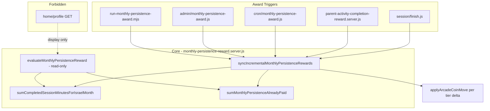

# חלוקה מיידית — התקדמות חודשית (LIOSH-WEB-TRY)

**Scope:** [`C:\Users\ERAN YOSEF\Desktop\final projects\FINAL-WEB\LIOSH-WEB-TRY`](C:\Users\ERAN YOSEF\Desktop\final projects\FINAL-WEB\LIOSH-WEB-TRY) בלבד. **אסור** לגעת ב-LEO-KID.

**Migration:** לא נדרש — `coin_transactions` + `unique (student_id, idempotency_key)` כבר תומכים במספר שורות לחודש.

---

## ארכיטקטורה



---

## 1. ליבה — [`lib/learning-supabase/monthly-persistence-reward.server.js`](lib/learning-supabase/monthly-persistence-reward.server.js)

### פונקציות חדשות / מרכזיות

**`buildMonthlyPersistenceTierIdempotencyKey(studentId, ym, tierMinutes)`**
- `monthly_persistence_{studentId}_{YYYY-MM}_t{tierMinutes}` — threshold מה-DB, לא hardcoded.

**`sumMonthlyPersistenceAlreadyPaid(supabase, studentId, ym)`**
- `SUM(amount)` מ-`coin_transactions` WHERE:
  - `student_id`, `reason = monthly_persistence_reward`, `source_id = ym`, `direction = earn`
- כולל **legacy lump** (`monthly_persistence_{id}_{ym}`) ו-per-tier keys.

**`computeOutstandingTierDeltas(activeMinutes, tiers, alreadyPaid)`** (pure, testable)
- `tiers` ממוינים לפי `minutes` עולה; `tier.coins` = **סכום מצטבר** (כמו seed: 10K/30K/60K/100K).
- לכל tier ש-`activeMinutes >= tier.minutes`:
  - `targetCumulative = tier.coins` (מ-DB **נוכחי**)
  - `prevCumulative = tier קודם?.coins ?? 0`
  - `tierDelta = targetCumulative - prevCumulative` (delta של tier בודד)
  - אם `alreadyPaid >= targetCumulative` → tier מכוסה, דלג
  - אחרת `awardAmount = min(tierDelta, targetCumulative - alreadyPaid)`; **minimum 0** (אין clawback)
- **Top-up Admin:** אם Admin העלה tier 100 מ-10K→15K ו-`alreadyPaid=10K`, `target=15K` → `awardAmount=5K` ב-sync הבא.
- **Admin הוריד tier:** `target` נמוך יותר, `alreadyPaid >= target` → `awardAmount=0`.

**`syncIncrementalMonthlyPersistenceRewards(supabase, studentId, options)`**
- `options`: `{ yearMonthIsrael?, dryRun?, applyProductionFilter? }`
- ברירת מחדל: חודש ישראל **נוכחי** (hooks); Cron/admin מעבירים חודש **קודם**.
- שלבים:
  1. טען tiers מ-`getMonthlyPersistenceTiersFromSettings` (Admin/DB)
  2. חשב `activeMinutes` — **אותו מקור קיים:** `sumCompletedSessionMinutesForIsraelMonth` (sessions `completed` + parent credited minutes)
  3. `alreadyPaid = sumMonthlyPersistenceAlreadyPaid(...)`
  4. `deltas = computeOutstandingTierDeltas(...)`
  5. לכל tier עם `awardAmount > 0`:
     - בדוק `idempotency_key` per-tier; אם קיים → skip (RPC duplicate)
     - **Top-up case:** אם key `_t100` קיים אבל Admin העלה סכום — key קיים עם amount ישן; **פתרון:** top-up עם key נפרד: `monthly_persistence_{id}_{ym}_t{tierMinutes}_adj_{targetCoins}` **או** key `_t{tierMinutes}_v{targetCoins}`. **מומלץ פשוט:** top-up key = `monthly_persistence_{id}_{ym}_topup_t{tierMinutes}_c{targetCoins}` — idempotent per target amount.
     - **פשוט יותר לפני השקה:** per-tier key רק ל-delta ראשוני; top-up uses `monthly_persistence_{id}_{ym}_topup_t{tierMinutes}` עם בדיקה: אם `SUM(amount for tier minutes threshold txs) >= currentTarget` skip.
  6. **Legacy compat:** lump key `monthly_persistence_{id}_{ym}` נספר ב-`alreadyPaid`; sync לא יוצר lump חדש.
  7. `dryRun`: מחזיר `{ activeMinutes, alreadyPaid, targetCoins, deltas[], totalWouldAward, tiersAwarded[], skippedReason }` — **ללא** `applyArcadeCoinMove`.

**Refactor קיים:**
- `runMonthlyPersistenceAwardJob` → קורא `syncIncremental...` במקום `awardMonthlyPersistenceReward` (lump-sum).
- `evaluateMonthlyPersistenceReward` → read-only; מרחיב status:
  - `alreadyPaid`, `targetCoins`, `outstandingCoins`
  - `tiersStatus[]`: `{ minutes, targetCoins, awarded: bool, awardedAmount }` — נגזר מ-ledger + tiers
  - `alreadyAwarded` = `alreadyPaid >= targetCoins && targetCoins > 0` (backward compat)

**סינון QA:** ב-batch (Cron/admin all-students) — שמור `isProductionMonthlyPersistenceStudent`. ב-hook מ-session finish — **אותו filter** בתוך sync (consistency עם batch).

---

## 2. Triggers (לא ב-GET)

### A. [`pages/api/learning/session/finish.js`](pages/api/learning/session/finish.js)
- אחרי session נשמר (`status: completed`), בתוך `try/catch` (כמו coins/missions):
```js
await syncIncrementalMonthlyPersistenceRewards(supabase, auth.studentId)
```
- כשל → `logLearningPipelineDebug("session-finish-monthly-persistence-error", ...)` — **לא** שובר `{ ok: true }`.

### B. [`lib/learning-supabase/parent-activity-completion-reward.server.js`](lib/learning-supabase/parent-activity-completion-reward.server.js)
- בסוף `awardParentActivityCompletionRewards` / `syncParentActivityCompletionRewards` — אותה קריאה try/catch.

### C. Cron — [`pages/api/cron/monthly-persistence-award.js`](pages/api/cron/monthly-persistence-award.js)
- **לא למחוק.** `runMonthlyPersistenceAwardJob` → sync incremental ל-`getPreviousIsraelYearMonth()`.
- אם כל tiers כבר שולמו → `awardedCount=0`.

### D. Admin + script
- [`pages/api/admin/monthly-persistence-award.js`](pages/api/admin/monthly-persistence-award.js) — dry-run מחזיר `results[]` מורחב.
- [`scripts/run-monthly-persistence-award.mjs`](scripts/run-monthly-persistence-award.mjs) — אותו sync.

---

## 3. Idempotency — סיכום

| Key | שימוש |
|-----|--------|
| `monthly_persistence_{id}_{ym}_t{minutes}` | delta ראשון ל-tier |
| `monthly_persistence_{id}_{ym}_topup_t{minutes}_c{targetCoins}` | top-up אחרי שינוי Admin (idempotent per target) |
| `monthly_persistence_{id}_{ym}` (legacy) | נספר ב-`alreadyPaid`, **לא** נוצר מחדש |

**מניעת כפילות:** DB unique + RPC `duplicate:true` + `alreadyPaid` cumulative + per-key checks.

**Race (2 finishes):** בטוח — unique constraint.

---

## 4. UI — per-tier awarded

### [`lib/learning-client/subjectMonthlyPersistenceView.js`](lib/learning-client/subjectMonthlyPersistenceView.js)
- קלט חדש: `monthlyPersistenceStatus.tiersStatus[]` או `awardedTierMinutes[]` + `alreadyPaid`
- לוגיקה:
  - `minutes >= tier.minutes && tierPaid >= tier.coins` → **`awarded`**
  - `minutes >= tier.minutes && !paid` → **`reached`**
  - else → **`locked`**
- **לא** לשנות טקסטים עבריים (encouragementHe) בלי אישור — רק state boxes.

### [`components/learning/SubjectMonthlyPrizeJourney.js`](components/learning/SubjectMonthlyPrizeJourney.js)
- `isAwardedBox` לפי per-tier state (לא boolean יחיד).

### [`lib/learning-client/studentHomeDashboardClient.js`](lib/learning-client/studentHomeDashboardClient.js) + [`components/student/StudentMonthlyPersistencePanel.js`](components/student/StudentMonthlyPersistencePanel.js)
- העברת `tiersStatus` מ-`monthlyPersistenceStatus` המורחב.

### Profile loaders (GET only — **לא award**)
- [`lib/learning-supabase/student-home-profile-load.server.js`](lib/learning-supabase/student-home-profile-load.server.js)
- [`pages/api/student/learning-profile.js`](pages/api/student/learning-profile.js)
- מרחיבים payload של `evaluateMonthlyPersistenceReward` — **read-only**.

---

## 5. בדיקות

### Unit (חדש): `tests/learning/monthly-persistence-incremental.test.mjs`
Pure tests ל-`computeOutstandingTierDeltas` + key builders + scenarios:
- 0 min → 0
- 100 → 10K
- 0→260 → 30K total
- already 10K, reach 250 → +20K
- 650 → 100K
- rerun → 0
- legacy lump 30K at 250 min → 0
- Admin top-up 10K→15K, alreadyPaid=10K → +5K
- Admin lower tier → 0 (no clawback)

### עדכון: [`scripts/verify-phase26-monthly-persistence.mjs`](scripts/verify-phase26-monthly-persistence.mjs)
- incremental logic + idempotency (test ym 2099-06, cleanup)
- **dry-run בלבד** אלא אם `.env.local` מצביע ל-test DB — **לא** לחלק production

### קיימים:
- `tests/learning/phase9-single-truth-progress.test.mjs` — עדכון mocks ל-`tiersStatus`
- `tests/rewards/admin-student-economy-parity.test.mjs` — per-tier awarded

### סיום: `npm run build`

---

## 6. דוח סיום (בעברית)

לאחר ביצוע — דוח עם א–יא כפי שביקשת, כולל:
- **Migration: לא**
- **מטבעות אמיתיים: לא** (אלא dry-run / test ym 2099)

---

## סיכון / עצירה

| מצב | פעולה |
|-----|--------|
| שינוי ≤15 קבצים, build+tests pass | **בצע** |
| דורש migration / schema | **עצור** + דוח |
| DB integration tests נכשלים על prod | **dry-run בלבד**, לא live award |

**Effort:** ~12–15 קבצים, Medium risk, **אין migration**.
