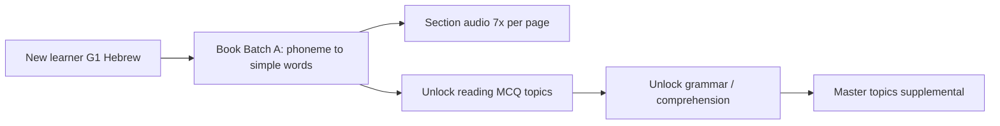

# Launch Correction Master Plan

**Checkpoint (2026-06-08):** Phases 1–3C **complete and verified**. Safe pause before Phase 4. Progress: [`docs/qa/LAUNCH_CORRECTION_PROGRESS.md`](docs/qa/LAUNCH_CORRECTION_PROGRESS.md).

**Deliverable:** [`docs/qa/LAUNCH_CORRECTION_MASTER_PLAN.md`](docs/qa/LAUNCH_CORRECTION_MASTER_PLAN.md) — living plan; Phases 1–3C implemented (uncommitted working tree).

**Inputs:** [`LAUNCH_READINESS_MATRIX.md`](docs/qa/LAUNCH_READINESS_MATRIX.md), [`launch-readiness-matrix.json`](docs/qa/_artifacts/launch-readiness/launch-readiness-matrix.json), [`LOWER_GRADES_LITERACY_AUDIT.md`](docs/qa/LOWER_GRADES_LITERACY_AUDIT.md), [`LAUNCH_SYSTEM_HEALTH_CLOSURE.md`](docs/qa/LAUNCH_SYSTEM_HEALTH_CLOSURE.md), [`QUESTION_INVENTORY_MATRIX.json`](reports/question-audit/QUESTION_INVENTORY_MATRIX.json).

---

## 1. Executive decision

**Frozen for this program:**
- `DIAGNOSTIC_METADATA_SUBSKILL_ENABLED` — OFF
- `DIAGNOSTIC_METADATA_PARENT_GATING_ENABLED` — OFF
- `DIAGNOSTIC_METADATA_PARENT_PROMOTION_ENABLED` — OFF
- Diagnostic metadata remains **internal/shadow** ([`lib/learning/diagnostic-metadata-subskill-flag.js`](lib/learning/diagnostic-metadata-subskill-flag.js))
- **Phase scope:** content, pedagogy, inventory, audio, centralized launch policy — **not** diagnostic engine scoring, parent report copy, or SQL

**Why defer metadata flags:**
- 382 inventory cells still `NEEDS_AUTHORING_BEFORE_LAUNCH`; Hebrew G1–G6 and English G1–G2 are thin or literacy-incomplete
- Existing parent thresholds already withhold conclusions below 8 questions/topic ([`utils/parent-report-topic-evidence.js`](utils/parent-report-topic-evidence.js)) — enabling subskill/gating/promotion on thin banks risks **misleading granularity** or **empty-looking reports**
- Flags reopen only after: (a) topic meets 50/40/30 per level + 100 topic total where applicable ([`scripts/lib/qa-inventory-professional.mjs`](scripts/lib/qa-inventory-professional.mjs)), (b) launch policy marks topic FULL or LIMITED with `diagnosticContribution: normal`, (c) parent-report smoke passes

---

## 2. Product launch model (centralized)

**Principle:** One SSOT drives student practice, assigned selectors, diagnostics eligibility metadata, marketing flags, and book-first routing. No scattered `if (grade === "g1")` in masters.

### Recommended module layout

| File | Role |
|------|------|
| **`lib/launch-readiness/topic-launch-policy.js`** (new) | SSOT: `getTopicLaunchLevel(subject, grade, topic)`, surface gates, diagnostic contribution class |
| **`data/launch-readiness/topic-launch-registry.json`** (new) | Curated rows: `{ subject, grade, topic, level, bookFirst, audioRequired, notes }` — seeded from matrix, updated as content ships |
| **`lib/launch-readiness/launch-surfaces.js`** (new) | `LAUNCH_SURFACES` enum: `self_practice`, `parent_assign`, `teacher_assign`, `marketing_overview`, `diagnostics`, `learning_book_entry` |
| **`scripts/qa/verify-topic-launch-policy.mjs`** (new) | CI gate: registry ⊆ curriculum, no HIDE topic visible on blocked surfaces, inventory blockers reflected |

**Consumers (read policy; no duplicated logic):**
- [`lib/teacher-portal/teacher-class-topic-options.js`](lib/teacher-portal/teacher-class-topic-options.js)
- [`lib/classroom-activities/assigned-activity-topic-options.js`](lib/classroom-activities/assigned-activity-topic-options.js)
- Learning masters: [`pages/learning/hebrew-master.js`](pages/learning/hebrew-master.js), [`english-master.js`](pages/learning/english-master.js), etc.
- QA: [`scripts/qa/launch-readiness-matrix.mjs`](scripts/qa/launch-readiness-matrix.mjs) — read registry instead of inline heuristics

**Align later with** draft curriculum governance ([`.cursor/plans/curriculum_governance_layer_7ed5f683.plan.md`](.cursor/plans/curriculum_governance_layer_7ed5f683.plan.md)) — map `FULL` → `OFFICIAL_CORE`, `PRACTICE_ONLY` → `OFFICIAL_EARLY_EXPOSURE`, `HIDE` → `SHOULD_HIDE`.

### Level definitions

```mermaid
flowchart TD
  subgraph levels [LaunchLevel]
    FULL
    LIMITED
    PRACTICE_ONLY
    HIDE
  end
  FULL --> selfPractice[Self-practice: visible]
  FULL --> assign[Parent/teacher assign: visible]
  FULL --> diagNormal[Diagnostics: normal contribution]
  FULL --> mkt[Marketing: yes]
  LIMITED --> selfPractice2[Self-practice: visible]
  LIMITED --> assign2[Assign: visible if inventory OK]
  LIMITED --> diagThin[Diagnostics: thin-safe only]
  LIMITED --> mkt2[Marketing: yes with caveat]
  PRACTICE_ONLY --> selfPractice3[Self-practice: visible or book-gated]
  PRACTICE_ONLY --> assign3[Assign: blocked or easy-only]
  PRACTICE_ONLY --> diagNone[Diagnostics: no strong conclusions]
  PRACTICE_ONLY --> mkt3[Marketing: exposure only]
  HIDE --> none[All launch surfaces blocked]
```

| Level | Self-practice | Parent assign | Teacher assign | Parent diagnostics | Internal label | Marketing / grade overview | Book-first / audio |
|-------|---------------|---------------|----------------|-------------------|----------------|---------------------------|-------------------|
| **FULL** | Yes | Yes | Yes | Normal (existing ≥8Q thresholds) | `launch:full` | Yes | Optional |
| **LIMITED** | Yes | Yes if inventory ≥ session min | Same | Contributes; conclusions stay volume-gated | `launch:limited` | Yes; note thin areas | Recommended where literacy-critical |
| **PRACTICE_ONLY** | Yes (often book-gated) | No (typing/speaking/literacy-prep) | No | `manual_only` / thin — no weakness promotion | `launch:practice_only` | Exposure label only; **not** "full literacy" | **Required** for G1 Hebrew, G1–G2 English |
| **HIDE** | No | No | No | Excluded | `launch:hide` | No | N/A |

**Writing/speaking (all grades):** default `PRACTICE_ONLY` globally in registry unless validated automated grading exists.

---

## 3. Critical inventory blockers (5 cells)

All `CRITICAL_BLOCKING` rows in [`QUESTION_INVENTORY_MATRIX.json`](reports/question-audit/QUESTION_INVENTORY_MATRIX.json) — **no others**.

| Cell | Root cause (probe n=800) | Decision | Rationale |
|------|--------------------------|----------|-----------|
| `math:g4:prime_composite` easy/medium/hard | Generator builds **2-option** MCQ only ([`utils/math-question-generator.js`](utils/math-question-generator.js) ~3785); `auditMcqQuality` discards all 800 samples | **1. Author real content now** | Listed in G4 curriculum ([`utils/math-constants.js`](utils/math-constants.js)); math otherwise FULL — fix generator not hide |
| `geometry:g1:transformations` hard | Hard-level transformations yield 0 **usable** MCQs (likely 2-option / audit fail at hard band) | **1. Author real content now** | Core G1 geometry topic; book page exists ([`geometry-g1-registry.js`](lib/learning-book/geometry-g1-registry.js)) |
| `geometry:g2:transformations` hard | Same as G1 hard | **1. Author real content now** | Curriculum topic; prefer 4-option conceptual MCQs + diagram where applicable |

### Per-blocker implementation spec

**math:g4:prime_composite**
- **Problem:** 0 usable MCQs; 800 discarded
- **Surfaces:** self-practice, assign, diagnostics (if visible)
- **Files:** [`utils/math-question-generator.js`](utils/math-question-generator.js), [`utils/math-animations.js`](utils/math-animations.js), [`utils/math-question-metadata.js`](utils/math-question-metadata.js), tests in [`tests/learning/math-mcq-answer-integrity.test.mjs`](tests/learning/math-mcq-answer-integrity.test.mjs)
- **Fix:** Expand to 4 distinct options (ראשוני / פריק / מספר שלם / מספר מורכב or factor-based distractors); add variant kinds (identify prime, factor count, smallest prime factor)
- **Diagnostics:** Exclude until inventory PASS; then FULL
- **Acceptance:** 3 levels each ≥50/40/30 usable; `npm run qa:question-inventory-matrix` → no CRITICAL_BLOCKING for cell
- **Rerun:** inventory matrix, MCQ option-count audit, math MCQ integrity tests

**geometry:g1/g2:transformations (hard)**
- **Problem:** 0 usable at hard; topic total 2
- **Surfaces:** self-practice, assign (diagram required for activities per assigned-activity audit)
- **Files:** [`utils/geometry-question-generator.js`](utils/geometry-question-generator.js) (~1702), [`utils/geometry-conceptual-bank.js`](utils/geometry-conceptual-bank.js), [`lib/learning-book/geometry-g1-registry.js`](lib/learning-book/geometry-g1-registry.js)
- **Fix:** Hard band: 4-option MCQs (הזזה / שיקוף / סיבוב / אין תנועה) with diagram spec; easy/medium already weak (2 usable) — expand all bands to ≥50/40/30
- **Diagnostics:** LIMITED until FULL thresholds met
- **Acceptance:** usable count per level; diagram spec match for assigned path; geometry assigned-activity audit PASS for cell
- **Rerun:** inventory matrix, assigned-activity audit, geometry generator samples

**Temporary HIDE:** None for these five — authoring preferred per owner directive.

---

## 4. Hebrew G1 correction plan

**Target grade level:** LIMITED (book-primary) → FULL for supplemental MCQ topics after banks ship. **Not** practice-first standalone literacy.

### Coherent literacy path

| Stage | Book pages (existing) | New practice content | Modality |
|-------|----------------------|----------------------|----------|
| 1 Phonemic | `g1.phoneme_awareness`, `g1.rhyme` | 15+ MCQ/audio: match sound | book + practice |
| 2 Syllables/letters | `g1.syllables`, `g1.letters`, `g1.final_letters` | 20+ letter ID, sound-letter | book + practice |
| 3 Niqqud | `g1.basic_niqqud`, `g1.sound_letter_match` | 20+ vowel discrimination | book + practice + **audio** |
| 4 Words | `g1.simple_words_read`, `reading_word_level_early_*` | 50/40/30 reading MCQ | both |
| 5 Comprehension | comprehension book pages | 50/40/30 comprehension | both |
| 6 Grammar/vocab | grammar book batch | 50/40/30 grammar; vocab PRACTICE_ONLY until expanded | supplemental |

**Book-first routing (not redirect-only):**
- New module: [`lib/learning-book/hebrew-g1-literacy-progress.js`](lib/learning-book/hebrew-g1-literacy-progress.js) — tracks completed book pages / batches
- [`pages/learning/hebrew-master.js`](pages/learning/hebrew-master.js): gate topic tabs by progress; default landing = book batch A
- Registry SSOT: [`lib/learning-book/hebrew-g1-registry.js`](lib/learning-book/hebrew-g1-registry.js)

**Question banks:**
- Extend [`utils/hebrew-rich-question-bank.js`](utils/hebrew-rich-question-bank.js) + new `data/hebrew-literacy-g1/` pools tagged `topic: reading`, `patternFamily: literacy_*`
- Generator: [`utils/hebrew-question-generator.js`](utils/hebrew-question-generator.js) — route literacy kinds before generic reading

**Thresholds:** 50/40/30 per level for reading, comprehension, grammar; vocabulary/speaking/writing remain PRACTICE_ONLY until ≥50 easy

**Audio:** Keep [`lib/learning-book/audio/learning-book-audio-manifest.js`](lib/learning-book/audio/learning-book-audio-manifest.js) live; add question-level `requiresAudio` for letter/sound items via metadata contract

**Diagnostics:** Registry `diagnosticContribution: thin` until topic totals ≥100 and ≥8 answers observed; no flag changes

**QA:** Hebrew inventory build script, inventory matrix, literacy progress unit tests, manual G1 book+audio walkthrough

---

## 5. Hebrew G2 correction plan

| Topic | Current (e/m/h total) | Target | Launch level after |
|-------|----------------------|--------|-------------------|
| reading | 12/11/8 (31) | 50/40/30 | LIMITED → FULL |
| comprehension | 14/7/6 (27) | 50/40/30 | LIMITED → FULL |
| grammar | 19/5/5 (29) | 50/40/30 | LIMITED → FULL |
| vocabulary | 13/7/6 (26) | 50/40/30 | LIMITED |
| writing/speaking | thin | 30+ typing | PRACTICE_ONLY permanent |

- **Book alignment:** Map topics to [`hebrew-g2-registry.js`](lib/learning-book/hebrew-g2-registry.js) batches A–E
- **Audio:** Add `HEBREW_G2_SECTION_AUDIO` to manifest (Phase 3/13); follow G1 section model per [audio infra plan](.cursor/plans/learning_book_audio_infra_f882bf12.plan.md)
- **Files:** `hebrew-rich-question-bank.js`, `hebrew-question-generator.js`, book drafts under `docs/learning-book/hebrew/g2/drafts/`
- **Diagnostics:** reading/comprehension/grammar → normal when FULL; writing/speaking → manual_only

---

## 6. Hebrew G3–G6 correction plan

**Grade rollup today:** PRACTICE_ONLY (thin banks + writing/speaking). **Target:** LIMITED → FULL on four MCQ topics per grade.

**Priority order:** comprehension → reading → grammar → vocabulary

| Grade | Weakest topics (total unique) | Target per topic | Item type |
|-------|------------------------------|------------------|-----------|
| G3 | grammar 18, comprehension 24, vocabulary 21 | 100+ total, 50/40/30 per level | MCQ + book-linked passages |
| G4 | reading 12, grammar 21 | same | MCQ |
| G5 | reading 11, comprehension 24 | same | MCQ |
| G6 | reading 11, comprehension 24 | same | MCQ |

**Writing/speaking G3+:** Keep PRACTICE_ONLY; already blocked from assign ([`assigned-activity-topic-options.js`](lib/classroom-activities/assigned-activity-topic-options.js))

**Files:** [`utils/hebrew-rich-question-bank.js`](utils/hebrew-rich-question-bank.js), [`utils/hebrew-question-generator.js`](utils/hebrew-question-generator.js), [`data/hebrew-curriculum.js`](data/hebrew-curriculum.js), book registries g3–g6

**QA:** Per-grade sample JSON in `docs/qa/_artifacts/hebrew-bank-g{3-6}/`; Hebrew topic visibility scripts; inventory matrix

**Batch authoring order:** G3 comprehension (highest downstream impact) → G3 reading → G4 reading → G5/G6 reading parallel

---

## 7. English G1–G2 correction plan

**Decision:** Implement **book first, then practice banks** (both required for launch-ready literacy). Vocabulary flashcards alone stay PRACTICE_ONLY.

### Required foundational content (new)

| Unit | Book pages (new drafts) | Practice bank | Audio |
|------|------------------------|---------------|-------|
| Letters A–Z | `letters_upper`, `letters_lower`, `letters_match` | 26+ ID MCQ | required |
| Letter sounds | `phonics_sounds`, `phonics_first_sound` | 26+ listen+choose | required |
| First words | `first_words_cvc`, `picture_word_match` | 40+ MCQ | required |
| Listening | `listening_classroom`, `listening_commands` | `questionType: audio` | required |

**Files:**
- [`lib/learning-book/english-g1-registry.js`](lib/learning-book/english-g1-registry.js), [`english-g2-registry.js`](lib/learning-book/english-g2-registry.js) — new batches **before** vocab
- `docs/learning-book/english/g1/drafts/`, `g2/drafts/`
- [`data/english-questions/`](data/english-questions/) — new `phonics-g1.js`, `phonics-g2.js` pools
- [`utils/english-question-generator.js`](utils/english-question-generator.js)
- Audio manifest: extend [`learning-book-audio-manifest.js`](lib/learning-book/audio/learning-book-audio-manifest.js) for English G1/G2

**Launch levels until phonics ships:**
- G1: **PRACTICE_ONLY** (entire grade); marketing overview shows "חשיפה מוקדמת — אוצר מילים וספר" not "אוריינות מלאה"
- G2: **PRACTICE_ONLY**; translation stays blocked from assign until pool ≥50

**Do not HIDE** grades from selector — book path is valuable; **do** HIDE "full English literacy" marketing claims until phonics+audio verified

**Acceptance:** 50/40/30 phonics/listening where applicable; audio verify script PASS; manual child test G1 English book path

---

## 8. English G3–G6 correction plan

| Grade | FULL today | Critical gap | Action |
|-------|-----------|--------------|--------|
| G3 | grammar | translation 1, sentences 34, vocab 35 | Author 80+ translation; expand sentences/vocab to 50/40/30 |
| G4 | grammar, sentences | translation 1, vocab 30 | Same |
| G5 | grammar | translation 1, sentences 35, vocab 36 | Same |
| G6 | grammar, sentences, vocab | translation 1 | Translation pool is **cross-grade blocker** — expand `TRANSLATION_POOLS` in [`data/english-questions/index.js`](data/english-questions/index.js) |

**Writing:** PRACTICE_ONLY all grades (no change)

**Files:** [`data/english-questions/`](data/english-questions/), [`utils/grade-gating.js`](utils/grade-gating.js) pool ranges, [`utils/english-question-generator.js`](utils/english-question-generator.js)

**QA:** English assigned-activity audit; inventory matrix; translation pool count test per grade

---

## 9. Geometry correction plan

**Grade rollup:** LIMITED (no FULL grade yet). **Target:** G3–G6 core measurement topics FULL; conceptual topics LIMITED minimum.

### Topic tiering

| Tier | Topics | Target |
|------|--------|--------|
| **FULL priority** | area, perimeter, volume (G4–G6), angles (G5–G6), pythagoras (G6) | Already near FULL — maintain |
| **Author now** | transformations (G1–G2), parallel_perpendicular, triangles, quadrilaterals, symmetry, rotation, circles, solids, pythagoras (if thin) | 50/40/30 + ≥100 topic total |
| **LIMITED acceptable** | tiling, heights (until diagram variants rich) | 30+ per level minimum |

**Diagram requirement:** Assigned activities require `getGeometryDiagramSpec()` — every authored topic must pass [`scripts/audit-assigned-activity-topic-availability.mjs`](scripts/audit-assigned-activity-topic-availability.mjs)

**Files:** [`utils/geometry-question-generator.js`](utils/geometry-question-generator.js), [`utils/geometry-conceptual-bank.js`](utils/geometry-conceptual-bank.js), [`lib/learning-book/geometry-book-practice-map.js`](lib/learning-book/geometry-book-practice-map.js)

**Acceptance:** No CRITICAL_BLOCKING; conceptual topics ≥3 variant kinds per cell in inventory notes; diagram audit 100% for assigned surfaces

---

## 10. Science correction plan

**All grades LIMITED.** Prioritize **G1–G4** (largest easy-level gaps).

| Grade | Priority topics | Current easy gap | Target |
|-------|----------------|------------------|--------|
| G1–G2 | body, animals, plants, materials, earth_space, environment | 8–19 easy (need 50) | 50/40/30 each |
| G3 | body (medium/hard thin), animals, plants, environment | uneven bands | balanced 50/40/30 |
| G4–G6 | materials, earth_space, environment | 5–14 easy | 50/40/30 |

**Content quality rule:** Each batch must include **conceptual** stems (cause/effect, compare, apply) not only fact recall — tag `cognitiveLevel` in [`data/science-questions.js`](data/science-questions.js) params

**Practice-only consideration:** None HIDE; materials/earth_space/environment G1–G2 stay LIMITED (not FULL) until assign count=5 reliable at medium/hard

**Files:** [`data/science-questions.js`](data/science-questions.js), import scripts in `scripts/` if batch authoring

**QA:** Science inventory per grade JSON; assigned-activity audit for G1–G2 thin topics

---

## 11. Moledet / Geography correction plan

- **G1:** HIDE (empty curriculum) — confirm in launch registry; no spine leak ([`utils/moledet-geography-constants.js`](utils/moledet-geography-constants.js))
- **G2–G6:** LIMITED — generator pools <100 variants per cell (e.g. g3 homeland 44 easy)

**Actions:**
- Expand [`utils/moledet-geography-question-generator.js`](utils/moledet-geography-question-generator.js) variant kinds (not surface paraphrase only)
- Static banks: [`data/geography-questions/`](data/geography-questions/) for enrichment
- G5–G6: geography book exists; align topics to [`geography-g5-registry.js`](lib/learning-book/geography-g5-registry.js)

**Diagnostics:** All civic topics may contribute when LIMITED/FULL; values/maps PRACTICE_ONLY if conceptual depth low

**Acceptance:** procedural pool ≥100 variants per cell OR static bank ≥50/40/30

---

## 12. Parent diagnostics safety plan (no engine changes yet)

**Existing safeguards (verify, do not modify):**
- Source filter: only `free_practice` + `assigned_parent` ([`diagnostic-evidence-contract.js`](lib/learning/diagnostic-evidence-contract.js))
- Topic conclusions withheld below 8 questions ([`parent-report-topic-evidence.js`](utils/parent-report-topic-evidence.js))
- Learning book / guided modes weight 0 ([`activity-classification.js`](lib/learning/activity-classification.js))

**Launch level → diagnostic behavior (registry metadata for future; verify current implicit behavior):**

| Level | Expected behavior | Risk if ignored |
|-------|-------------------|-----------------|
| FULL | Normal aggregation | Low |
| LIMITED | Evidence counts; band stays low/medium until 12–40Q | Overconfident wording if copy implies mastery |
| PRACTICE_ONLY | Evidence may exist but topic row stays thin | False weakness signals on 3–5 literacy answers |
| HIDE | No questions generated → no evidence | Low |

**Verification tasks (Phase 8):** Re-run [`scripts/qa/parent-report-q1-simulation.mjs`](scripts/qa/parent-report-q1-simulation.mjs) with seeded G1 Hebrew / G1 English practice — confirm no topic conclusions below threshold. Document in plan appendix.

**Explicit non-goals:** No new downweight flags; no metadata promotion flags

---

## 13. Audio plan

| Scope | Mandatory? | Status |
|-------|------------|--------|
| Hebrew G1 book | **Yes** | Pilot complete (224 MP3s); owner manual review pending |
| English G1 book | **Yes** | Not started |
| English G2 book | **Yes** | Not started |
| Hebrew G2 book | Recommended | Not started |
| Math G1 book | Optional | Pilot complete |

**Implementation:**
- Manifest: [`lib/learning-book/audio/learning-book-audio-manifest.js`](lib/learning-book/audio/learning-book-audio-manifest.js) — add `ENGLISH_G1_SECTION_AUDIO`, `ENGLISH_G2_SECTION_AUDIO`, `HEBREW_G2_SECTION_AUDIO`
- Naming: `{subject}:{grade}:{pageId}:section:{NN}` (existing convention)
- Generation: [`scripts/generate-learning-book-audio.mjs`](scripts/generate-learning-book-audio.mjs) with `LEARNING_BOOK_AUDIO_ENABLED=true`
- Verification: [`scripts/verify-learning-book-audio.mjs`](scripts/verify-learning-book-audio.mjs), [`tests/learning/learning-book-audio.test.mjs`](tests/learning/learning-book-audio.test.mjs)
- Question-level audio: `requiresAudio: true` in canonical metadata for phonics/listening items (English practice + Hebrew literacy practice)
- **Fallback:** If audio missing → block item from assign/FULL level; show "נדרש שמע" in book player (existing pattern); do not silently degrade to text-only for mandatory grades

---

> Historical sections below may describe the original implementation plan. Current status is the checkpoint header: Phases 1–3C are complete and verified; Phase 4 is paused/pending and must not start without explicit approval.

## 14. Implementation phases

### Phase 0 — Baseline freeze
- `git status`, `git diff --stat`
- Confirm input reports dated 2026-06-08
- **No product changes**
- Acceptance: clean documentation baseline

### Phase 1 — Central launch-readiness model
- Create `lib/launch-readiness/*`, seed registry from matrix JSON
- Wire topic pickers + QA script to policy
- Tests: `tests/learning/launch-readiness-policy.test.mjs`
- **Must not change:** parent report aggregate, SQL, diagnostic flags
- Rollback: delete new module; pickers revert to curriculum-only

### Phase 2 — Critical blockers
- Fix `prime_composite` 4-option generator
- Fix geometry transformations all bands
- Rerun inventory matrix → 0 CRITICAL_BLOCKING
- Acceptance: 5 cells → PROFESSIONAL_READY or LAUNCH_ACCEPTABLE_THIN

### Phase 3 — Hebrew G1/G2 literacy path
- Book-first progress module + master gating
- G1 literacy banks + audio question types
- G2 bank expansion + optional G2 audio pilot
- Acceptance: G1 reading ≥50 easy; book path E2E manual PASS

### Phase 4 — English G1/G2 foundational path
- New book batches + phonics pools + English audio manifest
- Registry marks G1/G2 PRACTICE_ONLY until acceptance
- Acceptance: phonics ≥50 easy G1; audio verify PASS

### Phase 5 — Hebrew G3–G6 expansion
- Batch author comprehension → reading → grammar → vocabulary
- Acceptance: each grade ≥4 topics at 50/40/30

### Phase 6 — English G3–G6 expansion
- Translation pool overhaul (grades 2–6)
- Sentences/vocab top-up
- Acceptance: translation ≥50 easy per grade

### Phase 7 — Geometry / Science / Moledet depth
- Geometry conceptual authoring (priority list §9)
- Science G1–G4 batch import
- Moledet generator variant expansion
- Acceptance: inventory NEEDS_AUTHORING count ↓50%+

### Phase 8 — Final launch QA
- Rerun: launch matrix, inventory matrix, MCQ obvious-answer, bank integrity, metadata validator
- Parent Q1 simulation, assigned-activity audit, build
- Mobile manual checklist (literacy paths, audio, RTL)
- Acceptance: inventory decision `READY` or documented LIMITED grades only; 0 CRITICAL_BLOCKING; 0 MCQ WARN; 0 leakRisk

---

## 15. Output format (end of master plan doc)

### Recommended first implementation phase
**Phase 1** (central launch model) immediately followed by **Phase 2** (critical blockers) — unblocks math G4 and geometry without hiding topics.

### Exact files to inspect before coding
- [`lib/teacher-portal/teacher-class-topic-options.js`](lib/teacher-portal/teacher-class-topic-options.js)
- [`lib/classroom-activities/assigned-activity-topic-options.js`](lib/classroom-activities/assigned-activity-topic-options.js)
- [`utils/math-question-generator.js`](utils/math-question-generator.js) (prime_composite ~3756)
- [`utils/geometry-question-generator.js`](utils/geometry-question-generator.js) (transformations ~1702)
- [`utils/hebrew-rich-question-bank.js`](utils/hebrew-rich-question-bank.js)
- [`data/english-questions/index.js`](data/english-questions/index.js)
- [`lib/learning-book/hebrew-g1-registry.js`](lib/learning-book/hebrew-g1-registry.js)
- [`lib/learning/diagnostic-evidence-contract.js`](lib/learning/diagnostic-evidence-contract.js)
- [`scripts/lib/qa-inventory-professional.mjs`](scripts/lib/qa-inventory-professional.mjs)

### Exact files likely to change (by phase)
- Phase 1: `lib/launch-readiness/*`, `data/launch-readiness/topic-launch-registry.json`, topic option libs, `scripts/qa/verify-topic-launch-policy.mjs`
- Phase 2: `utils/math-question-generator.js`, `utils/geometry-question-generator.js`, `utils/geometry-conceptual-bank.js`
- Phase 3–7: subject generators, rich banks, `data/science-questions.js`, `data/english-questions/*`, book registries + drafts, audio manifest
- Phase 8: QA artifacts only

### Do-not-touch list
- `DIAGNOSTIC_METADATA_*` flags and [`diagnostic-metadata-subskill-flag.js`](lib/learning/diagnostic-metadata-subskill-flag.js) consumption paths
- Parent report aggregation: [`lib/parent-server/report-data-aggregate.server.js`](lib/parent-server/report-data-aggregate.server.js), Q2E PDF pipelines
- SQL migrations / Supabase schema
- UI/CSS redesign (masters may add gating messages only — no layout redesign)
- Scattered per-topic HIDE conditionals outside launch policy

### Owner approval checklist
- [ ] Agree centralized launch policy module location
- [ ] Confirm Phase 2 authoring (no HIDE for prime_composite / transformations)
- [ ] Approve Hebrew G1 book-first gating approach
- [ ] Approve English G1/G2 phonics scope (book + practice + audio)
- [ ] Confirm writing/speaking remain PRACTICE_ONLY for diagnostics
- [ ] Confirm diagnostic metadata flags stay OFF through Phase 8
- [ ] Sign off inventory thresholds 50/40/30 (not lowered)
- [ ] Approve Phase 8 as launch gate

---

## Document authoring step

After plan approval, write the full prose (all 15 sections above, expanded with tables per grade/topic where helpful) to **`docs/qa/LAUNCH_CORRECTION_MASTER_PLAN.md`**. No product code changes until owner signs checklist.
