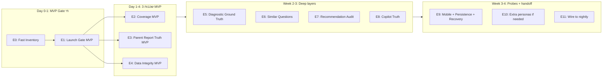

# Launch Readiness QA Master Plan — Fast-Track Revision

> **מצב מסמך:** approved by owner. **E0–E8 מאושרים ומיושמים (2026-05-23).** E9–E11 ממתינות לאישור.
> **שינוי עיקרי מול הגרסה הקודמת:** Launch Gate MVP יוצא תוך 24-48 שעות מאישור, לא תוך 26-28 ימים.
> **שפה:** עברית.
> **גישה:** MVP-first. כל שכבה מקבלת גרסת MVP שעובדת היום + גרסת Full שמתווספת אחר כך.
> **מסמך קנוני בעץ:** [docs/LAUNCH_READINESS_QA_MASTER_PLAN.md](docs/LAUNCH_READINESS_QA_MASTER_PLAN.md) — נוצר.

## סטטוס פאזות

| פאזה | מצב | מועד | פלט |
|------|------|------|-----|
| **E0 — Fast Inventory** | **DONE** | 2026-05-23 | [docs/launch-readiness/E0-INVENTORY.md](docs/launch-readiness/E0-INVENTORY.md) |
| **E1 — Launch Gate MVP** | **DONE** | 2026-05-23 | gate ראשון רץ נגד 2026-05-23, status=PARTIAL |
| **E1.1 — Filtered-run detection** | **DONE** | 2026-05-23 | runKind/isFullNightlyRun ב-gate |
| **E2 — Coverage Matrix MVP** | **APPROVED** | 2026-05-23 | `coverage-summary.{md,json}` |
| **E3 — Parent Report Truth MVP** | **APPROVED** | 2026-05-23 | `parent-report-truth-audit.{md,json}` |
| **E4 — Data Integrity MVP** | **APPROVED** | 2026-05-23 | `data-integrity-audit.{md,json}` |
| **E5 — Diagnostic Ground Truth MVP** | **APPROVED** | 2026-05-23 | `diagnostic-ground-truth-report.{md,json}` |
| **E5.1 — Parent Report Snapshot Capture** | **APPROVED** | 2026-05-23 | `parent-report-snapshots/<label>-after.json` |
| **E5.2 — Diagnostic Evidence Guard** | **APPROVED** | 2026-05-23 | evidence guard fix + 8/8 snapshot backfill |
| **E6 — Similar / Adaptive Follow-up MVP** | **APPROVED** | 2026-05-23 | `similar-question-audit.{md,json}` |
| **E7 — Parent Recommendation Audit MVP** | **APPROVED** | 2026-05-23 | `parent-recommendation-audit.{md,json}` |
| **E8 — Parent Copilot Truth MVP** | **APPROVED** | 2026-05-23 | `parent-copilot-truth-audit.{md,json}` — 40 turns, 0 blockers |
| E9–E11 | ממתינות | — | — |

---

## 1. מה היה לא בסדר בתוכנית הראשונה

| בעיה | השפעה |
|------|--------|
| ה-Launch Gate היה ב-E8 (יום 26-28) | בעלים לא רואה verdict אחד כולל עד סוף החודש — בדיוק מועד ההשקה |
| הרצף E0 → E8 היה sequential מדי | כל פיגור באמצע מעכב את כל הראייה הסופית |
| E2 הוסיף 4 פרסונות חדשות (AAA13, AAA14, QAX1, QAX2) ביום 6-9 | זה שינוי שדורש יצירת חשבונות אמת ב-Supabase, מסכן את ה-nightly הקיים, ובא לפני שאנחנו יודעים אם הוא בכלל נחוץ |
| כל שכבה נדרשה ל-"100% acceptance" לפני שהיא נספרת | אין דרך לראות "ה-gate חי, רק 4/15 שכבות מחוברות עדיין" |
| E0 הוקצב יומיים לתיעוד מלא | בזבוז זמן — מיפוי גס מספיק לבניית aggregator |
| תכנית לא הגדירה P0 vs P1 | בעלים לא ידע מה באמת חוסם השקה לעומת מה אזהרה |

---

## 2. אסטרטגיית Fast-Track Revised



**עקרונות המפתח:**
1. **ה-gate קודם — לא אחרון.** המנגנון שמייצר `LAUNCH_READINESS_DAILY.md/json` קם ב-E1. גם אם 11 מתוך 13 השכבות מסומנות `NOT_RUN`, ה-gate חי וזורם ערך לבעלים.
2. **כל שכבה = MVP → Full.** ה-MVP יורד מהאמת המוחלטת לטובת מהירות. ה-Full מתווסף בהדרגה.
3. **בלי לגעת בפרסונות הקיימות.** AAA1-12 + ERAN רק נקראים, לא נכתב כלום. תוספת AAA13/AAA14/QAX1/QAX2 נדחית עד שה-gate הוכיח שהיא נחוצה.
4. **לא לחכות ל-Supabase.** ה-MVP של data-integrity עובד מ-`run-summary.json` של ה-nightly בלבד. גרסת Full עם read-only Supabase תבוא ב-week 2.
5. **NOT_RUN ≠ FAIL.** שכבה שעדיין לא מחוברת לא מורידה את ה-status; היא נכנסת לרשימת `notRunLayers` ומופיעה בפלט. זה מאפשר לבעלים לראות progress בזמן אמת.

---

## 3. MVP Launch Gate תוך 24-48 שעות

### מה ה-MVP gate מייצר ביום הראשון

קובץ אחד: `reports/launch-readiness/<date>/LAUNCH_READINESS_DAILY.md` (+ `.json`).

**מבנה ה-JSON v1:**
```json
{
  "date": "2026-05-24",
  "schemaVersion": "launch-readiness/v1",
  "generatedAt": "2026-05-24T03:15:00Z",
  "status": "READY|NOT READY|BLOCKED|PARTIAL",
  "verdictReason": "1 משפט עברית",
  "blockers": [
    { "layer": "nightly", "severity": "P0", "detail": "...", "source": "reports/virtual-student-daily/2026-05-24/run-summary.json", "action": "..." }
  ],
  "warnings": [
    { "layer": "coverage", "severity": "P1", "detail": "...", "source": "...", "action": "..." }
  ],
  "layers": {
    "nightly":              { "status": "pass|warn|fail|not_run", "source": "...", "summary": "..." },
    "coverage":             { "status": "...", "source": "..." },
    "parentReportTruth":    { "status": "...", "source": "..." },
    "dataIntegrity":        { "status": "...", "source": "..." },
    "diagnosticGroundTruth":{ "status": "not_run" },
    "similarQuestions":     { "status": "not_run" },
    "recommendation":       { "status": "not_run" },
    "copilotTruth":         { "status": "not_run" },
    "mobile":               { "status": "not_run" },
    "crossDevicePersistence":{"status": "not_run" },
    "failureRecovery":      { "status": "not_run" },
    "pdfExport":            { "status": "not_run" },
    "questionQuality":      { "status": "pass|warn|fail|not_run", "source": "reports/question-metadata-qa/summary.json" }
  },
  "coverageGaps": [],
  "lastNightlyStatus": "pass|partial|fail",
  "recommendedNextAction": "..."
}
```

**כללי verdict ל-v1:**
- `status=BLOCKED` אם **כל** layer P0 שמחובר החזיר `fail`.
- `status=NOT READY` אם ה-nightly = `partial` ו-לפחות שכבה אחת אחרת `fail`.
- `status=PARTIAL` אם ה-nightly = `pass` אבל יש ≥1 warning P1 או ≥1 `not_run` בשכבות הליבה (coverage/parent-report-truth/data-integrity).
- `status=READY` רק אם כל ה-MVP layers `pass` ויש פחות מ-3 `not_run` ב-non-core.

**ה-MVP gate ביום 1 כבר עונה על:**
- האם ה-nightly עבר אתמול? כן/לא.
- האם הדוח להורה נראה כמו דוח אמיתי? כן/לא.
- האם יש cross-student bleed לפי לוג ה-nightly? כן/לא.
- האם יש פערי כיסוי גסים (מקצוע שלא נוסה אף פעם)? רשימה.
- מה הצעד הבא?

---

## 4. רשימת Phases — Fast-Track

### E0 — Fast Inventory (יום 0, חצי יום) **[DONE 2026-05-23]**
- **מטרה:** מיפוי גס של reports קיימים → איזה layer הם מזינים. **לא** תיעוד מקיף.
- **קבצים שיווצרו:** [docs/launch-readiness/E0-INVENTORY.md](docs/launch-readiness/E0-INVENTORY.md) — טבלה של ~15 שורות בלבד.
- **read-only:** כן.
- **משתמש ב-artifacts קיימים:** כן (`reports/virtual-student-daily/<date>/`, `reports/learning-simulator/`, `reports/question-metadata-qa/`).
- **Supabase access:** לא.
- **runtime:** ~30 דק' עבודת ידיים.
- **מוכן לפני ה-nightly הבא:** כן.
- **PASS:** מסמך קיים, כל שכבת MVP יודעת איפה ה-source שלה.
- **WARN:** מסמך קיים אבל 1-2 שכבות בלי source ברור (אז נסמן `not_run` ב-gate).
- **BLOCKED:** לא ייתכן בשלב הזה.

### E1 — Launch Gate MVP (יום 0-1, 4-8 שעות בנייה) **[DONE 2026-05-23 — gate produced PARTIAL on first run, 0 blockers]**
- **מטרה:** קובץ אחד מבוסס Node שקורא reports קיימים, מסמן `not_run` למה שלא קיים, ומפיק `LAUNCH_READINESS_DAILY.{md,json}`.
- **קבצים שיווצרו:** [scripts/launch-readiness/build-launch-readiness-daily.mjs](scripts/launch-readiness/build-launch-readiness-daily.mjs) + [scripts/launch-readiness/lib/aggregator.mjs](scripts/launch-readiness/lib/aggregator.mjs) + [scripts/launch-readiness/lib/verdict-rules.mjs](scripts/launch-readiness/lib/verdict-rules.mjs).
- **read-only:** כן (קורא רק קבצי JSON/MD תחת `reports/`).
- **משתמש ב-artifacts קיימים:** כן בלבד.
- **Supabase access:** לא.
- **runtime:** <10 שניות.
- **מוכן לפני ה-nightly הבא:** כן — אפשר להריץ מיד נגד הריצה האחרונה (2026-05-23).
- **PASS:** הקובץ נוצר, כולל `status`, `blockers`, `warnings`, `layers`, `recommendedNextAction`.
- **WARN:** הקובץ נוצר אבל >50% מהשכבות `not_run`.
- **BLOCKED:** הקובץ לא נוצר כלל.

### E2 — Coverage Matrix MVP (יום 1-2, 4-6 שעות) **[APPROVED 2026-05-23]**
- **MVP scope:** student × grade × subject × questions-answered × status (pass/partial/fail). מקור יחיד: `reports/virtual-student-daily/<date>/run-summary.json`.
- **Full scope (אחר כך):** + topic × level × skill × question-shape, הצלבה מול `qa:question-inventory-matrix`.
- **קבצים שיווצרו:** [scripts/launch-readiness/build-coverage-matrix.mjs](scripts/launch-readiness/build-coverage-matrix.mjs).
- **פלט:** `reports/launch-readiness/<date>/coverage-summary.{md,json}`.
- **read-only:** כן.
- **משתמש ב-artifacts קיימים:** כן (`run-summary.json` בלבד ב-MVP).
- **Supabase access:** לא.
- **runtime:** <5 שניות.
- **מוכן לפני ה-nightly הבא:** כן.
- **PASS:** מטריצה student×subject מלאה, כל 12 הפרסונות מופיעות, כל subject שנלמד מסומן.
- **WARN:** subject×grade שתומך תוכן ולא נוסה ב-7 ימים אחרונים.
- **BLOCKED:** persona שאין לה אף שורה ב-7 ימים אחרונים (תקלה ב-state).

### E3 — Parent Report Truth MVP (יום 2-3, 4-6 שעות) **[APPROVED 2026-05-23]**
- **MVP scope:** הדוח קיים, נטען (status 200), אין raw keys (regex blacklist), יש שם תלמיד, יש תאריך פעילות אחרון.
- **Full scope (אחר כך):** הצלבה numeric של answers count, accuracy ±2%, recommendation tied to grade.
- **קבצים שיווצרו:** [scripts/launch-readiness/build-parent-report-truth-audit.mjs](scripts/launch-readiness/build-parent-report-truth-audit.mjs) + [scripts/launch-readiness/lib/raw-keys-blacklist.mjs](scripts/launch-readiness/lib/raw-keys-blacklist.mjs).
- **קלט:** snapshots שכבר נלקחים ב-nightly דרך [scripts/virtual-student-qa/lib/parent-report-snapshot.mjs](scripts/virtual-student-qa/lib/parent-report-snapshot.mjs).
- **פלט:** `reports/launch-readiness/<date>/parent-report-truth-audit.{md,json}`.
- **read-only:** כן.
- **משתמש ב-artifacts קיימים:** כן.
- **Supabase access:** לא.
- **runtime:** <30 שניות.
- **מוכן לפני ה-nightly הבא:** כן.
- **PASS:** דוח נטען לכל פרסונה ב-nightly, 0 raw keys, שם תלמיד מופיע.
- **WARN:** דוח נטען אבל חסר accuracy או חסר recommendation אחת.
- **BLOCKED (P0):** raw keys מופיעים בדוח, או דוח של פרסונה שונה מופיע (cross-student bleed).

### E4 — Data Integrity MVP (יום 3-4, 4-6 שעות) **[APPROVED 2026-05-23]**
- **MVP scope:** מסתמך **רק** על `run-summary.json` של ה-nightly: `session/start` count = `session/finish` count לכל פרסונה, אין `fail`, אין `blocked`, אין `partial` ללא הסבר QA-driver מתועד.
- **Full scope (שבוע 2):** read-only Supabase queries דרך MCP/service-role לחיפוש orphans + cross-student rows + duplicate finishes.
- **קבצים שיווצרו:** [scripts/launch-readiness/build-data-integrity-audit.mjs](scripts/launch-readiness/build-data-integrity-audit.mjs).
- **פלט:** `reports/launch-readiness/<date>/data-integrity-audit.{md,json}`.
- **read-only:** כן.
- **משתמש ב-artifacts קיימים:** כן.
- **Supabase access:** לא ב-MVP. כן (read-only) ב-Full.
- **runtime:** <10 שניות (MVP).
- **מוכן לפני ה-nightly הבא:** כן.
- **PASS:** start=finish לכל session, 0 fail/blocked.
- **WARN:** session ללא finish (תקועה) שלא דווחה ב-KNOWN-ISSUES.
- **BLOCKED (P0):** cross-student answer event ב-log.

### --- אבן דרך 1: סוף שבוע 1 — Gate MVP חי עם 4 שכבות מחוברות ---

בנקודה הזו ה-`LAUNCH_READINESS_DAILY.md` כבר נותן ערך אמיתי לבעלים. כל הצעדים הבאים מוסיפים עומק, אבל ה-gate כבר עובד.

---

### E5 — Diagnostic Ground Truth (שבוע 2) **[APPROVED 2026-05-23]**
- **MVP scope:** לכל פרסונה עם `weakness` מוגדרת ב-[scripts/virtual-student-qa/scenarios/student-personas.mjs](scripts/virtual-student-qa/scenarios/student-personas.mjs): לחפש `diagnosticEngineV2.units[]` בדוח שתואם `subjectId == weakness.subject`. רק MATCH/PARTIAL/MISS, ללא ניתוח skill-level עמוק.
- **Full scope (אחר כך):** ניתוח skill-level, false-positive על strong personas, אבחון רב-מקצועות.
- **קבצים שיווצרו:** [scripts/launch-readiness/build-diagnostic-ground-truth-report.mjs](scripts/launch-readiness/build-diagnostic-ground-truth-report.mjs) + [scripts/launch-readiness/lib/persona-truth-helpers.mjs](scripts/launch-readiness/lib/persona-truth-helpers.mjs).
- **פלט:** `reports/launch-readiness/<date>/diagnostic-ground-truth-report.{md,json}`.
- **read-only:** כן.
- **משתמש ב-artifacts קיימים:** כן.
- **Supabase access:** לא.
- **runtime:** <30 שניות.
- **מוכן לפני ה-nightly הבא:** לא (דורש בנייה אחרי E1-E4).
- **PASS:** match ≥9/12 פרסונות עם weakness ידועה.
- **WARN:** match 6-8/12 או thin-data ל-1-2.
- **BLOCKED (P0):** false-positive על פרסונה strong (אבחון חולשה מומצאת).

#### E5.1 — Parent Report Snapshot Capture **[APPROVED 2026-05-23]**
- **מטרה:** backfill read-only של parent-report text/diagnostic snapshots מ-report URLs ב-run-summary.
- **קבצים:** [scripts/virtual-student-qa/capture-parent-report-snapshots.mjs](scripts/virtual-student-qa/capture-parent-report-snapshots.mjs), [scripts/virtual-student-qa/lib/parent-report-evidence.mjs](scripts/virtual-student-qa/lib/parent-report-evidence.mjs).
- **פלט:** `reports/virtual-student-daily/<date>/parent-report-snapshots/<label>-{baseline,after}.{json,md}`.
- **npm:** `qa:capture:parent-report-snapshots`.

#### E5.2 — Diagnostic Evidence Guard + Snapshot Backfill **[APPROVED 2026-05-23]**
- **מטרה:** מניעת P0 false-positive מ-AAA7 bleed; כיסוי snapshot ל-8/8 תלמידי suite.
- **קבצים:** [scripts/launch-readiness/lib/diagnostic-ground-truth.mjs](scripts/launch-readiness/lib/diagnostic-ground-truth.mjs) (evidence guard).
- **תוצאה:** Gate PARTIAL, 0 diagnostic blockers.

### E6 — Similar / Adaptive Follow-up (שבוע 2) **[APPROVED 2026-05-23]**
- **MVP scope:** לכל wrong-answer של פרסונה חלשה ב-state.json: לבדוק שהשאלות הבאות באותו session כללו ≥1 follow-up מאותו skill או topic.
- **Full scope (אחר כך):** הצלבה מול `scripts/adaptive-weakness-followup-certification.mjs`, חישוב cross-session 7-day window.
- **קבצים שיווצרו:** [scripts/launch-readiness/build-similar-question-audit.mjs](scripts/launch-readiness/build-similar-question-audit.mjs).
- **פלט:** `reports/launch-readiness/<date>/similar-question-audit.{md,json}`.
- **read-only:** כן.
- **runtime:** <30 שניות.
- **PASS:** ≥80% wrong events מקבלים follow-up בתוך session.
- **WARN:** 50-80%.
- **BLOCKED:** 0 follow-up לפרסונה חלשה ידועה.

### E7 — Parent Recommendation Audit (שבוע 2-3) **[APPROVED 2026-05-23]**
- **MVP scope:** ההמלצה בדוח של פרסונה (אם קיימת) מקושרת ל-subject שבאמת נצפתה בו חולשה (לפי `wrong_rate > 0.40`).
- **Full scope (אחר כך):** grade-aware vocabulary check, practical-action check, Hebrew style check.
- **קבצים שיווצרו:** [scripts/launch-readiness/build-parent-recommendation-audit.mjs](scripts/launch-readiness/build-parent-recommendation-audit.mjs).
- **פלט:** `reports/launch-readiness/<date>/parent-recommendation-audit.{md,json}`.
- **read-only:** כן.
- **PASS:** 100% המלצות מקושרות ל-weakness אמת.
- **WARN:** המלצה כללית מדי.
- **BLOCKED (P0):** המלצה למקצוע שלא נלמד.

### E8 — Parent Copilot Truth Audit (שבוע 3) **[APPROVED 2026-05-23]**
- **MVP scope (מיושם):** 5 prompts × 8 students (עם after.json) במצב deterministic בלבד. בודק grounding, no raw keys, no over-diagnosis.
- **Full scope (אחר כך):** 12 פרסונות, LLM live, scope-collision tests.
- **קבצים שיווצרו:** [scripts/launch-readiness/run-copilot-truth-prompts.mjs](scripts/launch-readiness/run-copilot-truth-prompts.mjs).
- **פלט:** `reports/launch-readiness/<date>/parent-copilot-truth-audit.{md,json}`.
- **read-only:** כן.
- **runtime:** ~5 דק' MVP, ~15 דק' Full.
- **PASS:** 0 hallucinations, 0 raw keys על 50 turns.
- **WARN:** תשובה כללית מדי.
- **BLOCKED (P0):** טענה רפואית/פסיכולוגית, raw key, scope leak.
- **תוצאה 2026-05-23:** 40 turns, overallStatus=warn (MVP scope), 0 blockers.

### E9 — Mobile + Persistence + Failure Recovery (שבוע 3-4) **[ממתין לאישור]**
- **MVP scope (mobile):** Playwright iPhone 12 viewport, טוען student/home + 1 subject lobby + parent-report, בודק horizontal scroll וגודל כפתורים. **לא מריץ session מלאה במובייל ב-MVP.**
- **MVP scope (persistence):** קריאה בלבד של ה-state.json + 1 בדיקה ידנית של "login משני דפדפן". **לא** סקריפט אוטומטי מלא ב-MVP.
- **MVP scope (recovery):** רק רישום של event types ב-run-summary של ה-nightly: refresh-events, double-click events. ללא תרחישי injection.
- **Full scope (חודש 2):** סקריפטים מלאים לכל אחד.
- **קבצים שיווצרו:** [scripts/launch-readiness/probe-mobile-rtl.mjs](scripts/launch-readiness/probe-mobile-rtl.mjs), [scripts/launch-readiness/probe-cross-device-persistence.mjs](scripts/launch-readiness/probe-cross-device-persistence.mjs), [scripts/launch-readiness/probe-failure-recovery.mjs](scripts/launch-readiness/probe-failure-recovery.mjs).
- **read-only:** כן (MVP), ב-Full יבוצעו תרחישי injection אבל לא יכתבו ל-Supabase.
- **runtime:** ~8 דק' (mobile), ידני (persistence), ~5 דק' (recovery).
- **cadence:** weekly.

### E10 — Extra Personas (only if needed, אחרי E1-E5)
- **תנאי הפעלה:** ה-gate מצביע על פערים שלא ניתן לכסות עם AAA1-12.
- **דורש:** אישור בעלים מפורש (יוצר חשבונות תלמיד אמת ב-Supabase דרך parent ERAN dashboard).
- **קבצים שישתנו:** [scripts/virtual-student-qa/scenarios/student-personas.mjs](scripts/virtual-student-qa/scenarios/student-personas.mjs) + יצירת חשבונות AAA13/AAA14/QAX1/QAX2 דרך parent dashboard ידנית.
- **לא בפלאן:** יצירת חשבונות אוטומטית מהסקריפט.

### E11 — Wire to Laptop Nightly (סוף תהליך)
- **תנאי הפעלה:** 7 לילות רצופים PASS על ה-gate בהפעלה ידנית.
- **קבצים שישתנו:** [scripts/virtual-student-qa/scripts/run-nightly.ps1](scripts/virtual-student-qa/scripts/run-nightly.ps1) — הוספת קריאה ל-`npm run qa:launch:daily-gate` בסוף ה-chain.
- **חדש:** [scripts/launch-readiness/run-after-deploy-smoke.mjs](scripts/launch-readiness/run-after-deploy-smoke.mjs) — wrapper קצר ל-1 פרסונה × 1 מקצוע.

---

## 5. MVP vs Full לכל שכבה — סיכום

| שכבה | MVP (יום-שבוע 1) | Full (שבוע 2-4) |
|------|-------------------|------------------|
| **Launch Gate** | קובץ JSON+MD aggregator עם `not_run` markers | + per-layer history graph, trend over 14 ימים |
| **Coverage Matrix** | student×grade×subject×question-count | + topic×level×skill×shape, השוואה מול `qa-question-inventory-matrix` |
| **Parent Report Truth** | report exists + opens + 0 raw keys + student name + activity present | + numeric accuracy ±2%, recommendation-grade matching, narrative safety |
| **Data Integrity** | start=finish + 0 fail/blocked מ-run-summary בלבד | + read-only Supabase scan ל-orphans + cross-student rows + duplicate finishes |
| **Diagnostic Ground Truth** | match/partial/miss per persona×subject | + skill-level analysis, false-positive on strong, multi-weakness |
| **Similar Questions** | follow-up בתוך session | + cross-session 7-day window |
| **Recommendation Audit** | tied to wrong-rate subject | + grade-aware vocabulary, practical-action check, Hebrew style |
| **Copilot Truth** | 10 prompts × 5 personas deterministic | + 12 personas, LLM live, scope-collision tests |
| **Mobile + RTL** | iPhone 12 viewport, scroll/buttons probe | + full mobile session, Galaxy + tablet viewports |
| **Cross-device Persistence** | manual check, 1 student | + automated 2-context Playwright probe |
| **Failure Recovery** | event-counting מ-nightly log | + injection scenarios (refresh, network drop, double-click) |
| **PDF Export** | reuse `qa:parent-pdf-export` as-is | + per-persona PDF QA |
| **Question Quality** | reuse `qa:question-metadata` as-is | + nightly diff alerting |

---

## 6. P0 Blockers / P1 Warnings — סדר עדיפות מוחלט

### P0 — חוסמי השקה (gate=`BLOCKED` או `NOT READY`)

| בעיה | שכבה שמזהה |
|------|-----------|
| Login failure (parent או student) | nightly preflight |
| Student cannot answer questions (driver/UI error חוזר על ≥2 פרסונות) | nightly run |
| `session/finish` לא נשמר | nightly + data-integrity |
| Parent report missing או broken (HTTP ≠ 200, אין content) | parent-report-truth |
| **Cross-student bleed** (פרסונה רואה נתונים של פרסונה אחרת) | data-integrity (קריטי לפרטיות) |
| Raw keys בדוח להורה או ב-Copilot (e.g. `m04_fractions_*`, `confidence_level`) | parent-report-truth, copilot-truth |
| Parent recommendation לא קשור לחולשה אמת | recommendation-audit |
| Diagnostic false-positive על strong persona (אבחון חולשה מומצאת) | diagnostic-ground-truth |
| Copilot hallucination / unsupported claim / טענה רפואית | copilot-truth |
| Mobile: שאלת הקלדה לא ניתנת לענייה | mobile-rtl |
| Multi-device persistence loss (login משני = "new user") | cross-device-persistence |
| PDF export נכשל ליצירה | pdf-export |

### P1 — אזהרות (gate=`PARTIAL`, לא חוסם)

| בעיה | שכבה שמזהה |
|------|-----------|
| Coverage gap בודד (topic לא נוסה) | coverage |
| Thin-data warning טבעי (פרסונה inconsistent) | diagnostic-ground-truth |
| ניסוח המלצה כללי מדי ("תלמד יותר") | recommendation-audit |
| Mobile: gap of layout / חיתוך בגרף הורי | mobile-rtl |
| Latency >10s ב-cross-device | cross-device-persistence |
| Partial nightly run אם הסיבה זוהתה והתועדה ב-[KNOWN-ISSUES.md](scripts/virtual-student-qa/KNOWN-ISSUES.md) | nightly |
| PDF layout מינורי | pdf-export |
| שכבה לא רצה (`not_run`) ב-week 1 — חזויה | gate aggregator |

### gate verdict rules:
- **BLOCKED:** כל P0 פתוח
- **NOT READY:** ≥1 P0 פתוח + nightly partial/fail
- **PARTIAL:** 0 P0, יש P1, או יש `not_run` ב-core layer (coverage/parent-report-truth/data-integrity)
- **READY:** 0 P0, ≤3 P1, 7 לילות רצופים PASS, ו-all 4 MVP layers (E1-E4) `pass`

---

## 7. הצעד הראשון אחרי אישור

**ביום 0 (אותו יום של האישור), בסדר הזה:**

1. **חצי שעה — E0 inventory:**
   ליצור [docs/launch-readiness/E0-INVENTORY.md](docs/launch-readiness/E0-INVENTORY.md) — טבלה של 13 שורות, אחת לשכבה, עם:
   - שם שכבה
   - source artifact קיים (path מדויק או "—")
   - מצב MVP (`ready-to-aggregate` / `needs-new-script` / `not-applicable`)
   - sample JSON path אם יש

2. **4-8 שעות — E1 Launch Gate MVP:**
   ליצור [scripts/launch-readiness/build-launch-readiness-daily.mjs](scripts/launch-readiness/build-launch-readiness-daily.mjs) שמקבל `--date YYYY-MM-DD` ומפיק `reports/launch-readiness/<date>/LAUNCH_READINESS_DAILY.{md,json}`. ה-MVP יקרא 3 קלטים בלבד:
   - `reports/virtual-student-daily/<date>/run-summary.json`
   - `reports/question-metadata-qa/summary.json` (אם קיים)
   - `reports/learning-simulator/orchestrator/run-summary.json` (אם קיים)
   - שאר השכבות יסומנו `not_run`.

3. **להריץ את ה-gate נגד 2026-05-23 (הריצה האחרונה):**
   ```
   npm run qa:launch:daily-gate -- --date 2026-05-23
   ```
   להציג לבעלים את הפלט הראשון — גם אם 11 מ-13 שכבות `not_run`, ה-verdict, blockers, warnings, ו-recommendedNextAction יהיו אמיתיים מהלילה האחרון.

4. **רק אחרי שהבעלים אישר את הפלט הראשון:** המשך ל-E2 (coverage MVP), E3 (parent-report-truth MVP), E4 (data-integrity MVP) — אחד אחרי השני, כל אחד 4-6 שעות.

---

## 8. קבצים שייווצרו ראשונים (E0-E1)

| קובץ | תפקיד | יום |
|------|--------|-----|
| [docs/launch-readiness/E0-INVENTORY.md](docs/launch-readiness/E0-INVENTORY.md) | מיפוי גס reports → layers | יום 0 |
| [docs/LAUNCH_READINESS_QA_MASTER_PLAN.md](docs/LAUNCH_READINESS_QA_MASTER_PLAN.md) | התוכנית הזו, מועתקת לעץ | יום 0 |
| [scripts/launch-readiness/build-launch-readiness-daily.mjs](scripts/launch-readiness/build-launch-readiness-daily.mjs) | האגרגטור הראשי | יום 0-1 |
| [scripts/launch-readiness/lib/aggregator.mjs](scripts/launch-readiness/lib/aggregator.mjs) | קריאת artifacts קיימים | יום 0-1 |
| [scripts/launch-readiness/lib/verdict-rules.mjs](scripts/launch-readiness/lib/verdict-rules.mjs) | מנוע הפסיקה (READY/NOT READY/BLOCKED/PARTIAL) | יום 0-1 |
| `reports/launch-readiness/<date>/LAUNCH_READINESS_DAILY.md` + `.json` | הפלט הראשון | יום 1 |
| הוספת `qa:launch:daily-gate` ל-[package.json](package.json) | פקודה זמינה | יום 1 |

**קבצי שכבות (יום 2-4):**
- [scripts/launch-readiness/build-coverage-matrix.mjs](scripts/launch-readiness/build-coverage-matrix.mjs) — E2
- [scripts/launch-readiness/build-parent-report-truth-audit.mjs](scripts/launch-readiness/build-parent-report-truth-audit.mjs) — E3
- [scripts/launch-readiness/lib/raw-keys-blacklist.mjs](scripts/launch-readiness/lib/raw-keys-blacklist.mjs) — E3
- [scripts/launch-readiness/build-data-integrity-audit.mjs](scripts/launch-readiness/build-data-integrity-audit.mjs) — E4

**הצעת npm scripts שיתווספו לאט:**
```
qa:launch:daily-gate        — E1, יום 1
qa:launch:coverage          — E2, יום 2
qa:launch:parent-report-truth — E3, יום 3
qa:launch:data-integrity    — E4, יום 4
qa:launch:diagnostic-ground-truth — E5, שבוע 2
qa:launch:similar-questions — E6, שבוע 2
qa:launch:parent-recommendation — E7, שבוע 2-3
qa:launch:parent-copilot-truth — E8, שבוע 3
qa:launch:mobile            — E9, שבוע 3-4
qa:launch:cross-device      — E9, שבוע 3-4
qa:launch:failure-recovery  — E9, שבוע 3-4
qa:launch:after-deploy      — E11
qa:launch:all               — מריץ all-layers ברצף
```

---

## 9. מה לא ייגע

- שום `pages/` (product code)
- שום תוכן עברי / שאלות
- שום `utils/diagnostic-engine-v2/`
- שום `utils/parent-report-v2.js`
- שום supabase schema / migration
- שום supabase WRITE (גם לא בשכבה 12)
- שום laptop scheduler (`scripts/virtual-student-qa/scripts/run-nightly.ps1`) עד E11
- שום פרסונה קיימת (AAA1-12) — רק קוראים את state.json שלהם
- שום חשבון תלמיד / הורה אמת — אין יצירה, אין מחיקה, אין PIN reset
- אין הרצת LLM live ב-MVP
- אין mutation tests מחוץ ל-nightly הקיים
- אין commit, אין push, עד אישור מפורש

---

## 10. הוראה מפורשת לבעלים

**מצב נוכחי (2026-05-23):** E0–E8 מאושרים ומחוברים ל-Gate. **ממתין לאישור לפני E9.**

**Gate אחרון (2026-05-23):** status=PARTIAL, blockers=0, warnings=24, copilotTruth=warn.
