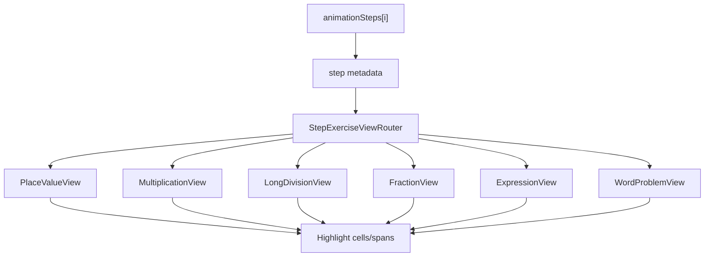

# תוכנית מלאה: אפקטי הדגשה בצעד-צעד לכל נושאי החשבון

## מצב נוכחי (Baseline)

| נושא | צעד-צעד | הדגשות על התרגיל |
|------|---------|------------------|
| חיבור / חיסור | כן | **מוגמר** — [`StepVerticalExerciseView.jsx`](components/learning/StepVerticalExerciseView.jsx) + [`learning-step-vertical-exercise.js`](utils/learning-step-vertical-exercise.js) |
| עשרוניים +/- | כן | **מוגמר** (אותו רכיב) |
| כפל / חילוק / שאר נושאים | כן | `<pre>` סטטי בלבד; metadata חלקי ב-[`math-animations.js`](utils/math-animations.js) |

חיווט יחיד: [`math-master.js`](pages/learning/math-master.js) (~4948) — `supportsPlaceValueStepExerciseView` → רכיב אחד, אחרת `activeStep.pre`.

---

## יעד מוצר סופי

בכל שלב בחלון צעד-צעד (חשבון בלבד), הילד רואה:
- **הדגשה עדינה** על החלק הפעיל (לא טקסט הסבר, לא כפתורים, לא טיוטה)
- **ללא קפיצת layout** (שורות שמורות: תג עמודה, נשיאה, שורות תרגיל)
- **ללא הדגשה דביקה** משלב קודם
- **metadata-driven** — בלי hardcode לפי מספר שלב ב-UI



---

## שלב 0 — תשתית משותפת (Foundation)

**קבצים חדשים:**
- [`utils/learning-step-exercise-types.js`](utils/learning-step-exercise-types.js) — enum/מיפוי `exerciseView` + `resolveExerciseView(step, question)`
- [`utils/learning-step-highlight-styles.js`](utils/learning-step-highlight-styles.js) — `HIGHLIGHT_STYLE`, `DigitCell`, `ExpressionSpan` (מחולץ מ-[`StepVerticalExerciseView.jsx`](components/learning/StepVerticalExerciseView.jsx))
- [`components/learning/StepExerciseViewRouter.jsx`](components/learning/StepExerciseViewRouter.jsx) — בוחר רכיב לפי `exerciseView`
- [`components/learning/StepExerciseShell.jsx`](components/learning/StepExerciseShell.jsx) — wrapper אחיד (רקע, padding, `data-step-id`, `key={step.id}`)

**סכמת metadata אחידה לכל שלב:**
```js
{
  id, title, text,           // קיים — לא לשנות טקסטים
  exerciseView,               // חדש: placeValue | multiplication | longDivision | fraction | expression | wordProblem
  highlights,                 // קיים/מורחב
  revealDigits?, carry?, pre?, type?, params?
}
```

**Refactor קל (לא שינוי התנהגות):**
- [`StepVerticalExerciseView.jsx`](components/learning/StepVerticalExerciseView.jsx) — ייבוא סגנון משותף; ללא שינוי UX
- [`math-master.js`](pages/learning/math-master.js) — החלפת `usePlaceValueExerciseView ? ... : pre` ב-`<StepExerciseViewRouter step={activeStep} question={...} />`

**בדיקות:** הרחבת [`tests/learning/step-vertical-exercise-highlight.test.mjs`](tests/learning/step-vertical-exercise-highlight.test.mjs) + test חדש `step-exercise-router.test.mjs`.

---

## שלב 1 — משפחת Place-Value (הרחבת הקיים)

### 1א. עשרוניים — כפל / חיסור / המרות
**קובץ:** [`buildDecimalsAnimation`](utils/math-animations.js) (~1454)

- הוספת `exerciseView: "placeValue"` + `aColN` metadata (כמו חיבור)
- metadata ל**עמודת הנקודה העשרונית** (`decimalPoint: true`) — הדגשה על `.` בשלב יישור
- שימוש חוזר ב-`StepVerticalExerciseView` עם תמיכה בנקודה עשרונית (תא קבוע, ללא shift)

### 1ב. כפל — מכפלות חלקיות + חיבור עמודות
**קובץ:** [`buildMultiplicationAnimation`](utils/math-animations.js) (~455)

**רכיב חדש:** [`StepMultiplicationExerciseView.jsx`](components/learning/StepMultiplicationExerciseView.jsx)  
**Utility:** [`utils/learning-step-multiplication-exercise.js`](utils/learning-step-multiplication-exercise.js)

| שלב | הדגשה |
|-----|--------|
| יישור | שני הגורמים |
| כפל בספרת b[j] | ספרת b[j] + עמודה פעילה ב-a + שורה חלקית |
| נשיאה בשורה חלקית | תא נשיאה + ספרת תוצאה |
| מכפלה חלקית הושלמה | שורת partial שלמה |
| חיבור partials | עמודה פעילה (מנגנון `aColN` כמו חיבור) |

Metadata חדש (דוגמאות):
- `activeMultiplierIndex`, `activeColumn`, `partialRowIndex`, `revealPartialRows`, `revealSumDigits`
- החלפת `highlights: ["aAll","bAll"]` הכללי בשלבי עמודה/שורה ספציפיים

---

## שלב 2 — חילוק ארוך

**קובץ:** [`buildDivisionAnimation`](utils/math-animations.js) (~700) — כבר יש `type: "division"` + highlights (`resultN`, `aN`, `productN`, `remainderN`)

**רכיב חדש:** [`StepLongDivisionExerciseView.jsx`](components/learning/StepLongDivisionExerciseView.jsx)  
**Utility:** [`utils/learning-step-division-exercise.js`](utils/learning-step-division-exercise.js)

- **איחוד** הלוגיקה המפוזרת ב-[`math-master.js`](pages/learning/math-master.js) (~4677–4906) לרכיב אחד
- הדגשות לפי metadata:
  - ספרת מנה חדשה
  - קטע מחולק / working number
  - שורת product / remainder
  - הורדת ספרה (bring-down)
- שורות שמורות: מנה, קו, מחולק|מחלק, שורות עבודה (ללא קפיצה)

**Metadata cleanup:** מעבר מ-`a${position}` / `result${quotientPosition}` ל-`aColN` / `quotientColN` עקבי (תואם מנגנון חיבור)

---

## שלב 3 — שברים

**קובץ:** [`buildFractionsAnimation`](utils/math-animations.js) (~900) — highlights קיימים: `fraction1`, `fraction2`, `denominator`, `numerators`, `commonDen`, `convert1`, `convert2`, `simplify`, `mixed`, `result`

**רכיב חדש:** [`StepFractionExerciseView.jsx`](components/learning/StepFractionExerciseView.jsx)  
**Utility:** [`utils/learning-step-fraction-exercise.js`](utils/learning-step-fraction-exercise.js)

- תצוגת שברים: מונה / קו / מכנה (2 שברים + שבר תוצאה)
- מיפוי highlight → אזור:
  - `fraction1/2` — שבר שלם
  - `denominator` — שני מכנים
  - `numerators` — שני מונים
  - `commonDen` — מכנה משותף
  - `convert1/2` — שבר אחרי המרה
  - `simplify` — מונה/מכנה לפני/אחרי
  - `mixed` — שלם + שבר
  - `result` — תוצאה סופית
- `pre` משמש לשלבי ביניים; הרכיב מציג snapshot מדורג לפי `revealLines` metadata

---

## שלב 4 — ביטויים מתמטיים (Expression family)

**רכיב משותף:** [`StepExpressionExerciseView.jsx`](components/learning/StepExpressionExerciseView.jsx)  
**Utility:** [`utils/learning-step-expression-exercise.js`](utils/learning-step-expression-exercise.js)

רenderer אחד לשורות LTR עם spans מודגשים — מתאים לרוב הנושאים שאין להם grid אנכי.

### 4א. אחוזים — [`buildPercentagesAnimation`](utils/math-animations.js)
**חסר highlights ברוב השלבים** — להוסיף:
- `baseNumber`, `percentValue`, `fractionPart`, `operator`, `result`
- שלבים: הצגה → המרה לשבר → נוסחה → חישוב → תוצאה

### 4ב. משוואות — [`buildEquationsAnimation`](utils/math-animations.js)
- הדגשת משתנה / אגף / פעולה הופכית
- שלבי `pushMathSteps(buildAdditionOrSubtractionAnimation...)` → `exerciseView: "placeValue"` (reuse router)

### 4ג. סדרות — [`buildSequencesAnimation`](utils/math-animations.js)
- `sequence`, `difference`, `step`, `calculation`, `result` → הדגשת 2–3 מספרים ברצף / הפרש

### 4ד. השוואה / חוש מספרי / גורמים / כפלות / ראשוניים / סדר פעולות / חזקות / יחס / עיגול / הערכה / סקala / ערבול / 0-1
**קבצים:** `buildCompareAnimation`, `buildNumberSenseAnimation`, `buildFactorsMultiplesAnimation`, `buildPrimeCompositeAnimation`, `buildPowersAnimation`, `buildRatioAnimation`, `buildOrderOfOperationsAnimation`, `buildRoundingAnimation`, `buildEstimationAnimation`, `buildScaleAnimation`, `buildDivisibilityAnimation`, `buildZeroOnePropertiesAnimation`

לכל builder:
- הוספת `exerciseView: "expression"` + `highlights` + `expressionLines[]` (מבנה span ranges)
- מיפוי highlight keys ספציפי לנושא (טבלה פנימית ב-utility)

| נושא | highlight keys מוצעים |
|------|----------------------|
| compare | `leftNumber`, `rightNumber`, `operator` |
| number_sense | `decomposedPart`, `wholeNumber`, `placeValuePart` |
| factors_multiples | `targetNumber`, `divisorCandidate`, `factorPair` |
| prime_composite | `unitDigit`, `divisorTest`, `conclusion` |
| powers | `base`, `exponent`, `result` |
| ratio | `partA`, `partB`, `total` |
| order_of_operations | `parentheses`, `activeTerm`, `nextTerm` |
| rounding | `decidingDigit`, `roundedDigit`, `keptDigits` |
| estimation | `originalValue`, `roundedValue`, `operation` |

---

## שלב 5 — בעיות מילוליות

**קובץ:** [`buildWordProblemsAnimation`](utils/math-animations.js) (~2598)

**רכיב:** [`StepWordProblemExerciseView.jsx`](components/learning/StepWordProblemExerciseView.jsx)

- שלב 1–2: הדגשת **מילות מפתח** + **מספרים שנשלפים** מהטקסט (RTL-safe spans)
- שלב 3+: מעבר ל-`StepExerciseViewRouter` עם תרגיל שנבנה (חיבור/כפל/ביטוי) — reuse מלא

Metadata:
- `highlightKeywords[]`, `highlightNumbers[]`, `embeddedExerciseView`, `embeddedStep`

---

## שלב 6 — חיווט סופי ב-math-master

**קובץ:** [`math-master.js`](pages/learning/math-master.js)

1. הסרת `supportsPlaceValueExerciseView` / inline division UI / `<pre>` fallback לנושאים שיש להם view
2. `<StepExerciseViewRouter step={activeStep} layoutProps={{ topValue, bottomValue, ... }} />`
3. `key={activeStep.id}` + `stepIndex={safeStepIndex}` — remount בכל מעבר שלב
4. `<pre>` נשאר **fallback בטוח** רק כש-`exerciseView` חסר (שלבי fallback ישנים)

---

## שלב 7 — בדיקות אוטומטיות

| קובץ test | כיסוי |
|-----------|--------|
| `step-vertical-exercise-highlight.test.mjs` | regression חיבור/חיסור |
| `step-multiplication-exercise.test.mjs` | עמודות, partial rows, מעבר שלב |
| `step-division-exercise.test.mjs` | quotient/product/remainder |
| `step-fraction-exercise.test.mjs` | כל highlight keys |
| `step-expression-exercise.test.mjs` | span ranges, LTR |
| `step-exercise-router.test.mjs` | routing לפי `exerciseView` |
| `scripts/tests/verify-step-by-step-render-guard.mjs` | עדכון guard ל-router |

**Smoke per builder:** script/test שמוודא שכל step מ-`buildAnimationForOperation` מחזיר `exerciseView` + highlights תקפים.

---

## שלב 8 — QA ידני (Matrix)

לכל operation ב-[`buildAnimationForOperation`](utils/math-animations.js) (~3883):

1. פתיחת צעד-צעד מתרגיל מייצג
2. מעבר קדימה/אחורה בכל השלבים
3. וידוא: רק החלק הפעיל מודגש; אין sticky; אין layout jump
4. מובייל (viewport צר)

**תרגילי מפתח:**
- חיבור 4 ספרות + נשיאה (`6234+8164`)
- כפל 2×3 ספרות
- חילוק ארוך 3–4 ספרות
- שברים: מכנה משותף + צמצום
- אחוזים: X% מ-Y
- משוואה עם שלב חיבור מוטמע
- בעיה מילולית multi-step

---

## שלב 9 — Build + מסירת אישור

1. `npm run build`
2. הרצת כל tests החדשים
3. **ללא commit / push**
4. שליחת לך: צילומי מסך/וידאו קצר לפי matrix (לפחות: חיבור, כפל, חילוק, שבר, אחוז, בעיה מילולית)
5. commit + push **רק** לאחר אישורך המפורש

---

## עקרונות מחייבים (לא לשבור)

- לא לשנות: טקסטי הסבר, לוגיקת פתרון, alignment ספרות, כפתורי נגן/קודם/בא, דף טיוטה, reports/scoring/routes
- אותו סגנון הדגשה (amber inset) בכל הרכיבים
- שורות שמורות קבועות בכל view (label / carry / structure rows)
- metadata בלבד — לא hardcode לפי index ב-UI

---

## הערכת объем (פנימית)

| שלב | מורכבות | קבצים עיקריים |
|-----|---------|---------------|
| 0 Foundation | נמוכה | 4 קבצים חדשים + refactor קל |
| 1 Place-value + כפל | גבוהה | 2 views + metadata כפל/עשרוניים |
| 2 חילוק | גבוהה | view + איחוד math-master |
| 3 שברים | בינונית | view + fraction resolver |
| 4 Expression ×12 builders | גבוהה | metadata enrichment массовי |
| 5 בעיות מילוליות | בינונית | view + embedded routing |
| 6–9 חיווט/QA | בינונית | tests + build |

**סה"כ משוער:** ~25–35 קבצים נגעים/חדשים; מימוש רציף עד מוצר מוגמר, אישור git יחיד בסוף.
