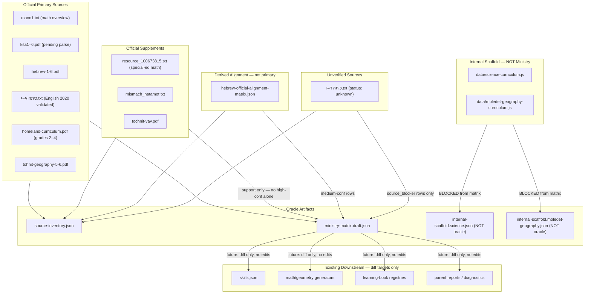

# Ministry Curriculum Oracle — Build Plan (revised)

## Scope and hard constraints

**Planning + oracle artifact generation only.** New scripts, if created, are standalone report-generation tools only and are not connected to runtime, CI, QA, build, or product code.

Allowed:
- Script files created under `scripts/build-ministry-oracle-*.mjs`.
- Those scripts may only write generated outputs to `data/curriculum-oracle/v1/` and `docs/curriculum/`. They must not write to any other directory or modify any existing file.
- Read-only access to existing source TXT/JSON/JS files.

Not allowed:
- Any script added to `package.json` scripts (no `npm run` entry).
- Any script imported by runtime pages, components, QA gates, or any existing file.
- Any modification to `skills.json`, generators, books, UI, copy, SQL, registries, reports, or QA scripts.
- Automatic regeneration of `skills.json` from oracle output.
- Any commit, push, or deploy.

Outputs:
- `data/curriculum-oracle/v1/source-inventory.json`
- `data/curriculum-oracle/v1/ministry-matrix.draft.json`
- `data/curriculum-oracle/v1/internal-scaffold.science.json` (science only — NOT part of oracle)
- `data/curriculum-oracle/v1/internal-scaffold.moledet-geography.json` (moledet/geography product-state — NOT part of oracle)
- `docs/curriculum/CURRICULUM_ORACLE_BUILD_PLAN_GRADES_1_6.md`

---

## Architecture of the oracle



---

## File 1 — `data/curriculum-oracle/v1/source-inventory.json`

### Source class taxonomy

Every entry must carry a `source_class` that controls what confidence level its rows may reach in the oracle:

| `source_class` | Max row confidence | Description |
|----------------|--------------------|-------------|
| `official_primary` | `high` | Published by MoE as a grade-programme document, directly ingested or bound in repo |
| `official_supplement` | `medium` | Official MoE document but not the primary grade programme (special-ed adaptation, pedagogy guide) |
| `derived_alignment` | `medium` | Derived from an official primary source via a prior manual alignment pass (e.g. `hebrew-official-alignment-matrix.json`) |
| `unverified` | `low` — must be `source_blocker` | File present but content not validated against the expected official document |
| `no_verified_source` | `low` — status must be `not_in_grade` or `source_blocker` | No verified official Ministry source exists for this subject/grade in the repo. Used only as an official-status blocker row. Must not include product topic names. Must not be used as curriculum truth. Must not raise confidence for any other row. Allowed only for subject/grade combinations where no official primary source is confirmed (e.g. Grade 1 Moledet/geography). |
| `internal_scaffold` | **blocked** — never enters `ministry-matrix.draft.json` | Generated from internal product JS; not an MoE document |

### Schema per entry

```json
{
  "source_id": "math_mavo1_txt",
  "file_path": "תוכנית משרד החינוך קובצי TXT/mavo1.txt",
  "remote_url": "https://meyda.education.gov.il/files/Tochniyot_Limudim/Math/Yesodi/mavo1.pdf",
  "subject_coverage": ["math", "geometry"],
  "grade_coverage": [1, 2, 3, 4, 5, 6],
  "source_type": "txt",
  "source_class": "official_primary",
  "validated_status": "validated",
  "parse_status": "partially_extracted",
  "in_repo": true,
  "notes": "Contains grade×strand summary table (cols: מצולעים | גופים | טרנספורמציות | מדידות). Supports medium-confidence rows; high-confidence only when corroborated by kita{n}.pdf."
}
```

### Entries to generate

| `source_id` | path | subjects | grades | `source_class` | `validated_status` |
|-------------|------|---------|--------|-----------------|-------------------|
| `math_mavo1_txt` | `...קובצי TXT/mavo1.txt` | math, geometry | 1–6 | `official_primary` | `validated` |
| `math_resource_special_ed_txt` | `...קובצי TXT/resource_100673815.txt` | math, geometry | 1–6 | `official_supplement` | `validated` |
| `math_mismach_hatamot_txt` | `...קובצי TXT/mismach_hatamot.txt` | math | 1–6 | `official_supplement` | `validated` |
| `math_kita1_pdf` … `math_kita6_pdf` | `תוכנית משרד החינוך/כיתה א–ו.pdf` | math, geometry | per grade | `official_primary` | **`pending_parse`** |
| `hebrew_1_6_pdf` | `תוכנית משרד החינוך/hebrew-1-6.pdf` | hebrew | 1–6 | `official_primary` | `validated_bound` |
| `english_curriculum_2020_pdf` | `.../english Curriculum2020.pdf` | english | 1–6 | `official_primary` | `validated` |
| `english_g1_txt` … `english_g3_txt` | `...קובצי TXT/כיתה א–ג.txt` | english | 1–3 | `official_primary` | `validated` |
| `english_g4_txt` … `english_g6_txt` | `...קובצי TXT/כיתה ד–ו.txt` | english | 4–6 | **`unverified`** | **`unknown_unverified`** |
| `science_curriculum_2016_docx` | `.../science Curriculum2016.docx` | science | 1–6 | `official_primary` | **`validated_unread`** (file present, content not parsed) |
| `homeland_curriculum_pdf` | `.../homeland-curriculum.pdf` | moledet | **2–4** | `official_primary` | `validated` |
| `geography_5_6_pdf` | `.../tohnit-geography-5-6.pdf` | geography | 5–6 | `official_primary` | `validated` |
| `tochnit_vav_pdf` | `.../tochnit-vav.pdf` | moledet, geography | 6 | `official_supplement` | `validated` |
| `hebrew_official_matrix_json` | `data/hebrew-official-alignment-matrix.json` | hebrew | 1–6 | `derived_alignment` | `validated` |
| `science_curriculum_js` | `data/science-curriculum.js` | science | 1–6 | **`internal_scaffold`** | `internal` — **BLOCKED from oracle** |
| `moledet_geography_curriculum_js` | `data/moledet-geography-curriculum.js` | moledet, geography | 1–6 | **`internal_scaffold`** | `internal` — **BLOCKED from oracle** |

**Note:** `homeland_curriculum_pdf` grade coverage is **2–4 only**. Grade 1 has no MoE מולדת primary source confirmed in-repo — it must not appear as a grade in any official_primary source entry.

---

## File 2 — `data/curriculum-oracle/v1/ministry-matrix.draft.json`

### Row schema

```json
{
  "row_id": "math.g5.measurement.area_formulas.triangle_area",
  "subject": "math",
  "grade": 5,
  "official_domain": "מדידות",
  "official_topic": "מדידות שטחים",
  "official_subtopic": "נוסחת שטח המשולש (בסיס × גובה ÷ 2)",
  "ministry_source_file": "תוכנית משרד החינוך קובצי TXT/resource_100673815.txt",
  "ministry_source_type": "txt",
  "source_class": "official_supplement",
  "source_anchor": "כיתה ה׳ § ה. מדידות שטחים עמ׳ 114–115",
  "corroborating_source": "mavo1.txt grade-5 column: 'נוסחאות השטח + ריצוף, גבהים'",
  "status": "required_pending_pdf_parse",
  "confidence": "medium",
  "geometry_strand": true,
  "internal_candidate_skill_id": null,
  "notes": "Strongly indicated by mavo1.txt + resource_100673815.txt but NOT final until kita5.pdf is parsed and anchored. Part of מדידות שטחים unit; not a standalone TOC heading. Prerequisite: גבהים §4 p.113 must precede or co-teach.",
  "blocker_reason": "Primary grade-5 Ministry PDF (kita5.pdf) not yet parsed or anchored; confidence capped at medium until that is done.",

  "sequence_index": 3,
  "sequence_group": "area_formulas",
  "prerequisite_row_ids": [],
  "prerequisite_skill_ids": [],
  "sequence_source_anchor": "pedagogical_inferred",
  "sequence_confidence": "medium",
  "sequence_notes": "Triangle area formula depends on prior knowledge of rectangle area and triangle properties from earlier grades/earlier measurement and geometry units. Exact prerequisite row_ids pending final oracle row-id generation for G3–G4 rows. Source tables give topic order within grade but not explicit dependency language; order is therefore pedagogically inferred."
}
```

### Sequence fields — definitions

Every oracle row where ordering is determinable must carry these fields:

| Field | Type | Definition |
|-------|------|-----------|
| `sequence_index` | integer | Numeric order within `subject × grade × sequence_group`. Lower = earlier. |
| `sequence_group` | string | Ordered block name, e.g. `number_sense`, `addition_subtraction`, `multiplication_division`, `geometry_properties`, `measurement_area`, `area_formulas`, `volume`, `reading_foundations`, `grammar_advanced`. |
| `prerequisite_row_ids` | array of `row_id` strings | Oracle rows that must appear before this row in any product surface. |
| `prerequisite_skill_ids` | array of internal skill id strings | Existing `skills.json` skill ids that currently act as prerequisites, if known. May be empty. |
| `sequence_source_anchor` | string | Ministry source section/page/line that establishes the ordering, **or** the string `"pedagogical_inferred"` when the official source lists topics in order but does not use explicit dependency language. |
| `sequence_confidence` | `high` / `medium` / `low` | `high` = Ministry document explicitly sequences or gates this topic; `medium` = topic order is clear from document structure; `low` = ordering is inferred from pedagogy only. |
| `sequence_notes` | string | Human-readable explanation of the ordering decision and any caveats. |

When no sequence data is available for a row, all sequence fields must be set to `null` (not omitted) so downstream diff tooling can distinguish "not yet classified" from "intentionally unordered".

### Rule: confidence ceiling per source class

A row's `confidence` is capped by its `source_class`:
- `official_primary` + parsed → `high` allowed
- `official_primary` + `pending_parse` → `medium` maximum
- `official_supplement` alone → `medium` maximum
- `official_supplement` corroborating `official_primary` → may raise to `medium`; `high` only when primary is parsed
- `derived_alignment` → `medium` maximum
- `unverified` → `low`, `status` must be `source_blocker`
- `no_verified_source` → `low`, `status` must be `not_in_grade` or `source_blocker`; row must contain no product topic names; must not raise confidence for any other row
- `internal_scaffold` → **never enters this file**

### Confidence ceiling summary table

| `source_class` present | Primary parsed? | Max `confidence` | Allowed `status` values |
|------------------------|-----------------|------------------|------------------------|
| `official_primary` | yes | `high` | any |
| `official_primary` | no (`pending_parse`) | `medium` | any |
| `official_supplement` only | — | `medium` | any |
| `derived_alignment` | — | `medium` | any |
| `unverified` | — | `low` | `source_blocker` only |
| `no_verified_source` | — | `low` | `not_in_grade` or `source_blocker` only |

### Formal `status` taxonomy

Every oracle row must carry exactly one of the following `status` values:

| `status` | Meaning | Allowed `confidence` | Curriculum truth? | May appear in `ministry-matrix.draft.json`? | May produce downstream product work later? | Owner/source action required? |
|----------|---------|----------------------|-------------------|---------------------------------------------|--------------------------------------------|-------------------------------|
| `required` | Topic is required by the official curriculum at this grade | `high` or `medium` | Yes | Yes | Yes — after oracle approval | No (source already confirmed) |
| `optional` | Topic is explicitly listed as optional/enrichment by the official curriculum | `high` or `medium` | Yes (optional scope) | Yes | Yes — marked enrichment downstream | No |
| `not_in_grade` | Official source explicitly excludes or does not list this topic at this grade; or no official source exists for this subject/grade | `low` only | No | Yes — as a blocker/boundary row | No — product must not present as Ministry-aligned | Yes if source is missing; No if source clearly excludes |
| `unclear` | Topic appears in a source but its required/optional status is ambiguous | `low` or `medium` | No — provisional | Yes | No — pending resolution | Yes — owner must classify |
| `source_blocker` | No verified source available to determine status; row is a placeholder | `low` only | No | Yes — as a blocker row | No — blocked until source is resolved | Yes — source must be provided or verified |
| `pending_parse` | Source file exists in repo but has not been parsed/extracted to usable rows | `low` only | No | Yes — as a placeholder row | No — blocked until source is parsed | Yes — source must be parsed |
| `required_pending_pdf_parse` | Strong textual/supplemental evidence that topic is required, but primary grade PDF not yet parsed/anchored | `medium` maximum, never `high` | Provisional only | Yes | No — not final until primary PDF parsed | Yes — primary PDF must be parsed |

**Hard rules for status values:**

- `source_blocker` and `pending_parse` are **not** curriculum truth. Downstream product work must not be based on rows carrying these statuses.
- `required_pending_pdf_parse` is provisional. It may not be treated as final. Confidence is capped at `medium`.
- `not_in_grade` may only be used when the source basis is clear enough to conclude the topic is absent at this grade. If the source basis is unclear or missing, use `source_blocker` instead.
- `required` and `optional` may only be used when the source_class is `official_primary`, `official_supplement`, or `derived_alignment` and the relevant source has been parsed/validated.
- A `no_verified_source` row must use `status: not_in_grade` or `status: source_blocker`. It must never use `status: required` or `status: optional`.

### Population strategy per subject

#### Math / Geometry (highest priority)

**Sources:**
- `mavo1.txt` (source_class: `official_primary`, parse_status: `partially_extracted`) — grade×strand summary table, lines 603–659, 4 columns × 6 grade rows.
- `resource_100673815.txt` (source_class: `official_supplement`) — per-grade topic sections with page refs to the תכ"ל document; confirms G5 מדידות שטחים pp. 114–115 and גבהים §4 p.113.
- `כיתה א–ו.pdf` (source_class: `official_primary`, parse_status: `pending_parse`) — not yet parsed to TXT; generates placeholder rows only.

**Extraction approach (standalone script `scripts/build-ministry-oracle-math-geometry.mjs`):**
1. Read `mavo1.txt` lines 603–659; parse grade×strand columns → emit rows tagged `source_anchor: "mavo1.txt lines 603–659, grade-N <strand column>"`, `source_class: official_primary`, `confidence: medium` (primary but not per-grade PDF verified).
2. Read `resource_100673815.txt`; detect per-grade section headers (`כתה א׳` … `כתה ו׳`), numbered topic items with page refs → emit corroborating rows as `source_class: official_supplement`.
3. For each per-grade PDF `כיתה N.pdf`: emit one placeholder row per grade: `status: pending_parse, confidence: low, blocker_reason: "kita{N}.pdf not yet parsed"`.
4. For every topic supported by both `mavo1.txt` and `resource_100673815.txt`, set `confidence: medium`; record both in `corroborating_source`.

**Triangle area — specific row treatment:**

| Field | Value |
|-------|-------|
| `subject` | `math` (geometry strand) |
| `grade` | `5` |
| `official_domain` | `מדידות` |
| `official_topic` | `מדידות שטחים` |
| `official_subtopic` | `שטח משולש (בסיס × גובה ÷ 2)` |
| `ministry_source_file` | `resource_100673815.txt` |
| `source_class` | `official_supplement` |
| `corroborating_source` | `mavo1.txt grade-5: נוסחאות השטח + ריצוף, גבהים` |
| `source_anchor` | `כיתה ה׳ § ה. מדידות שטחים עמ׳ 114–115` |
| `status` | `required_pending_pdf_parse` |
| `confidence` | **`medium`** |
| `blocker_reason` | `"Primary grade-5 Ministry PDF (kita5.pdf) not yet parsed; confidence capped at medium until parsed and anchored"` |
| `notes` | `"Not a standalone TOC heading. Part of מדידות שטחים. Prerequisite: גבהים §4 p.113 must precede or co-teach. G3–G4 use 'שטח ביחידות שרירותיות' (comparison only) — formula not in those grades."` |

**Other critical geometry strand rows (confidence caps apply):**

| grade | official_domain | official_topic | official_subtopic | status | confidence |
|-------|-----------------|----------------|-------------------|--------|------------|
| 3 | גאומטריה | מצולעים | זוויות, מאונכות, מקבילות, משולשים, מרובעים | required_pending_pdf_parse | medium |
| 3 | מדידות | שטח | השוואה; יחידות שרירותיות (no formula) | required_pending_pdf_parse | medium |
| 4 | גאומטריה | ריבוע ומלבן | הגדרות, תכונות; תכונות צלעות וזוויות במשולש | required_pending_pdf_parse | medium |
| 4 | מדידות | נוסחאות שטח והיקף | שטח מלבן + היקף מלבן | required_pending_pdf_parse | medium |
| 4 | מדידות | נפח | נפח תיבה, שטח פנים | required_pending_pdf_parse | medium |
| 5 | מצולעים | גבהים | גובה לשטח (משולש, מקבילית, טרפז) | required_pending_pdf_parse | medium |
| 5 | מדידות | מדידות שטחים | שטח משולש / מקבילית / טרפז | required_pending_pdf_parse | **medium** |
| 6 | גאומטריה | גופים | נפחים; פריסות; גופים משוכללים | required_pending_pdf_parse | medium |
| 6 | מדידות | מעגל ועיגול | היקף + שטח מעגל | required_pending_pdf_parse | medium |

All rows above are `required_pending_pdf_parse` — strongly supported by `mavo1.txt` + `resource_100673815.txt` but not final until the per-grade `kita{N}.pdf` files are parsed and individual section anchors confirmed. Confidence is capped at `medium` until then.

#### Hebrew

**Source primary:** `data/hebrew-official-alignment-matrix.json` (source_class: `derived_alignment` — already mapped from `hebrew-1-6.pdf` with char anchors).  
**Approach:** Re-map matrix rows to oracle schema. Grade 1 rows inherit `confidence: medium` (POP grade-1 page provides some direct anchor; single PDF limits per-grade certainty for higher grades).  
**Rule:** No Hebrew row may exceed `confidence: medium` until per-grade TXT splits are available for grades 2–6.  
**Script:** standalone `scripts/build-ministry-oracle-hebrew.mjs`; reads `data/hebrew-official-alignment-matrix.json` only; writes to `ministry-matrix.draft.json` section; no imports from runtime.

#### English

**Grades 1–3:** `כיתה א–ג.txt` (source_class: `official_primary`, validated) → rows `confidence: medium` (per-grade, well-structured, but no PDF section anchor yet).  
**Grades 4–6:** `כיתה ד–ו.txt` (source_class: `unverified`) → rows with `status: source_blocker, confidence: low, blocker_reason: "TXT file content not validated against english Curriculum2020.pdf; must be verified by owner before any rows can be promoted"`. These rows enter the matrix as blockers only, not as curriculum truth.  
**Fallback for grades 4–6 scaffolding:** `english Curriculum2020.pdf` (source_class: `official_primary`, `validated`) may be used to emit `confidence: low, status: required_pending_pdf_parse` placeholder rows for the PDF-covered grades if a TXT extract is produced.  
**Script:** standalone `scripts/build-ministry-oracle-english.mjs`.

#### Science — separate scaffold file only

**Science cannot be marked Ministry-aligned until `science Curriculum2016.docx` is parsed into grade×domain×outcome rows.**

Science rows derived from `data/science-curriculum.js` are internal product data, not MoE documents. They must **not** enter `ministry-matrix.draft.json`.

Instead:
- `scripts/build-ministry-oracle-science.mjs` writes to `data/curriculum-oracle/v1/internal-scaffold.science.json` only.
- Every row carries: `source_class: internal_scaffold`, `ministry_source_type: internal_js_scaffold`, `status: source_blocker`, `confidence: low`, `blocker_reason: "Science Curriculum2016.docx not parsed; this is NOT an official oracle row. Do not merge into ministry-matrix.draft.json."`.
- The file header includes: `"WARNING": "This file is NOT part of the Ministry oracle. It is a scaffold for reference until the DOCX is parsed."`.
- `ministry-matrix.draft.json` includes zero science rows until DOCX parsing is complete.

#### Moledet / Geography

##### Hard rule — internal_scaffold ban

> **No row derived from `data/moledet-geography-curriculum.js` may enter `data/curriculum-oracle/v1/ministry-matrix.draft.json`.**

`data/moledet-geography-curriculum.js` is `source_class: internal_scaffold`. The global rule "internal_scaffold rows are blocked from the oracle" applies fully here. This file documents product structure, not MoE curriculum.

##### Grade 1

No verified official MoE מולדת or geography primary source has been found for grade 1.

`ministry-matrix.draft.json` receives **at most one** grade-1 status row with these fixed fields:

```json
{
  "row_id": "moledet.g1.official_status",
  "subject": "moledet",
  "grade": 1,
  "official_domain": null,
  "official_topic": null,
  "official_subtopic": null,
  "ministry_source_file": null,
  "ministry_source_type": null,
  "source_class": "no_verified_source",
  "source_anchor": null,
  "status": "not_in_grade",
  "confidence": "low",
  "internal_candidate_skill_id": null,
  "notes": "Product teaches grade-1 moledet/geography content but no verified official MoE primary source was found to support it. Product may continue as enrichment but must not present this as Ministry-aligned curriculum.",
  "blocker_reason": "No verified official MoE source for grade-1 Moledet/geography found.",

  "sequence_index": null,
  "sequence_group": null,
  "prerequisite_row_ids": null,
  "prerequisite_skill_ids": null,
  "sequence_source_anchor": null,
  "sequence_confidence": null,
  "sequence_notes": null
}
```

That row contains **no product topic names** sourced from `data/moledet-geography-curriculum.js`.

##### Product-state scaffold for grade 1 (and all other grades)

All rows derived from `data/moledet-geography-curriculum.js` go to a separate file:

`data/curriculum-oracle/v1/internal-scaffold.moledet-geography.json`

Rules for that file:
- Every row: `source_class: internal_scaffold`, `status: source_blocker`, `confidence: low`.
- File header includes: `"WARNING": "This file is NOT part of the Ministry oracle. It documents the current product topic state only. These rows must never be merged into ministry-matrix.draft.json and must never raise confidence for any oracle row."`.
- This file may be used in the diff report as product-state evidence — listed under the layer `data/moledet-geography-curriculum.js` — but is never cited as an oracle anchor.

##### Grades 2–4

Source: `homeland-curriculum.pdf` (source_class: `official_primary`, grade_coverage: `[2, 3, 4]`) → rows `confidence: medium`.

##### Grades 5–6

Source: `tohnit-geography-5-6.pdf` (source_class: `official_primary`) → geography rows `confidence: medium`. `tochnit-vav.pdf` (source_class: `official_supplement`) provides grade-6 supplement support.

##### Subject split

`subject: moledet` for civic/homeland strand; `subject: geography` for maps/geographic content.

##### Script

Standalone `scripts/build-ministry-oracle-moledet-geography.mjs`.  
Two outputs: `ministry-matrix.draft.json` (official rows only) and `internal-scaffold.moledet-geography.json` (product-state rows only).

---

## File 3 — `docs/curriculum/CURRICULUM_ORACLE_BUILD_PLAN_GRADES_1_6.md`

The plan document covers:

1. **Policy declaration** — `skills.json` is downstream; oracle is upstream. Scripts are standalone artifact-generation tools only, not connected to runtime, CI, QA, or product code.
2. **Source strictness rules** — all six `source_class` values, the formal `status` taxonomy, confidence ceiling table, and rule that internal_scaffold rows are blocked from the oracle.
3. **Source inventory** — links to `source-inventory.json`; complete blockers table.
4. **Per-subject matrix build procedure** — as specified above.
5. **Science section** — explicit statement: "Science cannot be marked Ministry-aligned until `science Curriculum2016.docx` is parsed into grade×domain×outcome rows."
6. **Triangle area investigation (reporting only, no implementation):**
   - Official grade: strongly indicated as **5** (מדידות שטחים pp. 114–115 and גבהים §4 p.113 in `resource_100673815.txt`; `mavo1.txt` grade-5: "נוסחאות השטח + ריצוף, גבהים"). Confidence: **medium** until `kita5.pdf` parsed.
   - Standalone vs unit: Part of מדידות שטחים — not a standalone TOC heading.
   - G3–G4 overteaching: `TOPIC_SHAPES.area.g3 = [..., "triangle"]` in `utils/geometry-constants.js` causes generator to emit triangle area from G3. Official tables show G3 measurements as "שטח ביחידות שרירותיות" (comparison/arbitrary units), no formula. This is `OVERTEACHING` pending oracle verification.
   - G5 `heights_triangle` hidden prerequisite: Yes — `lib/learning-book/geometry-g5-registry.js` contains `heights_triangle` page with no prior `triangle_area` page. Formula assumed known.
   - G6 `prism_volume_triangle` chain: `docs/learning-book/geometry/g6/drafts/prism_volume_triangle.md` depends on triangle area formula → depends on heights context → both lack an anchoring book page.
   - Remediation order (not yet implemented — oracle approval required first): oracle row → spine skill (G5+) → generator grade gate → G5 book page `triangle_area.md` (before `heights_triangle`) → practice CTA mapping → report/diagnostic grade gate → QA oracle gates.
7. **Diff report section** — oracle vs each product layer.
8. **QA gates required** — listed as future work; no changes to existing scripts in this phase.

---

## Diff report structure (inside plan doc)

The diff is **report-only**. No compared file is modified.

For each product layer, classify every mismatch with one of:

| Flag | Description | Examples |
|------|-------------|---------|
| `MISSING_REQUIRED_TOPIC` | Oracle requires; product has no skill/page/label | `triangle_area` G5 book page absent from `geometry-g5-registry.js` |
| `OVERTEACHING` | Product teaches at grade where oracle has no required row | `triangle_area` generator from G3 via `TOPIC_SHAPES.area.g3`; moledet G1 |
| `WRONG_GRADE_SCOPE` | Product grade span differs from oracle grade band | `science.plants` maxGrade 3 vs curriculum presence in G4–6 |
| `HIDDEN_PREREQUISITE` | Page/skill depends on unregistered prior skill | `heights_triangle` needs `triangle_area`; `prism_volume_triangle` needs both |
| `OUT_OF_SEQUENCE` | Topic exists at the correct grade but appears before its required prerequisite or violates the Ministry/pedagogical ordering | `heights_triangle` book page before `triangle_area`; `prism_volume_triangle` before `triangle_area`; area formulas before basic area measurement; multiplication before addition/subtraction foundations; advanced grammar topic before foundational literacy topic |
| `UNSUPPORTED_REPORT_LABEL` | Diagnostic/parent label exists without oracle row for that grade | `geo_area_triangle_formula` surfaced below G5 |
| `UNSUPPORTED_TEACHER_ASSIGNMENT` | Teacher can assign topic not in oracle for grade | Triangle area activity assignable at G3–4 |
| `SOURCE_BLOCKER` | Cannot classify match/mismatch without owner providing verified source | Science DOCX unread; English ד–ו TXT unverified; math kita PDFs unparsed |
| `NEEDS_OWNER_DECISION` | Evidence is available but classification requires pedagogy judgment | Triangle area G4 (properties only vs formula introduction) |

Layers compared (read-only):

| Layer | File(s) |
|-------|---------|
| Spine | `data/curriculum-spine/v1/skills.json` |
| Geometry generator gates | `utils/geometry-constants.js` (`TOPIC_SHAPES`, `GRADES`) |
| Math generator gates | `utils/math-constants.js` + math-question-generator.js kind branches |
| Hebrew content maps | `data/hebrew-g1-content-map.js` … `data/hebrew-g6-content-map.js` |
| English curriculum | `data/english-curriculum.js` + `data/english-questions/` |
| Science curriculum | `data/science-curriculum.js` + `data/science-questions.js` |
| Moledet/geography | `data/moledet-geography-curriculum.js` + `data/geography-questions/` |
| Book registries | `lib/learning-book/*-registry.js` (21 files) |
| Teacher/school labels | `lib/classroom-activities/classroom-skill-labels-he.js` |
| Parent report copy | `utils/parent-report-language/parent-diagnostic-explanations-he.js` |
| Diagnostic taxonomy | `utils/diagnostic-engine-v2/geometry-taxonomy-candidate-order.js` |
| QA scripts (read to classify missing gates) | `scripts/verify-*.mjs`, `qa:*:closure-gate` npm scripts |

### Sequence checks required per product surface

The diff report must check `OUT_OF_SEQUENCE` for the following surfaces (read-only inspection):

#### 1. Learning books

- TOC/chapter order in each `lib/learning-book/*-registry.js` — compare to oracle `sequence_index` within subject × grade × domain.
- Page order (previous/next navigation links) inside book page markdown files under `docs/learning-book/`.
- Practice CTA order — topic order suggested at the end of each book page.

#### 2. Student learning surfaces

- Topic card ordering on grade/subject pages — inspect any sort key used in the topic-card renderer.
- Grade subject pages — top-to-bottom topic listing order.
- Practice topic selection screen — topic ordering in the practice topic picker.

#### 3. Teacher / private-teacher surfaces

- Activity creation topic list — order topics are presented when a teacher creates a new activity.
- Suggested topics list — order in which topics are recommended for a student.
- Reinforcement topic order in teacher reports.

#### 4. School surfaces

- School activity creation topic list — same as teacher, but scoped to class-level activities.
- Class/student report topic ordering.

#### 5. Parent / reporting / diagnostic surfaces

- Weakness and strength topic ordering in parent reports.
- Reinforcement suggestion ordering in diagnostic output.
- Diagnostic explanation order — `utils/parent-report-language/parent-diagnostic-explanations-he.js` and `utils/diagnostic-engine-v2/geometry-taxonomy-candidate-order.js`.

For every surface, the diff report must flag any topic that precedes a `prerequisite_row_id` topic as `OUT_OF_SEQUENCE` and note the current observed order vs. the oracle-required order.

---

## Consolidated hard rules (immutable for this phase)

These rules must be enforced by every script and confirmed in the plan document:

1. **No `source_class: internal_scaffold` in `ministry-matrix.draft.json`.** Any row tagged `internal_scaffold` is banned from the oracle file. Violation is a build error.
2. **No row from `data/moledet-geography-curriculum.js` in `ministry-matrix.draft.json`.** This file is `internal_scaffold`. All its rows go to `internal-scaffold.moledet-geography.json` only.
3. **No row from `data/science-curriculum.js` in `ministry-matrix.draft.json`.** This file is `internal_scaffold`. All its rows go to `internal-scaffold.science.json` only.
4. **Internal scaffold rows must never raise confidence for any oracle row.** A scaffold row cannot be cited as `corroborating_source` to increase a row's confidence in the oracle.
5. **Grade-1 Moledet/geography in the oracle is limited to one status row** (`status: not_in_grade`, `confidence: low`, no product topic names). The row's `source_class` is `no_verified_source`.
6. **Triangle area confidence is capped at `medium`** until `kita5.pdf` is parsed and a direct page/section anchor is confirmed.
7. **All new scripts are standalone only.** Script files may be created under `scripts/build-ministry-oracle-*.mjs`. Their generated outputs may only be written to `data/curriculum-oracle/v1/` and `docs/curriculum/`. Scripts must not be added to `package.json`, must not be imported by any runtime file or existing script, and must not modify any file outside those two output directories.
8. **`skills.json`, generators, books, registries, reports, diagnostics, QA scripts, CI, UI, copy, and SQL are read-only** in this phase.
9. **The oracle must include learning sequence metadata.** Every oracle row where ordering is determinable must carry `sequence_index`, `sequence_group`, `prerequisite_row_ids`, `prerequisite_skill_ids`, `sequence_source_anchor`, `sequence_confidence`, and `sequence_notes`. Rows where ordering cannot yet be determined must set all sequence fields to `null` (not omit them). Product surfaces must not be allowed to sort curriculum topics alphabetically, by file order, by generator order, or by arbitrary registry order when Ministry/pedagogical sequence is available in the oracle.

---

## What changes and what does not

| Item | Status |
|------|--------|
| `data/curriculum-oracle/v1/source-inventory.json` | **Created** — new file |
| `data/curriculum-oracle/v1/ministry-matrix.draft.json` | **Created** — new file; official rows only |
| `data/curriculum-oracle/v1/internal-scaffold.science.json` | **Created** — new file; NOT oracle; science product-state only |
| `data/curriculum-oracle/v1/internal-scaffold.moledet-geography.json` | **Created** — new file; NOT oracle; moledet/geography product-state only |
| `docs/curriculum/CURRICULUM_ORACLE_BUILD_PLAN_GRADES_1_6.md` | **Created** — new file |
| `scripts/build-ministry-oracle-*.mjs` (5 scripts) | **Created** — standalone tools, not wired to runtime or npm |
| `data/curriculum-spine/v1/skills.json` | **No change** |
| `data/moledet-geography-curriculum.js` | **No change** (read-only input) |
| `data/science-curriculum.js` | **No change** (read-only input) |
| Any generator, book registry, report, QA script, page, UI, copy, SQL | **No change** |
