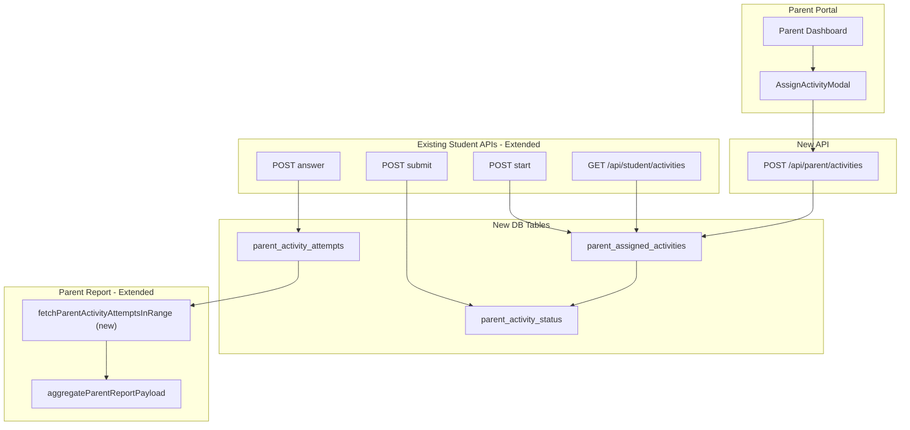

# Parent Assigned Activities — Complete Implementation Plan

## 1. Current-State Audit Summary

### Core activity tables (teacher-owned, separate from parent report)
- **`classroom_activities`** — class-wide activities; `teacher_id` + `class_id` + optional `school_id`; attempts in `classroom_activity_attempts`
- **`student_activities`** — individual teacher-to-student activities; `teacher_id` + `student_id`; attempts in `student_activity_attempts`
- Neither table is ever read by the parent report. Teacher/school reports ONLY read these tables.

### Free-play learning tables (what the parent report reads)
- **`learning_sessions`** — per-session rows: `student_id`, `subject`, `topic`, `duration_seconds`, `metadata` JSONB
- **`answers`** — per-answer rows: `student_id`, `learning_session_id` (nullable), `question_id`, `answer_payload` JSONB, `is_correct`, `answered_at`

### Parent report aggregation path
- [`lib/parent-server/report-data-aggregate.server.js`](lib/parent-server/report-data-aggregate.server.js) → `aggregateParentReportPayload()` → fetches `learning_sessions` + `answers` filtered by `student_id`
- Subject/topic come from `answer_payload.subject` / `answer_payload.topic` (takes priority over the session reference)
- `learning_session_id` is nullable in `answers` — rows without a session are still aggregated
- Teacher activities are entirely absent from this path

### Student activity execution path
- `GET /api/student/activities` → `listStudentActivities()` → merges `classroom_activities` (scope: `class`) + `student_activities` (scope: `student`)
- `POST /api/student/activities/[activityId]/start|answer|submit` → dispatches by scope (`class` or `student`) via `loadActivityForStudent()`
- All dispatch logic lives in [`lib/teacher-server/teacher-activities.server.js`](lib/teacher-server/teacher-activities.server.js) and [`lib/teacher-server/student-activity-play.server.js`](lib/teacher-server/student-activity-play.server.js)

### Question generation
- `generateActivityQuestionSetClient()` in [`lib/classroom-activities/generate-activity-questions-client.js`](lib/classroom-activities/generate-activity-questions-client.js) is **pure client-side**, uses only local question generators and data files. No server auth required. Reusable by parent modal as-is.

### Parent auth model
- `requireParentApiContext()` in [`lib/auth/persona-guard.server.js`](lib/auth/persona-guard.server.js) returns `ctx.parentUserId` = Supabase auth user ID
- Parent-child ownership check: `student.parent_id = ctx.parentUserId` (established pattern in [`pages/api/parent/students/[studentId]/report-data.js`](pages/api/parent/students/[studentId]/report-data.js))
- Auth header pattern: `Authorization: Bearer ${session.access_token}`

### Parent dashboard structure
- [`pages/parent/dashboard.js`](pages/parent/dashboard.js): per-child cards show edit, credentials, delete, and a "דוח הורים" link
- **No activity assignment button exists yet**

### No existing `source` or `type` discriminator on `answers` table
- Nothing currently marks answers as "parent-assigned" vs "free-play" — this is precisely why writing parent-assigned answers to `answers` would be unsafe: teacher/school aggregations read that table without any source filter, and there is no reliable exclusion path

---

## 1b. Product Context Boundary (Non-Negotiable Constraint)

A child linked to a parent account and a student that belongs to a teacher/school context are treated as **separate contexts** with no shared reporting surface, even if they represent the same real-world child.

- Parent-assigned activity is valid only inside the parent-child context.
- It must enter the parent report and parent-facing diagnostic engine.
- It must **never** enter teacher reports, school reports, or teacher/school aggregated stats — including anonymously.
- This constraint holds permanently. If a future feature links the same child identity across parent and school contexts, parent-assigned activity must still remain parent-report-only unless a dedicated sharing feature is explicitly designed and approved.

**Architectural consequence:** parent-assigned activity answers are stored exclusively in `parent_activity_attempts`. They are **never written to the shared `answers` table**. The parent report aggregation function is extended with a dedicated opt-in fetch that only the parent report API calls. No teacher or school code path touches the new tables.

---

## 2. Recommended Architecture

**Guiding principle:** Create three new DB tables for parent-assigned activities. Answers are written **only** to `parent_activity_attempts` — **never to the shared `answers` table**. The parent report aggregation function is extended with one new flag-gated query that reads directly from `parent_activity_attempts`. Teacher and school reports call the same aggregation function without the flag, so they receive exactly what they receive today — zero exposure to parent activity data.

**Why the `answers` table must not be used as a bridge:** `aggregateParentReportPayload()` is also the base layer for teacher student reports (`lib/teacher-server/teacher-report.server.js`) and school student reports. Writing parent-assigned answers to `answers` — even with a `source` metadata flag — would require every existing and future teacher/school aggregation path to explicitly exclude those rows. That is an unbounded maintenance surface. Writing to a table that teacher/school paths never read is the only safe design.

**Why not reuse `student_activities`?** That table has `teacher_id NOT NULL` and is already scoped to teacher reports. Adding a nullable `parent_id` column risks cross-contamination and violates the clean separation. A dedicated table is the safe choice.

---



---

## 3. DB / SQL Changes Required

### New migration: `supabase/migrations/051_parent_assigned_activities.sql`

**Table 1: `parent_assigned_activities`**
```sql
CREATE TABLE IF NOT EXISTS public.parent_assigned_activities (
  id                  uuid        PRIMARY KEY DEFAULT gen_random_uuid(),
  parent_id           uuid        NOT NULL
                                  REFERENCES public.parent_profiles(id) ON DELETE CASCADE,
  student_id          uuid        NOT NULL
                                  REFERENCES public.students(id) ON DELETE CASCADE,
  title               text        NOT NULL
                                  CHECK (char_length(title) BETWEEN 1 AND 120),
  subject             text        NOT NULL
                                  CHECK (char_length(subject) BETWEEN 1 AND 64),
  topic               text        NOT NULL
                                  CHECK (char_length(topic) BETWEEN 1 AND 120),
  subtopic            text        NULL
                                  CHECK (subtopic IS NULL OR char_length(subtopic) <= 120),
  skill_key           text        NULL
                                  CHECK (skill_key IS NULL OR char_length(skill_key) <= 120),
  difficulty_level    text        NULL
                                  CHECK (
                                    difficulty_level IS NULL
                                    OR difficulty_level IN ('easy', 'medium', 'hard', 'mixed')
                                  ),
  question_count      integer     NOT NULL
                                  CHECK (question_count BETWEEN 1 AND 30),
  mode                text        NOT NULL
                                  CHECK (mode IN ('guided_practice', 'homework')),
  question_set        jsonb       NOT NULL DEFAULT '[]'::jsonb,
  due_at              timestamptz NULL,
  status              text        NOT NULL DEFAULT 'active'
                                  CHECK (status IN ('active', 'closed', 'archived')),
  activated_at        timestamptz NOT NULL DEFAULT now(),
  closed_at           timestamptz NULL,
  archived_at         timestamptz NULL,
  created_at          timestamptz NOT NULL DEFAULT now(),
  updated_at          timestamptz NOT NULL DEFAULT now(),
  CONSTRAINT parent_assigned_activities_id_student_uq UNIQUE (id, student_id)
);
```

Differences from `student_activities`:
- `parent_id` (not `teacher_id`); no `class_id`, no `school_id`, no `batch_id`
- `mode` constrained to `guided_practice` or `homework` only (no `quiz`, `live_lesson`, `discussion`)
- No `time_limit_seconds` (no per-question timer)
- No `question_selection` (always `same_exact`)
- Status starts at `active` (no `draft` — parent sends immediately)
- `activated_at` set at creation (not a separate transition)

**Table 2: `parent_activity_status`**
```sql
CREATE TABLE IF NOT EXISTS public.parent_activity_status (
  id              uuid          PRIMARY KEY DEFAULT gen_random_uuid(),
  activity_id     uuid          NOT NULL,
  student_id      uuid          NOT NULL
                                REFERENCES public.students(id) ON DELETE CASCADE,
  status          text          NOT NULL DEFAULT 'not_started'
                                CHECK (status IN ('not_started', 'in_progress', 'submitted')),
  started_at      timestamptz   NULL,
  submitted_at    timestamptz   NULL,
  last_seen_at    timestamptz   NULL,
  answers_count   integer       NOT NULL DEFAULT 0,
  correct_count   integer       NOT NULL DEFAULT 0,
  score_pct       numeric(5,2)  NULL,
  created_at      timestamptz   NOT NULL DEFAULT now(),
  updated_at      timestamptz   NOT NULL DEFAULT now(),
  CONSTRAINT parent_activity_status_unique UNIQUE (activity_id, student_id),
  CONSTRAINT parent_activity_status_fk
    FOREIGN KEY (activity_id, student_id)
    REFERENCES public.parent_assigned_activities(id, student_id)
    ON DELETE CASCADE
);
```

**Table 3: `parent_activity_attempts`**
```sql
CREATE TABLE IF NOT EXISTS public.parent_activity_attempts (
  id                  uuid        PRIMARY KEY DEFAULT gen_random_uuid(),
  activity_id         uuid        NOT NULL,
  student_id          uuid        NOT NULL
                                  REFERENCES public.students(id) ON DELETE CASCADE,
  question_index      integer     NOT NULL CHECK (question_index >= 0),
  skill_key           text        NULL,
  question_snapshot   jsonb       NOT NULL DEFAULT '{}'::jsonb,
  selected_answer     text        NULL,
  correct_answer      text        NULL,
  is_correct          boolean     NULL,
  time_spent_ms       integer     NULL,
  hints_used          integer     NOT NULL DEFAULT 0,
  explanation_viewed  boolean     NOT NULL DEFAULT false,
  answered_at         timestamptz NULL,
  created_at          timestamptz NOT NULL DEFAULT now(),
  CONSTRAINT parent_activity_attempts_unique
    UNIQUE (activity_id, student_id, question_index),
  CONSTRAINT parent_activity_attempts_fk
    FOREIGN KEY (activity_id, student_id)
    REFERENCES public.parent_assigned_activities(id, student_id)
    ON DELETE CASCADE
);
```

**Indexes, triggers, RLS:**
```sql
-- Indexes
CREATE INDEX parent_assigned_activities_parent_idx
  ON public.parent_assigned_activities(parent_id, created_at DESC);
CREATE INDEX parent_assigned_activities_student_idx
  ON public.parent_assigned_activities(student_id, status);
CREATE INDEX parent_activity_status_activity_idx
  ON public.parent_activity_status(activity_id, status);
CREATE INDEX parent_activity_attempts_activity_idx
  ON public.parent_activity_attempts(activity_id, student_id, question_index);

-- Updated-at triggers (use existing set_updated_at() function)
CREATE TRIGGER trg_parent_assigned_activities_set_updated_at
  BEFORE UPDATE ON public.parent_assigned_activities
  FOR EACH ROW EXECUTE FUNCTION public.set_updated_at();

CREATE TRIGGER trg_parent_activity_status_set_updated_at
  BEFORE UPDATE ON public.parent_activity_status
  FOR EACH ROW EXECUTE FUNCTION public.set_updated_at();

-- RLS: enabled; all access via service role only (no client policies)
ALTER TABLE public.parent_assigned_activities ENABLE ROW LEVEL SECURITY;
ALTER TABLE public.parent_activity_status ENABLE ROW LEVEL SECURITY;
ALTER TABLE public.parent_activity_attempts ENABLE ROW LEVEL SECURITY;
```

**No changes to any existing tables.** Answers are stored only in the new `parent_activity_attempts` table and are never written to `answers`.

---

## 4. Backend / API Changes Required

### New file: `lib/parent-server/parent-activity.server.js`

Key exported functions:

- **`parseCreateParentActivityBody(body)`** — validates title (required, 1-120 chars), subject (must be in `ACTIVITY_PREVIEW_SUPPORTED_SUBJECTS`), topic (required), mode (`guided_practice` or `homework` only), questionCount (1-30), questionSet (same validation as `validateSameExactQuestionSet`), optional subtopic/skillKey/difficultyLevel/dueAt. Returns `{ ok, payload }`.

  > **Question count cap:** The server and SQL enforce 1-30. The parent modal UI also uses 1-30. This is a deliberate, documented parent-specific cap (modestly lower than the teacher's max of 50). The cap is consistent across SQL, server, and UI. If the product rule changes, update all three places together.

- **`createParentActivity(serviceRole, parentId, studentId, parsed)`** — verifies `student.parent_id = parentId`; inserts into `parent_assigned_activities` with `status: 'active'`; seeds `parent_activity_status` row with `status: 'not_started'`; returns `{ ok, activityId }`.

- **`listParentActivitiesForStudent(serviceRole, studentId)`** — queries `parent_assigned_activities` where `student_id = studentId` and `status IN ('active', 'closed')`; joins `parent_activity_status`; returns array with `scope: 'parent'` items formatted like the teacher individual activity list shape.

- **`loadParentActivityForStudent(serviceRole, studentId, activityId)`** — loads `parent_assigned_activities` row where `id = activityId AND student_id = studentId`; returns `{ ok, scope: 'parent', row }`.

- **`startParentActivity(serviceRole, studentId, activityId)`** — verifies activity is `active`; upserts `parent_activity_status` to `in_progress`; returns question set (correct answers stripped, same as teacher `stripQuestionSetForStudent`).

- **`recordParentActivityAnswer(serviceRole, studentId, activityId, input)`** — validates answer; writes to `parent_activity_attempts` (upsert); **no write to `answers` table** (see Section 5 for report ingestion path); updates `parent_activity_status` counters; returns `{ ok, isCorrect, correctAnswer, explanation }`.

- **`submitParentActivity(serviceRole, studentId, activityId)`** — finalizes score; updates `parent_activity_status.status = 'submitted'`.

- **`listParentActivitiesForParent(serviceRole, parentId, studentId)`** — for parent-side list view; validates `student.parent_id = parentId`.

### New file: `pages/api/parent/activities/index.js`

```
GET  /api/parent/activities?studentId=...
     → requireParentApiContext; validate student.parent_id = ctx.parentUserId
     → listParentActivitiesForParent(serviceRole, parentId, studentId)
     → 200 { ok, activities: [...] }

POST /api/parent/activities
     Body: { studentId, title, subject, topic, subtopic?, difficulty?, questionCount, mode,
             questionSet, dueAt? }
     → requireParentApiContext; cross-origin check; rate limit (30/min per parent)
     → parseCreateParentActivityBody(body)
     → validate student.parent_id = ctx.parentUserId
     → createParentActivity(serviceRole, parentId, studentId, parsed)
     → 201 { ok: true, activityId }
```

### Extensions to existing student activity APIs

**`lib/teacher-server/teacher-activities.server.js` — `listStudentActivities()`:**
Add a call to `listParentActivitiesForStudent(serviceRole, studentId)` and merge results into the `merged` array before the final sort. Parent activities use `scope: 'parent'` in the returned shape.

**`lib/teacher-server/teacher-activities.server.js` — `loadActivityForStudent()`:**
After the existing `loadIndividualActivityForStudent()` 404 path, add:
```js
const parentActivity = await loadParentActivityForStudent(serviceRole, studentId, activityId);
if (parentActivity.ok) return { ok: true, scope: 'parent', row: parentActivity.row };
return { ok: false, status: 404, code: 'activity_not_found' };
```

**`lib/teacher-server/teacher-activities.server.js` — `startStudentActivity()`:**
Add branch: `if (loaded.scope === 'parent') return startParentActivity(serviceRole, studentId, activityId);`

**`lib/teacher-server/teacher-activities.server.js` — `recordStudentActivityAnswer()`:**
Add branch: `if (loaded.scope === 'parent') return recordParentActivityAnswer(serviceRole, studentId, activityId, input);`

**`lib/teacher-server/teacher-activities.server.js` — `submitStudentActivity()`:**
Add branch: `if (loaded.scope === 'parent') return submitParentActivity(serviceRole, studentId, activityId);`

No changes to `live-state.js` (parent activities are never live lessons).

---

## 5. Report / Diagnostic Ingestion Path

### Architecture decision: extend `aggregateParentReportPayload`, do not write to `answers`

Parent-assigned activity answers are stored exclusively in `parent_activity_attempts`. The parent report aggregation function is extended with a new targeted fetch that reads those rows directly and folds them into the same subject/topic accumulator. This achieves full isolation:

- Teacher student reports call `aggregateParentReportPayload` as their base — they will NOT receive parent activity data because the new fetch inside that function is gated: it only runs when the caller passes `{ includeParentActivities: true }`, which only the parent report API passes.
- Alternatively (simpler and safer): the new fetch is always called inside `aggregateParentReportPayload` with no flag, but the results are accumulated via a new internal helper `accumulateParentActivityAttempts()` that reads a completely separate set of tables. Since teacher reports also call this same function, this approach would expose the data to teachers — so the **flag approach is required**.

### Implementation: extend `aggregateParentReportPayload` with an opt-in flag

**File: `lib/parent-server/report-data-aggregate.server.js`**

Add a new optional parameter to `aggregateParentReportPayload`:

```js
export async function aggregateParentReportPayload(
  serviceClient,
  student,
  fromDate,
  toDate,
  options = {}  // NEW: { includeParentActivities?: boolean }
)
```

When `options.includeParentActivities === true`, additionally:

1. Fetch `parent_activity_attempts` joined with `parent_assigned_activities` for the student in the date window:
```js
async function fetchParentActivityAttemptsInRange(supabase, studentId, fromIso, toIsoExclusive) {
  return supabase
    .from('parent_activity_attempts')
    .select(`
      id, student_id, activity_id, question_index, skill_key,
      is_correct, time_spent_ms, hints_used, answered_at,
      parent_assigned_activities!inner(subject, topic, subtopic, mode, difficulty_level)
    `)
    .eq('student_id', studentId)
    .gte('answered_at', fromIso)
    .lt('answered_at', toIsoExclusive);
}
```

2. Accumulate each attempt row into the existing `subjects` accumulator using the joined `subject`, `topic`, `mode` fields — exactly the same logic as answer accumulation in `aggregateReportPayloadFromActivityRows`, but without `answer_payload` JSONB parsing (all fields are direct columns).

3. The `probeEvidence` array is not populated from parent activity attempts (no diagnostic probe).

### Parent report API: pass the flag

**File: `pages/api/parent/students/[studentId]/report-data.js`**

Change:
```js
const analytics = await aggregateParentReportPayload(serviceClient, student, fromDate, toDate);
```
To:
```js
const analytics = await aggregateParentReportPayload(
  serviceClient, student, fromDate, toDate,
  { includeParentActivities: true }
);
```

### Teacher/school reports: no flag passed → fully isolated

Every call to `aggregateParentReportPayload` in teacher/school report paths passes no `options` argument (or an empty object). Parent activity attempts are never fetched. No teacher/school file is touched.

### Summary of changes to `report-data-aggregate.server.js`

- Add `options = {}` parameter to `aggregateParentReportPayload`
- Add `fetchParentActivityAttemptsInRange()` internal function
- Add `accumulateParentActivityAttemptsIntoSubjects()` helper that maps attempt rows into the `subjects` accumulator (same bucketing logic as `aggregateReportPayloadFromActivityRows`)
- Increment `summary.totalAnswers`, `correctAnswers` / `wrongAnswers` correctly from attempt rows
- All changes are additive; existing behavior is unchanged when `includeParentActivities` is not set

---

## 6. Visibility / Separation Rules

| Report / View | Reads from | Sees parent activities? |
|---|---|---|
| Teacher classroom report | `classroom_activities`, `classroom_activity_attempts` | **No** |
| Teacher student report | `student_activities`, `student_activity_attempts`, `aggregateParentReportPayload` (no flag) | **No** |
| School report | `classroom_activities` filtered by `school_id`, `aggregateParentReportPayload` (no flag) | **No** |
| Parent report | `learning_sessions`, `answers`, `parent_activity_attempts` (new, flag-gated) | **Yes** |
| Parent activity list | `parent_assigned_activities` | **Yes** (dedicated API) |
| Diagnostic engine | seeded from parent report payload | **Yes** (topic accuracy included) |

The three new tables (`parent_assigned_activities`, `parent_activity_status`, `parent_activity_attempts`) are **never queried** by any teacher or school API. They are only accessed via:
- `POST /api/parent/activities` (parent creates)
- `GET /api/parent/activities` (parent views)
- The extended student activity APIs (student executes)

---

## 7. Permission / Security Model

| Rule | Enforcement point |
|---|---|
| Parent can assign only to linked children | `POST /api/parent/activities`: query `students` with `.eq('parent_id', ctx.parentUserId)` before insert |
| Parent can view only linked child results | `GET /api/parent/activities`: same check |
| Student can access only their own activity | `loadParentActivityForStudent`: query uses `.eq('student_id', studentId)` |
| No cross-parent leakage | `parent_assigned_activities.parent_id` + student ownership check blocks cross-parent access |
| No cross-student leakage | `parent_assigned_activities.student_id = studentId` enforced in all student-side loads |
| No teacher/school access | No teacher/school API touches the new tables; RLS blocks client-level access; service-role APIs never cross-query |
| Parent cannot bypass student auth | Student execution uses `getAuthenticatedStudentSession(req)` cookie — only the actual student can answer |

---

## 8. Parent Portal UI Changes

### New component: `components/parent/AssignActivityModal.js`

A full-screen / overlay modal. Props: `{ student: { id, full_name, grade_level }, accessToken, onClose, onSuccess }`.

Form fields (mirrors `pages/teacher/students/activities/new.js`, simplified):
- **Activity title** — text input, required, 1-120 chars
- **Subject** — dropdown, same options as teacher form (`ACTIVITY_PREVIEW_SUPPORTED_SUBJECTS`)
- **Topic** — dropdown populated by `topicOptionsForSubject(subject, gradeKey)` (reuse existing util)
- **Grade** — read-only display of student's `grade_level` (locked, not editable in modal)
- **Question count** — number input, 1-30 (consistent with server/SQL cap; teacher uses up to 50)
- **Mode** — radio: `guided_practice` only (for V1; `homework` can be enabled after owner approves Hebrew copy for the label)
- **Difficulty** — radio: easy / medium / hard
- **Preview button** — calls `generateActivityQuestionSetClient({ subject, gradeLevel, topic, difficulty, count })` client-side; shows preview cards
- **Send button** — `POST /api/parent/activities` with the generated `questionSet`; on success calls `onSuccess()`; on error shows inline error message

No routing change; the modal is rendered inline within `pages/parent/dashboard.js`.

### Edit: `pages/parent/dashboard.js`

**State additions:**
```js
const [activityModalStudent, setActivityModalStudent] = useState(null);
```

**Per-child card button addition** — one new button placed after the existing "שמור" / "מחיקת ילד" buttons:
```jsx
<button
  type="button"
  className="rounded bg-emerald-600 text-white px-3 py-2 text-sm font-semibold disabled:opacity-60 hover:bg-emerald-500"
  disabled={busy}
  onClick={() => setActivityModalStudent({
    id: student.id,
    full_name: student.full_name,
    grade_level: student.grade_level
  })}
>
  {/* Hebrew label — PENDING OWNER APPROVAL — see Section 9 */}
  שלח פעילות
</button>
```

**Modal rendering** (outside the `students.map()` loop, inside the outer `<div>`):
```jsx
{activityModalStudent && (
  <AssignActivityModal
    student={activityModalStudent}
    accessToken={session.access_token}
    onClose={() => setActivityModalStudent(null)}
    onSuccess={() => { setActivityModalStudent(null); setMessage('...'); }}
  />
)}
```

---

## 9. Student UI Changes

**No new pages required.** The student already navigates to `/student/activity/[activityId]` for all activity types. The `pages/student/activity/[activityId].js` page calls `start` → `answer` → `submit` and works identically for `scope: 'parent'` activities because:
- Parent activities use only `guided_practice` or `homework` modes — both already handled
- No live polling (no `live_lesson`)
- No time limit — no timer display required
- The student page does not branch on scope; it uses the API response shape which is identical

The only minor change: in `startStudentActivity`, the returned `activity` object must include `scope: 'parent'` for the client, and the student page must not show the live-lesson polling `useEffect` (currently guarded by `activity.mode !== 'live_lesson'` — already safe).

---

## 10. Hebrew Copy (Owner Approval Required Before Implementation)

**Do not apply these until owner confirms.** The following strings need owner review:

| Location | Proposed Hebrew | Notes |
|---|---|---|
| Button on parent child card | `שלח פעילות` | Small CTA button |
| Modal title | `שליחת פעילות ל{child_name}` | Dynamic with child name |
| Modal send button | `שלח פעילות` | Submit CTA |
| Mode label (guided_practice) | `תרגול מונחה` | Reuse from teacher portal if identical |
| Success feedback message | `הפעילות נשלחה בהצלחה!` | Inline in dashboard |
| Error: title required | `יש להזין כותרת לפעילות` | Inline validation |
| Error: generation failed | `לא ניתן ליצור שאלות — נסו נושא אחר` | Reuse from teacher form if identical |
| Error: student not linked | `לא ניתן לשלוח פעילות לילד זה` | Server 403 → UI |

---

## 11. Required Tests

### Unit tests (in `tests/` or `__tests__/`)

1. **`parent-activity.server.test.js`**
   - `parseCreateParentActivityBody`: title required; mode must be `guided_practice`/`homework` only; `quiz` rejected; questionCount 1-30; subject must be in supported list
   - `createParentActivity`: inserts activity + seeds status row; rejects if `student.parent_id ≠ parentId`
   - `recordParentActivityAnswer`: upserts to `parent_activity_attempts`; updates `parent_activity_status` counters; does **not** write any row to `answers`; score calculation correct
   - `submitParentActivity`: sets `status = 'submitted'`, `score_pct` correct

2. **`/api/parent/activities` handler tests**
   - POST valid: linked child → 201 with `activityId`
   - POST unlinked child → 403
   - POST missing title → 400
   - POST mode `quiz` → 400
   - POST questionCount 31 → 400

### Integration tests

3. **Student execution flow**
   - Student can list their parent-assigned activity via `GET /api/student/activities`
   - Student can start, answer (correct + incorrect), and submit a parent activity
   - After submission, `parent_activity_status.status = 'submitted'`
   - After submission, `parent_activity_attempts` contains one row per answered question
   - After submission, the `answers` table contains zero rows created by the parent activity flow (verify by querying `answers` filtered to the student in the test window before and after)

4. **Parent report inclusion**
   - After student completes parent activity, call `aggregateParentReportPayload(..., { includeParentActivities: true })` — verify parent activity attempts are included in subject/topic accuracy stats
   - `summary.totalAnswers` increases by the number of questions answered
   - Call `aggregateParentReportPayload(..., {})` (no flag) — verify the same parent activity attempts are **not** present in the returned payload

5. **Isolation regression test**
   - Call `aggregateParentReportPayload` without the flag (as teacher/school paths do) — confirm `summary.totalAnswers` does not include parent-assigned activity attempts
   - Verify that all teacher/school report build functions (`buildTeacherStudentReportPayload`, `buildTeacherClassReportPayload`, `loadSchoolScopedClassroomActivityRollupForStudentReport`) call `aggregateParentReportPayload` without `includeParentActivities` (static check or grep test)
   - Verify that no teacher or school API file imports from `parent-activity.server.js` or queries `parent_assigned_activities`, `parent_activity_status`, or `parent_activity_attempts`

6. **Teacher/school isolation**
   - `listTeacherActivities` does not return parent-assigned activities
   - `listTeacherStudentActivities` does not return parent-assigned activities

7. **Permission fence**
   - Parent A cannot create activity for Parent B's child (403)
   - Student A cannot load `activityId` belonging to Student B (404)

### Manual QA checklist (Section 12)

---

## 12. Manual QA

1. Login as parent → open dashboard → see "שלח פעילות" button on each child card
2. Click button → modal opens with correct child name, grade locked to child's grade
3. Select subject → topic dropdown updates correctly
4. Generate preview → N questions appear; questions match subject/topic/grade/difficulty
5. Submit → success message; modal closes
6. Login as student → `/student/activity/[activityId]` appears in activity list
7. Complete activity (all questions) → submit → results screen shows score
8. Login as parent → parent report for that child → subject stats include the answered questions
9. Login as teacher linked to same student → teacher report/student view → parent activity does NOT appear
10. Parent cannot open modal for a child that is not linked to them (API returns 403)
11. Student cannot navigate to another student's parent-assigned activity URL (404)

---

## 13. Build Execution Order After Approval

1. **Cursor prepares SQL file** — `supabase/migrations/051_parent_assigned_activities.sql`
2. **Owner reviews SQL** (with ChatGPT/owner review step)
3. **Owner applies SQL manually** in Supabase dashboard
4. **Cursor implements server lib** — `lib/parent-server/parent-activity.server.js`
5. **Cursor extends report aggregation** — edit `lib/parent-server/report-data-aggregate.server.js`: add `options.includeParentActivities` flag, `fetchParentActivityAttemptsInRange`, accumulator helper; update parent report API to pass the flag
6. **Cursor implements new API** — `pages/api/parent/activities/index.js`
7. **Cursor extends student activity APIs** — edit `teacher-activities.server.js` (4 functions)
8. **Cursor implements modal** — `components/parent/AssignActivityModal.js`
9. **Cursor edits parent dashboard** — `pages/parent/dashboard.js` (button + modal state)
10. **Owner approves Hebrew copy** (can be done in parallel with steps 4-9)
11. **Cursor applies approved Hebrew copy** to modal and dashboard
12. **Cursor runs tests** — unit + integration; fix any failures
13. **Cursor prepares ZIP review package**

---

## 14. Rollback / Safety Considerations

- **All DB changes are additive** — three new tables; no existing table is altered
- Rollback SQL: `DROP TABLE public.parent_activity_attempts CASCADE; DROP TABLE public.parent_activity_status CASCADE; DROP TABLE public.parent_assigned_activities CASCADE;`
- New API routes (`/api/parent/activities`) can be removed without breaking any existing route
- Extensions to `listStudentActivities` / `loadActivityForStudent` gracefully fall through to 404 if the new table doesn't exist (same `isDbSchemaNotReadyError` pattern already used throughout)
- The `options.includeParentActivities` flag added to `aggregateParentReportPayload` defaults to `false` — if parent activity tables don't exist yet, the parent report simply omits the new fetch and continues to work exactly as before
- No migrations are run by Cursor; owner applies manually after review
- **Future identity-linking constraint:** If a future feature links the same real-world child across parent and school/teacher contexts, parent-assigned activity data must remain parent-report-only until a dedicated sharing feature is explicitly designed and approved. The three new tables and the flag-gated fetch in `aggregateParentReportPayload` are the only touch points; no teacher/school code references them, so the isolation is passive and does not require active maintenance.

---

## 15. Final Deliverables After Implementation

A ZIP package containing:
- `supabase/migrations/051_parent_assigned_activities.sql` (new)
- `lib/parent-server/parent-activity.server.js` (new)
- `lib/parent-server/report-data-aggregate.server.js` (edited — `includeParentActivities` flag + new fetch + accumulator)
- `pages/api/parent/students/[studentId]/report-data.js` (edited — pass `includeParentActivities: true`)
- `pages/api/parent/activities/index.js` (new)
- `lib/teacher-server/teacher-activities.server.js` (edited — 4 functions extended)
- `components/parent/AssignActivityModal.js` (new)
- `pages/parent/dashboard.js` (edited — button + modal)
- All test files (new/edited)
- Structured summary of all changes
- Test commands and results
- Manual QA notes
- Remaining risks / open items (e.g., Hebrew copy approval status)
