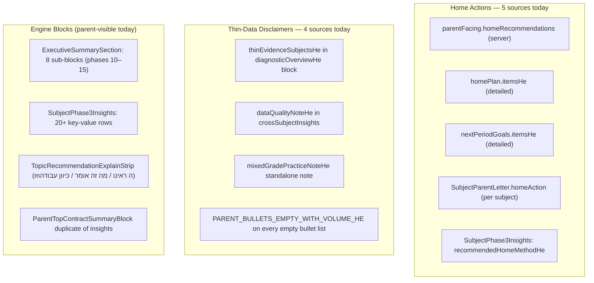

# Parent Report Structure Restructuring Plan

## Context

Two audits (this chat + `docs/audits/HEBREW_LEARNING_PLATFORM_INDEPENDENT_AUDIT_20260529_k9m3r7.md`) identify the same core problem: the parent report has 5–8 overlapping home-action channels, per-subject AND per-topic AND per-cross-subject thin-data disclaimers repeated everywhere, and engine-diagnostic jargon blocks rendered at the same visual level as parent-facing summaries.

No engine logic, server calculations, Hebrew copy, DB, or CSS will change. Only the render order and conditional rendering inside the two page files and two surface components change.

---

## Current Duplicate Content Map (What Gets Fixed)



---

## Target Render Order

### Short Report — `/learning/parent-report.js`

| Slot | Section | Content Source | Change |
|------|---------|----------------|--------|
| 1 | Metrics | `report.summary` stats | Keep as-is |
| 2 | Data Health | `thinEvidenceSubjectsHe`, `notPracticedSubjectsSummaryHe`, `mixedGradePracticeNoteHe` | **NEW** consolidated block (currently scattered) |
| 3 | What to Notice | `parentFacing.insights` via `ParentReportParentSections` (insights only) + `diagnosticOverviewHe.mainFocusAreaLineHe` | Keep; suppress `rawMetricStrengthsHe` block (moves into subject summary) |
| 4 | Teacher Messages | `parentFacing.teacherMessages` via `ParentReportParentSections` | Keep |
| 5 | What to Do at Home | `parentFacing.homeRecommendations` via `ParentReportParentSections` (recs only) | Keep; `ParentReportShortContractPreview` (`doNowHe`) suppressed (duplicate) |
| 6 | By-Subject Grid | 6 subject cards with questions/accuracy | Keep; add `rawMetricStrengthsHe` here |
| 7 | Detailed Tables | Per-subject operation/topic rows | Keep |
| 8 | Charts | Daily activity | Keep |
| 9 | AI / Copilot | `ParentReportInsight`, Copilot | Keep |
| 10 | Disclaimer | `ParentReportImportantDisclaimer` | Keep |

### Detailed Report — `/learning/parent-report-detailed.js`

| Slot | Section Title (new) | Content Source | Change |
|------|---------------------|----------------|--------|
| 1 | Navigation + Copilot | — | Keep |
| 2 | AI Explanation | `ParentReportInsight` | Keep |
| 3 | **Quick Summary** (rename: "מה עשינו בתקופה הזאת") | `overallSnapshot` metrics + subject coverage table | Keep; move grade-mix note here |
| 4 | **Data Health** | `thinEvidenceSubjectsHe`, `dataQualityNoteHe`, `mixedGradePracticeNoteHe`, `notPracticedSubjectsSummaryHe` | **NEW** consolidated block — remove from their current scattered locations |
| 5 | **What to Notice** | `parentFacing.insights` (server) + `crossSubjectInsights.bulletsHe` deduplicated | Merge "מה שחוזר בכמה מקצועות" INTO this block; remove as separate section |
| 6 | **Teacher Messages** | `parentFacing.teacherMessages` | Keep from `ParentReportParentSections` |
| 7 | **What to Do at Home** | `parentFacing.homeRecommendations` deduplicated with `dedupeParentVisibleLines` | Remove `SectionCard("רעיונות קצרים לבית")` and `SectionCard("כיוון לימים הבאים")` as standalone sections |
| 8 | **By-Subject Details** (summary or full mode) | Per-subject: metrics + `SubjectParentLetter` opening+diagnosis only | Move `homeAction` out; suppress inside subject card |
| 9 | **Collapsed Technical Details** | `ExecutiveSummarySection`, `SubjectPhase3Insights`, `TopicRecommendationExplainStrip`, contract blocks | Wrap existing sections in a `<details>` / collapsed accordion; not removed, just not default-open |
| 10 | Disclaimer | `ParentReportImportantDisclaimer` | Keep |

---

## Exact Files to Change

### Primary Page Files

- [`pages/learning/parent-report.js`](pages/learning/parent-report.js) — ~4150 lines
  - Suppress `ParentReportShortContractPreview` (line 2001) when `parentFacing.homeRecommendations` has content (avoids duplicating `doNowHe`)
  - Suppress the inline `rawMetricStrengthsHe` block (lines 2003–2014); move those lines into the per-subject grid section instead
  - Move `thinEvidenceSubjectsHe` (lines 2060–2065) out of `diagnosticOverviewHe` block into a new top-level `DataHealthNote` inline block above the subject grid
  - Move `mixedGradePracticeNoteHe` (currently at bottom of detailed page, exists here too) into `DataHealthNote`

- [`pages/learning/parent-report-detailed.js`](pages/learning/parent-report-detailed.js) — ~1854 lines
  - **Remove** `SectionCard("סיכום להורה")` block (lines 1536–1540, `ParentTopContractSummaryBlock`) — its content duplicates insights/homeRecs
  - **Merge** `SectionCard("מה שחוזר בכמה מקצועות")` (lines 1782–1791) into the new "What to Notice" section; remove as standalone
  - **Remove** `SectionCard("רעיונות קצרים לבית")` (lines 1793–1799) as standalone section; its content (`homePlanItemsForUi`) feeds the single home-action block
  - **Remove** `SectionCard("כיוון לימים הבאים")` (lines 1801–1807) as standalone section; deduplicate into home-action block
  - **Rename and consolidate** "What to Do at Home" — render as a single `SectionCard` fed by `dedupeParentVisibleLines([...homePlanItemsForUi, ...nextGoalsItemsForUi])` under `parentFacing.homeRecommendations`
  - **Wrap** `SectionCard("סיכום לתקופה")` (line 1543, `ExecutiveSummarySection`) in a collapsible `<details>` element — keep all content, just collapsed by default
  - **Add** `DataHealthNote` inline block between "Quick Summary" and "What to Notice" (collects `dataQualityNoteHe`, `thinEvidenceSubjectsHe`, `mixedGradePracticeNoteHe`)
  - Move `{payload.gradePracticeMeta.mixedGradePracticeNoteHe}` (line 1809–1813) into `DataHealthNote`

### Surface Component Files

- [`components/parent-report-detailed-surface.jsx`](components/parent-report-detailed-surface.jsx) — `SubjectPhase3Insights`
  - Wrap the entire `<div className="pr-detailed-phase3-dl ...">` rows block in a `<details>` with a summary label — it stays in the DOM but is collapsed by default
  - This suppresses the 20+ key-value engine rows from default view without removing any functionality

- [`components/parent/ParentReportParentSections.jsx`](components/parent/ParentReportParentSections.jsx) — no change needed; already has the correct 3-section structure. The plan uses it as the sole authority for insights + homeRecs + teacherMessages.

### Components to Keep Unchanged (Authority Sources)

- [`components/parent-report-contract-ui-blocks.jsx`](components/parent-report-contract-ui-blocks.jsx) — `ParentSubjectContractSummaryBlock` stays in subject detail (inside the collapsed technical section)
- [`components/parent-report-short-contract-preview.jsx`](components/parent-report-short-contract-preview.jsx) — suppress rendering on short report when `parentFacing.homeRecommendations` has items
- [`components/ParentReportImportantDisclaimer.js`](components/ParentReportImportantDisclaimer.js) — keep as-is
- [`lib/parent-server/parent-report-parent-facing.server.js`](lib/parent-server/parent-report-parent-facing.server.js) — no change
- All `utils/parent-report-*.js` engine files — no change
- All `lib/parent-server/` server files — no change

---

## Content Source Map (Single Source of Truth)

| Content Type | Authoritative Source | All Other Occurrences |
|---|---|---|
| Home recommendations | `parentFacing.homeRecommendations` (server) | Remove `homePlan.itemsHe` standalone block; remove `nextPeriodGoals.itemsHe` standalone block; suppress `SubjectParentLetter.homeAction` from default-visible area |
| Insights / what to notice | `parentFacing.insights` (server) | Suppress `ParentTopContractSummaryBlock` (duplicates insights); suppress `rawMetricStrengthsHe` block from insight zone |
| Cross-subject patterns | `crossSubjectInsights.bulletsHe` | Merge into "What to Notice" alongside `parentFacing.insights`; remove as standalone section |
| Thin-data / data health | `thinEvidenceSubjectsHe`, `dataQualityNoteHe`, `mixedGradePracticeNoteHe` | One `DataHealthNote` block; suppress inline occurrences |
| Teacher messages | `parentFacing.teacherMessages` | Keep in `ParentReportParentSections` |
| Subject-level diagnosis | `SubjectParentLetter.opening` + `.diagnosisHe` | Keep; suppress `.homeAction` from default view |
| Engine/diagnostic details | `ExecutiveSummarySection`, `SubjectPhase3Insights`, `TopicRecommendationExplainStrip` | Wrap in `<details>` collapsed; not removed |

---

## Approved Hebrew Labels (Owner-Confirmed)

| Use | Exact string |
|-----|-------------|
| DataHealthNote section title | `מצב הנתונים בדוח` |
| Collapsed technical details accordion label | `פירוט נוסף למי שרוצה להעמיק` |
| Collapsed subject technical details accordion label | `פירוט מקצועי נוסף` |
| What to Notice section title | `מה חשוב לדעת` (already used in `ParentReportParentSections`) |
| What to Do at Home section title | `מה מומלץ לעשות בבית` (already used in `ParentReportParentSections`) |

No other Hebrew copy may be added, changed, or rewritten.

---

## Home Recommendations — Exact Behavior (Correction Applied)

- **Default visible**: `parentFacing.homeRecommendations` (server) is the **sole** source rendered in the "What to Do at Home" section.
- **Fallback**: If `parentFacing.homeRecommendations` is empty, render `homePlanItemsForUi` (from the existing `dedupeParentVisibleLines` of `homePlan.itemsHe`) as a fallback.
- **Collapsed technical section**: `homePlanItemsForUi` and `nextGoalsItemsForUi` are moved there so they remain accessible but are not visible by default when server recs exist.
- **No blending**: The default visible block must contain items from exactly one source at a time. Do not merge `homeRecommendations` + `homePlan` + `nextGoals` into a single deduplicated visible list.

---

## Thin-Data Acceptance Criteria Scope (Correction Applied)

"No repeated thin-data disclaimers" applies to the **default parent-visible rendered output** only. Collapsed `<details>` sections may contain engine-level disclaimers without violating this criterion.

---

## Risks

- **Print/PDF regression**: `<details>` element is collapsed by default; the print stylesheet (currently very detailed in `parent-report-detailed.js` `<style>`) may need a `@media print { details { display: block; } }` rule to ensure the technical block appears in printed output. This must be verified.
- **`dedupeParentVisibleLines` boundary**: The existing deduplication helper (already in `parent-report-detailed.js`) is used to merge `homePlan` + `nextGoals` + `topContract` lines. Adding `parentFacing.homeRecommendations` into the same dedup pass could drop valid non-duplicate recs. The implementation must dedupe carefully, keeping the server recs as authoritative and only deduping the other sources against them.
- **`ParentReportShortContractPreview` suppression condition**: Currently renders if `shortContractTop` exists. The new condition (suppress when `parentFacing.homeRecommendations.length > 0`) changes when a non-null contract is suppressed. If a user has a contract but no server recs, the contract would still show. The condition logic needs to be exact.
- **`SubjectParentLetter.homeAction` visibility**: Removing it from default view inside `SubjectSummaryBlock` / the full subject block affects both full and summary print modes. It should remain inside the `<details>` collapsed section for the full mode, but must not appear in the summary print mode alongside the central home-action block.
- **Detailed report `crossSubjectInsights.dataQualityNoteHe`**: Currently rendered after `Bullets` at lines 1788–1790. This moves to the `DataHealthNote` block. The `bulletsHe` from `crossSubjectInsights` stays in "What to Notice" but the quality note moves out.

---

## Acceptance Criteria

1. **No duplicated home actions in default view**: `parentFacing.homeRecommendations` is the only home-action block visible by default. `SectionCard("רעיונות קצרים לבית")` and `SectionCard("כיוון לימים הבאים")` do not render as standalone sections.
2. **No repeated thin-data disclaimers in default view**: The phrase "עדיין אין מספיק" / "נתונים מצומצמים" appears only in the `DataHealthNote` block. Collapsed `<details>` sections may retain legacy disclaimers.
3. **No internal diagnostic jargon in default view**: Terms like `"אירועי טעות רלוונטיים"`, `"מגמת הדיוק"`, `"כיוון לרצף"`, `"זיכרון תומך"`, `"התאמה צפי-מול-נצפה"` must not appear outside the collapsed technical section.
4. **`ExecutiveSummarySection` sub-blocks are collapsed by default**: Phases 10–15 content is in the DOM but not visible without user interaction.
5. **`SubjectPhase3Insights` rows collapsed by default**: The 20+ key-value diagnostic rows are inside `<details summary="פירוט מקצועי נוסף">` and not default-open.
6. **Print/PDF behavior**: Verified manually in browser print preview; `@media print` rule added only if confirmed to expand `<details>` elements.

---

## Tests to Run After Implementation

```bash
# Build verification
npm run build

# Report engine integrity (must not regress)
node scripts/tests/diagnostic-report-truth-fix-unit.mjs
node scripts/tests/diagnostic-report-bundle-self-check.mjs
node scripts/tests/report-synchronization-closure.mjs

# Snapshot/UI tests (if available)
node scripts/parent-report-final-product-verify.mjs
node scripts/parent-report-output-integrity.mjs

# Manual browser checks
# 1. Load /learning/parent-report with 0 answers — verify DataHealthNote appears, no insights
# 2. Load /learning/parent-report with 5 answers in math — verify single home-action block
# 3. Load /learning/parent-report-detailed — verify ExecutiveSummarySection collapsed
# 4. Print /learning/parent-report-detailed — verify collapsed sections open
# 5. Teacher preview /teacher/student/[id]/parent-report — verify same structure
```
