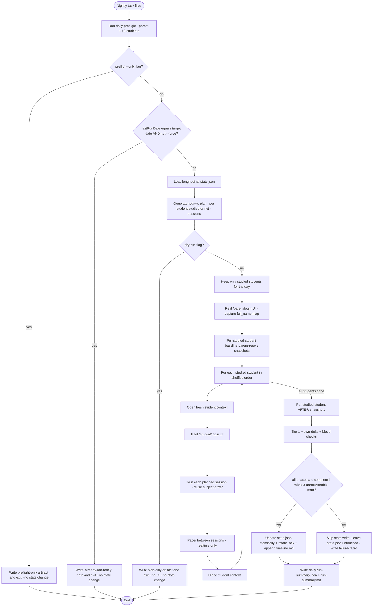

# Phase D2 — Scheduled Daily Real Learning Simulator

## 1. Goal

Reuse every Phase A–D real-UI primitive (`/student/login`, `/parent/login`, `/learning/*`, `/api/learning/{session/start,answer,session/finish}`, dashboard click → "דוח הורים") and add a daily-cadence orchestrator that:

- Runs against Vercel (`VIRTUAL_STUDENT_BASE_URL=https://liosh-website.vercel.app` by default) so it produces real persisted student activity over real calendar days.
- Reads/writes a longitudinal state file outside the repo so today's plan reflects yesterday's behavior.
- Supports two execution modes: `realtime` (paced, overnight) and `fast` (smoke / debug).
- Is launched nightly by Windows Task Scheduler.

No product UI / Hebrew copy / diagnostic logic / parent-report logic / Supabase schema changes. No fake DB rows, no fake timestamps, no localStorage as truth, no `--phase d` style API shortcuts.

## 2. Preflight gate (blocks every daily run on failure)

Before any student studies, the runner runs a `daily-preflight` step that hard-fails the day with a clear error if ANY of the following is not satisfied:

- Parent (`admin@admin.com`) can log in via real `/parent/login` UI.
- The dashboard's `/api/parent/list-students` returns AT LEAST the 12 AAA students. Extras are allowed and must not fail the run; the runner only verifies that AAA1..AAA12 are all present in the returned list (matched by `login_username`).
- Each AAA1..AAA12 is found by `login_username` in that list, has a non-empty `full_name`, and has a non-empty `grade_level`.
- Each AAA1..AAA12 can log in through real `/student/login` UI (one quick login + `/api/student/me` round-trip per student, in a fresh context, then context closed).

The day's longitudinal state is not advanced if preflight fails. The error includes the exact missing label(s) and the remediation hint ("create the missing student under admin@admin.com on the same Supabase project that backs Vercel"). The preflight check can be invoked standalone via `--preflight-only` (see §6) without driving any learning sessions or advancing state.

## 3. Files to create

- [scripts/virtual-student-qa/scenarios/student-personas.mjs](scripts/virtual-student-qa/scenarios/student-personas.mjs) — Static persona table for AAA1..AAA12: `consistency` (P[study|day]), `defaultProfile`, `weaknesses` (e.g. `{geometry:'targeted'}`), `strengths`, `evolution` (`flat|improving|declining|inconsistent`), `dailyMinutesRange` (e.g. `[20,40]`), `subjectRotationWeights`. Owner-tunable; the values match the 12-student spec from your message.
- [scripts/virtual-student-qa/lib/longitudinal-state.mjs](scripts/virtual-student-qa/lib/longitudinal-state.mjs) — Loads / saves `state.json` from the configurable state dir; rotates `state.json.bak`; appends to `timeline.md`. Schema: `{ version, lastRunDate, lastRunStatus, students: { [label]: { evolutionPhase, evolutionMomentum, attendance:[...], performance:{ [subject]:{totalAnswered,totalCorrect,recent7Days,recent30Days} } } } }`.
- [scripts/virtual-student-qa/lib/daily-plan-generator.mjs](scripts/virtual-student-qa/lib/daily-plan-generator.mjs) — Pure function. Inputs: `(state, date, mode, personas)`. Output: per-student `{ studied:boolean, sessions:[{subject,profile,topic,questionCount,intendedMinutes}] }`. Deterministic for `(state, date)` so reruns of the same date give the same plan, but `state` evolves so different dates differ. Uses date-derived RNG seeded with `state.students[label].evolutionMomentum` so improving personas drift profiles over weeks.
- [scripts/virtual-student-qa/lib/realtime-pacer.mjs](scripts/virtual-student-qa/lib/realtime-pacer.mjs) — Per-question think delay, between-session cool-down, polite Vercel gap between students. Single `pacerScale` knob; `realtime`=1.0, `fast`=0.0, env override `VIRTUAL_STUDENT_DAILY_PACER_SCALE`.
- [scripts/virtual-student-qa/lib/phase-d2-orchestrator.mjs](scripts/virtual-student-qa/lib/phase-d2-orchestrator.mjs) — Sequential per-student daily runner. Each studied student gets one fresh browser context, real UI login, then 1–3 paced sessions (each session re-uses the existing subject driver), then close context. After all studied students: snapshot AFTER reports per studied student. Cross-student bleed check identical to Phase D's classifier. Updates state at the very end (atomic write + `.bak` rotation).
- [scripts/virtual-student-qa/lib/daily-preflight.mjs](scripts/virtual-student-qa/lib/daily-preflight.mjs) — The four-check preflight gate from §2.
- [scripts/virtual-student-qa/scripts/run-nightly.ps1](scripts/virtual-student-qa/scripts/run-nightly.ps1) — PowerShell wrapper that loads env from a user-private file, sets cwd to repo root, runs `node scripts/virtual-student-qa/run.mjs --phase d2 --mode realtime`, and tee-logs to `reports/virtual-student-daily/YYYY-MM-DD/scheduler.log`.
- [scripts/virtual-student-qa/docs/SCHEDULER-SETUP.md](scripts/virtual-student-qa/docs/SCHEDULER-SETUP.md) — One-shot `schtasks /Create` command + the `.env.virtual-student-qa` file format the owner needs to create once. No GUI clicking required.
- [scripts/virtual-student-qa/scenarios/phase-d2-suite.mjs](scripts/virtual-student-qa/scenarios/phase-d2-suite.mjs) — Wraps the planner output into the existing `scenario` shape the subject drivers already accept (subject, profile, questionCount, rng, pickAnswer for math/geometry).

## 4. Files to change

- [scripts/virtual-student-qa/run.mjs](scripts/virtual-student-qa/run.mjs) — Add `--phase d2` route, `--mode realtime|fast`, `--date YYYY-MM-DD`, `--dry-run`. Reuse the same dev-mode HMR console-error suppression rule already in place. New `mainPhaseD2`, `finalizePhaseD2`, `buildPhaseD2Markdown`, `buildPhaseD2FailureRepro`.
- [scripts/virtual-student-qa/lib/artifacts.mjs](scripts/virtual-student-qa/lib/artifacts.mjs) — Add `makeDailyArtifacts({ date })` helper that writes under `reports/virtual-student-daily/YYYY-MM-DD/` instead of `reports/virtual-student-qa/{runId}/`. The longitudinal state writer is owned by `longitudinal-state.mjs`, NOT this module, because state lives outside the repo.
- [scripts/virtual-student-qa/lib/config.mjs](scripts/virtual-student-qa/lib/config.mjs) — Add `resolveStateDir()` (default `%LOCALAPPDATA%\liosh-qa\virtual-student-state` on Windows, `~/.local/share/liosh-qa/virtual-student-state` elsewhere), `resolveDailyMode()`, `resolveDailyDate()` (today's local date in `Asia/Jerusalem`).
- [.gitignore](.gitignore) — Add `reports/virtual-student-daily/` and `reports/virtual-student-longitudinal/` even though state lives outside the repo, because daily artifacts (screenshots) ARE under the repo.

## 5. Env variables

Existing (unchanged):

- `VIRTUAL_STUDENT_ACCOUNTS` — JSON `[{label,username,pin}, ...]` for all 12 AAA students. PIN `1234` for every student.
- `E2E_PARENT_EMAIL=admin@admin.com`, `E2E_PARENT_PASSWORD=...` — password env-only.
- `VIRTUAL_STUDENT_PARENT_AUTH=ui` (default), `VIRTUAL_STUDENT_STUDENT_AUTH=ui` (default).
- `VIRTUAL_STUDENT_BASE_URL=https://liosh-website.vercel.app` — Vercel target.

New (Phase D2):

- `VIRTUAL_STUDENT_DAILY_MODE=realtime|fast` — overridden by `--mode`.
- `VIRTUAL_STUDENT_DAILY_DATE=YYYY-MM-DD` — overridden by `--date`.
- `VIRTUAL_STUDENT_DAILY_STATE_DIR` — state file directory; default `%LOCALAPPDATA%\liosh-qa\virtual-student-state`.
- `VIRTUAL_STUDENT_DAILY_MAX_MINUTES=480` — overall hard cap (8 h).
- `VIRTUAL_STUDENT_DAILY_PACER_SCALE=1.0` — multiplier for human-like pauses; overrides per-mode default.
- `VIRTUAL_STUDENT_DAILY_DRY_RUN=1` — generates today's plan, writes plan-only artifact, no UI execution, no state advancement.
- `VIRTUAL_STUDENT_DAILY_PREFLIGHT_ONLY=1` — runs preflight (parent login + 12 student logins + linkage check) only; no plan generation, no learning sessions, no state advancement.
- `VIRTUAL_STUDENT_DAILY_FORCE=1` — bypass the same-day idempotency check; intentional reruns of a partial/failed date after fixing an issue. Without this flag, idempotency prevents duplicate same-day persisted activity.

## 6. CLI commands

```
node scripts/virtual-student-qa/run.mjs --phase d2 --mode realtime
node scripts/virtual-student-qa/run.mjs --phase d2 --mode fast
node scripts/virtual-student-qa/run.mjs --phase d2 --mode fast --dry-run
node scripts/virtual-student-qa/run.mjs --phase d2 --mode fast --date 2026-05-22
node scripts/virtual-student-qa/run.mjs --phase d2 --preflight-only
node scripts/virtual-student-qa/run.mjs --phase d2 --mode fast --date 2026-05-22 --force
```

Flag semantics (kept narrow on purpose so the operator never accidentally produces fake activity):

- `--dry-run`: emit today's plan as a plan-only artifact, drive NO UI, advance NO state. Safe to run any time. Useful to inspect what would happen tonight.
- `--preflight-only`: drive only the four-check preflight from §2 (parent login + 12 student logins + linkage). NO plan generation, NO learning sessions, NO state advancement.
- `--force`: explicit operator opt-in to bypass the same-day idempotency check (§16). Required to rerun a date whose `lastRunStatus` is already recorded for that date. Without `--force`, a same-day rerun exits early with `already-ran-today` and changes nothing.
- `--date YYYY-MM-DD`: target date; defaults to today's date in `Asia/Jerusalem`. Must be combined with `--force` if that date already has a recorded run, otherwise the idempotency check refuses.

No npm scripts in this phase (Phase E).

## 7. Vercel base URL handling

`config.mjs` already resolves base URL with this precedence: explicit `--base-url` → `PLAYWRIGHT_BASE_URL` → `VIRTUAL_STUDENT_BASE_URL` → `E2E_BASE_URL` → port-derived → localhost. For Phase D2 the canonical setup is:

```
VIRTUAL_STUDENT_BASE_URL=https://liosh-website.vercel.app
```

Safety: if Phase D2 is launched with `--mode realtime` against a `127.0.0.1` / `localhost` URL, the runner emits a single `[phase-d2] WARN: realtime mode is pointing at a non-Vercel URL ...` line so the operator notices accidental dev-target nightly runs. It does not refuse — fast/realtime against localhost is still useful for development.

## 8. Windows Task Scheduler setup

Approach: one PowerShell wrapper, registered once via `schtasks`. No GUI.

- Owner creates a private env file (NOT in git) at `%USERPROFILE%\Documents\liosh-qa\.env.virtual-student-qa` containing the secrets (`VIRTUAL_STUDENT_ACCOUNTS`, `E2E_PARENT_EMAIL`, `E2E_PARENT_PASSWORD`, `VIRTUAL_STUDENT_BASE_URL`).
- `run-nightly.ps1` sources that file, sets cwd to repo root, runs the node command, and tee-logs.
- Registration command (documented in `SCHEDULER-SETUP.md`):

```
schtasks /Create /SC DAILY /TN "LIOSH Virtual Student QA Nightly" ^
  /TR "powershell.exe -ExecutionPolicy Bypass -File C:\path\to\repo\scripts\virtual-student-qa\scripts\run-nightly.ps1" ^
  /ST 22:30 /RL LIMITED
```

- Trigger: daily 22:30 local.
- Execution-time-limit: 8 hours (Task Scheduler's hard cap, also enforced inside the runner via `VIRTUAL_STUDENT_DAILY_MAX_MINUTES`).
- "Start the task only if the user is logged on" so the secrets file is readable.
- Idempotency: the daily run reads `state.lastRunDate` first; if it equals the target date AND the operator did NOT pass `--force`, the runner exits early with `already-ran-today` and writes a tiny artifact note rather than duplicating activity. `--force` is required to rerun a partial/failed date after fixing an issue.

## 9. Daily artifact structure

```
reports/virtual-student-daily/YYYY-MM-DD/
  run-summary.json         (full machine-readable record for the day)
  run-summary.md           (human review; see §16)
  scheduler.log            (raw stdout/stderr captured by run-nightly.ps1)
  state-snapshot.json      (copy of longitudinal state AFTER this day; for audit only)
  screenshots/
    s00-parent-auth.png
    s01-AAA1-baseline-populated.png
    s01-AAA1-after-populated.png
    s01-AAA1-session1-math-q1.png      (one snapshot per session per student, not per question)
    s01-AAA1-session2-hebrew-q1.png
    99-final-parent-dashboard.png
  logs/
    AAA1-day.log           (combined log for that student's day)
    AAA2-day.log
    parent.log             (parent-side dashboard / report navigation)
```

## 10. Longitudinal state structure (outside repo)

Default location: `%LOCALAPPDATA%\liosh-qa\virtual-student-state\`. Owner-overridable via `VIRTUAL_STUDENT_DAILY_STATE_DIR`.

```
<stateDir>/
  state.json               (live; canonical input for next day)
  state.json.bak           (yesterday's; rotated atomically before save)
  timeline.md              (append-only Markdown — one row per day per studied student)
```

`state.json` schema (illustrative):

```jsonc
{
  "version": 1,
  "createdAt": "2026-05-22",
  "lastRunDate": "2026-05-22",
  "lastRunStatus": "pass",
  "students": {
    "AAA6": {
      "persona": "grade3-improving",
      "evolutionPhase": "climbing",
      "evolutionMomentum": 0.34,
      "attendance": [
        {"date":"2026-05-15","studied":true,"sessions":2,"minutes":34,"answered":18},
        {"date":"2026-05-16","studied":false,"sessions":0,"minutes":0,"answered":0}
      ],
      "performance": {
        "math":{"totalAnswered":120,"totalCorrect":78,"recent7Days":{"answered":24,"correct":17}},
        "hebrew":{"totalAnswered":48,"totalCorrect":29,"recent7Days":{"answered":12,"correct":8}}
      }
    }
  }
}
```

## 11. Realtime mode

- Per-question think time: random in `[2s, 12s]`, mean ~4s, weighted toward middle.
- Between-session pause for the same student: `[3min, 25min]`.
- Between-students: `[30s, 3min]` (polite spacing, also reduces Vercel burst).
- Sequential only: at most one active student context at a time. No concurrency.
- Total wall-clock: bounded by `VIRTUAL_STUDENT_DAILY_MAX_MINUTES` (default 480 = 8 h). If the budget would be exceeded, remaining sessions for the day are deferred (recorded in state as `deferred`); the day's status becomes `partial`.

## 12. Fast (smoke) mode

- Per-question think time: 100 ms.
- Between-session pause: 0.
- Between-students: 2 s (kept non-zero to avoid Vercel pile-up).
- Same plan, same evidence requirements, same state updates as realtime.
- Used for: developer testing, post-deploy smoke, or to "catch up" if a nightly run was missed (the operator runs `--mode fast --date YYYY-MM-DD` for the missed date; state advances correctly).

## 13. Student personas (AAA1..AAA12)

Owner-tunable constants in [scripts/virtual-student-qa/scenarios/student-personas.mjs](scripts/virtual-student-qa/scenarios/student-personas.mjs).

- AAA1, grade 1, "strong-consistent": consistency 0.90, defaultProfile `strong`, no targeted weakness, evolution `flat`, dailyMinutes [20, 40].
- AAA2, grade 1, "weak-hebrew": consistency 0.55, defaultProfile `average`, weakness `{hebrew:'targeted'}`, evolution `flat`, dailyMinutes [10, 25].
- AAA3, grade 2, "average-stable": consistency 0.85, defaultProfile `average`, no targeted weakness, evolution `flat`, dailyMinutes [25, 45].
- AAA4, grade 2, "weak-math": consistency 0.70, defaultProfile `average`, weakness `{math:'targeted'}`, evolution `flat`, dailyMinutes [20, 40].
- AAA5, grade 3, "geometry-targeted": consistency 0.90, defaultProfile `average`, weakness `{geometry:'targeted'}`, evolution `flat`, dailyMinutes [30, 50].
- AAA6, grade 3, "improving": consistency 0.75, defaultProfile starts `weak`, evolution `improving` (drifts to `average` over ~3 weeks, `strong` over ~6 weeks), dailyMinutes [25, 45].
- AAA7, grade 4, "weak-english": consistency 0.85, defaultProfile `average`, weakness `{english:'targeted'}`, evolution `flat`, dailyMinutes [30, 55].
- AAA8, grade 4, "inconsistent": consistency 0.30, defaultProfile `average`, evolution `inconsistent` (profile randomly `strong` or `weak` per studied day), dailyMinutes [0, 35].
- AAA9, grade 5, "strong-math-weak-hebrew": consistency 0.85, defaultProfile `strong`, weakness `{hebrew:'targeted'}`, strengths `[math]`, evolution `flat`, dailyMinutes [35, 60].
- AAA10, grade 5, "weak-science": consistency 0.70, defaultProfile `average`, weakness `{science:'targeted'}`, evolution `flat`, dailyMinutes [25, 50].
- AAA11, grade 6, "strong-persistent": consistency 0.95, defaultProfile `strong`, evolution `flat`, dailyMinutes [60, 90], with absolute cap 120 enforced by the planner.
- AAA12, grade 6, "declining": consistency 0.45, defaultProfile starts `average`, evolution `declining` (drifts to `weak` over ~5 weeks), dailyMinutes [10, 30].

## 14. How profiles evolve over time

In `longitudinal-state.mjs`, each student carries `evolutionPhase` and `evolutionMomentum`:

- `flat` personas: profile fixed; momentum stays 0.
- `improving` personas: each studied day adds momentum proportional to that day's accuracy delta vs the persona's running mean. When momentum crosses defined thresholds (e.g. ≥0.30 → `climbing`, ≥0.65 → `plateau`, ≥0.85 → `strong-stable`), the next day's `defaultProfile` upgrades one rung (`weak` → `average` → `strong`).
- `declining` personas: same machinery, opposite sign.
- `inconsistent` personas: per-day RNG flips between `strong` and `weak`; momentum unused.

The planner uses `defaultProfile` from state (not from the persona file directly) for the per-day session profile selection, with weaknesses always overriding to `targeted` for those subjects.

## 15. Subject rotation

- Catalog: math, geometry, hebrew, english, science, moledet-geography (same six as Phase C).
- Daily choice: 1–3 subjects per studied student, weighted:
  - Targeted-weakness subjects: appear ~60% of studied days.
  - Strength subjects: ~40% of studied days.
  - Other subjects: rotation, with a soft "no same subject 3 days running unless weakness" rule.
- A single day for a student typically yields 1–2 sessions (one main subject + maybe a short follow-up). The "most persistent" student (AAA11) can yield up to 3.

## 16. Daily flow



## 17. PASS / PARTIAL / FAIL for a day

PASS: every studied-today student completed every planned session, every per-student `tier1.passed === true`, every own-subject delta matched expected, no bleed findings, parent dashboard count stable (≥12 with all AAA labels found), parent auth not partial, no gating console errors, longitudinal state saved and `.bak` rotated.

PARTIAL: any of: a single student's session ended with a known earlyExit (e.g. Hebrew audio skip), one studied student failed cleanly while ≥half succeeded, hard-time cap hit and remaining sessions deferred, dev-mode HMR fetch error appeared (suppressed by the existing rule), or token-mode parent auth was used.

FAIL: any of: preflight failed, parent auth failed, Vercel returned a 5xx on a required `/api/learning/*` endpoint, cross-student bleed detected, longitudinal state could not be saved, or more than half of scheduled-to-study students failed.

State-advancement safety (overrides everything above): the longitudinal `state.json` is NEVER written until ALL of these have completed in this exact order: (a) every planned student session finished, (b) parent AFTER snapshots succeeded for every studied student, (c) parent-report DOM assertions ran for every studied student, (d) cross-student bleed checks ran. If any of (a)–(d) cannot be reached for any reason — including process kill, unhandled exception, or hard-time cap — the runner does NOT advance state, leaves `state.json.bak` untouched, and writes the failure-repro artifact only. A FAIL day therefore leaves the canonical state exactly as it was at the start of the run, which means the operator can safely rerun the same date with `--force` after fixing the underlying issue.

The day's status drives `lastRunStatus`, which informs the next day's idempotency check and the timeline entry.

## 18. Vercel safety / load shaping

- Hard concurrency: 1 student context at a time, no exceptions.
- Polite gap between students (§11/§12).
- Per-day request envelope (worst case, full studied set): about ~12 × 25 `/api/learning/answer` POSTs (~300), plus ~24 session start/finish, plus ~30 dashboard / report-data fetches. Well under any reasonable Vercel + Supabase quota.
- Backoff: on `429` from Vercel, sleep 60 s and retry once; on a second `429`, mark the current student `fail` and continue with the next. The day's status downgrades accordingly.
- "Most persistent student" cap (AAA11): hard ceiling 120 minutes per day enforced by the planner, regardless of momentum.
- Refusal to multi-run within a day: the idempotency check in §16 ensures a manually re-launched task does not double up persisted activity for the same date.

## 19. Reports — progress and delta over days

`run-summary.md` per day includes:

- A "since yesterday" section per studied student: minutes today, answered today, accuracy today vs accuracy yesterday vs accuracy 7-day rolling.
- A "delta on parent dashboard" block (target subject delta should equal that student's `/api/learning/answer` count for the day; bleed table identical to Phase D).
- A persona snapshot: current `evolutionPhase`, current `defaultProfile`, weaknesses still targeted.
- A "skipped today" block: students whose attendance roll said no — with the persona consistency that drove the decision.

`timeline.md` (single file, append-only): one row per studied student per day containing date, label, sessions count, minutes, subjects, accuracy. Easy to skim weeks at a time without opening every daily folder.

## 20. What the owner should expect to see

After 1 day:

- The parent dashboard reflects exactly the activity from today's plan and nothing more. Some students legitimately did not study (per-persona consistency); the daily report enumerates them with reasons.
- `state.json` has its first entry under each AAA student, attendance length 1.

After 1 week:

- `timeline.md` has ~7 rows per studied student. AAA8 (`consistent=0.30`) shows clearly fewer rows than AAA11 (`0.95`) — the inconsistency is observable in the artifact, not faked.
- Per-subject totals on each parent report match the cumulative `/api/learning/answer` count from the runner's logs. AAA5's geometry total leads their other subjects; AAA9's hebrew totals lag their math totals; AAA11's totals dominate.

After 1 month:

- AAA6 (`improving`) has visibly higher recent-7-day accuracy than their first-week accuracy on the parent report. AAA12 (`declining`) shows the inverse.
- AAA2's hebrew accuracy stays distinctly below their math accuracy; AAA4's math, AAA5's geometry, AAA7's english, AAA10's science all show the same shape.
- The product's parent-side recommendations / insights respond to those patterns (no runner change touches that logic; we only feed real activity to it).

## 21. What the runner will NOT do

- No fake DB rows, no fake timestamps, no API mocks.
- No localStorage as truth.
- No bypass of `/student/login` or `/parent/login`.
- No product UI / Hebrew copy / diagnostic / parent-report / Supabase schema changes.
- No npm scripts (Phase E).
- No multi-parent scenarios (single QA parent).
- No introduction of new subject pages.
- No concurrent student contexts.
- No nightly runs longer than `VIRTUAL_STUDENT_DAILY_MAX_MINUTES`.

## 22. Validation gates before declaring D2 done

Order matters; each gate must pass before the next is run.

1. Fast-mode dry-run against localhost: planner emits a sane plan; preflight passes; no UI driven.
2. Fast-mode full run against localhost (same Supabase): one studied set, parent dashboard updated, state.json created.
3. Fast-mode full run against Vercel: one studied set, parent dashboard updated, no Vercel 5xx.
4. Realtime full run against Vercel during a chosen evening, owner watching: completes in expected wall-clock window, paced, parent dashboard updated.
5. Owner enables Windows Task Scheduler entry from `SCHEDULER-SETUP.md`. Three observation nights pass before any persona tuning.

If any gate fails, stop and surface the failure repro before tuning anything else.

## 23. Implementation slices (gated)

D2 ships in six gated slices. Each slice ends with a stop-and-report; the next slice does not begin until the operator approves the previous slice's artifacts.

- D2.1 — personas + state + planner + dry-run artifacts. Build pure-data files (`student-personas.mjs`, `longitudinal-state.mjs`, `daily-plan-generator.mjs`), wire `--phase d2 --dry-run` and `--date YYYY-MM-DD` into `run.mjs`, write a plan-only artifact under `reports/virtual-student-daily/<date>/`, and update `.gitignore`. NO UI is driven, NO state is advanced. Validation: `node scripts/virtual-student-qa/run.mjs --phase d2 --mode fast --dry-run` produces a deterministic plan-only artifact.
- D2.2 — preflight-only. Build `daily-preflight.mjs`, wire `--preflight-only` into `run.mjs`, surface structured blockers. NO learning sessions, NO state advancement. Validation: `node scripts/virtual-student-qa/run.mjs --phase d2 --preflight-only` against localhost reports parent OK + 12-of-12 students OK.
- D2.3 — fast localhost full run. Build `phase-d2-orchestrator.mjs`, `phase-d2-suite.mjs`, fast-mode `realtime-pacer.mjs`, the `--force` flag, and the daily artifact writer. State advancement gated on full completion of sessions + afters + report checks + bleed checks. Validation: fast-mode full run against localhost produces a complete daily artifact and a first `state.json`.
- D2.4 — fast Vercel full run. Add Vercel safety/load shaping (per-student spacing, `VIRTUAL_STUDENT_DAILY_MAX_MINUTES`, retry-on-429). Validation: fast-mode full run against `https://liosh-website.vercel.app` with no 5xx and parent dashboard updated.
- D2.5 — realtime Vercel run. Implement realtime pacer (per-question, between-session, between-student) and reuse the orchestrator. Validation: one realtime evening run with the owner watching, completing within the planned wall-clock window.
- D2.6 — scheduler docs/script. Author `run-nightly.ps1` and `SCHEDULER-SETUP.md`. Validation: operator registers the Task Scheduler entry and observes three nights before any persona tuning.

Within each slice, do NOT touch product UI, Hebrew copy, diagnostic logic, parent-report logic, Supabase schema, or any A-D code path unless a verified blocker is reported and approved first.