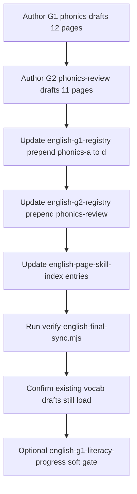

# Phase 4B Implementation Plan Document

## Goal

Create **[docs/qa/ENGLISH_G1_G2_PHASE_4B_IMPLEMENTATION_PLAN.md](docs/qa/ENGLISH_G1_G2_PHASE_4B_IMPLEMENTATION_PLAN.md)** as the sole deliverable for this phase. The document translates the approved **[docs/qa/ENGLISH_G1_G2_PHONICS_CONTENT_MAP.md](docs/qa/ENGLISH_G1_G2_PHONICS_CONTENT_MAP.md)** into an ordered execution blueprint. **No code, audio, banks, manifest, registry, or product changes.**

## Baseline to embed in Section 1

- Phase 4A content map **owner-approved**
- Diagnostic flags unchanged: `SUBSKILL=true`, `PARENT_GATING=true`, `PARENT_PROMOTION=false`
- Phase 4B planning does **not** start implementation
- Reference checkpoint: Phases 1–3C pushed per [LAUNCH_CORRECTION_PROGRESS.md](docs/qa/LAUNCH_CORRECTION_PROGRESS.md)

## Section 2 — Future execution scope

Document these workstreams (execution deferred):

| Workstream | What changes later |
|------------|-------------------|
| **G1 phonics book** | 12 new pages in 4 batches (`phonics-a`–`phonics-d`) per 4A §5 |
| **G2 phonics review** | 11 new pages in batch `phonics-review` |
| **Registry ordering** | Insert phonics batches **before** existing vocab/grammar in [english-g1-registry.js](lib/learning-book/english-g1-registry.js) and [english-g2-registry.js](lib/learning-book/english-g2-registry.js) |
| **Audio manifest** | Add `ENGLISH_G1_SECTION_AUDIO` / `ENGLISH_G2_SECTION_AUDIO` to [learning-book-audio-manifest.js](lib/learning-book/audio/learning-book-audio-manifest.js) (84 + 77 section slots) |
| **Audio assets** | MP3 under `public/audio/learning-books/english/{g1|g2}/{pageId}/section-{NN}.mp3` |
| **Practice pools** | `data/english-questions/phonics-g1.js`, `phonics-g2.js` (≥50 easy each) |
| **Generator hooks** | Route new `phonics` topic in [english-question-generator.js](utils/english-question-generator.js) |
| **Launch registry** | New `english:g1:phonics` / `english:g2:phonics` rows + `compute-launch-row.js` rules |
| **QA** | Extend existing verify/audit scripts + parent-report smoke with flags ON |

## Section 3 — File-by-file change plan

Group files with columns: **action**, **purpose**, **risk**, **Hebrew copy approval**, **audio approval**.

### Book registries (modify — medium risk)

- [lib/learning-book/english-g1-registry.js](lib/learning-book/english-g1-registry.js) — prepend 4 phonics batches; keep existing batches A–C downstream
- [lib/learning-book/english-g2-registry.js](lib/learning-book/english-g2-registry.js) — prepend `phonics-review`; shift existing A–D
- [lib/learning-book/english-book-practice-map.js](lib/learning-book/english-book-practice-map.js) — extend `ENGLISH_MASTER_TOPICS`, skill-id parsers for `english:phonics:*`
- [lib/learning-book/english-page-skill-index.js](lib/learning-book/english-page-skill-index.js) — add 23 page skill entries (generated or hand-maintained; today no generator script exists)
- **Optional (recommended):** `lib/learning-book/english-g1-literacy-progress.js` — mirror [hebrew-g1-literacy-progress.js](lib/learning-book/hebrew-g1-literacy-progress.js) soft gate pattern for G1 grammar/vocab topics

### Book drafts (create — low/medium risk, **Hebrew copy approval required**)

**G1 (12 files)** under [docs/learning-book/english/g1/drafts/](docs/learning-book/english/g1/drafts/):

`letters_upper`, `letters_lower`, `letters_match`, `letter_names`, `phonics_sounds`, `phonics_first_sound`, `classroom_words`, `first_words_simple`, `first_words_cvc`, `picture_word_match`, `listening_classroom`, `listening_commands`

**G2 (11 files)** under [docs/learning-book/english/g2/drafts/](docs/learning-book/english/g2/drafts/):

`letters_review`, `letters_order`, `phonics_sounds_review`, `phonics_blending`, `sound_letter_match`, `first_word_reading`, `word_families_cvc`, `classroom_vocab_g2`, `listening_comprehension`, `picture_audio_word_match`, `early_sentences_exposure`

Each draft: 7 sections + metadata block (match [vocab_colors.md](docs/learning-book/english/g1/drafts/vocab_colors.md) convention).

### English question pools (create — high risk, **audio approval for listen items**)

- **Create** `data/english-questions/phonics-g1.js`
- **Create** `data/english-questions/phonics-g2.js`
- **Modify** [data/english-questions/index.js](data/english-questions/index.js) — export `PHONICS_POOLS` with canonical metadata enrichment
- **Modify** [data/english-curriculum.js](data/english-curriculum.js) — add `phonics` to G1/G2 `topics[]`

### Generator + metadata (modify — high risk)

- [utils/english-question-generator.js](utils/english-question-generator.js) — `generateQuestion` branch for `phonics`; 9 item types from 4A §6
- [lib/learning/english-canonical-metadata.js](lib/learning/english-canonical-metadata.js) — new `questionType` values (`phonics_letter`, `phonics_listen`, etc.); `requiresAudio`, `bookPageRef`, `diagnosticContribution: manual_only`
- [lib/learning/question-metadata-validator.js](lib/learning/question-metadata-validator.js) — validate phonics pool rows
- [pages/learning/english-master.js](pages/learning/english-master.js) — surface `phonics` topic for G1/G2 (minimal UI; no redesign)

### Audio (modify/create — medium risk, **audio approval required before generation**)

- [lib/learning-book/audio/learning-book-audio-manifest.js](lib/learning-book/audio/learning-book-audio-manifest.js) — scopes + manifest keys
- **Create** `lib/learning-book/audio/prepare-english-book-audio-text.js` — TTS script prep (Hebrew sections + English targets; mirror Hebrew/Math split)
- [lib/learning-book/audio/prepare-learning-book-audio-text.js](lib/learning-book/audio/prepare-learning-book-audio-text.js) — dispatch to English prep
- [scripts/generate-learning-book-audio.mjs](scripts/generate-learning-book-audio.mjs) — include English scopes (post script approval)
- [scripts/verify-learning-book-audio.mjs](scripts/verify-learning-book-audio.mjs) — verify English scopes
- **Create (optional)** `data/english-audio/phonics-manifest.json` — practice-item audio paths per 4A §7

### Launch readiness (modify — medium risk)

- [lib/launch-readiness/compute-launch-row.js](lib/launch-readiness/compute-launch-row.js) — `phonics` topic rules for G1/G2
- [data/launch-readiness/topic-launch-registry.json](data/launch-readiness/topic-launch-registry.json) — new rows via [scripts/launch-readiness/build-topic-launch-registry.mjs](scripts/launch-readiness/build-topic-launch-registry.mjs)
- Regenerate [docs/qa/LAUNCH_READINESS_MATRIX.md](docs/qa/LAUNCH_READINESS_MATRIX.md)

### Tests (create/modify — low risk)

- **Create** `tests/learning/english-phonics-g1-registry.test.mjs` — page order, batch prepend, draft existence
- **Create** `tests/learning/english-phonics-pool-coverage.test.mjs` — ≥50 easy per grade
- **Modify** [tests/learning/learning-book-audio.test.mjs](tests/learning/learning-book-audio.test.mjs) — English scope keys/paths
- **Modify** [tests/learning/launch-readiness-policy.test.mjs](tests/learning/launch-readiness-policy.test.mjs) — phonics rows `manual_only`, conservative levels
- **Modify** [tests/learning/english-canonical-metadata.test.mjs](tests/learning/english-canonical-metadata.test.mjs) — phonics metadata contract

### QA scripts (modify/create — medium risk)

- [scripts/verify-english-final-sync.mjs](scripts/verify-english-final-sync.mjs) — expect new page counts/batches
- [scripts/qa/system-health-question-bank-integrity-audit.mjs](scripts/qa/system-health-question-bank-integrity-audit.mjs) — include phonics pools
- [scripts/qa/system-health-mcq-option-count-audit.mjs](scripts/qa/system-health-mcq-option-count-audit.mjs) — 4-option rule
- [scripts/qa/system-health-mcq-obvious-answer-risk-audit.mjs](scripts/qa/system-health-mcq-obvious-answer-risk-audit.mjs)
- **Create** `scripts/qa/english-phonics-parent-report-fixture.mjs` — synthetic G1/G2 phonics-only sessions
- [scripts/qa/parent-report-diagnostic-flags-staging-smoke.mjs](scripts/qa/parent-report-diagnostic-flags-staging-smoke.mjs) — run after behavior change with flags ON

### Documentation (modify — low risk)

- [docs/qa/LAUNCH_CORRECTION_PROGRESS.md](docs/qa/LAUNCH_CORRECTION_PROGRESS.md) — Phase 4B execution status (post-execution only)
- [docs/qa/LOWER_GRADES_LITERACY_AUDIT.md](docs/qa/LOWER_GRADES_LITERACY_AUDIT.md) — refresh English G1/G2 assessment (post-execution)

## Section 4 — Book implementation sequence



**Order rules:**
1. Drafts before registry (verifier loads drafts by pageId)
2. Registry before skill index / practice map
3. Run [scripts/verify-english-final-sync.mjs](scripts/verify-english-final-sync.mjs) + [scripts/lib/verify-learning-book-sequence-lib.mjs](scripts/lib/verify-learning-book-sequence-lib.mjs) after registry edits
4. **Do not delete or rename** existing vocab pageIds — only reorder batches
5. Batch C (`grammar_be`, etc.) stays **last** in G1

## Section 5 — Audio implementation sequence

**Gates (strict order):**

1. Book drafts finalized → extract section scripts
2. **Owner approves script text** (Hebrew narration + English targets) — separate artifact: `docs/qa/_artifacts/english-phonics-audio-scripts/` (proposed)
3. **Owner approves implementation** → edit manifest scopes only
4. Run `generate-learning-book-audio.mjs` for English scopes
5. Run `verify-learning-book-audio.mjs` — must PASS before enabling audio flags

**Naming (from 4A + existing manifest):**

- Key: `english:g1:{pageId}:section:{NN}`
- Path: `/audio/learning-books/english/g1/{pageId}/section-{NN}.mp3`
- Cache version: `YYYYMMDD-english-g1-section-v1` (set at implementation)

**Missing audio behavior (document for execution):**

- Resolver returns `null` when MP3 missing ([resolve-learning-book-audio.js](lib/learning-book/audio/resolve-learning-book-audio.js))
- Player shows no audio control / graceful fallback (existing Hebrew G1 pattern)
- Practice items with `requiresAudio: true` must not ship until clip exists
- Feature flags default OFF ([learning-book-audio-feature-flags.js](lib/learning-book/audio/learning-book-audio-feature-flags.js))

## Section 6 — Practice bank sequence

**After book pages exist; before launch level bump.**

| Step | Detail |
|------|--------|
| Pool authoring | `phonics-g1.js` / `phonics-g2.js`; ≥50 **unique easy** items each |
| Item types | 9 types from 4A §6; map to generator `patternFamily` |
| MCQ rules | 4 options ([mcq-four-options-integrity.test.mjs](tests/learning/mcq-four-options-integrity.test.mjs)); no obvious-answer leaks |
| Audio items | `requiresAudio: true`; clip path in phonics manifest; block assign until verified |
| Integrity | Run question-bank integrity + MCQ audits; `leakRisk: 0` |
| Metadata | `diagnosticContribution: manual_only` (listening) or `thin` (letter ID only after volume proof) |
| Distractors | Same letter family confusions (b/d, p/q) — not random Hebrew words |

**Do not** expand translation/grammar pools in this phase (master plan §8 is separate).

## Section 7 — Generator and metadata plan

**Routing (future):**

```
topic === "phonics" → select from PHONICS_POOLS[grade][level]
  → filter by bookPageRef when launched from book
  → attach requiresAudio + bookPageRef + manual_only/thin metadata
  → sanitize MCQ for student display
```

**Safety constraints (flags ON):**

- `inferEnglishQuestionType` must return phonics-specific types — **not** `grammar` or `translation`
- No promotion-eligible metadata while `PARENT_PROMOTION=false`
- Subskill tags must map to phonics taxonomy only (e.g. `english:phonics:letter_id`, not grammar subskills)
- G2 `simple_sentence_exposure` items: exposure MCQ only; `manual_only`

**Reference pattern:** [english-canonical-metadata.js](lib/learning/english-canonical-metadata.js) additive metadata; no parent-report engine edits.

## Section 8 — Launch-readiness transitions

| Milestone | G1 phonics row | G2 phonics row | Grade rollup (conservative) |
|-----------|----------------|----------------|----------------------------|
| **Current** | (none) | (none) | G1 LIMITED / G2 PRACTICE_ONLY |
| **After book pages** | LIMITED, `bookFirstRecommended: true`, assign off | LIMITED, assign off | unchanged rollup |
| **After audio verified** | LIMITED, surfaces self-practice on | LIMITED | still not FULL |
| **After banks ≥50 easy + audits PASS** | LIMITED → reassess | LIMITED → reassess | G1/G2 may move toward LIMITED literacy claim |
| **After QA + parent-report smoke PASS** | LIMITED (default stay) | LIMITED (default stay) | **FULL not default** |
| **FULL (exceptional)** | Owner sign-off only | Owner sign-off only | Requires book + audio + practice + QA + smoke |

Update [compute-launch-row.js](lib/launch-readiness/compute-launch-row.js) English G1/G2 blocks to recognize `phonics` topic without auto-promoting vocab/grammar rows.

## Section 9 — Parent-report and diagnostic safety gates

**Hard prerequisites before any behavior ship (flags ON):**

1. Run [parent-report-diagnostic-flags-staging-smoke.mjs](scripts/qa/parent-report-diagnostic-flags-staging-smoke.mjs) with `SUBSKILL=true`, `GATING=true`, `PROMOTION=false`
2. **New fixture:** G1/G2 English phonics-only session data → parent report API/PDF
3. **Assert:** no strong diagnosis lines from thin phonics evidence (reuse `STRONG_RE` / gating patterns from smoke script)
4. **Assert:** no internal metadata leaks (`skillId`, `bySubSkill`, `gatingDecisions`, etc.)
5. **Assert:** gating suppresses over-strong lines on low-evidence windows
6. **Assert:** promotion remains OFF — no promoted strong lines

**Explicit non-goals:** no edits to `lib/parent-server/`, diagnostic flag modules, or promotion policy.

## Section 10 — QA and test plan

**Automated (must PASS before execution sign-off):**

| Command / test | Purpose |
|----------------|---------|
| `node scripts/verify-english-final-sync.mjs` | Registry ↔ drafts ↔ catalog |
| `node scripts/verify-learning-book-audio.mjs` | English MP3 + scripts (post-audio) |
| `node scripts/qa/verify-topic-launch-policy.mjs` | Registry policy |
| `node --test tests/learning/launch-readiness-policy.test.mjs` | Phonics rows |
| `node --test tests/learning/learning-book-audio.test.mjs` | Manifest resolver |
| `node --test tests/learning/english-canonical-metadata.test.mjs` | Metadata contract |
| `node --test tests/learning/mcq-four-options-integrity.test.mjs` | 4-option MCQ |
| `node scripts/qa/system-health-mcq-option-count-audit.mjs` | Option counts |
| `node scripts/qa/system-health-mcq-obvious-answer-risk-audit.mjs` | Obvious answers |
| `node scripts/qa/system-health-question-bank-integrity-audit.mjs` | leakRisk |
| `node scripts/audit-assigned-activity-topic-availability.mjs` | Assign surfaces |
| `npm run build` | Build gate |

**Manual browser checks (post-execution):**

- G1 book opens on `letters_upper` as first page
- Section audio player on phonics pages (when flags enabled)
- Phonics practice topic visible; listen items play audio
- Parent report after phonics session — soft/thin copy only

## Section 11 — Rollback plan

Document revert layers (execution phase only):

| Layer | Rollback action |
|-------|-----------------|
| Book drafts | Delete new 23 `.md` files |
| Registries | Restore [english-g1-registry.js](lib/learning-book/english-g1-registry.js) / [english-g2-registry.js](lib/learning-book/english-g2-registry.js) batch order from git |
| Skill index / practice map | Revert entries for phonics pageIds |
| Banks | Remove `phonics-g1.js`, `phonics-g2.js`; revert [index.js](data/english-questions/index.js) |
| Generator / curriculum | Remove `phonics` topic branch |
| Audio manifest | Remove English scopes from [learning-book-audio-manifest.js](lib/learning-book/audio/learning-book-audio-manifest.js) |
| MP3 assets | Delete `public/audio/learning-books/english/g1|g2/{phonics-pages}/` |
| Launch registry | Rebuild from pre-4B inventory snapshot |
| Tests/artifacts | Revert new tests; regenerate matrix |

**Safe partial rollback:** book-only ship (no audio, no banks) — keep launch at LIMITED/PRACTICE_ONLY.

## Section 12 — Stop condition

End document with:

- **No implementation performed** in this planning phase
- **Owner approval required** before Phase 4B execution
- **Next step after approval:** Phase 4B **execution** (book → registry → banks → manifest → audio → QA) — **not** Phase 4C

## Verification after writing (execution of this task)

```powershell
git status
git diff --stat
```

Confirm **only** `docs/qa/ENGLISH_G1_G2_PHASE_4B_IMPLEMENTATION_PLAN.md` added/changed (plus optionally link from `LAUNCH_CORRECTION_PROGRESS.md` only if owner wants index update — default: no index change). Report any unrelated working tree files separately (e.g. untracked 4A map from prior session).

## Optional doc index update

**Not required** unless owner wants progress tracking now: add one line to [LAUNCH_CORRECTION_PROGRESS.md](docs/qa/LAUNCH_CORRECTION_PROGRESS.md) marking Phase 4A approved and 4B plan written. Default: skip to keep diff minimal.
