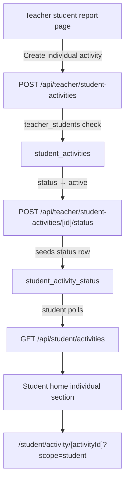

# Private Teacher / Individual Student Activities — Full Implementation Plan

## 1. Current-State Audit Summary

### What exists

| Area | State |
|---|---|
| `teacher_students` | Teacher ↔ student non-owning link; `classId` never required for creation |
| `teacher_class_students` | Class ↔ student membership; separate from roster |
| `classroom_activities.class_id` | NOT NULL, no scope/target column — class-only activities |
| `POST /api/teacher/students/create` | `classId` is optional; direct students already work |
| Student activity list | `listStudentActivities` — class membership only; direct students with no class see zero activities |
| Teacher student report | No activity creation controls on the page |
| Dashboard | Single student grid; no "direct/no class" section; ClassManagePanel shows "מקושרים שלא בכיתה" but no dedicated panel |
| Admin usage stats | `totalActiveStudents` = `teacher_students` count; no class-vs-direct split |

### Key gaps

- `classroom_activities.class_id` is NOT NULL — no way to create a student-scoped activity without schema change.
- `listStudentActivities` only queries via `teacher_class_students` — students without a class never see any activity.
- No teacher UI entry point to create an activity from the student report page.
- No dashboard section dedicated to students who are not in any class.

---

## 2. Product Model

```
teacher_profiles
  ├── teacher_classes (0..n)
  │     └── teacher_class_students → students
  │           └── classroom_activities (scope=class) → all class members
  └── teacher_students → students (0..n)
        └── student_activities (scope=student) → one student
```

### Teacher archetypes

| Archetype | Has classes? | Has direct students? |
|---|---|---|
| Classroom teacher | Yes | Optional |
| Private tutor | No | Yes |
| Mixed | Yes | Yes |

All three archetypes share the same `teacher_profiles` row. The archetype is inferred from data, not stored. No separate profile type is needed.

### Activity scopes

| Scope | Target | DB approach |
|---|---|---|
| `class` | All active class members at activate | Existing `classroom_activities` unchanged |
| `student` | One specific student | New `student_activities` table (Option C — see §4) |
| `group` (future) | Selected subset | Deferred to a later plan |

---

## 3. DB Design Recommendation

### Option comparison

| Option | Description | Risk |
|---|---|---|
| A: Extend `classroom_activities` with nullable `class_id` + `scope` + `target_student_id` | One table, retrofit | High: schema surgery on existing NOT NULL column; all existing queries and seeding logic must be guarded; activation roster logic becomes conditional |
| B: `activity_targets` join table | Keep `classroom_activities` for class scope; add targets table for groups/students | Medium: overcomplicated for current need |
| **C: Separate `student_activities` table** | New independent table mirroring `classroom_activities` but with `student_id NOT NULL, class_id absent` | Low: zero disruption to existing flows; can share attempt/status pattern; cleanly separable by API surface |

**Recommendation: Option C — a new `student_activities` table.**

Rationale:
- Leaves `classroom_activities`, `classroom_activity_student_status`, `classroom_activity_attempts` untouched.
- New table can be designed optimally for the single-student case.
- Separate API routes prevent accidental mixing.
- Easier future merge to Option A if needed (can be done later with a data migration).

### New table: `student_activities`

```sql
create table public.student_activities (
  id                  uuid        primary key default gen_random_uuid(),
  teacher_id          uuid        not null references public.teacher_profiles(id) on delete cascade,
  student_id          uuid        not null references public.students(id) on delete cascade,
  title               text        not null check(char_length(title) between 1 and 120),
  subject             text        not null,
  topic               text        not null,
  subtopic            text        null,
  skill_key           text        null,
  difficulty_level    text        null check(difficulty_level in ('easy','medium','hard','mixed')),
  question_count      integer     not null check(question_count between 1 and 50),
  mode                text        not null check(mode in ('guided_practice','quiz','homework')),
  -- live_lesson excluded: not relevant for individual activities
  question_selection  text        not null default 'same_exact'
                      check(question_selection in ('same_exact','controlled_variants')),
  time_limit_seconds  integer     null check(time_limit_seconds > 0),
  due_at              timestamptz null,
  status              text        not null default 'draft'
                      check(status in ('draft','active','closed','archived')),
  -- No paused state for individual: no broadcast sequencing needed
  question_set        jsonb       not null default '[]',
  activated_at        timestamptz null,
  closed_at           timestamptz null,
  archived_at         timestamptz null,
  created_at          timestamptz not null default now(),
  updated_at          timestamptz not null default now()
);

-- enforce teacher owns teacher_students link (API layer; not FK)
create index student_activities_teacher_idx
  on public.student_activities(teacher_id, created_at desc);
create index student_activities_student_idx
  on public.student_activities(student_id, status);

alter table public.student_activities enable row level security;
-- No authenticated policies; service-role only (same as classroom_activities)
```

### New table: `student_activity_status`

One row per activity tracks the student's progress state — mirroring `classroom_activity_student_status` in the existing classroom activities schema.

```sql
create table public.student_activity_status (
  id              uuid         primary key default gen_random_uuid(),
  activity_id     uuid         not null
                               references public.student_activities(id) on delete cascade,
  student_id      uuid         not null
                               references public.students(id) on delete cascade,
  status          text         not null default 'not_started'
                               check(status in ('not_started','in_progress','submitted','timed_out')),
  started_at      timestamptz  null,
  submitted_at    timestamptz  null,
  last_seen_at    timestamptz  null,
  answers_count   integer      not null default 0 check(answers_count >= 0),
  correct_count   integer      not null default 0 check(correct_count >= 0),
  score_pct       numeric(5,2) null check(score_pct is null or (score_pct between 0 and 100)),
  created_at      timestamptz  not null default now(),
  updated_at      timestamptz  not null default now(),
  constraint student_activity_status_unique unique(activity_id, student_id)
);

alter table public.student_activity_status enable row level security;
-- No authenticated policies; service-role only.
```

### New table: `student_activity_attempts`

One row per question attempt — normalized, matching `classroom_activity_attempts` exactly. The `unique(activity_id, student_id, question_index)` constraint ensures idempotent upserts during answer recording.

```sql
create table public.student_activity_attempts (
  id                   uuid        primary key default gen_random_uuid(),
  activity_id          uuid        not null
                                   references public.student_activities(id) on delete cascade,
  student_id           uuid        not null
                                   references public.students(id) on delete cascade,
  question_index       integer     not null check(question_index >= 0),
  skill_key            text        null,
  question_snapshot    jsonb       not null default '{}',
  selected_answer      text        null,
  correct_answer       text        null,
  is_correct           boolean     null,
  time_spent_ms        integer     null,
  hints_used           integer     not null default 0,
  explanation_viewed   boolean     not null default false,
  answered_at          timestamptz null,
  created_at           timestamptz not null default now(),
  constraint student_activity_attempts_unique
    unique(activity_id, student_id, question_index)
);

alter table public.student_activity_attempts enable row level security;
-- No authenticated policies; service-role only.
```

### Alignment with existing classroom activities pattern

| Table | Classroom equivalent | Purpose |
|---|---|---|
| `student_activities` | `classroom_activities` | Activity metadata, question set, status |
| `student_activity_status` | `classroom_activity_student_status` | Per-student progress row (one per activity/student pair) |
| `student_activity_attempts` | `classroom_activity_attempts` | Per-question answer rows, normalized |

This alignment means:
- Scoring logic is identical and reusable.
- Reporting reads the same normalized columns (`is_correct`, `score_pct`, `answers_count`).
- Future diagnostics, per-question analytics, and hint tracking work without schema changes.
- QA smoke tests can follow the same patterns as classroom activity tests.

### No SQL in this plan phase

The migration file will be written at the start of implementation (Phase P2). Owner applies manually before code is activated.

---

## 4. Student Roster Without Class (P1)

### Dashboard changes (minimal)

In [`lib/teacher-server/teacher-dashboard.server.js`](lib/teacher-server/teacher-dashboard.server.js):

- Classify each student row:
  - `isInAnyClass: boolean` — true if any active `teacher_class_students` row for this student + teacher's classes.
- Add `directStudentsCount` to `summary` (students with `isInAnyClass === false`).

In [`components/teacher-portal/TeacherDashboardClient.jsx`](components/teacher-portal/TeacherDashboardClient.jsx):

- Existing student grid retains all students.
- Add a small summary line: "X direct students (no class)" when `directStudentsCount > 0`.
- No separate section needed yet — the report card link already works for direct students.

### Student creation without class

Already works via `POST /api/teacher/students/create` with no `classId`. No changes needed.

Teacher flow: from dashboard add-student modal, leave class field blank (or add a UI label "without class — private student").

### Copy keys (no Hebrew without approval)

- `teacher.roster.directStudentsCount` → placeholder `"X direct students (no class)"`
- `teacher.createStudent.noClass` → placeholder `"No class (private student)"`

---

## 5. Individual Activity Model (P2)

### Data flow



### Activity state machine (simplified vs class)

```
draft → active → closed → archived
```

No `paused` state (no broadcast sequencing for one student).

### Activation: seeding `student_activity_status`

On `activate`, a `student_activity_status` row is upserted for `(activity_id, student_id)` with `status = 'not_started'`. This matches the classroom pattern where `seedStudentStatusRowsForClass` upserts `classroom_activity_student_status` rows for each class member. The single-student case simply seeds exactly one row.

On each answer recorded:
- Upsert `student_activity_attempts` row for `(activity_id, student_id, question_index)`.
- Update `student_activity_status` counters (`answers_count`, `correct_count`) and `last_seen_at`.

On submit/timeout:
- Update `student_activity_status.status`, `submitted_at`, `score_pct`.

### Teacher ownership/access check for individual activities

Server-side, every individual activity mutation must:
1. `loadTeacherActivityOwnedStudent(serviceRole, teacherId, activityId)` — query `student_activities WHERE id = activityId AND teacher_id = teacherId`.
2. Confirm active `teacher_students` link between `teacher_id` and `student_id`.

---

## 6. API Design

### Teacher: individual activity APIs

All require `app_metadata.role === "teacher"` via `requireTeacherApiContext`. New files under `pages/api/teacher/student-activities/`.

| Method | Route | Purpose |
|---|---|---|
| POST | `/api/teacher/student-activities` | Create draft individual activity |
| GET | `/api/teacher/student-activities` | List (filter by studentId, status) |
| GET | `/api/teacher/student-activities/[activityId]` | Detail + attempts |
| PATCH | `/api/teacher/student-activities/[activityId]` | Edit draft (title, questionSet, etc.) |
| DELETE | `/api/teacher/student-activities/[activityId]` | Delete draft only |
| POST | `/api/teacher/student-activities/[activityId]/status` | Transitions: activate, close, archive |
| GET | `/api/teacher/student-activities/[activityId]/report` | Post-close report |

**Create body:**

```json
{
  "studentId": "<uuid>",
  "title": "...",
  "subject": "math",
  "topic": "fractions",
  "mode": "homework",
  "questionCount": 5,
  "questionSet": [ ... ]
}
```

Authorization rule: `teacher_id` must have an active `teacher_students` link to `student_id`. Teacher cannot assign to arbitrary student ID.

### Student: extend existing activity APIs

Extend `listStudentActivities` in [`lib/teacher-server/teacher-activities.server.js`](lib/teacher-server/teacher-activities.server.js):

1. Existing class-based query remains unchanged.
2. Add second query: `student_activities WHERE student_id = studentId AND status IN ('active','closed')` + attempt row.
3. Merge results, tag each with `scope: 'class' | 'student'`.

Extend student play APIs to handle `scope=student`:

| Route | Change |
|---|---|
| `GET /api/student/activities` | Add `scope` field to each item |
| `POST /api/student/activities/[activityId]/start` | Check `student_activities` if not found in `classroom_activities` |
| `POST /api/student/activities/[activityId]/answer` | Route to correct table by scope |
| `POST /api/student/activities/[activityId]/submit` | Route to correct table by scope |

No new student routes needed; existing `[activityId]` routes are extended to be scope-aware.

The player page [`pages/student/activity/[activityId].js`](pages/student/activity/[activityId].js) requires no changes because it is driven entirely by API responses.

### Feature flag

Individual student activities are gated by a new feature flag: `individual_activities` (default `true`). Added to `DEFAULT_TEACHER_FEATURE_FLAGS` in [`lib/teacher-portal/teacher-feature-flags.js`](lib/teacher-portal/teacher-feature-flags.js).

---

## 7. Teacher UI: Create Individual Activity

### Entry point: teacher student report page

[`pages/teacher/student/[studentId].js`](pages/teacher/student/[studentId].js) — add a button/section:

- Label copy key: `teacher.studentReport.createIndividualActivity` → placeholder `"Create activity for this student"`
- Opens an inline or modal form (similar in structure to `pages/teacher/class/[classId]/activities/new.js`) but with `studentId` pre-set and `classId` absent.
- Form fields: subject, topic, subtopic, mode (no `live_lesson`), question count, difficulty, time limit.

### List on report page

After activities exist for the student, the teacher student report page also shows a small "individual activities" section showing recent activities and status.

### Dashboard entry point (optional, P3+)

A student card "actions" dropdown could include "Assign activity" but this is lower priority.

### Copy keys (no Hebrew without owner approval)

- `teacher.studentReport.createIndividualActivity`
- `teacher.studentReport.individualActivities`
- `teacher.individualActivity.status.draft`
- `teacher.individualActivity.status.active`
- `teacher.individualActivity.status.closed`
- `teacher.individualActivity.noActivities`

---

## 8. Student UI

### Student home changes

In [`components/student/StudentClassroomActivitiesPanel.jsx`](components/student/StudentClassroomActivitiesPanel.jsx):

- Existing section continues to show class activities under its current label.
- Add a second section: "personal activities" — items where `scope === 'student'`.
- If both sections empty, the combined panel renders nothing (no change from current behavior).

Copy keys for student home:
- `student.home.classActivities` → current label
- `student.home.personalActivities` → placeholder `"Personal activities"`
- `student.home.activity.individual` → placeholder badge `"Individual"`

Activity card: same component as class activities; add a small `scope` badge when `scope === 'student'`.

### Activity player

`/student/activity/[activityId]` is reused without change. The page reads activity data from API responses — adding `scope` to the start response is transparent.

### No data leakage

`loadActivityForStudent` for individual scope verifies `student_activity_status.student_id === auth.studentId`. Students cannot access other students' individual activities.

---

## 9. Security / IDOR

| Rule | Enforcement location |
|---|---|
| Teacher can only create individual activity for student in `teacher_students` | `POST /api/teacher/student-activities` — check active link before insert |
| Teacher can only read/modify their own individual activities | `loadTeacherActivityOwnedStudent` — `WHERE teacher_id = teacherId` |
| Student can only start/answer their own individual activity | `loadActivityForStudent` (scope=student) — `WHERE student_id = auth.studentId` |
| Class activity continues to require class membership for student | Unchanged |
| Teacher cannot bypass class cap by using individual scope | Individual activities have no class; class cap does not apply |
| Parent cannot see teacher monitoring/individual activity results | Teacher monitoring APIs are behind `requireTeacherApiContext`; parent APIs never touch `student_activities` teacher-side |
| Admin can see individual activity count per teacher | `buildTeacherUsage` extended to include `individualActivityCount` (non-PII) |
| Private tutor cannot access school/class admin data | Unchanged — no class means no class-based access |

---

## 10. Quotas Interaction

Current rule: unlimited total students, max 40 per class. Individual activities have no class, so the class cap does not apply.

No new quota fields are required now. The admin screen (`buildTeacherUsage`) will be extended to show:

- `classStudentCount` — count of students in at least one active class (from `teacher_class_students`)
- `directStudentCount` — students in `teacher_students` with no active `teacher_class_students` row for this teacher
- `totalLinkedStudents` — `teacher_students` count (existing)
- `individualActivityCount` — active/draft `student_activities`

These are display metrics only; no new enforcement limits.

---

## 11. SQL Requirements

**New migration required: `026_student_activities.sql`**

Contents:
- Create `student_activities` table
- Create `student_activity_status` table (one progress row per activity/student pair)
- Create `student_activity_attempts` table (one row per question attempt; normalized)
- Enable RLS on all three tables, no authenticated policies
- Add `individual_activities` to `teacher_plans.supported_features` if feature-flag column exists, else handled at app layer

**Migration file written at start of P2 only. Owner applies manually before any code referencing the new tables is activated.**

No changes to existing migrations 019–025.

---

## 12. New Server Library Files

| File | Purpose |
|---|---|
| `lib/teacher-server/student-activity.server.js` | Create, list, detail, status transitions, report; reads all three tables (`student_activities`, `student_activity_status`, `student_activity_attempts`) |
| `lib/teacher-server/student-activity-play.server.js` | Student start (seeds `student_activity_status` row), answer (upserts `student_activity_attempts` row + updates status counters), submit, list (individual scope) |

Existing files modified:

| File | Change |
|---|---|
| [`lib/teacher-server/teacher-activities.server.js`](lib/teacher-server/teacher-activities.server.js) | `listStudentActivities` merges individual results; `loadActivityForStudent` handles scope routing |
| [`lib/teacher-server/teacher-dashboard.server.js`](lib/teacher-server/teacher-dashboard.server.js) | Add `isInAnyClass` classification; add `directStudentsCount` to summary |
| [`lib/admin-server/admin-teachers.server.js`](lib/admin-server/admin-teachers.server.js) | Extend `buildTeacherUsage` with class/direct split and individual activity count |
| [`lib/teacher-portal/teacher-feature-flags.js`](lib/teacher-portal/teacher-feature-flags.js) | Add `individual_activities: true` |

---

## 13. Rollout Phases

### P0 — Audit (complete with this plan)

### P1 — Direct student roster display
- Classify students as `inAnyClass` in dashboard payload.
- Add `directStudentsCount` to dashboard summary.
- Dashboard UI label for direct students.
- No SQL needed.
- No change to existing activity or quota flows.

### P2 — Individual activity backend
- Write migration `026_student_activities.sql` — stop for owner approval and manual apply.
- Create `lib/teacher-server/student-activity.server.js` and `student-activity-play.server.js`.
- Create `pages/api/teacher/student-activities/*` routes.
- Extend `listStudentActivities` to return merged class + individual results with `scope` field.
- Extend student play APIs to be scope-aware.
- Add `individual_activities` feature flag.

### P3 — Teacher UI from student report
- Add "Create activity" button + form to `pages/teacher/student/[studentId].js`.
- Add individual activity list section to the same page.
- Copy keys only; no Hebrew text without approval.

### P4 — Student home support
- Extend `StudentClassroomActivitiesPanel` to render personal activities section.
- Add scope badge to activity card.
- Copy keys only; no Hebrew text without approval.

### P5 — QA / security / regression
- Unit tests: `student-activity.server.js` helpers; `listStudentActivities` merge logic.
- API tests: create, activate, submit individual activity; IDOR tests.
- Regression: all existing classroom activity phase4–phase10 smokes unchanged.
- Regression: quota/admin smokes unchanged.
- Build.

### P6 — Admin screen extension
- Extend `buildTeacherUsage` for class/direct/individual counts.
- Update admin UI to display new counts.

### P7 — Future group assignments (deferred)
- Separate plan when needed.

---

## 14. Acceptance Criteria

The feature is complete when:
- [ ] Teacher can create a student without assigning to any class, and student appears on dashboard.
- [ ] Dashboard shows `X direct students` label when direct students exist.
- [ ] Teacher can open student report for a direct student (already works; confirm no regression).
- [ ] Teacher can create a draft individual activity from the student report page, selecting subject/topic/mode.
- [ ] Teacher can activate the individual activity.
- [ ] Student (direct, no class) can see the individual activity on their home page under a separate section.
- [ ] Student can start, answer, and submit the individual activity using `/student/activity/[activityId]`.
- [ ] Teacher can view the individual activity result after the student submits.
- [ ] Teacher with classroom students sees class activities and individual activities on separate sections; no mixing.
- [ ] `POST /api/teacher/student-activities` with a `studentId` not linked to the teacher returns 403.
- [ ] Student cannot access another student's individual activity.
- [ ] All existing classroom activity smoke tests pass unchanged.
- [ ] All quota/admin smoke tests pass unchanged.
- [ ] `next build` passes.

---

## 15. Risks and Open Questions

| # | Question / Risk | Resolution needed |
|---|---|---|
| 1 | **`teacher_students` is enough** — confirmed. Direct students already exist in DB and on dashboard. The only gap is activity creation and student play routing. | No additional linking table needed |
| 2 | **`class_id` nullable** — not required; separate `student_activities` table avoids touching the existing NOT NULL constraint. | Confirmed by Option C decision |
| 3 | **Activity report UI for one student** — individual activity results need a simpler "single student" report; the multi-student `buildActivityMonitorPayload` is not appropriate. `buildActivityReportPayload` in the new server file should return a single-student format. | Decide in P5 |
| 4 | **Parent reports and individual activities** — the existing parent report is built from `learning_sessions` and `answers` (learning engine data), not from `classroom_activities`. Individual activities will produce learning engine data if answer attempts update the learning state — this interaction needs design. For now, plan that individual activity results are **teacher-visible only** and do not automatically appear in the parent report. | Owner confirms |
| 5 | **Private tutor student login access** — already works the same as class students (via `student_access_codes`; `assertTeacherCanManageStudentAccess` accepts direct link). No change needed. | Confirmed from audit |
| 6 | **School managers and individual activities** — when school manager role is added (Phase Q5), a school admin should only see their school's teachers; individual activity counts should be included in per-teacher stats. Deferred to school manager plan. | Deferred |
| 7 | **`live_lesson` mode for individual activities** — excluded from `student_activities`. Live lesson broadcasting requires a class roster and question index broadcasting which is not meaningful for one student. If a private tutor wants real-time synchronous sessions, that is a separate future feature. | Owner confirms |
| 8 | **Duplicate student across class and individual activities** — a student can be both a class member (class activity) and receive individual activities. Both will appear on student home. No deduplication issue since tables are separate. | By design |
| 9 | **Hebrew copy** — all new strings use copy keys only; no final Hebrew text added until owner approves translations. | Owner provides copy before P3/P4 ship to production |
| 10 | **`controlled_variants` question selection** — currently returns 501 in class activities. Same constraint applies to individual activities. | Inherited from existing constraint |
