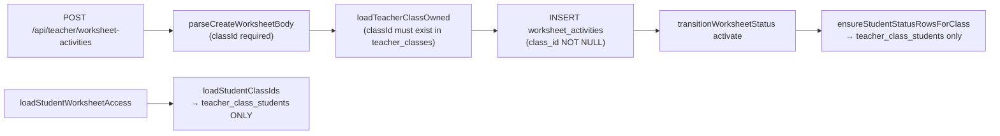

# Private Teacher Worksheet PDF Activities — Final Closed Implementation Plan

---

## MANDATORY WORKFLOW BLOCK

**The owner may approve implementation by pressing the Cursor Build/Implement button. No additional chat-body implementation instructions are required. This plan document is the single source of truth for implementation.**

**After owner approval, implement the full approved Private Teacher Worksheet PDF Activities scope from start to finish according to this plan. Steps/phases are internal execution order only — not stop-and-wait approval gates. Complete all implementation steps first, then run QA, fix any issues, rerun relevant tests, and produce a final closure report.**

Additional workflow rules:

- No implementation before final owner approval.
- SQL/migrations are prepared as files by Cursor. Cursor must NOT run SQL.
- The owner applies the migration manually in Supabase after reviewing and approving the SQL file.
- No commit. No push. The owner commits manually.
- No feature flags — the whole site is still in development and no technical reason requires them.
- No additional instructions outside this plan document are required or expected.

---

## 1. Product Summary

Private teachers (no `school_teacher_memberships` row) cannot currently use Worksheet PDF Activities. The entire worksheet implementation requires a `class_id` from `teacher_classes` and seeds student participation via `teacher_class_students`. A private teacher who has students linked only through `teacher_students` (the normal private-teacher model) is completely blocked.

**Goal:** Allow a private teacher to create a Worksheet PDF Activity and assign it to:
1. One directly linked student.
2. Several selected directly linked students.
3. An existing teacher class/group — if the teacher intentionally uses one.

Private teachers must not be forced to create a fake class just to send one PDF worksheet.

---

## 2. Final Architecture Decision

**Option 1 is the final architecture. No alternatives remain.**

- Keep the existing class-based worksheet flow for school/class worksheets — unchanged.
- Extend the existing `worksheet_activities` system to support direct student assignment.
- Make `worksheet_activities.class_id` nullable.
- Add `assignment_scope` column to `worksheet_activities` (values: `class` or `selected_students`).
- Add a new table `worksheet_student_assignments` for direct/selected-student recipients.
- Do not create separate `private_worksheet_activities` tables.
- Do not create implicit or ghost `teacher_classes` rows.
- Do not force private teachers into the school/class roster model.

**Scope rules:**

| `assignment_scope` | `class_id` | Recipients |
|---|---|---|
| `class` | NOT NULL (existing FK) | All students in `teacher_class_students` for that class |
| `selected_students` | NULL | Rows in `worksheet_student_assignments` |

**Backwards compatibility:** All existing rows have `class_id IS NOT NULL` and `assignment_scope = 'class'` (default). Existing code paths are unchanged for class-scope worksheets.

---

## 3. Non-Goals (Out of Scope)

The following are explicitly out of scope for this plan:

- Parallel/separate `private_worksheet_activities` tables.
- Ghost/auto-generated `teacher_classes` for private teachers.
- School manager visibility into private selected-student worksheets.
- Parent report integration for worksheets (no existing plan for this).
- Bulk worksheet assignment across multiple classes at once.
- Any changes to `classroom_activities` or `student_activities`.
- Any changes to the school manager portal (`/school/*`, `/api/school/*`).
- Any changes to existing activity APIs under `/api/teacher/activities/*` or `/api/student/activities/*`.
- Any changes to automatic activity behavior.

---

## 4. Current Private Teacher Model (Context)

Private teachers are identical Supabase auth accounts to school teachers (`app_metadata.role = "teacher"`). The only distinction is the absence of a row in `school_teacher_memberships`. There is no `teacher_type` column.

**Two student-linking tables:**

| Table | Meaning |
|---|---|
| `teacher_students` | Direct teacher↔student link — the primary private-teacher model |
| `teacher_class_students` | Student on a class roster — only used if teacher creates a class |

Rule: a student must be in `teacher_students` before being added to a class (`teacher-link.server.js`). `teacher_students` is the foundation.

Private teachers have no `school_teacher_subjects` restriction — `assertSchoolTeacherSubjectAllowed` returns `allowed: true` when no school membership exists.

The existing `teacherHasReportAccessToStudent` gate accepts either a `teacher_students` link or a `teacher_class_students` link. This is the pattern to follow for worksheet access.

---

## 5. Current Worksheet Gap



Every path in the worksheet system hard-requires a `class_id`. Private teachers with only `teacher_students` links are fully blocked.

---

## 6. Data Model Plan

### Migration file

Cursor prepares the SQL file at:

```
supabase/migrations/<next_available_number>_private_worksheet_assignments.sql
```

Before implementation, Cursor inspects `supabase/migrations/` and chooses the next available number. As of the time this plan was written, migrations exist up to `034`, so the file will be `035_private_worksheet_assignments.sql` unless higher files have been added by then.

**Cursor prepares the file only. Cursor must NOT run the SQL. Owner applies manually in Supabase.**

### SQL content (final, no alternatives)

```sql
-- File: supabase/migrations/<next_available_number>_private_worksheet_assignments.sql
-- Owner applies this manually in Supabase. Cursor must NOT run this file.

BEGIN;

-- 1. Make class_id nullable (additive change; existing rows keep their class_id value)
ALTER TABLE public.worksheet_activities
  ALTER COLUMN class_id DROP NOT NULL;

-- 2. Add assignment_scope discriminator
ALTER TABLE public.worksheet_activities
  ADD COLUMN IF NOT EXISTS assignment_scope text NOT NULL DEFAULT 'class'
    CHECK (assignment_scope IN ('class', 'selected_students'));

-- 3. Backfill existing rows: all existing rows have class_id, so they are 'class' scope
-- (DEFAULT 'class' handles this automatically for existing rows if ADD COLUMN applies the default)

-- 4. Add check constraints for scope consistency
-- class scope must have class_id; selected_students scope must not
ALTER TABLE public.worksheet_activities
  ADD CONSTRAINT worksheet_scope_class_requires_class_id
    CHECK (
      assignment_scope <> 'class' OR class_id IS NOT NULL
    );

ALTER TABLE public.worksheet_activities
  ADD CONSTRAINT worksheet_scope_selected_students_no_class_id
    CHECK (
      assignment_scope <> 'selected_students' OR class_id IS NULL
    );

-- 5. New assignment table for selected-student scope
CREATE TABLE public.worksheet_student_assignments (
  id                    uuid        PRIMARY KEY DEFAULT gen_random_uuid(),
  worksheet_activity_id uuid        NOT NULL
                                    REFERENCES public.worksheet_activities(id) ON DELETE CASCADE,
  student_id            uuid        NOT NULL
                                    REFERENCES public.students(id) ON DELETE CASCADE,
  assigned_at           timestamptz NOT NULL DEFAULT now(),
  UNIQUE (worksheet_activity_id, student_id)
);

CREATE INDEX worksheet_student_assignments_ws_idx
  ON public.worksheet_student_assignments (worksheet_activity_id);

CREATE INDEX worksheet_student_assignments_student_idx
  ON public.worksheet_student_assignments (student_id);

-- 6. Enable RLS on the new table (service-role API pattern; no broad client policies)
ALTER TABLE public.worksheet_student_assignments ENABLE ROW LEVEL SECURITY;

COMMIT;
```

**DB constraint risk:** The two check constraints (`worksheet_scope_class_requires_class_id` and `worksheet_scope_selected_students_no_class_id`) are safe because all existing rows have `class_id IS NOT NULL` and will receive `assignment_scope = 'class'` from the column default. No existing rows will violate the constraints.

---

## 7. API Plan (Final)

### Existing endpoints — behavior after changes

| Endpoint | Change |
|---|---|
| `GET /api/teacher/worksheet-activities` | **Extended.** When `classId` query param is present: return class-scope worksheets for that class (existing behavior, unchanged). When no `classId` param: return all worksheets owned by the teacher across both scopes (class + selected-student). Used by `/teacher/worksheets` list page. |
| `POST /api/teacher/worksheet-activities` | Accept `classId` OR `studentIds` (not both). Branch on which is provided. |
| `GET /api/teacher/worksheet-activities/[worksheetId]` | No change. Works for both scopes via `teacher_id` ownership. |
| `PATCH /api/teacher/worksheet-activities/[worksheetId]/status` | Existing status transition route. Activation branching now happens inside `transitionWorksheetStatus`: if `assignment_scope = 'selected_students'`, seed from `worksheet_student_assignments`; if `assignment_scope = 'class'`, seed from `teacher_class_students` (unchanged). |
| `GET /api/student/worksheet-activities` | Backend now unions class-scope + selected-student-scope. |
| `GET /api/student/worksheet-activities/[worksheetId]` | Access check: class membership OR assignment row. |
| `GET /api/teacher/students/[studentId]/worksheets` | Backend unions both scopes for this student. |

### New endpoints

| Endpoint | Purpose |
|---|---|
| `POST /api/teacher/worksheet-activities/[worksheetId]/assignments` | Add students to existing selected-student worksheet. Body: `{ studentIds: [...] }` |
| `DELETE /api/teacher/worksheet-activities/[worksheetId]/assignments` | Remove a student from a selected-student worksheet. Body: `{ studentId: "..." }` |

Both methods are handled in the same file: `pages/api/teacher/worksheet-activities/[worksheetId]/assignments.js`.

### Create worksheet API — final request rules

**`POST /api/teacher/worksheet-activities`**

- Accept `classId` (UUID) to create a class-scope worksheet — existing behavior.
- Accept `studentIds` (array of UUIDs, min 1, max 100) to create a selected-student worksheet.
- `classId` and `studentIds` must not both be present in the same request — return 400 if both sent.
- For selected-student scope: validate every `studentId` is linked to the teacher via `teacher_students` (active link) — return 403 if any student is not linked.
- For class scope: keep existing `loadTeacherClassOwned` validation — unchanged.
- Set `assignment_scope = 'selected_students'` and `class_id = null` for selected-student creates.
- Set `assignment_scope = 'class'` for class creates — unchanged.
- After inserting `worksheet_activities`, insert rows into `worksheet_student_assignments` for each `studentId` (selected-student scope only).

### Activate / status transition — branching

The existing `PATCH /api/teacher/worksheet-activities/[worksheetId]/status` route handles all status transitions including activation. No new `/activate` endpoint is added. The branching happens inside `transitionWorksheetStatus`:

- `assignment_scope = 'class'`: call `ensureStudentStatusRowsForClass` (existing, unchanged).
- `assignment_scope = 'selected_students'`: call `ensureStudentStatusRowsForAssignments` (new function) — seeds `worksheet_student_status` rows from `worksheet_student_assignments` for this worksheet.

### Student access — final rules

- `assignment_scope = 'class'`: existing `loadStudentClassIds` check (unchanged).
- `assignment_scope = 'selected_students'`: check `worksheet_student_assignments` for `(worksheet_activity_id, student_id)` — if row exists, access granted.
- Student not in either path → 403.

### Student worksheet list

`listStudentWorksheets` returns the union of:
1. Class-scope worksheets where student is in `teacher_class_students` for the class (existing query).
2. Selected-student worksheets where student has a row in `worksheet_student_assignments` (new query).

### School manager isolation

School manager worksheet APIs filter by `school_id = schoolId`. Private selected-student worksheets have `school_id = null` and are therefore never returned to school manager APIs. No change required to school manager code.

---

## 8. UI Plan (Final)

### New teacher-level routes (private/direct worksheet flow)

| Route | Purpose |
|---|---|
| `/teacher/worksheets/new` | Create worksheet without a class — student selector for private teachers |
| `/teacher/worksheets/[worksheetId]` | Manage/view worksheet (no class in URL) |
| `/teacher/worksheets/[worksheetId]/report` | Report for selected-student worksheet |
| `/teacher/worksheets/[worksheetId]/grade/[studentId]` | Grade individual student (no class) |

### Existing class routes — unchanged

All routes under `/teacher/class/[classId]/worksheets/*` remain unchanged and continue to work for school teachers and private teachers who have classes.

### Entry points for private teacher (final decision — all three are implemented)

1. **Student detail page** (`/teacher/student/[studentId]`): Add a "New Worksheet" button that opens `/teacher/worksheets/new?studentId=[studentId]` — pre-selects the student.
2. **Teacher dashboard**: Add a "Worksheets" link/card in the top-level teacher navigation (alongside "Students", "Activities"), pointing to a teacher-level worksheet list page.
3. **Teacher worksheet list page** (`/teacher/worksheets`): Lists all worksheets the teacher owns across all scopes. Includes a "New Worksheet" button leading to `/teacher/worksheets/new`.

### `TeacherStudentSelector` component

A new multi-student picker component used on `/teacher/worksheets/new`. It loads the teacher's linked students from `teacher_students` and allows selecting one or more. Used only for selected-student scope creates.

### Class worksheet pages — no UI change

Existing components `TeacherStudentWorksheetsPanel` and `StudentWorksheetsPanel` call backend APIs. No component changes are required — the backend union queries handle both scopes transparently.

---

## 9. Permission and Security Model

| Action | Guard |
|---|---|
| Create selected-student worksheet | Teacher must own a `teacher_students` link (active) for every selected student |
| Activate selected-student worksheet | Teacher must own the worksheet (`teacher_id = teacher.id`) |
| Add student to existing worksheet | Same teacher ownership + `teacher_students` link for new student |
| Remove student from worksheet | Same teacher ownership check |
| Student opens selected-student worksheet | `worksheet_student_assignments` row must exist for `(worksheetId, studentId)` |
| School manager view | Filter by `school_id IS NOT NULL` — private worksheets never returned |
| RLS | `worksheet_student_assignments` RLS enabled; all access via service-role API route |

No feature flags. No school membership required for private-teacher worksheet operations.

---

## 10. Reporting Model

- **Teacher worksheet report** (`/teacher/worksheets/[worksheetId]/report`): Shows `worksheet_student_status` rows for assigned students (from `worksheet_student_assignments`). Same status states and grading flow as class-scope reports.
- **Teacher student panel** (`/teacher/student/[studentId]`): `TeacherStudentWorksheetsPanel` API unions both scopes — shows all worksheets for this student regardless of scope.
- **Student home** (`StudentWorksheetsPanel`): API unions both scopes — student sees all assigned worksheets.
- **School manager summaries**: Unchanged. Still filtered by `school_id IS NOT NULL`.

---

## 11. Isolation — What Must Not Change

The following must not be modified by this implementation:

- `classroom_activities` table, APIs, and UI
- `student_activities` table, APIs, and UI
- Any existing automatic activity behavior
- School manager portal: `/school/*`
- School manager APIs: `/api/school/*`
- Existing activity APIs: `/api/teacher/activities/*`
- Existing activity APIs: `/api/student/activities/*`
- All existing routes: `/teacher/class/[classId]/worksheets/*`
- All existing class-scope worksheet behavior for school teachers and private teachers using classes

---

## 12. New Files

| File | Purpose |
|---|---|
| `supabase/migrations/<next_available_number>_private_worksheet_assignments.sql` | DB changes — owner applies manually |
| `lib/worksheet-activities/worksheet-assignments.server.js` | `createDirectAssignments`, `ensureStudentStatusRowsForAssignments`, `loadStudentWorksheetAssignmentIds`, `addAssignmentsToWorksheet`, `removeAssignmentFromWorksheet` |
| `pages/api/teacher/worksheet-activities/[worksheetId]/assignments.js` | `POST` (add students, body: `{ studentIds: [...] }`); `DELETE` (remove student, body: `{ studentId: "..." }`) — single file for both methods |
| `pages/teacher/worksheets/index.js` | Teacher-level worksheet list (all scopes) |
| `pages/teacher/worksheets/new.js` | Teacher-level create UI (accepts optional `?studentId` query param to pre-select a student) |
| `pages/teacher/worksheets/[worksheetId]/index.js` | Manage worksheet (no classId in URL) |
| `pages/teacher/worksheets/[worksheetId]/report.js` | Report (no classId) |
| `pages/teacher/worksheets/[worksheetId]/grade/[studentId].js` | Grade (no classId) |
| `components/worksheet-activities/TeacherStudentSelector.jsx` | Multi-student picker from `teacher_students` list |

---

## 13. Modified Files

| File | Change |
|---|---|
| `lib/worksheet-activities/worksheet-teacher.server.js` | `parseCreateWorksheetBody`: accept `studentIds` OR `classId` (not both); `createWorksheetActivity`: branch on scope; `transitionWorksheetStatus`: branch activate seed path by `assignment_scope`; `listWorksheetsForStudentReport`: union both scopes |
| `lib/worksheet-activities/worksheet-student.server.js` | `loadStudentWorksheetAccess`: check `worksheet_student_assignments` when `assignment_scope = 'selected_students'`; `listStudentWorksheets`: union both scopes |
| `pages/api/teacher/worksheet-activities/index.js` | `GET`: when no `classId` param, return all teacher worksheets across both scopes; `POST`: forward `studentIds` to server function; branch logic |
| `pages/api/teacher/worksheet-activities/[worksheetId]/status.js` | Existing file. Call new `ensureStudentStatusRowsForAssignments` when `assignment_scope = 'selected_students'` during activate transition; no other change. |
| `pages/teacher/student/[studentId].js` | Add "New Worksheet" button linking to `/teacher/worksheets/new?studentId=[studentId]` |
| Teacher dashboard navigation component | Add "Worksheets" entry linking to `/teacher/worksheets` |

---

## 14. Implementation Execution Order

These are internal execution steps only — not approval gates. Implement in sequence after owner approval:

1. Inspect `supabase/migrations/` to confirm next available number. Prepare `<next_available_number>_private_worksheet_assignments.sql`.
2. Implement `lib/worksheet-activities/worksheet-assignments.server.js` (new server helpers: `createDirectAssignments`, `ensureStudentStatusRowsForAssignments`, `loadStudentWorksheetAssignmentIds`, `addAssignmentsToWorksheet`, `removeAssignmentFromWorksheet`).
3. Extend `worksheet-teacher.server.js` — create branching, activate branching (called from status route), report union.
4. Extend `worksheet-student.server.js` — access branching, list union.
5. Extend `pages/api/teacher/worksheet-activities/index.js` — `GET` all-scope path when no `classId`; `POST` accepts `studentIds`.
6. Extend `pages/api/teacher/worksheet-activities/[worksheetId]/status.js` — call `ensureStudentStatusRowsForAssignments` for selected-student activate.
7. Implement `pages/api/teacher/worksheet-activities/[worksheetId]/assignments.js` — `POST` and `DELETE` methods.
8. Implement `TeacherStudentSelector` component.
9. Implement teacher-level worksheet pages under `/teacher/worksheets/` (list, new, manage, report, grade).
10. Add entry points: "New Worksheet" button on student detail page; "Worksheets" nav link in teacher dashboard navigation.
11. Run `npm run build` to confirm no errors.
12. Run full QA checklist (Section 15).
13. Fix any issues found in QA.
14. Rerun relevant tests.
15. Produce final closure report.

---

## 15. QA Checklist (End-of-Implementation)

Run after all implementation steps are complete. Fix any failures before producing the closure report.

### Private teacher — new flow

- [ ] Private teacher creates worksheet for one direct student via `/teacher/worksheets/new`
- [ ] Private teacher creates worksheet for several selected direct students via `/teacher/worksheets/new`
- [ ] `worksheet_activities` row has `assignment_scope = 'selected_students'` and `class_id IS NULL`
- [ ] `worksheet_student_assignments` rows exist for exactly the assigned students
- [ ] `worksheet_student_status` rows are created for exactly those students after activation
- [ ] Assigned students see the worksheet on student home (`StudentWorksheetsPanel`)
- [ ] Assigned students can open/download the PDF
- [ ] PDF open tracking works (open event recorded)
- [ ] Assigned students can submit digital answers
- [ ] Manual grading works via `/teacher/worksheets/[worksheetId]/grade/[studentId]`
- [ ] Auto-grading works where supported
- [ ] Publish gate works — students do not see score until teacher publishes
- [ ] Student sees score only after teacher publishes
- [ ] Unassigned student attempts access → 403 returned
- [ ] Teacher cannot assign a student not linked through `teacher_students` → 403 or 400 returned
- [ ] `classId` + `studentIds` sent together → 400 returned
- [ ] Teacher-level worksheet list (`/teacher/worksheets`) shows the new worksheet
- [ ] "New Worksheet" button on student detail page pre-selects the student correctly

### Class / school regression

- [ ] School teacher class worksheet create, activate, and report still works end-to-end
- [ ] Existing `/teacher/class/[classId]/worksheets/*` routes still work without change
- [ ] School manager does not see private selected-student worksheets (`school_id IS NULL`)
- [ ] School manager worksheet summaries still work for school worksheets
- [ ] Existing automatic `classroom_activities` create/activate/report unchanged
- [ ] Existing individual `student_activities` unchanged
- [ ] Teacher dashboard navigation still navigates correctly to `/teacher/class/[classId]` and `/teacher/class/[classId]/activities`
- [ ] `npm run build` passes
- [ ] No SQL was run by Cursor (confirm `git diff supabase/migrations` shows only the new file, not any applied changes)
- [ ] No commit, no push

---

## 16. Delivery — ZIP Review Package

After all QA checks pass and issues are fixed, Cursor must prepare a ZIP review package containing all files created or modified for this feature.

**ZIP path:**
```
docs/teacher-portal/review-packages/private-teacher-worksheet-pdf-review.zip
```

**ZIP contents — include:**

- All new product code files created for this feature
- All modified product code files (only the files listed in Sections 12 and 13)
- The prepared SQL migration file (`supabase/migrations/<next_available_number>_private_worksheet_assignments.sql`)
- The final closure/QA report (plain text or markdown file)
- Any test scripts added specifically for this feature

**ZIP contents — exclude:**

- `node_modules/`
- `.next/`
- `.env*` files
- Any secrets or credentials
- Any unrelated files from other parallel workstreams (school portal, classroom activities, student activities, school manager portal, etc.)

---

## 17. Final Closure Report

After the ZIP is prepared, produce a final closure report as a markdown file. Include it in the ZIP and print it to chat. The report must contain:

- ZIP path: `docs/teacher-portal/review-packages/private-teacher-worksheet-pdf-review.zip`
- Full `git status --short` output
- Confirmation that the SQL migration file was prepared but not run by Cursor
- Confirmation that no commit was made
- Confirmation that no push was made
- List of all files included in the ZIP (new files + modified files)
- List of any files explicitly excluded that might seem related but were intentionally kept unchanged

---

## 18. Risks and Mitigations

| Risk | Likelihood | Mitigation |
|---|---|---|
| `ALTER COLUMN class_id DROP NOT NULL` violates existing rows | None — all existing rows have class_id | Constraint is additive; existing data passes |
| New CHECK constraints fail on existing rows | None — all existing rows will get `assignment_scope = 'class'` default | Backfill with DEFAULT value before constraints added, or add constraints inside BEGIN/COMMIT after confirming |
| `listStudentWorksheets` union query returns duplicates | Low — a student cannot be in both paths for same worksheet (class_id IS NULL or NOT NULL is mutually exclusive by constraint) | UNION (not UNION ALL) as fallback |
| Private teacher assigned student not in `teacher_students` | Prevented at API layer | Validation before insert; return 403 |
| School manager accidentally sees private worksheets | Prevented by `school_id IS NULL` filter | No change required; existing filter is correct |
| Teacher dashboard entry point clutters UI | Low | Single "Worksheets" nav item; no modal overhead |

---

## Confirmation

- No implementation has been done.
- No SQL has been run.
- No code has been changed.
- No commit has been made.
- No push has been made.
- Only this plan document was updated (added Sections 16–17: ZIP review package requirement and final closure report requirement).
