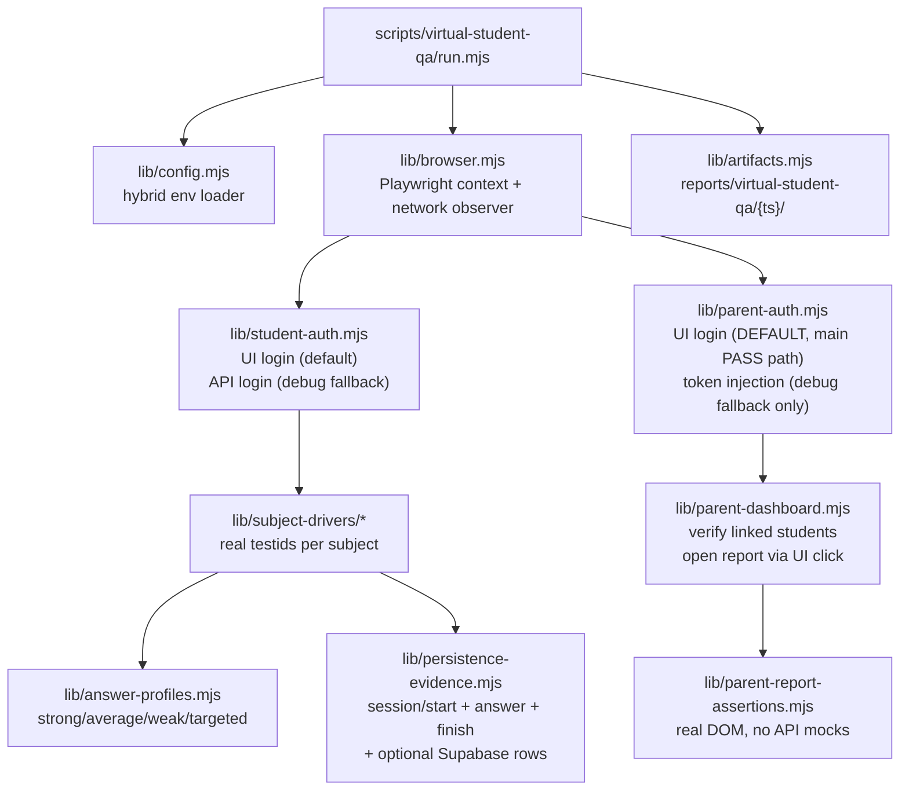
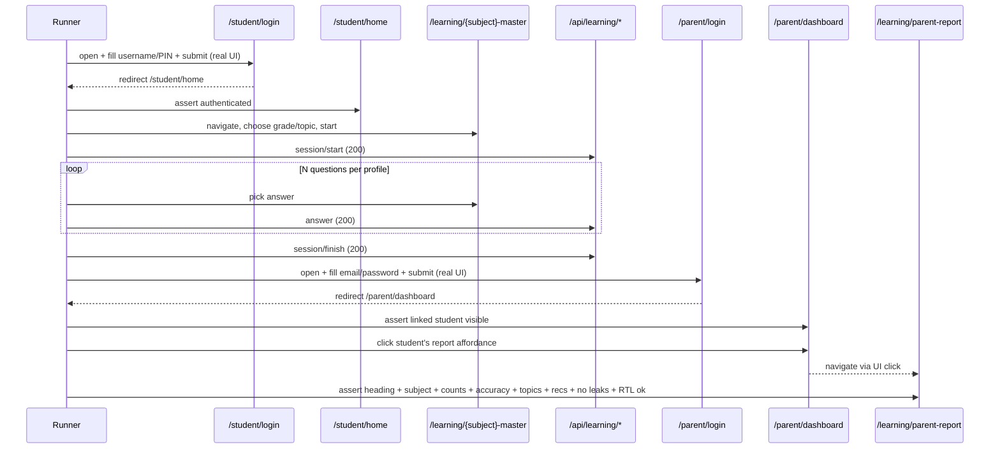

# Real UI Virtual Student QA Runner — Implementation Plan

## 0. Core goal (restated)

The runner exists to prove, end-to-end against real infrastructure, that:

1. Real test **student** accounts log in through the real website UI (`/student/login`).
2. They learn through the real website UI (real `/learning/*-master` pages, real questions, real answers).
3. Their activity is **really persisted** — verified primarily via real network calls to `/api/learning/session/start`, `/api/learning/answer`, `/api/learning/session/finish` (and optionally Supabase row counts), **never** localStorage as the source of truth.
4. The real test **parent** account then logs in through the real parent UI (`/parent/login`).
5. The parent lands on the real `/parent/dashboard` and the linked student(s) are visible there.
6. The parent opens that student's report **through the parent-facing UI flow** (clicking from the dashboard), not by hand-crafting a `/learning/parent-report?studentId=…` URL.
7. The runner verifies the visible parent report **matches the activity the virtual student actually created** (subject visible, activity count, accuracy moved, topic data when enough data, recommendations when expected, no raw topic-key leaks, no Hebrew/RTL break).

This is **not** an offline simulator. This is **not** a localStorage-driven preview. This is **not** a direct-URL parent-report loader with mocked APIs.

## 1. Scope and non-goals

**In scope (this plan):** a new `scripts/virtual-student-qa/` orchestrator built on Playwright + the existing real-student auth helper. Drives real student UI flows, asserts real persistence, then drives the real parent UI flow (login → dashboard → student selection → report) and asserts the report DOM.

**Explicitly NOT touched:**
- `pages/learning/*-master.js`, `pages/parent/login.js`, `pages/parent/dashboard.js`, `pages/learning/parent-report*.js` (no product UI changes)
- Hebrew strings anywhere
- `utils/diagnostic-engine-v2/*`, `utils/math-report-generator.js`, `utils/parent-report-v2.js`, `utils/learning-patterns-analysis.js` (no threshold changes)
- `utils/parent-report-insights/*`, `utils/parent-report-language/*`, `utils/parent-report-output-integrity/*` (no parent-report logic changes)
- `supabase/migrations/*` (no schema changes; if blocked, will report and stop)
- `pages/learning/dev-student-simulator.js`, `components/dev-student-simulator/*`, `scripts/learning-simulator/*` (NOT replaced; runner is independent)
- `scripts/e2e-lib/hebrew-e2e-student-auth.mjs` (reused as-is, only as the optional API fallback path)

## 2. Architecture (one diagram)

## 3. Files to CREATE (all under `scripts/virtual-student-qa/`)

- `[scripts/virtual-student-qa/run.mjs](scripts/virtual-student-qa/run.mjs)` — CLI entry. Flags: `--phase a|b|c|d|full`, `--scenario <id>`, `--student <label>`, `--headed`, `--base-url`. Dispatches phase runners; writes artifacts.
- `[scripts/virtual-student-qa/lib/config.mjs](scripts/virtual-student-qa/lib/config.mjs)` — Hybrid env loader. Reads `VIRTUAL_STUDENT_ACCOUNTS` JSON if set; otherwise falls back to `E2E_STUDENT_USERNAME`/`E2E_STUDENT_PIN` (single) and `E2E_STUDENT_{N}_USERNAME`/`E2E_STUDENT_{N}_PIN` (multi). Loads `.env.e2e.local` first, then `.env.local`, then `.env` via the same pattern as `scripts/e2e-lib/hebrew-e2e-student-auth.mjs::tryLoadE2EStudentEnvFromDotenv`. Never logs PINs or passwords.
- `[scripts/virtual-student-qa/lib/browser.mjs](scripts/virtual-student-qa/lib/browser.mjs)` — Wraps `playwright` chromium launch, sets `locale: 'he-IL'`, attaches a network observer that records every `/api/learning/session/start`, `/api/learning/answer`, `/api/learning/session/finish` request/response into a structured event log. Supports `headed` flag.
- `[scripts/virtual-student-qa/lib/student-auth.mjs](scripts/virtual-student-qa/lib/student-auth.mjs)` — Two modes:
  - **`mode='ui'` (DEFAULT, required for the final flow):** drive the real `[pages/student/login.js](pages/student/login.js)` form — fill the **שם משתמש** + **PIN** fields, click **כניסה**, wait for `/student/home`, assert no redirect back to `/student/login`.
  - **`mode='api'` (TEMPORARY debug shortcut, opt-in via `VIRTUAL_STUDENT_STUDENT_AUTH=api`):** delegates to `applyStudentSessionFromLogin` from `[scripts/e2e-lib/hebrew-e2e-student-auth.mjs](scripts/e2e-lib/hebrew-e2e-student-auth.mjs)`. Logs a clear `[TEMPORARY:api-shortcut]` warning to the run log every time it is used so it is impossible to ship a "passing" run that silently used the shortcut.
  - Multi-account selection: chooses the account by `--student <label>` from the hybrid env shape, in memory only, never logs PINs.
- `[scripts/virtual-student-qa/lib/answer-profiles.mjs](scripts/virtual-student-qa/lib/answer-profiles.mjs)` — Pure functions: `pickAnswer({ profile, choices, correctIndex, topicKey, weaknessTopics })`. Profiles:
  - `strong`: ~95% correct
  - `average`: ~70% correct
  - `weak`: ~40% correct
  - `targeted`: correct everywhere except for one topic in `weaknessTopics` where accuracy drops to ~25% (drives "needs practice" thresholds without mutating them — see `utils/parent-report-v2.js` `accuracy < 70`).
- `[scripts/virtual-student-qa/lib/subject-drivers/math-master.mjs](scripts/virtual-student-qa/lib/subject-drivers/math-master.mjs)` — **Phase A driver.** Uses real testids in `[pages/learning/math-master.js](pages/learning/math-master.js)`: `math-player-name`, `math-grade-select`, `math-operation-select`, `math-start-game`, `math-mcq-{idx}` (or `math-text-answer`), `math-check-answer`, `learning-stop-game`. Profiles control how often we deliberately pick wrong.
- `[scripts/virtual-student-qa/lib/subject-drivers/hebrew-master.mjs](scripts/virtual-student-qa/lib/subject-drivers/hebrew-master.mjs)` — **Phase C.** `hebrew-player-name`, `hebrew-topic-select`, `hebrew-start-game`, `hebrew-mcq-{idx}` / placeholder + **בדוק תשובה**.
- `[scripts/virtual-student-qa/lib/subject-drivers/science-master.mjs](scripts/virtual-student-qa/lib/subject-drivers/science-master.mjs)` — **Phase C.** `science-*` testids.
- `[scripts/virtual-student-qa/lib/subject-drivers/english-master.mjs](scripts/virtual-student-qa/lib/subject-drivers/english-master.mjs)` — **Phase C.** `english-*` testids.
- `[scripts/virtual-student-qa/lib/subject-drivers/geometry-master.mjs](scripts/virtual-student-qa/lib/subject-drivers/geometry-master.mjs)` — **Phase C.** `geometry-*` testids.
- `[scripts/virtual-student-qa/lib/subject-drivers/moledet-geography-master.mjs](scripts/virtual-student-qa/lib/subject-drivers/moledet-geography-master.mjs)` — **Phase C.** Real route `/learning/moledet-geography-master`. This subject has fewer stable testids per the codebase audit; the driver uses `moledet-question-stem` + the shared `[components/learning/StudentQuestionDisplay.jsx](components/learning/StudentQuestionDisplay.jsx)` testids `student-question-lead` / `student-question-body`, plus role/text-based fallbacks. If a stable interaction selector cannot be located without a UI change, the runner reports a verified blocker (no UI testid additions in this plan).
- `[scripts/virtual-student-qa/lib/persistence-evidence.mjs](scripts/virtual-student-qa/lib/persistence-evidence.mjs)`:
  - **Tier 1 (always required):** exactly 1× `/api/learning/session/start` 200 with a session id, exactly N× `/api/learning/answer` 200 (N == answered count), 1× `/api/learning/session/finish` 200.
  - **Tier 2 (optional, only if `SUPABASE_SERVICE_ROLE_KEY` set):** read-only row count for that `learning_session_id` in `answers` and `learning_sessions.status='completed'`.
  - **Anti-localStorage rule:** localStorage is read for diagnostics only, never as primary evidence. If Tier 1 fails, the run FAILS regardless of localStorage.
- `[scripts/virtual-student-qa/lib/parent-auth.mjs](scripts/virtual-student-qa/lib/parent-auth.mjs)` — **Phase B. Two modes — UI is the default and the only mode that can satisfy a full parent-scenario PASS.**
  - **`mode='ui'` (DEFAULT, main PASS path, `VIRTUAL_STUDENT_PARENT_AUTH=ui` or unset):** drive the real `[pages/parent/login.js](pages/parent/login.js)` form — fill placeholders **אימייל הורה** + **סיסמה**, click **כניסה**, wait for `/parent/dashboard`. NO API mocks at any point.
  - **`mode='token'` (DEBUG/FALLBACK ONLY, `VIRTUAL_STUDENT_PARENT_AUTH=token`):** sign in via `@supabase/supabase-js` with parent email/password in Node, inject the resulting Supabase session into the browser storage that `pages/parent/login.js` would otherwise produce. **This mode is forbidden from satisfying the full parent scenario PASS** — the runner records `parent_auth_mode='token'` in `run-summary.json` and any scenario that depended on it is marked `partial` (never `pass`). Token mode exists only for triaging environment issues (e.g. Supabase Auth captcha during local dev).
- `[scripts/virtual-student-qa/lib/parent-dashboard.mjs](scripts/virtual-student-qa/lib/parent-dashboard.mjs)` — **Phase B (NEW).** After a successful parent login (UI mode), this module:
  1. Asserts the runner is on `/parent/dashboard` with no redirect back to `/parent/login`.
  2. Asserts the linked student card for the expected student (matched by display name from the configured account or by `studentId` if exposed) is **visible** in the dashboard.
  3. Asserts the dashboard's "open report" affordance for that student exists (the real **דוח הורים** link/button per `[pages/parent/dashboard.js](pages/parent/dashboard.js)`).
  4. Clicks that affordance to navigate to the student's parent report — i.e. the report URL is reached **by parent UI navigation**, not by hand-built query string.
  5. Records the resulting URL into the artifacts (it should be a real `/learning/parent-report?...` route, but we arrive at it through the dashboard).
- `[scripts/virtual-student-qa/lib/parent-report-assertions.mjs](scripts/virtual-student-qa/lib/parent-report-assertions.mjs)` — **Phase B.** Real-DOM assertions on the report reached via the dashboard click (selectors aligned with `[tests/e2e/parent-report-real-ui-load.spec.ts](tests/e2e/parent-report-real-ui-load.spec.ts)`):
  - heading `/דוח להורים/u` visible.
  - no error text `/שגיאת רשת בטעינת הדוח|שגיאה בעת טעינת הדוח/u`.
  - subject section for the practiced subject is present (e.g. `חשבון — דיוק לפי נושא` for math).
  - questions count > 0 and ≥ scenario answered count.
  - accuracy text matches the actual scenario accuracy band (within tolerance).
  - topic data appears when scenario provided ≥ minimum questions for the threshold (uses `utils/parent-report-v2.js` rules, NOT modifies them).
  - recommendations block (`💡 המלצות`) appears when expected.
  - **leak guards:** scan visible text for canonical raw keys from `[utils/dev-student-simulator/canonical-topic-keys.js](utils/dev-student-simulator/canonical-topic-keys.js)` (e.g. `addition`, `word_problems`, `reading_comprehension`); fail if any leak.
  - **RTL guard:** assert document `dir='rtl'` and that no top-level Hebrew label container has `dir='ltr'` leaking.
- `[scripts/virtual-student-qa/lib/artifacts.mjs](scripts/virtual-student-qa/lib/artifacts.mjs)` — Writes `reports/virtual-student-qa/{ISO-timestamp}/` with `run-summary.json`, `run-summary.md`, `screenshots/` (incl. `parent-dashboard-linked-students.png` and `parent-report-from-dashboard.png` per scenario), per-scenario logs, and `failure-repro.md` on failure (env names only, never values).
- `[scripts/virtual-student-qa/scenarios/math-average-smoke.mjs](scripts/virtual-student-qa/scenarios/math-average-smoke.mjs)` — **Phase A first smoke scenario** (see §6).
- `[scripts/virtual-student-qa/scenarios/multi-subject-pack.mjs](scripts/virtual-student-qa/scenarios/multi-subject-pack.mjs)` — **Phase C.** Covers all six subjects (math, hebrew, science, english, geometry, moledet/geography) × strong/average/weak/targeted profiles × representative grade/topic combinations.

## 4. Files to REUSE (read-only)

- `[scripts/e2e-lib/hebrew-e2e-student-auth.mjs](scripts/e2e-lib/hebrew-e2e-student-auth.mjs)` — only used by the **TEMPORARY** `mode='api'` student-auth fallback.
- `[playwright.config.ts](playwright.config.ts)` — base URL / web server conventions (we use the `playwright` library directly and honor the same `PLAYWRIGHT_BASE_URL`/`PORT` env).
- `[tests/e2e/parent-report-real-ui-load.spec.ts](tests/e2e/parent-report-real-ui-load.spec.ts)` — selector/Hebrew-string reference (we copy regexes; we do NOT mock the API).
- `[lib/learning-client/learningActivityClient.js](lib/learning-client/learningActivityClient.js)` — to confirm the three persistence endpoints we observe.
- `[utils/parent-report-v2.js](utils/parent-report-v2.js)` — read-only; we read its thresholds, never modify.
- `[utils/dev-student-simulator/canonical-topic-keys.js](utils/dev-student-simulator/canonical-topic-keys.js)` — list of raw keys for leak-detection.
- `[pages/parent/login.js](pages/parent/login.js)`, `[pages/parent/dashboard.js](pages/parent/dashboard.js)` — read-only; we drive their real DOM, never modify.

## 5. npm scripts to ADD (Phase E only)

In `[package.json](package.json)` (no other script changes):

- `qa:virtual-student:smoke` → `node scripts/virtual-student-qa/run.mjs --phase a --scenario math-average-smoke`
- `qa:virtual-student:student` → `node scripts/virtual-student-qa/run.mjs --phase c --student primary`
- `qa:virtual-student:parent` → `node scripts/virtual-student-qa/run.mjs --phase b --student primary`
- `qa:virtual-student:full` → `node scripts/virtual-student-qa/run.mjs --phase full`

## 6. Phase A — exact first smoke scenario

Single scenario (`math-average-smoke`):

- Account: first entry of `VIRTUAL_STUDENT_ACCOUNTS` if set, else `E2E_STUDENT_USERNAME`/`E2E_STUDENT_PIN`.
- **Default path:** real student UI login at `/student/login` — fill **שם משתמש** + **PIN**, click **כניסה**, land on `/student/home` (assert no redirect back to `/student/login`).
- **Temporary opt-in shortcut** (clearly labeled): if `VIRTUAL_STUDENT_STUDENT_AUTH=api` is set, use API login via `applyStudentSessionFromLogin`. The run log and `run-summary.json` carry a `[TEMPORARY:api-shortcut]` marker so this can never be confused with a true real-UI run.
- Navigate `/learning/math-master`.
- Fill `math-player-name`, set `math-grade-select=3`, `math-operation-select=addition`, click `math-start-game`.
- Answer **6 questions** with profile `average` (~70% correct).
- Click `learning-stop-game` to fire `session/finish`.

**Required env (Phase A, no parent yet):**
- `PLAYWRIGHT_BASE_URL` (or `PORT`) pointing at a running dev server (the runner asserts a 200 on `/` first and exits with a clear message if missing).
- One of:
  - `VIRTUAL_STUDENT_ACCOUNTS='[{"label":"primary","username":"...","pin":"...."}]'`, or
  - `E2E_STUDENT_USERNAME` + `E2E_STUDENT_PIN`.
- Optional: `SUPABASE_URL` + `SUPABASE_SERVICE_ROLE_KEY` for Tier 2 evidence.
- Optional: `VIRTUAL_STUDENT_STUDENT_AUTH=api` (temporary shortcut only — emits warning).
- Optional: `VIRTUAL_STUDENT_HEADED=1`.

## 7. Pass / Fail definition

**PASS (Phase A) requires ALL of:**
1. Student authenticated successfully — by default through the real `/student/login` UI form (or via the clearly-labeled `mode='api'` temporary shortcut, which is logged as such).
2. `/learning/math-master` reached without redirect to `/student/login`.
3. Network observer captured exactly 1× `/api/learning/session/start` 200 with a non-empty session id.
4. Network observer captured exactly N× `/api/learning/answer` 200 (N == answered count, expected 6).
5. Network observer captured exactly 1× `/api/learning/session/finish` 200.
6. No `console.error` and no uncaught `pageerror` during the run.
7. (If Tier 2 enabled) Supabase row count for that `learning_session_id` in `answers` equals N and `learning_sessions.status='completed'`.

**FAIL** = any of the above missing OR any network 5xx OR any Playwright assertion failure. On FAIL the runner writes a screenshot, the current URL, the failing step name, and `failure-repro.md` (env names only, never values).

**Phase B PASS additionally requires (full parent scenario; cannot be satisfied by token mode alone):**
8. Parent UI login: `/parent/login` opened, real **אימייל הורה** + **סיסמה** fields filled, **כניסה** clicked, `/parent/dashboard` reached without error.
9. **Dashboard verification:** the linked student card for the expected student is **visible** on `/parent/dashboard` (matched by name/id), and the dashboard's report-open affordance for that student is present.
10. **Report opened via parent UI flow:** clicking the dashboard affordance navigates to a real `/learning/parent-report?...` route. Direct-URL navigation to the report is forbidden as the primary path.
11. Heading `/דוח להורים/u` rendered within 60s, no error text, no parent-login redirect.
12. The practiced subject section is visible with non-zero questions count and accuracy in the expected band.
13. Topic-level data appears when the scenario produced ≥ the threshold from `utils/parent-report-v2.js`.
14. No raw topic key from `canonical-topic-keys.js` appears in user-visible text.
15. Document `dir='rtl'` and no Hebrew label container has `dir='ltr'`.
16. `parent_auth_mode='ui'` is recorded in `run-summary.json`. If `parent_auth_mode='token'`, the parent scenario can be at most `partial`, never `pass`.

**Phase D PASS additionally requires:**
17. With multiple students configured for the same parent, the dashboard shows exactly the linked-student set; opening each student's report from the dashboard reflects only that student's activity (no cross-student bleed).

## 8. Artifacts shape

`reports/virtual-student-qa/{ISO-timestamp}/`:

- `run-summary.json` — per-student → per-scenario → `status` (`pass` | `partial` | `fail`), `student_auth_mode`, `parent_auth_mode`, `evidence` (network event log + optional Supabase counts), `parentReport` block (dashboard linked students seen, click path used, report assertions), artifact paths.
- `run-summary.md` — human summary; explicitly flags any `partial` (e.g. token-mode parent auth) and any `[TEMPORARY:api-shortcut]` student auth.
- `screenshots/` — pass/fail screenshots, e.g. `{scenarioId}__student-home.png`, `{scenarioId}__parent-dashboard-linked-students.png`, `{scenarioId}__parent-report-from-dashboard.png`, `{scenarioId}__failure-{step}.png`.
- `logs/{studentLabel}__{scenarioId}.log` — per-scenario step log (no PINs/passwords; only env var names).
- `failure-repro.md` — only when any scenario failed.

## 9. Phase gating (small, safe slices)

- **Phase A:** `run.mjs`, `config.mjs`, `browser.mjs`, `student-auth.mjs` (UI default + clearly-labeled `api` shortcut), `answer-profiles.mjs`, `subject-drivers/math-master.mjs`, `persistence-evidence.mjs` (Tier 1 only), `artifacts.mjs`, `scenarios/math-average-smoke.mjs`. No npm script yet.
- **Phase B:** add `parent-auth.mjs` (UI default; token only as debug fallback that cannot satisfy full PASS), `parent-dashboard.mjs` (login → dashboard verification → student-pick click → report navigation), `parent-report-assertions.mjs`. Wire into `run.mjs` so the same scenario chains student → parent verification.
- **Phase C:** add `subject-drivers/{hebrew,science,english,geometry,moledet-geography}-master.mjs`, add targeted-weakness profile path, `scenarios/multi-subject-pack.mjs` covering all six subjects × all four profiles × representative grades/topics. Phase C also makes student UI login the strict default for the full pack (the API shortcut is forbidden here).
- **Phase D:** multi-student loop in `run.mjs` (already plumbed via `config.mjs`'s hybrid env); validate dashboard isolation (each parent sees only their linked students; each report reflects only that student).
- **Phase E:** add the 4 npm scripts in `package.json`.

Each phase ends with a smoke run on a real local dev server before proceeding to the next.

## 10. Open assumptions (please flag if any are wrong)

- A real running dev server is available at `PLAYWRIGHT_BASE_URL`/`PORT` for Phase A; the runner won't spawn one (existing Playwright config auto-spawns for `playwright test`, but this runner is library-mode for tighter network observation and parent-UI navigation).
- A real test student row exists in Supabase (parent-created via `/parent/dashboard`), exactly as documented in `docs/PHASE1_SUPABASE_FOUNDATION_REPORT.md`. If not, Phase A halts and reports a verified blocker; no schema changes attempted.
- A real test parent account exists in Supabase Auth for Phase B (email + password) and that parent has at least one linked student visible on `/parent/dashboard`. If linkage is missing, Phase B halts and reports a verified blocker; no schema changes attempted.
- Supabase Auth in the target environment does not enforce a captcha that would block headless Playwright sign-in. If it does, the runner reports a verified blocker and the operator may opt into the `mode='token'` debug fallback for triage only — but such runs cannot reach a full PASS.

## 11. Parent flow detail

