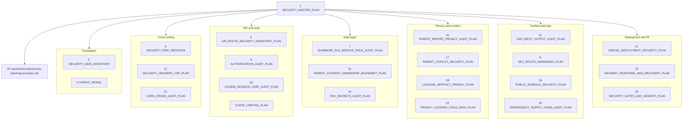

# Security Master Plan — Pre-Launch Planning Pass

## Scope and constraints (binding)

- Documentation only. No code edits. No Hebrew UI/content changes. No engine, bank, persona, or nightly changes.
- Frozen product: Hebrew learning site, grades 1-6, six subjects, parent + student roles only.
- Deferred (out of this pass and out of launch): schools/teachers, new grades/subjects, Child World, LLM live, short-report Copilot in production.
- Respects [docs/DO_NOT_REOPEN_WITHOUT_REGRESSION.md](docs/DO_NOT_REOPEN_WITHOUT_REGRESSION.md) — recording a suspected risk in the register is *not* a reopen.

## Pre-read (read-only, bounded)

Quick recon to ground the plan in current evidence. No more than these:

- [docs/auth-security-readonly-audit.md](docs/auth-security-readonly-audit.md) — existing critical/high/medium findings (baseline).
- [docs/site-map-and-protection-audit.md](docs/site-map-and-protection-audit.md) — route inventory + must-be-protected list.
- [docs/FINAL_PRODUCT_CLOSURE_MAP.md](docs/FINAL_PRODUCT_CLOSURE_MAP.md) — area K current state.
- [docs/parent-ai/copilot-turn-production.md](docs/parent-ai/copilot-turn-production.md) — Copilot trust boundary (HTTP 422).
- `pages/api/` directory listing + `.env.example` (to enumerate routes and flags only).

No deep reads of engine, banks, Hebrew copy, or nightly scripts.

## Document structure (25 + 1)

## Standard structure for each plan doc

Every doc under `docs/security/` follows the same template so the set is reviewable without surprises:

1. Scope and non-goals (one paragraph).
2. Current state (cite [docs/auth-security-readonly-audit.md](docs/auth-security-readonly-audit.md) + [docs/site-map-and-protection-audit.md](docs/site-map-and-protection-audit.md) where relevant; do not re-investigate).
3. Threat surface specific to this area.
4. Audit approach (read-only checklist; what files/queries/commands a future fix pass would run).
5. Suspected/known risks (each gets an ID like `R-AUTH-01` and is also linked in the risk register).
6. Pilot acceptance criteria.
7. Public-launch acceptance criteria.
8. Owner decisions required.
9. Out of scope / cross-references.

## Risk register design ([docs/security/SECURITY_RISK_REGISTER.md](docs/security/SECURITY_RISK_REGISTER.md))

Single authoritative ranked table. Every other doc *links* into this register, never duplicates rows.

Columns: `id`, `area`, `title`, `severity (P0/P1/P2/P3)`, `pilot-band (block/accept-risk/n.a.)`, `public-band (block/fix-before/accept-risk)`, `state (suspected/known/fixed)`, `evidence`, `reopen-condition`, `owner-decision-required`.

Severity definitions:
- P0 — exploitable, leaks child data or auth, or trivially abusable. Blocks public launch unconditionally.
- P1 — significant hardening gap; fix before public; may be accepted for closed pilot with explicit owner waiver.
- P2 — defense-in-depth; track but not blocking.
- P3 — cosmetic / nice-to-have.

Suspected risks already visible from current audits get pre-populated rows (e.g. dev coin top-up, PIN brute-force, NEXT_PUBLIC privileged flags). They are recorded as `suspected` or `known`; this is **not** a reopen of the security area — it is exactly what the closure protocol allows.

## Per-doc focus (one line each)

1. [docs/security/SECURITY_MASTER_PLAN.md](docs/security/SECURITY_MASTER_PLAN.md) — index, scope, pilot vs public banding, links to all 24 sub-docs.
2. [docs/security/SECURITY_DATA_INVENTORY.md](docs/security/SECURITY_DATA_INVENTORY.md) — every data category (Supabase tables, cookies, localStorage, `reports/`, `qa-visual-output/`, screenshots), sensitivity, retention.
3. [docs/security/THREAT_MODEL.md](docs/security/THREAT_MODEL.md) — actor model (anon, malicious parent, malicious student, opportunistic attacker, supply-chain), STRIDE-lite per surface.
4. [docs/security/SECURITY_RISK_REGISTER.md](docs/security/SECURITY_RISK_REGISTER.md) — central ranked register (only file allowed to add suspected risks).
5. [docs/security/API_ROUTE_SECURITY_INVENTORY_PLAN.md](docs/security/API_ROUTE_SECURITY_INVENTORY_PLAN.md) — every `pages/api/*` route, required auth, data scope, review status; built from the existing site map.
6. [docs/security/AUTHORIZATION_AUDIT_PLAN.md](docs/security/AUTHORIZATION_AUDIT_PLAN.md) — checklist for IDOR / vertical / horizontal escalation tests per role.
7. [docs/security/SUPABASE_RLS_SERVICE_ROLE_AUDIT_PLAN.md](docs/security/SUPABASE_RLS_SERVICE_ROLE_AUDIT_PLAN.md) — read-only review of RLS policies + service-role inventory; plan to push reads to user-scoped client where possible.
8. [docs/security/DEV_ROUTE_HARDENING_PLAN.md](docs/security/DEV_ROUTE_HARDENING_PLAN.md) — explicit list of dev/admin/simulator pages + APIs, production gating plan (server-only env, `NODE_ENV` hard gate, removal of hardcoded secrets — `pages/api/student/dev-add-coins.js` named).
9. [docs/security/RATE_LIMITING_PLAN.md](docs/security/RATE_LIMITING_PLAN.md) — strategy options (Vercel edge middleware, in-process, Upstash) for `/api/student/login`, `/api/parent/login`, hebrew utility endpoints; per-IP + per-account caps.
10. [docs/security/COOKIE_SESSION_CSRF_AUDIT_PLAN.md](docs/security/COOKIE_SESSION_CSRF_AUDIT_PLAN.md) — cookie flag audit (HttpOnly, Secure, SameSite), session model, CSRF posture for state-changing endpoints.
11. [docs/security/XSS_INPUT_OUTPUT_AUDIT_PLAN.md](docs/security/XSS_INPUT_OUTPUT_AUDIT_PLAN.md) — `dangerouslySetInnerHTML` scan plan, Hebrew text rendering checks, parent-input fields (student names), question-stem sanitizer reference.
12. [docs/security/SECURITY_HEADERS_CSP_PLAN.md](docs/security/SECURITY_HEADERS_CSP_PLAN.md) — CSP draft including Supabase, Vercel, fonts; HSTS, X-Frame-Options, Referrer-Policy, Permissions-Policy.
13. [docs/security/CORS_ORIGIN_AUDIT_PLAN.md](docs/security/CORS_ORIGIN_AUDIT_PLAN.md) — origin allowlist policy for `/api/*`; explicit Copilot turn route considerations.
14. [docs/security/ENV_SECRETS_AUDIT_PLAN.md](docs/security/ENV_SECRETS_AUDIT_PLAN.md) — every env flag from `.env.example` classified (public OK / server-only / secret); rotation plan.
15. [docs/security/PARENT_STUDENT_OWNERSHIP_BOUNDARY_PLAN.md](docs/security/PARENT_STUDENT_OWNERSHIP_BOUNDARY_PLAN.md) — concrete cross-tenant test matrix (parentA reads parentB's student, etc.).
16. [docs/security/PARENT_REPORT_PRIVACY_AUDIT_PLAN.md](docs/security/PARENT_REPORT_PRIVACY_AUDIT_PLAN.md) — raw-key scan policy, narrative safety, screenshot privacy at rest.
17. [docs/security/PARENT_COPILOT_SECURITY_PLAN.md](docs/security/PARENT_COPILOT_SECURITY_PLAN.md) — payload trust boundary (HTTP 422 enforced), `NEXT_PUBLIC_ENABLE_PARENT_COPILOT_ON_SHORT=false` invariant, scope-leak test list.
18. [docs/security/LOGGING_ARTIFACT_PRIVACY_PLAN.md](docs/security/LOGGING_ARTIFACT_PRIVACY_PLAN.md) — what nightly screenshots/state/run-summary contain; `.gitignore` posture; retention.
19. [docs/security/PUBLIC_SURFACE_SECURITY_PLAN.md](docs/security/PUBLIC_SURFACE_SECURITY_PLAN.md) — `/`, `/about`, `/contact`, `/gallery`, mleo-* mini-games; contact form abuse prevention; SEO/OG.
20. [docs/security/DEPENDENCY_SUPPLY_CHAIN_AUDIT_PLAN.md](docs/security/DEPENDENCY_SUPPLY_CHAIN_AUDIT_PLAN.md) — `npm audit` cadence, lockfile policy, postinstall scripts, transitive deps.
21. [docs/security/VERCEL_DEPLOYMENT_SECURITY_PLAN.md](docs/security/VERCEL_DEPLOYMENT_SECURITY_PLAN.md) — env separation (preview vs production), build settings, headers config, preview-deploy access policy.
22. [docs/security/PRIVACY_COOKIES_CHILD_DATA_PLAN.md](docs/security/PRIVACY_COOKIES_CHILD_DATA_PLAN.md) — child-data implications (Israel privacy law, EU/COPPA-style considerations), cookie banner posture, parental consent model.
23. [docs/security/INCIDENT_RESPONSE_AND_RECOVERY_PLAN.md](docs/security/INCIDENT_RESPONSE_AND_RECOVERY_PLAN.md) — playbooks: credential leak, data leak, abuse traffic, dependency CVE, rollback procedure.
24. [docs/security/SECURITY_GATES_AND_SIGNOFF_PLAN.md](docs/security/SECURITY_GATES_AND_SIGNOFF_PLAN.md) — pilot signoff gate, public-launch signoff gate, signoff matrix, re-audit triggers.
25. [reports/security/security-planning-summary.md](reports/security/security-planning-summary.md) — required summary with the 5 mandated sections (probable P0 / probable P1 / pilot-deferrable / owner decisions / next pass).

## Pilot vs public banding (drives every doc)

The summary in `reports/security/security-planning-summary.md` and the gates in doc 24 use this banding consistently:

- **Pilot (closed, invited testers, owner-supervised):** acceptable to defer P1s with documented owner waiver; P0s still block.
- **Public launch:** all P0 closed, all P1 closed or owner-waived with mitigation, P2 tracked, P3 deferred.

Each suspected risk in doc 4 carries both bands.

## What this pass will NOT do

- Will not modify any code, including `pages/api/student/dev-add-coins.js`.
- Will not run `npm audit` or any QA suite.
- Will not run Supabase queries or RLS introspection live (the RLS plan describes the read-only approach a later pass would take).
- Will not write to Supabase.
- Will not change `.gitignore`, `.env.example`, or any config.
- Will not generate fixes; only audit approaches and acceptance criteria.
- Will not duplicate the existing closure docs; will cross-reference them.

## End-of-pass deliverable

After producing the 25 docs, the summary at [reports/security/security-planning-summary.md](reports/security/security-planning-summary.md) will contain exactly:

1. What is probably **P0 before public launch** (drawn from doc 4).
2. What is probably **P1**.
3. What can be **deferred for controlled pilot** (with owner waiver flagged).
4. What must be **decided by the owner** (e.g. pilot vs public, child-data jurisdiction, rate-limit infra choice).
5. **Recommended next pass** after planning (a focused, scoped *fix* pass with its own gating — not a re-audit).

No engine reopen. No closure-area downgrade. The security area in [docs/FINAL_PRODUCT_CLOSURE_MAP.md](docs/FINAL_PRODUCT_CLOSURE_MAP.md) (K) stays `CLOSED-WATCH + partial OPEN`; the new docs simply give "partial OPEN" a concrete shape.