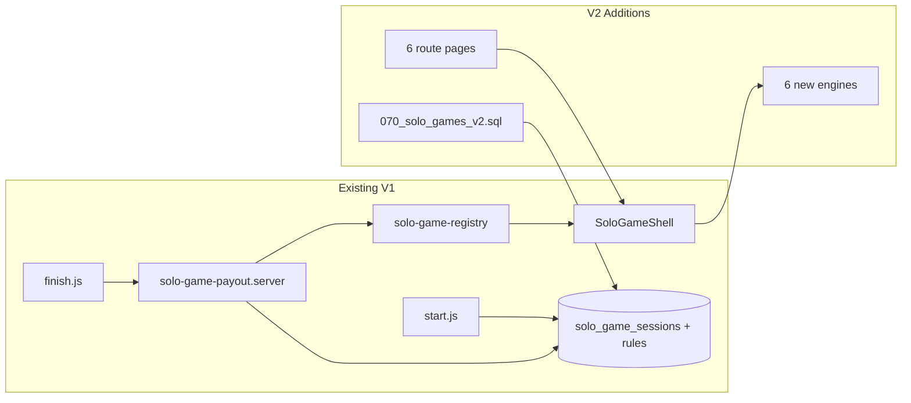

# תוכנית V2 — 6 משחקי Solo Leo נוספים

## עקרונות (ללא סטייה)

- אותו flow: **Entry → Playing → Settling → Finish** דרך [`SoloGameShell.jsx`](components/solo-games/SoloGameShell.jsx)
- אותם API: `POST /api/student/solo-games/start|finish` — **ללא שינוי חוזה** (metrics קיימים בלבד)
- מטבעות **רק בשרת** via [`solo-game-payout.server.js`](lib/solo-games/server/solo-game-payout.server.js) + `arcade_coin_apply` עם `source_type = solo_game`
- **6 engines חדשים** תחת `components/solo-games/engines/` — **לא** לערוך `pages/mleo-*`
- Hub (`/game`, `/student/solo-games`) מתעדכן אוטומטית מ-`SOLO_GAME_LIST` ברגistry



---

## 1. קבצים קיימים להרחבה

| קובץ | שינוי |
|------|--------|
| [`lib/solo-games/solo-game-registry.js`](lib/solo-games/solo-game-registry.js) | הוספת 6 keys + metadata (titleHe, emoji, blurbHe, hasDifficultyPicker, orientationHint) |
| [`components/solo-games/SoloGameShell.jsx`](components/solo-games/SoloGameShell.jsx) | הרחבת `ENGINE_MAP` ב-6 imports |
| [`lib/solo-games/server/solo-game-payout.server.js`](lib/solo-games/server/solo-game-payout.server.js) | 3 ענפי payout קיימים — **רק הרחבת `gameKey` sets** + caps ב-`validateSoloGameMetrics` |
| [`pages/_app.js`](pages/_app.js) | 6 routes חדשים ב-`STUDENT_PROTECTED_ROUTES` |
| [`scripts/tests/verify-solo-games-v1-smoke.mjs`](scripts/tests/verify-solo-games-v1-smoke.mjs) | הרחבת smoke: 10 routes + API start/finish לכל key חדש (אופציונלי אך מומלץ) |

**לא נוגעים:** 4 engines קיימים, API handlers (מלבד אם validation דורש constant חדש), online/offline/learning, `/mleo-*`, economy daily cap, feature flags.

Hub pages [`pages/game.js`](pages/game.js) ו-[`pages/student/solo-games/index.js`](pages/student/solo-games/index.js) — **אין שינוי חובה** (קוראים `SOLO_GAME_LIST`).

---

## 2. קבצים חדשים

### Migration (המשתמש מריץ ידנית)

- [`supabase/migrations/070_solo_games_v2.sql`](supabase/migrations/070_solo_games_v2.sql)

### Routes (thin wrappers — כמו [`catcher.js`](pages/student/solo-games/catcher.js))

- `pages/student/solo-games/leo-jump.js`
- `pages/student/solo-games/balloons.js`
- `pages/student/solo-games/maze.js`
- `pages/student/solo-games/picture-puzzle.js`
- `pages/student/solo-games/target-tap.js`
- `pages/student/solo-games/sort-shapes.js`

### Engines (props זהים ל-V1)

```js
{ autoStart, initialDifficulty?, onSessionEnd(metrics) }
```

- `components/solo-games/engines/MleoJumpEngine.jsx`
- `components/solo-games/engines/MleoBalloonsEngine.jsx`
- `components/solo-games/engines/MleoMazeEngine.jsx`
- `components/solo-games/engines/MleoPicturePuzzleEngine.jsx`
- `components/solo-games/engines/MleoTargetTapEngine.jsx`
- `components/solo-games/engines/MleoSortShapesEngine.jsx`

---

## 3. איך כל משחק עובד (קצר)

| game_key | משחק | סיום | difficulty picker |
|----------|------|------|---------------------|
| **leo-jump** | ריצה אוטומטית; tap/space/כפתור קפיצה; מכשולים + מטבעות | התנגשות | לא |
| **balloons** | בלונים עולים; tap לפיצוץ; טיimer 60s | זמן נגמר | לא |
| **maze** | מבוך grid; חצים/swipe; מצא יציאה | יציאה או timeout | כן (3×3→7×7 / 9×9 / 11×11) |
| **picture-puzzle** | sliding tiles תמונת ליאו | פאזל שלם או timeout | כן (3×3 / 4×4 / 5×5) |
| **target-tap** | מטרות מופיעות; tap לפני disappear | סיבוב נגמר | כן (מהירות + יעד hits) |
| **sort-shapes** | פריטים (צורה/צבע); tap פריט → tap מיכל | כל הפריטים ממוינים או timeout | כן (12 / 18 / 24 פריטים) |

**UX משותף לכל engine:**
- `sessionEndFiredRef` — קריאה יחידה ל-`onSessionEnd`
- `autoStart` — דילוג intro פנימי (entry ב-shell)
- `h-full min-h-0 overflow-hidden` — ללא scroll אופקי
- כפתורי מגע `min-h-[44px]`
- **leo-jump:** ניתן להעתיק/לפשט לוגיקת canvas מ-[`pages/mleo-runner.js`](pages/mleo-runner.js) ל-engine **חדש** — בלי לגעת ב-legacy

---

## 4. Metrics שכל משחק שולח (client → finish API)

שדות נתמכים כבר ב-[`finish.js`](pages/api/student/solo-games/finish.js) `normalizeMetrics`:

| game_key | score | didWin | difficulty | levelReached | mistakes | timeRemainingSec | durationMs |
|----------|-------|--------|------------|--------------|----------|------------------|------------|
| leo-jump | מרחק+מטבעות | false | — | floor(score/10) | — | — | כן |
| balloons | pops×10 | score≥150 | — | 0 | — | sec left | כן |
| maze | 500+time×3−moves×2 | reached exit | easy/med/hard | — | moves−par | sec left | כן |
| picture-puzzle | 1000−moves×15+time×2 | solved | easy/med/hard | — | max(0,moves−par) | sec left | כן |
| target-tap | hits×20 | hits≥target | easy/med/hard | — | misses | sec left | כן |
| sort-shapes | startPool−penalties | all sorted | easy/med/hard | — | wrong bins | sec left | כן |

**יעדי win לפי difficulty (client, מאומת server):**

- **target-tap:** easy 12 / medium 18 / hard 24 hits
- **sort-shapes:** easy 12 / medium 18 / hard 24 items
- **maze timeout:** easy 120s / medium 180s / hard 240s
- **picture-puzzle timeout:** easy 180s / medium 240s / hard 300s

---

## 5. חישוב מטבעות (3 תבניות קיימות — ללא מנוע חדש)

הרחבה ב-`calculateSoloGameCoins` / `validateSoloGameMetrics`:

### תבנית Arcade (כמו catcher/flyer)

**משחקים:** `leo-jump`, `balloons`, `target-tap`

```
coins = baseCoins + floor(score / scoreUnitDivisor) × perScoreUnit + levelReached × perLevelBonus
displayLevelHe = "רמה {levelReached}" (או "—" אם level=0)
```

### תבנית Puzzle (כמו puzzle)

**משחקים:** `maze`, `picture-puzzle`

```
win:  winBonus[diff] + floor(score / scoreBonusDivisor)
loss: lossCoins
displayLevelHe = difficultyLabelHe(diff)
```

### תבנית Memory (כמו memory)

**משחקים:** `sort-shapes`

```
win:  winBonus[diff] − mistakes×mistakePenalty + timeRemainingSec×timeBonusPerSec
loss: 0
displayLevelHe = difficultyLabelHe(diff)
```

### Seed rules (migration 070)

| game_key | payout_rules_json (תמצית) | maxCoins |
|----------|---------------------------|----------|
| leo-jump | base 45, per 5/10, level 15 | 480 |
| balloons | base 35, per 4/5, level 0 | 420 |
| target-tap | base 40, per 5/8, level 10 | 450 |
| maze | loss 15, win easy/med/hard 90/160/260, scoreDiv 40 | 400 |
| picture-puzzle | loss 15, win 100/180/300, scoreDiv 50 | 400 |
| sort-shapes | win 80/140/220, mistakePen 5, timeBonus 1 | 400 |

---

## 6. Migration SQL — `070_solo_games_v2.sql`

```sql
begin;

-- Drop + recreate CHECK on solo_game_sessions.game_key
alter table public.solo_game_sessions
  drop constraint if exists solo_game_sessions_game_key_check;
alter table public.solo_game_sessions
  add constraint solo_game_sessions_game_key_check
  check (game_key in (
    'catcher','puzzle','memory','flyer',
    'leo-jump','balloons','maze','picture-puzzle','target-tap','sort-shapes'
  ));

-- Drop + recreate CHECK on reward_economy_solo_game_rules.game_key
alter table public.reward_economy_solo_game_rules
  drop constraint if exists reward_economy_solo_game_rules_game_key_check;
alter table public.reward_economy_solo_game_rules
  add constraint reward_economy_solo_game_rules_game_key_check
  check (game_key in ( /* same 10 keys */ ));

-- INSERT 6 rows into reward_economy_solo_game_rules (on conflict do nothing)

commit;
```

**לא מריצים אוטומטית** — אחרי merge המפתחים החדשים ייכשלו ב-start עד הרצה ידנית.

---

## 7. Orientation לכל משחק

| game_key | orientationHint | הערה |
|----------|-----------------|------|
| leo-jump | `landscape-recommend` | ריצה רוחבית נוחה יותר |
| balloons | `null` | portrait + landscape |
| maze | `portrait-recommend` | grid ניווט |
| picture-puzzle | `portrait-recommend` | tiles גדולים |
| target-tap | `null` | מטרות בכל כיוון |
| sort-shapes | `null` | bins בשורה |

רמז רך בלבד via [`useSoloOrientationHint.js`](hooks/solo-games/useSoloOrientationHint.js) — **ללא** blocking gate.

---

## 8. סיכונים

| סיכון | mitigation |
|-------|------------|
| SQL לא הורץ → start נכשל ל-6 keys | תיעוד ברור; smoke test אחרי הרצה ידנית |
| Anti-cheat — score/moves מזויפים | caps per-game ב-`validateSoloGameMetrics` (כמו puzzle/memory היום) |
| 6 engines = объем UI | משחקים מינימליים; reuse תבנית `fireSessionEnd` + layout מ-memory/puzzle |
| leo-jump canvas במובייל | touch jump + `preventDefault` רק על canvas wrapper (כמו catcher) |
| picture-puzzle / maze מורכבים יחסית | לבנות אחרונים; grids קטנים ב-V2 |
| Hub עם 10 כרטיסים | grid קיים `sm:grid-cols-2` — מספיק |

---

## 9. סדר ביצוע מומלץ

1. **Migration 070** — SQL מוכן (לא מריץ)
2. **Registry** — 6 entries + `SOLO_GAME_KEYS`
3. **Payout server** — הרחבת 3 branches + validation caps + constants (par moves, score ceilings)
4. **_app routes** — 6 protected paths
5. **Engines — מהפשוט לכבד:**
   - `target-tap` → `balloons` → `sort-shapes`
   - `leo-jump` (canvas, מבוסס runner)
   - `maze` → `picture-puzzle`
6. **Shell ENGINE_MAP** + 6 page wrappers
7. **Smoke test** — הרחבה ל-10 משחקים; הרצה **אחרי** SQL ידני
8. **בדיקה ידנית:** משחק אחד מכל תבנית payout × start/finish × מטבעות × theme toggle אחרי חזרה

---

## Definition of Done

- 10 משחקים ב-hub; 6 routes חדשים עובדים end-to-end
- session ב-DB + `coin_transactions.source_type = solo_game`
- אין שינוי ב-4 משחקים V1 מלבד registry/nav
- legacy `/mleo-*` ללא שינוי
- SQL מוכן ב-070 — המשתמש מריץ ואז smoke מלא
