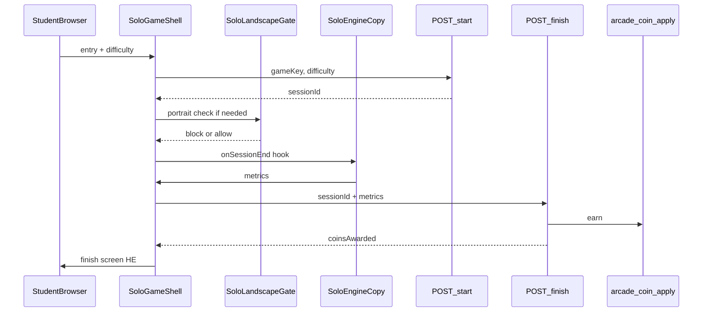

# תוכנית V1 סופית — Solo Leo + מטבעות + Responsive

## החלטות מחייבות

- **4 משחקים ב-V1:** catcher, puzzle, memory, **flyer**
- **Shell + מטבעות:** רק ב-`/student/solo-games/*`
- **Legacy ללא שינוי:** `/mleo-catcher`, `/mleo-puzzle`, `/mleo-memory`, `/mleo-flyer`, `/game` — **לא redirect, לא re-export, לא העברת קוד**
- **Engines חדשים:** העתקה ל-[`components/solo-games/engines/`](components/solo-games/engines/) + hooks בלבד בגרסה החדשה
- **אין feature flags / toggles / daily cap** — מערכת פעילה; rollback = git
- **client שולח metrics בלבד; server מחשב מטבעות**
- **Responsive חובה:** מובייל + דסקטופ — לא שלב עתידי
- **SQL:** migration מוכן; **לא מריצים** — המשתמש מריץ ידנית ואז smoke test

**לא נוגעים:** Runner, Penalty, online, offline, learning, `/games`, `/student/arcade`

---

## דרישות Responsive (חובה ב-V1)

### כללי (כל מסך: hub, entry, playing, settling, finish)

| דרישה | יישום |
|---|---|
| ללא גלילה אופקית | `overflow-x-hidden`, `max-w-full`, `100dvw` עם padding |
| כפתורים לא נחתכים | `min-h-[44px]`, `safe-area-inset-*`, flex column במובייל |
| HUD לא מסתיר משחק | HUD דק ב-shell; במנועים — הסרת fixed overlays כפולים ב-shellMode |
| כפתורי מגע גדולים | min 44×44px, `touch-action: manipulation` |
| מסכים קטנים | `100dvh`, `visualViewport`, breakpoints `sm/md` |
| דסקטופ | max-width container ~1200px, משחק ממורכז |
| מסכי shell בעברית | entry, finish, settling, landscape gate |

### מסך חיוב לרוחב

קומפוננטה משותפת: [`components/solo-games/SoloLandscapeGate.jsx`](components/solo-games/SoloLandscapeGate.jsx)

- מוצג כש-`requiresLandscape && portrait && mobile`
- טקסט: **"סובבו את המכשיר לרוחב כדי לשחק"**
- אייקון/אנימציה rotation; רקע מלא; לא מאפשר play עד landscape
- Hub + entry + finish — **portrait OK** (אין gate)
- Playing — לפי טבלת משחקים למטה

### החלטת orientation לכל משחק

| משחק | Portrait | Landscape | הערה |
|---|---|---|---|
| **catcher** | עובד | עובד | pads תחתון; canvas responsive (קיים) |
| **flyer** | עובד | עובד | hold-to-fly; canvas responsive (קיים) |
| **puzzle** | **Gate → landscape** | עובד | grid 6–8 cols לא שמיש בעמידה; legacy כבר מזהיר portrait |
| **memory** | עובד (3 רמות) | עובד | grid cards; shell מגביל V1 ל-easy/medium/hard |

> puzzle: במקום גרסה שבורה בעמידה — **חיוב landscape מסודר**.

### בדיקות חובה לפני סיום (Gate ל-merge)

לכל משחק × **desktop** + **mobile** (Chrome DevTools + מכשיר אמיתי אם אפשר):

1. `/student/solo-games` — hub נטען, 4 כרטיסים
2. Entry — כפתורים שלמים, בחירת רמה (אם יש)
3. Playing — אין scroll אופקי, HUD לא חוסם, controls נגישים
4. puzzle portrait — מופיע SoloLandscapeGate; landscape — משחק עובד
5. סיום — settling → finish עם ניקוד + מטבעות
6. "שחק שוב" — session חדש
7. "חזרה לעולם הילד" → `/student/home`
8. **אחרי SQL:** יתרה ב-`/api/student/me` עולה

**Smoke test מלא (post-SQL):** כניסת ילד → solo-games → משחק אחד → סיום → מטבעות → יתרה → חזרה home.

---

## ארכיטקטורה



---

## נתיבים

| Route | קובץ |
|---|---|
| `/student/solo-games` | `pages/student/solo-games/index.js` |
| `/student/solo-games/catcher` | `pages/student/solo-games/catcher.js` |
| `/student/solo-games/puzzle` | `pages/student/solo-games/puzzle.js` |
| `/student/solo-games/memory` | `pages/student/solo-games/memory.js` |
| `/student/solo-games/flyer` | `pages/student/solo-games/flyer.js` |

- `STUDENT_PROTECTED_ROUTES` ב-[`_app.js`](pages/_app.js) — 5 routes
- CTA ב-[`home.js`](pages/student/home.js): `/games` → `/student/solo-games`

---

## Shell UI

| קובץ | תפקיד |
|---|---|
| `lib/solo-games/solo-game-registry.js` | 4 משחקים + `requiresLandscape`, difficulties |
| `SoloGameShell.jsx` | entry → playing → settling → finish |
| `SoloGameEntryScreen.jsx` | responsive, עברית, בחירת רמה |
| `SoloGameFinishScreen.jsx` | ניקוד, רמה, מטבעות, שחק שוב, חזרה |
| `SoloGameSettlingOverlay.jsx` | "מחשבים תוצאה…" |
| `SoloLandscapeGate.jsx` | חיוב רוחב בעברית |
| `useSoloGameSession.js` | start/finish API |

**Layout shell:** `h-dvh max-h-dvh overflow-hidden flex flex-col` — מונע scroll כפול.

**Playing phase:** engine בתוך `flex-1 min-h-0 overflow-hidden`; shell מספק back affordance מינימלי (לא מסתיר canvas).

---

## Engines (העתקות + hooks)

מיקום: `components/solo-games/engines/Mleo*Engine.jsx`

**לא נוגעים ב-`pages/mleo-*.js`.**

Props בגרסה החדשה בלבד:

```js
{
  initialDifficulty?: string,
  autoStart?: boolean,
  onSessionEnd?: (metrics) => void,
  hideBuiltInIntro?: true,
  hideBuiltInFinish?: true,
}
```

| משחק | סיום | metrics |
|---|---|---|
| catcher | bomb | score, levelReached, didWin:false, durationMs |
| flyer | bomb | score, levelReached, didWin:false, durationMs |
| puzzle | time=0 | score, difficulty, didWin, timeRemainingSec:0 |
| memory | all matched / timeout | score, difficulty, didWin, mistakes, timeRemainingSec |

**flyer:** אם העתקה מסתבכת — engine פשוט flappy-style חדש **באותו סגנון** תחת אותה תיקייה (לא לתקן legacy flyer).

---

## API

### `POST /api/student/solo-games/start`
- Body: `{ gameKey, difficulty? }`
- Insert `solo_game_sessions` status=active
- Return `{ sessionId, startedAt }`

### `POST /api/student/solo-games/finish`
- Body: `{ sessionId, metrics }`
- Validate session + timing (min 5s, max per game)
- `calculateSoloGameCoins()` from DB rules
- `applyArcadeCoinMove`: source_type=`solo_game`, idempotency=`solo_game_{sessionId}`
- **תמיד** מעדכן session completed; מטבעות אם coins>0
- Return `{ coinsAwarded, breakdownHe, balanceAfter, didWin, score, displayLevelHe }`

**אין daily cap. אין feature flag.**

---

## DB — Migration `069_solo_games_v1.sql`

**`solo_game_sessions`:** id, student_id, game_key, difficulty, status, started_at, finished_at, metrics_json, coins_awarded, result_json

**`reward_economy_solo_game_rules`:** game_key PK, payout_rules_json, is_active

Seed ל-4 משחקים:

```json
catcher:  { "baseCoins": 50, "perScoreDivisor": 10, "perLevelBonus": 20, "maxCoins": 500 }
flyer:    { "baseCoins": 40, "perScoreDivisor": 12, "perLevelBonus": 15, "maxCoins": 450 }
puzzle:   { "winBonus": { "easy": 100, "medium": 200, "hard": 350 }, "lossCoins": 15 }
memory:   { "winBonus": { "easy": 80, "medium": 150, "hard": 250 }, "mistakePenalty": 5, "timeBonusPerSec": 1, "maxCoins": 400 }
```

**Ledger:** `student_coin_balances` + `coin_transactions` via `arcade_coin_apply`.

---

## סיכונים

| משחק | סיכון | mitigation |
|---|---|---|
| puzzle portrait | grid שבור | SoloLandscapeGate חובה |
| memory mobile | grid צפוף | easy/medium/hard בלבד; card size calc |
| catcher/flyer mobile | pads חוסמים | pads מעל safe-area; canvas `max-h` |
| flyer copy | קוד legacy מורכב | fallback engine פשוט |
| tampering | metrics מזויפים | server timing + caps |
| בלי SQL | API 500 | תיעוד "לא נבדק עד migration" |

---

## Touch Map

### חדשים
- `pages/student/solo-games/` (index + 4 games)
- `pages/api/student/solo-games/start.js`, `finish.js`
- `components/solo-games/` (shell, entry, finish, settling, landscape gate)
- `components/solo-games/engines/` (4 copies + hooks)
- `lib/solo-games/solo-game-registry.js`
- `lib/solo-games/server/solo-game-payout.server.js`
- `lib/solo-games/server/solo-game-session.server.js`
- `hooks/solo-games/useSoloGameSession.js`
- `supabase/migrations/069_solo_games_v1.sql`

### שינוי מינימלי
- [`pages/_app.js`](pages/_app.js) — protected routes
- [`pages/student/home.js`](pages/student/home.js) — CTA
- [`lib/rewards/server/economy-config.server.js`](lib/rewards/server/economy-config.server.js) — `requireSoloGameRules`

### לא נוגעים
- כל `pages/mleo-*.js`, `/game`, `/games`, arcade, offline, learning

---

## סדר ביצוע (רצף אחד — לא עוצרים באמצע)

1. Migration SQL (קובץ בלבד)
2. payout + session server + economy-config
3. start/finish API
4. העתקת 4 engines + hooks
5. Shell responsive + SoloLandscapeGate
6. 5 pages + home CTA + _app
7. בדיקות desktop ×4
8. בדיקות mobile ×4 (+ puzzle landscape gate)
9. **מסירת דוח:** קבצים/changed, SQL מלא, הוראות הרצה, מה נבדק/לא נבדק
10. **אחרי SQL מהמשתמש:** smoke test מלא end-to-end

---

## מסירה בסוף העבודה

1. רשימת קבצים חדשים
2. רשימת קבצים ששונו
3. SQL migration מלא (`069_solo_games_v1.sql`)
4. הוראות: `supabase db push` / הרצה ידנית ב-Supabase SQL Editor
5. מה נבדק **בלי SQL** (UI responsive, flows עד finish עם mock/error)
6. מה **דורש SQL** (מטבעות, ledger, session rows)
7. תוצאות smoke test (אחרי שהמשתמש מריץ SQL)
