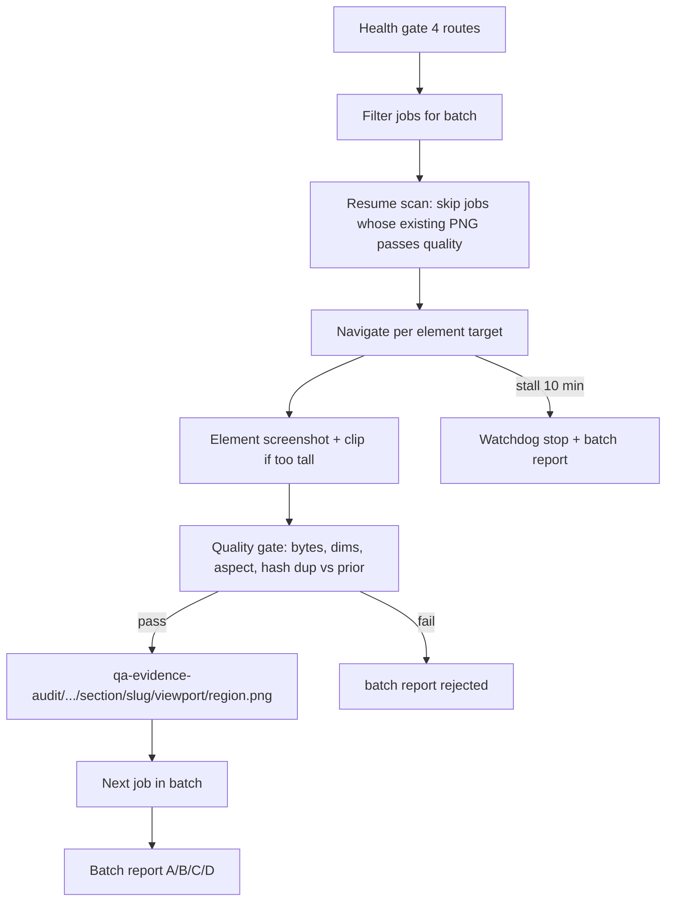

# Staged Help Center capture plan

Plan only. No edits to product code, no commit/push, no publish/verify/build until all batches pass review. All script changes stay inside [scripts/help-center/](scripts/help-center/) plus optional `help:*` script wiring in [package.json](package.json).

## 1. Batch breakdown (135 total manifest jobs)

- Batch A — Public help pages (no auth, ~15 jobs)
  - parents: `welcome-and-overview`, `create-parent-account`, `install-as-app`, `mobile-and-offline`
  - students: `student-login`
  - Routes: `/`, `/parent/login`, `/student/login`, `/offline`
- Batch B — Parent + parent-report (parent token + policy accept, ~60 jobs)
  - parents: `parent-dashboard-tour`, `add-students`, `student-pin-and-credentials`, `edit-or-delete-student`, `how-to-read-report`, `parent-copilot`, `monthly-rewards`
  - parent-report: all 13 manifest jobs incl. detailed
- Batch C — Student home/area (student API session, ~24 jobs)
  - students: `student-home-tour`, `choose-subject-and-grade`, `daily-missions`, `monthly-persistence`, `coins-and-arcade`, `avatar-and-profile`, `offline-games`, `answering-questions`
- Batch D — Subject masters (student session, ~36 jobs)
  - subjects: `math`, `geometry`, `english`, `science`, `hebrew`, `moledet-geography`, regions `question` + `explanation`
- Batch E — Exceptional fallback only (NOT an in-pass manual workaround)
  - Batch E is reserved for handling residual failures after A–D have been retried via the scripted `--only-failed` mechanism. It must not run hand-captured / manual screenshots silently into the pipeline.
  - Required behaviour during the automated pass:
    1. If A–D leave gaps, the agent first runs `help:capture:retry-failed --batch=<X>` for each affected batch.
    2. If any required manifest job still cannot be captured automatically after that retry, the agent stops and produces a blocker report listing the missing jobs and the last reason per job. The agent does not substitute manual evidence on its own.
    3. Any manual screenshot replacement is out of scope for the automated pass and requires a separate, explicit owner approval in a follow-up task. Without that approval, no manual file is read, copied, or published.
    4. Even with later approval, manual files must never be copied directly to [public/help-center/screenshots/](public/help-center/screenshots/) without first passing the same `help:data-safety-review` quality gate, and only as part of a fresh approved manifest with `publishAllowed === true`.
    5. No partial publish is allowed at any point.

Each batch only attempts jobs whose `routeForJob(job).auth` matches the batch (see [scripts/help-center/load-capture-jobs.mjs](scripts/help-center/load-capture-jobs.mjs)).

## 2. Per-batch contract



Per-batch output:

- `qa-evidence-audit/help-center/<section>/<slug>/<viewport>/<region>.png` (no batch subfolder; jobs are unique by section/slug/viewport/region)
- `docs/help-center/CAPTURE-PROGRESS-<batch>.json` with `expected`, `ok`, `skipped`, `rejected`, `stalled`, `startedAt`, `endedAt`
- A shared `data/help-center/_capture-state.json` of `{section/slug/viewport/region: {sha256, capturedAt, batch}}` (replaces hash dedup in review with cross-batch awareness)

Stop / skip rules:

- Health gate fail (4-route 200 with retries) -> abort batch, report
- Stall watchdog: 10 min with no new approved file or new rejection -> abort batch, report
- Per-job hard timeout 60 s on selector wait, 30 s on `prepare`/`afterGoto` (down from 90/120/180 s) so failures surface fast
- A job whose target is missing/empty must SKIP, never save a blank PNG (already enforced by [scripts/help-center/capture-targets.mjs](scripts/help-center/capture-targets.mjs))

## 3. Resume rules (no wipe)

- Capture script only deletes the audit tree when invoked with explicit `--reset` (new flag). Default and `--resume` keep prior raws.
- For each job, before capture: if PNG exists and `evaluateScreenshotFile` passes, increment OK and continue (already in [scripts/help-center/capture-help-screenshots.mjs](scripts/help-center/capture-help-screenshots.mjs) under `--resume`; flip default to "keep").
- Per-batch CLI accepts `--only-failed` which reads the prior `CAPTURE-PROGRESS-<batch>.json` and recaptures only the listed `rejected`+`skipped` jobs.

## 4. Mitigations for known failures

- Parent-report / copilot timeouts
  - Switch ready-wait selector from heading text `דוח להורים` to `.parent-report-print-summary-card` plus URL pathname check; abort job if not visible in 60 s.
  - Force `?period=month` so the report has data even when the seed is thin.
  - For copilot panel job, navigate directly to `__PARENT_REPORT__` and target `.parent-report-parent-ai-insight`. Skip if absent (do not wait 120 s).
- Mobile dashboard height cap
  - Always use `page.screenshot({ clip })` for mobile section captures and pass `clip.height = min(box.height, MAX_MOBILE_ELEMENT_HEIGHT)` before the quality gate (current code only clips when `box.height > maxHeight` — change to always clip on mobile + tablet).
  - For parent dashboard tour, target the `הילדים שלי` card list inside a stable wrapper and limit to first 1–2 child cards on mobile.
- Student session "ישראל not visible"
  - Replace innerText sniff in `ensureStudentSession` with API verification: call `/api/student/login` then `/api/student/me` (or reuse the same login response payload) and assert `student.full_name` includes "ישראל". Do not navigate to `/student/home` for the auth check; navigate only when the next job needs it.
  - If API verification fails -> abort batch, do not write any student screenshots.
- Blank/error screenshots
  - Existing inline gate already deletes failing files. Add: after `goto`, check `page.url().pathname` and bail if it ends in `/login` or `/error`.
- Duplicate cached screenshots
  - Drop URL-level cache entirely (already done in redesign). Cross-batch hash check via `_capture-state.json`: if two different jobs end up with same sha256, the second is rejected with `duplicate of <other job>`.
- Full-page mobile shots
  - Already removed (`page.screenshot fullPage:true` is gone). Enforced by `MAX_MOBILE_ELEMENT_HEIGHT` and aspect ratio caps in [scripts/help-center/capture-quality.mjs](scripts/help-center/capture-quality.mjs).

## 5. Publish rule

- `help:data-safety-review` only writes `screenshots-manifest-approved.json` with `publishAllowed: true` when:
  - every one of the 135 manifest paths has a raw file
  - every raw file passes size, dimensions, aspect, mobile-height cap
  - no two raw files share a sha256 across the manifest
- `help:publish-screenshots` already refuses partial publish (current redesign). Keep it.
- No partial publish, ever. No file copied to [public/help-center/screenshots/](public/help-center/screenshots/) unless `publishAllowed === true`.

## 6. Final verification rule

Run only after batches A–D have produced a full 135/135 scripted set (Batch E is not an in-pass shortcut — see Section 1):

1. `npm run help:data-safety-review` -> exit 0 with 135/135 approved
2. `npm run help:publish-screenshots` -> 135 files copied
3. `npm run help:verify` -> exit 0
4. `npm run build` attempted; an unrelated failure such as the known `/accessibility` issue is reported separately and does not retroactively unpublish.

### Acceptance criteria (automated pass)

- Automated completion of this task requires 135/135 manifest screenshots captured by the staged scripted pipeline (Batches A–D, with their own scripted `--only-failed` retries).
- Any manual evidence fallback is outside the automated pass and requires separate explicit owner approval in a follow-up task.
- If manual fallback is required to fill gaps, the run ends as a blocker — not as a completed pipeline. Publish, verify, and build are not attempted in that state.
- No partial publish is permitted. No file is copied to [public/help-center/screenshots/](public/help-center/screenshots/) unless the approved manifest is full (`publishAllowed === true`, 135/135).

## 7. Exact script changes (still inside `scripts/help-center/**`)

- [scripts/help-center/capture-help-screenshots.mjs](scripts/help-center/capture-help-screenshots.mjs)
  - Add CLI flags: `--batch=A|B|C|D|E`, `--only-failed`, `--reset`. Default behaviour: keep prior raws (no wipe). Remove the unconditional `rmSync(auditRoot)` path; only `--reset` wipes.
  - Filter `jobs` array by batch using `routeForJob(job).auth` and section.
  - Replace student session sniff (`innerText` for "ישראל") with API-based check using `/api/student/login` response payload only.
  - Always-clip on mobile/tablet; lower per-job timeouts (60 s selector, 30 s ready); keep stall watchdog at 10 min but compute it against the batch start.
  - Write per-batch `docs/help-center/CAPTURE-PROGRESS-<batch>.json`.
  - Read/write `data/help-center/_capture-state.json` for cross-batch hash awareness.
- [scripts/help-center/load-capture-jobs.mjs](scripts/help-center/load-capture-jobs.mjs)
  - Export a `filterJobsForBatch(jobs, batch)` helper. No change to job discovery.
- [scripts/help-center/capture-targets.mjs](scripts/help-center/capture-targets.mjs)
  - Tighten parent-report selectors: prefer `.parent-report-print-summary-card`, `.parent-report-recommendations-print`, `.pr-detailed-subject-letter`, `.parent-report-parent-ai-insight`. Drop heading-text waits.
- [scripts/help-center/data-safety-review.mjs](scripts/help-center/data-safety-review.mjs)
  - Read `_capture-state.json` for hashes when present (faster, avoids rehashing). No behavioural change to the gate.
- [scripts/help-center/publish-screenshots.mjs](scripts/help-center/publish-screenshots.mjs)
  - No change. Already refuses partial publish.
- [package.json](package.json) (script wiring only)
  - Add: `help:capture:a`, `help:capture:b`, `help:capture:c`, `help:capture:d` thin wrappers around `help:capture -- --batch=<x>`.
  - Add: `help:capture:retry-failed` -> `help:capture -- --only-failed --batch=<x>` (operator passes the batch).
  - No `help:capture:e` wrapper. Batch E is reserved for owner-approved follow-up handling and must not be runnable as a normal automated step.

No product code changes. No Supabase schema changes. No legal/security/policy edits.

## 8. Exact commands per batch

```
# Batch A (no auth)
npm run dev
npm run help:capture:a -- --base-url=http://127.0.0.1:3001

# Batch B (parent token + policy accept)
npm run help:capture:b -- --base-url=http://127.0.0.1:3001

# Batch C (student API)
npm run help:capture:c -- --base-url=http://127.0.0.1:3001

# Batch D (student API, subject masters)
npm run help:capture:d -- --base-url=http://127.0.0.1:3001

# Scripted retry of only previously failed jobs in a batch (try this first if A-D leave gaps)
npm run help:capture:retry-failed -- --batch=A --base-url=http://127.0.0.1:3001
npm run help:capture:retry-failed -- --batch=B --base-url=http://127.0.0.1:3001
npm run help:capture:retry-failed -- --batch=C --base-url=http://127.0.0.1:3001
npm run help:capture:retry-failed -- --batch=D --base-url=http://127.0.0.1:3001

# Batch E is not an in-pass step. Do NOT run during the automated pass.
# If gaps remain after the retries above, stop and produce a blocker report listing
# the missing jobs. Manual evidence handling requires separate explicit owner approval.

# Optional clean restart between problem batches
npx kill-port 3001
Remove-Item -Recurse -Force .next
npm run dev

# Final pipeline (only after all batches pass)
npm run help:data-safety-review
npm run help:publish-screenshots
npm run help:verify
npm run build
```

## 9. Files that would change

- [scripts/help-center/capture-help-screenshots.mjs](scripts/help-center/capture-help-screenshots.mjs)
- [scripts/help-center/load-capture-jobs.mjs](scripts/help-center/load-capture-jobs.mjs)
- [scripts/help-center/capture-targets.mjs](scripts/help-center/capture-targets.mjs)
- [scripts/help-center/data-safety-review.mjs](scripts/help-center/data-safety-review.mjs) (read-only addition for hash cache)
- [package.json](package.json) (new `help:capture:*` script wrappers only)
- New artifacts (not source code):
  - `docs/help-center/CAPTURE-PROGRESS-A.json` ... `CAPTURE-PROGRESS-D.json` (one per scripted batch)
  - `docs/help-center/CAPTURE-BLOCKER-REPORT.json` if A–D + scripted retries cannot reach 135/135
  - `data/help-center/_capture-state.json`
  - `data/help-center/screenshots-manifest-approved.json` (only after full 135/135 pass)
  - `qa-evidence-audit/help-center/**` (raw PNGs)
  - `public/help-center/screenshots/**` (only after publish, and only when full)

## 10. Bad / stale raw files to remove or ignore

The current 13 raws were captured under a wiping run with looser checks and an out-of-date student gate. They should be ignored, not republished. Two options for the operator:

- Soft: leave them in place; the new capture script will re-evaluate every job under stricter gates and overwrite or reject as needed.
- Hard: one-time `npm run help:capture -- --reset` before Batch A. Recommended only if disk artefacts confuse the operator. After this point, `--reset` should not be used again.

`docs/help-center/CAPTURE-PROGRESS-REPORT.json` is from a prior run. Treat it as historical; the new per-batch JSONs are the source of truth.

## 11. Scope confirmation

- All script changes live under [scripts/help-center/](scripts/help-center/) and one wiring change in [package.json](package.json).
- No edits to product auth, parent/student/report/learning code.
- No Supabase schema changes.
- No legal/security/policy file edits.
- No new dependencies.
- No commit, no push, no production domain.
- Plan only. Implementation requires explicit go-ahead.