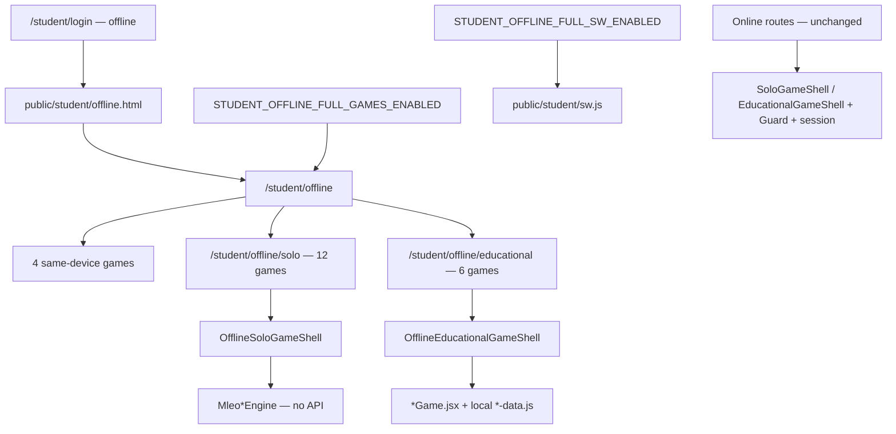

# תוכנית: מצב אופליין מלא — אפליקציית הילדים

## סטטוס אישור

**מאושר לבנייה (בגוף מסמך זה בלבד):** מסלול אופליין מלא תחת `/student/offline/**` — hub, 4 same-device, 12 solo, 6 educational, memory deck, shells, SW — **מאחורי דגלים**.

**לא מאושר:** כל דבר שלא מופיע במפורש במסמך זה. אם במהלך העבודה נדרש קובץ אסור — **לעצור ולשאול**.

---

## עקרונות עבודה (28 אילוצים — חובה)

| # | אילוץ |
|---|--------|
| 1 | רק אפליקציית הילדים (`/student/`) |
| 2 | רק משחקים |
| 3 | לא לימודים רגילים |
| 4 | לא מנוע שאלות |
| 5 | לא דוחות |
| 6 | לא הורים |
| 7 | לא מורים |
| 8 | לא מטבעות (במסלול offline) |
| 9 | לא קלפים (shop — memory offline = deck מקומי) |
| 10 | לא שמירת התקדמות |
| 11 | לא סנכרון |
| 12 | לא API במצב offline |
| 13 | לא DB |
| 14 | לא SQL |
| 15 | לא migrations |
| 16 | לא הרצות בשרת |
| 17 | לא לשנות install-app |
| 18 | לא לשנות manifest |
| 19 | לא לשנות icons |
| 20 | לא לשנות app name |
| 21 | לא לשנות start_url |
| 22 | לא לשנות scope |
| 23 | לא middleware |
| 24 | לא rewrites |
| 25 | לא לגעת ב-PWA scope שעובד עכשיו |
| 26 | לא לשנות parent/teacher SW |
| 27 | לא לשנות משחקים אונליין רגילים |
| 28 | לא לשנות `SoloGameShell.jsx` / `EducationalGameShell.jsx` הרגילים |

---

## דגלים (Feature Flags) — חובה

**מקור יחיד:** [`lib/offline/offline-flags.js`](lib/offline/offline-flags.js)

```javascript
export const STUDENT_OFFLINE_FULL_GAMES_ENABLED = false; // דגל 1
export const STUDENT_OFFLINE_FULL_SW_ENABLED = false;    // דגל 2
```

SW ייבא/ישכפל את הערך מקובץ config סטטי אחד (לא hardcode מפוזר). **לא** תלוי API/Admin — באופליין אין API.

### דגל 1 — `STUDENT_OFFLINE_FULL_GAMES_ENABLED`

| כבוי (`false`) | דלוק (`true`) |
|----------------|---------------|
| `/student/offline` — hub **בסיסי** בלבד | hub מלא: same-device + solo + educational |
| אין קטגוריות solo/educational חדשות | 3 אזורים + קישורים ל-sub-hubs |
| אין קישור גלוי ל-`/student/offline/solo` או `/educational` | כרטיסים + routes פעילים |
| **כניסה ישירה** ל-`/student/offline/solo/*` או `/educational/*` → **redirect ל-`/student/offline`** (לא shell) | 12 solo + 6 edu + shells פעילים |

**שימוש:** `OfflineHub.jsx`, sub-hubs, **route guard** בדפי solo/edu — לא רק הסתרת קישורים.

### דגל 2 — `STUDENT_OFFLINE_FULL_SW_ENABLED`

| כבוי (`false`) | דלוק (`true`) |
|----------------|---------------|
| [`public/student/sw.js`](public/student/sw.js) — **רק** מה שקיים היום + hub בסיסי | precache מורחב: כל routes offline + assets allowlist |
| לא precache מורחב ל-18 משחקים | bump `CACHE_NAME`, assets `/images/*`, `/sounds/*` לפי manifest |
| לא משנה אסטרטגיית cache רחבה | images/sounds cache-first לפי allowlist |
| לא מנקה cache חדש של משחקים מורחבים | activate cleanup ל-cache name חדש |
| לא משפיע על טעינת אפליקציה רגילה | navigation fallback נשמר: network → cache → offline.html |

**ברירת מחדל לפיתוח/merge:** שני הדגלים `false` — revert-safe; להדליק רק אחרי QA.

### חידודים אחרונים (חובה לפני merge)

#### 1. דגלים ב-commit — תמיד `false`

- **בסוף העבודה, ב-commit / merge:** `STUDENT_OFFLINE_FULL_GAMES_ENABLED` ו-`STUDENT_OFFLINE_FULL_SW_ENABLED` **חייבים להישאר `false`**.
- **מותר:** להדליק מקומית לבדיקה (למשחק smoke של 22 משחקים + SW מורחב).
- **אסור:** להשאיר דגל דלוק ב-commit, ב-PR, או ב-merge.
- **לפני commit:** לוודא `git diff lib/offline/offline-flags.js` (ו-`offline-sw-flags.js` אם קיים) — שני הערכים `false`.

#### 2. דגל UI — אין עקיפה ב-URL ישיר

כש-`STUDENT_OFFLINE_FULL_GAMES_ENABLED === false`:

- **אין** קישורים גלויים ל-solo/educational ב-hub.
- **גם כניסה ישירה** לנתיבים כמו `/student/offline/solo/puzzle` **לא** פותחת משחק — **אין עקיפת דגל**.
- התנהגות חובה (בכל דף solo/edu + sub-hubs):
  - `router.replace("/student/offline")` **או**
  - hub בסיסי / מסך "לא זמין כרגע" **ללא** shell משחק.
- **יישום:** guard מרכזי ב-[`pages/student/offline/solo/[gameKey].js`](pages/student/offline/solo/[gameKey].js), [`pages/student/offline/educational/[gameKey].js`](pages/student/offline/educational/[gameKey].js), ו-sub-hub index pages — בודק `STUDENT_OFFLINE_FULL_GAMES_ENABLED` **לפני** mount של shell.

#### 3. דגל SW — מנותק לחלוטין כש-`false`

כש-`STUDENT_OFFLINE_FULL_SW_ENABLED === false`, קוד ה-SW **לא** רץ (אפילו לא כ-dead code path שמשנה cache):

- **אין** precache מורחב (solo/edu routes, assets allowlist).
- **אין** bump ל-`CACHE_NAME` חדש.
- **אין** activate cleanup ל-cache names של precache מורחב.
- **אין** images/sounds cache-first allowlist חדש.
- **כן** נשאר: precache קיים (`offline.html`, hub, 4 same-device), `/_next/static` cache-first, navigation fallback — **זהה להתנהגות לפני הפיצ'ר**.

**יישום:** ב-[`public/student/sw.js`](public/student/sw.js) — בלוק `if (FULL_SW_ENABLED) { ... }` **מבודד**; כש-false, SW זהה למינימום המאושר (לא "almost the same").

**בדוח סיום (סעיף 6 + סעיף חדש 12):** לציין במפורש שנבדק diff של `sw.js` עם דגל false — אין שינוי התנהגות רחב מול baseline.

---

## ארכיטקטורה



---

## 1. מסך אופליין בסיסי — `public/student/offline.html`

**תפקיד:** במקום Chrome offline screen — דף Leo Kids שלנו.

**תוכן (מותר לעדכן עיצוב/טקסט, לא manifest/install):**
- עיצוב Leo Kids
- "אין חיבור לאינטרנט"
- כפתור "משחקים ללא אינטרנט" → `/student/offline`

**אסור:** לוגו פתיחה, שם אפליקציה, אייקון, manifest, install.

---

## 2. Hub ראשי — `/student/offline`

**קובץ:** [`pages/student/offline/index.js`](pages/student/offline/index.js) + [`components/offline/OfflineHub.jsx`](components/offline/OfflineHub.jsx)

### אסור ב-hub

- `GameAccessGuard`
- `useStudentGameAccess`
- `fetch` ל-`/api/student/*`
- loading שמחכה לשרת
- קישור שמוציא מחוץ ל-`/student/offline` (לא `/student/games`, לא `/student/login`)

### Hub בסיסי (דגל 1 כבוי)

- הודעה: "משחקים ללא אינטרנט — ללא שמירה וללא פרסים"
- 4 משחקי אותו-מכשיר בלבד

### Hub מלא (דגל 1 דלוק)

- אותה הודעה
- **אזור 1:** משחקים על אותו מכשיר (4)
- **אזור 2:** משחקי ליאו / סולo → `/student/offline/solo`
- **אזור 3:** משחקים חינוכיים → `/student/offline/educational`
- חזרה פנימית בלבד בתוך `/student/offline/**`

---

## 3. משחקים על אותו מכשיר — 4 קיימים

**Routes (קיימים, מתוקנים למסלול offline):**

| משחק | Route |
|------|-------|
| איקס עיגול | `/student/offline/tic-tac-toe` |
| אבן · נייר · מספריים | `/student/offline/rock-paper-scissors` |
| קרב הקשות | `/student/offline/tap-battle` |
| התאמת זיכרון | `/student/offline/memory-match` |

**יישום:** re-export מ-[`pages/offline/*`](pages/offline/) — **הסרת `GameAccessGuard` / API רק** כש-path הוא `/student/offline/*` (detect via router או wrapper `OfflineSameDeviceGameShell`).

**מטרה:** 4 משחקים עובדים במצב טיסה מתוך hub.

---

## 4. משחקי סולo — 12

**Hub:** `/student/offline/solo`  
**Shell:** [`components/solo-games/OfflineSoloGameShell.jsx`](components/solo-games/OfflineSoloGameShell.jsx) (חדש)

| # | משחק | Route offline |
|---|------|---------------|
| 1 | תופס עם ליאו | `/student/offline/solo/catcher` |
| 2 | ליאו במטוס | `/student/offline/solo/flyer` |
| 3 | חידת ליאו | `/student/offline/solo/puzzle` |
| 4 | זיכרון ליאו | `/student/offline/solo/memory` |
| 5 | ליאו קופץ | `/student/offline/solo/leo-jump` |
| 6 | פיצוץ בלונים | `/student/offline/solo/balloons` |
| 7 | מבוך ליאו | `/student/offline/solo/maze` |
| 8 | פאזל תמונה | `/student/offline/solo/picture-puzzle` |
| 9 | קליעה למטרה | `/student/offline/solo/target-tap` |
| 10 | מיון צורות | `/student/offline/solo/sort-shapes` |
| 11 | בלוקים חכמים | `/student/offline/solo/smart-blocks` |
| 12 | חיתוך פירות | `/student/offline/solo/fruit-slice` |

**דפים:** [`pages/student/offline/solo/index.js`](pages/student/offline/solo/index.js), [`pages/student/offline/solo/[gameKey].js`](pages/student/offline/solo/[gameKey].js)

**מנועים:** קיימים ב-[`components/solo-games/engines/`](components/solo-games/engines/) — **ללא שינוי** (חוץ memory — סעיף 6).

---

## 5. משחקים חינוכיים — 6

**Hub:** `/student/offline/educational`  
**Shell:** [`components/educational-games/OfflineEducationalGameShell.jsx`](components/educational-games/OfflineEducationalGameShell.jsx) (חדש)

| # | משחק | Route offline | Data מקומי |
|---|------|---------------|------------|
| 1 | מפעל המיחזור | `/student/offline/educational/recycling-factory` | `recycling-factory-data.js` |
| 2 | המכולת של ליאו | `/student/offline/educational/leo-supermarket` | `leo-supermarket-data.js` |
| 3 | מעבדת הניסויים | `/student/offline/educational/leo-lab` | `leo-lab-data.js` |
| 4 | המתנות של ליאו | `/student/offline/educational/leo-gifts` | `leo-gifts-data.js` |
| 5 | המאפייה של ליאו | `/student/offline/educational/leo-bakery` | `leo-bakery-data.js` |
| 6 | מסלול המספרים | `/student/offline/educational/leo-number-path` | `leo-number-path-data.js` |

**דפים:** [`pages/student/offline/educational/index.js`](pages/student/offline/educational/index.js), [`pages/student/offline/educational/[gameKey].js`](pages/student/offline/educational/[gameKey].js)

---

## 6. זיכרון ליאו — deck מקומי

**בעיה:** [`MleoMemoryEngine`](components/solo-games/engines/MleoMemoryEngine.jsx) קורא [`buildMemoryDeckFromShop()`](lib/solo-games/memory-shop-cards.client.js) → shop API.

**מאושר:**
- [`lib/offline/offline-memory-deck.js`](lib/offline/offline-memory-deck.js) — חפיסה מתוך `/public/rewards/cards/` (allowlist)
- prop אופציונלי ב-`MleoMemoryEngine`: `deckBuilder` — **default = `buildMemoryDeckFromShop`** (אונליין ללא שינוי)
- רק `OfflineSoloGameShell` עם `gameKey="memory"` מעביר `buildMemoryDeckOffline`

---

## Shells אופליין — התנהגות

### `OfflineSoloGameShell.jsx` / `OfflineEducationalGameShell.jsx`

| | Offline shell | Online shell (לא נוגעים) |
|---|---------------|---------------------------|
| GameAccessGuard | לא | כן |
| start/finish session | לא | כן |
| API | לא | כן |
| מטבעות / פרסים | `coinsAwarded=0` | כן |
| handleStart | `setPhase("playing")` | `await startSession()` |
| handleSessionEnd | finish מקומי | `finishSession()` → API |
| טקסט סיום | "משחק מקומי — ללא שמירה וללא פרסים" | פרסים |
| חזרה | `/student/offline`, `/solo`, `/educational` | `/student/game` וכו' |
| onSessionEnd | **חובה** — מניעת תקיעה ב-interstitial | כן |

**לא:** `SoloGameAdSlot` (אופציונלי — להסיר באופליין).

---

## Service Worker — `public/student/sw.js` בלבד

**מותר לשנות:** רק [`public/student/sw.js`](public/student/sw.js)

**אסור:** `public/parent/sw.js`, `public/teacher/sw.js`, root SW (אלא אם הכרחי — לא מתוכנן), manifest, install-app

### תמיד (גם דגל 2 כבוי)

- precache `/student/offline.html`
- precache `/student/offline` (hub בסיסי)
- precache 4 same-device routes (קיים)
- `/_next/static/*` — cache-first
- navigation: network-first → cache → `/student/offline.html`
- **לא** mock/intercept ל-`/api/*`

### כש-`STUDENT_OFFLINE_FULL_SW_ENABLED === true`

- bump `CACHE_NAME` (למשל `student-offline-v2`)
- precache: `/student/offline/solo`, `/student/offline/educational`, כל 18 game URLs
- allowlist assets מ-[`lib/offline/offline-precache-manifest.js`](lib/offline/offline-precache-manifest.js):
  - `/images/*` (candy, game backgrounds, puzzle, leo sprites)
  - `/sounds/*` (flap.mp3 וכו')
  - `/rewards/cards/common/card_back.webp` + קלפים ל-memory offline
- images/sounds: cache-first לפי allowlist

### כש-`STUDENT_OFFLINE_FULL_SW_ENABLED === false`

- **לא** precache מורחב ל-18 משחקים
- **לא** משנה אסטרטגיית cache רחבה מעבר לקיים
- **לא** מנקה cache חדש של משחקים מורחבים

---

## רשימת קבצים — מלאה

### קבצים חדשים (מותרים)

| קובץ | תפקיד |
|------|--------|
| [`lib/offline/offline-flags.js`](lib/offline/offline-flags.js) | דגלים — מקור יחיד |
| [`lib/offline/offline-game-catalog.js`](lib/offline/offline-game-catalog.js) | רשימות solo/edu/same-device + metadata |
| [`lib/offline/offline-precache-manifest.js`](lib/offline/offline-precache-manifest.js) | URLs + assets ל-SW (דגל 2) |
| [`lib/offline/offline-memory-deck.js`](lib/offline/offline-memory-deck.js) | חפיסת memory מקומית |
| [`lib/offline/offline-sw-flags.js`](lib/offline/offline-sw-flags.js) | עותק/re-export ל-SW (אם SW לא יכול import ES modules — duplicate const מסונכרן) |
| [`components/offline/OfflineHub.jsx`](components/offline/OfflineHub.jsx) | Hub ראשי |
| [`components/offline/OfflineSoloGamesHub.jsx`](components/offline/OfflineSoloGamesHub.jsx) | Hub solo |
| [`components/offline/OfflineEducationalGamesHub.jsx`](components/offline/OfflineEducationalGamesHub.jsx) | Hub educational |
| [`components/offline/OfflineSameDeviceWrapper.jsx`](components/offline/OfflineSameDeviceWrapper.jsx) | wrapper ל-4 משחקים — ללא Guard |
| [`components/offline/OfflineReconnectBanner.jsx`](components/offline/OfflineReconnectBanner.jsx) | "חזר חיבור" — אופציונלי |
| [`components/solo-games/OfflineSoloGameShell.jsx`](components/solo-games/OfflineSoloGameShell.jsx) | shell solo offline |
| [`components/educational-games/OfflineEducationalGameShell.jsx`](components/educational-games/OfflineEducationalGameShell.jsx) | shell edu offline |
| [`pages/student/offline/solo/index.js`](pages/student/offline/solo/index.js) | |
| [`pages/student/offline/solo/[gameKey].js`](pages/student/offline/solo/[gameKey].js) | |
| [`pages/student/offline/educational/index.js`](pages/student/offline/educational/index.js) | |
| [`pages/student/offline/educational/[gameKey].js`](pages/student/offline/educational/[gameKey].js) | |

### קבצים לעריכה (מותרים)

| קובץ | שינוי |
|------|--------|
| [`public/student/offline.html`](public/student/offline.html) | עיצוב/טקסט (לא manifest) |
| [`public/student/sw.js`](public/student/sw.js) | precache מותנה בדגל 2 |
| [`pages/student/offline/index.js`](pages/student/offline/index.js) | hub סטטי + דגל 1 |
| [`pages/student/offline/tic-tac-toe.js`](pages/student/offline/tic-tac-toe.js) (ו-3 אחרים) | wrapper offline / הסרת Guard |
| [`pages/offline/tic-tac-toe.js`](pages/offline/tic-tac-toe.js) (ו-3) | **רק אם** נדרש detect path — מינימום |
| [`components/solo-games/engines/MleoMemoryEngine.jsx`](components/solo-games/engines/MleoMemoryEngine.jsx) | prop `deckBuilder` optional — default unchanged |

### קבצים אסורים (לא לגעת)

- `pages/student/install-app*`
- `public/manifest*.webmanifest`, `public/manifest.json`
- `public/icons/**` (שינוי)
- [`pages/_app.js`](pages/_app.js) — **לא** אלא אם הוכחה שחייב + אישור מפורש
- `middleware*`, `next.config.js` rewrites/redirects
- `public/parent/sw.js`, `public/teacher/sw.js`
- [`pages/student/solo-games/*`](pages/student/solo-games/) (online)
- [`pages/student/educational-games/*`](pages/student/educational-games/) (online)
- [`components/solo-games/SoloGameShell.jsx`](components/solo-games/SoloGameShell.jsx)
- [`components/educational-games/EducationalGameShell.jsx`](components/educational-games/EducationalGameShell.jsx)
- parent/teacher pages/components
- DB / SQL / migrations / server scripts

---

## Rollback

**Branch:** `fix/student-offline-full-games`

**אסטרטגיה:**
- כל השינוי על branch נפרד
- commit(s) ברורים — merge commit אחד ל-main (אם מאושר)
- **לא** DB, SQL, migrations, הרצות שרver

**החזרה:**
```bash
# revert merge commit
git revert -m 1 <merge-commit-hash>

# או revert commit בודד
git revert <commit-hash>
```

**דגלים:** להחזיר `STUDENT_OFFLINE_FULL_GAMES_ENABLED` ו-`STUDENT_OFFLINE_FULL_SW_ENABLED` ל-`false` — מכבה UI + SW מורחב **בלי** revert מלא (אם routes כבר deployed).

**בסיום יישום:** commit hash + הוראות revert בדוח.

---

## Build ובדיקות (מבוצעות על ידי המפתח — דוח אחד בסוף)

המשתמש **לא** בודק אחרי כל שלב. בסיום:

1. `npm run build`
2. אין שינוי ב-manifest / install-app / icons / start_url / scope
3. אין שינוי ב-parent/teacher SW
4. אין API calls תחת `/student/offline/**` (grep + DevTools offline)
5. כל routes קיימים → 200 (smoke) — **עם דגלים `false` ב-commit**
6. **עם דגלים `false` (מצב commit):**
   - `/student/offline` — hub בסיסי, 4 same-device
   - `/student/offline/solo/puzzle` → redirect ל-`/student/offline` (לא משחק)
   - SW — diff התנהגות = baseline (אין precache מורחב)
7. **בדיקה מקומית בלבד** (דגלים `true`, לא ב-commit): כל 22 משחקים נפתחים
8. אונליין רגיל:
   - `/student/game`
   - `/student/solo-games/puzzle`
   - `/student/educational-games/recycling-factory`
9. `SoloGameShell.jsx` — diff ריק / לא השתנה
10. `EducationalGameShell.jsx` — diff ריק / לא השתנה
11. אין middleware/rewrites חדשים
12. **אימות דגל SW מנותק:** עם `STUDENT_OFFLINE_FULL_SW_ENABLED=false` — אין precache מורחב, אין CACHE_NAME חדש, אין cleanup cache מורחב (השוואה ל-baseline)
13. **אימות commit:** `offline-flags.js` — שני הדגלים `false` בקובץ שעולה ל-commit

---

## דוח סיום חובה (13 סעיפים)

בסיום יישום — להחזיר:

1. **האם התוכנית עודכנה** — כן/לא + קישור לקובץ plan
2. **רשימת קבצים ששונו**
3. **רשימת קבצים שנוספו**
4. **אישור שלא נגעת באסורים** — checklist 28 אילוצים
5. **כל המשחקים שהוכנסו לאופליין** — 22 (4 same-device + 12 solo + 6 edu) — קוד קיים, פעיל רק כשדגל UI דלוק
6. **דגלים ב-commit** — **שניהם `false`** (חובה); ציין אם נבדקו מקומית עם `true` ואז הוחזרו
7. **תוצאות build** — pass/fail + errors (עם דגלים `false`)
8. **תוצאות URL smoke** — טבלת routes + status; **כולל** `/student/offline/solo/puzzle` → redirect ל-hub כשדגל UI כבוי
9. **API calls תחת `/student/offline`** — none / רשימה אם נמצא
10. **Rollback** — commit hash + `git revert` commands
11. **מה לבדוק באנדרואיד** — checklist (flight mode, icon launch, hub בסיסי עם דגלים false; הדלקה מקומית לבדיקת משחקים מלאה)
12. **אימות דגל SW מנותק** — עם `STUDENT_OFFLINE_FULL_SW_ENABLED=false`: אין precache מורחב, אין CACHE_NAME חדש, אין cleanup cache מורחב, התנהגות SW = baseline (מה נבדק ומה התוצאה)
13. **אימות אין עקיפת דגל UI** — URL ישיר ל-solo/edu עם דגל כבוי → redirect/hub, לא shell משחק

---

## סיכונים

| סיכון | mitigation |
|-------|------------|
| שינוי accidental ב-online shells | shells חדשים בלבד; diff check בדוח |
| SW cache גדול | דגל 2; allowlist ממוקד; bump CACHE_NAME |
| Memory regression online | `deckBuilder` default = shop |
| `_app.js` temptation | לא נוגעים; `/student/offline/**` כבר מחוץ ל-`STUDENT_PROTECTED_ROUTES` |
| parent/teacher regression | רק `public/student/sw.js` |
| deploy לפני QA | דגלים `false` default; revert branch |

---

## סדר יישום (פנימי — build אחד, דוח אחד)

1. `lib/offline/*` (flags, catalog, precache manifest, memory deck)
2. `OfflineHub` + refactor `pages/student/offline/index.js`
3. Same-device — wrapper ללא Guard
4. `OfflineSoloGameShell` + solo routes (12)
5. `OfflineEducationalGameShell` + edu routes (6)
6. `MleoMemoryEngine` — `deckBuilder` prop
7. `public/student/sw.js` — conditional precache (דגל 2)
8. `public/student/offline.html` — polish אם נדרש
9. `npm run build` + smoke + דוח 11 סעיפים

**ברירת מחדל merge / commit:** `STUDENT_OFFLINE_FULL_GAMES_ENABLED = false`, `STUDENT_OFFLINE_FULL_SW_ENABLED = false` — **חובה ב-commit**. קוד מוכן; פיצ'er כבוי עד QA והדלקה ידנית. בדיקה מקומית עם `true` — מותר; לפני commit — **להחזיר ל-`false`**.
