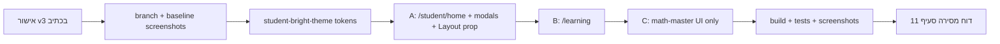

# v3 — Direct 3 Pages Student Redesign Pilot

---

## שער אישור (חובה לקרוא לפני כל פעולה)

| | |
|---|---|
| **סטטוס נוכחי** | **תוכנית בלבד — v3** |
| **מותר עכשיו** | קריאה ואישור/הערות על קובץ זה |
| **אסור עכשיו** | קוד, עיצוב עמודים, שינוי קבצים, feature flag, mockup נפרד, התקדמות לפי הודעות צ'אט |
| **מתי מתחילים ביצוע** | רק אחרי **אישור מפורש בכתב** שלך על תוכנית v3 שלמה |
| **מה קורה אחרי האישור** | ביצוע **ישיר ומלא** של הפיילוט על **3 העמודים בלבד**, **בלי feature flag**, **בלי עצירות ביניים** |
| **הרחבה מעבר ל-3 עמודים** | אסורה בלי אישור נפרד בכתב |

---

## 1. הגדרת מטרה

### מה רוצים להשיג

- עיצוב **חדש, בהיר, רך, צבעוני וידידותי יותר לילדים** — במקום המראה הכהה, הגיימרי והכבד הקיים.
- **חוויית תלמיד בלבד** — 3 עמודים בפיילוט.
- **שינוי ויזואלי בלבד** — אותה פונקציונליות, אותם נתונים, אותה לוגיקה.

### מה זה לא

| לא | הסבר |
|----|------|
| שינוי מערכת כולל | אין redesign של כל האפליקציה |
| שינוי פורטלים אחרים | הורים, מורים, בית ספר, אדמין — ללא נגיעה עיצובית |
| שינוי לוגיקה | state, handlers, flows — ללא שינוי |
| שינוי נתונים / DB | אין migration, אין schema |
| שינוי API | אין endpoints חדשים/שינוי חוזים |
| שינוי דוחות | parent-report, teacher reports — ללא נגיעה |
| שינוי מנוע אבחוני | diagnosis, active diagnosis — ללא נגיעה |
| feature flag | אין toggle; שינוי ישיר ב-3 עמודים; rollback דרך git |

---

## 2. סקופ מדויק לביצוע

הפיילוט כולל **בדיוק 3 עמודים**:

| # | Route | תיאור | היקף |
|---|-------|--------|------|
| A | `/student/home` | דשבורד תלמיד | עמוד + modals/panels שנפתחים ממנו |
| B | `/learning` | מרכז משחקי הלימוד | עמוד hub + כרטיסי מקצוע |
| C | `/learning/math-master` | תרגול חשבון | **מסך שאלה / תרגול בלבד** — UI בלבד |

**אסור להרחיב** ל-masters אחרים, login, דף בית ציבורי, ספרים, ארקייד, פעילויות כיתה, worksheets flow, curriculum — **בלי אישור נפרש בכתב**.

---

## 3. מה לא עושים (רשימת איסורים מפורשת)

### תשתית / גלובלי

- **אין feature flag** — לא env var, לא toggle, לא dual-theme runtime.
- **אין שינוי `body`** ב-[`styles/globals.css`](styles/globals.css) או ברירת מחדל גלובלית אחרת.
- **אין שינוי גלובלי** ב-[`components/Layout.js`](components/Layout.js) שמשפיע על כל האתר (רק prop/variant מ-3 העמודים).
- **אין שינוי** [`pages/_app.js`](pages/_app.js) לצורך theme (אלא אם נדרש import CSS scoped — רק מ-3 העמודים).

### פורטלים ודוחות

- אין שינוי עיצובי: הורים, מורים, בית ספר, אדמין, דוחות.

### לוגיקה / backend / תוכן

- אין שינוי API, DB, הרשאות, generators, scoring, מנוע אבחוני, תוכן שאלות.

### math-master / תרגול (behavior)

- אין שינוי `data-testid`.
- אין שינוי topic selection.
- אין שינוי submit / בדיקת תשובה.
- אין שינוי התנהגות מקלדת מובייל.
- אין שינוי התנהגות scratchpad / דף טיוטה.
- אין שינוי explanation logic (תוכן/שלבים).

---

## 4. עקרונות עיצוב

| עקרון | יישום בפיילוט |
|-------|----------------|
| רקע בהיר | gradient עדין: `#F4F9FF` (תכלת-שמיים) → `#FFF9F2` (שמנת); או `#F8FAFC` solid במסך תרגול |
| כרטיסים | לבן `#FFFFFF`, `rounded-2xl`, `border-slate-200/80`, צל `shadow-md shadow-slate-200/40` |
| צבעי מקצוע | accent bar רך (לא ניאון): sky, teal, violet, lime, rose, amber — saturation בינונית |
| כפתורים | `min-h-12` (48px), `rounded-xl`, solid עם contrast AA; משני = outline |
| טיפוגרפיה | כותרות `text-slate-800`, גוף `text-slate-600`, שאלה `text-slate-900` bold |
| מסך תרגול | פחות HUD; שאלה במרכז; רקע בהיר; ללא dot pattern / glow גיימרי |
| עברית | RTL מלא; נוסחאות LTR ב-`StudentQuestionDisplay` — לשמר |
| mobile-first | 375px קודם; touch targets ≥ 44px; safe-area |
| פונקציונליות | כל flow, API, state — **זהים** |

### פלטת accent למקצועות (hub `/learning`)

| מקצוע | צבע accent | Hex (הנחיה) |
|-------|------------|-------------|
| חשבון | sky | `#38BDF8` |
| גאומטריה | teal | `#2DD4BF` |
| אנגלית | violet | `#A78BFA` |
| מדעים | lime | `#84CC16` |
| עברית | rose | `#FB7185` |
| מולדet וגיאוגרפיה | amber | `#FBBF24` |

---

## 5. תיאור מפורט — כל אחד מ-3 העמודים

---

### A. `/student/home` — דשבורד תלמיד

**קובץ ראשי:** [`pages/student/home.js`](pages/student/home.js)

#### מצב קיים (בקצרה)

- רקע כהה דרך [`Layout.js`](components/Layout.js): gradient `#050816` → `#0b1020`.
- Hero: `border-emerald-500/25`, `from-emerald-950/50`, טקסט לבן/emerald.
- Tiles: glass כהה `border-white/10`, `from-white/[0.07]`, hover emerald.
- Stat chips, monthly journey: `bg-black/40`, emerald progress.
- Modals: [`StudentHomeModal.jsx`](components/student/StudentHomeModal.jsx) — panels כהים.

#### מה משתנה ויזואלית

- Wrapper עמוד: רקע בהיר (gradient תכלת-שמנת) **בתוך תוכן העמוד** + `Layout` עם prop `studentBrightShell` (header/footer בהירים — ראה סעיף 7).
- Hero card: לבן, צל sky עדין, avatar במסגרת sky, שם `slate-800`, CTA sky solid + משחקים outline.
- Tiles: כרטיסים לבנים, hover `border-sky-200`.
- Monthly journey: track `#E2E8F0`, fill sky→teal, טקסט `slate-700`.
- Stat chips: רקע לבן/אפור בהיר.
- Modals + panels: overlay `slate-900/40`, panel לבן.

#### מה לא משתנה

- `/api/student/home-profile`, `buildStudentHomeView`, auth redirect.
- מבנה tiles, modal keys, navigation hrefs.
- `StudentDailyMissionsPanel` logic; רק classes.
- classroom activities / worksheets — fetch ו-display logic.

#### רכיבים מושפעים

| רכיב | סוג שינוי |
|------|-----------|
| `pages/student/home.js` | classes inline + `DashboardTile`, `MonthlyJourneySection`, hero |
| `StudentHomeModal.jsx` | visual |
| `StudentAvatarPickerModal.js` | visual |
| `StudentDailyMissionsPanel.js` | visual |
| `StudentMonthlyPersistencePanel.js` | visual (אם בשימוש ב-modal) |
| `StudentClassroomActivitiesPanel.jsx` | visual |
| `StudentWorksheetsPanel.jsx` | visual |
| `Layout.js` | **רק** כש-`studentBrightShell={true}` — prop מ-home |

#### קבצים צפויים לעריכה

- [`pages/student/home.js`](pages/student/home.js)
- [`components/student/StudentHomeModal.jsx`](components/student/StudentHomeModal.jsx)
- [`components/student/StudentAvatarPickerModal.js`](components/student/StudentAvatarPickerModal.js)
- [`components/student/StudentDailyMissionsPanel.js`](components/student/StudentDailyMissionsPanel.js)
- [`components/student/StudentMonthlyPersistencePanel.js`](components/student/StudentMonthlyPersistencePanel.js)
- [`components/student/StudentClassroomActivitiesPanel.jsx`](components/student/StudentClassroomActivitiesPanel.jsx)
- [`components/worksheet-activities/StudentWorksheetsPanel.jsx`](components/worksheet-activities/StudentWorksheetsPanel.jsx)
- [`components/Layout.js`](components/Layout.js) — prop variant בלבד
- (חדש) `lib/student-ui/student-bright-theme.client.js` — class tokens
- (אופציונלי) `styles/student-bright-pilot.css` — import **רק** מ-home.js

#### סיכוני רגרסיה

| סיכון | חומרה |
|-------|--------|
| Layout prop דולף לעמודים אחרים | גבוה — mitigated: prop explicit מ-home בלבד |
| Modal scroll/overflow על mobile | בינוני |
| contrast נמוך על לבן | בינוני |
| שבירת tile onClick / modal state | נמוך — אין touch ל-logic |

#### בדיקות נדרשות

- [ ] login → home load; avatar picker; כל tile → modal open/close
- [ ] CTA "התחל ללמוד" → `/learning`; "משחקים" → `/games`
- [ ] monthly journey bar render
- [ ] mobile 375px RTL; desktop 1280px
- [ ] [`tests/e2e/student-home-personal-activities.spec.ts`](tests/e2e/student-home-personal-activities.spec.ts)

---

### B. `/learning` — מרכז משחקי הלימוד

**קובץ ראשי:** [`pages/learning/index.js`](pages/learning/index.js)

#### מצב קיים (בקצרה)

- `Layout` כהה; header מרכזי עם badge amber, tiles glass `border-white/10`.
- 6 כרטיסי מקצוע → `*-master`; כפתור "חזרה לפורטל תלמיד".

#### מה משתנה ויזואלית

- `Layout` עם `studentBrightShell={true}`.
- רקע עמוד: gradient תכלת-שמנת (עקבי עם home).
- Header: badge `bg-sky-50 text-sky-700`, כותרת `slate-800`, תיאור `slate-600`.
- כפתור חזרה: outline בהיר.
- כרטיס מקצוע: לבן, accent bar 4px בראש (צבע לפי מקצוע), emoji, hover shadow.

#### מה לא משתנה

- `LEARNING_GAMES` array, hrefs, `getServerSideProps`, dev simulator (hidden).
- `StudentAccessGate` auth — ללא נגיעה.

#### רכיבים מושפעים

| רכיב | סוג שינוי |
|------|-----------|
| `pages/learning/index.js` | classes בלבד |
| `Layout.js` | prop מ-learning/index בלבד |

#### קבצים צפויים לעריכה

- [`pages/learning/index.js`](pages/learning/index.js)
- [`components/Layout.js`](components/Layout.js) — אותו prop (כבר נוסף בשלב A)
- `lib/student-ui/student-bright-theme.client.js` — subject accent tokens

#### סיכוני רגרסיה

| סיכון | חומרה |
|-------|--------|
| grid break mobile 2-col | נמוך |
| link ל-master שגוי | נמוך — אין שינוי href |

#### בדיקות נדרשות

- [ ] 6 כרטיסים + navigation ל/math-master
- [ ] חזרה ל-`/student/home`
- [ ] responsive 320/768/1024 RTL

---

### C. `/learning/math-master` — מסך שאלה (UI בלבד)

**קובץ ראשי:** [`pages/learning/math-master.js`](pages/learning/math-master.js) (~6100 שורות)

#### מצב קיים (בקצרה)

- `Layout` immersive — **ללא** header/footer ([`isImmersiveGameLayoutPath`](lib/site-nav.js)).
- Shell: `bg-gradient from-[#0a0f1d] to-[#141928]`, dot pattern, HUD emerald.
- שאלה: `StudentQuestionDisplay` defaults `text-white`.
- מקלדת: `VirtualAnswerKeyboard` — keys `bg-black/35`.
- הסבר: `learning-ui-classes` — emerald-950 panels.
- Scratchpad: `MathScratchpadSlot` — dock/behavior.

#### מה משתנה ויזואלית (בפיילוט)

**ב-scope:**
- Shell רקע: `#F0F9FF` → `#FFFFFF` gradient, **ללא** dot pattern.
- Top bar: רקע לבן, shadow-sm, טקסט `slate-700`, stats מצומצמים.
- אזור שאלה: card לבן `rounded-2xl border-slate-100`.
- `StudentQuestionDisplay` — classNames **מועברים כ-props** מ-math-master (lead/body/formula).
- `StudentNumericAnswerField` / `VirtualAnswerKeyboard` — classNames **מועברים כ-props** (visual keys/submit).
- Modal הסבר (step explanation) — bright classes **מיובאים רק ב-math-master** (לא שינוי default ב-`learning-ui-classes.js`).

**מחוץ ל-scope (נשאר כהה בפיילוט):**
- Stats modal, topic picker modal, leaderboard, settings panels — **אלא אם** שינוי className חיצוני בלבד לא משפיע logic; עדיפות: **לא לגעת** במודלים מורכבים.

#### מה לא משתנה

- `generateQuestion`, scoring, `saveScoreEntry`, `LEVELS`, `OPERATIONS`, storage.
- topic selection flow, curriculum navigation.
- submit, answer checking, `resolveVirtualAnswerKeyboard` policy.
- `MathScratchpadSlot` behavior, dock, virtual input provider.
- `data-testid` על כל הרכיבים.
- `useEffect`, state, handlers — **אפס**.

#### רכיבים מושפעים

| רכיב | איך |
|------|-----|
| `math-master.js` | className strings ב-JSX shell/question/keyboard/modal הסבר |
| `StudentQuestionDisplay` | **props className בלבד** — defaults נשארים ל-masters אחרים |
| `VirtualAnswerKeyboard` | **props** `keyClass`, `submitClass` וכו' — defaults נשארים |
| `StudentNumericAnswerField` | **props** input classes — defaults נשארים |
| `MathScratchpadSlot` | **לא נוגעים** (behavior) — אולי wrapper bg בלבד מחוץ ל-slot |

#### קבצים צפויים לעריכה

- [`pages/learning/math-master.js`](pages/learning/math-master.js) — עיקר העבודה
- (חדש) `lib/student-ui/student-bright-math-ui.client.js` — class maps למath-master בלבד
- **לא** [`utils/learning-ui-classes.js`](utils/learning-ui-classes.js) — העתק bright לקובץ math-only
- **לא** [`utils/math-question-generator.js`](utils/math-question-generator.js)
- **לא** [`components/math-scratchpad/*`](components/math-scratchpad/) behavior

#### סיכוני רגרסיה

| סיכון | חומרה |
|-------|--------|
| accidental logic edit בקובץ 6k שורות | **גבוה** |
| keyboard/scratchpad layout break | **גבוה** |
| e2e question display | בינוני |
| explanation modal scroll | בינוני |

#### בדיקות נדרשות

- [ ] שאלה: RTL lead + LTR equation
- [ ] מקלדת + submit + feedback נכון/שגוי
- [ ] modal הסבר — open/nav/close
- [ ] scratchpad open/close — **behavior זהה**
- [ ] mobile keyboard overlap
- [ ] [`student-question-display.spec.ts`](tests/e2e/student-question-display.spec.ts)
- [ ] [`student-question-display-closure.spec.ts`](tests/e2e/student-question-display-closure.spec.ts)
- [ ] [`student-question-stem-metadata.spec.ts`](tests/e2e/student-question-stem-metadata.spec.ts)
- [ ] [`math-topic-visibility.spec.ts`](tests/e2e/math-topic-visibility.spec.ts)
- [ ] [`active-diagnosis/learning-flows.spec.ts`](tests/e2e/active-diagnosis/learning-flows.spec.ts)

---

## 6. רשימת קבצים צפויה (טבלה מסודרת)

| קובץ | למה נוגעים | ויזואלי בלבד | סיכון לפורטלים אחרים | מניעת השפעה |
|------|------------|--------------|----------------------|-------------|
| [`pages/student/home.js`](pages/student/home.js) | דשבורד — classes, hero, tiles | כן | אין | עמוד תלמיד בלבד |
| [`pages/learning/index.js`](pages/learning/index.js) | hub מקצועות | כן | אין | `/learning` exact בלבד |
| [`pages/learning/math-master.js`](pages/learning/math-master.js) | shell שאלה, props לרכיבים | כן | אין | className/props only |
| [`components/Layout.js`](components/Layout.js) | chrome header/footer בהיר | כן | **בינוני** — Layout משותף | prop `studentBrightShell={true}` **רק** מ-home + learning/index |
| [`components/student/StudentHomeModal.jsx`](components/student/StudentHomeModal.jsx) | modal shell | כן | אין | בשימוש רק מ-home |
| [`components/student/StudentAvatarPickerModal.js`](components/student/StudentAvatarPickerModal.js) | avatar UI | כן | אין | בשימוש רק מ-home |
| [`components/student/StudentDailyMissionsPanel.js`](components/student/StudentDailyMissionsPanel.js) | missions UI | כן | אין | בשימוש רק מ-home |
| [`components/student/StudentMonthlyPersistencePanel.js`](components/student/StudentMonthlyPersistencePanel.js) | progress UI | כן | אין | בשימוש רק מ-home |
| [`components/student/StudentClassroomActivitiesPanel.jsx`](components/student/StudentClassroomActivitiesPanel.jsx) | activities list UI | כן | אין | בשימוש רק מ-home |
| [`components/worksheet-activities/StudentWorksheetsPanel.jsx`](components/worksheet-activities/StudentWorksheetsPanel.jsx) | worksheets list UI | כן | אין | בשימוש רק מ-home |
| `lib/student-ui/student-bright-theme.client.js` | **חדש** — tokens | כן | אין | import רק מ-3 עמודים |
| `lib/student-ui/student-bright-math-ui.client.js` | **חדש** — math classes | כן | אין | import רק מ-math-master |
| `styles/student-bright-pilot.css` | **אופציונלי** — CSS scoped | כן | נמוך | import רק מ-3 pages |
| [`components/learning/StudentQuestionDisplay.jsx`](components/learning/StudentQuestionDisplay.jsx) | **רק אם** צריך — props support קיים | כן | **גבוה** — masters אחרים | **לא** לשנות defaults; className מ-math-master |
| [`components/learning/VirtualAnswerKeyboard.jsx`](components/learning/VirtualAnswerKeyboard.jsx) | **רק אם** חסר prop — הוספת prop optional | כן | **גבוה** | defaults = dark; math-master מעביר bright |
| [`components/learning/StudentNumericAnswerField.jsx`](components/learning/StudentNumericAnswerField.jsx) | **רק אם** חסר prop | כן | **גבוה** | defaults = dark |
| [`styles/globals.css`](styles/globals.css) | **לא לגעת** ב-body | — | גבוה | אסור |
| [`pages/_app.js`](pages/_app.js) | **לא לגעת** | — | גבוה | אסור |
| [`utils/learning-ui-classes.js`](utils/learning-ui-classes.js) | **לא לשנות defaults** | — | גבוה | bright copy ב-math-ui file |
| כל `pages/parent/**`, `teacher/**`, `school/**`, `admin/**` | — | — | — | **אסור** |

---

## 7. רכיבים משותפים — מדיניות בידוד

### Layout (`components/Layout.js`)

| | |
|---|---|
| **למה חייבים** | home + learning משתמשים ב-header/footer/nav |
| **איפה עוד** | כל האתר (~80+ pages) |
| **בידוד** | prop חדש: `studentBrightShell={true}` — מועבר **רק** מ-`home.js` ו-`learning/index.js` |
| **ברירת מחדל** | `false` / undefined → **עיצוב כהה קיים ללא שינוי** |
| **אסור** | if (pathname.startsWith('/student')) גלובלי ב-Layout |

### StudentQuestionDisplay

| | |
|---|---|
| **למה** | הצגת שאלה ב-math-master |
| **איפה עוד** | geometry, english, hebrew, science, moledet masters |
| **בידוד** | math-master מעביר `leadClassName`, `bodyClassName`, `formulaClassName` — **defaults נשארים `text-white`** |
| **עדיפות** | props מ-page; **לא** שינוי default ב-component |

### VirtualAnswerKeyboard + StudentNumericAnswerField

| | |
|---|---|
| **למה** | מקלדת ושדה תשובה |
| **איפה עוד** | geometry-master, math flows |
| **בידוד** | props `className`, `keyClass`, `submitClass` מ-math-master; **לא** לשנות keyboard behavior / grid / handlers |
| **אם חסר prop** | הוספת prop optional עם default = class נוכחי |

### learning-ui-classes

| | |
|---|---|
| **למה** | modal הסבר |
| **איפה עוד** | geometry-master, science-master, english-master |
| **בידוד** | **`student-bright-math-ui.client.js`** — עותק bright; math-master import משם; **לא** לשנות `learning-ui-classes.js` |

### StudentHomeModal / panels (student/*)

| | |
|---|---|
| **שימוש** | רק `pages/student/home.js` |
| **בידוד** | שינוי ישיר ב-component — **בטוח** |

---

## 8. math-master — סעיף מיוחד (אזור רגיש)

### מותר

- שינויי `className` / inline `style` / layout **ויזואלי** ב-JSX.
- רקע, צבעים, borders, shadows, rounded, spacing **visual**.
- כרטיס שאלה, top bar, כפתורים — מראה בלבד.
- מקלדת — **צבע/גודל/ border keys** via props; לא grid/ handlers.
- modal הסבר — panel/header/footer classes בלבד.

### אסור (רשימה סגורה)

| קטגוריה | דוגמאות |
|---------|---------|
| לוגיקה | handlers, conditions, computations |
| state | `useState`, `useReducer` values/setters |
| useEffect | dependencies, side effects |
| scoring | `bestScore`, streak, saveScoreEntry |
| generators | `generateQuestion`, `math-question-generator` |
| diagnostic | active diagnosis hooks/calls |
| topic selection | topic picker, curriculum jumps |
| submit | submit handlers, validation |
| answer checking | correct/incorrect logic |
| data-testid | כל testid — לא לשנות/להסיר/להוסיף |
| scratchpad behavior | dock position logic, virtual input, MathScratchpadSlot internals |
| keyboard behavior | `resolveVirtualAnswerKeyboard`, touch handlers, key layout logic |
| explanation logic | step index, content generation, navigation state |

### כללי עבודה

1. **רק** search/replace על strings של `className` — review ידני per hunk.
2. **לא** refactor, **לא** extract logic, **לא** format entire file.
3. מודלים מורכבים (stats, topics) — **hands off** unless explicit class on outer wrapper.
4. לפני commit: `git diff pages/learning/math-master.js` — וידוא zero changes ב-imports של generators/scoring.

---

## 9. נקודת שחזור (לפני ביצוע)

חובה **לפני** שינוי קוד ראשון:

### Git

```text
1. git status          # working tree clean
2. git checkout -b pilot/student-bright-3-pages
3. git commit --allow-empty -m "chore: baseline before student bright pilot v3"
   # או: tag baseline-student-ui-v3
```

### Baseline visuals

צילום/שמירה לתיקייה `qa/screenshots/baseline-v3/`:

| viewport | URLs |
|----------|------|
| 375×812 mobile RTL | `/student/home`, `/learning`, `/learning/math-master` |
| 1280×800 desktop | אותם 3 + `/`, `/parent/login`, `/teacher/login`, `/school`, `/admin` |

### Rollback אם הפיילוט לא טוב

```text
git checkout main -- pages/student/home.js pages/learning/index.js pages/learning/math-master.js
git checkout main -- components/student/ components/worksheet-activities/StudentWorksheetsPanel.jsx
git checkout main -- components/Layout.js
# מחיקת קבצים חדשים: lib/student-ui/student-bright-*.js, styles/student-bright-pilot.css
```

או: `git revert` של commit/PR הפיילוט.

**אין feature flag** — rollback = git בלבד.

---

## 10. QA בסיום הפיילוט

### Build

```bash
npm run build
```

חובה: **exit 0**, ללא שגיאות Tailwind/CSS.

### בדיקות אוטומטיות (קיימות)

| test | רלוונטיות |
|------|-----------|
| `tests/e2e/student-home-personal-activities.spec.ts` | home |
| `tests/e2e/student-question-display.spec.ts` | math question |
| `tests/e2e/student-question-display-closure.spec.ts` | math question |
| `tests/e2e/student-question-stem-metadata.spec.ts` | math question |
| `tests/e2e/math-topic-visibility.spec.ts` | math-master |
| `tests/e2e/active-diagnosis/learning-flows.spec.ts` | learning flow |

### בדיקות ידניות — 3 עמודי פיילוט

- [ ] `/student/home` — desktop + mobile, RTL, modals, CTAs
- [ ] `/learning` — grid, links, חזרה
- [ ] `/learning/math-master` — שאלה, מקלדת, submit, feedback, הסבר, scratchpad behavior

### בדיקות regression — **חייבים להישאר זהים ל-baseline**

| URL | ציפייה |
|-----|--------|
| `/` | עיצוב כהה — **ללא שינוי** |
| `/parent/login` | כהה — **ללא שינוי** |
| `/teacher/login` | כהה — **ללא שינוי** |
| `/school` (או entry/login) | כהה — **ללא שינוי** |
| `/admin` (או entry/login) | כהה — **ללא שינוי** |

**שיטה:** השוואת screenshots baseline-v3 vs after-pilot — staff URLs pixel-identical (או visual diff אושר).

### RTL + mobile

- [ ] `dir="rtl"` alignment
- [ ] נוסחאות LTR בשאלה
- [ ] iOS Safari / Android Chrome — viewport, keyboard
- [ ] [`playwright.android-qa.config.ts`](playwright.android-qa.config.ts) — אם זמין בסביבה

---

## 11. תוצר סופי (deliverable אחרי ביצוע)

לאחר סיום הפיילוט — **דוח מסירה** למשתמש:

1. **רשימת קבצים ששונו** — path + סוג שינוי (visual / prop / new file).
2. **הסבר per עמוד** — מה השתנה ויזואלית; מה נשאר זהה functionally.
3. **צילומי מסך** — desktop + mobile לכל 3 עמודי הפיילוט (after).
4. **אישור regression** — screenshots או checklist: `/`, parent, teacher, school, admin **לא השתנו**.
5. **תוצאות build + tests** — pass/fail + logs רלוונטיים.
6. **בעיות פתוחות** — אם יש (contrast, modals כהים שנשארו, וכו').
7. **המלצה:** **להשאיר** / **לתקן** (רשימת fixes) / **לשחזר** (git rollback).

---

## 12. סדר ביצוע (אחרי אישור v3 בלבד)



| שלב | פעולה | עצירה |
|-----|--------|-------|
| 0 | branch + baseline | — |
| 1 | tokens + (optional CSS file) | — |
| 2 | A: home + student components + Layout prop | — |
| 3 | B: learning index | — |
| 4 | C: math-master classNames + props | — |
| 5 | QA מלא + deliverable | — |

**אין עצירות ביניים לאישור** — כל הפיילוט רציף אחרי אישור v3.

---

## נספח: השוואה v2 → v3

| נושא | v2 | v3 |
|------|----|----|
| feature flag | כן | **לא** |
| שלב 0 infra נפרד | כן | **לא** — ישר 3 עמודים |
| mockup נפרד | שלב −1 | **תיאור בתוך תוכנית** (סעיף 4–5) |
| rollback | flag OFF | **git revert / checkout** |
| gates ביניים | כן | **לא** — אישור v3 אחד → ביצוע מלא |

---

**סוף תוכנית v3 — Direct 3 Pages Student Redesign Pilot**

ממתין לאישורך המפורש בכתב לפני כל ביצוע.
