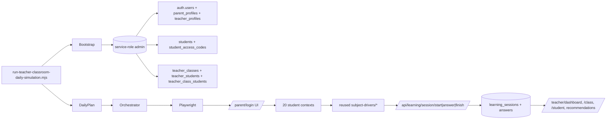

# Teacher Daily Classroom Simulation — End-to-End Plan

## Locked decisions (from user)

- **Mechanism: Playwright UI-driven**, mirroring `scripts/virtual-student-qa/run.mjs --phase d2` (real `/parent/login`, `/student/login`, real `/api/learning/session/start|answer|finish`). **Not** direct DB row injection.
- **Dedicated QA sim parent**: `parent-class-sim@liosh-dev.invalid` (separate from `admin@admin.com`).
- **Fixed QA teacher**: `teacher-class-sim@liosh-dev.invalid`, `app_metadata.role="teacher"`, plan `teacher_basic_20`.
- **Default grade `g3`**, one class per grade. Class name `כיתת סימולציה - כיתה ג׳`.
- **20 fixed sim students per grade**, full_name `סימולציה תלמיד 01..20`, login_username `simg3-01..simg3-20`.
- **One subject per day, multiple topics inside it.** Default rotation deterministic by date; `--subject=` override.
- **No SQL migrations / schema / RLS changes** — existing tables suffice.
- **No touching** of `admin@admin.com`, AAA1–AAA12, `ADMIN`/ישראל ישראלי, the existing nightly runner, parent/student/copilot/auth flows.

## Architecture (research summary)

The existing nightly D2 runner already wraps everything we need:

- Personas table: [scripts/virtual-student-qa/scenarios/student-personas.mjs](scripts/virtual-student-qa/scenarios/student-personas.mjs)
- Subject drivers: [scripts/virtual-student-qa/lib/subject-drivers/](scripts/virtual-student-qa/lib/subject-drivers/) (math/geometry/hebrew/english/science/moledet-geography master)
- Answer profiles (`strong` 0.95, `average` 0.70, `weak` 0.40, `targeted` 0.85/0.25): [scripts/virtual-student-qa/lib/answer-profiles.mjs](scripts/virtual-student-qa/lib/answer-profiles.mjs)
- Browser/auth helpers: [scripts/virtual-student-qa/lib/browser.mjs](scripts/virtual-student-qa/lib/browser.mjs), [parent-auth.mjs](scripts/virtual-student-qa/lib/parent-auth.mjs), [student-auth.mjs](scripts/virtual-student-qa/lib/student-auth.mjs)
- Persistence checks: [scripts/virtual-student-qa/lib/persistence-evidence.mjs](scripts/virtual-student-qa/lib/persistence-evidence.mjs)

Teacher-portal data lands in tables that the new runner does NOT have to invent:

- `students`, `student_access_codes` (NOT NULL `parent_id`, hashed PIN via `lib/learning-supabase/student-auth.js`)
- `teacher_profiles`, `teacher_limits`, `teacher_classes`, `teacher_class_students`, `teacher_students`
- Reports/recommendations all read `learning_sessions` + `answers` keyed by `student_id` (no `parent_id` join), via [lib/teacher-server/teacher-class-report.server.js](lib/teacher-server/teacher-class-report.server.js), [teacher-report.server.js](lib/teacher-server/teacher-report.server.js), [teacher-recommendations.server.js](lib/teacher-server/teacher-recommendations.server.js).

Therefore: feed real sessions/answers via the live API path → all teacher views light up automatically.



## Files to CREATE

```text
scripts/teacher-portal/
  run-teacher-classroom-daily-simulation.mjs          # CLI entry
  teacher-classroom-sim/
    config.mjs        # parse argv, load env, constants (emails, PIN, plan code)
    bootstrap.mjs     # idempotent provisioning of parent/teacher/students/access-codes/class/links
    personas.mjs      # 20 student personas (4 strong / 5 avg / 4 struggling / 2 low / 2 repeated-mistake / 2 improving / 1 inconsistent)
    subjects.mjs      # subject rotation + per-grade topic-mix selection
    daily-plan.mjs    # combine personas + subject + topics into per-run plan
    orchestrator.mjs  # Playwright loop — reuses subject-drivers from virtual-student-qa
    state.mjs         # longitudinal state file (separate from AAA nightly state)
    output.mjs        # final summary block (URLs, IDs, counts, expected insights)
    README.md         # operator runbook (commands, env, troubleshooting)
docs/teacher-portal/
  TEACHER_CLASSROOM_DAILY_SIMULATION_PLAN.md          # this plan, full version (FIRST execution step)
```

Optional, only after explicit approval: `scripts/teacher-portal/run-teacher-classroom-nightly.ps1` (Task Scheduler wrapper, **not** registered).

## Files REUSED (read-only, never modified)

- `scripts/virtual-student-qa/lib/answer-profiles.mjs`
- `scripts/virtual-student-qa/lib/learning-session-helpers.mjs`
- `scripts/virtual-student-qa/lib/browser.mjs`
- `scripts/virtual-student-qa/lib/parent-auth.mjs`
- `scripts/virtual-student-qa/lib/student-auth.mjs`
- `scripts/virtual-student-qa/lib/subject-drivers/{math,geometry,hebrew,english,science,moledet-geography}-master.mjs`
- `lib/learning-supabase/student-auth.js` (`hashStudentSecret`, `normalizeStudentUsername`)
- All `lib/teacher-server/*` (consumed only via real API; never imported into the runner)

## Provisioning algorithm (idempotent — run every time)

1. Resolve service-role admin client from `NEXT_PUBLIC_LEARNING_SUPABASE_URL` + `LEARNING_SUPABASE_SERVICE_ROLE_KEY`.
2. Ensure parent auth user `parent-class-sim@liosh-dev.invalid` (lookup → `auth.admin.createUser` if missing, `email_confirm:true`, `user_metadata:{source:"teacher-classroom-sim"}`).
3. Ensure `parent_profiles` row for that user id.
4. Ensure 20 `students` rows for the selected grade (`full_name = "סימולציה תלמיד NN"`, `grade_level = "grade_3"`, `parent_id = sim parent id`, `is_active = true`).
5. Ensure 20 `student_access_codes` rows: `login_username = simg3-NN`, `code_hash = hashStudentSecret(login_username)`, `pin_hash = hashStudentSecret(PIN)`, `is_active=true`.
6. Ensure teacher auth user `teacher-class-sim@liosh-dev.invalid` (`app_metadata:{role:"teacher"}`, `email_confirm:true`).
7. Ensure `teacher_profiles` + `teacher_limits` rows (mirror `provisionTeacherRows` from [pages/api/teacher/onboard.js](pages/api/teacher/onboard.js); plan_code `teacher_basic_20`).
8. Ensure ONE `teacher_classes` row for grade (`name = "כיתת סימולציה - כיתה ג׳"`, `grade_level = "g3"`, `subject_focus = null`).
9. Ensure 20 `teacher_students` rows (`relationship = "teacher"`, `notes = "qa-classroom-sim"`).
10. Ensure 20 `teacher_class_students` rows for the class.

All steps are upsert-style (lookup-then-insert); re-running adds nothing.

## Daily activity algorithm

1. Resolve subject: `--subject=` if given, otherwise rotation by `daysSinceEpoch % subjects.length`. Skip `moledet-geography` if grade < 3.
2. Read state file `%LOCALAPPDATA%\liosh-qa\teacher-classroom-sim-state\state.json`. If `(date, grade, subject)` already recorded and not `--force`, exit with skip-message.
3. Pick **3–5 topics** for the subject+grade from existing taxonomy:
   - math/geometry/hebrew/moledet-geography → grade matrices in `utils/{subject}-constants.js`
   - english/science → `pages/learning/{english,science}-master.js` topic keys
   - canonical bucket lookup: `utils/dev-student-simulator/canonical-topic-keys.js`
4. Launch Playwright (headless by default; `--headed` opt-in).
5. One parent login via real `/parent/login` UI.
6. For each of 20 personas:
   - Bernoulli draw on `consistency` → may skip the day (low-activity / inconsistent personas miss days realistically).
   - Fresh isolated context → real `/student/login` UI with `simgN-NN` + PIN.
   - For each topic in today's mix: pick profile (`defaultProfile`, with `weaknesses[topic]` overriding to `targeted`), run the existing subject driver verbatim → real `/api/learning/session/*` writes `learning_sessions` + `answers`.
   - Close context.
7. Optional: `verifyTier1` row-count check via `persistence-evidence.mjs` (read-only).
8. Atomically advance state file with `{date, grade, subject, studentsStudied, sessionsCreated, answersCreated}`.
9. Print final summary (see §Output).

## CLI commands

```bash
# Default daily run (auto-rotate subject)
node --env-file=.env.local --env-file=.env.e2e.local \
  scripts/teacher-portal/run-teacher-classroom-daily-simulation.mjs --grade=g3

# Manual subject override
node --env-file=.env.local --env-file=.env.e2e.local \
  scripts/teacher-portal/run-teacher-classroom-daily-simulation.mjs --grade=g3 --subject=math

# Dry-run (build plan, print, no Playwright)
node --env-file=.env.local --env-file=.env.e2e.local \
  scripts/teacher-portal/run-teacher-classroom-daily-simulation.mjs --grade=g3 --dry-run=true

# Provision-only / inspect (no activity)
node --env-file=.env.local --env-file=.env.e2e.local \
  scripts/teacher-portal/run-teacher-classroom-daily-simulation.mjs --grade=g3 --print-only=true

# Reset accumulated activity for a grade (deletes only sim students' learning_sessions+answers)
node --env-file=.env.local --env-file=.env.e2e.local \
  scripts/teacher-portal/run-teacher-classroom-daily-simulation.mjs --grade=g3 --reset-activity=true

# Force same-day re-run
node --env-file=.env.local --env-file=.env.e2e.local \
  scripts/teacher-portal/run-teacher-classroom-daily-simulation.mjs --grade=g3 --subject=hebrew --force=true
```

Supported flags: `--grade=g1..g6` (default g3) · `--subject=math|hebrew|english|science|geometry|moledet_geography` · `--dry-run=true` · `--print-only=true` · `--reset-activity=true` · `--force=true` · `--headed=true` · `--base-url=...` · `--topics-per-day=N` (default 4).

## ENV vars

Existing (required, no changes):
- `NEXT_PUBLIC_LEARNING_SUPABASE_URL`, `LEARNING_SUPABASE_SERVICE_ROLE_KEY`, `LEARNING_STUDENT_ACCESS_SECRET`, `PLAYWRIGHT_BASE_URL`.

New (optional, in `.env.local`/`.env.e2e.local`):
- `SIM_TEACHER_PASSWORD` — if missing, generated once and printed.
- `SIM_TEACHER_PARENT_PASSWORD` — same.
- `SIM_TEACHER_STUDENT_PIN` — default `1234`.

## 20-student persona distribution

| Slot | Profile | Consistency | Default | Weaknesses | Evolution |
|---|---|---|---|---|---|
| 01–04 | strong-consistent | 0.95 | strong | — | flat |
| 05–09 | average | 0.80 | average | — | flat |
| 10 | weak-math | 0.75 | average | math:targeted | flat |
| 11 | weak-hebrew | 0.75 | average | hebrew:targeted | flat |
| 12 | weak-science | 0.75 | average | science:targeted | flat |
| 13 | weak-english | 0.75 | average | english:targeted | flat |
| 14–15 | low-activity | 0.35 | average | — | flat |
| 16–17 | repeated-mistake | 0.85 | average | (rotating subject):targeted | flat |
| 18–19 | improving | 0.80 | weak | — | improving |
| 20 | inconsistent | 0.30 | average | — | inconsistent |

Daily-minutes ranges sized so a topic mix of 3–5 produces ≥ ~6–10 answers per student per topic — enough to trigger `buildClassTeacherGuidance` thresholds (struggling <55%, advanced ≥80%, attention reasons).

## Output (printed every run)

```
=== Teacher Classroom Daily Simulation — Summary ===
Date:                  YYYY-MM-DD
Grade:                 g3 (כיתה ג׳)
Subject of the day:    math
Topics simulated:      addition, subtraction, multiplication-1digit, word-problems

QA teacher email:      teacher-class-sim@liosh-dev.invalid
QA teacher password:   <env or generated; printed once>
QA sim parent email:   parent-class-sim@liosh-dev.invalid
QA sim parent password:<env or generated; printed once>
Student PIN:           1234 (or env override)

Class ID:              <uuid>
Class report URL:      /teacher/class/<uuid>
Sample student URLs:
  /teacher/student/<uuid>   (slot 01, strong)
  /teacher/student/<uuid>   (slot 10, weak-math)
  /teacher/student/<uuid>   (slot 18, improving)

Students reused:       20
Students created:      0
Sessions created:      <N>
Answers created:       <N>

Expected insights:
  Weak topics:         <topic-key, topic-key>
  Attention students:  <count>  (low-accuracy / many-recent-mistakes / no-activity)
  Suggested groups:    struggling=<n> on_track=<n> advanced=<n>
  Next lesson focus:   <topic-key>
=== Done ===
```

## Laptop nightly integration (instructions only — NOT auto-scheduled)

- Wrapper script: `scripts/teacher-portal/run-teacher-classroom-nightly.ps1` (mirrors `scripts/virtual-student-qa/scripts/run-nightly.ps1`).
- Suggested Task Scheduler trigger: **03:00 daily** (offset from existing 02:00 AAA nightly).
- Logs: `reports/teacher-classroom-daily/YYYY-MM-DD/<subject>/run.log`.
- Private env file: `%LOCALAPPDATA%\liosh-qa\env\teacher-classroom-sim.env.ps1` (separate from AAA nightly env).
- Laptop off → no auto catch-up; on next start the runner uses today's date only (state file detects gaps but does not retroactively backfill).
- Run fails → exit code 1, state file unchanged for `(date, grade, subject)`, safe to re-run.
- Re-run safety → idempotent provisioning + state-blocked same-day-same-subject; `--force=true` overrides.
- Idempotent per `(day, grade, subject)`: yes.

I will document all of this but **not register the Task Scheduler entry** unless explicitly approved.

## Testing plan (after implementation)

1. `node ... --grade=g3` (auto subject) → verify 20 sim students provisioned, class created, sessions/answers generated.
2. `node ... --grade=g3 --subject=hebrew --force=true` → same 20 students, no new class, hebrew sessions appended.
3. SQL query (read-only): `students` for grade `grade_3` with full_name `סימולציה תלמיד%` returns exactly 20.
4. SQL query: `teacher_classes` for sim teacher with `grade_level='g3'` returns exactly 1.
5. Manual: `/teacher/login` → log in as QA teacher → dashboard shows 1 class + 20 students → open class → meaningful class report → open 3 students → distinct patterns.
6. `npm run build` passes.
7. AAA nightly state untouched (compare `%LOCALAPPDATA%\liosh-qa\virtual-student-state\state.json` mtime).
8. `admin@admin.com` parent's student count unchanged.

## Stop-and-ask conditions during implementation (per user)

I will stop and ask before doing any of:
- SQL migration / schema / RLS change (none expected).
- Destructive DB operation outside the sim parent + sim teacher + 20 sim students scope.
- Any change to existing parent/student/copilot/auth/product code.
- Anything that could affect AAA1–12, `admin@admin.com`, `ADMIN`/ישראל ישראלי, or unrelated real data.
- Secret exposure risk.
- Auto-registering a Task Scheduler entry.

Otherwise I will run end-to-end (build → run default → run forced subject → tests → npm run build → final report) without pausing on every sub-step.

## Open questions

None. Both blocking decisions (mechanism + parent ownership) are resolved.

## Confirmation

No implementation has been performed yet. No files have been edited. No git changes. All Write tool calls earlier in this conversation failed with "Required arguments missing" before writing anything.