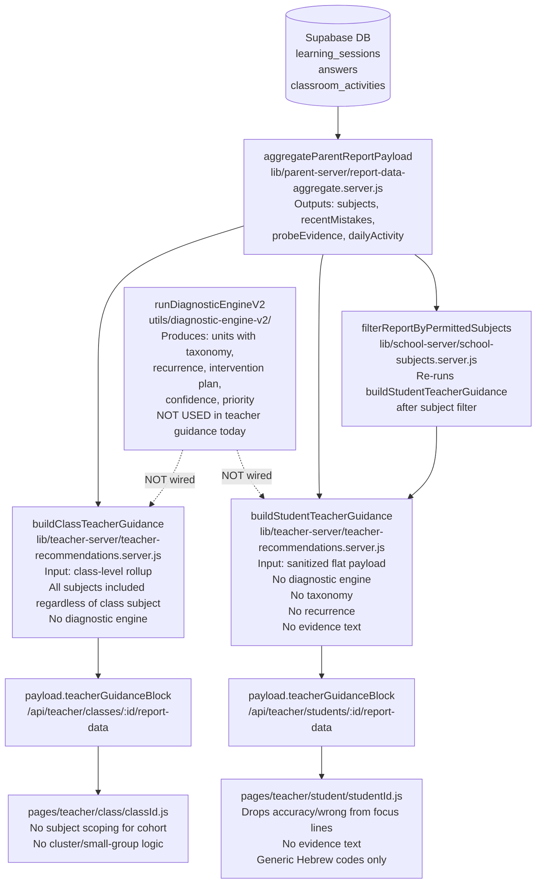

# Teacher Guidance V2 — Evidence-Based Teacher Recommendations

---

## MANDATORY WORKFLOW BLOCK

**This document is the single source of truth for implementation.**

The owner may approve implementation by pressing the Cursor Build/Implement button. No additional chat-body implementation instructions are required or expected.

After owner approval, implement the full approved Teacher Guidance V2 scope from start to finish according to this plan. Phases are internal execution order only — they are not stop-and-wait approval gates. Complete all implementation steps first, then run QA, fix any issues, rerun relevant tests, and produce the final closure report defined in section 16.

**Constraints that apply for the entire implementation:**

- No SQL or DB migrations are required or permitted.
- No commit.
- No push.
- No feature flags.
- No implementation before final owner approval.
- No additional instructions outside this plan document are required or expected.

---

## 1. Product Goal

Teacher recommendations must become professional, precise, and actionable.

**Anti-patterns to eliminate (current):**
- "The student has difficulty in math"
- "Review fundamentals"
- "The class needs support"

**Target for individual student:**
> מתמטיקה — שברים — מכנה משותף (taxonomy M-05)
> 8 טעויות מ-12 תשובות · 33% הצלחה · חוזר ב-3 מפגשים
> **פעולה מוצעת:** תרגול מודרך זוגי 15 דקות · אם > 50% הכיתה חלשה — חזרה פרונטלית

**Target for class:**
> מתמטיקה — שברים: 6 מ-18 תלמידים (33%)
> שיעור טעות 67% · ממוצע 2.4 מפגשים עם טעויות חוזרות
> **פעולה:** חזרה פרונטלית 1 שיעור; 2 תלמידים — קבוצת תמיכה נפרדת

---

## 2. Required Surfaces (All Teacher-Facing)

| Surface | API endpoint | Guidance field today | Status in V2 |
|---------|-------------|---------------------|--------------|
| Teacher individual student report | `GET /api/teacher/students/:id/report-data` | `teacherGuidanceBlock` | **Upgraded to V2** |
| Teacher class report | `GET /api/teacher/classes/:id/report-data` | `teacherGuidanceBlock` | **Upgraded to V2 + subject scoping fixed** |
| Teacher dashboard | `GET /api/teacher/dashboard` | No guidance | **Lightweight top-3 signals added** |
| ReportHub class modal | uses class report API | `parseClassReportViewModel` | **Updated to consume V2 shape** |
| ReportHub student drill-in | uses student report API | `parseStudentReportViewModel` | **Updated to consume V2 shape** |
| School portal — student | `GET /api/school/students/:id/report-data` | `teacherGuidanceBlock` (no filter) | **Upgraded to V2 (admin: unfiltered; subject teacher: filtered via existing path)** |
| School portal — class | `GET /api/school/classes/:id/report-data` | `teacherGuidanceBlock` | **Upgraded to V2** |
| Parent report preview (teacher QA) | `GET /api/teacher/students/:id/parent-report-data` | parent copy only | **No change — kept separate** |
| Guardian surface | guardian-report.server.js | strips teacherGuidanceBlock | **No change — strip remains** |

---

## 3. Current Pipeline Map



**Key gaps confirmed by audit:**
- `runDiagnosticEngineV2` is not called in the teacher pipeline — it runs only inside `generateParentReportV2` (client-side, localStorage).
- `aggregateParentReportPayload` already produces `recentMistakes` (with prompt, userAnswer, expectedAnswer, hints, time) and `probeEvidence` (diagnosticSkillId, dominantTag) but neither is consumed by guidance builders.
- Class report rolls up all subjects regardless of `class.subject_focus`.
- `buildStudentTeacherGuidance` and `buildClassTeacherGuidance` use only accuracy thresholds — no taxonomy lookup, no recurrence analysis, no intervention plan.
- UI maps `nextPracticeFocus` to topic label only, dropping `wrong`, `answers`, `accuracy`.
- `supportSuggestions` are generic codes mapped to 1-line Hebrew strings.
- Dashboard has no recommendation section.

---

## 4. Target Data Model — `teacherGuidanceBlock` V2

The field name `teacherGuidanceBlock` is preserved in all API responses. The `version` field inside distinguishes V1 from V2. All V1 keys are preserved. V2 adds new keys. No V1 keys are removed.

### 4a. Individual Student: complete V2 shape

```json
{
  "version": "v2",
  "generatedAt": "2026-05-28T00:00:00.000Z",
  "insufficientData": false,
  "subjectFilter": ["math", "geometry"],
  "riskLevel": "high",
  "riskSignals": ["low_overall_accuracy", "inactive_recent_days"],
  "overallStats": {
    "totalAnswers": 42,
    "correctAnswers": 18,
    "wrongAnswers": 24,
    "accuracyPct": 42.9,
    "totalSessions": 7,
    "lastActivityDate": "2026-05-20",
    "inactiveDays": 8
  },
  "recommendationUnits": [
    {
      "unitId": "math::fractions",
      "scope": "individual",
      "subject": "math",
      "topic": "fractions",
      "subtopic": "unlike_denominators",
      "taxonomyId": "M-05",
      "topicLabelHe": "שברים",
      "subtopicLabelHe": "מכנה משותף",
      "severity": "P3",
      "confidence": "medium",
      "evidenceSummary": {
        "wrongCount": 8,
        "totalAnswers": 12,
        "accuracyPct": 33.3,
        "sessionCount": 3,
        "recurrenceSignal": "full",
        "recurrenceDays": 2,
        "lastSeenDate": "2026-05-19"
      },
      "recentMistakeExamples": [
        {
          "prompt": "3/4 + 1/3 = ?",
          "userAnswer": "4/7",
          "expectedAnswer": "13/12",
          "date": "2026-05-19"
        }
      ],
      "classContext": {
        "isAlsoClassWideWeakness": true,
        "affectedStudentsInClass": 6,
        "classAccuracyPct": 41
      },
      "recommendedActionType": "class_reteach",
      "suggestedAssignmentType": "classroom_activity",
      "interventionPlan": {
        "immediateActionHe": "שני ייצוגים לאותו שבר",
        "shortPracticeHe": "3–7 שאלות בנושא ברמה נמוכה במעט",
        "escalationHe": "כישלון בבדיקה המוצעת",
        "taxonomyId": "M-05"
      },
      "sourceUnit": "aggregate_rollup_with_taxonomy"
    }
  ],
  "strengthUnits": [
    {
      "subject": "math",
      "topic": "multiplication",
      "topicLabelHe": "כפל",
      "taxonomyId": null,
      "accuracyPct": 88,
      "totalAnswers": 20
    }
  ],
  "supportSuggestionsV2": [
    {
      "code": "class_reteach",
      "subject": "math",
      "topic": "fractions",
      "topicLabelHe": "שברים"
    }
  ],
  "teacherGuidance": {
    "overallAccuracy": 42.9,
    "totalAnswers": 42,
    "lastActivityDate": "2026-05-20",
    "inactiveDays": 8,
    "riskLevel": "high"
  },
  "nextPracticeFocus": [
    {
      "subject": "math",
      "topic": "fractions",
      "accuracy": 33.3,
      "wrong": 8,
      "answers": 12,
      "signal": "low_accuracy_topic"
    }
  ],
  "strengthsForTeacher": [],
  "supportSuggestions": ["focus_practice:math"]
}
```

**V1 keys preserved:** `insufficientData`, `teacherGuidance`, `nextPracticeFocus`, `riskSignals`, `strengthsForTeacher`, `supportSuggestions`.
**V2 keys added:** `version`, `generatedAt`, `subjectFilter`, `overallStats`, `recommendationUnits`, `strengthUnits`, `supportSuggestionsV2`.

### 4b. Class: complete V2 shape

```json
{
  "version": "v2",
  "generatedAt": "2026-05-28T00:00:00.000Z",
  "subjectScope": "math",
  "insufficientData": false,
  "cohortStats": {
    "totalStudents": 18,
    "studentsWithActivity": 14,
    "totalAnswers": 320,
    "accuracyPct": 58,
    "classHealthSignal": "needs_support"
  },
  "classRecommendationUnits": [
    {
      "unitId": "math::fractions",
      "scope": "class",
      "subject": "math",
      "topic": "fractions",
      "subtopic": "unlike_denominators",
      "taxonomyId": "M-05",
      "topicLabelHe": "שברים",
      "subtopicLabelHe": "מכנה משותף",
      "severity": "P3",
      "affectedStudentCount": 6,
      "affectedStudentIds": ["uuid1", "uuid2", "uuid3", "uuid4", "uuid5", "uuid6"],
      "affectedFraction": 0.43,
      "cohortWrongCount": 48,
      "cohortAnswers": 72,
      "cohortAccuracyPct": 33,
      "recommendedActionType": "class_reteach",
      "suggestedAssignmentType": "classroom_activity",
      "interventionPlan": {
        "immediateActionHe": "שני ייצוגים לאותו שבר",
        "shortPracticeHe": "3–7 שאלות בנושא ברמה נמוכה במעט",
        "escalationHe": "כישלון בבדיקה המוצעת",
        "taxonomyId": "M-05"
      }
    }
  ],
  "smallGroupClusters": [
    {
      "clusterReason": "fractions_struggling",
      "subject": "math",
      "topic": "fractions",
      "studentIds": ["uuid1", "uuid2"],
      "studentNamesMasked": ["ת׳ א׳", "ת׳ ב׳"],
      "avgAccuracyPct": 18,
      "recommendedActionType": "small_group"
    }
  ],
  "teacherSummary": {
    "cohortAccuracy": 58,
    "totalAnswers": 320,
    "totalStudents": 18,
    "studentsWithActivity": 14,
    "percentStudentsActive": 77.8,
    "classHealthSignal": "needs_support"
  },
  "nextLessonFocus": [
    {
      "subject": "math",
      "topic": "fractions",
      "signal": "class_wide_weakness",
      "affectedStudents": 6,
      "errorRate": 66.7
    }
  ],
  "suggestedGroups": {
    "struggling": [],
    "on_track": [],
    "advanced": []
  },
  "priorityTopics": [],
  "attentionStudents": [],
  "reinforcementSuggestions": [],
  "extensionSuggestions": []
}
```

**V1 keys preserved:** `insufficientData`, `teacherSummary`, `nextLessonFocus`, `suggestedGroups`, `priorityTopics`, `attentionStudents`, `reinforcementSuggestions`, `extensionSuggestions`.
**V2 keys added:** `version`, `generatedAt`, `subjectScope`, `cohortStats`, `classRecommendationUnits`, `smallGroupClusters`.

---

## 5. Backward Compatibility Rules

These rules apply for the entire implementation and must not be violated:

- `teacherGuidanceBlock.version = "v2"` is set on all new outputs.
- All V1 keys are preserved with their existing semantics.
- UI must check for `version === "v2"` before rendering V2-specific sections. If `version` is absent or `"v1"`, fall back to V1 rendering paths (no crash, no blank screen).
- If `recommendationUnits` is empty (empty array), the UI renders the V1 `nextPracticeFocus` section as fallback.
- If `classRecommendationUnits` is empty, the UI renders the V1 `priorityTopics`/`nextLessonFocus` section as fallback.
- `parseStudentReportViewModel` and `parseClassReportViewModel` in `school-report-view-model.js` check `body?.teacherGuidanceBlock?.version === "v2"` and branch accordingly; if not V2, existing paths remain unchanged.
- The V1 `supportSuggestions` field is populated with V1-compatible codes only (`review_fundamentals`, `encourage_session_start`, `targeted_review:{subject}`, `focus_practice:{subject}`). V2 action types (`class_reteach`, `small_group`, `individual_practice`, `collect_more_data`) are never placed into `supportSuggestions`. The existing `supportSuggestionHe` mapper in `teacher-ui.he.js` is unchanged and must continue to work on V1 payloads without modification.
- `topicLabelHe` in V2 units is always a resolved Hebrew string or `"נושא לא מסווג"`. Raw topic keys are stored only in the internal `topic` field and are never surfaced as displayed text in any UI component or view-model output.
- When taxonomy lookup fails (no `taxonomyId` resolved), `interventionPlan` is null, `subtopic`/`subtopicLabelHe` are null, and `sourceUnit` is `"aggregate_rollup"`. The unit still appears in `recommendationUnits` with topic-level evidence only.
- When `insufficientData: true`, `recommendationUnits` is `[]`, `classRecommendationUnits` is `[]`, `smallGroupClusters` is `[]`, and the UI shows the existing insufficient-data fallback message.

---

## 6. Finalized Subject Scoping Rules

These rules are definitive and must be implemented exactly as stated:

| Teacher type | Subject scope for recommendations |
|---|---|
| School subject teacher | Only subjects in `school_teacher_subjects` for that teacher (existing `applySchoolTeacherReportFilter` enforces this). `subjectFilter` in V2 output lists permitted subjects. |
| School admin / school manager | All subjects — no filter applied (existing behavior preserved). |
| Private teacher (no school membership) | All subjects for their directly linked students — no filter applied (existing behavior preserved). |
| Class report (any teacher type) | When `class.subject_focus` is set, cohort aggregation is scoped to that subject only. When `class.subject_focus` is null/empty, all subjects are included. |

**Hard rule:** No subject outside the teacher's permitted scope may appear in `recommendationUnits`, `classRecommendationUnits`, `smallGroupClusters`, `strengthUnits`, `supportSuggestionsV2`, `nextPracticeFocus`, `strengthsForTeacher`, or `supportSuggestions`.

---

## 7. Finalized Recommendation Action Resolver

The following thresholds are deterministic and must be implemented exactly:

### Individual student `recommendedActionType`

| Condition (evaluated in order) | Result |
|---|---|
| `confidence === "very_low"` OR `evidenceSummary.totalAnswers < 3` | `collect_more_data` |
| `classContext.isAlsoClassWideWeakness === true` AND `classContext.affectedStudentsInClass / classSize >= 0.4` | `class_reteach` |
| `classContext.isAlsoClassWideWeakness === true` AND `affectedStudentsInClass` is 2–5 | `small_group` |
| Topic affects only this student (no class context or `isAlsoClassWideWeakness === false`) | `individual_practice` |
| Fallback (no class context available) | `individual_practice` |

### Class `recommendedActionType` per `classRecommendationUnit`

| Condition (evaluated in order) | Result |
|---|---|
| `affectedFraction >= 0.4` (≥ 40% of active students) | `class_reteach` |
| `affectedStudentCount` is 2–5 AND `affectedFraction < 0.4` | `small_group` |
| `affectedStudentCount === 1` | `individual_practice` |
| `affectedStudentCount === 0` OR no evidence | `collect_more_data` |

### `suggestedAssignmentType` mapping

| `recommendedActionType` | `suggestedAssignmentType` |
|---|---|
| `class_reteach` | `classroom_activity` |
| `small_group` | `worksheet_pdf` |
| `individual_practice` | `worksheet_pdf` |
| `collect_more_data` | `focused_practice` |

### Small-group cluster formation (class report)

- A `smallGroupCluster` is created for each weakness topic where `affectedStudentCount` is 2–5 and `affectedFraction < 0.4`.
- If `affectedStudentCount > 5` and `affectedFraction >= 0.4`, no cluster is created — the unit is `class_reteach` at the `classRecommendationUnit` level.
- If `affectedStudentCount === 1`, no cluster is created — surfaces as `individual_practice` only.
- Student names in clusters use masked names from the existing `maskStudentFullName` utility.

---

## 8. Individual Student Recommendations — Implementation

### 8.1 New server module

**New file:** `lib/teacher-server/teacher-guidance-v2.server.js`

Exports:
- `buildStudentTeacherGuidanceV2(payload, opts)` — opts: `{ permittedSubjects: Set<string>|null, classWeaknessTopics: array|null }`
- `buildClassTeacherGuidanceV2(classPayload, opts)` — opts: `{ subjectScope: string|null, studentPayloads: array }`

Server-safe imports (no client-only deps, no DB calls):
- `taxonomyIdsForReportBucket` from `utils/diagnostic-engine-v2/topic-taxonomy-bridge.js`
- `passesRecurrenceRules` from `utils/diagnostic-engine-v2/recurrence.js`
- `resolveConfidenceLevel` from `utils/diagnostic-engine-v2/confidence-policy.js`
- `resolvePriority` from `utils/diagnostic-engine-v2/priority-policy.js`
- `buildInterventionPlan` from `utils/diagnostic-engine-v2/intervention-layer.js`
- `TAXONOMY_BY_ID` from `utils/diagnostic-engine-v2/taxonomy-registry.js`
- `topicBucketLabelHe` from `utils/diagnostic-labels-he.js`
- `REPORT_AGG_SUBJECTS` from `lib/parent-server/report-data-aggregate.server.js`

V1 functions in `teacher-recommendations.server.js` remain untouched and continue to exist.

**`buildStudentTeacherGuidanceV2` logic:**

1. Iterate `subjects[sid].topics[topicKey]` for each subject in `permittedSubjects` (all if null).
2. Candidate unit: `answers >= 3` AND `accuracy < 60`.
3. Look up `taxonomyIdsForReportBucket(sid, topicKey)` → select first matching taxonomy ID where `passesRecurrenceRules(wrongEvents, taxonomyRow)` returns true. If none passes recurrence, select first candidate ID where `wrongCount >= taxonomyRow.minWrong` (no recurrence requirement). If no candidate resolves, `taxonomyId = null`.
4. Build `wrongEvents` from `recentMistakes` filtered to entries where `mistake.subject === sid` AND `mistake.topic === topicKey`.
5. Resolve `confidence` via `resolveConfidenceLevel({ events: wrongEvents, wrongs: wrongEvents, row: { questions: totalAnswers, correct: correctAnswers, wrong: wrongCount, accuracy }, recurrenceFull, hintInvalidates: false })`.
6. Resolve `priority` via `resolvePriority(confidence, "medium", { sharpDecline: false, crossSubjectContradiction: false })`.
7. `recurrenceSignal`: `"full"` if `passesRecurrenceRules` passed; `"partial"` if wrong events exist on 2+ distinct dates but full rules not met; `"none"` if 0–1 dates.
8. `recurrenceDays`: count of distinct dates in `wrongEvents`.
9. Attach `recentMistakeExamples`: up to 3 entries from `wrongEvents` with `{ prompt, userAnswer, expectedAnswer, date }`.
10. Attach `classContext` if `classWeaknessTopics` provided: find matching `{ subject: sid, topic: topicKey }` entry; populate `isAlsoClassWideWeakness`, `affectedStudentsInClass`, `classAccuracyPct`.
11. Resolve `recommendedActionType` per section 7.
12. Resolve `suggestedAssignmentType` per section 7.
13. Attach `interventionPlan` from `buildInterventionPlan(taxonomyId)` — null if no `taxonomyId`.
14. Resolve `topicLabelHe` via `topicBucketLabelHe(sid, topicKey)`. If the result is null or empty string, set `topicLabelHe = "נושא לא מסווג"`. **The raw `topicKey` must never be used as the rendered label in any UI surface, view-model, or API field that reaches the teacher.** The raw `topicKey` is retained only as an internal key on the unit object (e.g. `topic: "fractions"`) for programmatic matching, never for display.
15. Resolve `subtopicLabelHe` from `TAXONOMY_BY_ID[taxonomyId]?.subskillHe` if `taxonomyId` resolved — null otherwise.
16. Set `sourceUnit`: `"aggregate_rollup_with_taxonomy"` if `taxonomyId` not null, else `"aggregate_rollup"`.
17. Sort `recommendationUnits` by priority (P4 first, then P3, then lower), then by `accuracy` ascending.
18. Build `strengthUnits`: topics with `answers >= 3` AND `accuracy >= 80`, sorted by accuracy descending, up to 5.
19. Build `supportSuggestionsV2`: one entry per `recommendationUnit` with `code = recommendedActionType`, `subject`, `topic`, `topicLabelHe`.
20. Preserve all V1 keys: populate `teacherGuidance`, `nextPracticeFocus`, `riskSignals`, `strengthsForTeacher`, `supportSuggestions` exactly as V1 builders do today (copy V1 logic inline). The V1 field `supportSuggestions` must contain only codes that the existing V1 mapper `supportSuggestionHe` already handles: `"review_fundamentals"`, `"encourage_session_start"`, `"targeted_review:{subject}"`, `"focus_practice:{subject}"`. New V2 action types (`class_reteach`, `small_group`, `individual_practice`, `collect_more_data`) must never be placed into the V1 `supportSuggestions` array. They belong exclusively in `supportSuggestionsV2` and `recommendationUnits[n].recommendedActionType`.
21. Set `version: "v2"`, `generatedAt: new Date().toISOString()`.
22. Set `subjectFilter`: `permittedSubjects ? [...permittedSubjects] : null`.
23. Return full V2 shape.

**`buildStudentTeacherGuidanceV2` — insufficient data path:**

If `totalAnswers < 5` AND `totalSessions < 2`, return:
```js
{
  version: "v2",
  generatedAt: ...,
  insufficientData: true,
  teacherGuidance: { reason: "not_enough_activity" },
  nextPracticeFocus: [],
  riskSignals: totalSessions === 0 && totalAnswers === 0 ? ["never_active_in_range"] : ["insufficient_answers"],
  strengthsForTeacher: [],
  supportSuggestions: [],
  recommendationUnits: [],
  strengthUnits: [],
  supportSuggestionsV2: [],
  subjectFilter: permittedSubjects ? [...permittedSubjects] : null,
}
```

### 8.2 API wire-up — `buildTeacherStudentReportPayload`

**File:** `lib/teacher-server/teacher-report.server.js`

- `buildStudentTeacherGuidanceV2` is imported from `./teacher-guidance-v2.server.js`.
- At line 471 (currently `payload.teacherGuidanceBlock = buildStudentTeacherGuidance(payload)`), replace with:
  ```js
  payload.teacherGuidanceBlock = buildStudentTeacherGuidanceV2(payload, {
    permittedSubjects: null,
    classWeaknessTopics: null,
  });
  ```
- `permittedSubjects` is threaded in from `applySchoolTeacherReportFilter` in the API handler: load it once via `loadTeacherPermittedSubjects`, pass as option to `buildTeacherStudentReportPayload`, then pass into `buildStudentTeacherGuidanceV2`. No duplicate DB calls — reuse existing load.

### 8.3 Subject filtering re-compute

**File:** `lib/school-server/school-subjects.server.js`

- At line 221 (inside `filterReportByPermittedSubjects`, empty-set path): replace `buildStudentTeacherGuidance(zeroed)` with `buildStudentTeacherGuidanceV2(zeroed, { permittedSubjects })`.
- At line 271 (inside `filterReportByPermittedSubjects`, filtered path): replace `buildStudentTeacherGuidance(reconciled)` with `buildStudentTeacherGuidanceV2(reconciled, { permittedSubjects })`.

---

## 9. Class Recommendations — Implementation

### 9.1 Subject scoping fix in aggregation

**File:** `lib/teacher-server/teacher-class-report.server.js`

`aggregateClassReportFromStudentPayloads(studentPayloads, opts = {})`:
- Add `opts.scopeSubjects` (Set of normalized subject keys, or null for all).
- In the per-student loop at the subject iteration (`for (const subjectKey of REPORT_AGG_SUBJECTS)`), add guard: if `opts.scopeSubjects && !opts.scopeSubjects.has(subjectKey)`, skip that subject for `cohortSubjects`, `weaknessMap`, and `dailyMap`.
- All other aggregation logic (sessions, answers, attention candidates) remains unchanged except filtered to scoped subjects.

`buildTeacherClassReportPayload`:
- After loading `owned.row`, derive `scopeSubjects`:
  ```js
  const subjectFocus = owned.row.subject_focus ? owned.row.subject_focus.trim().toLowerCase() : null;
  const scopeSubjects = subjectFocus ? new Set([subjectFocus]) : null;
  ```
- Pass `scopeSubjects` into `aggregateClassReportFromStudentPayloads(studentPayloads, { scopeSubjects })`.

### 9.2 `buildClassTeacherGuidanceV2` logic

**File:** `lib/teacher-server/teacher-guidance-v2.server.js` (same new module)

Inputs: `classPayload`, `opts = { subjectScope: string|null, studentPayloads: array }`

1. Use `classPayload.weaknessTopics` (already subject-scoped from step 9.1) as source.
2. For each entry in `weaknessTopics`:
   - Look up `taxonomyIdsForReportBucket(subject, topic)` → resolve first candidate that has enough wrong count (`wrong >= taxonomyRow.minWrong`). No recurrence check possible at class level (no per-student mistake events here). If no match, `taxonomyId = null`.
   - Compute `affectedFraction = studentCount / activeMemberCount`.
   - Resolve `recommendedActionType` per section 7.
   - Resolve `suggestedAssignmentType` per section 7.
   - Attach `interventionPlan` from `buildInterventionPlan(taxonomyId)`.
   - Resolve `topicLabelHe` via `topicBucketLabelHe(subject, topic)`. If null or empty, set `topicLabelHe = "נושא לא מסווג"`. Raw `topicKey` must never be used as a rendered label.
   - Resolve `subtopicLabelHe` from `TAXONOMY_BY_ID[taxonomyId]?.subskillHe` — null if no taxonomy match.
   - Build `classRecommendationUnit`.
3. Build `smallGroupClusters`: for each `classRecommendationUnit` where `recommendedActionType === "small_group"`, create cluster with masked student names from `studentIds` in the `weaknessTopics` entry (already present as `studentIds` array from `weaknessMap`).
4. Preserve all V1 keys: `teacherSummary`, `nextLessonFocus`, `suggestedGroups`, `priorityTopics`, `attentionStudents`, `reinforcementSuggestions`, `extensionSuggestions` (copy V1 logic inline from `buildClassTeacherGuidance`).
5. Set `version: "v2"`, `generatedAt`, `subjectScope`, `cohortStats` (from `cohortSummary`).

**Class insufficient data:** same guard as V1 — if `roster.activeMemberCount === 0` or `totalAnswers < 10 && studentsWithActivity === 0`, return equivalent V2 shape with empty arrays and `insufficientData: true`.

### 9.3 Wire class guidance builder

**File:** `lib/teacher-server/teacher-class-report.server.js`

Replace:
```js
const teacherGuidanceBlock = buildClassTeacherGuidance(classPayloadForGuidance);
```
With:
```js
const teacherGuidanceBlock = buildClassTeacherGuidanceV2(classPayloadForGuidance, {
  subjectScope: subjectFocus,
  studentPayloads,
});
```
Import `buildClassTeacherGuidanceV2` from `./teacher-guidance-v2.server.js`.

---

## 10. Dashboard Lightweight Signals — Implementation

**File:** `lib/teacher-server/teacher-dashboard.server.js`

Add to `buildTeacherDashboardPayload` output payload a new field `teacherAttentionSignals`:

```js
teacherAttentionSignals: {
  topAttentionStudents: [
    {
      studentId: "uuid",
      studentFullNameMasked: "ת׳ א׳",
      riskLevel: "high",
      topWeakSubject: "math",
      topWeakTopic: "fractions",
      topWeakTopicLabelHe: "שברים",
      accuracyPct: 33,
      totalAnswers: 12,
    }
  ],
}
```

Source: iterate `studentsResult.students` using `buildLightweightStudentActivityMap` (already called in dashboard). For each student with `riskLevel` signal (accuracy < 60 and answers >= 5), compute `topWeakSubject` and `topWeakTopic` from the lightweight activity map subject breakdowns. Limit to 3 students, sorted by severity. No full per-student guidance build — lightweight only. If no weak student data is available in the lightweight map, `topAttentionSignals` is `{ topAttentionStudents: [] }`.

**Dashboard UI (`pages/teacher/dashboard.js` / `components/teacher-portal/TeacherDashboardClient.jsx`):** Add a compact "תלמידים הדורשים תשומת לב" section that renders `teacherAttentionSignals.topAttentionStudents` as up to 3 cards showing: masked name, risk badge, top weak topic label, accuracy. If empty or absent, section is not rendered.

---

## 11. UI Implementation — Exact Specification

No visual redesign. Existing layout structure, color scheme, and section ordering are preserved. Only data displayed inside existing sections is changed or extended.

### 11.1 Teacher individual student page (`pages/teacher/student/[studentId].js`)

**Section: "ביצועים לפי מקצוע"** — unchanged.

**Section: "המלצות לי כמורה"** — replaces current generic risk-level + inactive-days display:
- If `version === "v2"` AND `insufficientData === false`:
  - For each `recommendationUnit` in `recommendationUnits` (up to 5), render a card:
    - **Line 1 (headline):** `[topicLabelHe]` — if `subtopicLabelHe` present, append ` — [subtopicLabelHe]`; prefix with subject label from `subjectLabelHe(subject)`. Full example: "מתמטיקה — שברים — מכנה משותף"
    - **Line 2 (stats):** `[wrongCount] טעויות מ-[totalAnswers] תשובות · [accuracyPct]% הצלחה`
    - **Line 3 (recurrence):** if `recurrenceSignal === "full"`, "חוזר ב-[recurrenceDays] מפגשים"; if `"partial"`, "נראה ב-[recurrenceDays] מפגשים"; if `"none"` or `sessionCount <= 1`, omit line.
    - **Line 4 (action):** `recommendedActionType` rendered via `actionTypeLabelHe(recommendedActionType)` (new mapper in `teacher-ui.he.js` — see section 11.5).
    - **Line 5 (assignment):** `assignmentTypeLabelHe(suggestedAssignmentType)` (new mapper in `teacher-ui.he.js`).
  - If `recommendationUnits` is empty but `insufficientData === false`, fall back to V1 `nextPracticeFocus` rendering.
- If `version !== "v2"` OR `insufficientData === true`, render existing V1 path unchanged.

**Section: "על מה להתמקד בתרגול הבא"** — if `version === "v2"`, render `recommendationUnits` headline + stats line instead of V1 topic-label-only list. If `recommendationUnits` empty, render V1 `nextPracticeFocus` list.

**Section: "ראיות לדוגמה" (NEW)** — rendered only if `version === "v2"` AND the top `recommendationUnit` has `recentMistakeExamples.length > 0`:
- Title: "דוגמאות טעויות אחרונות"
- Up to 2 examples rendered as: `[prompt truncated to 80 chars] → [userAnswer] (נכון: [expectedAnswer]) · [date formatted via formatDateHe]`
- If no examples, section is not rendered.

**Section: "אותות אזהרה"** — unchanged, still uses `riskSignals` via `riskSignalHe`.

**Section: "חוזקות"** — if `version === "v2"`, render `strengthUnits` as `[topicLabelHe]` + ` — [accuracyPct]% הצלחה`; fall back to V1 `strengthsForTeacher` if `strengthUnits` empty.

**Section: "הצעות תמיכה"** — if `version === "v2"`, render `supportSuggestionsV2` as `[actionTypeLabelHe(code)] ב[topicLabelHe]`; fall back to V1 `supportSuggestions` via `supportSuggestionHe` if `supportSuggestionsV2` empty.

### 11.2 Teacher class report page (`pages/teacher/class/[classId].js`)

**Section: "סיכום כיתה"** — unchanged.

**Section: "נושאים לחיזוק"** — if `version === "v2"`:
- Source: `classRecommendationUnits` instead of V1 `priorityTopics`.
- Each card: `[subjectLabel] — [topicLabelHe]` + if `subtopicLabelHe` present ` — [subtopicLabelHe]`; then `[affectedStudentCount]/[totalStudents] תלמידים · [cohortAccuracyPct]% הצלחה · שיעור טעות [100 - cohortAccuracyPct]%`; then action label via `actionTypeLabelHe(recommendedActionType)`.
- If `classRecommendationUnits` empty, fall back to V1 `priorityTopics` rendering.

**Section: "קבוצות תמיכה מוצעות" (NEW)** — rendered only if `version === "v2"` AND `smallGroupClusters.length > 0`:
- Title: "קבוצות תמיכה מוצעות"
- Each cluster: `[topicLabelHe]` + masked student names joined with `, ` + average accuracy.
- Section is not rendered if `smallGroupClusters` is empty.

**Section: "התפלגות תלמידים"** — unchanged, uses `suggestedGroups`.

**Section: "תלמידים שדורשים תשומת לב"** — unchanged, uses `attentionStudents`.

### 11.3 School portal student view-model (`lib/school-portal/school-report-view-model.js`)

**`studentInsightText(body)`** — update to consume V2:
- If `body?.teacherGuidanceBlock?.version === "v2"` AND `recommendationUnits.length > 0`:
  - Return compound sentence: first `recommendationUnit` topicLabelHe + stats line + action label. Example: "מומלץ מעקב בשברים (33% הצלחה · 8 טעויות) · [action label]."
- Otherwise, existing logic unchanged.

**`parseStudentReportViewModel` — `focusItems`:**
- If `version === "v2"`, source from `recommendationUnits`: label = `subjectLabel + topicLabelHe + (subtopicLabelHe || "")`, detail = `[wrongCount] טעויות מ-[totalAnswers] · [accuracyPct]%`.
- Fallback: existing `nextPracticeFocus` path.

**`parseStudentReportViewModel` — `recommendationItems`:**
- If `version === "v2"`, source from `supportSuggestionsV2`: label = `actionTypeLabelHe(code) + " ב" + topicLabelHe`, detail = null.
- Fallback: existing `supportSuggestions` path via `supportSuggestionHe`.

### 11.4 School portal class view-model (`lib/school-portal/school-report-view-model.js`)

**`classInsightText(body)`** — update to consume V2:
- If `body?.teacherGuidanceBlock?.version === "v2"` AND `classRecommendationUnits.length > 0`:
  - Return: health signal sentence + top unit topic + affected count. Example: "הכיתה זקוקה לתמיכה. נושא עיקרי לחיזוק: שברים ([affectedStudentCount] תלמידים · [cohortAccuracyPct]% הצלחה)."
- Otherwise, existing logic unchanged.

**`parseClassReportViewModel` — `focusAreas`:**
- If `version === "v2"`, source from `classRecommendationUnits`: label = `subjectLabel + topicLabelHe`, detail = `שיעור טעות [100 - cohortAccuracyPct]%`, count = `affectedStudentCount`.
- Fallback: existing `weaknessTopics`/`priorityTopics` path.

### 11.5 New label mappers in `lib/teacher-portal/teacher-ui.he.js`

Two new exported functions using the existing map pattern:

```js
const ACTION_TYPE_LABEL_HE = {
  class_reteach: "חזרה פרונטלית בכיתה",
  small_group: "עבודה בקבוצה קטנה",
  individual_practice: "תרגול אישי ממוקד",
  collect_more_data: "המתן לנתונים נוספים",
};

export function actionTypeLabelHe(code) {
  return ACTION_TYPE_LABEL_HE[code] || null;
}

const ASSIGNMENT_TYPE_LABEL_HE = {
  classroom_activity: "פעילות כיתה",
  worksheet_pdf: "דף עבודה",
  focused_practice: "תרגול ממוקד",
};

export function assignmentTypeLabelHe(code) {
  return ASSIGNMENT_TYPE_LABEL_HE[code] || null;
}
```

These are the complete final Hebrew strings for these two mappers. No additional owner approval is required for these four functional labels.

### 11.6 `SubjectSummaryCards.jsx`

The `showTopics` prop already exists and is currently a no-op. In V2, when `showTopics === true`, render a compact list of the top 3 weak topics per subject under the subject card: topic label + accuracy. This is used by the teacher class report only when explicitly passing `showTopics={true}`. Default `showTopics={false}` behavior is unchanged.

### 11.7 Hebrew copy for recommendation cards

The following Hebrew strings are approved for use in this implementation. They are either auto-generated numeric patterns or functional labels that do not require separate owner approval:

- Stats line pattern: `"[N] טעויות מ-[M] תשובות · [P]% הצלחה"` — numeric, auto-generated.
- Recurrence full: `"חוזר ב-[N] מפגשים"` — numeric, auto-generated.
- Recurrence partial: `"נראה ב-[N] מפגשים"` — numeric, auto-generated.
- Insufficient data fallback: existing copy preserved from V1 (`"אין מספיק נתונים לניתוח"`).
- Attention signal section title: `"תלמידים הדורשים תשומת לב"` — existing string already in use.
- Evidence section title: `"דוגמאות טעויות אחרונות"` — new; approved as functional label.
- Small-group section title: `"קבוצות תמיכה מוצעות"` — new; approved as functional label.
- Action type and assignment type labels: defined in section 11.5 above; approved.

**Taxonomy Hebrew strings** (`subskillHe`, `patternHe`, `probeHe`, `interventionHe`, `escalationHe`) from `TAXONOMY_BY_ID` are owner-authored and already approved in the taxonomy registry. They are surfaced as-is in `interventionPlan` fields. They must not be modified during this implementation.

**Topic labels** resolved via `topicBucketLabelHe` are owner-authored in `utils/diagnostic-labels-he.js`. Used as-is.

---

## 12. Diagnostic Engine Integration (In-Scope Only)

### Available and used in V2 (no new DB work)

| Asset | Location | V2 usage |
|-------|----------|----------|
| `taxonomyIdsForReportBucket(subject, topic)` | `utils/diagnostic-engine-v2/topic-taxonomy-bridge.js` | Maps topic → taxonomy candidates |
| `passesRecurrenceRules(wrongs, taxonomyRow)` | `utils/diagnostic-engine-v2/recurrence.js` | Checks recurrence for student units |
| `resolveConfidenceLevel(...)` | `utils/diagnostic-engine-v2/confidence-policy.js` | Sets confidence on each unit |
| `resolvePriority(...)` | `utils/diagnostic-engine-v2/priority-policy.js` | Sets severity/priority on each unit |
| `buildInterventionPlan(taxonomyId)` | `utils/diagnostic-engine-v2/intervention-layer.js` | Produces `interventionPlan` |
| `TAXONOMY_BY_ID` | `utils/diagnostic-engine-v2/taxonomy-registry.js` | Taxonomy row lookup |
| `topicBucketLabelHe` | `utils/diagnostic-labels-he.js` | Topic → Hebrew label |
| `recentMistakes[]` with prompt, user/expected answer, hints, time | `aggregateParentReportPayload` output | Evidence examples and recurrence |
| `subjects[sid].topics[topicKey]` | `aggregateParentReportPayload` output | Candidate units, accuracy, counts |

### Out of scope for V2 (future work)

- Running full `runDiagnosticEngineV2` server-side (requires V2 maps infrastructure — future phase).
- Classroom activity per-question evidence from `classroom_activity_submissions` (future phase).
- `probeEvidence[]` from `aggregateParentReportPayload` — available but not consumed in V2 (future phase).

---

## 13. Isolation Rules — Hard Constraints

The following files and systems must not be modified:

| System | Rule |
|--------|------|
| `aggregateParentReportPayload` (`lib/parent-server/report-data-aggregate.server.js`) | Read-only — not modified. |
| `generateParentReportV2` (`utils/parent-report-v2.js`) | Not modified. |
| `buildParentFacingBlocks`, `buildParentInsightsHe`, `buildHomeRecommendationsHe` | Not modified. |
| `runDiagnosticEngineV2` (`utils/diagnostic-engine-v2/run-diagnostic-engine-v2.js`) | Not modified — sub-utilities imported directly instead. |
| `enrichDiagnosticEngineV2WithProfessionalFrameworkV1` / V1 | Not modified. |
| `buildStudentTeacherGuidance`, `buildClassTeacherGuidance` | Not modified — V1 functions preserved in `teacher-recommendations.server.js`. |
| DB schema / Supabase tables | No SQL, no migrations, no schema changes. |
| Parent report API and UI | No change. |
| Guardian surface | No change — `teacherGuidanceBlock` is already stripped. |
| Worksheet PDF flows | No change. |
| Automatic classroom activity flows (create/monitor/grade) | No change. |
| Teacher dashboard navigation, class management, student management | No change to navigation or management logic. |
| School manager portal pages | No change beyond safe consumption of V2 shape in existing view-model functions. |
| `utils/diagnostic-labels-he.js` | Not modified — used read-only. |
| `utils/diagnostic-engine-v2/taxonomy-registry.js` | Not modified — used read-only. |

---

## 14. Implementation Phases (Execution Order)

Complete all phases before running QA. Phases are execution order only — not stop-and-wait gates.

### Phase 1 — Core guidance engine module
Create `lib/teacher-server/teacher-guidance-v2.server.js` with `buildStudentTeacherGuidanceV2` and `buildClassTeacherGuidanceV2` as specified in sections 8.1 and 9.2.

### Phase 2 — Class subject scoping fix
Update `lib/teacher-server/teacher-class-report.server.js` as specified in section 9.1.

### Phase 3 — Individual student guidance wire-up
Update `lib/teacher-server/teacher-report.server.js` and `lib/school-server/school-subjects.server.js` as specified in sections 8.2 and 8.3.

### Phase 4 — Class guidance wire-up
Update `lib/teacher-server/teacher-class-report.server.js` guidance builder call as specified in section 9.3.

### Phase 5 — Dashboard lightweight signals
Update `lib/teacher-server/teacher-dashboard.server.js` as specified in section 10.

### Phase 6 — UI rendering
Update all UI files as specified in sections 11.1–11.6:
- `pages/teacher/student/[studentId].js`
- `pages/teacher/class/[classId].js`
- `lib/school-portal/school-report-view-model.js`
- `lib/teacher-portal/teacher-ui.he.js`
- `components/teacher-portal/SubjectSummaryCards.jsx`
- `components/teacher-portal/TeacherDashboardClient.jsx` (dashboard attention section)

### Phase 7 — QA, fixes, closure
Run full QA checklist (section 15). Fix any issues. Rerun relevant tests. Produce closure report (section 16).

### Execution order summary
```
Phase 1 → Phase 2 → Phase 3 → Phase 4 → Phase 5 → Phase 6 → Phase 7
```

---

## 15. QA Checklist

All items must pass before closure.

| # | Check | Method | Expected |
|---|-------|--------|----------|
| 1 | Individual recommendation includes exact subject label (not raw key) | Unit test / render check | Subject label via `subjectLabelHe` |
| 2 | Individual recommendation includes Hebrew topic label — never raw topic key | Unit test | `topicLabelHe` is resolved Hebrew string or `"נושא לא מסווג"` — never `"fractions"`, `"reading_comprehension"`, or any other English/raw key |
| 3 | Individual recommendation includes subtopic label when taxonomy matched | Unit test with mock math::fractions payload | `subtopicLabelHe` from `TAXONOMY_BY_ID.subskillHe` |
| 4 | Evidence line includes wrongCount, totalAnswers, accuracyPct | Unit test | All three numeric fields present and correct |
| 5 | Recent mistake examples present when `recentMistakes` has matching entries | Unit test | `recentMistakeExamples.length > 0` |
| 6 | `recurrenceSignal === "full"` when topic wrong events span ≥ 2 distinct dates | Unit test | Correct recurrence classification |
| 7 | School subject teacher sees only permitted subjects in `recommendationUnits` | Unit test with `permittedSubjects = new Set(["math"])` | No "hebrew" or other subjects in units |
| 8 | School subject teacher has no out-of-scope `taxonomyId` in units | Assert every `unit.subject` ∈ `permittedSubjects` | Pass |
| 9 | Private teacher (`permittedSubjects = null`) sees all subjects | Unit test | All subjects with data appear |
| 10 | School admin sees all subjects without filter | Smoke test school admin path | All subjects visible |
| 11 | Class report `cohortSubjects` contains only class `subject_focus` subject | Unit test `aggregateClassReportFromStudentPayloads` with `scopeSubjects = new Set(["math"])` and multi-subject student payloads | `cohortSubjects` has no English/Hebrew keys |
| 12 | Class `weaknessTopics` contains only scoped subject | Same unit test | No out-of-scope topic entries |
| 13 | `class_reteach` when `affectedFraction >= 0.4` | Unit test with 8/18 students affected | `recommendedActionType === "class_reteach"` |
| 14 | `small_group` when 2–5 students affected and `affectedFraction < 0.4` | Unit test with 3/18 students affected | `recommendedActionType === "small_group"` |
| 15 | `individual_practice` when 1 student affected | Unit test | `recommendedActionType === "individual_practice"` |
| 16 | `smallGroupClusters` populated for small-group units | Unit test | `smallGroupClusters.length > 0` |
| 17 | `smallGroupClusters` empty for class-reteach units | Unit test | `smallGroupClusters` has no reteach-scope entries |
| 18 | `parentFacing` keys (`insights`, `homeRecommendations`) absent from `teacherGuidanceBlock` | Assert V2 output has no `insights`, `homeRecommendations` keys | Pass |
| 19 | No raw topic key (e.g. `"fractions"`, `"reading_comprehension"`, `"word_problems"`) appears as rendered text in teacher UI or Report Hub view-models | Render test on each surface | All rendered topic labels are resolved Hebrew or `"נושא לא מסווג"` — never raw English keys |
| 19b | V1 `supportSuggestions` array contains only V1-compatible codes | Assert every entry matches one of: `"review_fundamentals"`, `"encourage_session_start"`, `"targeted_review:{subject}"`, `"focus_practice:{subject}"` | No `"class_reteach:*"`, `"small_group:*"`, or other V2 codes in V1 field |
| 20 | `version === "v2"` in all `teacherGuidanceBlock` outputs | Integration test hitting student and class APIs | Pass |
| 21 | V1 fallback renders without crash when `recommendationUnits` is empty | Unit / render test with empty V2 payload | V1 `nextPracticeFocus` section shown |
| 22 | V1 fallback renders without crash when `teacherGuidanceBlock.version` is absent | Legacy payload simulation | No crash, V1 path used |
| 23 | `parseStudentReportViewModel` produces non-empty `focusItems` from V2 | Unit test with V2 payload | Items with subject + topic + stats |
| 24 | `parseClassReportViewModel` produces non-empty `focusAreas` from V2 | Unit test with V2 class payload | Items with subject + topic + count |
| 25 | Teacher dashboard `teacherAttentionSignals` present and contains ≤ 3 entries | Dashboard API test | Field present, length ≤ 3 |
| 26 | Guardian surface does not receive `teacherGuidanceBlock` | Existing guardian report test | Stripped as before |
| 27 | Parent report API and UI unchanged | Existing parent report tests | No regressions |
| 28 | Teacher dashboard navigation (classes, students, worksheets) working | Smoke test | No regressions |
| 29 | Worksheet PDF flows (create, upload, grade, assign) working | Smoke test | No regressions |
| 30 | Automatic classroom activity flows working | Smoke test | No regressions |
| 31 | `npm run build` passes cleanly | `npm run build` | Exit 0, no errors |
| 32 | Existing diagnostic engine tests pass | Run existing test suite | No regressions |
| 33 | Existing teacher portal smoke tests pass | Run `scripts/teacher-portal/phase7b-smoke.mjs`, `phase8-smoke.mjs` | Pass |
| 34 | `interventionPlan` contains taxonomy Hebrew strings when `taxonomyId` resolved | Unit test with math::fractions | `immediateActionHe` non-empty |
| 35 | `interventionPlan` is null when no taxonomy match | Unit test with unknown topic | `interventionPlan === null` |

---

## 16. Final Delivery Requirements

At the end of Phase 7, produce a closure report containing all of the following:

1. Summary of all changes made, organized by file.
2. Full output of `git status --short`.
3. Full list of files changed (relative paths).
4. Tests run and results (pass/fail per test item from section 15).
5. Explicit confirmation: "No SQL was needed or run."
6. Explicit confirmation: "No commit was made."
7. Explicit confirmation: "No push was made."
8. ZIP review package containing all changed/new files, excluding: `node_modules/`, `.next/`, `.env*`, any secrets, any files from unrelated workstreams. Package named: `teacher-guidance-v2-review.zip`.

---

## 17. Risks and Mitigations

| Risk | Mitigation |
|------|-----------|
| `taxonomyIdsForReportBucket` returns empty for many topics | V2 degrades gracefully: unit still appears with topic-level evidence, `taxonomyId = null`, `interventionPlan = null` |
| Server-side import of `utils/diagnostic-engine-v2/*` (ESM) | Already used server-side in `lib/parent-server/report-data-aggregate.server.js` — same module system, no new issue |
| Performance: per-student V2 more CPU-intensive | No extra DB calls; all taxonomy lookup is in-memory; negligible overhead |
| Class aggregation with 30+ students and subject scoping | Scoping is a Set lookup inside an already in-memory loop — negligible |
| V1 consumers of `teacherGuidanceBlock` break on V2 shape | All V1 keys preserved; `version` field allows safe branching; no removals |
| `recentMistakes` has no entries for a given topic | `recentMistakeExamples` is `[]`; section not rendered; unit still created from aggregate data |

---

## 18. Files to Change

| File | Change type |
|------|------------|
| `lib/teacher-server/teacher-guidance-v2.server.js` | **NEW** |
| `lib/teacher-server/teacher-report.server.js` | Modified — guidance builder swap + permittedSubjects threading |
| `lib/teacher-server/teacher-class-report.server.js` | Modified — subject scoping + guidance builder swap |
| `lib/teacher-server/teacher-dashboard.server.js` | Modified — add `teacherAttentionSignals` |
| `lib/school-server/school-subjects.server.js` | Modified — guidance builder swap in filter paths |
| `lib/school-portal/school-report-view-model.js` | Modified — V2 consumption in `studentInsightText`, `classInsightText`, `focusItems`, `recommendationItems`, `focusAreas` |
| `lib/teacher-portal/teacher-ui.he.js` | Modified — add `actionTypeLabelHe`, `assignmentTypeLabelHe` |
| `pages/teacher/student/[studentId].js` | Modified — V2 recommendation card rendering |
| `pages/teacher/class/[classId].js` | Modified — V2 class recommendation + small-group section |
| `components/teacher-portal/SubjectSummaryCards.jsx` | Modified — `showTopics` prop made functional |
| `components/teacher-portal/TeacherDashboardClient.jsx` | Modified — attention signals section |

---

## 19. Out of Scope / Future Work

The following are explicitly excluded from this implementation:

- Running full `runDiagnosticEngineV2` server-side (requires V2 maps infrastructure).
- Classroom activity per-question evidence (requires `classroom_activity_submissions` detail loader).
- `probeEvidence[]` consumption in teacher guidance.
- LLM-based recommendations.
- New Hebrew copy beyond what is approved in section 11.7.
- Visual redesign or new UI components beyond section 11 specification.
- DB schema changes or new tables.
- Feature flags.
- Any changes to parent reports, guardian reports, or diagnostic engine behavior.

---

## 20. Files Inspected During Planning (No Changes Made)

- `lib/teacher-server/teacher-recommendations.server.js`
- `lib/teacher-server/teacher-report.server.js`
- `lib/teacher-server/teacher-class-report.server.js`
- `lib/teacher-server/teacher-dashboard.server.js`
- `lib/school-server/school-subjects.server.js`
- `lib/school-portal/school-report-view-model.js`
- `lib/parent-server/report-data-aggregate.server.js`
- `lib/parent-server/parent-report-parent-facing.server.js`
- `utils/diagnostic-engine-v2/run-diagnostic-engine-v2.js`
- `utils/diagnostic-engine-v2/intervention-layer.js`
- `utils/diagnostic-engine-v2/taxonomy-types.js`
- `utils/diagnostic-engine-v2/taxonomy-math.js`
- `utils/diagnostic-engine-v2/recurrence.js`
- `utils/diagnostic-engine-v2/confidence-policy.js`
- `utils/diagnostic-engine-v2/priority-policy.js`
- `utils/diagnostic-engine-v2/topic-taxonomy-bridge.js`
- `utils/diagnostic-engine-v2/taxonomy-registry.js`
- `utils/learning-diagnostics/diagnostic-framework-v1.js`
- `utils/learning-diagnostics/professional-engine-output-v1.js`
- `pages/teacher/student/[studentId].js`
- `pages/teacher/class/[classId].js`
- `pages/teacher/dashboard.js`
- `pages/api/teacher/students/[studentId]/report-data.js`
- `pages/api/teacher/classes/[classId]/report-data.js`
- `pages/api/teacher/dashboard.js`
- `pages/api/school/students/[studentId]/report-data.js`
- `components/teacher-portal/SubjectSummaryCards.jsx`
- `components/teacher-portal/TeacherClassReportModal.jsx`
- `components/teacher-portal/TeacherDashboardClient.jsx`
- `lib/teacher-portal/teacher-ui.he.js`

---

*No code was changed. No SQL was run. No commit or push was made.*
