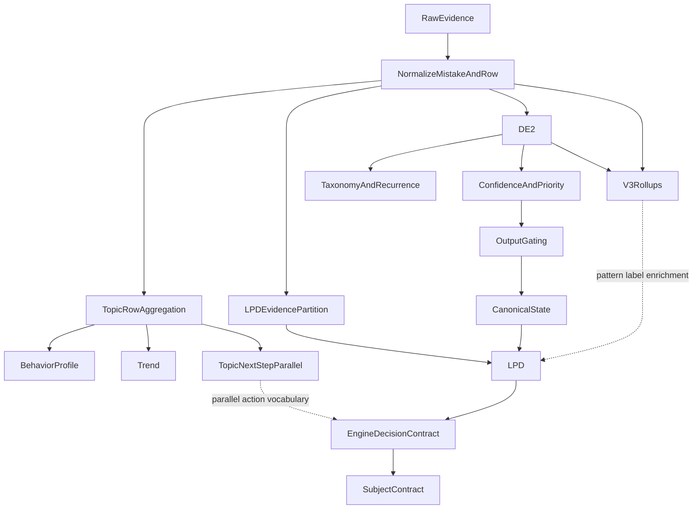

# DECISION ENGINE DEEP AUDIT

תאריך: 2026-07-23  
תחום: מנוע בלבד  
סטטוס: חקירה הושלמה; לא שונתה לוגיקת מוצר; לא בוצעו commit, push או deployment.

## 1. Executive summary

### מסקנה מחייבת

**3. המנוע בעיקר מסווג ביצועים ואינו עדיין מנוע החלטות מקצועי.**

הניסוח הזה מתייחס לשרשרת המשולבת שמפיקה `engineDecision` ו-`recommendedAction`, לא לכל מודול בנפרד.

יש במערכת רכיבים מקצועיים אמיתיים:

- DE2 יודע להתאים taxonomy, לבדוק recurrence, לחשב confidence ו-P1-P4, להפעיל evidence gates ולבנות canonical state שמרני.
- V3 יודע לבנות rollups לפי subskill, לזהות error type, timing, grade relation, foundation risk ולהציע פעולות פנימיות מובחנות.
- LPD יודע להבחין בין pattern חוזר, שגיאות אקראיות, mixed evidence, positive evidence וראיות שאינן diagnostic-eligible.
- קיימים guardrails טובים ל-taxonomy, subskill safety, evidence volume, hints ו-counter-evidence.

אבל החיבור ביניהם אינו מנוע החלטות אחד:

1. `engineDecision` הסופי נקבע בעיקר לפי מספר שאלות ודיוק ב-`buildEngineDiagnosticDecision`.
2. canonical state יכול לקבוע `probe_only`, `allowed=false`, `RI0`, ובאותה שורה EDC מחזיר `clear_topic_gap` ו-`remediate_same_level`.
3. `normalizeRecommendationContract` יכול לשדרג contract חסום מ-RI0 ל-RI2 ומ-`eligible=false` ל-`eligible=true`.
4. trend, timing, retries, grade relation, session consistency, taxonomy ו-subskill אינם משנים את `engineDecision` או את action של EDC בזוגות differential הישירים.
5. V3 מחשב פעולות מקצועיות שונות, אך אינו authority ואינו משנה DE2 gating או EDC action.
6. כמה actions מוצהרים אינם ניתנים להגעה מה-mapper שמייצר את action של EDC.
7. subject priority אינו דטרמיניסטי בשוויון מלא ואינו משתמש ב-P1-P4.

לכן המערכת מכילה מנועי אבחון טובים, אך נקודת האיחוד הפעילה משטחת אותם למסווג volume/accuracy עם action כמעט בינארי.

## 2. היקף והוכחות

נבדקו:

- DE2, Diagnostic V3, canonical topic state.
- LPD ו-Engine Decision Contract.
- taxonomy, recurrence, subskill safety.
- confidence, evidence gates, priority.
- trend, timing, hints, step-by-step, retries.
- grade relation, foundation risk, enrichment.
- action selection, RI caps, blocked claims.
- subject ordering, determinism, permutation ו-malformed inputs.

לא נבדקו:

- demo.
- parent-facing, homeRecommendations וטקסטים להורה.
- API presentation mapping.
- UI, React, CSS, Playwright וצילומי מסך.
- DB/live traffic.

### Harness חדש

- קובץ: `tests/engine-decision-audit/full-engine-audit.mjs`
- סיכום: `artifacts/qa/decision-engine-audit/run-summary.json`
- snapshots: `artifacts/qa/decision-engine-audit/snapshots/`
- differential: `artifacts/qa/decision-engine-audit/differential-results.json`
- logical coverage: `artifacts/qa/decision-engine-audit/logical-coverage.json`
- subskills: `artifacts/qa/decision-engine-audit/subskill-results.json`
- priority: `artifacts/qa/decision-engine-audit/subject-priority-results.json`
- malformed inputs: `artifacts/qa/decision-engine-audit/malformed-results.json`

### מספרים

- 104 תרחישים חדשים.
- 81 תרחישי pipeline מלאים דרך DE2 → V3 → LPD → EDC.
- 9 תרחישי subskill safety.
- 7 תרחישי subject priority.
- 7 תרחישי malformed/boundary.
- 11 זוגות differential.
- 538 assertions.
- 534 עברו.
- 4 נכשלו עקב כשלים אמיתיים.
- 34 branches משמעותיים נרשמו והופעלו.
- 0 exceptions.
- בנוסף: 271 בדיקות/תרחישים קיימים עברו בהרצות הממוקדות.

## 3. זרימת ההחלטה בפועל

החיבור הקריטי:

- `utils/parent-report-v2.js` מריץ enrichments ו-topic-next-step לפני DE2.
- `utils/diagnostic-engine-v2/run-diagnostic-engine-v2.js:39-435` בונה units ו-canonical state.
- `utils/diagnostic-engine-v3/run-diagnostic-engine-v3.js:19-118` בונה enrichment שאינו מחליף DE2.
- `utils/learning-pattern-decision/build-learning-pattern-decision.js:31-286` מחבר row, DE2, V3 ו-LPD.
- `utils/learning-pattern-decision/build-parent-report-engine-decision-contract.js:236+` בונה EDC.
- `utils/learning-pattern-decision/build-subject-engine-decision-contract.js:199-329` ממיין ומאגד topics.

## 4. Authority map

| שכבה | Authority בפועל | פלט עיקרי | מה אינו שולט בו |
|---|---|---|---|
| DE2 | taxonomy, recurrence, confidence, P-level, gating | `unit.taxonomy`, `confidence`, `priority`, `outputGating` | אינו מפיק `engineDecision` של EDC |
| Canonical state | action safety authority | `actionState`, `allowed`, `intensityCap`, readiness | אינו עוצר את mapper של EDC |
| V3 | enrichment פנימי | subskill, error type, grade context, V3 action | אינו משנה DE2 gating או EDC action |
| LPD | pattern/status/blocked claims | `topicStatus`, `findingType`, patterns | אינו authority יחיד ל-action |
| Engine v1 decision | authority ל-`engineDecision` | volume/accuracy decision | מתעלם מרוב signals המקצועיים |
| EDC action mapper | authority ל-`recommendedAction` | action מצומצם | יכול לסתור canonical state |
| Subject contract | authority לסדר topic בנתיב זה | `priorityTopics` | מתעלם מ-P1-P4 |
| Topic-next-step | action engine מקביל | advance/maintain/remediate/drop | אינו מאוחד סמנטית עם canonical/EDC |

## 5. מה המנוע יודע לעשות

### מוכח

1. **Volume ו-accuracy bands**
   - T0: פחות מ-5 שאלות.
   - T1: 5-9.
   - T2: 10-19.
   - T3: 20-49.
   - T4: 50+.
   - accuracy: mastery 90+, partial 70-89, strengthening 50-69, clear gap מתחת ל-50.

2. **Taxonomy**
   - 59 כללים עברו producer, positive ו-falsification tests.
   - DE2 אינו מאפשר diagnosis מלא בלי taxonomy match מספק.

3. **Recurrence**
   - DE2 בודק recurrence מול taxonomy.
   - LPD מזהה cluster חוזר בנפרד ומבדיל אותו משגיאות אקראיות.

4. **Canonical safety**
   - כל ששת המצבים ניתנים להגעה:
     `withhold`, `probe_only`, `diagnose_only`, `intervene`, `maintain`, `expand_cautiously`.

5. **V3 capabilities**
   - כל שמונת V3 actions ניתנים להגעה בבדיקה ישירה:
     `practice_more`, `give_probe_questions`, `strengthen_prerequisite`,
     `reduce_reading_load`, `remove_timer`, `advance_cautiously`,
     `maintain`, `insufficient_data`.

6. **Grade relation ב-V3**
   - below-grade struggle מפיק `foundationRisk`.
   - above-grade error מפיק caveat.
   - above-grade success מפיק enrichment signal.

7. **Subskill safety**
   - low q, מעט אירועי טעות, mastery row ו-multi-candidate לא פתור נחסמים.
   - תרחיש strong עם metadata וראיות מספיקות מאפשר subskill.

8. **Evidence partition ב-LPD**
   - step-by-step ו-learning/guided evidence מוחרגים מ-pattern-eligible evidence.

9. **Priority בתוך DE2**
   - ירידה חדה עם confidence מתאים מעלה ל-P4.
   - P2 מול P3 משנה canonical מ-`diagnose_only` ל-`intervene`.

10. **Robustness בסיסי**
    - null-like, NaN, negative ו-out-of-range inputs שנבדקו לא גרמו exception.
    - לא נוצר NaN ב-79 snapshots.
    - אותו input החזיר אותו output.
    - סדר events הפוך לא שינה את ההחלטה.

## 6. מה המנוע אינו יודע לעשות כשרשרת משולבת

1. אינו מאחד diagnosis ו-action תחת authority אחד.
2. אינו מבטיח ש-canonical `RI0` יישמר עד EDC/recommendation contract.
3. אינו משתמש ב-trend כדי לבחור EDC decision/action שונה; ירידה משפיעה על P-level בלבד.
4. אינו משתמש ב-timing כדי לבחור EDC decision/action שונה.
5. אינו משתמש ב-grade relation כדי לבחור EDC decision/action שונה.
6. אינו משתמש ב-retries או session consistency כדי לבחור EDC decision/action שונה.
7. אינו ממפה V3 `strengthen_prerequisite`, `remove_timer` או `reduce_reading_load` ל-action הסופי.
8. אינו מבדיל ב-EDC action בין random mistakes לבין repeated known pattern.
9. אינו מבטיח subject ordering יציב כאשר כל שדות המיון שווים.
10. אינו משתמש ב-P1-P4 ב-`buildSubjectEngineDecisionContract`.
11. אינו שומר distinction של `diagnose_only` מול `intervene`; שניהם מתכנסים ל-remediation.
12. אינו מפיק action ממוקד subskill למרות שקיימים subskill ו-safety gate.

## 7. מפת signals: נאסף מול משפיע

| Signal | נאסף/נשמר | DE2 | V3 | LPD | משנה EDC decision | משנה EDC action |
|---|---|---|---|---|---|---|
| questions/correct/wrong | כן | כן | כן | כן | כן | כן |
| accuracy | כן | כן | כן | כן | כן | כן |
| early/recent accuracy | כן | priority דרך direction בלבד | לא כ-trend | לא | לא | לא |
| trend direction/delta | כן | decline→P4 | לא | לא | לא | לא |
| response time | כן | behavior/hints בעקיפין | כן | metadata/pattern context | לא | לא |
| slow/fast wrong | כן | behavior | כן | לא | לא | לא |
| repeated count/ratio | כן | recurrence | error rollup | כן | לא ישירות | לא |
| patternFamily/misconception | כן | taxonomy | error type | pattern | לא | לא |
| taxonomy match | כן ב-DE2 | gate מרכזי | enrichment | pattern/subskill | לא | לא |
| subskill | כן | taxonomy output | כן | label | לא | לא |
| retries | כן | לא ישירות | attempts הם q, לא retry path | לא | לא | לא |
| hint usage | כן | heavy hints יכולים להחליש confidence | evidence | partition/risk | לא ב-EDC הישיר | לא |
| step-by-step | כן | אינו מסונן per-event | נשמר | מוחרג | לא | לא |
| evidence category | כן | אינו משתמש באותו partition | כן | gate מרכזי | לא | לא |
| grade relation | כן | passthrough בלבד | כן | לא | לא | לא |
| registered/content grade | כן | trace | כן | לא | לא | לא |
| recency | כן | trace בלבד | לא | לא | לא | לא |
| session count/consistency | כן | trend בלבד | לא | לא | לא | לא |
| P-level | כן | intervention gate | לא | לא | לא | EDC action לא; canonical action כן |
| confidence | כן | gate מרכזי | כן בנפרד | blocked claims | לא ב-engine v1 | mapper קורא actionState אך עוקף חסימה |
| foundation risk | V3 | לא | כן | לא | לא | לא |
| above-grade performance | V3 | לא | כן | לא | לא | לא |
| below-grade weakness | V3 | לא | כן | לא | לא | לא |

### Signals שנאספים אך אינם משתתפים ב-EDC decision/action

ה-differential הישיר הוכיח no-op עבור:

- trend.
- response time.
- dominant pattern.
- taxonomy match.
- subskill.
- hint invalidation כ-input ל-EDC decision.
- grade relation.
- session consistency.
- retries.

הערה: חלקם כן משפיעים בשכבה אחרת. הסיווג “non-operative” כאן מתייחס ל-`engineDecision` ו-`recommendedAction` של EDC, לא לכך שהקוד אינו מחשב אותם כלל.

## 8. Capability matrix

### Volume

נבדקו 1, 2, 4, 5, 6, 9, 10, 11, 12, 19, 20, 39, 40, 49, 50 ו-100 שאלות.

- q<5 נשאר `insufficient_data`.
- q=5 עם accuracy נמוך קופץ ל-`clear_topic_gap`.
- evidenceStrength עובר לפי volume policy.
- גם q=40 ו-q=100 ללא taxonomy נשארים canonical `probe_only/RI0`, אך EDC מפיק `clear_topic_gap/remediate_same_level`.

Snapshot מרכזי: `artifacts/qa/decision-engine-audit/snapshots/volume_q40.json`.

### Accuracy

נבדקו 0, 20, 39, 49, 50, 59, 60, 69, 70, 79, 80, 89, 90 ו-100 אחוז.

- 49→50 משנה `clear_topic_gap` ל-`topic_needs_strengthening`.
- 69→70 משנה strengthening ל-`partial_stable`.
- 89→90 משנה partial ל-`mastery_stable`.
- actions מתכנסים בעיקר ל-`remediate_same_level` או `maintain_and_strengthen`.

### Trend

- improving ו-declining שינו P2 ל-P4 ב-DE2.
- `engineDecision`, EDC action, LPD status ו-V3 action נשארו זהים.

Snapshots:

- `snapshots/trend_improving_large.json`
- `snapshots/trend_declining_large.json`

### Timing

- V3 שומר `avgTimeMs`, `slowCount`, `fastWrongCount`.
- behavior profile יכול לזהות speed pressure.
- כל תשעת תרחישי timing, כולל `speed` ו-`marathon`, החזירו אותו EDC decision/action כשה-q והדיוק זהים.

### Patterns

- LPD מבדיל random לעומת repeated.
- DE2 taxonomy דורש tags מוכרים ו-recurrence.
- EDC decision/action לא השתנו בין pattern חסר, unknown ו-dominant pattern באותו q/accuracy.

### Subskills

- safety gate עובד ברוב גבולות הראיות.
- כשל לוגי נוסף: תרחיש `no_recurrence` הוגדר `safeToShowSubskill=true` כאשר היו q ו-metadata מספיקים, אף ש-`recurrenceMatched=false`.
- גם תרחיש `weak_evidence` עם q=10 ושלוש טעויות הוגדר safe.
- לכן safety הוא בעיקר volume/metadata gate, לא guarantee של recurrence.

### Assistance

- LPD החריג את כל שמונת אירועי step-by-step.
- DE2 עדיין מנה שמונה wrong events.
- V3 עדיין בנה rollup ו-`practice_more`.
- EDC עדיין החזיר strengthening/remediation.

Snapshot: `snapshots/assistance_step_by_step.json`.

### Grade

- V3 הבדיל foundation/prerequisite, caveat ו-enrichment.
- LPD/EDC לא שינו decision/action.

Snapshot: `snapshots/grade_below_weak.json`.

### Multiple topics

- decision rank גובר על evidence volume.
- `clear_topic_gap` מדורג לפני `topic_needs_strengthening`.
- P1-P4 אינו שדה קלט למיון subject contract.
- בשוויון מלא נשמר input order ולכן permutation משנה priority order.

## 9. Differential matrix

| משתנה יחיד | decision | action | reason | השפעה אחרת |
|---|---:|---:|---:|---|
| trend stable→improving | לא | לא | לא | לא ב-direct EDC |
| responseMs normal→slow | לא | לא | לא | לא |
| random→known pattern | לא | לא | לא | guard/pattern metadata בלבד |
| taxonomy absent→strong | לא | לא | לא | guardrails/subskill בלבד |
| subskill safe→blocked | לא | לא | לא | guardrail IDs בלבד |
| hint invalidation | לא | לא | לא | לא ב-direct EDC |
| below→above grade | לא | לא | לא | V3 בלבד |
| q=4→5 | כן | כן | כן | threshold חד |
| session count 1→4 | לא | לא | לא | לא |
| P2→P3 | לא ב-EDC | לא ב-EDC | לא | canonical diagnose→intervene |
| retry 0→3 | לא | לא | לא | behavior/trend בלבד |

פלט מלא: `artifacts/qa/decision-engine-audit/differential-results.json`.

## 10. מרחב decisions ו-actions

### `engineDecision`

| ערך | נגיש ב-pipeline harness | הערה |
|---|---:|---|
| `insufficient_data` | כן | q<5 |
| `early_direction_only` | כן | q=6, accuracy 80 |
| `clear_topic_gap` | כן | acc<50, q≥5 |
| `topic_needs_strengthening` | כן | 50-69 |
| `partial_stable` | כן | 70-89 עם T2+ |
| `mastery_stable` | כן | 90+ עם q≥10 |
| `speed_pressure_pattern` | לא ב-pipeline | producer קיים, אך `unit.riskFlags` אינו מחובר |
| `none` | לא דרך LPD practiced path | q=0 חוזר מוקדם מ-LPD |

### EDC `recommendedAction`

| ערך מוצהר | נגיש מה-mapper |
|---|---:|
| `remediate_same_level` | כן |
| `maintain_and_strengthen` | כן |
| `watch` | לא ב-pipeline משולב; branch ישיר קיים אך `probe_only` מטופל קודם |
| `none` | רק q=0 contract path, לא practiced LPD |
| `remediate_step_down` | לא |
| `maintain` | לא |
| `intervene` | לא |

ה-action engine של EDC אינו מספיק מובחן. רק שני actions הופיעו ב-81 תרחישי pipeline: `remediate_same_level` ו-`maintain_and_strengthen`.

### Canonical actions

כל השישה reachable בבדיקה ישירה:

- withhold.
- probe_only.
- diagnose_only.
- intervene.
- maintain.
- expand_cautiously.

הבעיה אינה ב-reachability של canonical table, אלא בכך שההבחנות שלו אינן נשמרות ב-EDC action.

### V3 actions

כל השמונה reachable בבדיקה ישירה, אך אינם ממופים ל-action הסופי.

### Actions שביקש המשתמש ואינם קיימים כ-action יחיד פעיל ב-EDC

- `collect_more_evidence` - קיים סמנטית כ-watch/probe/collect contracts, לא כ-EDC action.
- `continue_current_level` - קיים ב-vocabulary מקביל, לא ב-EDC.
- `return_to_prerequisite` - V3 יודע `strengthen_prerequisite`; EDC לא.
- `targeted_subskill_practice` - לא מופק ב-EDC.
- `change_practice_mode` - קיים ב-overlays/parallel engines, לא ב-EDC.
- `guided_practice` - לא action של EDC.
- `independent_verification` - לא action של EDC.
- `slow_down_for_accuracy` - V3/remove timer ו-overlays, לא EDC.
- `increase_fluency` - לא EDC.
- `verify_instruction_understanding` - intervention family מקביל, לא EDC.
- `pause_progression` - gate semantics בלבד.
- `advance_or_extend` - canonical/V3/topic-next-step, לא EDC.
- `monitor_improvement` - overlays/watch semantics, לא action מובחן.
- `teacher_review` - `humanReviewRecommended` flag בלבד.

## 11. Guardrail audit

### Guardrails תקינים

- T0 חוסם קביעה מוקדמת.
- taxonomy חסרה חוסמת canonical diagnosis/intervention.
- weak evidence ו-counter-evidence מחזירים withhold/probe.
- mastery ו-partial-good חוסמים root cause חזק מסוג knowledge gap.
- subskill safety חוסם low q, few wrongs, mastery ו-multi-candidate.
- heavy hints יכולים להוריד confidence ב-DE2.

### Guardrails שמשטחים או נעקפים

1. **Canonical RI0 נעקף**
   - `build-parent-report-engine-decision-contract.js:47-52`.
   - q≥5, acc<70 מחזיר remediation גם אם actionState הוא `probe_only` או `withhold`.

2. **Recommendation RI0 משודרג**
   - `recommendation-contract-v1.js:37-56` מחשב RI0 נכון.
   - `recommendation-contract-normalizer.js:17-24` מחליף אותו ל-RI1/RI2 ול-eligible true לפי step.

3. **LPD evidence partition אינו משותף ל-DE2**
   - `resolve-excluded-evidence.js:90-108` מוחק step-by-step מ-pattern evidence.
   - `run-diagnostic-engine-v2.js:66-69` משתמש ב-filter אחר וממשיך למנות את האירועים.

4. **Subskill safety אינו מחייב recurrence**
   - `subskill-candidate-safety.js:171-185` משתמש ב-recurrence לקביעת source, אך אינו מוסיף block reason כאשר candidate יחיד אינו recurrent.

5. **Speed guard מנותק**
   - `buildParentReportEngineDecisionContract` קורא `unit.riskFlags`.
   - DE2 unit אינו מגדיר `riskFlags`.
   - `topicEngineRowSignals.riskFlags` קיים על row אך אינו מוזן לשדה שה-EDC קורא.

## 12. סתירות בין שכבות

### C1 - canonical probe מול EDC remediation

ב-`volume_q40`:

- confidence: high.
- taxonomy: none.
- canonical: `probe_only`, `allowed=false`, `RI0`.
- EDC: `clear_topic_gap`, severity high, `remediate_same_level`.

זו סתירה, לא הפרדה מכוונת בין diagnosis ל-action: השכבה המחמירה אוסרת action, והשכבה המאוחרת מחזירה action אינטנסיבי.

### C2 - withhold מול remediation

ב-`grade_below_weak`:

- canonical: `withhold`, decision tier 0, RI0.
- EDC: clear gap, high severity, remediation.

### C3 - RI normalizer

Input:

- decision tier 0.
- readiness insufficient.
- confidence low.
- cannotConcludeYet true.
- contract: `eligible=false`, RI0.

לאחר normalization עם step remediation:

- `eligible=true`.
- RI2.
- `forbiddenBecause` נשאר מלא, ולכן אותו contract אומר בו-זמנית “אסור” ו-“eligible”.

### C4 - V3 prerequisite אינו מגיע ל-EDC

- V3 below-grade weakness: `foundationRisk=true`, `strengthen_prerequisite`.
- EDC: `clear_topic_gap`, `remediate_same_level`.

### C5 - trend distinction נמחק אחרי priority

- improving: P2.
- declining: P4.
- EDC decision/action זהים.
- subject contract גם אינו קורא P-level.

### C6 - evidence eligibility שונה

- step-by-step: LPD independent count 0, כל האירועים excluded.
- DE2 wrongEventCount נשאר מלא.
- EDC/V3 ממשיכים להסיק pattern/action.

### C7 - V3 confidence אינו authority

דוגמאות רבות הציגו:

- DE2 confidence moderate/high.
- V3 confidence low.
- EDC severity high.

אין reconciler שמסביר מי מנצח.

### C8 - speed-only subject misclassified as stable

ב-subject fixture עם `speed_pressure_pattern` ו-`maintain_and_strengthen`:

- speed topic הוחרג מ-gap.
- אותו topic נספר גם כ-stable בגלל recommendedAction.
- התקבלה `subject_strength_stable` במקום `speed_check_only_subject`.

הסיבה: `stable` כולל כל topic עם `maintain_and_strengthen`, ללא החרגה מקבילה ל-speed.

## 13. Priority audit

### DE2 P-level

- מחושב לפי confidence × breadth.
- sharp decline, contradiction או repeated failure יכולים להעלות ל-P4.
- משפיע על canonical `diagnose_only` מול `intervene`.

### Subject contract

סדר המיון:

1. engine decision rank.
2. evidence rank.
3. severity.
4. wrong count.
5. accuracy.
6. questions.

P-level אינו משתתף.

### כשל determinism

כאשר כל שדות המיון שווים:

- input `[a,b]` החזיר `[a,b]`.
- input `[b,a]` החזיר `[b,a]`.

אין tie-breaker יציב לפי topic key. לכן permutation invariance נכשל.

## 14. Taxonomy gaps

1. taxonomy registry רחב ומכוסה היטב בבדיקות synthetic.
2. הבעיה העיקרית אינה מספר הכללים אלא wiring:
   - taxonomy match של DE2 אינו מועבר במבנה שה-engine v1 מצפה לו.
   - V3 subskill/error action אינו authority.
3. unknown taxonomy מפחית specificity ב-canonical, אך EDC עדיין מפיק clear gap לפי accuracy.
4. taxonomy absence אינה מונעת remediation ב-EDC.
5. subskill safety עבור candidate יחיד אינו מחייב recurrenceMatched.

## 15. Dead, unreachable ו-decorative

### Dead/unreachable ב-EDC mapper

- `remediate_step_down`.
- `maintain`.
- `intervene`.

### Partially unreachable

- `speed_pressure_pattern`: producer קיים; pipeline לא מספק את `unit.riskFlags` הנדרש.
- `watch`: mapper branch קיים, אך canonical `probe_only/withhold` מטופל לפני branch של early/insufficient ולכן לא הופיע ב-pipeline.
- `none`: q=0 contract path בלבד; LPD חוזר לפני בניית contract.

### Decorative/non-operative ביחס ל-EDC decision/action

- `rootCause`.
- `behaviorType`.
- `dominantMistakePattern`.
- `taxonomyMatch`.
- `safeSubskillToShow`.
- `affectedSubskill`.
- V3 `recommendedNextStep`.
- V3 `foundationRisk`.
- trend delta/direction, למעט priority של DE2.
- timing aggregates.
- retries.
- session consistency.
- grade relation.

השדות אינם בהכרח חסרי ערך. הם דקורטיביים או enrichment בלבד ביחס להחלטה ול-action שמופקים ב-EDC.

## 16. Logical coverage

34 branches הופעלו ונרשמו:

- כל accuracy/volume branches המרכזיים.
- כל canonical action states.
- subject decisions: focused, multiple, mixed, stable, insufficient.
- subskill guardrails: no candidate, low q, few wrongs, mastery, unresolved multi-candidate, safe.
- evidence ו-priority differentials.
- RI0 normalizer contradiction.
- canonical/EDC contradiction.
- כל שמונת V3 actions.

פלט מלא: `artifacts/qa/decision-engine-audit/logical-coverage.json`.

כיסוי שעדיין אינו מלא:

- לא בוצע exhaustive cross-product של 59 taxonomies × כל grades × כל modes.
- לא בוצע fuzzing.
- לא נבדקה persistence היסטורית בין חודשים.
- לא נבדקו parallel professional-framework actions מקצה לקצה.
- לא נבדק adaptive planner.

## 17. Invariants ותוצאות

### עברו

- weak evidence נשאר canonical withhold/probe.
- strong evidence ללא taxonomy שומר לפחות החלטת topic-level.
- improving ו-declining אינם זהים בכל השכבות, בזכות P-level.
- repeated pattern אינו random ב-LPD.
- below-grade אינו above-grade ב-V3.
- aided evidence אינו תמיד זהה ל-independent evidence.
- high severity כוללת reason code.
- determinism לאותו input.
- event permutation invariance.
- malformed inputs שנבדקו אינם זורקים.
- no NaN.

### נכשלו

1. `INV_10_PRIORITY_PERMUTATION`
   - אין tie-breaker יציב ב-subject sort.

2. `INV_07_INSUFFICIENT_NO_INTENSIVE_ACTION`
   - normalizer שדרג RI0/eligible false ל-RI2/eligible true.

3. `INV_09_ACTION_CONSISTENT_WITH_CANONICAL`
   - 69 pipeline cases החזירו canonical probe/withhold יחד עם EDC remediation.

4. `INV_14_ALL_RECOMMENDED_ACTIONS_REACHABLE_OR_MARKED`
   - actions מוצהרים אינם ניתנים להגעה מה-mapper הפעיל.

ה-assertions לא שונו כדי להעביר אותם.

## 18. בדיקות קיימות שהורצו

| Suite | תוצאה |
|---|---:|
| DE2 harness | 19/19 |
| Diagnostic V3 simulation | 16/16 |
| LPD scenarios | pass |
| Topic + subject EDC contracts | 2/2 |
| Timing, trend, activity classification, attempts | 87/87 |
| Taxonomy/evidence suites | 146/146 |

העובדה שהן עוברות אינה סותרת את ממצאי ה-audit: הבדיקות הקיימות מוכיחות modules מקומיים, לא consistency בין כל authorities.

## 19. סיווג הממצאים

### תקין ומוכח

- taxonomy recurrence ו-falsification.
- canonical decision table.
- V3 internal action differentiation.
- LPD evidence partition.
- volume/accuracy boundaries.
- DE2 P-level escalation.

### קיים אך לא מחובר

- V3 next action.
- foundation/enrichment signals.
- timing-based V3 distinctions.
- row risk flags ל-EDC.
- P-level ל-subject priority.

### שדה דקורטיבי

- rootCause/behavior/pattern/subskill ביחס ל-EDC decision/action.

### branch מת

- EDC actions: step-down, maintain, intervene.

### סתירה בין מנועים

- canonical RI0 מול EDC remediation.
- recommendation contract RI0 מול normalizer RI2.
- LPD excluded evidence מול DE2 included evidence.

### שיטוח guardrail

- probe/withhold מתכנסים ל-remediation ב-mapper.

### action גנרי מדי

- רוב הקשיים מתכנסים ל-`remediate_same_level`.

### bug ממשי

- RI0 upgrade.
- non-deterministic subject tie.
- speed-only topic נספר כ-stable.
- EDC קורא unit fields שאינם נוצרים על ידי DE2.

## 20. תוכנית תיקון מדורגת

לא יושם שום תיקון במסגרת החקירה.

### P0 - בטיחות ועקביות

1. לקבוע canonical state כ-action authority יחיד.
2. לאסור על `mapEngineRecommendedAction` להחזיר remediation כאשר canonical `allowed=false` או cap=RI0.
3. לשנות normalizer כך שיוכל רק להוריד intensity/eligibility, לעולם לא להעלות מעל canonical cap.
4. להוסיף invariant runtime: `forbiddenBecause.length > 0` אינו יכול לדור יחד עם `eligible=true` בלי override מתועד.

סיכון: בינוני. עלול להפחית actions קיימים; זה שינוי בטיחותי נדרש.

### P1 - מידע משמעותי קיים אך אינו משפיע

1. להעביר ל-EDC context מאוחד: riskFlags, taxonomyMatch, behavior, rootCause, grade context ו-V3 action.
2. לאחד evidence eligibility של DE2 ו-LPD.
3. למפות trend, grade, assistance ו-timing ל-decision inputs מתועדים, לא ישירות לטקסט.
4. לשמר distinction בין V3 prerequisite/speed/reading actions.

סיכון: גבוה. משנה behavior ולכן דורש rollout ו-backward compatibility.

### P2 - action differentiation

1. להגדיר enum action סמכותי אחד.
2. למפות canonical `diagnose_only`, `intervene`, `maintain`, `expand_cautiously` ל-actions נפרדים.
3. לאפשר targeted subskill, prerequisite, timer removal ו-independent verification רק עם evidence gates.
4. להסיר או לסמן deprecated actions שאינם נגישים.

סיכון: גבוה. משפיע על consumers ועל contracts.

### P3 - taxonomy/subskill

1. לחייב recurrence או probe support לפני `safeToShowSubskill=true`.
2. להוסיף tests ל-single-candidate/no-recurrence.
3. לשמר topic-level safe conclusion כאשר taxonomy חסרה, בלי להחזיר diagnosis ספציפי.
4. להוסיף reconciler בין DE2 taxonomy ל-V3 subskill.

סיכון: בינוני.

### P4 - explainability ו-observability

1. tie-breaker דטרמיניסטי לפי canonical topic key.
2. trace אחיד שמסביר איזה authority ניצח.
3. logical-coverage registry קבוע ב-CI.
4. differential matrix קבועה לכל signal.
5. contract versioning ו-deprecation מסודר לשדות מקבילים.

סיכון: נמוך עד בינוני.

## 21. דברים שלא נבדקו

- production DB data.
- התפלגות אמיתית של metadata coverage.
- false-positive/false-negative rates מול gold labels אנושיים.
- calibration סטטיסטי של confidence.
- latency וביצועים בנפח production.
- concurrency.
- persistence של recommendation memory.
- adaptive planner.
- professional framework מלא.
- parent surfaces, API, demo ו-UI, לפי גבולות הבקשה.

## 22. תשובה סופית

המנוע אינו “ריק”: יש בו taxonomy, recurrence, canonical safety, V3 ו-LPD ברמה טובה. אבל ההחלטה המשולבת הפעילה אינה מנצלת את רוב היכולות האלה. נקודת האיחוד מבוססת בעיקר על volume ו-accuracy, משטחת פעולות, ולעיתים עוקפת guardrail סמכותי.

לכן המסקנה נשארת:

**המנוע בעיקר מסווג ביצועים ואינו עדיין מנוע החלטות מקצועי.**
