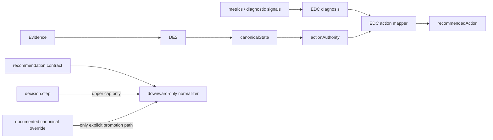

# Decision Engine P0 Implementation — 2026-07-23

## Scope and result

Implemented P0 safety, authority, and consistency only. No UI, parent-facing copy, demo, API presentation, deployment, commit, or push changes were made.

Required result:

- Audit harness: 538/538 assertions passed.
- Pipeline consistency: 81/81 scenarios passed.
- Existing relevant engine suites: 271/271 passed.
- New recommendation-normalizer P0 tests: 5/5 passed.
- Linter diagnostics on changed files: 0.

## Root cause and change by area

### 1. EDC action authority

Root cause: `mapEngineRecommendedAction` treated accuracy, wrong-count, and `engineDecision` as independent permission to remediate. It could therefore replace canonical `withhold` / `probe_only`, `allowed=false`, and `RI0` with `remediate_same_level`.

Change:

- `buildParentReportEngineDecisionContract` now builds an explicit `actionAuthority` snapshot from `canonicalState`.
- `mapEngineRecommendedAction` fails closed when canonical state is missing.
- `allowed=false`, `RI0`, `withhold`, and `probe_only` always prevent remediation.
- Only canonical `intervene` with allowed non-RI0 authority can produce `remediate_same_level`.
- `diagnose_only` does not authorize remediation.
- Metrics and `engineDecision` continue to describe findings but no longer approve intervention.

### 2. Recommendation normalization

Root cause: `normalizeRecommendationContract` rewrote contracts from `decision.step`, promoting `RI0` to RI1/RI2/RI3 and `eligible=false` to `eligible=true`.

Change:

- A step is now an upper cap only.
- Without an authoritative override, intensity can only remain unchanged or decrease.
- `eligible=false` cannot become `eligible=true`.
- `forbiddenBecause.length > 0` forces `RI0`, `eligible=false`, and `family=null`.
- The only override accepted is an explicit canonical-state override with `allowed=true`, a valid `intensityCap`, and a non-empty `reasonCode`.
- Added `recommendationEligibilityInvariantHolds` and `isAuthoritativeRecommendationOverride`.

### 3. Subject consistency

Root causes:

- Equal-ranked topics retained input order because sorting had no final key.
- A `speed_pressure_pattern` topic could also be counted as stable through its action.

Changes:

- Added a final deterministic sort key using normalized canonical `topicKey`.
- Explicitly excluded `speed_pressure_pattern` from both stable counts and `stableStrengths`.

### 4. Signal wiring

Root cause: EDC read `unit.riskFlags` and `unit.modeKey`, although DE2 units do not produce those fields.

Change:

- EDC now reads risk flags only from the actual producer path, `row.topicEngineRowSignals.riskFlags`.
- Mode is read from the row.
- These signals remain diagnostic inputs only; they cannot bypass canonical action authority.

### 5. Action contract reachability

Root cause: the contract declared legacy action values that the active mapper did not emit.

Change:

- `remediate_step_down`, `maintain`, and `intervene` are explicitly marked deprecated/unreachable.
- `none` is explicitly marked contract-only for the zero-question terminal path.
- The audit proves active reachability directly for `watch`, `remediate_same_level`, and `maintain_and_strengthen`.

## New authority flow

## Central before/after cases

1. Canonical `probe_only`, `allowed=false`, `RI0`; EDC diagnosis `clear_topic_gap`:
   - Before: `remediate_same_level`.
   - After: `watch`.

2. Contract `RI0`, `eligible=false`, forbidden reasons; step `remediate_same_level`:
   - Before: `RI2`, `eligible=true`.
   - After: `RI0`, `eligible=false`, `family=null`.

3. Equal subject-topic ranking fields under input permutation:
   - Before: output depended on input order.
   - After: canonical topic-key order is stable.

4. Speed-only topic with a maintain-like action:
   - Before: could also count as stable.
   - After: only the speed-only classification is counted.

## Files and functions changed

- `utils/learning-pattern-decision/build-parent-report-engine-decision-contract.js`
  - `mapEngineRecommendedAction`
  - `buildParentReportEngineDecisionContract`
- `utils/contracts/recommendation-contract-normalizer.js`
  - `normalizeRecommendationContract`
  - new invariant and override validators
- `utils/learning-pattern-decision/build-subject-engine-decision-contract.js`
  - `deriveSubjectDecision`
  - `sortPriorityTopics`
  - stable-strength selection
- `utils/learning-pattern-decision/engine-decision-codes.js`
  - explicit deprecated/unreachable and contract-only sets
- `tests/engine-decision-audit/full-engine-audit.mjs`
- `tests/learning/recommendation-contract-normalizer-p0.test.mjs`
- `tests/learning/parent-report-engine-decision-contract.test.mjs`
- `tests/learning/subject-engine-decision-contract.test.mjs`
- `scripts/intelligence-layer-v1-usage-selftest.mjs`

## Verification and regressions

The four previously failing invariants now pass:

- `INV_07_INSUFFICIENT_NO_INTENSIVE_ACTION`
- `INV_09_ACTION_CONSISTENT_WITH_CANONICAL`
- `INV_10_PRIORITY_PERMUTATION`
- `INV_14_ALL_RECOMMENDED_ACTIONS_REACHABLE_OR_MARKED`

No regression was found in the required 538 audit assertions or 271 existing relevant tests.

Follow-up closed the supplemental self-test. The expected count `1` was correct; its April fixture lacked practice evidence and was filtered by the core-evidence rule introduced in July. Only the fixture was repaired with valid topic keys and evidence traces. No assertion was weakened, and the full self-test now passes.

## Explicitly deferred

- P1: connect currently non-operative trend, timing, assistance, grade, pattern, subskill, and session signals to decisions where justified.
- P2: expand action differentiation; no new actions were introduced in P0.
- P3: taxonomy and subskill coverage gaps.
- P4: explanation quality, wording, parent-facing presentation, UI, demo, and API presentation.

