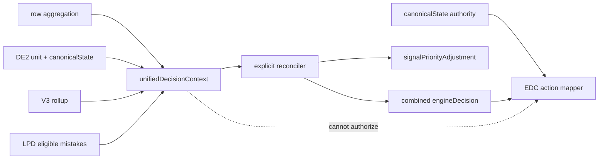

# Decision Engine P1 Implementation — 2026-07-23

## Result

P1 connects previously computed engine signals through one internal `unifiedDecisionContext`. It does not add actions, edit parent-facing copy, change UI/demo/API presentation code, or bypass P0 authority.

Canonical state remains the only action authority:

- `allowed=false` remains blocked.
- `RI0` remains blocked.
- `withhold` and `probe_only` remain non-remediation states.
- P1 may downgrade a diagnosis/action path, but cannot authorize or increase intervention.

Final verification:

- Supplemental intelligence self-test: pass.
- Expanded engine audit: 127 scenarios, 22 differential pairs, 559/559 assertions.
- Original full-pipeline cases: 81/81.
- Logical branches: 45/45.
- Existing relevant engine suites: 271/271.
- P0 normalizer tests: 5/5.
- P1 focused tests: 13/13.
- Exceptions/regressions: 0.

## Self-test closure before P1

The failing scenario supplied two synthetic units with `intelligenceV1`, but without `topicRowKey` or practice evidence:

```json
{
  "canonicalState": null,
  "recommendationBeforeNormalization": null,
  "recommendationAfterNormalization": null,
  "coreUnitsAfterFilter": []
}
```

`summarizeV2UnitsForSubject` first calls `filterCoreV2Units`. Since both fixtures had zero questions/time, both were removed and the empty summary correctly returned `lowConfidenceCount: 0`.

History proved the mismatch:

- The self-test fixture and expected value `1` were added on 2026-04-24.
- The core evidence filter was added on 2026-07-03.
- P0 normalization did not participate in this path.

Resolution: the assertion remained `1`; only the stale fixture received valid topic keys and evidence traces. The full self-test passes.

## Unified context and authority flow



Each context signal contains:

- source path;
- normalized value;
- eligibility;
- reason codes;
- bounded priority contribution;
- conflict markers.

Evidence eligibility now records DE2 diagnosis eligibility, V3 eligibility, LPD pattern eligibility, independent/guided status, subskill safety, and canonical action eligibility in one contract.

## Signals connected

### Trend

Source: `row.trend`.

May influence:

- supported decline changes `partial_stable` to `topic_needs_strengthening` when recent accuracy is below 70;
- supported improvement changes `topic_needs_strengthening` to `partial_stable` only when recent accuracy is at least 70;
- decline raises priority; improvement lowers it.

May not influence when trend confidence is below 0.5 or direction is unknown.

### Timing

Sources: V3 `avgTimeMs`, `slowCount`, `fastWrongCount`, and behavior median wrong-answer time.

May influence:

- repeated fast-wrong evidence raises priority;
- fast-wrong plus the real `speedOnlyRisk` path can refine a suitable decision to `speed_pressure_pattern`;
- repeated slowness with preserved accuracy raises monitoring priority.

Timing never independently authorizes remediation.

### Assistance

Sources: `row.behaviorProfile.signals`, row mode, hints, and step-by-step evidence.

May influence:

- guided or heavily hinted mastery is reduced from `mastery_stable` to `partial_stable`;
- guided evidence adds an uncertainty/priority reason.

May not transform guided success into independent mastery.

### Grade relation and foundation risk

Sources: DE2 `gradeEvidence` and V3 `gradeContext`.

May influence:

- below-grade foundation risk raises priority;
- above-grade mistakes with a V3 caveat are reduced from topic-gap decisions to `early_direction_only`;
- enrichment evidence lowers remediation priority.

Unknown grade relation has no effect.

### Repeated pattern and taxonomy

Sources: DE2 taxonomy/recurrence and LPD-eligible mistake events.

May influence only when taxonomy matched, recurrence is full, and eligible wrong events exist:

- adds a supported-pattern reason;
- raises priority;
- creates the taxonomy adapter consumed by the combined diagnostic decision.

Random mistakes do not receive this contribution.

### Subskill safety

Source: the existing `assessSubskillCandidateSafety` guard.

An affected subskill is now exposed to the combined decision only when all safety checks pass. Low volume, too few wrong events, weak metadata, unresolved candidates, mastery controls, or missing taxonomy continue to block it.

When `row.topicEngineRowSignals.engineDiagnosticDecision` contains a precomputed safety result that agrees with the fresh DE2 taxonomy ID and LPD still has at least three eligible wrong events, the unified context reuses that real producer path. Otherwise it recomputes safety from DE2 taxonomy plus LPD-eligible evidence. The context records that row signals were produced before DE2, so they remain diagnostic enrichment rather than action authority.

### Session consistency

Source: session counts in `row.trend.windows`.

Cross-session consistency raises priority only when a repeated taxonomy pattern is already supported. A single session lowers confidence/priority and cannot create recurrence by itself.

### V3 recommendedNextStep

Source: `v3Rollup.recommendedNextStep`.

The existing V3 vocabulary now contributes bounded priority/reason information:

- `strengthen_prerequisite`: higher priority unless already represented by foundation risk;
- `practice_more`, `remove_timer`, `reduce_reading_load`: focused positive contribution;
- `give_probe_questions`, `maintain`, `advance_cautiously`: cautious/lower contribution.

It does not map directly to a new EDC action and cannot bypass canonical authority.

### Risk flags

Source: `row.topicEngineRowSignals.riskFlags`, the actual producer path.

Connected flags include speed-only, insufficient evidence, false remediation, false promotion, hint dependence, and recent transition. Semantically duplicated V3/grade/timing contributions are reconciled instead of double-counted.

## Differential proof

Twenty-two controlled P1 context scenarios form eleven pairs:

- improving versus declining trend;
- normal versus fast-wrong timing;
- independent versus guided success;
- foundation risk versus above-grade caveat;
- random versus repeated taxonomy pattern;
- unsafe versus safe subskill evidence;
- single-session versus cross-session recurrence;
- V3 probe versus practice-more recommendation;
- no risk flags versus conservative risk flags;
- consistent versus contradictory V3 evidence.
- canonical-open same-grade gap versus canonical-open above-grade caveat.

Every pair changed a diagnosis, reason, eligibility, subskill safety, or consumed priority field. Ten closed-authority pairs retained canonical `probe_only`, `RI0`, `allowed=false`, and EDC `watch`. The open-authority pair proved safe downgrade only: same-grade canonical intervention produced remediation, while an above-grade caveat reduced it to `watch` without changing the canonical RI2 cap.

Subject aggregation has an additional permutation test proving that `signalPriorityAdjustment` is consumed only after the existing decision/evidence/severity ranks and before the canonical-key tie-breaker.

## Explicit conflict rules

- V3 contradictory evidence reduces a supported diagnosis to `early_direction_only`; it never grants action.
- Above-grade caveat wins over a same-grade-style gap classification.
- Guided evidence wins over a mastery claim.
- Grade foundation risk and V3 prerequisite recommendation are deduplicated.
- Speed risk and V3 remove-timer recommendation are deduplicated.
- Probe recommendation and an existing grade/contradiction guard are deduplicated.
- Per-source contributions are bounded; total adjustment is clamped to `-4..4`.

## Remaining contradictions and non-operative signals

Remaining intentional separation:

- Canonical state is still built in DE2 before P1 reconciliation. Therefore combined diagnosis may be more specific/cautious while canonical action stays blocked. This is intentional authority separation, not an EDC override.
- Existing action vocabulary is still narrow; action differentiation remains P2.

Still non-operative or unavailable:

- real retry/self-correction path;
- correct-answer timing;
- trend `independenceDirection`;
- trend `fluencyDirection`.

These are not described as influencing P1 decisions.

## Files changed for P1

- `utils/learning-pattern-decision/build-unified-decision-context.js`
- `utils/learning-pattern-decision/build-learning-pattern-decision.js`
- `utils/learning-pattern-decision/build-parent-report-engine-decision-contract.js`
- `utils/learning-pattern-decision/build-subject-engine-decision-contract.js`
- `utils/learning-pattern-decision/index.js`
- `tests/learning/unified-decision-context-p1.test.mjs`
- `tests/engine-decision-audit/full-engine-audit.mjs`
- `scripts/intelligence-layer-v1-usage-selftest.mjs` (fixture repair only)

## Deferred to P2-P4

- P2: differentiated action selection within canonical authorization.
- P3: broader taxonomy/subskill coverage and metadata quality.
- P4: explanation quality and presentation work.

The engine must not be classified as professional after P1. P1 improves signal integration and consistency; action quality and taxonomy breadth remain unresolved.

