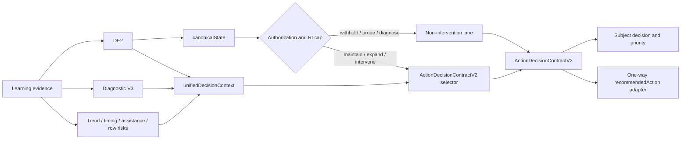

# Decision Engine P2 Implementation — 2026-07-23

## 1. Executive result

P2 was implemented for the internal decision engine only.

The combined DE2/V3/LPD/EDC path now has one selected-action contract:

`ActionDecisionContractV2`

`canonicalState` remains the only authorization and intensity authority. The unified decision context selects among permitted actions but cannot open intervention, convert RI0 into intervention, or exceed the canonical cap.

Measured result:

- Original full engine pipeline: 81/81 scenarios passed.
- Expanded audit: 162 scenarios.
- P1 context scenarios retained: 22.
- P2 action-pipeline scenarios: 35.
- Differential pairs: 34 total, including 12 new P2 pairs.
- Audit assertions: 846/846 passed.
- Logical branches: 57/57 covered.
- Existing relevant engine baseline: 271/271 passed.
- P0 focused tests: 5/5 passed.
- P1 focused tests: 13/13 passed.
- P2 focused tests: 21/21 passed.
- All 11 active non-empty P2 actions are reachable both directly and through EDC.
- Full intelligence self-test: passed.
- Exceptions: 0.
- Regressions: 0.
- Linter diagnostics on changed files: 0.

P2 satisfies the requested action-authority and action-differentiation conditions. This does not yet prove that the whole engine is professional. P3 taxonomy/subskill coverage and P4 calibration/explanation work remain necessary.

No commit, push, deployment, UI, demo, parent-facing copy, or API presentation change was made.

## 2. Root causes addressed

### 2.1 Narrow final action

Before P2, EDC reduced the final action to a small legacy set, primarily `watch` and `remediate_same_level`. Different diagnoses could therefore carry different metadata but still expose the same action.

### 2.2 Parallel vocabularies

The repository had several action-like vocabularies:

- canonical `actionState` and recommendation family;
- EDC `recommendedAction`;
- V3 `recommendedNextStep`;
- topic-next-step `decision.step`;
- recommendation families;
- phase-7 intervention and evidence actions;
- professional-framework recommendation types;
- adaptive-planner actions.

These values were not one versioned action decision. Some were producers, some enrichments, some presentation/planner outputs, and some legacy mirrors.

### 2.3 Missing semantic target

`remediate_same_level` did not say whether the target was the current topic, a safe subskill, a prerequisite, timing pressure, reading load, or independence.

### 2.4 Missing rejected-alternative trace

The old final action did not preserve which higher-priority alternatives were considered and why they were rejected.

### 2.5 Authority and selection were mixed

P0 made canonical state authoritative for permission. P2 completes the separation:

- canonical authorizes;
- unified context supplies eligible signals;
- ActionDecisionContractV2 selects;
- a legacy adapter mirrors the result without selecting it again.

## 3. Authority flow after P2



There is one final selected-action authority in the combined engine path. V3, topic-next-step, recommendation families, and professional framework values are inputs or legacy mappings, not parallel final selectors.

## 4. Vocabulary map before P2

### Canonical state

Producer: `evaluateDecisionTable`.

Values:

- `withhold`
- `probe_only`
- `diagnose_only`
- `intervene`
- `maintain`
- `expand_cautiously`

Role after P2: sole permission and cap authority. It does not choose the detailed professional action.

### EDC V1 recommendedAction

Values:

- `none`
- `watch`
- `remediate_same_level`
- `remediate_step_down`
- `maintain_and_strengthen`
- `maintain`
- `intervene`

Role after P2: backward-compatible mirror only. `LEGACY_MIRROR_RECOMMENDED_ACTION_CODES` explicitly marks that status. `mapEngineRecommendedAction` is deprecated and is no longer used by the active EDC builder.

### Diagnostic V3

Values:

- `practice_more`
- `give_probe_questions`
- `strengthen_prerequisite`
- `reduce_reading_load`
- `remove_timer`
- `advance_cautiously`
- `maintain`
- `insufficient_data`

Role after P2: eligible selection signal. V3 cannot authorize intervention.

### topic-next-step

Values include:

- `advance_level`
- `advance_grade_topic_only`
- `maintain_and_strengthen`
- `maintain_regular_strengthen_medium`
- `remediate_same_level`
- `drop_one_level_topic_only`
- `drop_one_grade_topic_only`
- `suggest_return_to_regular`

Role after P2: upstream/legacy recommendation data. It does not select the final EDC action.

### RecommendationContractV1 families

- `general_practice`
- `accuracy_focus`
- `speed_accuracy_balance`
- `recurrence_break`
- `independence_build`
- `retention_consolidation`

Role after P2: legacy recommendation metadata and normalization boundary. It remains subject to the P0 downward-only intensity normalizer.

### Intervention overlays

Existing values include:

- `reduce_time_pressure`
- `clarify_instruction_pattern`
- `stabilize_accuracy`
- `guided_to_independent_transition`
- `target_core_skill_gap`
- `monitor_before_escalation`

Their evidence actions include:

- `collect_controlled_practice`
- `accuracy_first_same_level`
- `clarify_task_reduce_hints`
- `fade_support_gradually`
- `targeted_review_errors`
- `pause_check_before_submit`
- `continue_short_sessions`

Role after P2: evidence and delivery signals, not final authorization.

### Professional framework

Values:

- `continue_current_level`
- `advance_cautiously`
- `targeted_practice`
- `review_foundation`
- `collect_more_data`
- `slow_down_and_check`
- `teacher_review_recommended`
- `professional_review_consideration`

Role after P2: enrichment/legacy vocabulary. Human-review actions were not activated because the combined engine has no canonical action route and no internal action consumer for them.

### Adaptive planner

Values include:

- `practice_current`
- `review_prerequisite`
- `probe_skill`
- `advance_skill`
- `maintain_skill`
- `pause_collect_more_data`

This is a separate planner pipeline. It was mapped for compatibility but was not changed and does not select the EDC action.

## 5. Authoritative enum after P2

Version: `2.0.0`.

Active non-empty actions:

1. `collect_more_evidence`
2. `give_probe_questions`
3. `practice_more`
4. `targeted_practice`
5. `strengthen_prerequisite`
6. `remove_timer`
7. `reduce_reading_load`
8. `guided_to_independent_transition`
9. `maintain`
10. `monitor_before_escalation`
11. `advance_cautiously`

Terminal value:

- `none`

Families:

- `none`
- `evidence_collection`
- `current_topic_reinforcement`
- `subskill_reinforcement`
- `prerequisite_reinforcement`
- `practice_mode_adaptation`
- `monitoring`
- `advancement`

The same action code may be reused only when family and target disambiguate its professional meaning. For example, `targeted_practice` with `subskill_reinforcement` has a non-null subskill target, while `targeted_practice` with `current_topic_reinforcement` targets the topic and requires cross-session taxonomy recurrence.

## 6. Action Decision Contract

The new contract contains:

```js
{
  version,
  action,
  family,
  intensity,
  eligible,
  intervention,
  target: {
    subject,
    topic,
    subskill,
    prerequisite
  },
  deliveryMode,
  evidenceBasis,
  reasonCodes,
  blockedAlternatives,
  authorityTrace
}
```

`authorityTrace` records:

- `soleAuthority: "canonicalState"`
- canonical presence;
- canonical `actionState`;
- canonical `recommendation.allowed`;
- canonical `intensityCap`;
- whether intervention is authorized;
- requested and applied intensity;
- whether the cap was applied.

Every unselected active action is represented in `blockedAlternatives`, either with a specific exclusion reason or as lower precedence than the selected action.

## 7. Canonical state to allowed actions

| Canonical state | Allowed result | Intensity | Intervention |
|---|---|---:|---|
| `withhold` | `none` or `collect_more_evidence` | RI0 | No |
| `probe_only` | `collect_more_evidence` or `give_probe_questions` | RI0 | No |
| `diagnose_only` | `give_probe_questions` with independent diagnostic delivery | RI0 | No |
| `intervene` | differentiated reinforcement/adaptation/monitoring within cap | RI1-RI2 | Only when allowed and cap > RI0 |
| `maintain` | `maintain` | RI0 | No remediation |
| `expand_cautiously` | `advance_cautiously`, otherwise guarded `maintain` | RI1 or RI0 | Only with canonical authorization and independent evidence |

Malformed combinations fail closed. For example, `expand_cautiously` with `allowed=false` or RI0 is guarded to `maintain`.

No P2 action requests RI3. Canonical RI3 remains a cap, not a requirement. The code does not invent a high-intensity action without an existing supported delivery distinction.

## 8. Action triggers, targets, exclusions, and priority

| Action | Required trigger | Target | Key exclusions | Priority behavior |
|---|---|---|---|---|
| `collect_more_evidence` | withhold, missing authority, or very thin probe evidence | topic | no practice evidence produces `none` | no escalation |
| `give_probe_questions` | `probe_only` or `diagnose_only` | topic or safe subskill | no remediation in this lane | no intervention priority |
| `practice_more` | authorized current-topic weakness without a safer higher-precedence specialization | topic | foundation, supported speed, reading-load, safe subskill, or recurrent taxonomy path wins first | declining signal may raise existing P1 priority within cap |
| `targeted_practice` | safe subskill, or known recurrent taxonomy across sessions | safe subskill or topic | unknown/random pattern; unsafe subskill; single-session-only recurrence | pattern/subskill P1 contribution applies |
| `strengthen_prerequisite` | below-grade relation plus foundation risk or V3 prerequisite recommendation | prerequisite skill; content-grade key fallback | above-grade caveat; missing prerequisite/foundation evidence | foundation risk raises P1 priority |
| `remove_timer` | timing eligibility plus speed-only/V3 speed evidence and wrong-answer timing | topic | timing absent or unsupported | speed-risk contribution only |
| `reduce_reading_load` | eligible V3 reading-load/error evidence | topic | no reading-load evidence | V3 contribution only |
| `guided_to_independent_transition` | guided success with stable/partial decision under intervention authorization | topic | no supported guided-success transition | assistance contribution applies |
| `maintain` | canonical maintain, or guarded failed advancement | topic | remediation prohibited | neutral/de-escalating |
| `monitor_before_escalation` | supported improving trend or above-grade caveat | topic | does not open intervention | improving/above-grade lowers priority |
| `advance_cautiously` | canonical expand, independent evidence, no guided/grade/contradictory blocker | topic | guided evidence, above-grade caveat, contradiction, missing authority | existing P1 signals may block/de-escalate |

Action selection itself does not mutate priority a second time. Priority remains the reconciled P1 signal result; P2 consumes it and its supporting signals without double-counting.

## 9. Reconciliation order

The selector uses a fixed order:

1. canonical authorization and RI cap;
2. evidence lane and canonical action state;
3. above-grade no-overintervention guard;
4. foundation/prerequisite;
5. speed adaptation;
6. reading-load adaptation;
7. guided-to-independent transition;
8. safe subskill;
9. known recurrent taxonomy across sessions;
10. improving-to-monitoring;
11. current-topic reinforcement fallback;
12. maintenance or cautious advancement in their canonical lanes.

This order is code-defined and deterministic. It does not depend on module execution order or object insertion order.

## 10. Differential proofs

| Pair | A | B |
|---|---|---|
| random vs repeated known taxonomy | `practice_more` | `targeted_practice` / topic |
| same-grade vs below-grade foundation | `practice_more` | `strengthen_prerequisite` |
| normal timing vs supported speed pressure | `practice_more` | `remove_timer` |
| blocked vs safe subskill | topic-level `practice_more` | `targeted_practice` / subskill |
| independent vs guided stable success | `practice_more` in controlled intervention fixture | `guided_to_independent_transition` |
| improving vs declining | `monitor_before_escalation` | `practice_more` with declining reason |
| V3 practice-more vs prerequisite | `practice_more` | `strengthen_prerequisite` |
| reading-load vs conceptual | `reduce_reading_load` | `targeted_practice` |
| single-session vs cross-session pattern | `practice_more` | `targeted_practice` |
| diagnose-only vs intervene | `give_probe_questions` / RI0 | `practice_more` / authorized RI |
| maintain vs expand | `maintain` | `advance_cautiously` |
| RI1 vs RI2 | same action/family | same action/family, capped intensity changes |

Each pair asserts action, family, target, intensity, eligibility, reasons, blocked alternatives, and authority trace.

## 11. Reachability

All 11 active non-empty actions are reached:

- through direct ActionDecisionContractV2 scenarios;
- through EDC integration scenarios;
- with a valid target;
- with reason codes;
- with canonical authority trace;
- without exceeding the cap.

Every intervention action also has a canonical-withhold exclusion scenario and appears in the blocked trace.

`none` is a terminal q=0 contract value and is not counted as an active action capability.

Unsupported actions were not advertised:

- no dedicated `increase_fluency` action has an authoritative producer;
- no teacher-review action has a canonical action route in this pipeline;
- no professional-review action has an internal action consumer;
- no unconstrained enrichment action exists beyond `advance_cautiously`;
- no precise prerequisite skill is claimed when only a lower content-grade key is available.

## 12. Invariants

All 20 P2 invariants passed:

1. No action exceeds canonical cap.
2. RI0 produces no intervention.
3. `allowed=false` produces no intervention.
4. `probe_only` produces no remediation.
5. Unsafe subskill is never a target.
6. Prerequisite action requires foundation/prerequisite evidence.
7. Speed adaptation requires timing/risk evidence.
8. Reading adaptation requires reading-load evidence.
9. Advancement requires independent evidence and canonical authorization.
10. Guided mastery differs from independent mastery.
11. Unknown taxonomy cannot produce a specific diagnosis target.
12. Random mistakes cannot produce targeted-pattern action.
13. Selection is deterministic.
14. Evidence-order permutation does not change action/family/target.
15. Every active action is reachable.
16. Legacy values are explicitly mapped.
17. The combined pipeline has one selected-action authority.
18. The P0 normalizer still cannot increase intensity.
19. Rejected actions remain in trace.
20. Shared action codes use family and target to preserve meaning.

The original P0 invariants and all P1 canonical-authority assertions also remain green.

## 13. Migration and compatibility

### Active path

`buildParentReportEngineDecisionContract` now calls `buildActionDecisionContractV2` and derives the legacy `recommendedAction` only from `legacyRecommendedActionFromContractV2`.

### Subject aggregation

`buildSubjectEngineDecisionContract` consumes `actionDecisionContract` for actionability and retains the legacy fallback only for older records without V2.

### Legacy mapping

`LEGACY_ACTION_MAPPINGS_V2` explicitly maps EDC, V3, topic-next-step, professional-framework, planner, and intervention-overlay values that have a safe V2 equivalent.

The complete topic-step vocabulary is covered, including the two compatibility aliases:

- `maintain_regular_strengthen_medium` → `practice_more`
- `suggest_return_to_regular` → `maintain`

Ambiguous legacy values are explicitly marked:

- `maintain_and_strengthen`
- `remediate_same_level`
- `intervene`

They remain readable but are not authorities.

Values without a safe semantic equivalent are explicitly marked in
`UNSUPPORTED_LEGACY_ACTIONS_V2` instead of being falsely mapped. These include
human-review values without a canonical route, `clarify_instruction_pattern`
without a dedicated instruction-adaptation action, and phase evidence
instructions that are delivery guidance rather than selected actions.

### Unchanged consumers

The following classes of consumers were intentionally not changed:

- parent-facing copy and owner templates;
- detailed parent report presentation;
- UI components;
- demo data;
- API presentation mapping;
- teacher/school presentation surfaces;
- adaptive planner;
- system-intelligence modifiers of legacy topic-next-step output.

These consumers may continue reading the legacy mirror, but they cannot alter the internal V2 selected action. Migrating presentation consumers to exploit V2 distinctions is outside P2.

## 14. Files changed

### Product logic

- `utils/action-decision-contract/action-decision-contract-v2.js`
  - versioned enum;
  - authority/cap enforcement;
  - deterministic selector;
  - target and delivery mode;
  - evidence basis, reasons, blocked alternatives, authority trace;
  - validation;
  - one-way legacy adapters.
- `utils/learning-pattern-decision/build-parent-report-engine-decision-contract.js`
  - active V2 selection;
  - legacy mirror derived from V2;
  - old mapper deprecated.
- `utils/learning-pattern-decision/build-subject-engine-decision-contract.js`
  - V2 actionability consumed by subject aggregation.
- `utils/learning-pattern-decision/build-unified-decision-context.js`
  - V3 dominant error and prerequisite signal added to the unified context.
- `utils/learning-pattern-decision/index.js`
  - V2 exports.
- `utils/learning-pattern-decision/engine-decision-codes.js`
  - legacy mirror status made explicit.

### Tests and audit

- `tests/learning/action-decision-contract-p2.test.mjs`
- `tests/engine-decision-audit/full-engine-audit.mjs`
- `artifacts/qa/decision-engine-audit/run-summary.json`
- `artifacts/qa/decision-engine-audit/p2-action-results.json`
- updated audit snapshots and logical coverage artifacts.

## 15. Verification

Final required runs:

- Expanded audit: 846 passed, 0 failed.
- Original pipeline cases inside audit: 81 passed, 0 failed.
- Existing relevant engine tests:
  - DE2 harness: 19/19.
  - V3 simulation: 16/16.
  - LPD scenarios suite: 1/1.
  - EDC and subject contract suites: 2/2.
  - timing/trend/assistance/attempt suites: 87/87.
  - taxonomy/evidence suites: 146/146.
  - total: 271/271.
- P0 normalizer: 5/5.
- P1 unified-context: 13/13.
- P2 contract and EDC reachability: 21/21.
- intelligence-layer self-test: passed.
- whitespace validation: passed.
- linter diagnostics: 0.

No assertion was weakened and no snapshot was updated to conceal a failure.

## 16. Remaining limitations and P3-P4

### P3

- Expand taxonomy and safe-subskill coverage.
- Produce precise prerequisite skill identifiers more consistently; current safe fallback may target a lower content-grade key.
- Improve coverage of reading-load and conceptual classifications across subjects.
- Establish supported fluency taxonomy before adding a dedicated fluency action.
- Prove raw-evidence-to-action reachability across every supported subject/taxonomy cell, not only controlled engine and EDC scenarios.

### P4

- Calibrate intensity use, including whether any evidence-backed action should use RI3.
- Improve explanation quality and counterfactual reasons.
- Migrate approved downstream consumers from the legacy mirror to V2 fields.
- Calibrate priority interaction without double-counting action and signal effects.
- Add longitudinal outcome validation: whether the chosen action improves subsequent evidence.
- Evaluate teacher-review/human-review routes only after an explicit canonical authority policy and consumer exist.

## 17. Final conclusion

P2 replaces the combined engine's generic final action selector with a differentiated, versioned, traceable action contract under one canonical authority.

The action engine can now distinguish evidence collection, probing, same-topic reinforcement, safe subskill targeting, prerequisite review, speed adaptation, reading-load adaptation, guided-to-independent transition, maintenance, monitoring, and cautious advancement.

The engine still should not be classified as fully professional. The action-selection architecture is now materially stronger, but professional status still depends on P3 taxonomy breadth and P4 calibration, explanations, downstream migration, and longitudinal validation.
