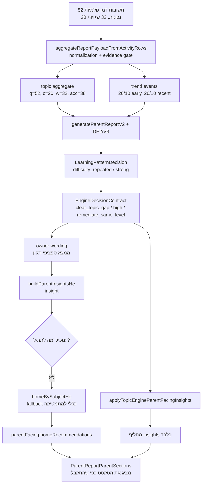

# חקירת שורש: שרשרת החלטה ודיווח להורה

תאריך: 2026-07-23  
סטטוס: חקירה בלבד; לא שונה קוד מוצר, ניסוח, סף או UI.

## מסקנה

המנוע כן מייצר החלטה מובחנת וחזקה. בתרחיש שנבדק הוא מחליט:

```json
{
  "engineDecision": "clear_topic_gap",
  "severity": "high",
  "evidenceStrength": "strong",
  "recommendedAction": "remediate_same_level",
  "priority": { "level": "P4", "breadth": "wide" },
  "why": ["accuracy_band_clear_gap"]
}
```

המידע נעשה גנרי במסלול ההמלצה הביתית, לא במנוע:

1. `buildParentInsightsHe` יוצר ממצא טקסטואלי.
2. `buildHomeRecommendationsHe` אינו קורא את `recommendedAction`, את ה־priority או את אובייקט ההחלטה.
3. במקום זאת הוא מנסה לחלץ פעולה מתוך הטקסט באמצעות `/מה לתרגל:\s*(.+)$/`.
4. הממצא התקין אינו מכיל `מה לתרגל:`, ולכן החילוץ נכשל.
5. הקוד נופל ל־`homeBySubjectHe`, שמחזיר המלצה כללית לפי מקצוע בלבד.
6. בצד הלקוח `applyTopicEngineParentFacingInsights` מחליף רק `parentFacing.insights`; הוא אינו מחליף `homeRecommendations`.
7. רכיב ההורה קורא נכון את `parentFacing.homeRecommendations` ומציג את ה־fallback הגנרי שקיבל.

כלומר: זו אינה בעיית UI ואינה בעיית ניסוח. זו בעיית mapping שבה החלטה מובנית מוחלפת בתלות שבירה בטקסט, ואחריה fallback לפי מקצוע.

## התרחיש שנבדק

```json
{
  "studentId": "demo-parent-child-noam-g2",
  "studentName": "נועם",
  "registeredGrade": "g2",
  "from": "2026-03-25",
  "to": "2026-04-30",
  "subject": "math",
  "topic": "subtraction",
  "topicLabelHe": "חיסור"
}
```

התרחיש דטרמיניסטי ונוצר ב־`applyNoamDemoMathTopicProfile`.

## תרשים הזרימה בפועל



## שלבים, קבצים ופונקציות

1. יצירת תשובות: `lib/demo/parent-demo-data/demo-noam-math-topic-profile.server.js` — `applyNoamDemoMathTopicProfile`
2. הוספת זמני מענה: `lib/demo/parent-demo-data/demo-answer-time.server.js` — `attachDemoAnswerTiming`
3. normalization ואגרגציה: `lib/parent-server/report-data-aggregate.server.js` — `aggregateReportPayloadFromActivityRows`
4. adapter לדוח V2: `lib/learning-supabase/report-data-adapter.js` — `buildReportInputFromDbData`
5. חישוב trend: `utils/parent-report-topic-trend-v1.js` — `computeTopicTrendV1`
6. בניית DE2/V3/LPD: `utils/parent-report-v2.js` — `generateParentReportV2`
7. החלטת LPD: `utils/learning-pattern-decision/build-learning-pattern-decision.js` — `buildLearningPatternDecision`
8. החלטת מנוע: `utils/learning-pattern-decision/build-parent-report-engine-decision-contract.js` — `buildParentReportEngineDecisionContract`
9. policy/owner wording: `utils/learning-pattern-decision/resolve-topic-owner-copy.js` — `resolveTopicPrimaryFindingOwnerCopyHe`
10. תבניות: `utils/parent-report-language/parent-report-owner-topic-copy-templates-he.js`
11. payload שרת: `lib/parent-server/parent-report-parent-facing.server.js` — `buildParentFacingBlocks`
12. החלפת insights בלקוח: `utils/parent-report-engine-insights-he.js` — `applyTopicEngineParentFacingInsights`
13. bridge API→דוח: `lib/learning-supabase/parent-report-from-api-payload.js` — `runParentReportGenerationFromApiBody`
14. props לדוח המקיף: `pages/learning/parent-report-detailed.js` — `enrichDetailedPayloadWithUiAuthority`
15. תצוגה: `components/parent/ParentReportParentSections.jsx` — `normalizeParentFacing`, `ParentReportParentSections`

## Snapshot 1 — תשובות גולמיות

ה־spec המלא:

```json
{
  "totalQuestions": 52,
  "earlyCorrect": 10,
  "earlyTotal": 26,
  "lateCorrect": 10,
  "lateTotal": 26,
  "sessions": 9
}
```

אירוע שגוי מייצג, לפני aggregation:

```json
{
  "id": "demo-noam-math-ans-demo-noam-math-subtraction-20260325-s0-0",
  "student_id": "demo-parent-child-noam-g2",
  "learning_session_id": "demo-noam-math-subtraction-20260325-s0",
  "is_correct": false,
  "answered_at": "2026-03-25T07:18:00.000Z",
  "answer_payload": {
    "subject": "math",
    "topic": "subtraction",
    "gameMode": "practice",
    "level": "medium",
    "isDiagnosticEligible": true,
    "evidenceCategory": "diagnostic_independent",
    "contextFlags": {
      "afterStepByStep": false,
      "contextAfterBookReading": false,
      "hasHints": true
    },
    "expectedAnswer": 25,
    "userAnswer": 35,
    "patternFamily": "add_instead_of_sub",
    "rawTimeSpentMs": 89134,
    "timeSpentMs": 89134,
    "creditedTimeMs": 89134
  }
}
```

כל 52 האירועים:

```json
{
  "count": 52,
  "correctness": [
    false,false,false,false,false,false,true,false,true,false,true,false,true,
    false,true,false,true,false,true,false,true,false,true,false,true,false,
    false,false,false,false,false,false,true,false,true,false,true,false,true,
    false,true,false,true,false,true,false,true,false,true,false,true,false
  ],
  "wrongPatternFamily": {
    "add_instead_of_sub": 32
  },
  "timing": {
    "sumMs": 2955691,
    "avgMs": 56840,
    "minMs": 34777,
    "maxMs": 89134,
    "over60000Ms": 21,
    "under6000Ms": 0,
    "wrongAvgMs": 65971,
    "correctAvgMs": 42231
  }
}
```

הערה: `attemptIndex` מוזן רק לפונקציית יצירת הזמן (`0` לנכונה, `1` לשגויה), אך אינו נשמר ב־`answer_payload`. לכן אין downstream count אמיתי של ניסיונות.

## Snapshot 2 — לאחר normalization

```json
{
  "subject": "math",
  "topic": "subtraction",
  "resolvedMode": "practice",
  "resolvedLevel": "medium",
  "classification": {
    "isDiagnosticEligible": true,
    "evidenceCategory": "diagnostic_independent",
    "afterStepByStep": false
  },
  "evidenceSource": "self_practice",
  "contentGradeKey": "g2",
  "registeredGradeKey": "g2",
  "gradeRelation": "same",
  "isSlowThresholdMs": 60000,
  "isFastThresholdMs": 6000,
  "trendEvent": {
    "answeredAtMs": 1774423080000,
    "isCorrect": false,
    "evidenceSource": "self_practice"
  }
}
```

## Snapshot 3 — אגרגציית נושא

```json
{
  "bucketKey": "subtraction",
  "topicRowKey": "subtraction::grade:g2",
  "questions": 52,
  "correct": 20,
  "wrong": 32,
  "accuracy": 38,
  "timeMinutes": 49,
  "needsPractice": true,
  "excellent": false,
  "modeKey": "practice",
  "gradeKey": "g2",
  "registeredGradeKey": "g2",
  "contentGradeKey": "g2",
  "displayLevelKey": "regular"
}
```

## Snapshot 4 — signals ו־features

```json
{
  "trendV1": {
    "ok": true,
    "source": "parent_report_topic_timeline_v1",
    "direction": "stable",
    "early": {
      "questions": 26,
      "correct": 10,
      "accuracyPct": 38,
      "from": "2026-03-25T07:18:00.000Z",
      "to": "2026-04-19T10:19:00.000Z"
    },
    "recent": {
      "questions": 26,
      "correct": 10,
      "accuracyPct": 38,
      "from": "2026-04-20T10:20:00.000Z",
      "to": "2026-04-29T13:23:00.000Z"
    },
    "deltaPct": 0,
    "confidence": "enough"
  },
  "de2": {
    "evidenceTrace": [
      {
        "type": "volume",
        "source": "report_row",
        "value": { "questions": 52, "correct": 20, "wrong": 32, "accuracy": 38 }
      },
      {
        "type": "mistake_events",
        "source": "normalized_mistake_event",
        "value": { "total": 32, "wrong": 32, "rowWrongTotal": 32, "wrongCountForRules": 32 }
      },
      {
        "type": "recency",
        "source": "row",
        "value": { "lastSessionMs": 1777468980000 }
      }
    ],
    "confidence": {
      "level": "high",
      "rowSignals": {
        "dataSufficiencyLevel": "strong",
        "isEarlySignalOnly": false
      }
    },
    "priority": { "level": "P4", "breadth": "wide" },
    "diagnosis": {
      "allowed": false,
      "taxonomyId": null,
      "lineHe": null
    },
    "canonicalState": {
      "assessment": {
        "confidenceLevel": "high",
        "readiness": "emerging",
        "decisionTier": 0,
        "cannotConcludeYet": false,
        "allowedClaimClass": "no_claim"
      },
      "actionState": "probe_only",
      "recommendation": {
        "family": "probe_only",
        "allowed": false,
        "intensityCap": "RI0",
        "reasonCodes": ["no_taxonomy_match"]
      }
    }
  }
}
```

## Snapshot 5 — החלטת המנוע המלאה

```json
{
  "subject": "math",
  "topic": "subtraction::grade:g2",
  "topicName": "חיסור",
  "questions": 52,
  "correct": 20,
  "wrong": 32,
  "accuracy": 38,
  "engineDecision": "clear_topic_gap",
  "sourceEngine": "topic_aggregation",
  "detectedPattern": null,
  "misconceptionLabel": null,
  "affectedSubskill": null,
  "severity": "high",
  "evidenceStrength": "strong",
  "recommendedAction": "remediate_same_level",
  "parentSafeFinding": "בנושא חיסור נראה קושי ברור - 32 שגיאות מתוך 52 שאלות (38% דיוק). כדאי לחזור ולחזק את חיסור לפני שממשיכים. מבוסס על 52 שאלות שנפתרו בנושא.",
  "uncertaintyText": null,
  "blockPatternClaim": true,
  "actionState": "probe_only",
  "traceReason": [
    "raw:received",
    "metrics:q=52,c=20,w=32,acc=38",
    "de2:unit_present",
    "v3:enrichment_present",
    "engineDecision:clear_topic_gap",
    "recommendedAction:remediate_same_level",
    "parentSafeFinding:engine"
  ],
  "engineDiagnosticDecision": {
    "version": 1,
    "engineConfidenceTier": "T4",
    "accuracyBand": "clear_gap",
    "engineDecision": "clear_topic_gap",
    "topicWeaknessLevel": "clear",
    "rootCause": "",
    "behaviorType": "",
    "dominantMistakePattern": "",
    "taxonomyMatch": false,
    "safeSubskillToShow": false,
    "guardrailsApplied": ["subskill_requires_taxonomy_match"],
    "why": ["accuracy_band_clear_gap"]
  }
}
```

## Snapshot 6 — LPD ו־policy/wording envelope

```json
{
  "practicedQuestions": 52,
  "correctCount": 20,
  "wrongCount": 32,
  "accuracy": 38,
  "observedPatternLevel": "strong",
  "evidenceStrength": "strong",
  "topicStatus": "difficulty_repeated",
  "findingType": "difficulty_pattern",
  "repeatedMistakePatterns": [
    {
      "key": "pf:add_instead_of_sub",
      "count": 32,
      "ratio": 1,
      "label": "unknown"
    }
  ],
  "parentVisibleFinding": "בנושא חיסור היו הרבה טעויות בשאלות שנפתרו. כדאי לחזור ולחזק את הנושא. מבוסס על 52 שאלות שנפתרו בנושא.",
  "parentWordingLevel": "pattern_observed",
  "blockedClaims": ["no_root_cause_claim", "no_long_term_claim"],
  "sourceEngines": ["topic_aggregation", "de2", "canonicalState", "v3"],
  "templateId": "difficulty_observed"
}
```

ה־pattern עצמו נחסם לתצוגה כי התווית היא `unknown`; זה guardrail תקין. חסימת התווית אינה מצדיקה מחיקת ההחלטה `clear_topic_gap` או הפעולה `remediate_same_level`.

## Snapshot 7 — payload לדוח

לפני generation בצד הלקוח:

```json
{
  "parentFacing": {
    "insights": [
      "מתמטיקה - «חיסור»: בחיסור היו כמה טעויות, אבל עדיין אין מספיק שאלות כדי לדעת אם זה חוזר בקביעות."
    ],
    "homeRecommendations": [
      "בבית: לפתור מעט שאלות באותו נושא, בקצב איטי, ולבקש מהילד להסביר את שלבי הפתרון."
    ],
    "teacherMessages": [],
    "practiceFocus": [],
    "diagnosisSuppressed": false,
    "gatingApplied": false
  }
}
```

אחרי `applyTopicEngineParentFacingInsights`:

```json
{
  "_parentFacingInsightsSource": "topic_engine",
  "parentFacing": {
    "insights": [
      "מתמטיקה - «חיסור - כיתה ב׳»: בחיסור - כיתה ב׳ כדאי להתמקד עכשיו. נפתרו 52 שאלות, והדיוק הוא 38%."
    ],
    "homeRecommendations": [
      "בבית: לפתור מעט שאלות באותו נושא, בקצב איטי, ולבקש מהילד להסביר את שלבי הפתרון."
    ]
  }
}
```

זה גבול ההוכחה: insight מתוקן מהחלטת המנוע, אבל ההמלצה נשארת fallback כללי.

## Snapshot 8 — props לרכיב

```json
{
  "report": {
    "parentFacing": {
      "insights": [
        "מתמטיקה - «חיסור - כיתה ב׳»: בחיסור - כיתה ב׳ כדאי להתמקד עכשיו. נפתרו 52 שאלות, והדיוק הוא 38%."
      ],
      "homeRecommendations": [
        "בבית: לפתור מעט שאלות באותו נושא, בקצב איטי, ולבקש מהילד להסביר את שלבי הפתרון."
      ],
      "teacherMessages": []
    }
  },
  "normalizedByComponent": {
    "insights": [
      "מתמטיקה - «חיסור - כיתה ב׳»: בחיסור - כיתה ב׳ כדאי להתמקד עכשיו. נפתרו 52 שאלות, והדיוק הוא 38%."
    ],
    "homeRecommendations": [
      "בבית: לפתור מעט שאלות באותו נושא, בקצב איטי, ולבקש מהילד להסביר את שלבי הפתרון."
    ],
    "teacherMessages": []
  }
}
```

## Snapshot 9 — הטקסט הסופי

```json
{
  "section": "מה מומלץ לעשות בבית",
  "displayedMessage": "בבית: לפתור מעט שאלות באותו נושא, בקצב איטי, ולבקש מהילד להסביר את שלבי הפתרון.",
  "lostDecisionContext": {
    "topic": "חיסור",
    "priority": "P4",
    "engineDecision": "clear_topic_gap",
    "reason": "accuracy_band_clear_gap",
    "evidence": "52 שאלות, 32 שגיאות, 38% דיוק, מגמה יציבה",
    "recommendedAction": "remediate_same_level"
  }
}
```

## תשובות מפורשות לשאלות

### האם המנוע מייצר החלטה אמיתית ומובחנת?

כן. `clear_topic_gap`, חומרה `high`, evidence `strong`, פעולה `remediate_same_level`, עדיפות יחידה `P4`.

### האם ההחלטה כוללת reason, evidence, priority ו־recommended action?

לא כאובייקט עצמאי מלא אחד:

- reason: קיים כ־`engineDiagnosticDecision.why` וכ־`traceReason`, לא כשדה `reason`.
- evidence: קיים כ־metrics, `evidenceStrength`, `dataText`, `evidenceTrace` ו־`evidenceBuckets`, לא כשדה `evidence` יחיד.
- priority: קיים ב־DE2 unit כ־`unit.priority`, אך לא בתוך `engineDecisionContract`.
- recommended action: קיים במפורש כ־`recommendedAction`.

לכן צרכן שמקבל רק `engineDecisionContract` אינו מקבל priority מלא, וצרכן שמקבל רק `parentFacing` מקבל טקסטים בלבד.

### האם שדה נמחק ב־serialization, normalization או mapping?

לא נמצא מחיקה של שדות ההחלטה שכבר קיימים. הבעיה היא מוקדמת יותר: במסלול השרת ההחלטה נבנית באופן transient בתוך helper של הטקסט ואינה מצורפת ל־API payload. בצד הלקוח ההחלטה קיימת בדוח V2, אך `buildHomeRecommendationsHe` אינו צורך אותה. `stripInternalReportPayloadFields` משמר במפורש את `_internalTopicAnswerEvents`.

### האם החלטות שונות מומרות לאותו readiness/status כללי?

כן. readiness נגזר מ־gate readiness וממצב gate, לא מ־`engineDecision`. לכן החלטות שונות יכולות לחלוק `emerging`, `forming` או `ready`. בתרחיש זה קיימים במקביל:

```json
{
  "engineDecision": "clear_topic_gap",
  "canonicalReadiness": "emerging",
  "gateReadiness": "forming",
  "confidence": "high"
}
```

ההתכנסות אינה שורש ה־fallback שנבדק, אך אסור להשתמש ב־readiness לבדו כתחליף להחלטה.

### האם fallback גנרי מופעל אף שקיימת החלטה תקינה?

כן. `homeBySubjectHe("math")` מופעל לאחר שחילוץ `/מה לתרגל:/` נכשל, אף שקיים `recommendedAction: "remediate_same_level"`.

### האם רכיב ההורה קורא את השדה הנכון?

כן. `normalizeParentFacing` קורא `parentFacing.homeRecommendations`, ו־`ParentReportParentSections` מציג אותו ללא החלפה. ה־UI אינו שורש התקלה.

### האם נתוני הדמו מייצרים signals חזקים והגיוניים?

כן:

- 52 שאלות
- 32 שגיאות
- 38% דיוק
- 32 שגיאות מאותה `patternFamily`
- early 38%, recent 38%, כלומר קושי מתמשך
- confidence high, evidence strong, priority P4

ה־taxonomy label נחסם כי הוא `unknown`; זו זהירות תקינה, לא חוסר signal.

### האם זמן, early/late ומספר ניסיונות נכללים בהחלטה?

- early/late: מחושב ונשמר כ־`trendV1`, אך אינו קלט ל־`buildParentReportEngineDecisionContract`; ההחלטה בתרחיש מבוססת על volume/accuracy.
- זמן: נשמר באגרגציה ובנתוני תצוגה (`timeMinutes`, ממוצעים, slow/fast counters), אך אינו מופיע ב־`evidenceTrace` של היחידה ואינו מועבר ל־`buildEngineDiagnosticDecision` בתרחיש זה.
- ניסיונות: `attemptIndex` משפיע על זמן הדמו בזמן היצירה בלבד ואינו נשמר. אין signal downstream של מספר ניסיונות.

## שורש התקלה והוכחה

הקוד ב־`buildHomeRecommendationsHe` עושה:

```js
const actionFromInsights = insights
  .map((line) => {
    const m = String(line || "").match(/מה לתרגל:\s*(.+)$/);
    return m ? m[1].trim() : "";
  })
  .find(Boolean);
```

הממצא התקין שמתקבל אינו מכיל `מה לתרגל:`. לכן `actionFromInsights` ריק. לאחר מכן:

```js
recs.push(homeBySubjectHe(weakest.subject));
```

ולמתמטיקה:

```js
return "בבית: לפתור מעט שאלות באותו נושא, בקצב איטי, ולבקש מהילד להסביר את שלבי הפתרון.";
```

בנוסף, `applyTopicEngineParentFacingInsights` מעדכן רק:

```js
clientReport.parentFacing.insights = engineInsights;
```

ולא את `homeRecommendations`.

## תיקון מינימלי

ללא שינוי ספים, UI או ניסוח:

1. להפסיק לחלץ recommended action מטקסט insight.
2. להעביר ל־`buildHomeRecommendationsHe` את החלטת הנושא שנבחרה, או להחזיר מ־`buildParentInsightsHe` גם structured selection.
3. לבחור פעולה לפי `engineDecisionContract.recommendedAction` וה־priority הקיים.
4. לרנדר את הפעולה באמצעות תבניות owner קיימות (`resolveTopicRecommendationOwnerCopyHe`), ללא טקסט חדש.
5. ב־`applyTopicEngineParentFacingInsights` לעדכן גם `homeRecommendations` מאותו structured decision, או להימנע משני מקורות authority שונים.

היקף מינימלי צפוי:

- `lib/parent-server/parent-report-parent-facing.server.js`
- `utils/parent-report-engine-insights-he.js`
- בדיקת integration אחת שמתחילה ב־API payload ומסתיימת ב־`normalizeParentFacing`

אין צורך לשנות את המנוע, את הספים, את נתוני הדמו או את רכיב התצוגה.

## בדיקות ממוקדות נדרשות

### 1. קושי מתמשך

קלט: 52 שאלות, 38% early ו־38% recent.  
Assert: `clear_topic_gap`, `severity=high`, `recommendedAction=remediate_same_level`; ההמלצה הסופית כוללת topic שנבחר ואינה שווה ל־`homeBySubjectHe`.

### 2. שיפור

קלט: early 38%, recent 79%.  
Assert: trend `improving` נשמר עד props; אם החלטת החיזוק נשארת תקפה, ההמלצה נובעת ממנה ואינה מוחלפת ב־readiness כללי.

### 3. החמרה

קלט: early 79%, recent 38%.  
Assert: trend `declining`; אין מיפוי זהה לתרחיש improving; priority אינו יורד.

### 4. זמן מענה חריג

קלט: אותו accuracy בשני תרחישים, אך באחד רוב התשובות מעל `slowMs`.  
Assert נוכחי: timing נשמר אך אינו משנה decision. הבדיקה תתעד זאת במפורש, כדי למנוע טענה שזמן השפיע. אם בעתיד יחובר signal, הבדיקה תדרוש reason code ייעודי.

### 5. מעט נתונים

קלט: 1–4 שאלות.  
Assert: `insufficient_data`/`early_direction_only`, אין `clear_topic_gap`, אין action אינטנסיבי, ואין fallback שטוען לחיזוק ברור.

### 6. שני קשיים בעדיפות שונה

קלט: topic A `P4/high/clear_topic_gap`, topic B `P2/moderate/topic_needs_strengthening`.  
Assert: A נבחר להמלצה הביתית גם אם B בעל accuracy דומה; אין בחירה לפי מקצוע בלבד; payload, props והטקסט הסופי משמרים את topic A ואת action שלו.

חשוב: `sortPriorityTopics` בחוזה המקצוע הנוכחי מדרג לפי decision rank, חוזק evidence, severity ומספר שגיאות, אך אינו צורך את `unit.priority.level`. לכן בדיקת P4 מול P2 צריכה להיכשל כרגע או לתעד במפורש שה־P-level אינו authority לסדר. אסור להניח שהשדה נשמר רק משום שהוא קיים ביחידת DE2.

## בדיקות קיימות שהורצו

```text
tests/learning-pattern-decision/scenarios.test.mjs: passed
tests/learning/parent-report-topic-trend-v1.test.mjs: passed
tests/learning/parent-output-final-closure-contract.test.mjs: 38/38 passed
tests/learning-pattern-decision/server-parent-facing-lpd.test.mjs: passed
tests/learning/parent-report-engine-decision-contract.test.mjs: passed
tests/learning/subject-engine-decision-contract.test.mjs: passed
tests/learning/parent-report-trend-v1-api-pipeline.test.mjs: 4/4 passed
tests/demo/parent-portal-demo.test.mjs: 30/30 passed
```

הבדיקות הקיימות בודקות שכבות בנפרד. הן אינן תופסות את התקלה משום שאין assertion מקצה לקצה ש־`recommendedAction` מגיע ל־`parentFacing.homeRecommendations` ולרכיב. גם ה־golden-book הקיים שומר בעיקר טקסט מרונדר ולא snapshots מלאים של חוזי הגבולות.
