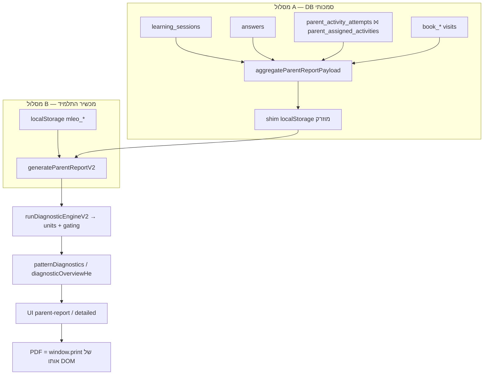

# Audit: דוחות הורים והמנוע האבחוני (Read‑Only)

> מסמך זה הוא **Audit בלבד**. לא בוצע שום שינוי קוד, refactor, תיקון באג, שינוי UI/DB/טקסט, ולא נוצרו בדיקות חדשות.
> כל ממצא מסומן כ‑**הוכחה** (קריאת קוד ישירה עם file:line) או כ‑**חשד / לא מוכח**. היכן שלא נבדק — כתוב במפורש "לא נבדק".
> שיטה: קריאה סטטית של הקוד בלבד. **לא הורצו בדיקות** (הרצת בדיקות לא נדרשה כדי למפות את הזרימה; כיסוי הבדיקות נאמד מתוכן הקבצים).
> תאריך: 2026‑06‑15. גרסת מנוע: `ENGINE_VERSION = "2.0.0"` (`utils/diagnostic-engine-v2/run-diagnostic-engine-v2.js:28`).

---

## 1. Scope — מה נבדק

נבדקו שתי השכבות והחיבור ביניהן:

1. **המנוע האבחוני (Diagnostic Engine V2)** — `utils/diagnostic-engine-v2/*` (gating, confidence, priority, strength, taxonomy).
2. **שכבת אגרגציה לדוח הורים** — `lib/parent-server/report-data-aggregate.server.js` (מסד נתונים Supabase), ו‑`utils/parent-report-v2.js` (מסלול localStorage במכשיר).
3. **גזירת המלצות / חוזקות / חולשות** — `utils/parent-report-recommendation-consistency.js`, `utils/topic-next-step-engine.js`, `utils/parent-report-language/*`, `lib/learning/positive-evidence.js`.
4. **רינדור UI ו‑PDF** — `pages/learning/parent-report.js`, `pages/learning/parent-report-detailed.js`, `utils/math-report-generator.js` (export).
5. **מקורות נתונים ו‑fallback** — `lib/learning-supabase/*`, seed/shim, localStorage.

**מה לא נבדק (מסומן במפורש):**
- לא נבדק התנהגות runtime בפועל (לא הורצו דפדפן/בדיקות/DB אמיתי).
- לא נבדקו סכמת ה‑DB וה‑RLS בפועל (רק שמות עמודות כפי שמופיעים בשאילתות).
- לא נבדק ה‑Copilot להורים לעומק (מחוץ ל‑scope; נבדק רק היכן שהוא חולק מקור נתונים עם הדוח).
- לא נבדקה איכות התוכן/השאלות עצמן (curriculum), רק זרימת הנתונים והמסקנות.

---

## 2. קבצים / מודולים שנבדקו

**מנוע אבחוני:**
- `utils/diagnostic-engine-v2/run-diagnostic-engine-v2.js` — אורכסטרציה ראשית.
- `utils/diagnostic-engine-v2/output-gating.js` — שערי פלט + `positiveAuthorityLevel`.
- `utils/diagnostic-engine-v2/confidence-policy.js` — רמות ביטחון.
- `utils/diagnostic-engine-v2/strength-profile.js` — זיהוי חוזק.
- `utils/diagnostic-engine-v2/priority-policy.js`, `intervention-layer.js`, `recurrence.js`, `taxonomy-registry.js`, `index.js`.

**אגרגציה / מקור נתונים:**
- `lib/parent-server/report-data-aggregate.server.js` — אגרגציה צד‑שרת מ‑Supabase (sessions + answers + parent_activity_attempts + book).
- `lib/parent-server/parent-facing-report-authority.js`, `parent-report-parent-facing.server.js`.
- `lib/learning-supabase/parent-report-from-api-payload.js`, `report-data-adapter.js`, `seed-db-report-local-storage.js`, `evidence-source.js`, `practice-grade-resolution.js`, `parent-report-activity-time.js`.
- `pages/api/parent/students/[studentId]/report-data.js`.

**גזירת דוח / שפה / המלצות:**
- `utils/parent-report-v2.js` — מסלול localStorage + הרכבת patternDiagnostics/overview.
- `utils/detailed-parent-report.js` — דוח מפורט.
- `utils/parent-report-recommendation-consistency.js`, `utils/topic-next-step-engine.js`, `utils/topic-next-step-config.js`, `utils/topic-next-step-phase2.js`.
- `utils/parent-report-language/grade-insight-he.js`, `grade-aware-recommendation-templates.js`, `subject-evidence-policy.js`.
- `utils/parent-report-topic-evidence.js`, `parent-report-row-diagnostics.js`, `parent-data-presence.js`.
- `lib/learning/positive-evidence.js`.

**UI / PDF:**
- `pages/learning/parent-report.js`, `pages/learning/parent-report-detailed.js`.
- `utils/math-report-generator.js` (`exportReportToPDF`, `generateRecommendations`).
- `components/reporting/ReportDateRangeControl.jsx`, `lib/reporting/parent-report-date-range.js`.

**בדיקות קיימות שנסקרו (סטטית):**
- `scripts/parent-report-zero-evidence-policy.mjs`, `scripts/parent-report-diagnostic-evidence.mjs`, `scripts/parent-report-output-integrity.mjs`, `scripts/parent-report-context-labeling-all-subjects.mjs`, `scripts/parent-report-product-contract-audit.mjs`, `utils/parent-report-output-integrity/zero-evidence-policy-tests.js`.

---

## 3. מפת זרימה מלאה: answer → storage → diagnostic → parent report → UI/PDF

### גילוי מרכזי: קיימים **שני מסלולי נתונים נפרדים** לאותו דוח

| מסלול | מתי | מקור נתונים גולמי | מנוע |
|------|-----|------------------|------|
| **A. מרוחק (Remote / לוח הורים+מורה)** | `?source=parent\|teacher&studentId=…` | **Supabase** (DB אמיתי) דרך `aggregateParentReportPayload` | אותו `generateParentReportV2` שרץ דרך **shim של localStorage** מוזרק (`runWithIsolatedReportStorage`) |
| **B. מקומי (Local / אתר הלמידה במכשיר התלמיד)** | `/learning/parent-report` ללא `studentId`, עם `mleo_player_name` בדפדפן | **localStorage אמיתי** של הדפדפן (`mleo_*`) | `generateParentReportV2` ישירות |

- מסלול A: `pages/learning/parent-report.js:1071-1144` → API → `pages/api/parent/students/[studentId]/report-data.js:68-76` → `aggregateParentReportPayload` (`lib/parent-server/report-data-aggregate.server.js:1630`).
- מסלול B: `pages/learning/parent-report.js:1034-1047` → `buildLocalParentReports` → `generateParentReportV2` (`utils/parent-report-v2.js:1832`, קריאת localStorage ב‑`loadTracking`/`safeGetItem` 714‑727).

### 3.1 Answer → Storage (מסלול A, מסד נתונים — הסמכותי)

מקורות נתונים שנשאבים מ‑Supabase לפי טווח תאריכים:
- `learning_sessions` — `fetchSessionsInRange` (`report-data-aggregate.server.js:543`).
- `answers` — `fetchAnswersInRange` (`:573`), כולל `answer_payload`, `is_correct`, `answered_at`.
- `parent_activity_attempts` ⨝ `parent_assigned_activities` — `fetchParentActivityAttemptsInRange` (`:603-627`) — **רק כאשר `includeParentActivities === true`** (`:1640`). ה‑API מפעיל זאת תמיד (`report-data.js:69`).
- `book_page_visits` / `book_reading_sessions` — נכנסים **רק** ל‑`learningActivity`, אסור שיכנסו לאגרגציית תשובות (`accumulateBookReadingActivity` זורק שגיאה אם כן — `:705-709`).

כל תשובה מסווגת ב‑`classifyAnswerForAggregation` (`:335-369`):
- עדיפות 1: סיווג שמור (`isDiagnosticEligible` / `evidenceCategory`).
- עדיפות 2: גזירה מ‑mode דרך `MODE_CLASSIFICATION_MAP`.
- אחרת: `UNCLASSIFIED` → **לא נספר** לאף טענה אבחונית.
- תחרותי (competitive) מופרד לדלי נפרד ולא נכנס לדיוק האבחוני (`applyClassificationToSlice :374-388`).

### 3.2 דרגת תוכן (כיתה אחרת / רמה אחרת)

- כל תשובה מקבלת `contentGradeKey` מתוך snapshot/metadata מול הכיתה הרשומה: `resolveContentGradeFromAnswerPayload` / `resolveContentGradeFromSessionMetadata` (`:944-947`).
- נשמרות **פרוסות נפרדות לפי דרגת תוכן** — `ensureTopicGradeSlice` → `topicAgg.byContentGrade[gradeKey]` (`:397-413`), עם `gradeRelation` (`same`/`lower`/`higher`) ו‑`gradeDelta` מ‑`buildGradeEvidenceFields`.
- **פעילות בכיתה אחרת אינה נבלעת**: היא נשמרת בפרוסת grade נפרדת. במסלול B, גם המפתח הקנוני מפריד שורות לפי כיתה: `` `${bucketKey}::grade:${gradeKey}` `` (`utils/parent-report-v2.js:469-473`), ו‑`mixedGradePracticeNoteHe` מסמן זאת להורה (`:2457-2459`).

### 3.3 פעילות אישית שהורה שולח (parent‑assigned)

- נכנסת דרך `parent_activity_attempts` (לולאה נפרדת `:1201-1457`).
- כיתת התוכן נלקחת מ‑`question_snapshot.grade` (`:1236`), ולכן עוברת דרך אותו צינור gradeRelation.
- מקור הראיה מסומן `EVIDENCE_SOURCE.PARENT_ASSIGNED` (`:1322-1323`), מובחן מ‑`SELF_PRACTICE` ו‑`LEARNING_BOOK`.

### 3.4 Storage → Diagnostic

- מסלול B בונה `maps` (subject → topicRowKey → row) מתוך localStorage ומריץ העשרות: row‑diagnostics, trends, behavior, step‑hints (`utils/parent-report-v2.js:2228-2235`), ואז `runDiagnosticEngineV2({maps, rawMistakesBySubject, startMs, endMs})` (`:2248`).
- מסלול A: ה‑payload מה‑DB מומר ל‑input בצורת‑DB (`buildReportInputFromDbData`), מוזרק ל‑shim, ואז אותו `generateParentReportV2` רץ במצב `custom` עם `from`/`to` של ה‑API (`parent-report-from-api-payload.js:78-118`).

### 3.5 Diagnostic → יחידות (units)

לכל שורה (`run-diagnostic-engine-v2.js:62-398`): סינון אירועי טעות → בחירת מועמד טקסונומיה → `resolveConfidenceLevel` → `resolvePriority` → `deriveStrengthProfile` → `applyOutputGating` → `buildCanonicalState`. הפלט: `diagnosis` (מותנה ב‑`gating.diagnosisAllowed`), `intervention` (מותנה ב‑`interventionAllowed`), `probe`, `strengthProfile`, `canonicalState`.

### 3.6 Diagnostic → Parent Report

- `buildPatternDiagnosticsFromV2` (`utils/parent-report-v2.js:1674-1709`) → לכל מקצוע `summarizeV2UnitsForSubject` + `buildDiagnosticCardsForSubject`.
- `diagnosticOverviewHe` (`buildDiagnosticOverviewHeV2 :1212`) — מסנן יחידות למקצועות עם `subjectQuestionCounts > 0` בלבד (`:1218-1221`).
- אם אין units V2 → fallback ל‑`legacyPatternDiagnostics` (`analyzeLearningPatterns`) ולשורות `excellent`/`needsPractice` גולמיות (`:2377-2437`).

### 3.7 Parent Report → UI / PDF

- UI קצר: `buildParentReportDiagnosticsView` (`pages/learning/parent-report.js:501-592`).
- UI מפורט: `buildDetailedParentReportFromBaseReport` נגזר מאותו base report (`utils/detailed-parent-report.js:2957-2965`).
- **PDF אינו מנוע נפרד**: הוא `window.print()` על אותו DOM (`#parent-report-pdf` / `#parent-report-detailed-print`), עם fallback ל‑`html2pdf` שמשכפל את אותו DOM (`utils/math-report-generator.js:1410-1437, 1528-1699`). אין חישוב מחדש של מסקנות ל‑PDF.

---

## 4. נקודות שבהן נתון יכול ללכת לאיבוד

| # | נקודה | קובץ:שורה | מה עלול ללכת לאיבוד | הוכחה/חשד |
|---|-------|-----------|----------------------|-----------|
| L1 | תשובות `UNCLASSIFIED` (ללא mode מזוהה וללא סיווג שמור) | `report-data-aggregate.server.js:363-368` | תשובה נספרת ל‑`answers`/accuracy אך **לא** ל‑`diagnosticAnswers` → לא תורמת לטענות אבחוניות | הוכחה |
| L2 | תשובה ללא `subject` תקין | `:928`, `:1209` | `continue` — התשובה מושמטת לגמרי מהאגרגציה | הוכחה |
| L3 | `sumQuestionsCorrect` (מסלול B) פוסל session עם `total` לא‑חוקי או `correct` חסר/מחוץ לטווח | `utils/parent-report-v2.js:516-534` | שאלות/נכונות של אותו session נזרקות (שמרני — אך יכול להחסיר נתון אמיתי שנשמר חלקית) | הוכחה |
| L4 | `moledet_geography` נחסם אם הכיתה לא מורשית | `:807-812`, `:929-934` | כל פעילות מולדת מושמטת לכיתות לא מורשות | הוכחה |
| L5 | טעויות תחרותיות מוחרגות מ‑`recentMistakes` | `:1145-1149` | טעות במצב תחרותי לא תופיע ברשימת הטעויות האחרונות (מכוון) | הוכחה |
| L6 | `RECENT_MISTAKES_LIMIT = 20` | `:766`, `:1149` | מעבר ל‑20 טעויות — נחתך | הוכחה |
| L7 | מסלול B תלוי ב‑localStorage של המכשיר בלבד | `utils/parent-report-v2.js:1838`, `714-727` | אם ה‑localStorage ריק/חלקי/שייך לילד אחר — הדוח ייבנה מנתון לא‑סמכותי או חלקי | הוכחה (לזרימה); השפעה בפועל **לא נבדקה** |
| L8 | בעת thin‑data במסלול A, `suppressClientDiagnosticRecommendations` מנקה `patternDiagnostics.subjects` | `parent-facing-report-authority.js:67-89` | מסקנות אבחון לקוח מוסתרות (מכוון, הגנה) — אך משמעו שתצוגת לקוח≠תוכן גולמי | הוכחה |
| L9 | המרה DB→shim עם ברירות מחדל | `seed-db-report-local-storage.js:104-162` | duration/level/grade/timestamp מקבלים ערכי ברירת מחדל/אומדן כשחסרים — ראו §5 | הוכחה |

---

## 5. נקודות שבהן המלצה יכולה להיווצר בלי הוכחה מספקת

| # | נקודה | קובץ:שורה | סיכון | הוכחה/חשד |
|---|-------|-----------|-------|-----------|
| R1 | `generateRecommendations` (legacy) יכולה להמליץ גם משורה עם **זמן בלבד, ללא שאלות** | `utils/math-report-generator.js:1268` (`if (questions <= 0 && timeMinutes <= 0) return;`) | המלצת "insufficient_data"/"ok" נוצרת גם ללא שאלות | הוכחה — אך מוגבל ל‑מסלול B כש‑V2 ללא units (ראו R2) |
| R2 | רינדור legacy recs רק כש‑`allowLegacyFallback` ו‑`!hasSubjects` | `pages/learning/parent-report.js:517-540` | במסלול A (server authority) → `legacyRecommendations=[]`; כש‑V2 מייצר units → `allowLegacyFallback=false`. כלומר R1 מגיע ל‑UI **רק** במסלול B ללא units | הוכחה |
| R3 | המלצת "promotion" (לעלות רמה/כיתה) ב‑legacy דורשת ספים גבוהים | `utils/math-report-generator.js:1225-1300` (`promoteAccuracy:92, promoteQuestions:40, promoteTimeMinutes:20`) | הספים גבוהים, אך זה צינור legacy מקביל ל‑V2 — שני מקורות אמת אפשריים | הוכחה (קיום); סיכון בלבול מקורות |
| R4 | seed עם duration מוערך (`90 שניות/תשובה`) ו‑level ברירת מחדל "medium" | `seed-db-report-local-storage.js:104-111`, `report-duration-sanity.js:55-65` | זמן/רמה שמוצגים עלולים להיות **אומדן** ולא נתון אמיתי במסלול A | הוכחה |
| R5 | קופסת `INSUFFICIENT_EVIDENCE_LINE_HE` ו‑fallback strength tier כשאין ראיה | `utils/parent-report-v2.js:896-897, 914-933` | טקסט חוזק/מסקנה גנרי עלול להופיע גם כשאין מספיק ראיה ספציפית | הוכחה (טקסט גנרי, לא מספרים מומצאים) |
| R6 | `rawMetricStrengthsHe` — חוזקות מנפח/דיוק גולמי לכל מקצוע | `utils/parent-report-v2.js:2461-2475`, `parent-data-presence.js:129-156` | קו חוזק יכול להיגזר ממדדים גולמיים ללא מנוע הדפוסים — תלוי בספים פנימיים | חשד — **לא נבדקו** הספים המדויקים בקובץ זה |

**הערכת gating כולל:** קיים gating אמיתי מרובה‑שכבות (ראו §9). הסיכון העיקרי אינו "המלצה מהאוויר" אלא **ריבוי צינורות** (V2 מול legacy מול raw‑metric) שעלולים לייצר טקסטים במקורות שונים.

---

## 6. רשימת חוזקות שהמערכת אמורה לזהות

המערכת **כן** מזהה חוזקות, לא רק חולשות (מענה לסעיפים 5,6,17):

| חוזקה | מנגנון | קובץ:שורה | סף |
|-------|--------|-----------|-----|
| שליטה יציבה בנושא | `deriveStrengthProfile` tag `stable_mastery` | `strength-profile.js:13` | `q≥10 && acc≥90` או `dominantType==="stable_mastery"` |
| דגל מצטיין בשורה | `row.excellent` | `parent-report-v2.js:443, 588` | `accuracy≥90 && questions≥10` |
| רמת סמכות חיובית | `positiveAuthorityLevel` | `output-gating.js:53-67` | `good` (q≥10, acc≥90), `very_good` (q≥20, acc≥90), `excellent` (q≥20, acc≥95, wrongRatio≤0.05) |
| מצב פעולה חיובי | `actionState: maintain / expand_cautiously` | `canonical-topic-state/decision-table.js:119-141` | `stableMastery && Q≥10 && A≥90` |
| ראיה חיובית מצטברת | `buildPositiveEvidence` | `lib/learning/positive-evidence.js:41-53` | topic≥5 / subject≥8 diagnostic; mastery topic q≥8 acc≥80% |
| הצטיינות יציבה לאורך זמן | longitudinal stable mastery | `positive-evidence.js:49-53, 145-167` | ≥2 ימים, drift≤10, חצי תקופה acc≥75% |
| המלצת התקדמות (חוזק) | `expand_cautiously` → טקסט הורה | `parent-report-recommendation-consistency.js:126-131` | — |
| חוזק בדוח (overview/cards) | `strengthCandidates`, `stableExcellence`, `topStrengths`, `maintain` | `parent-report-v2.js:1275-1293, 1452-1474` | לפי `positiveAuthorityLevel` |

**מסקנה (סעיף 6,17):** ילד שמצטיין בנושא **מקבל ביטוי חיובי מפורש** (קו "strongest area", רשימת `stableExcellence`/`topStrengths`, טקסט "ביצועים גבוהים ועקביים"). הוכחה: `parent-report-v2.js:914-932, 1452-1474`.

**מסקנה (סעיף 18 — חולשה בלי הגזמה):** טקסט החולשה מגודר ע"י confidence + recurrence + `whyNotStronger`/`cannotConclude` (`run-diagnostic-engine-v2.js:252-266`), וע"י tier (`tierWeaknessRecurring` רק כש‑`wrongCountForRules≥5`, אחרת `tierWeaknessSupport` — `parent-report-v2.js:1484-1485`). הוכחה לקיום ריסון; **לא נבדקה** התאמת ניסוח בפועל מול הורים.

---

## 7. ממצאים לפי חומרה

### CRITICAL
אין ממצא שניתן לאשרו כ‑CRITICAL **מתוך קריאת קוד בלבד**. הסיכון בעל הפוטנציאל הקריטי (C1) מסומן כ‑**חשד לא מוכח** ודורש בדיקת runtime.

- **C1 (חשד, לא מוכח): כפל ספירה אפשרי בין `answers` ל‑`parent_activity_attempts`.**
  האגרגציה סופרת `answers` (`:921-1199`) וגם `parent_activity_attempts` (`:1201-1457`) ושתיהן מגדילות `subjectAgg.answers`. **אם** פעילות שהורה שלח נכתבת *גם* לטבלת `answers` וגם ל‑`parent_activity_attempts`, ייווצר כפל. **לא נבדק** האם קיימת כתיבה כפולה כזו (דורש בדיקת מסלול הכתיבה / DB). אם אין כתיבה כפולה — אין בעיה.

### HIGH
- **H1 (הוכחה): שני מקורות אמת לאותו דוח (DB מול localStorage).**
  מסלול B (`utils/parent-report-v2.js:1838`) בונה דוח מלא כולל מסקנות אבחוניות מ‑localStorage של המכשיר. נתון זה אינו סמכותי מול Supabase ועלול להיות חלקי/ישן/של ילד אחר באותו מכשיר. **שאלת בעלים:** האם הורים אמיתיים נחשפים למסלול B, או רק ללוח ההורים (מסלול A)?
- **H2 (הוכחה): ריבוי צינורות המלצה.** `diagnosticEngineV2` (ראשי), `legacyPatternDiagnostics` (fallback), `generateRecommendations` (legacy, `analysis.recommendations`), ו‑`rawMetricStrengthsHe` חיים במקביל. ה‑UI מגדר זאת (`buildParentReportDiagnosticsView`) כך שב‑מסלול A legacy מנוטרל, אך במסלול B legacy פעיל כש‑V2 ריק (`parent-report.js:517-540`). סיכון לעקביות בין מסלולים.

### MEDIUM
- **M1 (הוכחה): ערכי seed מוערכים במסלול A.** duration≈`90ש'/תשובה`, level="medium", grade="unknown"→ברירת מחדל (`seed-db-report-local-storage.js:104-130`). המספרים המוצגים (זמן/רמה) עלולים להיות אומדן ולא נתון אמיתי. אינו משפיע על accuracy/דיוק (שמגיע מ‑DB).
- **M2 (הוכחה): פער preset ב‑דוח מפורט.** ב‑`parent-report-detailed.js:324-340, 433-440` ערכי `day`/`schoolYear` נכפים ל‑`"week"`, בעוד הדוח הקצר מכבד אותם (`parent-report.js:1071-1076`). תוצאה: חלון תאריכים שונה בין דוח קצר למפורט ל‑presets אלה.
- **M3 (חשד, לא מוכח): `rawMetricStrengthsHe`** עלול להציג קו חוזק ברמת מקצוע גם כשברמת הנושא אין מספיק ראיה. **לא נבדקו** הספים המדויקים ב‑`parent-data-presence.js:129-156`.

### LOW
- **L‑1 (הוכחה): טקסט AI אסינכרוני** עלול להשתנות אחרי הדפסה — PDF שנוצר לפני שה‑enrich הסתיים מציג טקסט דטרמיניסטי, המסך מציג מאוחר יותר טקסט מועשר (`parent-report.js:1259-1276`, `parent-report-detailed.js:466-476`).
- **L‑2 (הוכחה): `displayMode` full/summary** משנה את תוכן ה‑PDF המודפס (`parent-report-detailed.js:1887-1899`) — לא פער UI↔PDF אלא בחירת משתמש.
- **L‑3 (הוכחה): שם ברירת מחדל "Student"** כשאין שם ב‑DB (`parent-report-from-api-payload.js:87`).

### מענה ממוקד ל‑18 הבדיקות המחויבות

| # | בדיקה | ממצא | מקור | סטטוס |
|---|-------|------|------|-------|
| 1 | איך תשובות תלמיד נכנסות למנוע | `answers`→classify→slices→maps→engine | §3.1, `report-data-aggregate.server.js:921-1199` | מוכח |
| 2 | פעילות רגילה (בחירה עצמית) | sessions+answers, `SELF_PRACTICE` | `:1058-1063` | מוכח |
| 3 | פעילות אישית מהורה | `parent_activity_attempts`, `PARENT_ASSIGNED` | `:1201-1457, 1322` | מוכח |
| 4 | עבודה בכיתה/רמה/מקצוע אחר | `byContentGrade` slices + `gradeRelation` | `:397-413, 944-947` | מוכח |
| 5 | זיהוי חוזקות (לא רק חולשות) | positiveAuthority/strengthProfile/positiveEvidence | §6 | מוכח |
| 6 | ילד מצטיין מקבל ביטוי | strongestArea/stableExcellence/topStrengths | `parent-report-v2.js:1452-1474` | מוכח |
| 7 | המלצה להתקדם רמה/כיתה/נושא | `advance_level`(q≥18), `advance_grade_topic_only`(q≥22), `expand_cautiously` | `topic-next-step-config.js:14-16, 40-56` | מוכח |
| 8 | המלצה לעצור/להתמקד אחרת | `foundation_first`, `drop_*`, reallocation, intervention avoid | §8 | מוכח (חלקי — אין step ייעודי "נושא הבא") |
| 9 | gating אמיתי לפני המלצות | רב‑שכבתי | §9 | מוכח |
| 10 | המלצה בלי מספיק שאלות | מגודר; חריג legacy R1 במסלול B | §5 R1‑R2 | מוכח (חריג מצומצם) |
| 11 | המלצה במקצוע ללא שאלות | overview מסנן `subjectQuestionCounts>0`; topic recs `q<=0 continue` | `parent-report-v2.js:1218-1221`, `topic-next-step-engine.js:1832-1833` | מוכח שמסונן; קצה withhold §11 |
| 12 | fallback/default/mock/localStorage | קיים: shim, seed defaults, localStorage path, legacy | §5, §4 L7‑L9 | מוכח |
| 13 | PDF ו‑UI מציגים אותו דבר | אותו DOM, אין מנוע נפרד; פערי timing/displayMode | §3.7, §7 L‑1/L‑2 | מוכח |
| 14 | הבדל יומי/שבועי/חודשי/שנתי/בחירה | רק חלון תאריכים משתנה; פער preset במפורט (M2). אין "yearly" — קיים `schoolYear` | §7 M2, `parent-report-date-range.js` | מוכח |
| 15 | ערבוב מסוכן בין מקצועות/כיתות/תלמידים | מקצוע+כיתה מופרדים; תלמיד אחד לכל דוח. סיכון תלמיד אחר רק במסלול B (H1) | §3.2, §7 H1 | מוכח להפרדה; ערבוב תלמיד = חשד מסלול B |
| 16 | פעילות בכיתה אחרת — מוצגת ככזו או נבלעת | נשמרת בפרוסת grade נפרדת + `mixedGradePracticeNoteHe` | `:397-413`, `parent-report-v2.js:2457-2459` | מוכח באגרגציה; **תצוגת UI בפועל לא נבדקה** |
| 17 | פעילות חזקה — ביטוי חיובי | כן | §6 | מוכח |
| 18 | פעילות חלשה — מדויקת בלי הגזמה | tiers + ריסון confidence | §6 | מוכח לקיום ריסון; ניסוח בפועל לא נבדק |

---

## 8. המלצות התקדמות / עצירה — פירוט ספים

**התקדמות (advance):**
- `advance_level`: `q≥18, acc≥86, stability≥0.52, confidence≥0.48, recency≥36, !mistakeDrag` (`topic-next-step-engine.js:323-328, 442-462`).
- `advance_grade_topic_only`: `q≥22, level==="hard", acc≥84, stability≥0.55, confidence≥0.55, recency≥42, !mistakeDrag` (`:415-424`).
- `expand_cautiously` (V2): `stableMastery && Q≥10 && A≥90 && confidence∈{moderate,high}` (`decision-table.js:119-130`).
- **אין step ייעודי "נושא הבא"** — קיים רק כקופי ב‑`grade-insight-he.js:74-85` ("לעבור לנושא הבא"), לא כצעד מגודר במנוע. (לא מוכח שקיים gating ל"נושא הבא").

**עצירה / מיקוד אחר:**
- `foundation_first` — לחזק בסיס לפני המשך (`parent-report-foundation-ordering.js:41-44`).
- `drop_one_level_topic_only` / `drop_one_grade_topic_only` / `remediate_same_level` (`topic-next-step-engine.js:359-412`).
- הקצאת זמן מחדש (`masteryReallocationHe`, `grade-insight-he.js:98-102`) — בעיקר ב‑Copilot (`MASTERY_REALLOCATION_Q_MIN=24`), **לא** בליבת הדוח.
- intervention "להימנע מ‑קפיצת רמה/ערבוב נושאים" (`intervention-layer.js:11`).

**מסקנה (סעיפים 7,8):** הדוח **יכול** להמליץ להתקדם (רמה/כיתה, בנושא בלבד) ולעצור/לחזק בסיס. המלצת "מעבר לנושא אחר" כצעד מגודר — **לא מוכחת** כקיימת; קיימת רק כניסוח טקסטואלי.

---

## 9. gating אמיתי לפני המלצות — סיכום הספים

| שכבה | סף | קובץ:שורה |
|------|-----|-----------|
| מסקנת נושא נמנעת מתחת ל‑ | 8 שאלות | `parent-report-topic-evidence.js:10-11` |
| מקצוע "תקֵף" | `SUBJECT_VALID_MIN_QUESTIONS=8` (0=none, <8=thin) | `subject-evidence-policy.js:8, 48-52` |
| ביטחון "insufficient_data" | `q<2 && w===0` או `q<4 && w<2` | `confidence-policy.js:25-26` |
| ביטחון "high" | `q≥40` | `confidence-policy.js:23` |
| ביטחון "moderate" | `q≥12 && w≥2` | `confidence-policy.js:24` |
| מדגם צר (אבחנה מותנית) | `questions<10` | `run-diagnostic-engine-v2.js:215` |
| hardDeny (חוסם פלט) | contradictory / counterEvidenceStrong / weakEvidence / insufficient_data | `output-gating.js:69-74` |
| חוסם צעד אגרסיבי | `q<4`/`q<8`/confidence נמוך → `suppressAggressiveStep` | `parent-report-row-diagnostics.js:267-306` |
| המלצת נושא — דילוג | `q<=0 continue` | `topic-next-step-engine.js:1832-1833` |
| ראיה חיובית | topic≥5 / subject≥8 diagnostic | `positive-evidence.js:42-44` |

**מסקנה:** קיים gating אמיתי, מרובה‑שכבות, מבוסס נפח+ביטחון+recurrence+counter‑evidence. אבחנה/התערבות אינן עוברות ללא `diagnosisAllowed`/`interventionAllowed` שמחושבים מהשערים.

---

## 10. מצבים שבהם הדוח מייצר המלצה בלי מספיק שאלות

- **מנוע V2 (ראשי):** לא מצאתי מסלול שמייצר אבחנה/התערבות ללא מעבר בשערים. `hardDeny`/`insufficient_data` חוסמים. (הוכחה: `output-gating.js:142-163`).
- **חריג legacy (R1/R2):** `generateRecommendations` מייצרת פריט המלצה (גם "insufficient_data"/"ok") משורה עם זמן בלבד. מגיע ל‑UI **רק במסלול B כש‑V2 ריק** (`parent-report.js:517-540`). זהו טקסט "צריך עוד תרגול", לא קביעה חיובית — אך עדיין פריט ברשימת ההמלצות. **חומרה: MEDIUM/LOW.**
- **raw‑metric strengths (M3):** חשד שלא נבדק לעומק.

---

## 11. מקצוע ללא שאלות אך עם המלצה

- **Overview ו‑topic recs מסוננים:** `buildDiagnosticOverviewHeV2` מסנן ל‑`subjectQuestionCounts>0` (`parent-report-v2.js:1218-1221`); `enrichReportMapsWithTopicStepHints`/רשימת המלצות נושא מדלגות `q<=0` (`topic-next-step-engine.js:1832-1833`).
- **בדיקת zero‑evidence קיימת:** `zero-evidence-policy-tests.js:118-121` נכשלת אם יש `topicRecommendations` על profile מקצוע ללא ראיה.
- **קצה לא‑מוכח:** `run-diagnostic-engine-v2.js:62` רץ על כל שורות ה‑maps ללא סינון `q>0`, כך שתיאורטית יכולה להיווצר unit עם `actionState: withhold` לשורה q=0. האם זה מגיע לטקסט פעולה גלוי — **לא מוכח**; תלוי ב‑`resolveUnitParentActionHe` המחזיר null ל‑withhold (`parent-report-recommendation-consistency.js:145`).

**מסקנה:** המדיניות היא "ללא המלצה אקשנבילית למקצוע ללא שאלות". מקרי קצה (withhold ל‑q=0) **לא הופרכו במלואם** בקריאה סטטית.

---

## 12. fallback / default / mock / localStorage שיכולים לייצר מסקנות לא אמיתיות

| מנגנון | קובץ:שורה | reachable בפרודקשן? | סיכון |
|--------|-----------|---------------------|-------|
| localStorage אמיתי (מסלול B) | `parent-report-v2.js:714-727, 1838` | כן (אתר הלמידה) | נתון לא‑סמכותי/חלקי/ילד אחר |
| shim localStorage מוזרק (מסלול A) | `parent-report-from-api-payload.js:47-101` | כן (לוח הורים) | מבוסס DB אמיתי; אך seed עם defaults |
| seed defaults (duration/level/grade/timestamp) | `seed-db-report-local-storage.js:104-162` | כן | מספרי זמן/רמה מוערכים |
| `estimatePracticeDurationSeconds` (90ש'/תשובה) | `report-duration-sanity.js:55-65` | כן | זמן מוצג מוערך |
| legacy `generateRecommendations` time‑only | `math-report-generator.js:1268` | כן (מסלול B, V2 ריק) | פריט המלצה ללא שאלות |
| legacy `analyzeLearningPatterns` fallback | `parent-report-v2.js:2349-2385` | כן (V2 ריק) | מסקנות מצינור ישן |
| קופי Hebrew fallback (`INSUFFICIENT_EVIDENCE_LINE_HE` וכו') | `parent-report-v2.js:896-897` | כן | טקסט גנרי (לא מספרים מומצאים) |
| `seed-db-report-local-storage.js` בפרודקשן | מיובא ב‑`parent-report-from-api-payload.js`, `db-input-to-detailed-report.server.js` | כן | זהו גשר DB→engine (לא mock) |
| demo/help‑center seeding | `data/help-center/*` | **לא** מחווט לדפי הדוח; קיים stripping הגנתי (`parent-data-presence.js:184-204`) | אין דליפה מוכחת |
| sessionStorage | — | **לא נמצא** במסלול הדוח | — |
| mock/fixture | `scripts/`, `*.test`, `*-fixture.mjs` | **dev/QA בלבד** | אין |
| `parent-report-detailed.renderable.jsx` (localStorage variant) | — | **לא מנותב** (אין import מדף/route) | קוד רדום |

**מסקנה (סעיף 12):** אין mock/demo בפרודקשן בנתיב הדוח. הסיכונים האמיתיים: (א) מסלול B שמבוסס localStorage; (ב) ערכי seed מוערכים (זמן/רמה) במסלול A; (ג) צינורות legacy כ‑fallback.

---

## 13. בדיקות קיימות שמוכיחות את זה באמת

> הערה: הבדיקות נסקרו **סטטית** (תוכן הקובץ). **לא הורצו.** לכן "מוכיחות" = מכסות את ההתנהגות בקוד, לא = עברו בריצה כעת.

| נושא נבדק | בדיקה קיימת | מה היא מכסה |
|-----------|-------------|--------------|
| מקצוע/נושא ללא ראיה לא מקבל המלצה | `scripts/parent-report-zero-evidence-policy.mjs` + `utils/parent-report-output-integrity/zero-evidence-policy-tests.js:118-121` | נכשל אם יש `topicRecommendations` על profile ללא ראיה; מאמת evidence tiers |
| תיוג הקשר לכל 6 המקצועות | `scripts/parent-report-context-labeling-all-subjects.mjs` + fixture `parent-report-context-labeling-matrix.mjs` | מטריצת תיוג מקצוע/הקשר |
| ראיה אבחונית בדוח | `scripts/parent-report-diagnostic-evidence.mjs` | קווי ראיה per‑unit |
| שלמות פלט/זהות שורה | `scripts/parent-report-output-integrity.mjs`, `parent-report-output-integrity/row-identity-v1.js` | הקשחת זהות שורות, מניעת ערבוב |
| חוזה מוצר לדוח | `scripts/parent-report-product-contract-audit.mjs` | חוזה תצוגה/binding |
| ראיית כיתה בפעילות הורה | `scripts/parent-activity-grade-evidence-selftest.mjs` (`test:parent-activity-grade-evidence`) | gradeRelation לפעילות שהורה שלח |
| התקדמות grade‑aware | `scripts/parent-report-grade-aware-*` (עשרות) | routing המלצות לפי כיתה/מקצוע |
| מדיניות ביטחון/restraint | `utils/parent-report-diagnostic-restraint.js` + phase suites | ריסון אבחנה |
| מנוע V2 end‑to‑end | `scripts/diagnostic-engine-v2-harness.mjs`, `test:topic-next-step-*` | התנהגות מנוע + צעדי next‑step |

## 14. בדיקות קיימות שלא מוכיחות מספיק

| פער | למה לא מספיק |
|-----|--------------|
| כפל ספירה `answers` ⨉ `parent_activity_attempts` (C1) | **לא נמצאה** בדיקה שמוודאת שאין כתיבה/ספירה כפולה כאשר פעילות הורה קיימת בשתי הטבלאות. הבדיקות הקיימות בודקות grade‑evidence, לא דה‑דופליקציה. |
| שקילות UI↔PDF | הבדיקות בודקות payload/contract, אך **לא** מאמתות ש‑DOM המודפס == המסך (timing של AI, displayMode, פער preset במפורט M2). |
| מסלול B (localStorage) מול מסלול A (DB) — עקביות | אין הוכחה שמסקנות זהות בין שני המסלולים לאותו תלמיד. |
| ערכי seed מוערכים (M1) | אין בדיקה שמוודאת שזמן/רמה מוערכים מסומנים ככאלה ולא מוצגים כעובדה מדויקת להורה. |
| preset `day`/`schoolYear` בדוח המפורט (M2) | לא נמצאה בדיקה שתופסת את ה‑coercion ל‑"week". |
| מקרה קצה withhold ל‑q=0 (§11) | אין בדיקה ישירה שמוודאת שלא נוצר טקסט פעולה גלוי ל‑unit עם q=0. |

## 15. בדיקות חסרות שחייבים להוסיף (לא לממש — רשימה בלבד)

1. **דה‑דופליקציה answers/parent_activity_attempts** — בדיקה שמוודאת שתשובת פעילות הורה נספרת פעם אחת בלבד (פותרת C1).
2. **עקביות מסלול A מול מסלול B** — אותו fixture נתונים → אותן מסקנות/חוזקות/חולשות.
3. **שקילות UI↔PDF דטרמיניסטית** — snapshot של ה‑DOM המודפס מול המסך (כולל לפני/אחרי AI enrich).
4. **preset parity קצר↔מפורט** ל‑`day`/`schoolYear` (M2).
5. **סימון ערכים מוערכים** — בדיקה ש‑duration/level מ‑seed מסומנים כמוערכים ולא מוצגים כמדידה.
6. **withhold ל‑q=0** — שאף טקסט פעולה גלוי לא נוצר.
7. **raw‑metric strengths gating** — שקו חוזק לא מופיע מתחת לסף ראיה ברמת הנושא (M3).

## 16. המלצות לתיקון עתידי (לא ליישם כעת)

- **C1:** לאמת/לתעד שאין כתיבה כפולה בין `answers` ל‑`parent_activity_attempts`; אם יש — להוסיף דה‑דופליקציה לפי `question_id`/מקור.
- **H1:** להבהיר/לצמצם את מסלול B (localStorage) להורים אמיתיים — או לסמנו במפורש כ"תצוגה מקומית לא‑סמכותית", או לנתב הורים תמיד ל‑DB.
- **H2:** מקור אמת יחיד — לצמצם את הצינורות (V2 מול legacy מול raw‑metric) או לתעד היררכיה חד‑משמעית הנאכפת בבדיקה.
- **M1:** לסמן ערכי זמן/רמה מוערכים בתצוגה (UI hint) כדי שלא ייקראו כמדידה מדויקת.
- **M2:** ליישר את לוגיקת ה‑preset בין הדוח הקצר למפורט.

## 17. רמת סיכון להשקה

**בינונית (MEDIUM).**

- **בעד השקה:** המנוע האבחוני (V2) בנוי עם gating אמיתי, הפרדת ראיות (diagnostic/competitive/learning), הפרדת כיתות תוכן, זיהוי חוזקות, וריסון מסקנות. קיים גוף בדיקות נרחב (zero‑evidence, output‑integrity, grade‑aware) המכסה את עיקרי הסיכונים.
- **מעכב/מצריך בירור לפני השקה:**
  - **C1 (חשד כפל ספירה)** — חייב להיפתר/להיות מופרך לפני הסתמכות על נפח/דיוק שמשלב פעילות הורה. דורש בדיקת runtime/DB — **לא נבדק**.
  - **H1 (שני מקורות אמת)** — אם הורים אמיתיים נחשפים למסלול localStorage, זהו סיכון אמינות גבוה.
  - **H2 (ריבוי צינורות)** — סיכון לחוסר עקביות בין הקשרים.
- אין ממצא CRITICAL מוכח בקריאה סטטית.

**מותנה:** ההערכה מבוססת קריאת קוד בלבד; ללא הרצת בדיקות/runtime ההערכה אינה סופית.

## 18. שאלות פתוחות לבעלים

1. **C1:** האם פעילות שהורה שולח נכתבת *גם* לטבלת `answers` וגם ל‑`parent_activity_attempts`? אם כן — האם יש דה‑דופליקציה?
2. **H1:** האם הורים אמיתיים רואים אי‑פעם את מסלול B (localStorage במכשיר התלמיד), או רק את לוח ההורים מבוסס‑ה‑DB?
3. **H2:** מהי ההיררכיה הרשמית בין `diagnosticEngineV2`, `legacyPatternDiagnostics`, `generateRecommendations`, ו‑`rawMetricStrengthsHe`? האם legacy אמור להיות פעיל עדיין בפרודקשן?
4. **M1:** האם מותר להציג זמן תרגול מוערך (90ש'/תשובה) ורמה="medium" כברירת מחדל להורה ללא סימון שהם מוערכים?
5. **M2:** האם הפער ב‑presets `day`/`schoolYear` בין הדוח הקצר למפורט מכוון?
6. **סעיף 16 (פעילות בכיתה אחרת):** האם נדרש שה‑UI יציג במפורש לכל הורה ש‑X שאלות נעשו בכיתה אחרת? (האגרגציה תומכת בכך; **תצוגת ה‑UI בפועל לא נבדקה** במסמך זה).
7. האם "המלצה למעבר לנושא הבא" אמורה להיות צעד מגודר במנוע, או להישאר ניסוח טקסטואלי בלבד?

---

### נספח — אזהרת ודאות
מסמך זה נשען על **קריאת קוד סטטית בלבד**. לא הורצו בדיקות, לא נבדק DB/runtime/RLS, ולא נבדקה תצוגת UI בפועל בדפדפן. כל סימון "מוכח" משמעו "מגובה ב‑file:line בקוד", וכל סימון "חשד/לא מוכח" משמעו שנדרשת בדיקה נוספת לפני קביעה. **לא הוכרז PASS גורף.**
